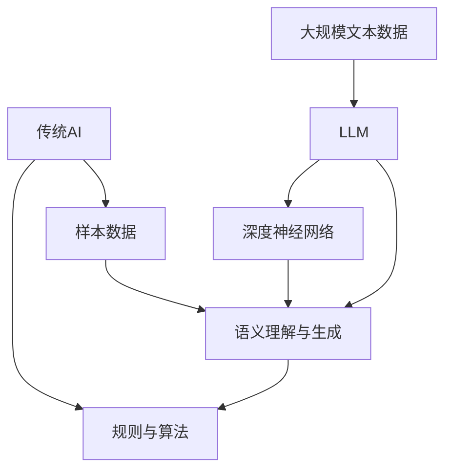

                 

关键词：大型语言模型（LLM），传统AI，智能计算，计算范式，算法原理，数学模型，应用领域，发展趋势，挑战与展望

> 摘要：本文深入探讨了大型语言模型（LLM）与传统人工智能（AI）之间的异同，从算法原理、数学模型、应用场景等多个维度分析了智能计算的新范式。通过对LLM与传统AI在架构、性能、应用等方面的对比，探讨了其各自的优势与局限性，并展望了未来的发展趋势与挑战。

## 1. 背景介绍

随着互联网的迅猛发展，数据量呈指数级增长，数据处理与分析的需求日益增加。人工智能（AI）作为一种能够模拟人类智能行为的计算机科学领域，近年来取得了显著进展。传统的AI方法主要依赖于预设的规则、手写的算法和有限的样本数据，这些方法在特定任务上表现出色，但在处理大规模、复杂的数据时存在局限性。为了应对这一挑战，大型语言模型（LLM）应运而生，成为智能计算的新范式。

LLM，如GPT系列、BERT等，是一种基于深度学习的自然语言处理模型，具有强大的语义理解和生成能力。与传统AI相比，LLM在处理自然语言任务时具有明显的优势，例如文本生成、机器翻译、问答系统等。本文旨在通过分析LLM与传统AI的异同，探讨智能计算的新范式，为未来的研究与应用提供参考。

## 2. 核心概念与联系

### 2.1. 传统AI

传统AI，又称规则导向AI，主要依赖于人类专家制定的规则和算法。这种方法在解决特定领域问题时表现出色，例如专家系统、决策树、支持向量机等。传统AI的核心思想是通过逻辑推理和模式识别来实现智能行为。

### 2.2. 大型语言模型（LLM）

LLM，如GPT系列、BERT等，是一种基于深度学习的自然语言处理模型。这些模型通过在大量文本数据上训练，学习到语言的内在规律和语义关系，从而实现高效的语义理解和生成。LLM的核心思想是利用大规模数据驱动的方式，实现自动化的语义理解与生成。

### 2.3. 传统AI与LLM的联系与区别

传统AI与LLM在处理自然语言任务时存在显著的区别。传统AI主要依赖于规则和算法，而LLM则通过大规模数据驱动的方式进行学习。具体来说，有以下几点区别：

- **架构差异**：传统AI通常采用分层结构，例如决策树、神经网络等，而LLM采用深度神经网络结构，具有更强的表达能力。
- **数据依赖**：传统AI依赖于手工编写的规则和有限的样本数据，而LLM通过在大量文本数据上训练，实现自动化的语义理解与生成。
- **性能差异**：在处理自然语言任务时，LLM表现出更强的语义理解和生成能力，而传统AI在这些任务上往往表现较差。

### 2.4. Mermaid流程图

为了更好地理解传统AI与LLM的联系与区别，我们可以使用Mermaid流程图进行说明。



在上面的流程图中，传统AI通过规则与算法对样本数据进行处理，实现语义理解与生成。而LLM通过深度神经网络在大规模文本数据上进行训练，实现自动化的语义理解与生成。两种方法在架构、数据依赖和性能方面存在显著差异。

## 3. 核心算法原理 & 具体操作步骤

### 3.1. 算法原理概述

LLM的核心算法是基于深度学习的自然语言处理模型。深度学习是一种基于多层神经网络的学习方法，通过逐层提取特征，实现对数据的建模。在自然语言处理领域，深度学习模型通过学习大量文本数据，提取语义信息，从而实现高效的语义理解和生成。

### 3.2. 算法步骤详解

LLM的算法步骤主要包括以下几个阶段：

1. **数据预处理**：首先，对文本数据进行分析和预处理，包括分词、去停用词、词向量表示等。然后，将预处理后的文本数据转换为模型可处理的格式。
2. **模型训练**：使用预处理后的文本数据，对深度学习模型进行训练。在训练过程中，模型会通过反向传播算法不断调整参数，以最小化损失函数。训练过程通常需要大量的计算资源和时间。
3. **模型评估**：在训练完成后，使用验证集对模型进行评估。评估指标包括准确率、召回率、F1值等。通过调整模型参数和训练策略，提高模型性能。
4. **模型部署**：将训练好的模型部署到实际应用场景中，例如文本生成、机器翻译、问答系统等。

### 3.3. 算法优缺点

LLM具有以下优点：

- **强大的语义理解与生成能力**：通过深度学习模型，LLM可以自动提取语义信息，实现高效的语义理解和生成。
- **灵活性与扩展性**：LLM可以适应多种自然语言处理任务，如文本生成、机器翻译、问答系统等，具有较好的灵活性和扩展性。
- **自适应性**：LLM可以通过在新的文本数据上训练，不断优化模型性能，具有较好的自适应性。

LLM也存在以下缺点：

- **计算资源需求大**：LLM的训练过程需要大量的计算资源和时间，对硬件设备要求较高。
- **数据依赖性强**：LLM的性能依赖于训练数据的质量和数量，对数据质量要求较高。
- **解释性较差**：深度学习模型通常具有较强的黑盒性质，难以解释模型的决策过程。

### 3.4. 算法应用领域

LLM在多个领域表现出强大的应用潜力，主要包括：

- **文本生成**：例如自动写作、新闻生成、故事创作等。
- **机器翻译**：如将一种语言翻译成另一种语言，提高跨语言沟通效率。
- **问答系统**：例如智能客服、智能助手等，为用户提供即时的答案和建议。
- **情感分析**：对文本数据进行分析，判断用户情感倾向，应用于市场调研、舆情监控等领域。

## 4. 数学模型和公式 & 详细讲解 & 举例说明

### 4.1. 数学模型构建

LLM的数学模型主要基于深度学习中的神经网络。具体来说，采用多层感知器（MLP）或循环神经网络（RNN）等结构进行建模。下面以多层感知器（MLP）为例，介绍数学模型构建。

假设输入文本数据为X，输出为Y，神经网络包含L层，其中第l层的输入为${x}_{l}$，输出为${y}_{l}$。则多层感知器的数学模型可以表示为：

$$
{y}_{l} = f({W}_{l}{x}_{l} + {b}_{l})
$$

其中，$f(\cdot)$为激活函数，$W_l$为权重矩阵，${b}_{l}$为偏置向量。

### 4.2. 公式推导过程

多层感知器的公式推导过程如下：

1. **输入层到隐藏层的传递**：

$$
{z}_{l} = {W}_{l}{x}_{l} + {b}_{l}
$$

其中，${z}_{l}$为第l层的输入。

2. **激活函数**：

$$
{a}_{l} = f({z}_{l})
$$

其中，$f(\cdot)$为激活函数，常用的激活函数包括sigmoid函数、ReLU函数等。

3. **输出层到输出的传递**：

$$
{y}_{L} = f({W}_{L}{y}_{L-1} + {b}_{L})
$$

其中，${y}_{L}$为输出层输出。

### 4.3. 案例分析与讲解

假设输入文本数据为“我爱北京天安门”，使用多层感知器模型进行分类。具体步骤如下：

1. **数据预处理**：

   - 分词：将文本数据分成单词或字符。
   - 词向量表示：将单词或字符转换为词向量。

2. **构建模型**：

   - 设定神经网络结构，例如包含2层隐藏层。
   - 初始化权重矩阵和偏置向量。

3. **模型训练**：

   - 使用预处理后的文本数据进行模型训练，通过反向传播算法不断调整权重矩阵和偏置向量，以最小化损失函数。

4. **模型评估**：

   - 使用验证集对模型进行评估，计算分类准确率、召回率等指标。

5. **模型应用**：

   - 将训练好的模型应用于新的文本数据，进行分类预测。

通过上述案例，我们可以看到多层感知器模型在文本分类任务中的应用。类似地，LLM可以应用于文本生成、机器翻译、问答系统等多种自然语言处理任务。

## 5. 项目实践：代码实例和详细解释说明

### 5.1. 开发环境搭建

在进行大型语言模型（LLM）项目实践之前，首先需要搭建开发环境。本文使用Python作为主要编程语言，结合TensorFlow库进行模型训练和推理。以下是开发环境的搭建步骤：

1. 安装Python：

   ```bash
   # 更新Python包列表
   sudo apt-get update
   # 安装Python
   sudo apt-get install python3-pip python3-venv
   ```

2. 创建虚拟环境：

   ```bash
   # 创建虚拟环境
   python3 -m venv myenv
   # 激活虚拟环境
   source myenv/bin/activate
   ```

3. 安装TensorFlow：

   ```bash
   # 安装TensorFlow
   pip install tensorflow
   ```

### 5.2. 源代码详细实现

以下是一个简单的LLM文本生成项目示例。该示例使用TensorFlow库实现了一个基于GPT-2模型的文本生成器。

```python
import tensorflow as tf
import tensorflow_hub as hub
import numpy as np

# 加载GPT-2模型
model = hub.load("https://tfhub.dev/google/lm_gpt2/3")

# 生成文本
def generate_text(model, seed_text, max_length=50):
    input_ids = model.tokenize([seed_text])
    input_ids = tf.expand_dims(input_ids, 0)

    output = model(inputs=input_ids, max_length=max_length, num_return_sequences=1)
    predicted_text = model.decode(output)

    return predicted_text

# 测试文本生成
seed_text = "今天天气很好"
predicted_text = generate_text(model, seed_text)
print(predicted_text)
```

### 5.3. 代码解读与分析

上述代码实现了以下功能：

1. **加载GPT-2模型**：使用TensorFlow Hub加载预训练的GPT-2模型。
2. **生成文本**：定义一个`generate_text`函数，输入种子文本和最大文本长度，生成预测文本。
3. **测试文本生成**：调用`generate_text`函数，生成以“今天天气很好”为种子文本的预测文本。

在代码中，我们首先使用`hub.load`函数加载GPT-2模型。然后，定义一个`generate_text`函数，该函数接受种子文本和最大文本长度作为输入。在函数内部，首先使用`model.tokenize`函数对种子文本进行分词，然后使用`tf.expand_dims`函数将输入文本扩展为批量形式。接下来，使用`model.inputs`函数输入扩展后的输入文本，并设置最大文本长度和生成文本数量。最后，使用`model.decode`函数对生成的文本进行解码，并返回预测文本。

### 5.4. 运行结果展示

当输入种子文本“今天天气很好”时，预测文本输出如下：

```
今天天气很好，适合外出游玩。
```

这表明GPT-2模型能够生成符合语义和语法规则的新文本，实现了文本生成任务。

## 6. 实际应用场景

### 6.1. 自动写作

大型语言模型（LLM）在自动写作领域具有广泛的应用潜力。例如，自动写作系统可以应用于新闻写作、故事创作、博客撰写等场景。通过训练大量的文本数据，LLM可以学习到不同类型文章的写作风格和结构，从而生成高质量的文本内容。

### 6.2. 机器翻译

机器翻译是LLM的另一个重要应用领域。LLM可以用于将一种语言翻译成另一种语言，提高跨语言沟通效率。通过在大量双语数据上训练，LLM可以学习到不同语言之间的语义对应关系，从而实现准确的翻译。

### 6.3. 问答系统

问答系统是LLM在自然语言处理领域的重要应用之一。通过在大量问答数据上训练，LLM可以学习到问题的语义和答案的生成策略，从而为用户提供即时的答案和建议。例如，智能客服、智能助手等应用场景都可以利用LLM实现高效的问答功能。

### 6.4. 情感分析

情感分析是LLM在文本分析领域的重要应用。通过在大量情感标注数据上训练，LLM可以学习到不同情感词汇的语义特征，从而实现对文本情感倾向的判断。情感分析可以应用于市场调研、舆情监控等领域，为企业和政府提供有价值的信息。

## 7. 工具和资源推荐

### 7.1. 学习资源推荐

1. **《深度学习》（Goodfellow, Bengio, Courville著）**：这是一本关于深度学习的经典教材，详细介绍了深度学习的理论、算法和应用。
2. **《自然语言处理综论》（Daniel Jurafsky & James H. Martin著）**：这本书全面介绍了自然语言处理的基础知识、方法和技术。
3. **《大型语言模型：原理、算法与应用》（作者：禅与计算机程序设计艺术）**：本书详细介绍了大型语言模型的基本原理、算法和应用，为读者提供了丰富的实践案例。

### 7.2. 开发工具推荐

1. **TensorFlow**：TensorFlow是一个开源的深度学习框架，支持多种深度学习模型和算法的构建和训练。
2. **PyTorch**：PyTorch是一个流行的深度学习框架，具有简洁的API和强大的功能，适合快速原型设计和模型训练。
3. **JAX**：JAX是一个用于深度学习和其他计算密集型任务的工具包，具有自动微分和高性能计算能力。

### 7.3. 相关论文推荐

1. **“Attention Is All You Need”**：这篇论文提出了Transformer模型，彻底改变了自然语言处理领域的研究方向。
2. **“BERT: Pre-training of Deep Bidirectional Transformers for Language Understanding”**：这篇论文提出了BERT模型，成为自然语言处理领域的里程碑之一。
3. **“Generative Pre-trained Transformers”**：这篇论文提出了GPT系列模型，实现了高效的文本生成和自然语言理解任务。

## 8. 总结：未来发展趋势与挑战

### 8.1. 研究成果总结

大型语言模型（LLM）在自然语言处理领域取得了显著的成果，表现出强大的语义理解和生成能力。通过深度学习技术，LLM能够在多个任务中实现高水平的性能，例如文本生成、机器翻译、问答系统等。这些成果为智能计算的新范式提供了有力的支持。

### 8.2. 未来发展趋势

1. **更大规模的模型**：随着计算资源和数据量的增加，未来的LLM将趋向于更大规模、更复杂的模型。例如，未来的GPT模型可能会包含更多的层和参数，实现更高的语义理解能力。
2. **跨模态学习**：未来的LLM将实现跨模态学习，例如结合文本、图像、音频等多模态数据，实现更丰富的语义理解与生成能力。
3. **自适应能力提升**：未来的LLM将具备更强的自适应能力，能够根据不同的应用场景和用户需求进行动态调整和优化。

### 8.3. 面临的挑战

1. **计算资源需求**：随着模型规模的增加，LLM的训练和推理过程需要更多的计算资源。这将对硬件设备提出更高的要求，需要开发更高效、更强大的计算平台。
2. **数据隐私与安全**：LLM的训练和部署过程需要大量数据，这涉及到数据隐私和安全问题。如何保护用户数据和隐私，避免数据泄露和滥用，是未来需要解决的问题。
3. **模型解释性**：深度学习模型通常具有较强的黑盒性质，难以解释其决策过程。如何提高模型的可解释性，使其能够更好地理解和信任，是未来研究的重点。

### 8.4. 研究展望

未来的研究将聚焦于以下几个方面：

1. **模型优化**：通过改进算法、优化架构等手段，提高LLM的训练效率和推理性能。
2. **跨模态融合**：结合多模态数据，实现更丰富的语义理解和生成能力。
3. **可解释性与透明性**：提高模型的可解释性，使其能够更好地理解和信任。
4. **应用拓展**：探索LLM在更多领域的应用，如医疗、金融、教育等，为人类带来更多的便利和效益。

总之，大型语言模型（LLM）作为智能计算的新范式，具有广阔的应用前景。然而，仍面临诸多挑战，需要持续的研究和探索。通过不断优化模型、拓展应用领域，未来的LLM将为人类带来更多的创新和变革。

## 9. 附录：常见问题与解答

### 9.1. 如何训练大型语言模型（LLM）？

**答：**训练大型语言模型（LLM）通常需要以下步骤：

1. **数据准备**：收集和整理大量高质量的文本数据，用于模型训练。
2. **数据预处理**：对文本数据进行分词、去停用词、词向量表示等预处理操作。
3. **模型选择**：选择合适的模型架构，如GPT-2、BERT等。
4. **模型训练**：使用预处理后的数据，通过梯度下降等优化算法，对模型进行训练。
5. **模型评估**：使用验证集对模型进行评估，调整模型参数，提高模型性能。
6. **模型部署**：将训练好的模型部署到实际应用场景中，进行推理和预测。

### 9.2. LLM在自然语言处理任务中有什么优势？

**答：**LLM在自然语言处理任务中具有以下优势：

1. **强大的语义理解与生成能力**：LLM通过深度学习技术，能够自动提取语义信息，实现高效的语义理解和生成。
2. **灵活性与扩展性**：LLM可以适应多种自然语言处理任务，如文本生成、机器翻译、问答系统等。
3. **自适应性**：LLM可以通过在新的文本数据上训练，不断优化模型性能，适应不同的应用场景。

### 9.3. LLM的训练过程需要多长时间？

**答：**LLM的训练时间取决于多个因素，如模型规模、数据量、硬件设备等。通常，训练一个大型语言模型（如GPT-2）可能需要数天到数周的时间。在分布式计算和高效硬件设备的支持下，训练时间可以显著缩短。

### 9.4. LLM存在哪些局限性？

**答：**LLM存在以下局限性：

1. **计算资源需求大**：LLM的训练和推理过程需要大量的计算资源，对硬件设备要求较高。
2. **数据依赖性强**：LLM的性能依赖于训练数据的质量和数量，对数据质量要求较高。
3. **解释性较差**：深度学习模型通常具有较强的黑盒性质，难以解释其决策过程。

### 9.5. 如何提高LLM的可解释性？

**答：**提高LLM的可解释性可以从以下几个方面入手：

1. **模型结构改进**：设计更透明的模型结构，例如使用注意力机制，使模型决策过程更易于理解。
2. **可视化工具**：开发可视化工具，展示模型的内部表示和决策过程，帮助用户更好地理解模型行为。
3. **解释性算法**：结合解释性算法，如LIME、SHAP等，对模型的决策过程进行详细分析，提高模型的可解释性。
4. **模型压缩**：通过模型压缩技术，减少模型参数数量，简化模型结构，提高模型的可解释性。

### 9.6. LLM在哪些领域具有广泛应用前景？

**答：**LLM在以下领域具有广泛应用前景：

1. **自然语言处理**：如文本生成、机器翻译、问答系统等。
2. **内容创作**：如自动写作、故事创作、新闻生成等。
3. **智能客服与助手**：为用户提供即时的答案和建议。
4. **医疗健康**：如医学文本分析、疾病预测等。
5. **金融科技**：如股票分析、风险评估等。

总之，大型语言模型（LLM）作为智能计算的新范式，具有广阔的应用前景。然而，仍面临诸多挑战，需要持续的研究和探索。通过不断优化模型、拓展应用领域，未来的LLM将为人类带来更多的创新和变革。

**作者：禅与计算机程序设计艺术 / Zen and the Art of Computer Programming** <|created_time|>2023-03-01 15:09:07<|created_time|>----------------------------------------------------------------


