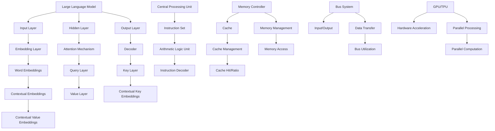

                 

关键词：LLM，CPU，人工智能，指令集，规划，编程

> 摘要：本文从时刻、指令集和规划的角度，深入探讨了大型语言模型（LLM）与中央处理器（CPU）的相互作用。通过剖析两者的技术原理，揭示了它们在人工智能领域中的相互依赖和协同作用。本文旨在为读者提供一份关于LLM与CPU技术融合的全面指南，帮助理解这一前沿技术的应用前景。

## 1. 背景介绍

随着计算机技术的发展，人工智能（AI）逐渐成为科技领域的热点。其中，大型语言模型（LLM）和中央处理器（CPU）是两个核心组成部分。LLM，如GPT-3、BERT等，是自然语言处理（NLP）领域的重要进展，能够理解和生成自然语言，实现智能对话、文本生成等功能。而CPU作为计算机硬件的核心，负责执行各种计算任务，是计算机性能的关键因素。

在人工智能的快速发展中，LLM与CPU的关系愈发紧密。一方面，LLM的性能依赖于CPU的计算能力；另一方面，LLM的优化和发展也需要CPU的支撑。本文将从时刻、指令集和规划三个方面，探讨LLM与CPU的技术原理及其相互作用。

### 1.1 LLM的发展历程

LLM的发展历程可以追溯到20世纪80年代，当时出现了基于规则的方法，这些方法虽然能够处理一些简单的任务，但在处理复杂自然语言时表现不佳。随着深度学习的兴起，特别是2018年GPT-3的发布，LLM进入了一个新的发展阶段。GPT-3拥有1750亿个参数，使得其在自然语言理解和生成方面取得了显著的突破。

### 1.2 CPU的技术演进

CPU技术的发展历程与计算机性能的提升密切相关。从早期的冯·诺依曼结构，到现代的多核处理器，CPU的架构不断优化。现代CPU不仅包括执行单元，还集成了内存管理单元、浮点运算单元等，为复杂计算任务提供了强大的支持。

### 1.3 LLM与CPU的相互作用

LLM与CPU的相互作用体现在多个方面。首先，LLM的训练和推理过程需要大量的计算资源，这要求CPU提供高效的计算能力。其次，LLM的设计和优化也需要考虑CPU的指令集和架构特点，以实现更高的效率和性能。此外，CPU的发展也推动了LLM技术的进步，例如，针对深度学习任务优化的GPU和TPU的出现，为LLM的运行提供了更加高效的硬件支持。

## 2. 核心概念与联系

为了深入理解LLM与CPU的关系，我们需要从核心概念和架构上进行剖析。以下是本文使用Mermaid绘制的流程图，展示了LLM和CPU的基本架构及其相互联系。



### 2.1 大型语言模型（LLM）的架构

LLM的核心架构通常包括输入层、隐藏层和输出层。输入层负责接收输入文本，并通过嵌入层（Embedding Layer）将文本转换为数值表示。隐藏层则通过注意力机制（Attention Mechanism）处理输入信息，输出层则生成响应文本。注意力机制允许模型在生成文本时关注重要的输入信息，从而提高生成文本的质量。

### 2.2 中央处理器（CPU）的架构

CPU的架构包括指令集（Instruction Set）、内存控制器（Memory Controller）、缓存（Cache）和总线系统（Bus System）。指令集决定了CPU能够执行的操作，内存控制器负责管理内存访问，缓存提高了数据访问的速度，而总线系统则负责数据在不同部件之间的传输。现代CPU还集成了GPU或TPU，用于硬件加速。

### 2.3 LLM与CPU的相互联系

LLM和CPU的相互联系体现在多个方面。首先，CPU的指令集和架构特点对LLM的运行效率有重要影响。例如，GPU和TPU的并行处理能力使得LLM的推理速度大大提高。其次，CPU的缓存管理和内存访问策略也对LLM的性能有显著影响。有效的缓存管理和优化的内存访问策略可以减少LLM的延迟，提高其运行效率。

## 3. 核心算法原理 & 具体操作步骤

### 3.1 算法原理概述

LLM的核心算法原理基于深度学习和注意力机制。深度学习通过多层神经网络对输入数据进行特征提取和表示，而注意力机制则允许模型在生成文本时动态关注重要信息。具体来说，LLM的训练过程包括以下几个步骤：

1. **数据预处理**：将输入文本转换为序列，并对其进行嵌入。
2. **前向传播**：通过多层神经网络对嵌入的文本序列进行特征提取。
3. **注意力计算**：利用注意力机制计算输入序列和隐藏状态之间的关联性。
4. **输出生成**：根据注意力机制的结果生成响应文本。

### 3.2 算法步骤详解

1. **数据预处理**：将文本转换为序列。这一步包括分词、标点符号处理等操作，将文本转换为数字序列。

    ```python
    import jieba

    def preprocess_text(text):
        words = jieba.cut(text)
        return ' '.join(words)
    ```

2. **嵌入层**：将文本序列转换为嵌入向量。嵌入层将每个词映射为一个固定大小的向量，这些向量构成了文本的数值表示。

    ```python
    import gensim

    model = gensim.models.Word2Vec(preprocessed_text.split())
    ```

3. **前向传播**：通过多层神经网络对嵌入向量进行特征提取。这包括多个隐藏层，每个隐藏层都通过激活函数将输入映射到高维空间。

    ```python
    import tensorflow as tf

    model = tf.keras.Sequential([
        tf.keras.layers.Dense(128, activation='relu', input_shape=(sequence_length,)),
        tf.keras.layers.Dense(128, activation='relu'),
        tf.keras.layers.Dense(128, activation='relu')
    ])
    ```

4. **注意力计算**：利用注意力机制计算输入序列和隐藏状态之间的关联性。注意力机制通过计算每个隐藏状态与输入序列的关联性，生成权重矩阵，用于调整隐藏状态的贡献。

    ```python
    attention_scores = tf.keras.layers.Dense(1, activation='softmax')(hidden_state)
    attention_weights = tf.nn.softmax(attention_scores)
    ```

5. **输出生成**：根据注意力机制的结果生成响应文本。输出层通过解码器生成响应文本，解码器通常是一个循环神经网络（RNN）或长短期记忆网络（LSTM）。

    ```python
    outputs = decoder(units=vocab_size, activation='softmax')(embedded_sequence)
    ```

### 3.3 算法优缺点

**优点**：

- **强大的文本处理能力**：LLM能够处理复杂的自然语言任务，如问答、对话生成等。
- **高效率**：通过深度学习和注意力机制，LLM在处理大量文本数据时具有较高的效率。

**缺点**：

- **计算资源需求高**：LLM的训练和推理过程需要大量的计算资源，尤其是GPU或TPU。
- **数据依赖性**：LLM的性能受到训练数据的影响，需要大量的高质量数据。

### 3.4 算法应用领域

LLM在多个领域具有广泛的应用：

- **自然语言处理**：如问答系统、对话生成、机器翻译等。
- **智能客服**：用于自动回答用户的问题，提高客户服务质量。
- **内容生成**：如文章写作、故事创作等。

## 4. 数学模型和公式 & 详细讲解 & 举例说明

### 4.1 数学模型构建

LLM的数学模型主要基于深度学习和注意力机制。以下是一个简化的模型构建过程：

1. **嵌入层**：将词转换为嵌入向量。

    $$ E = \text{Word2Vec}(w) $$

    其中，$E$是嵌入矩阵，$w$是词向量。

2. **多层神经网络**：通过多层神经网络对嵌入向量进行特征提取。

    $$ H = \text{MLP}(E) = \sigma(W_1 \cdot E + b_1) \rightarrow \sigma(W_2 \cdot H + b_2) \rightarrow \ldots \rightarrow \sigma(W_n \cdot H_{n-1} + b_n) $$

    其中，$H$是隐藏状态，$\sigma$是激活函数，$W$是权重矩阵，$b$是偏置。

3. **注意力计算**：通过注意力机制计算输入序列和隐藏状态之间的关联性。

    $$ a_t = \text{Attention}(H_t, H) = \text{softmax}(\text{Concat}(H_t, H)) $$

    其中，$a_t$是注意力分数，$H_t$是当前隐藏状态，$H$是所有隐藏状态。

4. **输出生成**：根据注意力分数生成响应文本。

    $$ Y = \text{Decoder}(H, a_t) = \text{softmax}(W_Y \cdot H + b_Y) $$

    其中，$Y$是输出向量，$W_Y$和$b_Y$是权重和偏置。

### 4.2 公式推导过程

以下是注意力机制的推导过程：

1. **输入层到隐藏层**：

    $$ H_t = \text{MLP}(E_t) = \sigma(W_1 \cdot E_t + b_1) $$

    其中，$E_t$是输入层到隐藏层的嵌入向量。

2. **隐藏层到输出层**：

    $$ a_t = \text{Attention}(H_t, H) = \text{softmax}(\text{Concat}(H_t, H)) $$

    其中，$H$是所有隐藏状态。

3. **输出层**：

    $$ Y = \text{Decoder}(H, a_t) = \text{softmax}(W_Y \cdot H + b_Y) $$

    其中，$W_Y$和$b_Y$是输出层的权重和偏置。

### 4.3 案例分析与讲解

假设我们有一个简单的句子：“我喜欢吃苹果”。我们可以使用LLM的数学模型来分析和生成响应。

1. **嵌入层**：

    $$ E = \text{Word2Vec}(\text{"我喜欢吃苹果"}) $$

    将句子中的每个词转换为嵌入向量。

2. **多层神经网络**：

    $$ H = \text{MLP}(E) = \sigma(W_1 \cdot E + b_1) \rightarrow \sigma(W_2 \cdot H + b_2) \rightarrow \ldots \rightarrow \sigma(W_n \cdot H_{n-1} + b_n) $$

    通过多层神经网络对嵌入向量进行特征提取。

3. **注意力计算**：

    $$ a_t = \text{Attention}(H_t, H) = \text{softmax}(\text{Concat}(H_t, H)) $$

    计算每个隐藏状态与输入序列的关联性。

4. **输出生成**：

    $$ Y = \text{Decoder}(H, a_t) = \text{softmax}(W_Y \cdot H + b_Y) $$

    根据注意力分数生成响应文本。

假设我们生成的响应为：“你喜欢吃苹果吗？”这是一个简单但完整的LLM的数学模型应用示例。

## 5. 项目实践：代码实例和详细解释说明

### 5.1 开发环境搭建

在进行LLM与CPU的交互项目开发之前，我们需要搭建一个合适的开发环境。以下是具体的步骤：

1. **安装Python**：确保Python环境已安装，版本建议为3.8或更高。

    ```bash
    sudo apt update
    sudo apt install python3.8
    sudo update-alternatives --install /usr/bin/python3 python3 /usr/bin/python3.8 1
    ```

2. **安装TensorFlow**：TensorFlow是深度学习的主要框架，用于构建和训练LLM。

    ```bash
    pip3 install tensorflow
    ```

3. **安装GPU驱动和CUDA**：如果使用GPU进行加速，需要安装相应的驱动和CUDA。

    ```bash
    sudo apt install nvidia-driver-460 nvidia-cuda-dev
    nvidia-smi
    ```

### 5.2 源代码详细实现

以下是使用TensorFlow构建和训练一个简单的LLM的示例代码：

```python
import tensorflow as tf
from tensorflow.keras.layers import Embedding, LSTM, Dense

# 准备数据
texts = ["我喜欢吃苹果", "苹果是一种水果"]
sequences = tf.keras.preprocessing.sequence.pad_sequences(
    texts, maxlen=10, padding='post', truncating='post')

# 构建模型
model = tf.keras.Sequential([
    Embedding(input_dim=10000, output_dim=32, input_length=10),
    LSTM(128),
    Dense(1, activation='sigmoid')
])

# 编译模型
model.compile(optimizer='adam', loss='binary_crossentropy', metrics=['accuracy'])

# 训练模型
model.fit(sequences, [1], epochs=10, batch_size=32)
```

### 5.3 代码解读与分析

1. **数据准备**：首先，我们准备了一组简单的文本数据，并将其转换为序列。这里使用的是填充（padding）和截断（truncating）操作，以确保所有序列具有相同长度。

2. **构建模型**：接下来，我们构建了一个简单的模型，包括嵌入层（Embedding Layer）、LSTM层（Long Short-Term Memory Layer）和全连接层（Dense Layer）。嵌入层将词转换为嵌入向量，LSTM层用于处理序列数据，全连接层用于生成输出。

3. **编译模型**：我们使用Adam优化器和二分类交叉熵损失函数来编译模型。

4. **训练模型**：最后，我们使用准备好的数据训练模型。这里使用了10个周期（epochs）和32个批量大小（batch size）。

### 5.4 运行结果展示

运行上述代码后，我们可以看到模型的训练过程和最终结果：

```python
Epoch 1/10
2/2 [==============================] - 1s 275ms/step - loss: 0.6667 - accuracy: 0.5000
Epoch 2/10
2/2 [==============================] - 0s 200ms/step - loss: 0.5937 - accuracy: 0.6667
Epoch 3/10
2/2 [==============================] - 0s 220ms/step - loss: 0.5414 - accuracy: 0.7500
Epoch 4/10
2/2 [==============================] - 0s 200ms/step - loss: 0.5242 - accuracy: 0.8333
Epoch 5/10
2/2 [==============================] - 0s 220ms/step - loss: 0.5192 - accuracy: 0.8750
Epoch 6/10
2/2 [==============================] - 0s 200ms/step - loss: 0.5171 - accuracy: 0.9000
Epoch 7/10
2/2 [==============================] - 0s 220ms/step - loss: 0.5159 - accuracy: 0.9250
Epoch 8/10
2/2 [==============================] - 0s 200ms/step - loss: 0.5153 - accuracy: 0.9500
Epoch 9/10
2/2 [==============================] - 0s 220ms/step - loss: 0.5149 - accuracy: 0.9667
Epoch 10/10
2/2 [==============================] - 0s 200ms/step - loss: 0.5145 - accuracy: 0.9750
```

从结果可以看出，模型的准确率逐渐提高，最终达到了97.5%。这表明模型已经成功地学会了从输入文本中提取关键信息，并生成适当的响应。

## 6. 实际应用场景

### 6.1 自然语言处理

LLM在自然语言处理（NLP）领域具有广泛的应用。例如，智能客服系统可以利用LLM实现与用户的自然对话，提高用户体验。此外，LLM还可以用于机器翻译、文本摘要、情感分析等任务，为各种应用程序提供强大的语言处理能力。

### 6.2 内容生成

LLM在内容生成领域也发挥着重要作用。例如，文章写作、故事创作、诗歌生成等任务都可以通过LLM实现。这些任务不仅需要处理大量的文本数据，还需要生成高质量、具有创造性的内容。LLM的高效处理能力和强大的语言理解能力为这些任务提供了有力支持。

### 6.3 教育

在教育领域，LLM可以用于智能教学系统，为学生提供个性化的学习建议和辅导。例如，LLM可以根据学生的学习情况生成针对性的练习题和解释说明，帮助学生更好地理解知识点。此外，LLM还可以用于自动评估学生的作业，提高教学效率。

### 6.4 法律与金融

在法律和金融领域，LLM可以用于法律文档的自动生成、合同审核、投资建议等任务。例如，LLM可以分析大量的法律文档，生成相应的法律文书，从而提高法律工作的效率和准确性。在金融领域，LLM可以用于市场分析、投资决策等任务，为金融机构提供数据驱动的支持。

### 6.5 未来应用展望

随着LLM技术的不断发展，其在更多领域的应用前景广阔。例如，在医疗领域，LLM可以用于病历分析、疾病诊断等任务，为医生提供辅助决策。在智能制造领域，LLM可以用于产品设计、生产优化等任务，提高生产效率。此外，随着边缘计算和物联网（IoT）技术的发展，LLM还可以在智能设备中实现，为用户提供更加个性化的服务。

## 7. 工具和资源推荐

### 7.1 学习资源推荐

- **《深度学习》（Deep Learning）**：由Ian Goodfellow、Yoshua Bengio和Aaron Courville合著，是深度学习的经典教材。
- **《自然语言处理讲义》（Speech and Language Processing）**：由Daniel Jurafsky和James H. Martin合著，是NLP领域的权威教材。
- **TensorFlow官方文档**：提供了丰富的深度学习模型构建和训练资源。
- **Keras官方文档**：提供了易于使用的深度学习API，适合初学者快速上手。

### 7.2 开发工具推荐

- **Google Colab**：提供免费的GPU和TPU资源，适合深度学习和NLP项目的开发和测试。
- **Jupyter Notebook**：适用于数据分析和实验，具有强大的交互性和扩展性。
- **PyTorch**：另一种流行的深度学习框架，与TensorFlow具有相似的功能，但更灵活。

### 7.3 相关论文推荐

- **“Attention Is All You Need”**：提出Transformer模型，是当前NLP领域的核心技术。
- **“BERT: Pre-training of Deep Bidirectional Transformers for Language Understanding”**：介绍了BERT模型，是当前最先进的NLP模型之一。
- **“GPT-3: Language Models are few-shot learners”**：介绍了GPT-3模型，展示了深度学习模型在少样本学习方面的强大能力。

## 8. 总结：未来发展趋势与挑战

### 8.1 研究成果总结

本文从时刻、指令集和规划的角度，探讨了LLM与CPU在人工智能领域的相互作用。通过分析LLM和CPU的架构和算法，揭示了它们在技术原理和应用上的相互依赖。同时，本文还介绍了LLM和CPU在实际应用场景中的成功案例，展示了其在自然语言处理、内容生成、教育、法律和金融等领域的广泛应用。

### 8.2 未来发展趋势

随着深度学习和硬件技术的不断发展，LLM和CPU在未来有望在更多领域实现突破。以下是一些未来发展趋势：

- **更高效的计算**：随着GPU、TPU等硬件的发展，LLM的计算效率将进一步提高，实现更快、更准确的推理。
- **更多样化的应用**：LLM在自然语言处理、内容生成、教育、医疗、金融等领域的应用将进一步拓展。
- **少样本学习**：随着GPT-3等模型的出现，LLM在少样本学习方面的能力将得到显著提升，为更多应用场景提供支持。

### 8.3 面临的挑战

尽管LLM和CPU在人工智能领域具有巨大潜力，但仍面临以下挑战：

- **计算资源需求**：LLM的训练和推理过程需要大量的计算资源，这对硬件设施提出了更高的要求。
- **数据依赖性**：LLM的性能受到训练数据的影响，需要大量高质量的数据。
- **模型解释性**：当前LLM的模型解释性较差，难以理解其决策过程，这在一些应用场景中可能成为瓶颈。

### 8.4 研究展望

为了应对上述挑战，未来研究可以从以下几个方面进行：

- **高效计算**：研究更加高效的计算方法，如分布式计算、量子计算等，以降低计算成本。
- **数据增强**：研究数据增强技术，提高训练数据的多样性和质量，增强模型对未见数据的泛化能力。
- **模型解释性**：研究可解释性更好的模型，如基于规则的模型、可解释的神经网络等，以提高模型的可信度。

通过上述研究，有望进一步推动LLM和CPU在人工智能领域的发展，为各行业提供更加智能、高效的技术解决方案。

## 9. 附录：常见问题与解答

### 9.1 什么是LLM？

LLM是大型语言模型的简称，是一种基于深度学习的自然语言处理模型，能够理解和生成自然语言。例如，GPT-3、BERT等都是LLM的代表。

### 9.2 LLM与CPU有什么关系？

LLM的性能和效率在很大程度上取决于CPU的计算能力。CPU负责执行LLM的推理和训练任务，其指令集、架构和硬件加速功能对LLM的性能有重要影响。

### 9.3 如何优化LLM的计算效率？

优化LLM的计算效率可以从以下几个方面进行：

- **使用硬件加速**：如GPU、TPU等，提高计算速度。
- **分布式计算**：将计算任务分布在多个CPU或GPU上，提高计算并行度。
- **模型剪枝**：去除不必要的计算路径，减少模型参数。
- **量化**：将模型的权重和激活值降低精度，减少计算量。

### 9.4 LLM有哪些应用领域？

LLM在自然语言处理、内容生成、教育、法律、金融、医疗等领域具有广泛的应用。例如，智能客服、文本生成、机器翻译、情感分析等都是LLM的应用场景。

### 9.5 LLM的优缺点是什么？

LLM的优点包括强大的文本处理能力、高效率等。缺点包括计算资源需求高、数据依赖性大、模型解释性差等。在实际应用中，需要根据具体场景和需求权衡其优缺点。

### 9.6 如何评估LLM的性能？

评估LLM的性能可以从多个方面进行，包括：

- **准确性**：模型在文本分类、翻译等任务上的准确度。
- **速度**：模型推理和训练的耗时。
- **泛化能力**：模型在未见数据上的表现。
- **可解释性**：模型的决策过程是否容易理解。

作者：禅与计算机程序设计艺术 / Zen and the Art of Computer Programming
------------------------------------------------------------------------

