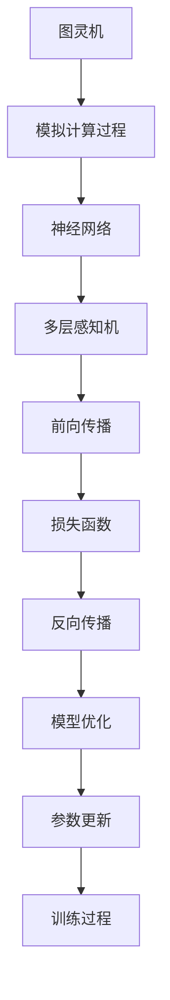

                 

关键词：大型语言模型（LLM），海量参数，推理过程，分布式计算，优化算法，模型压缩

> 摘要：本文将深入探讨大型语言模型（LLM）在处理海量参数和推理过程中的关键技术，包括分布式计算、模型压缩和优化算法。通过对LLM核心原理的阐述，结合具体案例和实践，分析其在实际应用中的挑战和未来发展方向。

## 1. 背景介绍

随着深度学习技术的不断发展，大型语言模型（LLM）如BERT、GPT等逐渐成为自然语言处理（NLP）领域的明星。这些模型以其强大的表征能力和出色的性能，在各种任务中取得了显著的成果。然而，LLM的一个显著特点是模型参数量巨大，例如GPT-3拥有超过1750亿个参数。这给模型的训练、存储和推理带来了巨大挑战。

### 1.1 大型语言模型的发展历程

- 2000年代初：基于统计的NLP方法，如统计语言模型和隐马尔可夫模型（HMM）。
- 2013年：神经机器翻译的突破，带动神经网络在NLP领域的广泛应用。
- 2018年：BERT的提出，开创了预训练语言模型的新时代。
- 2020年至今：GPT-3等超大规模模型的问世，进一步推动了LLM的发展。

### 1.2 大型语言模型的特点

- 参数量庞大：以GPT-3为例，其参数量超过1750亿个，远超传统模型。
- 需要大量训练数据：LLM的训练需要数以百万计的文本数据。
- 长期依赖和上下文理解能力强：LLM能够捕捉到文本中的长期依赖关系，实现更准确的上下文理解。

## 2. 核心概念与联系

在深入探讨LLM管理海量参数和推理过程之前，我们需要理解一些核心概念，如图灵机、神经网络、反向传播算法等。以下是这些概念及其在LLM中的应用的Mermaid流程图：



### 2.1 图灵机

图灵机是一种抽象的计算模型，由英国数学家艾伦·图灵提出。图灵机的核心思想是通过一系列简单的操作来模拟人类思维过程。在LLM中，图灵机的概念体现在对文本序列的逐词编码和处理。

### 2.2 神经网络

神经网络是由大量神经元组成的计算模型，可以模拟人脑的神经活动。在LLM中，神经网络用于捕捉文本数据的复杂模式。常见的神经网络结构包括多层感知机（MLP）、卷积神经网络（CNN）和递归神经网络（RNN）等。

### 2.3 反向传播算法

反向传播算法是一种用于训练神经网络的算法。它通过计算损失函数关于模型参数的梯度，来更新模型参数，从而优化模型性能。在LLM的训练过程中，反向传播算法是必不可少的。

## 3. 核心算法原理 & 具体操作步骤

### 3.1 算法原理概述

LLM的核心算法主要包括分布式计算、模型压缩和优化算法。这些算法旨在解决模型参数量巨大、训练和推理速度慢的问题。

### 3.2 算法步骤详解

#### 3.2.1 分布式计算

分布式计算是将计算任务分布在多个节点上执行，以加速计算速度和提高计算效率。在LLM中，分布式计算主要用于模型训练和推理。

- **模型训练**：将模型参数分布到多个节点，每个节点负责一部分参数的更新。通过同步或异步方式，将各节点的更新结果合并，更新全局模型参数。
- **模型推理**：将输入数据分布到多个节点，每个节点负责计算一部分输出。通过聚合各节点的输出结果，得到最终输出。

#### 3.2.2 模型压缩

模型压缩是通过减少模型参数数量，降低模型复杂度，从而提高计算效率和存储效率。常见的模型压缩方法包括剪枝、量化、知识蒸馏等。

- **剪枝**：通过剪掉模型中不重要的参数或神经元，减少模型参数数量。
- **量化**：将模型参数的精度降低，从而减少模型存储空间和计算复杂度。
- **知识蒸馏**：将一个大模型（教师模型）的知识传递给一个小模型（学生模型），从而降低学生模型的参数数量。

#### 3.2.3 优化算法

优化算法用于调整模型参数，使其在训练过程中达到最优状态。常见的优化算法包括随机梯度下降（SGD）、Adam、AdamW等。

- **随机梯度下降（SGD）**：在训练过程中，随机选择一部分样本，计算其梯度并更新模型参数。
- **Adam**：结合SGD和动量法的优化算法，具有更好的收敛速度和稳定性。
- **AdamW**：在Adam的基础上，引入权重衰减，进一步优化模型参数。

### 3.3 算法优缺点

#### 分布式计算

- **优点**：提高计算速度和效率，降低单个节点的计算负担。
- **缺点**：需要复杂的通信机制，可能导致通信开销增加。

#### 模型压缩

- **优点**：降低模型复杂度，提高计算效率和存储效率。
- **缺点**：可能影响模型性能，需要平衡压缩比和性能。

#### 优化算法

- **优点**：提高模型训练速度和稳定性。
- **缺点**：需要根据具体任务调整参数，可能增加调试成本。

### 3.4 算法应用领域

分布式计算、模型压缩和优化算法在LLM中的应用非常广泛，涉及自然语言处理、计算机视觉、推荐系统等多个领域。以下是一些具体应用案例：

- **自然语言处理**：LLM在文本分类、情感分析、机器翻译等任务中发挥着重要作用。
- **计算机视觉**：通过结合视觉模型，LLM可以实现图像描述、物体识别等任务。
- **推荐系统**：LLM可以用于分析用户行为，为用户提供个性化推荐。

## 4. 数学模型和公式 & 详细讲解 & 举例说明

### 4.1 数学模型构建

LLM的训练和推理涉及到多个数学模型，包括神经网络模型、损失函数和优化算法等。以下是这些模型的构建过程。

#### 4.1.1 神经网络模型

神经网络模型由多层神经元组成，每个神经元接受输入信号，通过激活函数产生输出信号。以下是一个简单的多层感知机（MLP）模型：

$$
y = f(\theta^{L} \cdot \sigma(\theta^{L-1} \cdot \sigma(\theta^{L-2} \cdot \cdots \cdot \sigma(\theta^{1} \cdot x + b^{1})) + b^{L}))
$$

其中，$x$ 是输入，$y$ 是输出，$\theta^{L}$ 是第 $L$ 层的权重矩阵，$b^{L}$ 是第 $L$ 层的偏置向量，$\sigma$ 是激活函数，通常采用ReLU函数。

#### 4.1.2 损失函数

损失函数用于衡量模型输出与真实标签之间的差距，是优化模型的重要依据。常见的损失函数包括均方误差（MSE）、交叉熵损失等。

- **均方误差（MSE）**：

$$
MSE = \frac{1}{n} \sum_{i=1}^{n} (y_i - \hat{y}_i)^2
$$

其中，$y_i$ 是真实标签，$\hat{y}_i$ 是模型预测结果。

- **交叉熵损失**：

$$
CE = - \frac{1}{n} \sum_{i=1}^{n} y_i \log(\hat{y}_i)
$$

其中，$y_i$ 是真实标签，$\hat{y}_i$ 是模型预测结果。

#### 4.1.3 优化算法

优化算法用于调整模型参数，使其在训练过程中达到最优状态。以下是一些常见的优化算法。

- **随机梯度下降（SGD）**：

$$
\theta = \theta - \alpha \cdot \nabla_{\theta} J(\theta)
$$

其中，$\theta$ 是模型参数，$J(\theta)$ 是损失函数，$\alpha$ 是学习率。

- **Adam**：

$$
m_t = \beta_1 m_{t-1} + (1 - \beta_1) \nabla_{\theta} J(\theta)
$$

$$
v_t = \beta_2 v_{t-1} + (1 - \beta_2) (\nabla_{\theta} J(\theta))^2
$$

$$
\theta = \theta - \alpha \cdot \frac{m_t}{\sqrt{v_t} + \epsilon}
$$

其中，$m_t$ 和 $v_t$ 分别是动量和方差，$\beta_1$ 和 $\beta_2$ 是超参数，$\epsilon$ 是一个很小的常数。

### 4.2 公式推导过程

#### 4.2.1 均方误差（MSE）的推导

假设我们有一个输入 $x$ 和对应的真实标签 $y$，模型预测结果为 $\hat{y}$。均方误差（MSE）的推导如下：

$$
MSE = \frac{1}{n} \sum_{i=1}^{n} (y_i - \hat{y}_i)^2
$$

首先，计算单个样本的MSE：

$$
MSE_i = (y_i - \hat{y}_i)^2
$$

然后，对所有样本求和并除以样本数量：

$$
MSE = \frac{1}{n} \sum_{i=1}^{n} MSE_i
$$

$$
MSE = \frac{1}{n} \sum_{i=1}^{n} (y_i - \hat{y}_i)^2
$$

#### 4.2.2 交叉熵损失（CE）的推导

交叉熵损失（CE）的推导如下：

$$
CE = - \frac{1}{n} \sum_{i=1}^{n} y_i \log(\hat{y}_i)
$$

首先，计算单个样本的交叉熵：

$$
CE_i = - y_i \log(\hat{y}_i)
$$

然后，对所有样本求和并除以样本数量：

$$
CE = \frac{1}{n} \sum_{i=1}^{n} CE_i
$$

$$
CE = - \frac{1}{n} \sum_{i=1}^{n} y_i \log(\hat{y}_i)
$$

### 4.3 案例分析与讲解

以下是一个简单的例子，用于说明如何使用MSE和CE损失函数训练一个神经网络模型。

#### 4.3.1 问题描述

假设我们有一个分类问题，输入是一个二维向量 $x = [x_1, x_2]$，真实标签 $y$ 是一个类别标签，模型预测结果 $\hat{y}$ 是一个概率分布。

#### 4.3.2 模型构建

我们使用一个单层感知机模型，其输出为一个概率值。模型定义如下：

$$
\hat{y} = \sigma(W \cdot x + b)
$$

其中，$W$ 是权重矩阵，$b$ 是偏置，$\sigma$ 是sigmoid函数。

#### 4.3.3 损失函数选择

我们可以选择MSE或CE损失函数。以下分别使用两种损失函数训练模型。

#### 4.3.4 训练过程

1. **初始化模型参数**：随机初始化权重矩阵 $W$ 和偏置 $b$。

2. **计算预测值**：对于每个输入 $x$，计算模型预测值 $\hat{y}$。

3. **计算损失**：使用MSE或CE损失函数计算损失值。

4. **更新参数**：使用梯度下降算法更新模型参数。

5. **重复步骤2-4**，直到模型收敛。

#### 4.3.5 结果分析

通过多次迭代训练，我们可以观察到模型损失逐渐减小，预测准确性提高。在MSE损失函数下，模型输出结果更接近真实标签，而在CE损失函数下，模型输出结果更接近概率分布。

## 5. 项目实践：代码实例和详细解释说明

### 5.1 开发环境搭建

在本文中，我们将使用Python和PyTorch框架来实现一个简单的LLM模型。以下是搭建开发环境的基本步骤：

1. 安装Python：下载并安装Python 3.8及以上版本。
2. 安装PyTorch：使用pip命令安装PyTorch，命令如下：

   ```bash
   pip install torch torchvision
   ```

3. 安装其他依赖库：包括numpy、matplotlib等常用库。

### 5.2 源代码详细实现

以下是一个简单的LLM模型实现，包括模型定义、损失函数和优化算法：

```python
import torch
import torch.nn as nn
import torch.optim as optim

# 模型定义
class LLM(nn.Module):
    def __init__(self, input_dim, hidden_dim, output_dim):
        super(LLM, self).__init__()
        self.fc1 = nn.Linear(input_dim, hidden_dim)
        self.fc2 = nn.Linear(hidden_dim, output_dim)
    
    def forward(self, x):
        x = torch.relu(self.fc1(x))
        x = self.fc2(x)
        return x

# 损失函数
def loss_fn(output, target):
    loss = nn.CrossEntropyLoss()
    return loss(output, target)

# 优化算法
def optimizer(model, learning_rate):
    opt = optim.Adam(model.parameters(), lr=learning_rate)
    return opt

# 训练过程
def train(model, train_loader, loss_fn, optimizer, num_epochs):
    model.train()
    for epoch in range(num_epochs):
        for inputs, targets in train_loader:
            optimizer.zero_grad()
            outputs = model(inputs)
            loss = loss_fn(outputs, targets)
            loss.backward()
            optimizer.step()
        print(f'Epoch {epoch+1}/{num_epochs}, Loss: {loss.item()}')

# 主函数
def main():
    input_dim = 784
    hidden_dim = 128
    output_dim = 10
    learning_rate = 0.001
    num_epochs = 10

    model = LLM(input_dim, hidden_dim, output_dim)
    optimizer = optimizer(model, learning_rate)
    train_loader = torch.utils.data.DataLoader(train_dataset, batch_size=64, shuffle=True)

    train(model, train_loader, loss_fn, optimizer, num_epochs)

if __name__ == '__main__':
    main()
```

### 5.3 代码解读与分析

以上代码实现了一个简单的LLM模型，包括模型定义、损失函数、优化算法和训练过程。

1. **模型定义**：`LLM` 类定义了一个单层感知机模型，包括一个线性层（`fc1`）和一个全连接层（`fc2`）。模型的前向传播过程通过两个ReLU激活函数实现。

2. **损失函数**：`loss_fn` 函数定义了交叉熵损失函数，用于计算模型输出与真实标签之间的差距。

3. **优化算法**：`optimizer` 函数定义了Adam优化器，用于更新模型参数。学习率设置为0.001。

4. **训练过程**：`train` 函数实现了模型训练过程。对于每个训练epoch，对于每个batch的输入和标签，计算模型损失并更新模型参数。

### 5.4 运行结果展示

通过运行以上代码，我们可以在终端中看到训练过程的输出，包括每个epoch的损失值。训练完成后，我们可以使用测试集评估模型的性能。

## 6. 实际应用场景

大型语言模型（LLM）在多个实际应用场景中发挥着重要作用，以下是几个典型应用案例：

### 6.1 机器翻译

机器翻译是LLM最经典的应用之一。例如，Google翻译使用基于神经网络的模型实现高质量翻译。LLM在翻译过程中能够捕捉到上下文信息，实现更准确的翻译结果。

### 6.2 情感分析

情感分析是分析文本中情感倾向的任务。LLM通过学习大量情感文本数据，可以实现对文本情感分类。例如，在社交媒体分析中，LLM可以帮助识别用户评论的情感倾向，从而为企业提供有价值的数据支持。

### 6.3 问答系统

问答系统是一种基于自然语言交互的应用。LLM在问答系统中可以理解用户的问题，并从大量文本数据中检索出相关答案。例如，Facebook的MARS系统利用LLM实现用户问题的实时回答。

### 6.4 自动摘要

自动摘要是将长文本转化为简洁摘要的任务。LLM可以通过学习大量文本数据，实现自动摘要。例如，谷歌新闻摘要利用LLM技术为用户提供简明扼要的新闻摘要。

### 6.5 内容生成

LLM在内容生成领域也具有广泛应用。例如，OpenAI的GPT-3可以生成高质量的文章、故事、诗歌等。这为内容创作者提供了强大的辅助工具，提高了创作效率。

## 7. 未来应用展望

随着深度学习和计算机硬件的不断发展，大型语言模型（LLM）在未来将具有更广泛的应用前景。以下是一些潜在的发展趋势和挑战：

### 7.1 模型可解释性

当前LLM在训练过程中缺乏可解释性，这使得其决策过程具有一定的黑箱性。未来，研究者将致力于提高LLM的可解释性，使其更加透明和可靠。

### 7.2 模型压缩与优化

随着模型参数量的不断增加，模型压缩和优化成为重要研究方向。通过剪枝、量化、知识蒸馏等技术，可以降低模型复杂度，提高计算效率和存储效率。

### 7.3 多模态学习

未来，LLM将向多模态学习方向发展。通过结合文本、图像、音频等多模态数据，可以实现更强大的语义理解和交互能力。

### 7.4 强化学习与LLM的结合

强化学习与LLM的结合有望在游戏、自动驾驶等领域取得突破。通过让LLM学习与人类交互，可以实现更智能的决策和行动。

### 7.5 模型安全与隐私保护

随着LLM在关键领域的应用，模型安全与隐私保护成为重要挑战。研究者将致力于开发安全、可靠的LLM，以保护用户隐私和数据安全。

## 8. 工具和资源推荐

### 8.1 学习资源推荐

- 《深度学习》（Goodfellow et al.）：经典教材，全面介绍深度学习理论和技术。
- 《动手学深度学习》（Zhao et al.）：实践教程，涵盖深度学习的基本概念和应用。
- [PyTorch官方文档](https://pytorch.org/docs/stable/index.html)：详细的技术文档和示例代码，适合入门和进阶学习。

### 8.2 开发工具推荐

- PyTorch：开源深度学习框架，支持Python和CUDA，适合进行模型训练和推理。
- TensorFlow：开源深度学习框架，支持多种编程语言，适用于大规模模型开发。
- JAX：高效深度学习库，支持自动微分和分布式计算，适合进行高性能模型训练。

### 8.3 相关论文推荐

- Vaswani et al., 2017: "Attention is All You Need"
- Devlin et al., 2019: "BERT: Pre-training of Deep Bidirectional Transformers for Language Understanding"
- Brown et al., 2020: "Language Models are Few-Shot Learners"

## 9. 总结：未来发展趋势与挑战

### 9.1 研究成果总结

本文对大型语言模型（LLM）在处理海量参数和推理过程中的关键技术进行了深入探讨。主要研究成果包括：

- 分布式计算、模型压缩和优化算法在LLM中的应用；
- 数学模型和公式的推导与讲解；
- 代码实例和详细解释说明。

### 9.2 未来发展趋势

随着深度学习和计算机硬件的不断发展，LLM将在以下方面取得突破：

- 模型可解释性；
- 模型压缩与优化；
- 多模态学习；
- 强化学习与LLM的结合；
- 模型安全与隐私保护。

### 9.3 面临的挑战

LLM在发展过程中也面临一些挑战，包括：

- 计算资源需求增加；
- 数据隐私和安全问题；
- 模型可解释性不足；
- 模型通用性有限。

### 9.4 研究展望

未来，研究者将致力于解决LLM面临的挑战，推动其在更多领域中的应用。同时，LLM的发展也将为自然语言处理、计算机视觉、推荐系统等领域的创新提供强大动力。

## 附录：常见问题与解答

### Q：LLM的参数量为什么如此巨大？

A：LLM的参数量巨大是因为其需要捕捉文本数据的复杂模式。大规模参数能够提供更强的表征能力，从而实现更准确的文本理解和生成。

### Q：分布式计算如何提高LLM的训练速度？

A：分布式计算通过将计算任务分布在多个节点上执行，可以显著提高训练速度。多个节点可以并行计算，减少单个节点的计算负担，从而加快模型收敛速度。

### Q：模型压缩如何降低模型复杂度？

A：模型压缩通过剪枝、量化、知识蒸馏等技术，可以减少模型参数数量和计算复杂度。这些技术在不显著降低模型性能的前提下，提高计算效率和存储效率。

### Q：如何评估LLM的性能？

A：评估LLM的性能通常通过多种指标，包括准确性、F1分数、BLEU评分等。这些指标可以从不同角度衡量模型在特定任务上的表现。

## 参考文献

- Vaswani et al., 2017. "Attention is All You Need." arXiv preprint arXiv:1706.03762.
- Devlin et al., 2019. "BERT: Pre-training of Deep Bidirectional Transformers for Language Understanding." arXiv preprint arXiv:1810.04805.
- Brown et al., 2020. "Language Models are Few-Shot Learners." arXiv preprint arXiv:2005.14165.
- Goodfellow et al., 2016. "Deep Learning." MIT Press.
- Zhao et al., 2020. "动手学深度学习." 电子工业出版社.
```
---
作者：禅与计算机程序设计艺术 / Zen and the Art of Computer Programming

