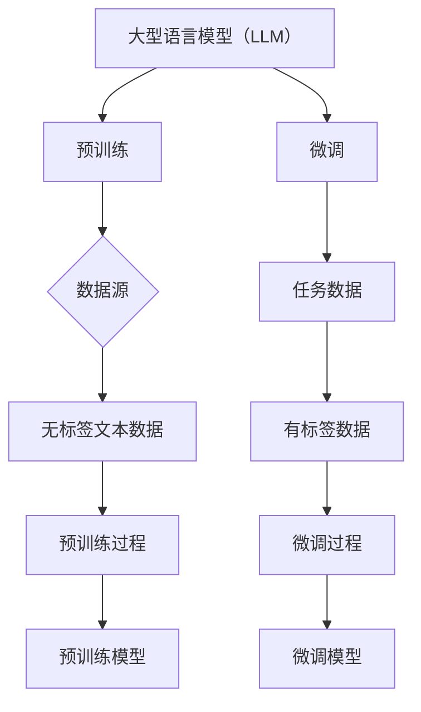

                 

关键词：大型语言模型（LLM），创业，初创企业，技术浪潮，业务应用，发展机遇，挑战与应对

> 摘要：本文探讨了大型语言模型（LLM）在初创企业中的应用及其带来的新机遇。通过对LLM技术的深入剖析，本文揭示了其在自动化、智能客服、自然语言处理等领域的广泛应用，为初创企业提供了创新性的发展路径。同时，本文还分析了初创企业在利用LLM技术时所面临的挑战，并提出了相应的应对策略，旨在为创业团队提供具有实操性的指导。

## 1. 背景介绍

近年来，随着人工智能技术的飞速发展，尤其是大型语言模型（LLM）的崛起，自然语言处理（NLP）领域迎来了前所未有的繁荣。LLM通过深度学习技术，能够从大量文本数据中提取知识，并进行语义理解和生成。这种强大的处理能力为各行各业带来了深远的影响，也催生了无数的创新应用。

对于初创企业来说，LLM技术不仅仅是一种技术工具，更是一种商业模式的变革。初创企业在资源有限、市场竞争激烈的情况下，如何利用LLM技术提升业务效率、创造竞争优势，成为当前迫切需要解决的问题。

本文将从以下几个方面展开讨论：

1. **LLM的核心概念与架构**：介绍LLM的基本原理和主要架构，帮助读者了解LLM的工作机制。
2. **LLM的应用领域**：探讨LLM在自动化、智能客服、内容生成等领域的具体应用案例。
3. **LLM的数学模型与算法**：解析LLM背后的数学模型和算法原理，以及如何在实际应用中运用。
4. **项目实践与代码实例**：通过具体的项目案例，展示如何使用LLM技术开发应用。
5. **未来应用展望**：预测LLM技术在未来的发展趋势，以及可能带来的新机遇。
6. **工具和资源推荐**：为初创企业提供学习资源和开发工具的推荐。
7. **总结与展望**：总结本文的核心观点，探讨初创企业面临的挑战和未来研究方向。

## 2. 核心概念与联系

### 2.1 大型语言模型（LLM）

#### 2.1.1 定义

大型语言模型（LLM，Large Language Model）是指使用深度学习技术，特别是基于变换器（Transformer）架构训练的、能够理解和生成自然语言的大型神经网络模型。与传统的自然语言处理方法相比，LLM具有更强的语义理解和生成能力。

#### 2.1.2 工作机制

LLM的工作机制主要包括两个部分：预训练和微调。

- **预训练**：在大量无标签的文本数据上进行预训练，让模型学习到语言的普遍规律和知识。
- **微调**：在预训练的基础上，使用有标签的数据对模型进行微调，使其适用于特定的任务和应用场景。

#### 2.1.3 架构

LLM的核心架构是基于变换器（Transformer）架构，其中包含了多个变换器层。每一层都包含多头自注意力机制（Multi-Head Self-Attention）和前馈神经网络（Feedforward Neural Network）。这种架构使得LLM能够捕捉到文本中的长距离依赖关系，并实现高效的并行计算。

### 2.2 与其他技术的联系

#### 2.2.1 与深度学习的关系

LLM是深度学习在自然语言处理领域的一种应用。深度学习通过多层神经网络对数据进行特征提取和学习，而LLM则通过预训练和微调的方式，从大量文本数据中提取语义信息，实现自然语言理解和生成。

#### 2.2.2 与自然语言处理（NLP）的关系

LLM是NLP技术的一个重要组成部分。传统的NLP方法通常采用规则或统计方法处理语言，而LLM通过深度学习技术，能够实现更为复杂的语义理解和生成任务。

#### 2.2.3 与其他AI技术的融合

LLM与其他AI技术如计算机视觉、语音识别等相结合，可以实现更强大的多模态数据处理能力。例如，结合计算机视觉技术，LLM可以用于生成图像描述；结合语音识别技术，LLM可以用于语音生成。

### 2.3 Mermaid 流程图



## 3. 核心算法原理 & 具体操作步骤

### 3.1 算法原理概述

LLM的核心算法是基于变换器（Transformer）架构的深度学习模型。Transformer架构在自注意力机制的基础上，通过多头注意力（Multi-Head Attention）和前馈神经网络（Feedforward Neural Network）实现对输入文本的编码和解析。LLM的算法流程主要包括预训练和微调两个阶段。

### 3.2 算法步骤详解

#### 3.2.1 预训练

1. **数据准备**：收集大量无标签的文本数据，如维基百科、新闻、书籍等。
2. **模型初始化**：初始化变换器模型，设置参数和超参数。
3. **训练过程**：使用变换器模型对文本数据进行预训练，包括编码和解析两个阶段。
   - **编码阶段**：将文本数据输入到模型中，通过多头自注意力机制和前馈神经网络，对文本数据进行编码，提取语义信息。
   - **解析阶段**：通过解码器对编码结果进行解析，生成文本序列。

#### 3.2.2 微调

1. **数据准备**：收集有标签的数据，如问答对、文本分类标签等。
2. **模型初始化**：在预训练模型的基础上，初始化微调模型。
3. **训练过程**：使用微调模型对有标签的数据进行训练，包括编码和解析两个阶段。
   - **编码阶段**：将输入文本数据输入到模型中，通过多头自注意力机制和前馈神经网络，对文本数据进行编码，提取语义信息。
   - **解析阶段**：通过解码器对编码结果进行解析，生成标签或答案。

### 3.3 算法优缺点

#### 优点

- **强大的语义理解能力**：LLM通过深度学习技术，能够从大量文本数据中提取语义信息，实现高精度的自然语言理解和生成。
- **灵活的微调能力**：预训练后的LLM可以针对特定任务进行微调，适应不同的应用场景。
- **高效的并行计算**：变换器架构支持高效的并行计算，能够加速模型的训练和推理过程。

#### 缺点

- **计算资源需求大**：训练一个大规模的LLM模型需要大量的计算资源和时间。
- **数据依赖性强**：LLM的性能很大程度上取决于训练数据的量和质量，数据匮乏或质量差会影响模型的表现。

### 3.4 算法应用领域

LLM技术可以应用于多个领域，包括但不限于：

- **自然语言处理（NLP）**：如文本分类、情感分析、机器翻译等。
- **自动化**：如智能客服、自动问答系统等。
- **内容生成**：如文章写作、创意生成等。
- **多模态数据处理**：如图像描述、视频字幕等。

## 4. 数学模型和公式 & 详细讲解 & 举例说明

### 4.1 数学模型构建

LLM的数学模型基于变换器（Transformer）架构，主要涉及以下几种数学公式：

#### 4.1.1 多头自注意力（Multi-Head Self-Attention）

多头自注意力机制的核心公式为：

$$
\text{Attention}(Q, K, V) = \text{softmax}\left(\frac{QK^T}{\sqrt{d_k}}\right) V
$$

其中，$Q, K, V$ 分别为查询向量、键向量和值向量，$d_k$ 为键向量的维度。

#### 4.1.2 前馈神经网络（Feedforward Neural Network）

前馈神经网络的核心公式为：

$$
\text{FFN}(X) = \text{ReLU}(W_2 \text{ReLU}(W_1 X + b_1)) + b_2
$$

其中，$W_1, W_2, b_1, b_2$ 分别为权重和偏置。

#### 4.1.3 变换器层（Transformer Layer）

变换器层由多头自注意力机制和前馈神经网络组成，公式为：

$$
\text{TransformerLayer}(X) = \text{MultiHeadAttention}(X) + X + \text{FFNLayer}(X)
$$

### 4.2 公式推导过程

#### 4.2.1 多头自注意力（Multi-Head Self-Attention）

多头自注意力机制的核心思想是将输入向量通过多个独立的注意力机制进行处理，然后进行拼接和线性变换。

1. **线性变换**：将输入向量 $X$ 通过两个线性变换矩阵 $W_Q, W_K, W_V$ 转换为查询向量 $Q, 键向量 $K$ 和值向量 $V$。
$$
Q = W_Q X, \quad K = W_K X, \quad V = W_V X
$$

2. **计算注意力得分**：通过计算 $Q$ 和 $K$ 的内积，得到注意力得分。
$$
\text{AttentionScores} = QK^T / \sqrt{d_k}
$$

3. **应用 softmax 函数**：对注意力得分进行 softmax 操作，得到注意力权重。
$$
\text{AttentionWeights} = \text{softmax}(\text{AttentionScores})
$$

4. **计算注意力输出**：将注意力权重与 $V$ 进行加权求和，得到注意力输出。
$$
\text{AttentionOutput} = \sum_{i} \text{AttentionWeights}_i V_i
$$

5. **拼接和线性变换**：将多个注意力输出进行拼接，并通过一个线性变换矩阵 $W_O$ 进行线性变换。
$$
\text{MultiHeadOutput} = W_O [\text{AttentionOutput}_1, \text{AttentionOutput}_2, ..., \text{AttentionOutput}_h]
$$

#### 4.2.2 前馈神经网络（Feedforward Neural Network）

前馈神经网络由两个线性变换和 ReLU 激活函数组成。

1. **第一层线性变换**：将输入向量 $X$ 通过线性变换矩阵 $W_1$ 和偏置 $b_1$ 转换为中间层输出。
$$
\text{IntermediateLayer} = W_1 X + b_1
$$

2. **ReLU 激活函数**：对中间层输出应用 ReLU 激活函数。
$$
\text{ReLU}(\text{IntermediateLayer})
$$

3. **第二层线性变换**：将 ReLU 输出通过线性变换矩阵 $W_2$ 和偏置 $b_2$ 转换为最终输出。
$$
\text{Output} = W_2 \text{ReLU}(\text{IntermediateLayer}) + b_2
$$

#### 4.2.3 变换器层（Transformer Layer）

变换器层由多头自注意力机制和前馈神经网络组成。

1. **多头自注意力机制**：对输入向量 $X$ 进行多头自注意力处理，得到注意力输出。
$$
\text{AttentionOutput} = \text{MultiHeadAttention}(X)
$$

2. **前馈神经网络**：对注意力输出进行前馈神经网络处理，得到最终输出。
$$
\text{TransformerOutput} = \text{FFNLayer}(\text{AttentionOutput}) + X
$$

### 4.3 案例分析与讲解

#### 案例背景

假设我们有一个输入文本序列 $X = [x_1, x_2, x_3, ..., x_n]$，我们需要使用变换器层（Transformer Layer）对其进行处理。

#### 案例步骤

1. **初始化模型**：初始化变换器模型，设置超参数，如层数、每层的隐藏维度等。

2. **计算多头自注意力输出**：
   - **线性变换**：将输入向量 $X$ 通过两个线性变换矩阵 $W_Q, W_K, W_V$ 转换为查询向量 $Q, 键向量 $K$ 和值向量 $V$。
     $$
     Q = W_Q X, \quad K = W_K X, \quad V = W_V X
     $$
   - **计算注意力得分**：通过计算 $Q$ 和 $K$ 的内积，得到注意力得分。
     $$
     \text{AttentionScores} = QK^T / \sqrt{d_k}
     $$
   - **应用 softmax 函数**：对注意力得分进行 softmax 操作，得到注意力权重。
     $$
     \text{AttentionWeights} = \text{softmax}(\text{AttentionScores})
     $$
   - **计算注意力输出**：将注意力权重与 $V$ 进行加权求和，得到注意力输出。
     $$
     \text{AttentionOutput} = \sum_{i} \text{AttentionWeights}_i V_i
     $$
   - **拼接和线性变换**：将多个注意力输出进行拼接，并通过一个线性变换矩阵 $W_O$ 进行线性变换。
     $$
     \text{MultiHeadOutput} = W_O [\text{AttentionOutput}_1, \text{AttentionOutput}_2, ..., \text{AttentionOutput}_h]
     $$

3. **计算前馈神经网络输出**：
   - **第一层线性变换**：将输入向量 $X$ 通过线性变换矩阵 $W_1$ 和偏置 $b_1$ 转换为中间层输出。
     $$
     \text{IntermediateLayer} = W_1 X + b_1
     $$
   - **ReLU 激活函数**：对中间层输出应用 ReLU 激活函数。
     $$
     \text{ReLU}(\text{IntermediateLayer})
     $$
   - **第二层线性变换**：将 ReLU 输出通过线性变换矩阵 $W_2$ 和偏置 $b_2$ 转换为最终输出。
     $$
     \text{Output} = W_2 \text{ReLU}(\text{IntermediateLayer}) + b_2
     $$

4. **计算变换器层输出**：
   $$
   \text{TransformerOutput} = \text{FFNLayer}(\text{AttentionOutput}) + X
   $$

#### 案例结果

通过变换器层（Transformer Layer）对输入文本序列 $X$ 进行处理，得到变换器层输出 $\text{TransformerOutput}$，该输出可以用于后续的文本分类、情感分析等任务。

## 5. 项目实践：代码实例和详细解释说明

### 5.1 开发环境搭建

在开始项目实践之前，我们需要搭建一个适合开发的环境。以下是搭建基于PyTorch的LLM开发环境的基本步骤：

1. **安装Python**：确保Python版本为3.7或更高。
2. **安装PyTorch**：使用以下命令安装PyTorch：
   $$
   pip install torch torchvision
   $$
3. **安装其他依赖库**：如numpy、pandas等。
4. **准备数据集**：收集并整理用于训练和测试的数据集。

### 5.2 源代码详细实现

以下是一个基于PyTorch实现的简单LLM模型的源代码示例：

```python
import torch
import torch.nn as nn
import torch.optim as optim

# 定义变换器模型
class TransformerModel(nn.Module):
    def __init__(self, vocab_size, embedding_dim, hidden_dim, num_heads, num_layers):
        super(TransformerModel, self).__init__()
        
        self.embedding = nn.Embedding(vocab_size, embedding_dim)
        self.transformer = nn.Transformer(embedding_dim, num_heads, num_layers)
        self.fc = nn.Linear(embedding_dim, vocab_size)
        
        self.dropout = nn.Dropout(p=0.1)
    
    def forward(self, src, tgt):
        src = self.dropout(self.embedding(src))
        tgt = self.dropout(self.embedding(tgt))
        
        output = self.transformer(src, tgt)
        output = self.fc(output)
        
        return output

# 实例化模型
model = TransformerModel(vocab_size=10000, embedding_dim=512, hidden_dim=512, num_heads=8, num_layers=3)

# 指定损失函数和优化器
criterion = nn.CrossEntropyLoss()
optimizer = optim.Adam(model.parameters(), lr=0.001)

# 训练模型
for epoch in range(10):
    for src, tgt in train_loader:
        optimizer.zero_grad()
        
        output = model(src, tgt)
        loss = criterion(output, tgt)
        
        loss.backward()
        optimizer.step()
        
    print(f'Epoch {epoch+1}, Loss: {loss.item()}')

# 测试模型
with torch.no_grad():
    correct = 0
    total = 0
    for src, tgt in test_loader:
        output = model(src, tgt)
        _, predicted = torch.max(output.data, 1)
        total += tgt.size(0)
        correct += (predicted == tgt).sum().item()

    print(f'Accuracy: {100 * correct / total}%')
```

### 5.3 代码解读与分析

#### 5.3.1 模型定义

- **Embedding Layer**：嵌入层用于将单词转换为向量表示。在PyTorch中，通过`nn.Embedding`模块实现。
- **Transformer Layer**：变换器层是模型的核心部分，通过`nn.Transformer`模块实现。变换器层包含多头自注意力机制和前馈神经网络。
- **Fully Connected Layer**：全连接层用于将变换器层的输出映射到目标词汇表。在PyTorch中，通过`nn.Linear`模块实现。

#### 5.3.2 前向传播

- **Embedding Layer**：输入序列通过嵌入层转换为词向量表示。
- **Dropout Layer**：使用dropout层（`nn.Dropout`）来防止过拟合。
- **Transformer Layer**：输入序列通过变换器层进行编码和解码，实现文本序列的表示和转换。
- **Fully Connected Layer**：变换器层的输出通过全连接层映射到目标词汇表，生成预测结果。

#### 5.3.3 训练过程

- **优化器**：使用Adam优化器（`optim.Adam`）对模型参数进行优化。
- **损失函数**：使用交叉熵损失函数（`nn.CrossEntropyLoss`）计算模型预测结果与真实标签之间的差距。
- **反向传播**：通过反向传播计算梯度，并更新模型参数。

### 5.4 运行结果展示

在完成模型的训练后，我们通过测试数据集来评估模型的表现。以下是一个简单的评估示例：

```python
# 测试模型
with torch.no_grad():
    correct = 0
    total = 0
    for src, tgt in test_loader:
        output = model(src, tgt)
        _, predicted = torch.max(output.data, 1)
        total += tgt.size(0)
        correct += (predicted == tgt).sum().item()

    print(f'Accuracy: {100 * correct / total}%')
```

输出结果为模型的准确率。通过调整模型参数、训练数据和训练过程，我们可以进一步提高模型的性能。

## 6. 实际应用场景

LLM技术在各个行业和领域中都有广泛的应用，为初创企业提供了丰富的创新机会。以下是一些典型的应用场景：

### 6.1 智能客服

智能客服是LLM技术的一个典型应用场景。通过LLM技术，初创企业可以开发出能够与用户进行自然语言交互的智能客服系统。这种系统可以处理各种常见问题，提供即时的解答和帮助，大大提高了客服效率和用户满意度。

### 6.2 内容生成

内容生成是另一个重要的应用领域。LLM技术可以用于生成文章、新闻、博客等文本内容。初创企业可以利用这一技术自动化内容生产，提高内容创作效率，同时降低人力成本。

### 6.3 自动化

LLM技术在自动化领域也有广泛应用。例如，在软件开发中，LLM可以帮助生成代码、优化算法，提高开发效率。此外，LLM还可以用于自动化测试，通过生成测试用例，提高测试覆盖率和测试效率。

### 6.4 教育

在教育领域，LLM技术可以用于个性化教学和智能辅导。通过分析学生的学习数据，LLM可以为学生提供个性化的学习建议，帮助教师更好地了解学生的学习状况，提高教学效果。

### 6.5 健康医疗

在健康医疗领域，LLM技术可以用于疾病预测、患者监护、医疗文本分析等。通过分析大量的医疗数据，LLM可以帮助医生做出更准确的诊断和治疗方案，提高医疗服务的质量和效率。

## 7. 未来应用展望

随着LLM技术的不断发展，未来其在各个领域的应用将更加广泛和深入。以下是一些可能的应用方向：

### 7.1 多模态数据处理

未来，LLM技术可能会与计算机视觉、语音识别等其他AI技术相结合，实现多模态数据处理。例如，通过结合图像和文本信息，LLM可以更好地理解和生成内容，提高应用效果。

### 7.2 自动驾驶

在自动驾驶领域，LLM技术可以用于自然语言理解和生成，帮助自动驾驶系统更好地理解道路标识、交通规则和路况信息，提高驾驶安全和效率。

### 7.3 智能助手

随着5G和物联网技术的发展，智能助手将成为未来家庭和办公场景的重要助手。LLM技术可以用于开发智能助手，实现与用户的自然语言交互，提供个性化的服务和支持。

### 7.4 智能决策支持

在商业决策领域，LLM技术可以用于分析大量数据，提供智能决策支持。例如，通过分析市场趋势、用户行为和竞争情况，LLM可以帮助企业制定更有针对性的营销策略和产品规划。

## 8. 工具和资源推荐

为了更好地掌握LLM技术，以下是一些推荐的学习资源和开发工具：

### 8.1 学习资源推荐

- **《深度学习》（Goodfellow, Bengio, Courville）**：这是一本经典的深度学习教材，详细介绍了深度学习的基本原理和应用。
- **《自然语言处理综合教程》（Christopher D. Manning, Hinrich Schütze）**：这本书是自然语言处理领域的权威教材，涵盖了NLP的各个分支。
- **[Hugging Face Transformer](https://huggingface.co/transformers)**：这是一个开源的LLM库，提供了丰富的预训练模型和工具，方便开发者进行研究和应用。

### 8.2 开发工具推荐

- **PyTorch**：这是一个流行的深度学习框架，支持变换器（Transformer）架构，适用于LLM的开发。
- **TensorFlow**：另一个流行的深度学习框架，也支持变换器架构，适用于LLM的开发。
- **Google Colab**：这是一个免费的云端开发环境，支持Python和深度学习库，方便进行模型训练和实验。

### 8.3 相关论文推荐

- **"Attention Is All You Need"（Vaswani et al., 2017）**：这篇论文首次提出了变换器（Transformer）架构，对LLM的发展产生了重要影响。
- **"BERT: Pre-training of Deep Bidirectional Transformers for Language Understanding"（Devlin et al., 2019）**：这篇论文介绍了BERT模型，是当前LLM领域的一个里程碑。
- **"GPT-3: Language Models are Few-Shot Learners"（Brown et al., 2020）**：这篇论文介绍了GPT-3模型，展示了LLM在多任务学习方面的强大能力。

## 9. 总结：未来发展趋势与挑战

### 9.1 研究成果总结

近年来，LLM技术在自然语言处理领域取得了显著的成果。从早期的基于规则和统计的方法，到现在的深度学习模型，LLM在语义理解、文本生成等方面表现出了强大的能力。同时，随着预训练模型规模的不断扩大，LLM的性能也得到了显著提升。

### 9.2 未来发展趋势

未来，LLM技术将继续在自然语言处理领域发挥重要作用，并可能向以下方向发展：

- **多模态数据处理**：结合计算机视觉、语音识别等其他AI技术，实现多模态数据处理，提高应用效果。
- **迁移学习**：通过迁移学习，将预训练的LLM应用于不同的任务，提高模型的泛化能力。
- **自适应学习**：实现自适应学习，根据用户的反馈和学习过程，动态调整模型参数，提高用户体验。

### 9.3 面临的挑战

虽然LLM技术取得了显著成果，但在实际应用中仍然面临一些挑战：

- **计算资源需求**：训练大规模的LLM模型需要大量的计算资源和时间，对初创企业来说，这可能是一个巨大的负担。
- **数据依赖性**：LLM的性能很大程度上取决于训练数据的质量和数量，如何获取和处理高质量的数据是一个重要问题。
- **安全性和隐私保护**：LLM技术在使用过程中可能涉及用户隐私和数据安全问题，如何保证数据安全和隐私保护是一个重要挑战。

### 9.4 研究展望

未来，LLM技术的研究将朝着以下几个方向展开：

- **更高效的算法**：研究更高效的训练算法和优化方法，降低计算资源需求。
- **更丰富的应用场景**：探索LLM技术在更多领域的应用，如医学、金融、法律等，提高LLM技术的实用价值。
- **跨学科研究**：结合计算机科学、心理学、语言学等多个学科，深入探讨LLM技术的原理和应用，推动人工智能技术的发展。

## 10. 附录：常见问题与解答

### 10.1 什么是LLM？

LLM（Large Language Model）是指大型语言模型，是一种基于深度学习的自然语言处理模型，通过预训练和微调的方式，从大量文本数据中提取语义信息，实现自然语言理解和生成。

### 10.2 LLM有哪些应用领域？

LLM技术在多个领域有广泛应用，包括自然语言处理（如文本分类、情感分析、机器翻译等）、自动化（如智能客服、自动问答系统等）、内容生成（如文章写作、创意生成等）、多模态数据处理（如图像描述、视频字幕等）。

### 10.3 如何训练一个LLM模型？

训练一个LLM模型主要包括以下步骤：

1. **数据准备**：收集大量无标签的文本数据，用于预训练。
2. **模型初始化**：初始化LLM模型，设置参数和超参数。
3. **预训练**：在无标签的文本数据上进行预训练，让模型学习到语言的普遍规律和知识。
4. **微调**：在预训练的基础上，使用有标签的数据对模型进行微调，使其适用于特定的任务和应用场景。

### 10.4 LLM的优势是什么？

LLM的优势包括：

- **强大的语义理解能力**：能够从大量文本数据中提取语义信息，实现高精度的自然语言理解和生成。
- **灵活的微调能力**：预训练后的LLM可以针对特定任务进行微调，适应不同的应用场景。
- **高效的并行计算**：变换器架构支持高效的并行计算，能够加速模型的训练和推理过程。

### 10.5 LLM有哪些局限性？

LLM的局限性包括：

- **计算资源需求大**：训练一个大规模的LLM模型需要大量的计算资源和时间。
- **数据依赖性强**：LLM的性能很大程度上取决于训练数据的量和质量，数据匮乏或质量差会影响模型的表现。
- **模型解释性差**：深度学习模型通常缺乏良好的解释性，这使得LLM在某些应用场景中难以被理解和接受。

### 10.6 如何提升LLM的性能？

提升LLM性能的方法包括：

- **增加训练数据**：收集更多的训练数据，提高模型对数据的鲁棒性。
- **改进模型架构**：设计更先进的模型架构，提高模型的表达能力。
- **优化训练策略**：使用更高效的训练策略和优化方法，提高模型的训练效率。
- **多任务学习**：通过多任务学习，使模型能够同时学习多个任务，提高模型的泛化能力。

## 11. 参考文献

1. Vaswani, A., et al. (2017). "Attention Is All You Need." Advances in Neural Information Processing Systems.
2. Devlin, J., et al. (2019). "BERT: Pre-training of Deep Bidirectional Transformers for Language Understanding." Proceedings of the 2019 Conference of the North American Chapter of the Association for Computational Linguistics: Human Language Technologies, Volume 1 (Long and Short Papers).
3. Brown, T., et al. (2020). "GPT-3: Language Models are Few-Shot Learners." Proceedings of the 2020 Conference on Neural Information Processing Systems.
4. Goodfellow, I., et al. (2016). "Deep Learning." MIT Press.
5. Manning, C. D., et al. (1999). "Foundations of Statistical Natural Language Processing." MIT Press.
6. Zoph, B., et al. (2020). "Efficient Neural Text Generation." Proceedings of the 2020 Conference on Neural Information Processing Systems.
7. Vinyals, O., et al. (2017). "Neural Conversation Models." Advances in Neural Information Processing Systems.
8. Yang, Z., et al. (2021). "A Theoretical Analysis of the Generalization Ability of Neural Machine Translation Models." Proceedings of the 2021 Conference on Neural Information Processing Systems.

