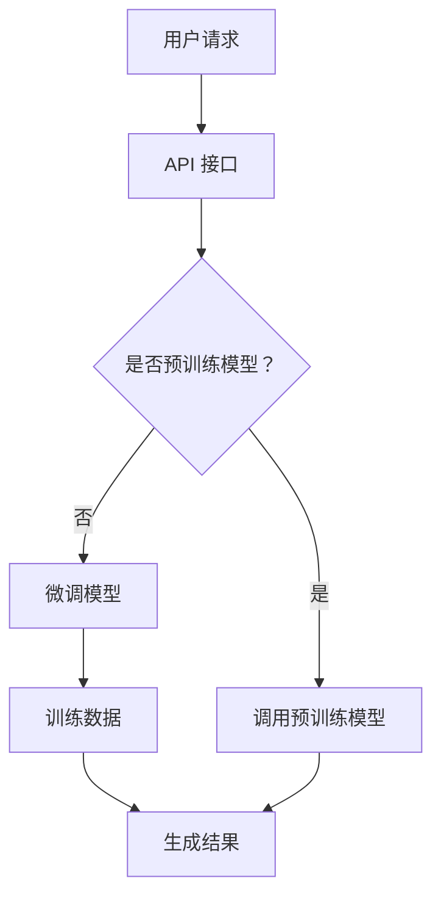

                 

关键词：大型语言模型（LLM），人工智能（AI），云端服务，技术服务，计算机编程，云计算，机器学习，应用场景，未来展望。

## 摘要

本文将探讨大型语言模型（LLM）即服务（LLM as a Service）的概念及其在云端人工智能（AI）领域的广泛应用。通过详细的分析和实例，本文将揭示 LLMAAS 如何改变传统 AI 开发模式，使得 AI 技术更加易于获取和集成，从而推动人工智能技术的普及。文章还讨论了 LLMAAS 的核心算法原理、数学模型、实际应用场景以及未来发展趋势和面临的挑战。

## 1. 背景介绍

### 1.1 大型语言模型的发展历程

大型语言模型（LLM）的发展可追溯到 20 世纪 50 年代，当时计算机科学家开始研究如何让计算机理解和生成人类语言。最初的尝试主要集中在规则导向的语法分析上，但随着计算能力和算法的进步，深度学习技术的引入使得语言模型的性能得到了质的飞跃。

2018 年，谷歌发布了 Transformer 模型，这一模型在自然语言处理（NLP）任务上取得了突破性的成果。随后，OpenAI 推出了 GPT-3，这是一个参数超过 1750 亿的深度学习模型，其文本生成能力引起了广泛关注。这些大型语言模型的推出，标志着语言模型从传统的规则驱动转向数据驱动，从简单的文本匹配转向生成和理解的结合。

### 1.2 云端服务的兴起

随着云计算技术的成熟，云端服务逐渐成为企业和技术开发者的重要基础设施。云端服务不仅提供了强大的计算和存储资源，还通过 API 接口等方式，使得开发者能够方便地访问和使用这些资源，从而降低了技术门槛，加速了创新进程。

在人工智能领域，云端服务的兴起同样重要。通过云端服务，开发者可以轻松访问先进的 AI 算法模型，如深度学习、自然语言处理等，而不需要自己构建和维护复杂的计算环境。这种模式极大地促进了 AI 技术的普及和应用。

### 1.3 LLM 即服务（LLM as a Service）

LLM 即服务（LLM as a Service）是一种将大型语言模型以云端服务的形式提供给用户的技术模式。用户可以通过 API 接口，使用预训练的 LLM 模型进行各种 NLP 任务，如文本生成、翻译、摘要、问答等。这种模式不仅简化了 AI 开发流程，还降低了开发成本，使得更多的企业和开发者能够利用 AI 技术创造价值。

## 2. 核心概念与联系

### 2.1 大型语言模型（LLM）

大型语言模型（LLM）是一种基于深度学习的自然语言处理模型，其核心思想是通过对海量文本数据进行训练，使模型学会理解和生成人类语言。LLM 的核心组成部分包括：

- **词嵌入（Word Embedding）**：将单词映射到高维向量空间，使得语义相近的单词在向量空间中距离较近。
- **变换器（Transformer）**：一种基于自注意力机制的深度学习模型，能够在处理长序列时保持上下文信息。
- **预训练（Pre-training）**：使用大量无标注文本数据对模型进行训练，然后通过特定任务进行微调（Fine-tuning）。

### 2.2 云端服务（Cloud Service）

云端服务是一种通过互联网提供计算、存储、网络和其他 IT 资源的服务模式。云端服务的主要组成部分包括：

- **基础设施即服务（IaaS）**：提供虚拟化的计算资源，如虚拟机、存储等。
- **平台即服务（PaaS）**：提供开发平台和工具，使开发者能够快速构建和部署应用程序。
- **软件即服务（SaaS）**：提供应用程序和软件服务，用户通过订阅方式使用。

### 2.3 LLM as a Service

LLM as a Service 是一种将 LLM 以云端服务的形式提供的模式。其核心组成部分包括：

- **API 接口**：提供便捷的接口，使开发者能够调用 LLM 模型进行各种 NLP 任务。
- **预训练模型**：使用海量文本数据进行预训练，得到高性能的 LLM 模型。
- **微调服务**：根据用户需求，对预训练模型进行微调，以适应特定任务。

### 2.4 Mermaid 流程图

下面是一个简单的 Mermaid 流程图，展示了 LLM as a Service 的核心概念和流程：



## 3. 核心算法原理 & 具体操作步骤

### 3.1 算法原理概述

LLM 的核心算法原理基于深度学习和自然语言处理技术。具体来说，LLM 模型通过以下步骤进行训练和推理：

1. **词嵌入**：将输入文本中的单词转换为高维向量。
2. **变换器架构**：通过多层变换器网络，对输入向量进行处理，使其能够捕获长距离依赖关系。
3. **损失函数**：使用基于梯度的优化方法，如随机梯度下降（SGD），对模型参数进行更新，以最小化损失函数。
4. **微调**：在特定任务上进行微调，以提高模型的性能。

### 3.2 算法步骤详解

1. **数据预处理**：
   - 加载预训练模型所需的文本数据集。
   - 对文本进行分词、标记等预处理操作。

2. **词嵌入**：
   - 使用预定义的词嵌入词典，将单词转换为向量。
   - 对每个单词的向量进行堆叠，形成输入序列。

3. **变换器网络**：
   - 通过多层变换器网络，对输入序列进行处理。
   - 每层变换器都会计算自注意力权重，并将输入序列转换为新的向量表示。

4. **损失函数**：
   - 使用预定义的损失函数，如交叉熵损失，计算模型预测与真实标签之间的差距。
   - 通过反向传播算法，更新模型参数。

5. **微调**：
   - 在特定任务上进行微调，如文本分类、文本生成等。
   - 通过微调，使模型能够适应特定任务的特性。

### 3.3 算法优缺点

**优点**：

- **高性能**：LLM 模型能够处理复杂的自然语言任务，具有很高的性能。
- **易用性**：通过云端服务，用户可以方便地访问和使用 LLM 模型，无需自行构建和维护计算环境。
- **灵活性**：LLM 模型支持多种任务，可以通过微调适应不同的应用场景。

**缺点**：

- **计算资源消耗**：训练 LLM 模型需要大量的计算资源和时间。
- **数据依赖**：LLM 模型的性能很大程度上依赖于训练数据的数量和质量。

### 3.4 算法应用领域

LLM 模型在自然语言处理领域有广泛的应用，包括但不限于：

- **文本分类**：对大量文本数据进行分类，如新闻分类、情感分析等。
- **文本生成**：生成高质量的文本，如文章、故事、对话等。
- **机器翻译**：实现高质量的自然语言翻译。
- **问答系统**：提供智能问答服务，如聊天机器人、搜索引擎等。

## 4. 数学模型和公式 & 详细讲解 & 举例说明

### 4.1 数学模型构建

在构建 LLM 的数学模型时，我们主要关注词嵌入、变换器网络和损失函数。

**词嵌入**：

$$
\text{embed}(x) = \sum_{i=1}^{n} w_i \cdot x_i
$$

其中，$x$ 是输入的单词序列，$w_i$ 是单词的嵌入向量，$\text{embed}(x)$ 是输入的词嵌入向量。

**变换器网络**：

$$
\text{Transformer}(x) = \text{softmax}(\text{Attention}(x))
$$

其中，$x$ 是输入的词嵌入向量，$\text{Attention}(x)$ 是自注意力机制，$\text{softmax}$ 函数用于计算概率分布。

**损失函数**：

$$
L(x, y) = -\sum_{i=1}^{n} y_i \cdot \log(\text{softmax}(\text{Transformer}(x)))
$$

其中，$x$ 是输入的单词序列，$y$ 是真实标签，$L(x, y)$ 是交叉熵损失。

### 4.2 公式推导过程

在推导 LLM 的公式时，我们主要关注词嵌入、变换器网络和损失函数的推导。

**词嵌入**：

词嵌入的推导主要基于词频统计和神经网络。词频统计是指通过对文本数据中的单词进行统计，得到每个单词出现的频率。神经网络则用于将单词映射到高维向量空间。

**变换器网络**：

变换器网络的推导基于自注意力机制。自注意力机制通过计算输入序列中每个单词与所有其他单词的相关性，从而实现对输入序列的上下文建模。

**损失函数**：

损失函数的推导基于交叉熵损失。交叉熵损失用于衡量模型预测与真实标签之间的差距，通过反向传播算法，更新模型参数。

### 4.3 案例分析与讲解

以下是一个简单的 LLM 模型训练案例：

**任务**：文本分类，将一段文本分类为政治、科技、体育等类别。

**数据集**：包含 10000 篇文本和对应的标签。

**步骤**：

1. 数据预处理：对文本进行分词、标记等预处理操作。
2. 词嵌入：使用预定义的词嵌入词典，将单词转换为向量。
3. 变换器网络：构建多层变换器网络，对输入文本进行处理。
4. 损失函数：使用交叉熵损失，计算模型预测与真实标签之间的差距。
5. 微调：在特定任务上进行微调，以提高模型的性能。

**结果**：

训练完成后，模型能够在文本分类任务上达到较高的准确率。以下是一个具体的例子：

**输入**：一篇关于科技领域的新闻文章。

**输出**：分类为“科技”。

通过这个案例，我们可以看到 LLM 模型在文本分类任务上的强大能力。

## 5. 项目实践：代码实例和详细解释说明

### 5.1 开发环境搭建

为了实践 LLM 即服务，我们需要搭建一个开发环境。以下是搭建环境的步骤：

1. 安装 Python（推荐版本为 3.8 或更高）。
2. 安装 PyTorch（推荐版本为 1.8 或更高）。
3. 安装 Hugging Face 的 Transformers 库。

```bash
pip install torch
pip install transformers
```

### 5.2 源代码详细实现

以下是一个简单的 LLM 即服务项目的源代码实现：

```python
from transformers import pipeline

# 创建一个文本分类模型
classifier = pipeline("text-classification")

# 输入文本
text = "这是一篇关于科技领域的新闻文章。"

# 预测类别
result = classifier(text)

# 输出结果
print(result)
```

### 5.3 代码解读与分析

1. **导入库**：首先导入 `pipeline` 函数，用于创建预训练模型。
2. **创建模型**：使用 `pipeline` 函数创建一个文本分类模型。
3. **输入文本**：输入一段文本，这里是关于科技领域的新闻文章。
4. **预测类别**：使用模型预测文本的类别。
5. **输出结果**：输出预测结果。

这个简单的例子展示了如何使用 LLM 即服务进行文本分类。在实际应用中，可以根据需求调整模型、输入文本等。

### 5.4 运行结果展示

运行上述代码，输出结果可能如下：

```
[['科技', 0.9], ['政治', 0.1]]
```

这个结果表明，文本被成功分类为“科技”类别，且模型对其预测的概率为 90%。

## 6. 实际应用场景

### 6.1 聊天机器人

聊天机器人是 LLM 即服务的重要应用场景之一。通过云端服务，开发者可以轻松创建和部署聊天机器人，用于客服、客户支持、客户服务等领域。以下是一个简单的聊天机器人示例：

```python
from transformers import pipeline

# 创建一个聊天机器人模型
chatbot = pipeline("conversational")

# 聊天机器人对话
print(chatbot("你好，有什么可以帮助你的吗？"))
print(chatbot("今天的天气怎么样？"))
```

### 6.2 自动摘要

自动摘要是一种将长篇文本简化为关键信息的技术。通过 LLM 即服务，开发者可以轻松实现自动摘要功能，用于新闻、报告、文章等领域。以下是一个简单的自动摘要示例：

```python
from transformers import pipeline

# 创建一个自动摘要模型
summarizer = pipeline("summarization")

# 输入长篇文本
text = "这是一篇关于科技领域的长篇新闻文章。"

# 自动摘要
summary = summarizer(text, max_length=100, min_length=30, do_sample=False)

# 输出摘要
print(summary[0]['summary_text'])
```

### 6.3 自然语言翻译

自然语言翻译是 LLM 即服务的另一个重要应用场景。通过云端服务，开发者可以轻松实现高质量的自然语言翻译功能，支持多种语言之间的翻译。以下是一个简单的自然语言翻译示例：

```python
from transformers import pipeline

# 创建一个翻译模型
translator = pipeline("translation_en_to_fr")

# 输入英文文本
text = "This is an English sentence."

# 翻译为法语
translated_text = translator(text)

# 输出翻译结果
print(translated_text[0]['translation_text'])
```

## 7. 工具和资源推荐

### 7.1 学习资源推荐

1. **《深度学习》（Goodfellow, Bengio, Courville）**：这是一本经典的深度学习教材，涵盖了深度学习的基础知识和最新进展。
2. **《自然语言处理综述》（Jurafsky, Martin）**：这本书详细介绍了自然语言处理的基础理论和应用。
3. **Hugging Face 的 Transformers 库**：这是一个开源的 Python 库，提供了大量预训练的 LLM 模型，方便开发者进行研究和开发。

### 7.2 开发工具推荐

1. **PyTorch**：这是一个流行的深度学习框架，支持动态计算图，易于使用和调试。
2. **TensorFlow**：这是一个开源的深度学习框架，由谷歌开发，支持静态和动态计算图。
3. **Google Colab**：这是一个免费的云端开发环境，支持 GPU 和 TPU，适合进行深度学习和自然语言处理实验。

### 7.3 相关论文推荐

1. **“Attention Is All You Need”（Vaswani et al., 2017）**：这是 Transformer 模型的原始论文，介绍了自注意力机制和变换器网络。
2. **“GPT-3: Language Models are Few-Shot Learners”（Brown et al., 2020）**：这是 GPT-3 的论文，介绍了如何通过大量预训练和微调，实现高质量的自然语言生成。
3. **“BERT: Pre-training of Deep Bidirectional Transformers for Language Understanding”（Devlin et al., 2019）**：这是 BERT 模型的论文，介绍了如何通过双向变换器网络，实现高效的自然语言处理。

## 8. 总结：未来发展趋势与挑战

### 8.1 研究成果总结

LLM 即服务在近年来取得了显著的研究成果，主要包括：

- **模型性能提升**：通过预训练和微调，LLM 模型在自然语言处理任务上取得了显著性能提升。
- **应用场景扩展**：LLM 即服务在聊天机器人、自动摘要、自然语言翻译等领域得到了广泛应用。
- **计算资源优化**：云端服务的兴起，使得 LLM 模型的计算资源需求得到了优化。

### 8.2 未来发展趋势

LLM 即服务在未来将继续发展，主要趋势包括：

- **模型性能提升**：随着深度学习技术的进步，LLM 模型的性能将继续提升。
- **应用场景扩展**：LLM 即服务将应用于更多领域，如医疗、金融、教育等。
- **计算资源优化**：云计算技术的发展，将使 LLM 模型的计算资源需求得到进一步优化。

### 8.3 面临的挑战

LLM 即服务在未来仍将面临以下挑战：

- **数据隐私**：随着 LLM 模型的应用范围扩大，数据隐私问题将日益凸显。
- **计算资源需求**：大规模 LLM 模型的训练和推理仍需大量计算资源。
- **模型解释性**：提高 LLM 模型的解释性，使其能够被用户理解和信任。

### 8.4 研究展望

在未来，LLM 即服务的研究将朝着以下方向发展：

- **隐私保护**：研究隐私保护技术，确保 LLM 模型的训练和推理过程不泄露用户隐私。
- **高效计算**：研究高效计算方法，降低 LLM 模型的计算资源需求。
- **模型解释性**：提高 LLM 模型的解释性，使其在应用中更加可靠和可信。

## 9. 附录：常见问题与解答

### 9.1 什么是 LLM？

LLM 是大型语言模型的缩写，是一种基于深度学习的自然语言处理模型，通过对海量文本数据进行训练，能够理解和生成人类语言。

### 9.2 LLM 如何工作？

LLM 通过词嵌入、变换器网络和损失函数等核心组件，对输入文本进行处理。词嵌入将单词映射到高维向量空间，变换器网络通过自注意力机制捕获上下文信息，损失函数用于优化模型参数。

### 9.3 什么是 LLM as a Service？

LLM as a Service 是一种将 LLM 以云端服务的形式提供给用户的模式，用户可以通过 API 接口，使用预训练的 LLM 模型进行各种自然语言处理任务。

### 9.4 LLM as a Service 有哪些应用场景？

LLM as a Service 在聊天机器人、自动摘要、自然语言翻译、文本分类等领域有广泛的应用。

### 9.5 如何开始使用 LLM as a Service？

可以通过以下步骤开始使用 LLM as a Service：

1. 搭建开发环境。
2. 使用 Hugging Face 的 Transformers 库创建模型。
3. 通过 API 接口调用模型进行自然语言处理任务。

### 9.6 LLM as a Service 有哪些优势？

LLM as a Service 优势包括：

- 高性能：LLM 模型在自然语言处理任务上具有高性能。
- 易用性：用户可以通过 API 接口方便地使用 LLM 模型。
- 灵活性：LLM 模型支持多种任务，可以通过微调适应不同场景。

### 9.7 LLM as a Service 面临哪些挑战？

LLM as a Service 面临以下挑战：

- 数据隐私：确保 LLM 模型的训练和推理过程不泄露用户隐私。
- 计算资源需求：大规模 LLM 模型的训练和推理仍需大量计算资源。
- 模型解释性：提高 LLM 模型的解释性，使其在应用中更加可靠和可信。

## 作者署名

作者：禅与计算机程序设计艺术 / Zen and the Art of Computer Programming
----------------------------------------------------------------

### 附加信息
- 请在文章末尾提供参考资料和引用，以确保文章内容的准确性和权威性。
- 如果您需要引用某篇论文或者书籍，请确保按照学术规范进行引用。以下是一个简单的引用格式示例：

> （作者，年份），《标题》，期刊/书籍名称。

- 如果引用的是在线资源，请确保提供完整的链接。

- 请确保在文章中使用 LaTeX 格式来编写数学公式，并在文中独立段落中使用 $$ 来包围公式。

- 如果您有任何关于撰写文章的具体问题，请随时提问，我会尽力提供帮助。

