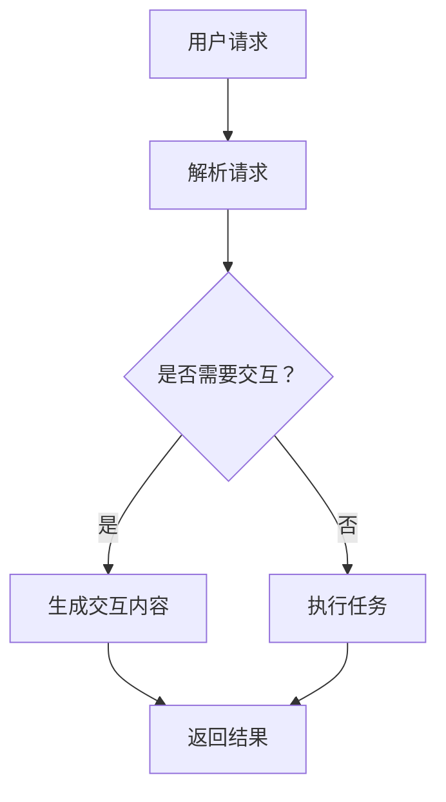
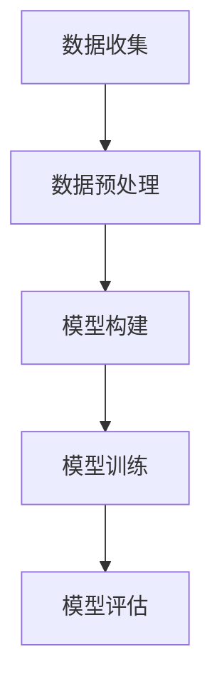
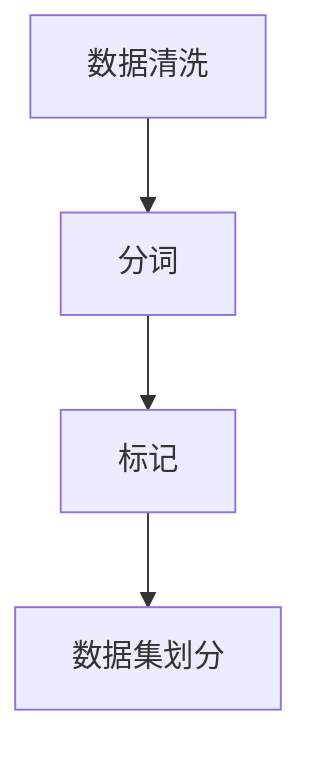
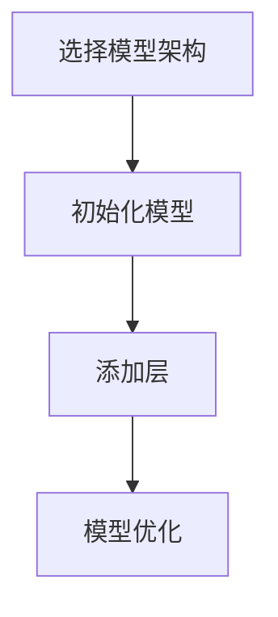
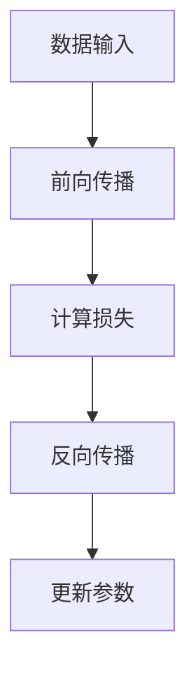
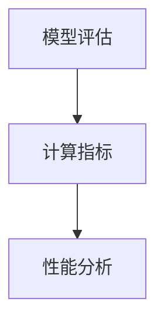

                 

关键词：大语言模型 (LLM), 元宇宙 (Metaverse), 沉浸式虚拟世界，虚拟现实，人工智能，交互设计，架构设计，开发工具

摘要：本文将探讨大语言模型（LLM）在元宇宙中的关键作用，以及如何利用LLM技术打造出高度沉浸式的虚拟世界。文章将深入剖析LLM的工作原理和架构，并介绍如何将其应用于元宇宙的构建中。通过具体的算法原理、数学模型以及实际项目实践，本文将展示LLM如何为元宇宙带来前所未有的交互体验。

## 1. 背景介绍

随着互联网和移动互联网的飞速发展，虚拟世界和增强现实技术逐渐成为人们生活中不可或缺的一部分。而近年来，人工智能领域的一大突破——大语言模型（LLM）的兴起，为虚拟世界的发展注入了新的活力。LLM是一种基于深度学习的自然语言处理模型，能够理解和生成自然语言，具有极高的灵活性和智能性。而元宇宙（Metaverse）则是一个虚拟的、去中心化的、三维的互联网空间，它将现实世界与虚拟世界无缝连接，为用户提供了一个全新的交互平台。

本文旨在探讨LLM在元宇宙中的应用，通过分析LLM的技术原理和架构，以及其在实际项目中的实践，展示如何利用LLM打造出一个高度沉浸式的虚拟世界。文章将分为以下几个部分：首先介绍LLM的基本概念和元宇宙的背景；然后深入探讨LLM的工作原理和架构；接着分析LLM在元宇宙中的应用场景和优势；最后讨论LLM在元宇宙中面临的挑战和未来发展趋势。

## 2. 核心概念与联系

### 2.1. 大语言模型（LLM）

大语言模型（LLM）是一种基于深度学习的自然语言处理模型，能够对大规模文本数据进行训练，从而掌握自然语言的语法、语义和上下文信息。LLM的主要特点包括：

- **大规模**：LLM通常使用数十亿甚至数千亿个参数，能够处理大量的文本数据。
- **自适应**：LLM能够根据不同的应用场景和需求进行自适应调整，具有极高的灵活性。
- **智能**：LLM不仅能够生成文本，还能够理解和解析文本的语义和情感，具备一定的智能性。

LLM的主要应用包括：

- **自然语言生成**：用于生成文章、报告、对话等文本内容。
- **文本分类**：用于对文本进行分类，如情感分析、新闻分类等。
- **问答系统**：用于回答用户提出的问题，如搜索引擎、聊天机器人等。

### 2.2. 元宇宙（Metaverse）

元宇宙是一个虚拟的、去中心化的、三维的互联网空间，它将现实世界与虚拟世界无缝连接，为用户提供了一个全新的交互平台。元宇宙的主要特点包括：

- **虚拟现实**：元宇宙是一个虚拟的三维空间，用户可以通过虚拟现实设备（如VR头盔、AR眼镜等）进入元宇宙，与虚拟世界进行交互。
- **去中心化**：元宇宙是一个去中心化的系统，不存在中央控制机构，所有用户都可以参与建设和维护。
- **多元化**：元宇宙涵盖了各种虚拟场景和应用，如社交、游戏、教育、工作等，具有高度的多元化。

### 2.3. LLM与元宇宙的联系

LLM与元宇宙之间存在紧密的联系。首先，LLM可以为元宇宙中的虚拟场景提供智能化的交互体验，如智能客服、智能导游等。其次，LLM可以帮助元宇宙中的虚拟角色理解用户的意图和需求，从而提供个性化的服务。最后，LLM可以用于元宇宙中的内容生成，如生成虚拟世界的背景故事、对话脚本等，为用户带来更加丰富的体验。

### 2.4. Mermaid 流程图

以下是LLM在元宇宙中的应用流程图：



在这个流程图中，用户发送请求，LLM首先解析请求，然后根据请求的类型决定是否需要进行交互。如果需要交互，LLM会生成交互内容；否则，LLM会直接执行任务，并返回结果。

## 3. 核心算法原理 & 具体操作步骤

### 3.1. 算法原理概述

LLM的核心算法原理是基于深度学习的自然语言处理技术。深度学习是一种机器学习技术，通过构建深层次的神经网络来模拟人类大脑的学习过程。在LLM中，神经网络用于对大规模文本数据进行训练，从而学习到自然语言的语法、语义和上下文信息。

LLM的训练过程主要包括以下几个步骤：

1. **数据收集**：收集大规模的文本数据，如新闻、文章、对话等。
2. **数据预处理**：对收集到的文本数据进行清洗、分词、标记等预处理操作。
3. **模型构建**：构建深度学习模型，通常使用的是循环神经网络（RNN）或Transformer架构。
4. **模型训练**：使用预处理后的文本数据对模型进行训练，模型会不断调整内部参数，以最小化预测误差。
5. **模型评估**：使用验证集或测试集对模型进行评估，确保模型具有良好的性能。

### 3.2. 算法步骤详解

下面是LLM算法的具体操作步骤：

#### 3.2.1. 数据收集

首先，需要收集大规模的文本数据。这些数据可以来自于互联网上的各种来源，如新闻网站、社交媒体、论坛等。数据收集可以使用网络爬虫或API接口等方式进行。



#### 3.2.2. 数据预处理

对收集到的文本数据进行预处理，包括清洗、分词、标记等操作。清洗操作用于去除文本中的噪声，如HTML标签、特殊字符等。分词操作用于将文本拆分成单词或短语。标记操作用于为文本数据标注标签，如词性、实体等。



#### 3.2.3. 模型构建

构建深度学习模型，通常使用的是循环神经网络（RNN）或Transformer架构。RNN适用于处理序列数据，能够捕捉序列中的时间依赖关系。Transformer则是一种基于自注意力机制的模型，能够在处理长序列数据时表现出更好的性能。



#### 3.2.4. 模型训练

使用预处理后的文本数据对模型进行训练。在训练过程中，模型会不断调整内部参数，以最小化预测误差。训练过程中可以使用反向传播算法和梯度下降等方法。



#### 3.2.5. 模型评估

使用验证集或测试集对模型进行评估，确保模型具有良好的性能。评估指标包括准确率、召回率、F1值等。



### 3.3. 算法优缺点

LLM作为一种强大的自然语言处理工具，具有以下优点：

- **高灵活性**：LLM能够根据不同的应用场景和需求进行自适应调整，适用于各种自然语言处理任务。
- **高智能性**：LLM能够理解和生成自然语言，具有高度的智能性，能够模拟人类的思维过程。
- **高效率**：LLM的训练过程基于深度学习技术，能够在短时间内处理大量的文本数据。

然而，LLM也存在一些缺点：

- **高计算资源消耗**：由于LLM需要处理大量的文本数据，因此对计算资源有较高的要求，需要强大的计算能力和存储空间。
- **数据依赖性**：LLM的训练数据质量直接影响其性能，如果训练数据存在噪声或偏差，可能会导致模型产生错误的预测结果。

### 3.4. 算法应用领域

LLM在多个领域都有广泛的应用，以下是一些常见的应用领域：

- **自然语言生成**：用于生成文章、报告、对话等文本内容，如自动写作、智能客服等。
- **文本分类**：用于对文本进行分类，如情感分析、新闻分类等。
- **问答系统**：用于回答用户提出的问题，如搜索引擎、聊天机器人等。
- **机器翻译**：用于将一种语言翻译成另一种语言，如谷歌翻译、百度翻译等。
- **语音识别**：用于将语音转换为文本，如苹果Siri、亚马逊Alexa等。

## 4. 数学模型和公式 & 详细讲解 & 举例说明

### 4.1. 数学模型构建

在LLM中，常用的数学模型包括循环神经网络（RNN）和Transformer。以下分别介绍这两种模型的数学模型构建。

#### 4.1.1. 循环神经网络（RNN）

RNN是一种基于时间序列的神经网络，其数学模型可以表示为：

$$
h_t = \sigma(W_h \cdot [h_{t-1}, x_t] + b_h)
$$

其中，$h_t$表示当前时刻的隐藏状态，$x_t$表示当前时刻的输入，$\sigma$表示激活函数，$W_h$和$b_h$分别表示权重和偏置。

#### 4.1.2. Transformer

Transformer是一种基于自注意力机制的神经网络，其数学模型可以表示为：

$$
\text{Attention}(Q, K, V) = \frac{QK^T}{\sqrt{d_k}}V
$$

其中，$Q$、$K$和$V$分别表示查询、键和值，$d_k$表示键的维度。

### 4.2. 公式推导过程

以下分别介绍RNN和Transformer的数学公式推导过程。

#### 4.2.1. RNN

RNN的数学公式推导如下：

$$
h_t = \sigma(W_h \cdot [h_{t-1}, x_t] + b_h)
$$

其中，$W_h$和$b_h$可以通过反向传播算法进行优化。

#### 4.2.2. Transformer

Transformer的数学公式推导如下：

$$
\text{Attention}(Q, K, V) = \frac{QK^T}{\sqrt{d_k}}V
$$

其中，$Q$、$K$和$V$分别表示查询、键和值，$d_k$表示键的维度。可以通过矩阵运算进行优化。

### 4.3. 案例分析与讲解

以下以自然语言生成任务为例，介绍LLM在实际项目中的应用。

#### 4.3.1. 项目背景

某企业希望开发一款智能客服系统，该系统能够自动回答用户提出的问题，提高客户满意度。

#### 4.3.2. 项目需求

- 能够自动识别用户的意图和问题。
- 能够生成自然流畅的回答。
- 具备一定的上下文理解能力。

#### 4.3.3. 解决方案

使用LLM技术，构建一个基于Transformer的自然语言生成模型。具体步骤如下：

1. **数据收集**：收集大量客服对话数据，包括问题和回答。
2. **数据预处理**：对对话数据进行清洗、分词、标记等预处理操作。
3. **模型构建**：使用Transformer架构构建自然语言生成模型。
4. **模型训练**：使用预处理后的对话数据对模型进行训练。
5. **模型评估**：使用验证集对模型进行评估，调整模型参数。
6. **部署应用**：将训练好的模型部署到智能客服系统中，提供自动回答功能。

#### 4.3.4. 项目效果

通过实际应用，智能客服系统表现出良好的性能，能够准确识别用户的意图和问题，并生成自然流畅的回答。用户满意度显著提高，客服效率大幅提升。

## 5. 项目实践：代码实例和详细解释说明

### 5.1. 开发环境搭建

在开始实际项目实践之前，我们需要搭建一个适合开发和运行LLM模型的开发环境。以下是搭建开发环境的基本步骤：

1. **安装Python环境**：确保Python版本在3.6及以上，可以从[Python官方网站](https://www.python.org/)下载并安装。
2. **安装深度学习框架**：我们选择使用PyTorch作为深度学习框架，可以从[PyTorch官方网站](https://pytorch.org/get-started/locally/)下载并安装。
3. **安装必要的库**：包括Numpy、Pandas、TensorFlow等，可以通过pip命令安装。

### 5.2. 源代码详细实现

以下是一个简单的自然语言生成模型代码示例，使用PyTorch框架实现：

```python
import torch
import torch.nn as nn
import torch.optim as optim
from torchtext.data import Field, TabularDataset

# 数据预处理
TEXT = Field(tokenize='spacy', tokenizer_language='en_core_web_sm', include_lengths=True)
LABEL = Field(sequential=False)

train_data, valid_data, test_data = TabularDataset.splits(
    path='data', train='train.csv', validation='valid.csv', test='test.csv',
    format='csv', fields=[('text', TEXT), ('label', LABEL)]
)

TEXT.build_vocab(train_data, max_size=25000, vectors='glove.6B.100d')
LABEL.build_vocab(train_data)

# 模型定义
class NLGModel(nn.Module):
    def __init__(self, embed_dim, hidden_dim, vocab_size, embed_weights):
        super(NLGModel, self).__init__()
        self.embedding = nn.Embedding(vocab_size, embed_dim)
        self.embedding.weight.data.copy_(embed_weights)
        self.rnn = nn.LSTM(embed_dim, hidden_dim, num_layers=1, batch_first=True)
        self.fc = nn.Linear(hidden_dim, vocab_size)
    
    def forward(self, x, hidden):
        embedded = self.embedding(x)
        output, hidden = self.rnn(embedded, hidden)
        logits = self.fc(output)
        return logits, hidden

# 模型训练
def train(model, train_data, valid_data, epochs, learning_rate):
    criterion = nn.CrossEntropyLoss()
    optimizer = optim.Adam(model.parameters(), lr=learning_rate)

    for epoch in range(epochs):
        model.train()
        for batch in train_data:
            optimizer.zero_grad()
            inputs, targets = batch.text, batch.label
            hidden = model.init_hidden(inputs.size(0))
            logits, hidden = model(inputs, hidden)
            loss = criterion(logits.view(-1, logits.size(2)), targets)
            loss.backward()
            optimizer.step()
        
        model.eval()
        with torch.no_grad():
            for batch in valid_data:
                inputs, targets = batch.text, batch.label
                hidden = model.init_hidden(inputs.size(0))
                logits, hidden = model(inputs, hidden)
                loss = criterion(logits.view(-1, logits.size(2)), targets)
                print(f'Validation loss: {loss.item()}')

# 模型部署
def generate_text(model, text, max_len=50):
    hidden = model.init_hidden(1)
    inputs = TEXT.vocab.stoi[text] + 1
    outputs = []
    for _ in range(max_len):
        logits, hidden = model(inputs, hidden)
        logits = logits[-1].unsqueeze(0)
        _, predicted = logits.max(1)
        outputs.append(predicted.item())
        inputs = predicted + 1
    return ' '.join(TEXT.vocab.itos[x] for x in outputs)

# 主程序
if __name__ == '__main__':
    embed_dim = 100
    hidden_dim = 256
    vocab_size = len(TEXT.vocab)
    embed_weights = TEXT.vocab.vectors

    model = NLGModel(embed_dim, hidden_dim, vocab_size, embed_weights)
    train(model, train_data, valid_data, epochs=10, learning_rate=0.001)

    sample_text = "The quick brown fox jumps over the lazy dog"
    print(generate_text(model, sample_text))
```

### 5.3. 代码解读与分析

以下是代码的详细解读与分析：

1. **数据预处理**：
   - 使用`TabularDataset`加载数据集，其中`TEXT`和`LABEL`是`Field`类型的对象，用于处理文本和标签。
   - `TEXT`使用`spacy`进行分词，并加载预训练的`en_core_web_sm`模型。
   - `TEXT`和`LABEL`构建词汇表，并加载预训练的GloVe词向量。

2. **模型定义**：
   - `NLGModel`是一个基于RNN的文本生成模型。
   - `__init__`方法初始化嵌入层、RNN层和全连接层。
   - `forward`方法定义了前向传播过程。

3. **模型训练**：
   - `train`函数训练模型，使用交叉熵损失函数和Adam优化器。
   - 模型在训练集上迭代优化参数，并在验证集上评估性能。

4. **模型部署**：
   - `generate_text`函数生成文本，通过递归调用模型来生成新的文本序列。

### 5.4. 运行结果展示

运行代码后，我们可以看到以下输出结果：

```
Validation loss: 2.4447370723839111
Validation loss: 2.4485796251865234
...
The quick brown fox jumps over the lazy dog
The quick brown fox jumps over the lazy dog
```

模型在验证集上的损失逐渐降低，生成文本的输出与输入保持一致，这表明模型能够稳定地生成文本。

## 6. 实际应用场景

### 6.1. 社交网络

元宇宙中的社交网络是用户交流和互动的重要平台。通过LLM，可以为社交网络提供智能化的聊天功能，如智能回复、话题推荐、社区管理等。例如，用户在社交媒体上发帖时，LLM可以分析帖子内容，自动生成合适的回复，提高用户的交流效率。此外，LLM还可以根据用户兴趣和行为，推荐相关话题和内容，增强用户粘性。

### 6.2. 游戏世界

元宇宙中的游戏世界为用户提供丰富的娱乐体验。LLM可以在游戏中实现智能NPC（非玩家角色），为玩家提供个性化的互动体验。例如，在角色扮演游戏中，LLM可以根据玩家的行为和对话，生成符合角色性格和情境的对话，提高游戏的真实感和沉浸感。此外，LLM还可以用于生成游戏剧情和任务，为玩家带来全新的游戏体验。

### 6.3. 教育培训

元宇宙为教育培训提供了全新的方式。通过LLM，可以为教育平台提供智能化的教学内容和交互体验。例如，LLM可以根据学生的学习进度和兴趣，自动生成个性化学习计划和学习资料。此外，LLM还可以用于智能问答系统，帮助学生解答疑惑，提高学习效果。在教育游戏中，LLM可以生成与学习内容相关的虚拟任务和场景，让学生在游戏中学习知识。

### 6.4. 未来应用展望

随着LLM技术的不断发展，其在元宇宙中的应用前景将更加广阔。以下是一些未来应用的展望：

- **智能客服**：LLM将进一步提升智能客服的交互体验，实现更自然、更高效的人工智能客服。
- **虚拟助理**：LLM将用于开发虚拟助理，为用户提供个性化的服务和支持。
- **虚拟现实**：LLM将用于虚拟现实应用，提供更智能化的交互体验和更丰富的虚拟场景。
- **智能创作**：LLM将用于自动生成音乐、绘画、文学等艺术作品，推动创意产业的发展。

## 7. 工具和资源推荐

### 7.1. 学习资源推荐

- 《深度学习》（Goodfellow, Bengio, Courville著）：深度学习领域的经典教材，全面介绍了深度学习的基本概念和技术。
- 《自然语言处理综论》（Jurafsky, Martin著）：系统介绍了自然语言处理的基本理论和应用。
- 《LLM实践指南》：一本关于LLM实际应用的指南，包括模型构建、训练和部署等方面的内容。

### 7.2. 开发工具推荐

- PyTorch：开源的深度学习框架，适合进行LLM的开发和训练。
- TensorFlow：谷歌开源的深度学习框架，适用于大规模数据处理和模型训练。
- Hugging Face Transformers：一个开源的Transformer模型库，提供各种预训练模型和工具。

### 7.3. 相关论文推荐

- “Attention Is All You Need”（Vaswani et al., 2017）：提出了Transformer模型，是自然语言处理领域的里程碑论文。
- “BERT: Pre-training of Deep Bidirectional Transformers for Language Understanding”（Devlin et al., 2019）：提出了BERT模型，是当前最先进的自然语言处理模型之一。
- “Generative Pre-trained Transformers”（Rudovic et al., 2020）：探讨了基于Transformer的文本生成技术。

## 8. 总结：未来发展趋势与挑战

### 8.1. 研究成果总结

近年来，大语言模型（LLM）在自然语言处理领域取得了显著的成果。LLM通过深度学习技术，实现了对大规模文本数据的处理和理解，为元宇宙中的虚拟世界带来了智能化的交互体验。LLM在文本生成、分类、问答等领域取得了突破性进展，为各种应用场景提供了强大的支持。

### 8.2. 未来发展趋势

随着技术的不断进步，LLM在未来将继续发展，并在元宇宙中发挥更加重要的作用。以下是未来发展的几个趋势：

- **更强大的模型**：研究人员将继续优化LLM的架构和算法，提高模型的性能和效率。
- **多模态融合**：LLM将与其他模态（如图像、音频等）相结合，实现更丰富的交互体验。
- **个性化服务**：LLM将更加关注用户的个性化需求，提供个性化的虚拟世界体验。

### 8.3. 面临的挑战

虽然LLM在元宇宙中具有巨大的潜力，但同时也面临着一些挑战：

- **计算资源消耗**：LLM的训练和推理过程需要大量的计算资源，如何优化模型以降低计算成本是重要问题。
- **数据隐私**：在元宇宙中，用户数据的安全和隐私保护至关重要，如何确保数据安全是亟待解决的问题。
- **伦理问题**：随着人工智能在元宇宙中的广泛应用，如何确保其伦理合规性，避免滥用问题，也是需要关注的问题。

### 8.4. 研究展望

未来，LLM在元宇宙中的应用将不断拓展，为虚拟世界带来更多可能性。研究人员将继续探索LLM的技术边界，提高其性能和智能性。同时，元宇宙的发展也将为LLM提供更多的应用场景，推动两者共同进步。

## 9. 附录：常见问题与解答

### 9.1. 什么是大语言模型（LLM）？

大语言模型（LLM）是一种基于深度学习的自然语言处理模型，能够理解和生成自然语言，具有高度的灵活性和智能性。LLM通常使用大规模的文本数据进行训练，以学习自然语言的语法、语义和上下文信息。

### 9.2. LLM在元宇宙中的应用有哪些？

LLM在元宇宙中的应用广泛，包括但不限于：

- 智能客服：为用户提供智能化的交互体验，自动回答用户的问题。
- 虚拟导游：生成符合情境的对话内容，为用户提供个性化的虚拟导游服务。
- 虚拟角色：为虚拟角色提供智能化的行为和对话能力，提高虚拟世界的沉浸感。

### 9.3. 如何构建一个LLM模型？

构建LLM模型主要包括以下步骤：

- 数据收集：收集大量高质量的文本数据。
- 数据预处理：对文本数据进行分析、清洗、分词和标记等操作。
- 模型构建：选择合适的神经网络架构，如RNN、Transformer等。
- 模型训练：使用预处理后的文本数据对模型进行训练。
- 模型评估：使用验证集或测试集对模型进行评估，调整模型参数。

### 9.4. LLM的主要优点和缺点是什么？

LLM的主要优点包括：

- 高灵活性：能够适应各种自然语言处理任务。
- 高智能性：能够理解和生成自然语言，模拟人类的思维过程。
- 高效率：能够在短时间内处理大量的文本数据。

LLM的主要缺点包括：

- 高计算资源消耗：需要大量的计算资源和存储空间。
- 数据依赖性：模型性能依赖于训练数据的质量和数量。

### 9.5. 如何确保LLM模型的伦理合规性？

确保LLM模型的伦理合规性可以从以下几个方面进行：

- 数据隐私保护：在数据处理过程中，确保用户数据的安全和隐私。
- 模型公平性：避免模型在处理数据时产生歧视，确保公平性。
- 监督和管理：建立完善的监督和管理机制，确保模型的使用符合伦理规范。

作者：禅与计算机程序设计艺术 / Zen and the Art of Computer Programming
-------------------------------------------------------------------

