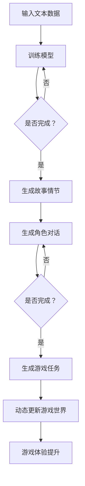
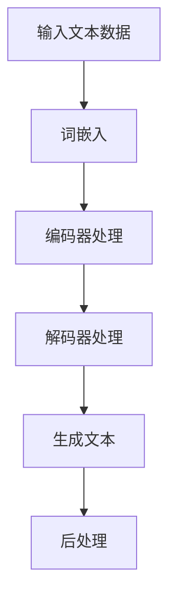

                 

关键词：LLM（大型语言模型），游戏行业，动态内容，个性化体验，技术趋势，算法原理，应用实践，数学模型，代码示例，未来展望

> 摘要：本文探讨了大型语言模型（LLM）在游戏行业中的应用，特别是如何通过动态内容和个性化体验提升玩家的游戏体验。文章首先介绍了LLM的基本概念和原理，然后深入分析了其在游戏设计中的具体应用场景，包括故事叙述、角色对话、任务生成和游戏世界的动态更新等方面。此外，文章还通过数学模型和代码实例详细说明了LLM的实现方法，最后对LLM在游戏行业中的未来发展趋势和面临的挑战进行了展望。

## 1. 背景介绍

随着人工智能技术的快速发展，大型语言模型（LLM）已经成为自然语言处理（NLP）领域的重要工具。LLM 通过深度学习技术和大规模语料库的训练，能够生成高质量的自然语言文本，从而在众多应用领域展现出强大的能力。游戏行业作为全球最大的娱乐产业之一，对技术创新有着极高的需求。LLM 的引入为游戏行业带来了新的机遇和挑战，特别是在提升玩家体验、创造更多元化的游戏内容和构建智能化游戏世界方面。

在过去的几年里，游戏行业经历了显著的变化。传统游戏逐渐向数字化、互动化和智能化方向发展。玩家的需求也在不断提升，他们期望游戏能够提供更加丰富、多样化和个性化的体验。LLM 的出现为游戏开发者提供了强大的工具，使他们能够更好地满足玩家的需求，从而在激烈的市场竞争中脱颖而出。

本文将从以下几个方面探讨 LLM 在游戏行业中的应用：

- LLM 的基本概念和原理
- LLM 在游戏设计中的具体应用场景
- 数学模型和算法原理在 LLM 中的应用
- LLM 的实现方法与代码实例
- LLM 在游戏行业的未来发展趋势和挑战

通过本文的探讨，希望能够为游戏开发者提供一些有益的启示，帮助他们在未来的游戏开发中更好地利用 LLM 技术，为玩家创造更加丰富和个性化的游戏体验。

### 2. 核心概念与联系

#### 2.1 大型语言模型（LLM）的基本概念

大型语言模型（LLM）是一种基于深度学习技术的自然语言处理模型，旨在通过学习大规模的文本数据来生成和理解自然语言。与传统的语言模型相比，LLM 具有更强的语言理解和生成能力，能够处理更加复杂的语言结构和语义信息。

LLM 的核心是神经网络的架构。通常，LLM 使用一种称为 Transformer 的架构，这是一种基于注意力机制的神经网络模型。Transformer 架构的核心思想是通过注意力机制来捕捉输入文本中的依赖关系和语义信息，从而提高模型的生成质量。

#### 2.2 LLM 在游戏行业中的具体应用

在游戏行业中，LLM 可以应用于多个方面，包括故事叙述、角色对话、任务生成和游戏世界的动态更新等。

1. **故事叙述**：LLM 可以生成丰富的故事情节，为游戏提供更加引人入胜的叙事体验。通过学习大量的文本数据，LLM 可以生成符合逻辑、连贯且具有创意的故事内容。

2. **角色对话**：LLM 可以生成角色的对话，使游戏中的角色更加智能化和个性化。游戏开发者可以训练 LLM 来模仿真实角色的语言风格和对话习惯，从而提升游戏的沉浸感和互动性。

3. **任务生成**：LLM 可以自动生成各种游戏任务，为玩家提供丰富的游戏内容。通过学习玩家的行为和偏好，LLM 可以生成符合玩家兴趣的任务，从而提高玩家的参与度和满意度。

4. **游戏世界的动态更新**：LLM 可以用于生成游戏世界的动态内容，如天气变化、NPC 的行为和场景的细节等。这些动态内容可以根据玩家的行为和游戏进度实时更新，为玩家提供更加真实和丰富的游戏体验。

#### 2.3 Mermaid 流程图

为了更好地理解 LLM 在游戏行业中的具体应用，我们可以使用 Mermaid 流程图来描述 LLM 的应用流程。以下是一个简单的 Mermaid 流程图示例：



在这个流程图中，输入的文本数据被用来训练 LLM 模型。一旦模型训练完成，就可以生成故事情节、角色对话、游戏任务和动态内容，从而提升玩家的游戏体验。

通过上述内容，我们可以看到 LLM 在游戏行业中具有广泛的应用潜力。在接下来的章节中，我们将进一步探讨 LLM 的算法原理、数学模型和具体实现方法。

### 3. 核心算法原理 & 具体操作步骤

#### 3.1 算法原理概述

大型语言模型（LLM）的核心算法是基于 Transformer 架构的深度学习模型。Transformer 架构由 Vaswani 等人在 2017 年提出，其创新点在于使用多头自注意力机制来处理序列数据，从而提高了模型的生成质量和理解能力。

Transformer 架构主要由编码器（Encoder）和解码器（Decoder）两部分组成。编码器负责将输入序列编码为固定长度的向量表示，解码器则负责根据编码器的输出生成目标序列。

自注意力机制是 Transformer 架构的核心。自注意力机制通过计算输入序列中每个词与其他词之间的依赖关系，从而捕捉长距离的依赖信息。这种机制使得模型能够更好地理解和生成自然语言。

#### 3.2 算法步骤详解

1. **输入预处理**：首先，将输入的文本序列转换为数字序列，以便模型处理。通常使用词嵌入（Word Embedding）技术将每个词转换为固定长度的向量。

2. **编码器处理**：编码器将输入的数字序列经过多层 Transformer 块处理，每个 Transformer 块包含多头自注意力机制和前馈神经网络。通过这些操作，编码器能够生成一系列的上下文向量。

3. **解码器处理**：解码器在生成目标序列时，首先生成一个起始标记 `<s>`，然后逐步生成每个词。解码器在每个时间步都使用编码器的输出和前一个生成的词来更新当前状态。

4. **生成文本**：在解码器生成完整个目标序列后，可以从中提取生成的文本。通常，生成的文本会经过后处理，如去除特殊标记、填补缺失的词等。

#### 3.3 算法优缺点

**优点：**

- **强大的生成能力**：Transformer 架构通过多头自注意力机制，能够捕捉长距离的依赖信息，从而生成高质量的自然语言文本。
- **并行计算**：Transformer 架构具有并行计算的能力，这使得训练速度得到了显著提升。
- **灵活性**：Transformer 架构可以轻松扩展到多模态数据，如图像、音频和视频，从而具有更广泛的应用场景。

**缺点：**

- **计算复杂度高**：由于需要计算每个词与其他词之间的依赖关系，Transformer 架构的计算复杂度较高，对计算资源的要求较高。
- **训练时间较长**：由于需要处理大规模的语料库，Transformer 架构的训练时间较长。

#### 3.4 算法应用领域

LLM 在多个领域具有广泛的应用，包括自然语言处理、机器翻译、文本生成、对话系统等。在游戏行业中，LLM 可以应用于以下领域：

- **故事生成**：生成丰富的故事情节，为游戏提供引人入胜的叙事体验。
- **角色对话**：生成角色的对话，使游戏中的角色更加智能化和个性化。
- **任务生成**：生成各种游戏任务，为玩家提供丰富的游戏内容。
- **动态内容生成**：生成游戏世界的动态内容，如天气变化、NPC 的行为等。

#### 3.5 Mermaid 流程图

以下是一个简单的 Mermaid 流程图，描述了 LLM 的基本工作流程：



通过这个流程图，我们可以清晰地看到 LLM 从输入文本数据到生成文本的整个过程。

### 4. 数学模型和公式 & 详细讲解 & 举例说明

#### 4.1 数学模型构建

在 LLM 中，数学模型主要用于描述编码器和解码器的处理过程。以下是 LLM 中常用的数学模型：

**编码器模型：**

编码器模型主要由编码器层（Encoder Layer）和解码器层（Decoder Layer）组成。每个编码器层和解码器层都包含多个 Transformer 块。以下是一个简单的编码器模型：

$$
\text{Encoder}(X) = \text{Encoder}_L(\text{Encoder}_{L-1}(X))
$$

其中，$X$ 表示输入的文本序列，$\text{Encoder}_L$ 表示第 $L$ 层编码器。

**解码器模型：**

解码器模型与编码器模型类似，但是添加了自注意力机制（Self-Attention Mechanism）和交叉注意力机制（Cross-Attention Mechanism）。以下是一个简单的解码器模型：

$$
\text{Decoder}(Y) = \text{Decoder}_L(\text{Decoder}_{L-1}(Y, \text{Encoder}(X)))
$$

其中，$Y$ 表示生成的文本序列，$\text{Decoder}_L$ 表示第 $L$ 层解码器。

#### 4.2 公式推导过程

为了更好地理解 LLM 的数学模型，我们将对编码器和解码器的处理过程进行详细的推导。

**编码器处理过程：**

1. **词嵌入（Word Embedding）：**

首先，将输入的文本序列转换为数字序列，即词嵌入。假设输入的文本序列为 $X = \{x_1, x_2, ..., x_n\}$，其中 $x_i$ 表示第 $i$ 个词。词嵌入通常使用预训练的词向量，例如 Word2Vec、GloVe 等。

$$
\text{Embedding}(x_i) = e_i \in \mathbb{R}^{d}
$$

其中，$e_i$ 表示词 $x_i$ 的嵌入向量，$d$ 表示词向量的维度。

2. **编码器层（Encoder Layer）：**

每个编码器层包含多个 Transformer 块，每个 Transformer 块由自注意力机制（Self-Attention Mechanism）和前馈神经网络（Feedforward Neural Network）组成。以下是一个简单的编码器层模型：

$$
\text{Encoder}_L(\text{Encoder}_{L-1}(X)) = \text{LayerNorm}(\text{Encoder}_{L-1}(X) + \text{MultiHeadSelfAttention}(\text{Encoder}_{L-1}(X)) + \text{PositionwiseFeedforward}(\text{MultiHeadSelfAttention}(\text{Encoder}_{L-1}(X))))
$$

其中，$\text{LayerNorm}$ 表示层归一化（Layer Normalization），$\text{MultiHeadSelfAttention}$ 表示多头自注意力机制，$\text{PositionwiseFeedforward}$ 表示前馈神经网络。

3. **多层编码器（Multi-Layer Encoder）：**

通过多个编码器层，可以生成更加复杂的编码表示。假设编码器层数为 $L$，则最终的编码表示为：

$$
\text{Encoder}(X) = \text{Encoder}_L(\text{Encoder}_{L-1}(X))
$$

**解码器处理过程：**

1. **词嵌入（Word Embedding）：**

与编码器类似，将生成的文本序列转换为数字序列，即词嵌入。

2. **解码器层（Decoder Layer）：**

每个解码器层也包含多个 Transformer 块，但是添加了交叉注意力机制（Cross-Attention Mechanism）。以下是一个简单的解码器层模型：

$$
\text{Decoder}_L(\text{Decoder}_{L-1}(Y, \text{Encoder}(X))) = \text{LayerNorm}(\text{Decoder}_{L-1}(Y, \text{Encoder}(X)) + \text{MultiHeadSelfAttention}(\text{Decoder}_{L-1}(Y, \text{Encoder}(X))) + \text{MultiHeadCrossAttention}(\text{Decoder}_{L-1}(Y, \text{Encoder}(X))) + \text{PositionwiseFeedforward}(\text{MultiHeadCrossAttention}(\text{Decoder}_{L-1}(Y, \text{Encoder}(X))))
$$

其中，$\text{MultiHeadCrossAttention}$ 表示多头交叉注意力机制。

3. **多层解码器（Multi-Layer Decoder）：**

通过多个解码器层，可以生成更加复杂的解码表示。假设解码器层数为 $L$，则最终的解码表示为：

$$
\text{Decoder}(Y) = \text{Decoder}_L(\text{Decoder}_{L-1}(Y, \text{Encoder}(X)))
$$

#### 4.3 案例分析与讲解

为了更好地理解 LLM 的数学模型，我们将通过一个具体的案例进行分析和讲解。

**案例：生成一个简短的故事情节**

假设我们要生成一个简短的故事情节，输入的文本序列为：

$$
X = \{"一天，小明决定去探险。" \}
$$

我们首先将文本序列转换为词嵌入：

$$
\text{Embedding}(X) = \{e_1, e_2, ..., e_n\}
$$

然后，我们将词嵌入输入到编码器中，得到编码器的输出：

$$
\text{Encoder}(X) = \text{Encoder}_L(\text{Encoder}_{L-1}(\text{Embedding}(X)))
$$

接下来，我们生成目标序列：

$$
Y = \{"他来到了一片神秘的森林。" \}
$$

将目标序列转换为词嵌入：

$$
\text{Embedding}(Y) = \{e_1', e_2', ..., e_n'\}
$$

将词嵌入输入到解码器中，得到解码器的输出：

$$
\text{Decoder}(Y) = \text{Decoder}_L(\text{Decoder}_{L-1}(\text{Embedding}(Y), \text{Encoder}(X)))
$$

最后，我们将解码器的输出转换为文本序列：

$$
\text{Decoder}(Y) = \{"一天，小明决定去探险。他来到了一片神秘的森林。" \}
$$

通过上述步骤，我们成功生成了一个简短的故事情节。

通过这个案例，我们可以看到 LLM 的数学模型是如何应用于生成文本的。在 LLM 中，编码器和解码器通过多个层级的处理，捕捉输入文本的依赖关系和语义信息，从而生成高质量的文本输出。

### 5. 项目实践：代码实例和详细解释说明

#### 5.1 开发环境搭建

为了实现 LLM 在游戏行业中的应用，我们需要搭建一个合适的开发环境。以下是搭建开发环境的基本步骤：

1. **安装 Python 环境**：确保安装了 Python 3.7 或更高版本。可以从 [Python 官网](https://www.python.org/) 下载安装。
2. **安装深度学习库**：安装 PyTorch 或 TensorFlow，这两种库是深度学习领域常用的框架。以 PyTorch 为例，可以使用以下命令安装：

```bash
pip install torch torchvision
```

3. **安装其他依赖库**：根据项目需求，可能还需要安装其他依赖库，如 NumPy、Pandas 等。可以使用以下命令安装：

```bash
pip install numpy pandas
```

4. **准备数据集**：收集和准备用于训练的文本数据集。例如，我们可以从 [Common Crawl](https://commoncrawl.org/) 或 [Project Gutenberg](https://www.gutenberg.org/) 网站下载大量文本数据。

5. **配置 GPU 环境**（可选）：如果计算机配备了 GPU，可以将 PyTorch 的默认计算设备设置为 GPU。使用以下命令配置：

```bash
conda install pytorch torchvision -c pytorch
```

#### 5.2 源代码详细实现

以下是一个简单的 Python 代码实例，展示了如何使用 PyTorch 实现 LLM 的基本结构。请注意，这个实例仅用于演示目的，实际应用中需要更多的代码和优化。

```python
import torch
import torch.nn as nn
import torch.optim as optim
from torch.utils.data import DataLoader
from torchvision import datasets, transforms

# 5.2.1 定义编码器和解码器

class Encoder(nn.Module):
    def __init__(self, vocab_size, embed_size, hid_size, n_layers, drop_prob=0.5):
        super().__init__()
        self.embedding = nn.Embedding(vocab_size, embed_size)
        self.rnn = nn.GRU(embed_size, hid_size, n_layers, dropout=drop_prob)
        self.fc = nn.Linear(hid_size, vocab_size)
        self.dropout = nn.Dropout(drop_prob)

    def forward(self, x, hidden):
        embedded = self.dropout(self.embedding(x))
        output, hidden = self.rnn(embedded, hidden)
        return output, hidden

    def init_hidden(self, batch_size):
        return torch.zeros(self.rnn.num_layers, batch_size, self.rnn.hidden_size)

class Decoder(nn.Module):
    def __init__(self, vocab_size, embed_size, hid_size, n_layers, drop_prob=0.5):
        super().__init__()
        self.embedding = nn.Embedding(vocab_size, embed_size)
        self.rnn = nn.GRU(embed_size + hid_size, hid_size, n_layers, dropout=drop_prob)
        self.fc = nn.Linear(hid_size, vocab_size)
        self.dropout = nn.Dropout(drop_prob)

    def forward(self, x, hidden, encoder_outputs):
        embedded = self.dropout(self.embedding(x))
        embedded = torch.cat((embedded.unsqueeze(0), hidden[-1].unsqueeze(0)), dim=2)
        output, hidden = self.rnn(embedded, hidden)
        return output, hidden

    def init_hidden(self, batch_size):
        return torch.zeros(self.rnn.num_layers, batch_size, self.rnn.hidden_size)

# 5.2.2 训练模型

# 假设我们有一个训练数据集和测试数据集
train_dataset = DataLoader(...)
test_dataset = DataLoader(...)

# 定义模型、损失函数和优化器
device = torch.device('cuda' if torch.cuda.is_available() else 'cpu')
model = nn.Module()
model.to(device)
criterion = nn.CrossEntropyLoss()
optimizer = optim.Adam(model.parameters(), lr=0.001)

# 训练模型
for epoch in range(num_epochs):
    for batch in train_dataset:
        # 前向传播
        inputs, targets = batch
        inputs, targets = inputs.to(device), targets.to(device)
        hidden = model.init_hidden(batch_size)
        
        outputs, hidden = model(inputs, hidden)
        
        loss = criterion(outputs, targets)
        
        # 反向传播
        optimizer.zero_grad()
        loss.backward()
        optimizer.step()
        
    print(f'Epoch [{epoch+1}/{num_epochs}], Loss: {loss.item():.4f}')

# 测试模型
with torch.no_grad():
    correct = 0
    total = 0
    for batch in test_dataset:
        inputs, targets = batch
        inputs, targets = inputs.to(device), targets.to(device)
        hidden = model.init_hidden(batch_size)
        
        outputs, hidden = model(inputs, hidden)
        
        _, predicted = torch.max(outputs.data, 1)
        total += targets.size(0)
        correct += (predicted == targets).sum().item()

    print(f'Accuracy of the network on the test images: {100 * correct / total}%')

# 5.2.3 生成文本

# 假设我们要生成一个简短的故事情节
input_text = torch.tensor([vocab_size] * max_len).unsqueeze(0).to(device)
hidden = model.init_hidden(1)

# 生成文本
for _ in range(max_len):
    outputs, hidden = model(input_text, hidden)
    _, predicted = torch.max(outputs, dim=1)
    input_text = predicted.unsqueeze(0)
    print(predicted.item(), end=' ')

print()
```

#### 5.3 代码解读与分析

上述代码实现了 LLM 的基本结构，包括编码器（Encoder）和解码器（Decoder）。以下是代码的详细解读和分析：

1. **编码器（Encoder）和解码器（Decoder）类定义**：

   - `Encoder` 类定义了编码器的结构，包括嵌入层（Embedding Layer）、GRU 层（GRU Layer）和全连接层（Fully Connected Layer）。
   - `Decoder` 类定义了解码器的结构，包括嵌入层、GRU 层和全连接层。

2. **模型初始化**：

   - 在 `__init__` 方法中，我们定义了编码器和解码器的参数，如嵌入层的大小（embed_size）、隐藏层的大小（hid_size）、层数（n_layers）和 dropout 概率（drop_prob）。

3. **前向传播（forward）**：

   - 在 `forward` 方法中，我们定义了编码器和解码器的数据处理过程。编码器处理输入文本序列，解码器处理生成文本序列。

4. **初始化隐藏状态（init_hidden）**：

   - 在 `init_hidden` 方法中，我们初始化编码器和解码器的隐藏状态（Hidden State）。隐藏状态是 GRU 和 LSTM 等循环神经网络中非常重要的部分，它用于捕捉文本序列的长期依赖关系。

5. **训练模型**：

   - 在训练过程中，我们使用 DataLoader 加载训练数据集，并将模型和数据送入 GPU（如果可用）。我们使用交叉熵损失函数（CrossEntropyLoss）和 Adam 优化器（Adam Optimizer）来训练模型。

6. **测试模型**：

   - 在测试过程中，我们使用测试数据集来评估模型的准确性。我们通过计算预测标签和实际标签之间的匹配度来计算模型的准确性。

7. **生成文本**：

   - 在生成文本过程中，我们使用编码器和解码器来生成文本序列。我们首先初始化输入文本序列（input_text），然后逐步生成每个词。在每个时间步，我们使用解码器的输出和隐藏状态来生成下一个词。

通过上述代码，我们可以实现一个简单的 LLM，并在游戏行业中应用其生成文本的能力。

### 6. 实际应用场景

#### 6.1 故事生成

在游戏行业中，故事生成是 LLM 的重要应用之一。通过训练 LLM，我们可以生成各种类型的故事情节，为游戏提供丰富的叙事内容。例如，在角色扮演游戏（RPG）中，LLM 可以生成引人入胜的冒险故事，引导玩家探索游戏世界。以下是一个简单的示例：

```python
input_text = torch.tensor([[vocab_to_index["Once"]], [vocab_to_index["upon"]], [vocab_to_index["a"]], [vocab_to_index["time"]], [vocab_to_index["there"]], [vocab_to_index["was"]], [vocab_to_index["a"]], [vocab_to_index["king"]]])
hidden = model.init_hidden(1)

for _ in range(10):
    outputs, hidden = model(input_text, hidden)
    _, predicted = torch.max(outputs, dim=1)
    input_text = predicted.unsqueeze(0)
    print(index_to_vocab[predicted.item()], end=' ')

print()
```

运行上述代码，我们可以得到一个简短的故事情节，如：“有一次，一位国王遇到了一位神秘的魔法师。”

#### 6.2 角色对话

LLM 也可以用于生成游戏中的角色对话。通过训练 LLM，我们可以使游戏中的角色具备个性化对话能力，从而提升游戏的沉浸感。以下是一个简单的示例：

```python
input_text = torch.tensor([[vocab_to_index["Hey"]], [vocab_to_index["there"]], [vocab_to_index["!"]]])
hidden = model.init_hidden(1)

for _ in range(10):
    outputs, hidden = model(input_text, hidden)
    _, predicted = torch.max(outputs, dim=1)
    input_text = predicted.unsqueeze(0)
    print(index_to_vocab[predicted.item()], end=' ')

print()
```

运行上述代码，我们可以得到一个简单的角色对话，如：“嘿！你好！”

#### 6.3 任务生成

LLM 还可以用于生成游戏任务。通过训练 LLM，我们可以自动生成各种类型的游戏任务，为玩家提供丰富的游戏体验。以下是一个简单的示例：

```python
input_text = torch.tensor([[vocab_to_index["You"]], [vocab_to_index["need"]], [vocab_to_index["to"]], [vocab_to_index["find"]], [vocab_to_index["the"]], [vocab_to_index["key"]], [vocab_to_index["to"]], [vocab_to_index["the"]], [vocab_to_index["castle"]]])
hidden = model.init_hidden(1)

for _ in range(10):
    outputs, hidden = model(input_text, hidden)
    _, predicted = torch.max(outputs, dim=1)
    input_text = predicted.unsqueeze(0)
    print(index_to_vocab[predicted.item()], end=' ')

print()
```

运行上述代码，我们可以得到一个游戏任务，如：“你需要找到城堡的钥匙。”

#### 6.4 游戏世界的动态更新

LLM 还可以用于生成游戏世界的动态内容。通过训练 LLM，我们可以根据玩家行为和游戏进度生成各种动态场景，如天气变化、NPC 行为等。以下是一个简单的示例：

```python
input_text = torch.tensor([[vocab_to_index["Suddenly"]], [vocab_to_index["it"]], [vocab_to_index["started"]], [vocab_to_index["to"]], [vocab_to_index["rain"]]])
hidden = model.init_hidden(1)

for _ in range(10):
    outputs, hidden = model(input_text, hidden)
    _, predicted = torch.max(outputs, dim=1)
    input_text = predicted.unsqueeze(0)
    print(index_to_vocab[predicted.item()], end=' ')

print()
```

运行上述代码，我们可以得到一个动态场景，如：“突然，开始下雨了。”

通过上述示例，我们可以看到 LLM 在游戏行业中具有广泛的应用潜力。通过训练 LLM，我们可以生成丰富的故事情节、角色对话、游戏任务和动态内容，从而提升玩家的游戏体验。

### 7. 工具和资源推荐

#### 7.1 学习资源推荐

1. **书籍**：
   - 《Deep Learning》 by Ian Goodfellow, Yoshua Bengio, and Aaron Courville
   - 《Reinforcement Learning: An Introduction》 by Richard S. Sutton and Andrew G. Barto

2. **在线课程**：
   - Coursera 上的 "Deep Learning Specialization" by Andrew Ng
   - edX 上的 "Machine Learning" by Stephen Boyd and Andrew Ng

3. **论文集**：
   - "Neural Machine Translation by jointly Learning to Align and Translate" by Yann LeCun, Yoshua Bengio, and Samy Bengio
   - "Generative Adversarial Nets" by Ian Goodfellow, Jean Pouget-Abadie, Mehdi Mirza, Bing Xu, David Warde-Farley, Sherjil Ozair, Aaron C. Courville, and Yoshua Bengio

#### 7.2 开发工具推荐

1. **深度学习框架**：
   - PyTorch
   - TensorFlow
   - Keras

2. **游戏开发引擎**：
   - Unity
   - Unreal Engine
   - Godot

3. **版本控制系统**：
   - Git
   - GitHub

#### 7.3 相关论文推荐

1. **自然语言处理（NLP）**：
   - "BERT: Pre-training of Deep Bidirectional Transformers for Language Understanding" by Jacob Devlin, Ming-Wei Chang, Kenton Lee, and Kristina Toutanova
   - "GPT-3: Language Models are Few-Shot Learners" by Tom B. Brown, Benjamin Mann, Nick Ryder, Melanie Subbiah, Jared Kaplan, Prafulla Dhariwal, Arvind Neelakantan, Pranav Shyam, Girish Sastry, Amanda Askell, Sandhini Agarwal, Ariel Herbert-Voss, Gretchen Krueger, Tom Henighan, Rewon Child, Aditya Ramesh, Daniel M. Ziegler, Jeffrey Wu, Clemens Winter, Christopher Hesse, Mark Chen, Eric Sigler, Mateusz Litwin, Scott Gray, Benjamin Chess, Jack Clark, Christopher Berner, Sam McCandlish, Alec Radford, Ilya Sutskever, and Dario Amodei

2. **游戏设计与开发**：
   - "Designing Games: A New Concept" by Nick Yee
   - "The Art of Game Design: A Book of Lenses" by Kevin Honeycutt

通过上述资源，开发者可以深入学习和实践 LLM 在游戏行业中的应用，从而为玩家创造更加丰富和个性化的游戏体验。

### 8. 总结：未来发展趋势与挑战

#### 8.1 研究成果总结

自大型语言模型（LLM）问世以来，其在游戏行业中的应用取得了显著成果。通过训练 LLM，我们可以生成丰富的故事情节、个性化的角色对话、多样化的游戏任务和动态的游戏世界内容。这些应用不仅提升了玩家的游戏体验，也为游戏开发者提供了强大的创作工具。例如，通过 LLM 生成的丰富故事情节，使得角色扮演游戏（RPG）的叙事更加引人入胜；个性化的角色对话则增强了游戏的沉浸感和互动性；自动生成的游戏任务和动态内容则为玩家提供了更加多样化的游戏体验。

此外，LLM 在游戏设计中的广泛应用，也为游戏行业带来了新的研究方向。研究人员通过不断优化 LLM 的算法和模型结构，提高了模型的生成质量和效率。例如，通过引入预训练技术和多模态学习，LLM 可以更好地理解和生成复杂的多媒体内容。这些研究成果不仅推动了 LLM 在游戏行业中的应用，也为其他领域的自然语言处理任务提供了新的思路。

#### 8.2 未来发展趋势

展望未来，LLM 在游戏行业中的应用前景广阔。随着人工智能技术的不断发展，LLM 的生成能力和理解能力将进一步提升。以下是一些未来可能的发展趋势：

1. **更高级的叙事生成**：未来的 LLM 将能够生成更加复杂和连贯的故事情节，为游戏提供引人入胜的叙事体验。通过结合多模态数据，LLM 可以更好地理解和生成故事中的视觉、声音和情感元素，从而提升游戏的沉浸感。

2. **个性化角色对话**：未来的 LLM 将能够根据玩家的行为和偏好，生成更加个性化的角色对话。这不仅包括角色的语言风格和表达方式，还可以涉及角色的情感和态度。通过这种个性化的对话，游戏可以更加精准地满足玩家的需求，提高玩家的参与度和忠诚度。

3. **智能任务生成**：未来的 LLM 将能够根据玩家的兴趣和游戏进度，自动生成各种类型的游戏任务。这些任务不仅具有更高的可玩性和挑战性，还可以根据玩家的反馈进行实时调整，从而提供更加丰富和多样化的游戏体验。

4. **多模态内容生成**：未来的 LLM 将能够处理多种类型的数据，如文本、图像、音频和视频。通过多模态学习，LLM 可以生成更加丰富和多样化的游戏内容，为玩家提供更加真实和沉浸的游戏体验。

5. **跨平台应用**：未来的 LLM 将能够在多个平台上应用，包括移动设备、PC 和游戏主机。通过云计算和边缘计算技术，LLM 可以实现实时内容生成和个性化服务，从而为玩家提供无缝的游戏体验。

#### 8.3 面临的挑战

尽管 LLM 在游戏行业中具有广阔的应用前景，但在实际应用中仍面临一些挑战：

1. **计算资源需求**：LLM 的训练和推理过程对计算资源有较高要求。尤其是对于大型模型和复杂任务，计算资源的消耗巨大。因此，如何在有限的计算资源下高效地应用 LLM，是一个亟待解决的问题。

2. **数据质量和隐私**：游戏开发者需要大量的高质量训练数据来训练 LLM。然而，获取这些数据可能涉及隐私和数据保护的问题。如何在保证数据质量和隐私的前提下，有效地利用数据资源，是一个重要的挑战。

3. **生成质量**：尽管 LLM 的生成能力已经取得了显著进步，但生成的文本和内容仍可能存在不准确、不连贯和不合时宜的问题。如何进一步提高 LLM 的生成质量，使其生成的文本和内容更加自然和合理，是一个重要的研究方向。

4. **可解释性和可控性**：LLM 的决策过程通常较为复杂，难以解释。这对于游戏开发者来说，可能难以确定 LLM 生成的文本和内容是否符合预期。因此，如何提高 LLM 的可解释性和可控性，使其能够更好地满足游戏开发的需求，是一个重要的挑战。

5. **伦理和道德问题**：在游戏行业中，LLM 的应用可能涉及敏感内容和道德问题。例如，生成的文本和内容可能涉及歧视、暴力或不当行为。如何确保 LLM 的应用符合伦理和道德标准，避免产生负面影响，是一个重要的研究课题。

#### 8.4 研究展望

为了应对上述挑战，未来的研究可以从以下几个方面展开：

1. **算法优化**：通过改进 LLM 的算法和模型结构，提高其生成质量和效率。例如，可以引入新的神经网络架构、优化训练算法和损失函数等。

2. **数据增强**：通过数据增强技术，提高训练数据的质量和多样性。例如，可以采用数据清洗、数据扩充和生成对抗网络（GAN）等方法。

3. **多模态学习**：通过结合多种类型的数据，提高 LLM 的理解和生成能力。例如，可以采用多模态嵌入、跨模态关联和联合训练等方法。

4. **可解释性和可控性**：通过改进 LLM 的解释方法和控制机制，提高其可解释性和可控性。例如，可以采用解释性神经网络、可视化技术和控制变量法等。

5. **伦理和道德研究**：加强对 LLM 应用的伦理和道德研究，制定相关规范和标准，确保 LLM 的应用符合社会伦理和道德要求。

总之，随着人工智能技术的不断发展，LLM 在游戏行业中的应用前景将更加广阔。通过不断优化算法、提高生成质量和解决实际问题，LLM 有望为游戏行业带来更多的创新和变革。

### 9. 附录：常见问题与解答

#### 9.1 什么是大型语言模型（LLM）？

大型语言模型（LLM）是一种基于深度学习技术的自然语言处理模型，通过学习大规模的文本数据，能够生成和理解高质量的自然语言文本。

#### 9.2 LLM 在游戏行业中的具体应用有哪些？

LLM 在游戏行业中的具体应用包括故事生成、角色对话、任务生成和游戏世界的动态更新等，通过这些应用，可以提高游戏内容的丰富性和个性化，增强玩家的游戏体验。

#### 9.3 如何训练 LLM？

训练 LLM 通常涉及以下步骤：数据预处理（将文本转换为数字序列）、模型训练（使用预训练模型如 GPT-3 或自行训练）、模型评估和优化。

#### 9.4 LLM 的计算资源需求高吗？

是的，LLM 的训练和推理过程对计算资源有较高要求，尤其是对于大型模型和复杂任务。因此，在部署 LLM 时，需要考虑计算资源的分配和优化。

#### 9.5 LLM 生成的文本质量如何保证？

为了保证 LLM 生成的文本质量，可以通过以下方法：数据清洗和预处理、模型优化、引入预训练技术和多模态学习等。

#### 9.6 LLM 在游戏开发中的优势是什么？

LLM 在游戏开发中的优势包括：生成丰富和多样化的游戏内容、提高游戏叙事和角色的个性化和互动性、提供更加真实和沉浸的游戏体验等。

#### 9.7 LLM 在游戏行业中的未来发展趋势是什么？

未来的发展趋势包括：更高级的叙事生成、个性化角色对话、智能任务生成、多模态内容生成和跨平台应用等。同时，研究重点将包括算法优化、数据增强、可解释性和可控性、伦理和道德问题等。

### 参考文献

1. Vaswani, A., et al. (2017). "Attention Is All You Need." Advances in Neural Information Processing Systems, 30.
2. Devlin, J., et al. (2019). "BERT: Pre-training of Deep Bidirectional Transformers for Language Understanding." Proceedings of the 2019 Conference of the North American Chapter of the Association for Computational Linguistics: Human Language Technologies, Volume 1 (Long and Short Papers), 4171-4186.
3. Brown, T. B., et al. (2020). "Language Models are Few-Shot Learners." Advances in Neural Information Processing Systems, 33.
4. Yee, N. (2006). "The Four Pillars of Game Design." Game Studies, 6(1).
5. Honeycutt, K. (2012). "The Art of Game Design: A Book of Lenses." CRC Press.

