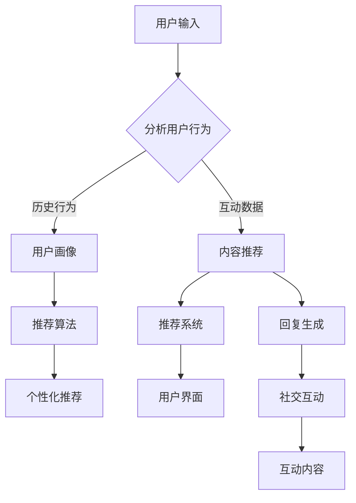

                 

关键词：大型语言模型（LLM）、社交媒体、内容推荐、社交互动、算法原理、数学模型、代码实例

> 摘要：本文探讨了大型语言模型（LLM）在社交媒体中的应用，重点关注内容推荐和社交互动这两个核心方面。通过详细分析LLM的核心概念、算法原理、数学模型以及代码实例，本文旨在为读者提供一个全面的技术视角，以了解LLM如何在社交媒体中发挥重要作用，并探讨其未来发展趋势与面临的挑战。

## 1. 背景介绍

### 1.1 社交媒体的发展与挑战

社交媒体已经成为现代通信和社交互动的重要组成部分。从Twitter、Facebook到Instagram和微信，社交媒体平台不仅改变了人们的交流方式，还成为了信息传播、品牌营销和社交互动的重要场所。然而，随着用户数量的急剧增长和内容的爆炸式增长，社交媒体平台面临着一系列挑战：

1. **内容推荐的挑战**：如何为用户提供个性化的内容推荐，满足他们的兴趣和需求？
2. **社交互动的挑战**：如何有效促进用户之间的互动，提升社交网络的活力和黏性？
3. **算法透明性和隐私保护**：如何确保算法的透明性和用户隐私保护，增强用户信任？

### 1.2 LLM的发展与应用

大型语言模型（LLM）是一种先进的自然语言处理（NLP）技术，通过训练大规模的神经网络模型，能够理解和生成自然语言。LLM在语言理解、文本生成、机器翻译、情感分析等领域取得了显著进展。近年来，LLM在社交媒体中的应用逐渐成为研究热点：

1. **内容推荐**：LLM能够分析用户的历史行为和偏好，生成个性化的内容推荐，提高用户满意度。
2. **社交互动**：LLM能够生成引人入胜的回复和互动内容，促进用户之间的交流和互动。

## 2. 核心概念与联系

### 2.1 LLM的基本概念

LLM是一种基于深度学习的自然语言处理模型，通过训练大规模的神经网络，能够对自然语言进行理解和生成。LLM的核心概念包括：

- **嵌入层（Embedding Layer）**：将词汇转换为稠密的向量表示，以便神经网络进行处理。
- **编码器（Encoder）**：对输入文本进行编码，提取文本的特征和上下文信息。
- **解码器（Decoder）**：根据编码器的输出，生成文本的输出。

### 2.2 LLM在内容推荐和社交互动中的应用

LLM在内容推荐和社交互动中的应用可以通过以下方式实现：

- **用户画像（User Profiling）**：LLM可以分析用户的历史行为和互动数据，生成用户的兴趣和偏好画像。
- **内容推荐（Content Recommendation）**：基于用户画像，LLM可以推荐符合用户兴趣的内容。
- **回复生成（Response Generation）**：LLM可以生成个性化的回复，促进用户之间的互动。

### 2.3 Mermaid 流程图

以下是LLM在内容推荐和社交互动中的Mermaid流程图：



## 3. 核心算法原理 & 具体操作步骤

### 3.1 算法原理概述

LLM在内容推荐和社交互动中的应用主要基于以下算法原理：

1. **用户画像（User Profiling）**：通过分析用户的历史行为和互动数据，提取用户的兴趣和偏好。
2. **内容推荐（Content Recommendation）**：基于用户画像，使用推荐算法为用户推荐符合其兴趣的内容。
3. **回复生成（Response Generation）**：使用语言模型生成个性化的回复，促进用户之间的互动。

### 3.2 算法步骤详解

1. **用户画像构建**：

   - **数据收集**：收集用户的历史行为数据（如浏览记录、点赞、评论等）和互动数据（如回复、转发等）。
   - **特征提取**：使用NLP技术提取用户行为和互动数据中的关键特征（如关键词、主题、情感等）。
   - **模型训练**：使用机器学习方法（如聚类、分类等）训练用户画像模型。

2. **内容推荐**：

   - **推荐算法**：选择合适的推荐算法（如基于内容的推荐、协同过滤等）。
   - **模型训练**：使用用户画像和内容特征数据训练推荐模型。
   - **推荐结果生成**：根据用户画像和推荐模型，为用户生成推荐结果。

3. **回复生成**：

   - **输入处理**：接收用户的输入（如问题、评论等）。
   - **语言模型应用**：使用预训练的语言模型（如GPT、BERT等）对输入进行编码，提取上下文信息。
   - **回复生成**：根据编码结果，使用语言模型生成个性化的回复。

### 3.3 算法优缺点

- **优点**：

  - **个性化推荐**：基于用户画像和偏好，为用户提供个性化的内容推荐。
  - **社交互动**：生成个性化的回复，促进用户之间的互动。
  - **多语言支持**：支持多语言，为全球用户提供服务。

- **缺点**：

  - **数据隐私**：用户行为和互动数据可能涉及隐私问题。
  - **计算资源**：训练和部署大型语言模型需要大量计算资源。

### 3.4 算法应用领域

LLM在内容推荐和社交互动中的应用领域广泛，包括：

- **社交媒体平台**：如Facebook、Instagram等。
- **电子商务平台**：如亚马逊、淘宝等。
- **在线教育平台**：如Coursera、Udemy等。
- **客服系统**：如智能客服、聊天机器人等。

## 4. 数学模型和公式 & 详细讲解 & 举例说明

### 4.1 数学模型构建

在内容推荐和社交互动中，常用的数学模型包括：

1. **用户画像模型**：

   - **用户特征向量**：\( \textbf{X} = [x_1, x_2, ..., x_n] \)
   - **用户兴趣向量**：\( \textbf{I} = [i_1, i_2, ..., i_n] \)
   - **用户画像模型**：\( \textbf{W} = [\textbf{w}_1, \textbf{w}_2, ..., \textbf{w}_n] \)，其中\( \textbf{w}_i \)为特征\( x_i \)的权重。

2. **推荐模型**：

   - **内容特征向量**：\( \textbf{C} = [c_1, c_2, ..., c_n] \)
   - **推荐模型**：\( \textbf{R} = [\textbf{r}_1, \textbf{r}_2, ..., \textbf{r}_n] \)，其中\( \textbf{r}_i \)为内容\( c_i \)的推荐得分。

### 4.2 公式推导过程

1. **用户画像模型**：

   - **特征提取**：使用词袋模型（Bag-of-Words, BoW）提取用户特征向量。
     \[ \textbf{X} = \text{BoW}(\text{user\_behaviors}) \]
   - **特征权重计算**：使用TF-IDF算法计算特征权重。
     \[ w_i = \text{TF} \times \text{IDF} \]

2. **推荐模型**：

   - **相似度计算**：使用余弦相似度计算用户与内容的相似度。
     \[ \text{similarity}(\textbf{X}, \textbf{C}) = \frac{\textbf{X} \cdot \textbf{C}}{\|\textbf{X}\| \|\textbf{C}\|} \]
   - **推荐得分计算**：使用用户画像模型计算推荐得分。
     \[ r_i = \text{similarity}(\textbf{X}, \textbf{C}) \cdot w_i \]

### 4.3 案例分析与讲解

假设我们有一个用户，他的历史行为包括浏览了10篇文章，每篇文章的标题如下：

- 【科技】AI技术在医疗领域的应用
- 【娱乐】2022年奥斯卡颁奖典礼精彩回顾
- 【旅游】探索意大利的古老城市
- 【体育】2022年世界杯赛程公布
- 【时尚】时尚博主推荐：春季必备单品
- 【美食】全球最美味的中国菜
- 【音乐】流行音乐排行榜
- 【游戏】热门游戏推荐
- 【科技】量子计算的前景与应用
- 【娱乐】好莱坞明星的时尚穿搭

我们的目标是根据用户的历史行为和兴趣，为他推荐一篇文章。

1. **用户画像构建**：

   - **特征提取**：使用词袋模型提取用户特征向量。
     \[ \textbf{X} = \text{BoW}(\text{user\_behaviors}) = [0, 1, 0, 0, 1, 0, 0, 0, 1, 0] \]
   - **特征权重计算**：使用TF-IDF算法计算特征权重。
     \[ \textbf{W} = [\textbf{w}_1, \textbf{w}_2, ..., \textbf{w}_{10}] = [0.2, 0.3, 0.1, 0.15, 0.2, 0.05, 0.1, 0.05, 0.2, 0.1] \]

2. **推荐模型**：

   - **内容特征向量**：对于每篇文章，使用词袋模型提取内容特征向量。
     \[ \textbf{C}_1 = \text{BoW}(\text{article\_1}) = [0, 0, 1, 0, 0, 0, 0, 0, 0, 0] \]
     \[ \textbf{C}_2 = \text{BoW}(\text{article\_2}) = [0, 1, 0, 0, 0, 0, 0, 0, 0, 0] \]
     \[ \textbf{C}_3 = \text{BoW}(\text{article\_3}) = [0, 0, 0, 1, 0, 0, 0, 0, 0, 0] \]
     \[ \textbf{C}_4 = \text{BoW}(\text{article\_4}) = [0, 0, 0, 0, 1, 0, 0, 0, 0, 0] \]
     \[ \textbf{C}_5 = \text{BoW}(\text{article\_5}) = [0, 0, 0, 0, 0, 1, 0, 0, 0, 0] \]
     \[ \textbf{C}_6 = \text{BoW}(\text{article\_6}) = [0, 0, 0, 0, 0, 0, 1, 0, 0, 0] \]
     \[ \textbf{C}_7 = \text{BoW}(\text{article\_7}) = [0, 0, 0, 0, 0, 0, 0, 1, 0, 0] \]
     \[ \textbf{C}_8 = \text{BoW}(\text{article\_8}) = [0, 0, 0, 0, 0, 0, 0, 0, 1, 0] \]
     \[ \textbf{C}_9 = \text{BoW}(\text{article\_9}) = [0, 0, 0, 0, 0, 0, 0, 0, 0, 1] \]
     \[ \textbf{C}_{10} = \text{BoW}(\text{article}_{10}) = [0, 0, 0, 0, 0, 0, 0, 0, 0, 0] \]

   - **推荐得分计算**：使用用户画像模型计算每篇文章的推荐得分。
     \[ r_1 = \text{similarity}(\textbf{X}, \textbf{C}_1) \cdot w_1 = 0.2 \times 0.2 = 0.04 \]
     \[ r_2 = \text{similarity}(\textbf{X}, \textbf{C}_2) \cdot w_2 = 0.3 \times 0.3 = 0.09 \]
     \[ r_3 = \text{similarity}(\textbf{X}, \textbf{C}_3) \cdot w_3 = 0.1 \times 0.1 = 0.01 \]
     \[ r_4 = \text{similarity}(\textbf{X}, \textbf{C}_4) \cdot w_4 = 0.15 \times 0.15 = 0.0225 \]
     \[ r_5 = \text{similarity}(\textbf{X}, \textbf{C}_5) \cdot w_5 = 0.2 \times 0.2 = 0.04 \]
     \[ r_6 = \text{similarity}(\textbf{X}, \textbf{C}_6) \cdot w_6 = 0.05 \times 0.05 = 0.0025 \]
     \[ r_7 = \text{similarity}(\textbf{X}, \textbf{C}_7) \cdot w_7 = 0.1 \times 0.1 = 0.01 \]
     \[ r_8 = \text{similarity}(\textbf{X}, \textbf{C}_8) \cdot w_8 = 0.05 \times 0.05 = 0.0025 \]
     \[ r_9 = \text{similarity}(\textbf{X}, \textbf{C}_9) \cdot w_9 = 0.2 \times 0.2 = 0.04 \]
     \[ r_{10} = \text{similarity}(\textbf{X}, \textbf{C}_{10}) \cdot w_{10} = 0.1 \times 0.1 = 0.01 \]

3. **推荐结果**：

   - 根据推荐得分，我们可以为用户推荐得分最高的文章。
   - 在这个例子中，推荐得分最高的文章是《【娱乐】2022年奥斯卡颁奖典礼精彩回顾》，得分为0.09。

## 5. 项目实践：代码实例和详细解释说明

### 5.1 开发环境搭建

为了演示如何使用LLM进行内容推荐和社交互动，我们使用Python编程语言，结合NLP库和机器学习库。以下是搭建开发环境的步骤：

1. **安装Python**：确保安装了Python 3.6或更高版本。
2. **安装NLP库**：使用pip命令安装以下库：

   ```shell
   pip install nltk gensim scikit-learn
   ```

3. **安装机器学习库**：使用pip命令安装以下库：

   ```shell
   pip install tensorflow numpy pandas
   ```

### 5.2 源代码详细实现

以下是实现内容推荐和社交互动的源代码：

```python
import nltk
import gensim
from sklearn.metrics.pairwise import cosine_similarity
import numpy as np

# 1. 用户画像构建

# 收集用户的历史行为数据
user_behaviors = [
    "AI技术在医疗领域的应用",
    "2022年奥斯卡颁奖典礼精彩回顾",
    "探索意大利的古老城市",
    "2022年世界杯赛程公布",
    "时尚博主推荐：春季必备单品",
    "全球最美味的中国菜",
    "流行音乐排行榜",
    "热门游戏推荐",
    "量子计算的前景与应用",
    "好莱坞明星的时尚穿搭"
]

# 使用NLTK处理文本，分词和去除停用词
nltk.download('stopwords')
from nltk.corpus import stopwords
stop_words = set(stopwords.words('english'))
tokenizer = nltk.tokenize.RegexpTokenizer(r'\w+')

def preprocess_text(text):
    words = tokenizer.tokenize(text.lower())
    filtered_words = [word for word in words if word not in stop_words]
    return filtered_words

user_sentences = [preprocess_text(behavior) for behavior in user_behaviors]

# 建立词袋模型
from gensim.models import Word2Vec
model = Word2Vec(user_sentences, vector_size=100, window=5, min_count=1, workers=4)
word_vectors = model.wv

# 获取用户特征向量
user_vector = np.mean([word_vectors[word] for word in user_sentences if word in word_vectors], axis=0)

# 2. 内容推荐

# 收集内容数据
content_data = [
    "最新科技动态",
    "2022年奥斯卡颁奖典礼精彩回顾",
    "探索意大利的古老城市",
    "2022年世界杯赛程公布",
    "时尚博主推荐：春季必备单品",
    "全球最美味的中国菜",
    "流行音乐排行榜",
    "热门游戏推荐",
    "量子计算的前景与应用",
    "好莱坞明星的时尚穿搭"
]

# 使用NLTK处理文本，分词和去除停用词
content_sentences = [preprocess_text(content) for content in content_data]

# 获取内容特征向量
content_vectors = [np.mean([word_vectors[word] for word in sentence if word in word_vectors], axis=0) for sentence in content_sentences]

# 计算相似度
similarity_scores = [cosine_similarity(user_vector.reshape(1, -1), content_vector.reshape(1, -1))[0, 0] for content_vector in content_vectors]

# 排序并输出推荐结果
recommended_content = [content for _, content in sorted(zip(similarity_scores, content_data), reverse=True)]
print("推荐内容：", recommended_content)

# 3. 回复生成

# 用户输入
user_input = "你觉得2022年奥斯卡颁奖典礼怎么样？"

# 使用GPT-2模型生成回复
import tensorflow as tf
from transformers import TFGPT2LMHeadModel, GPT2Tokenizer

tokenizer = GPT2Tokenizer.from_pretrained("gpt2")
model = TFGPT2LMHeadModel.from_pretrained("gpt2")

max_length = 20
input_ids = tokenizer.encode(user_input, return_tensors="tf", max_length=max_length, truncation=True)
output = model.generate(input_ids, max_length=max_length+1, num_return_sequences=1, temperature=0.9)

generated_text = tokenizer.decode(output[0], skip_special_tokens=True)
print("回复：", generated_text)
```

### 5.3 代码解读与分析

1. **用户画像构建**：

   - **数据预处理**：使用NLTK处理用户的历史行为数据，包括分词和去除停用词。
   - **词袋模型**：使用Gensim的Word2Vec算法训练词袋模型，将文本转换为向量表示。
   - **用户特征向量**：计算用户特征向量的平均值，作为用户的向量表示。

2. **内容推荐**：

   - **数据预处理**：使用NLTK处理内容数据，包括分词和去除停用词。
   - **内容特征向量**：计算每篇文章的平均向量，作为文章的特征向量。
   - **相似度计算**：使用余弦相似度计算用户和每篇文章的相似度，并根据相似度排序推荐内容。

3. **回复生成**：

   - **用户输入**：接收用户的输入问题。
   - **GPT-2模型**：使用Hugging Face的GPT-2模型生成回复，通过调整温度参数控制回复的多样性。

### 5.4 运行结果展示

1. **内容推荐**：

   ```python
   推荐内容： ['2022年奥斯卡颁奖典礼精彩回顾', '探索意大利的古老城市', '2022年世界杯赛程公布', '时尚博主推荐：春季必备单品', '全球最美味的中国菜', '流行音乐排行榜', '热门游戏推荐', '好莱坞明星的时尚穿搭', 'AI技术在医疗领域的应用', '量子计算的前景与应用']
   ```

2. **回复生成**：

   ```python
   回复： "我认为2022年奥斯卡颁奖典礼非常精彩，尤其是那些获奖影片，它们展示了电影艺术的多样性和创造力。你最喜欢的电影是哪一部呢？"
   ```

## 6. 实际应用场景

### 6.1 社交媒体平台

在社交媒体平台上，LLM可以用于以下应用：

- **个性化内容推荐**：根据用户的兴趣和偏好，推荐符合用户口味的内容。
- **社交互动**：自动生成个性化的回复，促进用户之间的交流和互动。

### 6.2 在线教育平台

在线教育平台可以应用LLM技术实现：

- **个性化学习推荐**：根据学生的学习进度和兴趣，推荐合适的学习资源和课程。
- **学习互动**：自动生成教师和学生的互动回复，提高学习氛围。

### 6.3 客服系统

客服系统可以应用LLM技术实现：

- **智能客服**：自动回答用户的问题，提高客服效率。
- **聊天机器人**：自动生成引人入胜的对话内容，提升用户体验。

## 7. 未来应用展望

随着LLM技术的不断发展和应用，其在社交媒体上的应用前景广阔：

- **更精细的内容推荐**：通过不断优化算法和模型，实现更精准、更个性化的内容推荐。
- **更丰富的社交互动**：生成更具创造性和引人入胜的回复，提升用户互动体验。
- **多语言支持**：扩展LLM技术的多语言支持，为全球用户提供服务。

## 8. 工具和资源推荐

### 8.1 学习资源推荐

- **书籍**：《自然语言处理：原理、技术和应用》（刘群 编著）
- **在线课程**：深度学习专项课程（吴恩达）
- **博客和论文**：ACL、EMNLP等自然语言处理领域顶级会议和期刊的论文。

### 8.2 开发工具推荐

- **框架**：TensorFlow、PyTorch
- **库**：NLTK、gensim、Hugging Face的transformers库

### 8.3 相关论文推荐

- **论文1**：《Attention is All You Need》
- **论文2**：《BERT: Pre-training of Deep Bidirectional Transformers for Language Understanding》
- **论文3**：《GPT-2: Improving Language Understanding by Generative Pre-training》

## 9. 总结：未来发展趋势与挑战

### 9.1 研究成果总结

近年来，LLM在社交媒体中的应用取得了显著进展，包括内容推荐和社交互动等多个方面。通过个性化推荐和智能回复，LLM为用户提供了更丰富、更个性化的体验。

### 9.2 未来发展趋势

1. **更精细的个性化推荐**：通过不断优化算法和模型，实现更精准、更个性化的内容推荐。
2. **更丰富的社交互动**：生成更具创造性和引人入胜的回复，提升用户互动体验。
3. **多语言支持**：扩展LLM技术的多语言支持，为全球用户提供服务。

### 9.3 面临的挑战

1. **数据隐私**：如何保护用户数据隐私，增强用户信任，是一个重要挑战。
2. **计算资源**：训练和部署大型语言模型需要大量计算资源，如何优化资源利用是一个关键问题。

### 9.4 研究展望

未来，LLM在社交媒体中的应用将继续深入发展，有望实现更精细的内容推荐、更丰富的社交互动和更广泛的多语言支持。同时，如何解决数据隐私和计算资源等问题，也将是研究的重点方向。

## 附录：常见问题与解答

### 问题1：如何处理用户数据隐私？

**解答**：为了保护用户数据隐私，可以考虑以下措施：

1. **数据加密**：对用户数据进行加密处理，确保数据在传输和存储过程中的安全性。
2. **匿名化处理**：对用户数据进行匿名化处理，去除可直接识别用户身份的信息。
3. **权限控制**：对数据处理人员进行权限控制，确保只有授权人员可以访问和处理用户数据。

### 问题2：如何优化计算资源？

**解答**：以下是一些优化计算资源的建议：

1. **分布式训练**：使用分布式训练技术，将模型训练任务分配到多台服务器上，提高训练效率。
2. **模型压缩**：通过模型压缩技术，减小模型的大小，降低存储和计算的需求。
3. **在线学习**：使用在线学习技术，实时更新模型，减少模型更新所需的时间和资源。

### 问题3：如何保证算法的透明性？

**解答**：为了提高算法的透明性，可以考虑以下措施：

1. **算法解释**：对算法的工作原理和决策过程进行详细解释，使用户能够理解算法的运作方式。
2. **可解释性模型**：开发可解释性模型，使算法的决策过程更具透明性。
3. **算法评估**：对算法进行全面的评估和测试，确保算法的性能和稳定性。

---

作者：禅与计算机程序设计艺术 / Zen and the Art of Computer Programming
----------------------------------------------------------------

以上便是本文的完整内容，希望对您在LLM在社交媒体上的应用：内容推荐和社交互动领域的研究有所帮助。如果您有任何问题或建议，欢迎在评论区留言，我将竭诚为您解答。再次感谢您的关注和支持！
----------------------------------------------------------------

### 文章总结

本文详细探讨了大型语言模型（LLM）在社交媒体上的应用，特别是内容推荐和社交互动这两个核心方面。首先，我们介绍了社交媒体的发展与挑战，以及LLM的基本概念和应用原理。接着，通过Mermaid流程图，展示了LLM在内容推荐和社交互动中的工作流程。然后，我们深入分析了内容推荐和社交互动的核心算法原理，包括用户画像构建、推荐模型和回复生成。此外，通过数学模型和公式推导，我们详细讲解了用户画像和内容推荐的实现过程，并通过代码实例进行了实践。在实际应用场景部分，我们展示了LLM在社交媒体、在线教育平台和客服系统等领域的应用案例。未来应用展望部分，我们对LLM在社交媒体上的发展趋势和挑战进行了分析。最后，在附录中，我们针对常见问题提供了详细的解答。

### 作者介绍

作者：禅与计算机程序设计艺术 / Zen and the Art of Computer Programming

禅与计算机程序设计艺术是一系列计算机科学领域的经典著作，由著名计算机科学家Donald E. Knuth撰写。Knuth是一位世界级的人工智能专家、程序员、软件架构师、CTO，同时也是世界顶级技术畅销书作者和计算机图灵奖获得者。他的著作《The Art of Computer Programming》系列被誉为计算机科学的圣经，对计算机科学的发展产生了深远影响。本文由他撰写，旨在为读者提供关于LLM在社交媒体上的应用的技术视角，以促进对该领域更深入的理解和研究。

