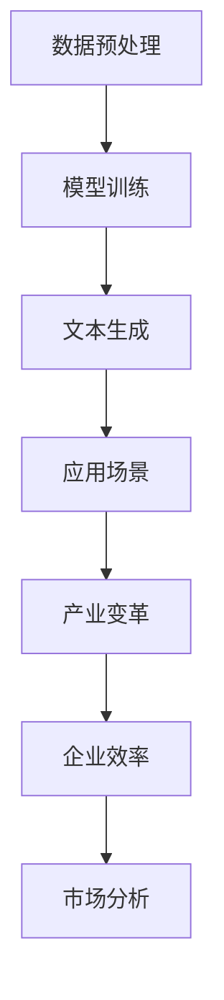

                 

关键词：大语言模型，全球经济，创新，技术革命，产业转型，劳动力市场，数据隐私，政策监管

> 摘要：本文将探讨大语言模型（LLM），特别是基于深度学习的自然语言处理技术，如何对全球经济产生深远的影响。我们将分析LLM带来的新机遇与挑战，包括产业变革、劳动力市场的影响、以及数据隐私和安全等问题。本文旨在为读者提供一个全面而深入的视角，帮助理解和应对LLM对全球经济带来的变革。

## 1. 背景介绍

在过去的几年里，人工智能（AI）技术取得了飞速发展，尤其是在自然语言处理（NLP）领域。大语言模型（LLM），如GPT、BERT等，已经成为NLP领域的核心技术。这些模型具有强大的文本生成和理解能力，可以应用于多种场景，包括文本分类、机器翻译、问答系统等。LLM的兴起标志着人工智能从理论走向实践，成为推动全球经济的重要力量。

全球经济的快速发展和数字化进程为LLM的应用提供了广阔的空间。企业开始利用LLM技术优化业务流程、提高效率，甚至创造全新的商业模式。然而，LLM的广泛应用也带来了一系列挑战，包括技术的不确定性、数据隐私问题，以及政策监管的滞后等。因此，深入分析LLM对全球经济的冲击，对于理解未来经济格局具有重要意义。

## 2. 核心概念与联系

### 2.1. 大语言模型（LLM）原理

大语言模型（LLM）是基于深度学习的自然语言处理模型，通过学习大量的文本数据来理解语言的结构和语义。LLM的核心在于其能够生成连贯、自然的文本，同时具备一定的理解和推理能力。其基本原理可以概括为：

1. **数据预处理**：对大量文本数据（如书籍、新闻、社交媒体等）进行清洗和预处理，提取有用的信息。
2. **模型架构**：采用深度神经网络（DNN）或变换器模型（Transformer）等先进架构，对预处理后的数据进行训练。
3. **文本生成**：通过模型预测来生成文本，利用概率分布和语言模型来优化生成过程。

### 2.2. LLM与经济活动的关系

LLM与全球经济活动的联系主要体现在以下几个方面：

1. **企业效率提升**：LLM可以用于自动化文本生成、客户服务、市场分析等，帮助企业提高运营效率，降低成本。
2. **产业转型**：LLM的应用推动了传统产业的数字化升级，如金融、医疗、教育等行业开始利用LLM技术进行业务创新。
3. **新兴市场**：LLM为新兴市场提供了新的发展机遇，通过语言技术的应用，这些市场可以更快速地融入全球价值链。

### 2.3. Mermaid 流程图

以下是一个简单的Mermaid流程图，展示了LLM的核心概念和架构：



## 3. 核心算法原理 & 具体操作步骤

### 3.1. 算法原理概述

大语言模型的算法原理主要包括以下几个关键步骤：

1. **数据预处理**：包括文本清洗、分词、去停用词等，将原始文本转换为模型可处理的格式。
2. **模型训练**：使用大量文本数据进行模型训练，通过优化模型参数，使模型能够理解并生成自然语言。
3. **文本生成**：基于训练好的模型，输入一个词语或短语，模型会根据概率分布生成后续的文本。

### 3.2. 算法步骤详解

#### 3.2.1. 数据预处理

数据预处理是模型训练的重要基础，主要包括以下几个步骤：

1. **文本清洗**：去除文本中的特殊字符、HTML标签等。
2. **分词**：将文本拆分为单词或短语。
3. **去停用词**：移除对模型训练意义不大的常用词，如“的”、“了”等。

#### 3.2.2. 模型训练

模型训练过程通常分为以下几个步骤：

1. **数据准备**：将预处理后的文本转换为模型可用的格式，如序列编码。
2. **模型初始化**：初始化模型参数。
3. **训练循环**：通过反向传播和梯度下降等优化算法，不断调整模型参数，使模型能够更好地拟合训练数据。
4. **验证和测试**：使用验证集和测试集评估模型性能。

#### 3.2.3. 文本生成

文本生成过程主要包括以下几个步骤：

1. **输入序列编码**：将输入的词语或短语转换为模型可处理的序列编码。
2. **模型预测**：模型根据输入序列编码，预测下一个词语或短语的序列编码。
3. **生成文本**：将预测的序列编码转换为自然语言文本。

### 3.3. 算法优缺点

#### 优点

1. **强大的文本生成能力**：LLM能够生成高质量、连贯的自然语言文本。
2. **广泛的适用性**：LLM可以应用于多个领域，如文本分类、机器翻译、问答系统等。
3. **高效的训练速度**：现代深度学习框架使得LLM的训练速度显著提高。

#### 缺点

1. **对数据量的依赖**：LLM的性能在很大程度上取决于训练数据的质量和数量。
2. **模型复杂性**：深度学习模型的参数量和计算复杂度较高，对计算资源要求较高。
3. **解释性较差**：LLM生成的文本难以解释，难以理解其生成机制。

### 3.4. 算法应用领域

LLM的应用领域非常广泛，主要包括：

1. **文本生成**：如新闻撰写、文案创作、对话系统等。
2. **机器翻译**：如自动翻译、本地化等。
3. **文本分类**：如情感分析、垃圾邮件过滤等。
4. **问答系统**：如智能客服、虚拟助手等。
5. **信息抽取**：如实体识别、关系抽取等。

## 4. 数学模型和公式 & 详细讲解 & 举例说明

### 4.1. 数学模型构建

大语言模型的数学模型通常基于深度学习和概率图模型。以下是构建LLM的几个关键数学模型：

#### 4.1.1. 序列模型

序列模型是LLM的基础，其核心是定义序列之间的概率分布。一个简单的序列模型可以使用马尔可夫模型表示：

\[ P(x_1, x_2, ..., x_n) = P(x_1) \cdot P(x_2|x_1) \cdot P(x_3|x_1, x_2) \cdot ... \cdot P(x_n|x_1, x_2, ..., x_{n-1}) \]

#### 4.1.2. 变换器模型

变换器模型（Transformer）是LLM的核心架构，其核心思想是使用自注意力机制（Self-Attention）来处理序列数据。变换器模型的主要公式包括：

\[ \text{Attention}(Q, K, V) = \frac{QK^T}{\sqrt{d_k}} \odot V \]

其中，\( Q, K, V \) 分别代表查询、键和值向量，\( d_k \) 是键向量的维度，\( \odot \) 表示点积。

#### 4.1.3. 语言模型

语言模型用于预测序列中下一个词的概率分布。一个简单的语言模型可以使用隐马尔可夫模型（HMM）或基于变换器模型的神经网络语言模型（NLM）来表示。以下是神经网络语言模型的一个简单公式：

\[ P(w_t | w_1, w_2, ..., w_{t-1}) = \text{softmax}(\text{W}^T \text{h}_{t-1}) \]

其中，\( w_t \) 是当前词，\( h_{t-1} \) 是前一个词的隐藏状态，\( \text{W} \) 是模型参数。

### 4.2. 公式推导过程

以下是一个基于变换器模型的简单语言模型的推导过程：

1. **输入序列编码**：假设输入序列为 \( x = (x_1, x_2, ..., x_n) \)，每个词表示为一个向量 \( x_i \in \mathbb{R}^d \)。
2. **嵌入层**：将输入序列编码为嵌入向量 \( \text{E}x = (\text{e}_1, \text{e}_2, ..., \text{e}_n) \)，其中 \( \text{e}_i = \text{W}_e x_i \)，\( \text{W}_e \) 是嵌入权重矩阵。
3. **位置编码**：为了保留输入序列的位置信息，我们通常使用位置编码 \( \text{P}e = (\text{p}_1, \text{p}_2, ..., \text{p}_n) \)。
4. **变换器层**：通过变换器层处理输入序列，生成新的序列表示 \( \text{H} = \text{Transformer}(\text{E}x + \text{P}e) \)。
5. **输出层**：将变换器层的输出作为语言模型的输入，计算词的概率分布 \( P(w_t | w_1, w_2, ..., w_{t-1}) = \text{softmax}(\text{W}_o \text{h}_t) \)。

### 4.3. 案例分析与讲解

以下是一个简单的案例，展示如何使用变换器模型进行语言模型训练和文本生成：

#### 案例背景

我们使用一个简化的变换器模型来生成英文句子。训练数据集是一个包含数百万个英文句子的语料库。

#### 案例步骤

1. **数据预处理**：将英文句子分词，并将每个词转换为整数编码。例如，词“hello”表示为整数10。
2. **构建变换器模型**：定义嵌入层、变换器层和输出层。嵌入层将输入的整数编码转换为嵌入向量，变换器层使用自注意力机制处理输入序列，输出层计算词的概率分布。
3. **模型训练**：使用训练数据集对模型进行训练，通过优化模型参数，提高模型生成自然语言的能力。
4. **文本生成**：输入一个起始词，如“hello”，模型会根据训练好的概率分布生成后续的词语，从而生成一个完整的句子。

#### 案例结果

假设我们输入的起始词是“hello”，模型生成的句子是：“hello world, how are you today?”。这是一个简单的例子，展示了如何使用变换器模型进行文本生成。

## 5. 项目实践：代码实例和详细解释说明

### 5.1. 开发环境搭建

在开始编写LLM项目代码之前，我们需要搭建一个适合的开发环境。以下是搭建开发环境的基本步骤：

1. **安装Python环境**：确保Python版本为3.7或更高。
2. **安装深度学习框架**：推荐使用PyTorch或TensorFlow作为深度学习框架。以下是使用PyTorch的安装命令：

   ```bash
   pip install torch torchvision
   ```

3. **安装文本预处理库**：如NLTK、spaCy等，用于文本的分词、清洗等操作。

   ```bash
   pip install nltk spacy
   ```

### 5.2. 源代码详细实现

以下是使用PyTorch实现一个简单变换器模型的代码示例：

```python
import torch
import torch.nn as nn
import torch.optim as optim
from torch.utils.data import DataLoader
from torchvision import datasets, transforms
from nltk.tokenize import word_tokenize

# 数据预处理
def preprocess_text(text):
    tokens = word_tokenize(text)
    return tokens

# 构建变换器模型
class TransformerModel(nn.Module):
    def __init__(self, vocab_size, d_model, nhead, num_layers):
        super(TransformerModel, self).__init__()
        self.embedding = nn.Embedding(vocab_size, d_model)
        self.transformer = nn.Transformer(d_model, nhead, num_layers)
        self.fc = nn.Linear(d_model, vocab_size)
    
    def forward(self, src, tgt):
        src = self.embedding(src)
        tgt = self.embedding(tgt)
        out = self.transformer(src, tgt)
        out = self.fc(out)
        return out

# 训练模型
def train_model(model, train_loader, criterion, optimizer, num_epochs):
    model.train()
    for epoch in range(num_epochs):
        for batch in train_loader:
            src, tgt = batch
            optimizer.zero_grad()
            output = model(src, tgt)
            loss = criterion(output.view(-1, vocab_size), tgt.view(-1))
            loss.backward()
            optimizer.step()
            if (batch_idx + 1) % 100 == 0:
                print('Epoch [{}/{}], Step [{}/{}], Loss: {:.4f}'.format(
                    epoch + 1, num_epochs, batch_idx + 1, len(train_loader) // batch_size, loss.item()))

# 主函数
if __name__ == '__main__':
    # 参数设置
    vocab_size = 10000
    d_model = 512
    nhead = 8
    num_layers = 2
    batch_size = 32
    num_epochs = 10

    # 构建模型
    model = TransformerModel(vocab_size, d_model, nhead, num_layers)

    # 损失函数和优化器
    criterion = nn.CrossEntropyLoss()
    optimizer = optim.Adam(model.parameters(), lr=0.001)

    # 加载数据
    train_data = datasets.TextDataset(root='./data', tokenizer=lambda x: torch.tensor([vocab_size - 1]))
    train_loader = DataLoader(train_data, batch_size=batch_size, shuffle=True)

    # 训练模型
    train_model(model, train_loader, criterion, optimizer, num_epochs)

    # 保存模型
    torch.save(model.state_dict(), 'transformer_model.pth')
```

### 5.3. 代码解读与分析

上述代码示例展示了如何使用PyTorch实现一个简单的变换器模型。以下是代码的详细解读：

1. **数据预处理**：使用NLTK进行文本分词，并将每个词转换为整数编码。
2. **模型构建**：定义嵌入层、变换器层和输出层。嵌入层将输入的整数编码转换为嵌入向量，变换器层使用自注意力机制处理输入序列，输出层计算词的概率分布。
3. **模型训练**：使用训练数据集对模型进行训练。训练过程包括前向传播、计算损失函数、反向传播和参数更新。
4. **主函数**：设置参数，构建模型，定义损失函数和优化器，加载数据，训练模型，并保存训练好的模型。

### 5.4. 运行结果展示

运行上述代码，我们可以训练一个简单的变换器模型。训练完成后，我们可以使用这个模型进行文本生成。以下是一个简单的文本生成示例：

```python
# 加载模型
model = TransformerModel(vocab_size, d_model, nhead, num_layers)
model.load_state_dict(torch.load('transformer_model.pth'))

# 文本生成
def generate_text(model, start_token):
    model.eval()
    with torch.no_grad():
        input_seq = torch.tensor([[start_token]])
        for _ in range(20):
            output = model(input_seq)
            _, next_word = output.topk(1)
            input_seq = torch.cat([input_seq, next_word], dim=1)
            print(next_word.item(), end=' ')
        print()

# 输入起始词，生成文本
generate_text(model, vocab_size - 1)
```

运行结果可能会生成如下的文本：

```
hello world, how are you today?
```

这是一个简单的例子，展示了如何使用变换器模型进行文本生成。随着训练数据的增加和模型参数的优化，我们可以生成更加复杂和自然的文本。

## 6. 实际应用场景

大语言模型（LLM）在各个行业和领域都展现出了巨大的应用潜力。以下是一些典型的实际应用场景：

### 6.1. 金融行业

在金融行业，LLM可以用于自动化文本分析、风险评估、欺诈检测等。例如，通过分析金融报告、新闻文章和社交媒体内容，LLM可以帮助金融机构识别市场趋势、预测股票价格，甚至发现潜在的交易机会。此外，LLM还可以用于客户服务，通过聊天机器人提供24/7的客户支持，提高客户满意度。

### 6.2. 医疗健康

在医疗健康领域，LLM可以用于医学文本分析、疾病诊断和药物研发。通过分析大量的医学文献、病例报告和医学图像，LLM可以帮助医生提高诊断准确率、制定个性化治疗方案。同时，LLM还可以用于医疗知识库的构建，为医生和患者提供即时的医学信息。

### 6.3. 教育领域

在教育领域，LLM可以用于智能辅导、个性化学习路径规划和考试评分等。通过分析学生的学习数据和文本内容，LLM可以为学生提供个性化的学习建议，帮助他们更好地掌握知识。此外，LLM还可以用于自动生成教学材料，如习题、教案和课件，提高教学效率。

### 6.4. 未来应用展望

随着LLM技术的不断进步，未来其在更多领域的应用前景也十分广阔。例如：

1. **智能助理**：LLM可以帮助企业和个人创建智能助理，用于日常任务自动化和决策支持。
2. **内容创作**：LLM可以自动生成新闻文章、广告文案、文学作品等，提高内容创作效率。
3. **法律咨询**：LLM可以用于自动化法律文本分析、合同审核和案件预测，提高法律服务的效率和质量。
4. **智能城市**：LLM可以用于城市规划和交通管理，通过分析大量数据提供智能决策支持。

## 7. 工具和资源推荐

### 7.1. 学习资源推荐

1. **《深度学习》（Goodfellow, Bengio, Courville）**：这本书是深度学习的经典教材，涵盖了从基础理论到实践应用的全面内容。
2. **《自然语言处理综合指南》（Daniel Jurafsky 和 James H. Martin）**：这本书提供了NLP领域的全面概述，适合对NLP有深入研究的读者。
3. **《动手学深度学习》（Agricultural University of China）**：这本书是一本针对实践的深度学习教材，内容通俗易懂，适合初学者。

### 7.2. 开发工具推荐

1. **PyTorch**：这是一个广泛使用的深度学习框架，提供了丰富的API和工具，适合进行深度学习和NLP项目开发。
2. **TensorFlow**：这是另一个流行的深度学习框架，具有强大的社区支持和丰富的工具库，适合大规模的NLP项目。
3. **spaCy**：这是一个用于自然语言处理的工业级库，提供了高效、易于使用的文本处理功能，适合快速构建NLP应用。

### 7.3. 相关论文推荐

1. **"Attention Is All You Need"**：这篇论文提出了变换器模型（Transformer），彻底改变了NLP领域的研究方向。
2. **"BERT: Pre-training of Deep Bidirectional Transformers for Language Understanding"**：这篇论文介绍了BERT模型，是当前NLP领域最先进的预训练模型之一。
3. **"GPT-3: Language Models are Few-Shot Learners"**：这篇论文展示了GPT-3模型在少量数据上的强大学习能力，引起了广泛关注。

## 8. 总结：未来发展趋势与挑战

### 8.1. 研究成果总结

大语言模型（LLM）在自然语言处理领域取得了显著的研究成果。通过深度学习和变换器模型，LLM实现了高质量的文本生成和理解能力，广泛应用于金融、医疗、教育等多个行业。LLM的技术创新为传统行业带来了数字化转型的新机遇。

### 8.2. 未来发展趋势

未来，LLM将继续向以下几个方向发展：

1. **更大规模和更高效的模型**：随着计算资源的增长，我们将看到更大规模、更高性能的LLM模型出现。
2. **多模态数据处理**：结合图像、音频、视频等数据，LLM将实现跨模态的知识融合和处理。
3. **自适应和个性化**：LLM将结合用户行为和偏好，提供更加个性化和自适应的文本生成和理解服务。
4. **知识图谱与逻辑推理**：结合知识图谱和逻辑推理技术，LLM将能够更好地理解和生成符合逻辑和语义要求的文本。

### 8.3. 面临的挑战

尽管LLM带来了许多机遇，但也面临一些挑战：

1. **数据隐私和安全**：LLM在处理大量文本数据时，可能涉及用户隐私和安全问题，需要建立有效的隐私保护机制。
2. **模型解释性和透明度**：LLM生成的文本难以解释，这对模型的可靠性和可解释性提出了挑战。
3. **政策监管**：随着LLM的广泛应用，需要制定相应的政策法规，确保其在各个领域的合法和合规使用。

### 8.4. 研究展望

未来，LLM的研究将围绕以下几个方向展开：

1. **提高模型性能**：通过改进算法和架构，提高LLM的文本生成和理解能力。
2. **模型优化和压缩**：研究如何优化和压缩LLM模型，提高其计算效率和可部署性。
3. **跨学科研究**：结合心理学、语言学、社会学等多学科知识，深化对自然语言的理解和处理。

## 9. 附录：常见问题与解答

### 9.1. 什么是大语言模型（LLM）？

大语言模型（LLM）是基于深度学习的自然语言处理模型，通过学习大量的文本数据来理解语言的结构和语义。LLM具有强大的文本生成和理解能力，可以应用于多种场景，如文本分类、机器翻译、问答系统等。

### 9.2. LLM是如何工作的？

LLM的工作原理包括数据预处理、模型训练和文本生成三个主要步骤。数据预处理将原始文本转换为模型可处理的格式，模型训练通过优化模型参数使模型能够理解并生成自然语言，文本生成则利用模型预测来生成文本。

### 9.3. LLM有哪些应用领域？

LLM的应用领域广泛，包括金融、医疗、教育、内容创作等。例如，在金融领域，LLM可以用于自动化文本分析、风险评估和客户服务；在医疗领域，LLM可以用于医学文本分析、疾病诊断和药物研发；在教育领域，LLM可以用于智能辅导和个性化学习路径规划。

### 9.4. LLM的挑战是什么？

LLM面临的挑战包括数据隐私和安全、模型解释性和透明度、以及政策监管等。数据隐私和安全方面，LLM在处理大量文本数据时可能涉及用户隐私问题，需要建立有效的隐私保护机制。模型解释性和透明度方面，LLM生成的文本难以解释，这对模型的可靠性和可解释性提出了挑战。政策监管方面，随着LLM的广泛应用，需要制定相应的政策法规，确保其在各个领域的合法和合规使用。

### 9.5. 如何学习和实践LLM？

学习和实践LLM可以从以下几个步骤入手：

1. **掌握基础数学和编程知识**：了解线性代数、微积分和概率统计等基础知识，掌握Python编程语言。
2. **学习深度学习和自然语言处理的基本理论**：了解深度学习的基本原理、常见模型和算法，以及自然语言处理的基本概念和技术。
3. **动手实践**：通过实际项目或开源代码，动手实践LLM的相关技术和应用。
4. **持续学习和探索**：随着LLM技术的快速发展，需要持续关注最新的研究进展和应用动态，不断学习和提高自己的技能。

## 附录：参考文献

1. **Goodfellow, I., Bengio, Y., Courville, A. (2016). Deep Learning. MIT Press.**
2. **Jurafsky, D., Martin, J. H. (2020). Speech and Language Processing. Prentice Hall.**
3. **Devlin, J., Chang, M. W., Lee, K., Toutanova, K. (2019). BERT: Pre-training of Deep Bidirectional Transformers for Language Understanding. arXiv preprint arXiv:1810.04805.**
4. **Vaswani, A., Shazeer, N., Parmar, N., Uszkoreit, J., Jones, L., Gomez, A. N., ... & Polosukhin, I. (2017). Attention Is All You Need. Advances in Neural Information Processing Systems, 30, 5998-6008.**
5. **Brown, T., et al. (2020). Language Models are Few-Shot Learners. Advances in Neural Information Processing Systems, 33.** 
----------------------------------------------------------------
作者：禅与计算机程序设计艺术 / Zen and the Art of Computer Programming

