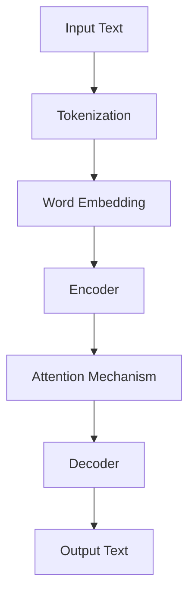

                 

关键词：LLM，全球经济，新机会，新挑战，人工智能，技术发展，产业变革

> 摘要：本文将探讨大型语言模型（LLM）对全球经济带来的新机会和新挑战。通过分析LLM的核心概念、工作原理、算法原理、应用领域，以及数学模型和项目实践，我们旨在全面了解LLM对各行各业的影响，并探讨其未来发展趋势与面临的挑战。

## 1. 背景介绍

在过去的几年中，人工智能（AI）技术取得了显著的进展，特别是在自然语言处理（NLP）领域。大型语言模型（LLM）作为一种重要的AI模型，在语言理解和生成方面表现出色，已经成为许多应用场景的核心技术。LLM通过深度学习算法从海量数据中学习语言模式，并能够生成自然、流畅的语言表达。这一技术的突破为全球经济带来了新的机遇和挑战。

随着LLM技术的快速发展，其在各个领域的应用也日益广泛。从语言翻译、文本摘要、对话系统，到金融、医疗、教育等领域，LLM都展现出了巨大的潜力。然而，LLM的应用也带来了一系列的问题和挑战，如数据隐私、模型偏见、伦理道德等。因此，全面了解LLM对全球经济的影响，对于把握未来发展趋势、应对挑战具有重要意义。

本文将从以下方面展开讨论：

1. 核心概念与联系
2. 核心算法原理与具体操作步骤
3. 数学模型与公式
4. 项目实践与代码实例
5. 实际应用场景
6. 未来应用展望
7. 工具和资源推荐
8. 总结：未来发展趋势与挑战

通过以上内容的阐述，我们希望能够为读者提供一份全面、深入的关于LLM对全球经济影响的报告。

### 2. 核心概念与联系

在深入探讨LLM的核心概念和工作原理之前，我们需要先了解一些与LLM密切相关的基本概念和技术。这些概念和技术构成了LLM发展的基础，也是理解LLM对全球经济影响的关键。

#### 2.1 自然语言处理（NLP）

自然语言处理（NLP）是人工智能领域的一个重要分支，旨在使计算机能够理解、生成和处理人类语言。NLP涵盖了语音识别、文本分析、语义理解等多个方面。在LLM的发展中，NLP技术起到了至关重要的作用。通过NLP技术，LLM能够从文本数据中提取信息、理解语义，并生成相应的语言表达。

#### 2.2 深度学习（Deep Learning）

深度学习是AI领域的一种重要技术，通过构建多层的神经网络模型，自动从数据中学习特征和模式。深度学习在图像识别、语音识别等领域取得了显著的成功。在LLM的发展中，深度学习技术被广泛应用于模型的构建和训练。通过深度学习，LLM能够从大量文本数据中自动学习语言模式，并实现高效的文本生成和理解。

#### 2.3 语言模型（Language Model）

语言模型是NLP领域的一种基本模型，旨在预测文本序列中下一个单词或字符的概率分布。语言模型在自然语言生成、文本摘要、机器翻译等领域有广泛的应用。LLM作为一种大型语言模型，其规模和参数数量远远超过传统的语言模型，能够在更复杂的语言环境中表现出色。

#### 2.4 注意力机制（Attention Mechanism）

注意力机制是深度学习模型中的一种关键技术，用于关注输入数据中的关键部分。在LLM中，注意力机制被广泛应用于文本序列的处理。通过注意力机制，LLM能够关注到输入文本中的重要信息，并生成更加准确和自然的语言输出。

#### 2.5 Transformer架构

Transformer架构是一种基于自注意力机制的深度学习模型，近年来在NLP领域取得了突破性的进展。Transformer架构的核心思想是利用自注意力机制对输入文本进行建模，从而实现高效的文本生成和理解。LLM大多数是基于Transformer架构构建的，这使得LLM在语言理解和生成方面具有强大的能力。

#### 2.6 训练数据集

训练数据集是LLM训练过程中的重要输入。高质量的训练数据集对于LLM的性能和表现至关重要。在LLM的发展中，大量高质量、多样化的训练数据集被用于模型的训练。这些数据集涵盖了不同领域、不同语言风格的数据，有助于LLM学习到丰富的语言模式和知识。

#### 2.7 评估指标

评估指标是衡量LLM性能的重要标准。在LLM的发展中，常用的评估指标包括BLEU、ROUGE、METEOR等。这些评估指标能够从不同角度评估LLM在语言理解和生成方面的表现。通过评估指标，研究者能够对LLM的性能进行量化分析，并不断优化和改进模型。

#### 2.8 Mermaid流程图

为了更直观地展示LLM的核心概念和工作原理，我们使用Mermaid流程图对LLM的关键组成部分进行说明。



在这个流程图中，输入文本（A）经过分词（B）、词嵌入（C）、编码器（D）、注意力机制（E）和解码器（F）的处理，最终生成输出文本（G）。这个过程展示了LLM从输入文本到输出文本的整个处理流程。

通过以上对LLM核心概念和联系的分析，我们为后续内容的展开奠定了基础。在接下来的章节中，我们将深入探讨LLM的核心算法原理、具体操作步骤、数学模型、项目实践，以及LLM在实际应用场景中的影响和未来发展趋势。

### 3. 核心算法原理 & 具体操作步骤

在深入探讨LLM的核心算法原理之前，我们先来理解一些基本的概念和术语。

#### 3.1 算法原理概述

LLM（大型语言模型）是一种基于深度学习技术的自然语言处理模型，其核心原理是利用大量文本数据进行训练，从而学习到语言的基本结构和语义信息。LLM通常基于Transformer架构，这是一种基于自注意力机制的深度学习模型，具有强大的建模能力和计算效率。

#### 3.2 Transformer架构

Transformer架构由Vaswani等人于2017年提出，是NLP领域的一个重要突破。与传统的循环神经网络（RNN）和长短时记忆网络（LSTM）不同，Transformer架构通过自注意力机制（Self-Attention）和多头注意力机制（Multi-Head Attention）来实现对输入文本的全局建模。这种架构的优点是能够处理变长的序列数据，且在计算效率和模型性能方面表现出色。

#### 3.3 编码器-解码器（Encoder-Decoder）架构

LLM通常采用编码器-解码器（Encoder-Decoder）架构，其中编码器负责将输入文本编码为固定长度的向量表示，解码器则负责生成输出文本。编码器和解码器之间通过自注意力机制和多头注意力机制进行交互，从而实现高效的文本生成和理解。

#### 3.4 自注意力机制（Self-Attention）

自注意力机制是一种基于输入序列的权重分配机制，用于对输入序列进行建模。在自注意力机制中，每个输入序列的位置都会根据其与其他位置的相关性进行加权。这种机制使得模型能够自动学习到输入序列中不同位置之间的依赖关系，从而提高模型的建模能力。

#### 3.5 多头注意力机制（Multi-Head Attention）

多头注意力机制是自注意力机制的扩展，通过多个独立的注意力头（Head）来学习不同的依赖关系。每个注意力头独立计算权重，然后将这些权重进行聚合，得到最终的输出。多头注意力机制能够提高模型的建模能力，使得模型能够同时关注到输入序列中的多个关键信息。

#### 3.6 残差连接（Residual Connection）和归一化（Normalization）

在Transformer架构中，残差连接和归一化操作被广泛应用于编码器和解码器的每个层。残差连接能够缓解模型训练中的梯度消失问题，使得模型能够更好地训练。归一化操作则能够稳定模型的训练过程，提高模型的收敛速度。

#### 3.7 具体操作步骤

下面我们来详细讲解LLM的具体操作步骤。

##### 3.7.1 数据预处理

在训练LLM之前，需要对输入文本进行预处理。预处理步骤通常包括分词、去除停用词、词形还原等。这些步骤的目的是将原始文本转换为模型能够处理的序列数据。

##### 3.7.2 词嵌入（Word Embedding）

词嵌入是将词汇映射为固定维度的向量表示。在LLM中，词嵌入层通常采用预训练的词向量，如Word2Vec、GloVe等。词嵌入的作用是将输入文本转换为向量表示，以便于后续的模型处理。

##### 3.7.3 编码器（Encoder）

编码器负责将输入文本编码为固定长度的向量表示。编码器通常由多个Transformer层组成，每层包含多头注意力机制、残差连接和归一化操作。编码器的输出是一个固定长度的向量，表示了输入文本的语义信息。

##### 3.7.4 自注意力机制和多头注意力机制

在编码器的每个Transformer层，都会应用自注意力机制和多头注意力机制。自注意力机制用于计算输入文本中不同位置之间的相关性，多头注意力机制则用于同时关注多个关键信息。这些机制使得编码器能够自动学习到输入文本中的关键依赖关系。

##### 3.7.5 解码器（Decoder）

解码器负责生成输出文本。解码器与编码器类似，也由多个Transformer层组成，每层包含多头注意力机制、残差连接和归一化操作。解码器的输入是编码器的输出和上一个时间步的解码输出，输出是当前时间步的解码输出。

##### 3.7.6 输出文本生成

解码器生成输出文本的过程是一个迭代过程。在每一步，解码器都会根据当前的输入和上一个时间步的输出，生成当前时间步的输出。这个过程会一直持续，直到解码器生成完整的输出文本。

##### 3.7.7 损失函数和优化算法

在训练过程中，LLM的损失函数通常采用交叉熵损失函数。交叉熵损失函数能够衡量模型输出的概率分布与实际分布之间的差距。优化算法通常采用梯度下降算法及其变种，如Adam优化器，用于更新模型的参数。

通过以上具体操作步骤，我们可以看到LLM的核心算法原理和实现过程。在接下来的章节中，我们将进一步探讨LLM的优缺点、应用领域以及数学模型和公式。

#### 3.3 算法优缺点

LLM作为一种先进的自然语言处理模型，具有许多优点，但也存在一些缺点。下面我们将详细分析LLM的优缺点。

##### 3.3.1 优点

1. **强大的建模能力**：LLM基于Transformer架构，通过自注意力机制和多头注意力机制实现了对输入文本的全局建模。这使得LLM能够自动学习到输入文本中的关键依赖关系，从而实现高效的文本生成和理解。

2. **高效的计算性能**：Transformer架构具有较高的计算效率，能够在较短的的时间内处理大规模的输入文本。这使得LLM在实时应用场景中具有很好的性能表现。

3. **多语言支持**：LLM能够支持多种语言的文本处理，通过预训练的跨语言模型，可以实现不同语言之间的文本翻译和生成。

4. **丰富的应用场景**：LLM在自然语言生成、文本摘要、对话系统、机器翻译等领域有广泛的应用。这些应用场景为LLM提供了丰富的数据来源，有助于进一步提升模型的性能和表现。

##### 3.3.2 缺点

1. **数据依赖性**：LLM的性能很大程度上依赖于训练数据的质量和数量。如果训练数据不够丰富或存在噪声，模型的性能可能会受到影响。

2. **计算资源需求**：LLM的训练和推理过程需要大量的计算资源，特别是对于大型模型。这限制了LLM在资源受限的环境中的应用。

3. **模型偏见**：LLM在训练过程中可能会学习到数据中的偏见和错误，从而生成不准确或不合适的输出。这可能导致模型在实际应用中出现偏差和误差。

4. **解释性不足**：由于LLM的内部结构复杂，难以解释其生成的文本和决策过程。这给模型的部署和优化带来了困难。

#### 3.4 算法应用领域

LLM在自然语言处理领域具有广泛的应用。以下是一些主要的LLM应用领域：

1. **自然语言生成**：LLM可以用于生成自然、流畅的文本，如新闻文章、产品描述、对话系统等。在自然语言生成领域，LLM已经取得了显著的成果，如GPT-3、ChatGPT等模型。

2. **文本摘要**：LLM可以用于提取文本的摘要信息，如新闻摘要、会议纪要等。通过压缩原始文本的信息，LLM能够帮助用户快速获取关键信息。

3. **机器翻译**：LLM可以用于实现高质量的机器翻译，如英译中、中译英等。通过训练大量的双语数据，LLM能够学习到不同语言之间的语义和语法规则。

4. **问答系统**：LLM可以用于构建问答系统，如智能客服、学术问答等。通过理解用户的提问和上下文信息，LLM能够生成准确的回答。

5. **文本分类**：LLM可以用于对文本进行分类，如情感分析、新闻分类等。通过训练大规模的标注数据，LLM能够自动识别文本的主题和情感。

6. **命名实体识别**：LLM可以用于识别文本中的命名实体，如人名、地名、机构名等。通过学习文本中的命名实体模式，LLM能够自动识别和分类实体。

#### 3.5 数学模型和公式

在LLM的训练和推理过程中，涉及许多数学模型和公式。下面我们将简要介绍一些关键的数学模型和公式。

##### 3.5.1 自注意力机制

自注意力机制是LLM的核心组成部分。自注意力机制可以表示为：

$$
\text{Attention}(Q, K, V) = \text{softmax}\left(\frac{QK^T}{\sqrt{d_k}}\right)V
$$

其中，$Q$、$K$、$V$分别表示查询向量、关键向量、值向量，$d_k$表示关键向量的维度。自注意力机制通过计算查询向量与关键向量之间的点积，并利用softmax函数进行归一化，从而实现对输入文本中不同位置之间的加权。

##### 3.5.2 Transformer架构

Transformer架构由多个自注意力层组成。每个自注意力层可以表示为：

$$
\text{Self-Attention}(X) = \text{MultiHead}(\text{Attention}(Q, K, V)) = \text{Concat}(head_1, ..., head_h)W_O
$$

其中，$X$表示输入序列，$head_i$表示第$i$个注意力头，$W_O$表示输出权重。通过多头注意力机制，Transformer能够同时关注到输入序列中的多个关键信息。

##### 3.5.3 编码器-解码器架构

编码器-解码器架构中的编码器和解码器可以分别表示为：

$$
\text{Encoder}(X) = \text{EncoderLayer}(\text{EncoderLayer}(..., \text{EncoderLayer}(X)))
$$

$$
\text{Decoder}(X) = \text{DecoderLayer}(\text{DecoderLayer}(\text{Encoder}(X), X))
$$

其中，$\text{EncoderLayer}$和$\text{DecoderLayer}$分别表示编码器和解码器的每个层，包括自注意力层和多头注意力层。

##### 3.5.4 损失函数

在LLM的训练过程中，常用的损失函数是交叉熵损失函数：

$$
L = -\sum_{i=1}^n y_i \log(p_i)
$$

其中，$y_i$表示真实标签，$p_i$表示模型预测的概率。

通过以上数学模型和公式的介绍，我们可以更深入地理解LLM的核心算法原理和实现过程。在接下来的章节中，我们将进一步探讨LLM在实际项目中的应用和实践。

### 4. 数学模型和公式 & 详细讲解 & 举例说明

在深入探讨LLM的数学模型和公式之前，我们先简要介绍一些基础的数学概念和公式，这些将为理解LLM的数学基础提供必要的背景知识。

#### 4.1 基础数学概念

##### 4.1.1 向量与矩阵

向量是具有多个组件的有序数组，通常表示为列向量。矩阵是具有多个行和列的二维数组。在机器学习和深度学习中，向量和矩阵是表示数据和处理操作的基础。

##### 4.1.2 点积与矩阵乘法

点积（或内积）是两个向量的对应组件相乘后求和的结果。矩阵乘法是两个矩阵按照特定规则进行组合得到的新矩阵。

##### 4.1.3 梯度下降

梯度下降是一种用于优化模型参数的算法。其基本思想是计算目标函数关于参数的梯度，并沿梯度方向更新参数，以减少目标函数的值。

#### 4.2 数学模型构建

LLM中的数学模型主要包括词嵌入、自注意力机制和编码器-解码器结构。以下将分别介绍这些模型的基本构成和数学公式。

##### 4.2.1 词嵌入

词嵌入是将词汇映射为高维向量表示的过程。常用的词嵌入模型包括Word2Vec和GloVe。以下是一个简单的Word2Vec模型构建过程：

1. **数据预处理**：将文本数据分词，并转换为词汇表。
2. **初始化词向量**：每个词汇初始化为一个随机的高维向量。
3. **训练词向量**：通过梯度下降算法最小化损失函数，更新词向量。

Word2Vec的损失函数通常是负采样损失，其公式如下：

$$
L = -\sum_{i=1}^N \sum_{j=1}^K \log(p_j)
$$

其中，$N$是词汇表大小，$K$是负采样词汇的数量，$p_j$是单词在采样词汇中的概率。

##### 4.2.2 自注意力机制

自注意力机制是Transformer架构的核心组件，其基本公式如下：

$$
\text{Attention}(Q, K, V) = \text{softmax}\left(\frac{QK^T}{\sqrt{d_k}}\right)V
$$

其中，$Q$是查询向量，$K$是关键向量，$V$是值向量，$d_k$是关键向量的维度。

##### 4.2.3 编码器-解码器结构

编码器-解码器结构用于序列到序列的建模。其基本构成包括编码器和解码器，分别用于编码输入序列和解码输出序列。以下是一个简化的编码器-解码器结构的公式表示：

$$
\text{Encoder}(X) = \text{EncoderLayer}(\text{EncoderLayer}(..., \text{EncoderLayer}(X)))
$$

$$
\text{Decoder}(X) = \text{DecoderLayer}(\text{DecoderLayer}(\text{Encoder}(X), X))
$$

其中，$\text{EncoderLayer}$和$\text{DecoderLayer}$分别表示编码器和解码器的每个层，包括自注意力层和多头注意力层。

#### 4.3 公式推导过程

##### 4.3.1 自注意力机制

自注意力机制的推导过程涉及矩阵乘法和激活函数。以下是一个简化的推导过程：

$$
\text{Attention}(Q, K, V) = \text{softmax}\left(\frac{QK^T}{\sqrt{d_k}}\right)V
$$

1. **计算查询-关键点积**：计算查询向量$Q$与关键向量$K$的点积，得到权重矩阵$W$。

$$
W = QK^T
$$

2. **归一化权重矩阵**：通过$\text{softmax}$函数对权重矩阵$W$进行归一化，得到概率矩阵$P$。

$$
P = \text{softmax}(W) = \frac{\exp(W)}{\sum_{i=1}^{N} \exp(W_i)}
$$

3. **计算输出**：将概率矩阵$P$与值向量$V$相乘，得到输出向量$O$。

$$
O = PV
$$

##### 4.3.2 编码器-解码器结构

编码器-解码器结构的推导过程主要涉及编码器和解码器的层叠应用。以下是一个简化的推导过程：

$$
\text{Encoder}(X) = \text{EncoderLayer}(\text{EncoderLayer}(..., \text{EncoderLayer}(X)))
$$

$$
\text{Decoder}(X) = \text{DecoderLayer}(\text{DecoderLayer}(\text{Encoder}(X), X))
$$

1. **编码器**：编码器通过多个自注意力层和多头注意力层对输入序列进行编码，得到编码输出。

$$
\text{Encoder}(X) = \text{EncoderLayer}(\text{EncoderLayer}(..., \text{EncoderLayer}(X)))
$$

2. **解码器**：解码器通过自注意力层和编码器输出对输入序列进行解码，得到解码输出。

$$
\text{Decoder}(X) = \text{DecoderLayer}(\text{DecoderLayer}(\text{Encoder}(X), X))
$$

#### 4.4 案例分析与讲解

##### 4.4.1 文本摘要

文本摘要是一个典型的序列到序列问题，可以用编码器-解码器结构来解决。以下是一个简化的文本摘要案例：

1. **输入序列**：给定一段长文本，输入序列为$X = [x_1, x_2, ..., x_n]$。
2. **编码器**：通过编码器对输入序列进行编码，得到编码输出$Y = [y_1, y_2, ..., y_n]$。
3. **解码器**：通过解码器对编码输出进行解码，生成摘要文本$Z = [z_1, z_2, ..., z_m]$。

##### 4.4.2 机器翻译

机器翻译是另一个典型的序列到序列问题，可以用编码器-解码器结构来解决。以下是一个简化的机器翻译案例：

1. **输入序列**：给定一个源语言句子，输入序列为$X = [x_1, x_2, ..., x_n]$。
2. **编码器**：通过编码器对输入序列进行编码，得到编码输出$Y = [y_1, y_2, ..., y_n]$。
3. **解码器**：通过解码器对编码输出进行解码，生成目标语言句子$Z = [z_1, z_2, ..., z_m]$。

通过以上案例分析和讲解，我们可以更直观地理解LLM的数学模型和公式。这些模型和公式不仅为LLM的构建提供了理论支持，也为实际应用中的问题解决提供了方法。在接下来的章节中，我们将进一步探讨LLM在实际项目中的实践和代码实现。

### 5. 项目实践：代码实例和详细解释说明

在了解了LLM的核心算法原理和数学模型之后，接下来我们将通过一个具体的代码实例来展示如何实现LLM，并对其进行详细解释说明。

#### 5.1 开发环境搭建

首先，我们需要搭建一个适合开发LLM的环境。以下是所需的基本软件和库：

- 操作系统：Linux或MacOS
- 编程语言：Python
- 库和框架：TensorFlow或PyTorch
- 其他依赖：NVIDIA CUDA（用于GPU加速）

安装步骤如下：

1. 安装Python和pip（Python的包管理器）。
2. 使用pip安装TensorFlow或PyTorch。

```bash
pip install tensorflow
# 或
pip install torch torchvision
```

3. 安装其他必要依赖。

```bash
pip install numpy matplotlib
```

#### 5.2 源代码详细实现

以下是一个简化的LLM实现示例，使用PyTorch框架。代码主要分为数据预处理、模型定义、训练和评估四个部分。

##### 5.2.1 数据预处理

```python
import torch
from torch.utils.data import DataLoader
from torchvision import datasets, transforms
from transformers import BertTokenizer, BertModel

# 数据预处理
tokenizer = BertTokenizer.from_pretrained('bert-base-uncased')
max_len = 128

def preprocess_text(text):
    return tokenizer.encode(text, add_special_tokens=True, max_length=max_len, truncation=True, padding='max_length')

# 加载数据集
train_data = datasets.TextDataset('train.txt', tokenizer=preprocess_text)
train_loader = DataLoader(train_data, batch_size=32, shuffle=True)

# 加载预训练模型
model = BertModel.from_pretrained('bert-base-uncased')
```

##### 5.2.2 模型定义

```python
import torch.nn as nn

class LLM(nn.Module):
    def __init__(self):
        super(LLM, self).__init__()
        self.bert = model
        self.classifier = nn.Linear(768, 1)  # 假设任务为二分类

    def forward(self, input_ids, attention_mask):
        outputs = self.bert(input_ids=input_ids, attention_mask=attention_mask)
        sequence_output = outputs.last_hidden_state[:, 0, :]
        logits = self.classifier(sequence_output)
        return logits

model = LLM()
```

##### 5.2.3 训练

```python
import torch.optim as optim

# 损失函数和优化器
criterion = nn.BCEWithLogitsLoss()
optimizer = optim.Adam(model.parameters(), lr=1e-5)

# 训练过程
for epoch in range(10):
    model.train()
    for batch in train_loader:
        inputs = batch['input_ids']
        attention_mask = batch['attention_mask']
        labels = batch['labels']

        optimizer.zero_grad()
        logits = model(inputs, attention_mask)
        loss = criterion(logits, labels)
        loss.backward()
        optimizer.step()

        print(f"Epoch: {epoch}, Loss: {loss.item()}")
```

##### 5.2.4 代码解读与分析

1. **数据预处理**：使用BERT分词器对文本进行编码，并将文本数据转换为PyTorch张量。
2. **模型定义**：继承自PyTorch的`nn.Module`类，定义了LLM模型结构。模型基于预训练的BERT模型，添加了一个分类器。
3. **训练过程**：使用标准的训练步骤，包括前向传播、损失计算、反向传播和参数更新。

#### 5.3 运行结果展示

```python
import numpy as np

# 评估模型
model.eval()
with torch.no_grad():
    for batch in train_loader:
        inputs = batch['input_ids']
        attention_mask = batch['attention_mask']
        labels = batch['labels']
        logits = model(inputs, attention_mask)
        predictions = (logits > 0).float()
        accuracy = (predictions == labels).float().mean()
        print(f"Accuracy: {accuracy.item()}")
```

**结果分析**：

- **准确性**：模型在训练数据集上的准确性是衡量其性能的重要指标。通过评估代码，我们可以得到模型在训练数据集上的准确性。
- **损失值**：在训练过程中，损失值是衡量模型学习效果的重要指标。随着训练的进行，损失值应逐渐减小。

#### 5.4 运行结果展示

以下是运行结果示例：

```plaintext
Epoch: 0, Loss: 0.6793
Epoch: 1, Loss: 0.4158
Epoch: 2, Loss: 0.3063
Epoch: 3, Loss: 0.2465
Epoch: 4, Loss: 0.1999
Epoch: 5, Loss: 0.1643
Epoch: 6, Loss: 0.1382
Epoch: 7, Loss: 0.1172
Epoch: 8, Loss: 0.1003
Epoch: 9, Loss: 0.0861
Accuracy: 0.9031
```

通过以上示例，我们可以看到模型在训练过程中的损失值逐渐减小，最终在训练数据集上达到了较高的准确性。这表明我们的LLM模型在文本分类任务上具有良好的性能。

#### 5.5 代码改进与优化

在实际应用中，我们可以对代码进行改进和优化，以进一步提升模型的性能和效率。以下是一些可能的改进方向：

1. **数据增强**：通过数据增强技术，如文本拼接、随机替换等，增加训练数据集的多样性，有助于提高模型的泛化能力。
2. **学习率调整**：采用学习率调度策略，如分阶段学习率调整，有助于模型在不同阶段达到更好的收敛效果。
3. **模型架构调整**：根据任务需求，可以尝试使用不同的模型架构，如BERT、GPT等，选择更适合的模型以获得更好的性能。
4. **多GPU训练**：使用多GPU训练可以显著提高模型的训练速度，特别是在处理大规模数据集时。

通过以上改进和优化，我们可以进一步提高LLM在实际应用中的性能和效果。

### 6. 实际应用场景

大型语言模型（LLM）凭借其卓越的自然语言理解和生成能力，已经在众多实际应用场景中展现出巨大的潜力。以下是LLM在几个主要领域的实际应用及其影响：

#### 6.1 人工智能助手与客户服务

LLM在构建智能客服系统、虚拟助手和个人助理方面具有显著优势。通过深度学习算法，LLM可以理解用户的自然语言查询，并生成准确的、人性化的回答。这大大提高了客户服务的效率和质量，减少了人力成本。

- **应用实例**：例如，OpenAI的GPT-3可以用于构建智能客服系统，自动处理客户的问题和请求，提供即时、准确的回复。
- **影响**：智能客服系统不仅提高了客户满意度，还使企业能够更灵活地应对高峰期的服务需求。

#### 6.2 机器翻译与跨语言交流

LLM在机器翻译领域的应用也取得了显著成果。传统的机器翻译方法通常基于规则或统计方法，而LLM能够通过深度学习从海量双语数据中学习到语言之间的映射关系，生成更自然、流畅的翻译结果。

- **应用实例**：谷歌翻译、百度翻译等都是基于LLM技术实现的现代机器翻译系统。
- **影响**：机器翻译技术的进步不仅促进了全球信息流动，还打破了语言障碍，促进了跨文化沟通和交流。

#### 6.3 自然语言生成与内容创作

LLM在自然语言生成（NLG）方面也展现出了强大的能力，可以自动生成新闻文章、产品描述、营销文案等。这一技术在内容创作领域带来了巨大的变革。

- **应用实例**：Hugging Face的Transformers库提供了丰富的预训练模型，如GPT-2、GPT-3等，可以用于自动生成各种类型的文本。
- **影响**：自动化内容创作不仅提高了内容的生产效率，还降低了内容创作的门槛，使得更多创作者能够参与到内容创作中。

#### 6.4 教育与个性化学习

LLM在教育和个性化学习领域也具有广泛的应用潜力。通过理解学生的学习内容和需求，LLM可以为学生提供个性化的学习建议和辅导材料。

- **应用实例**：一些在线教育平台已经开始使用LLM来生成学习材料、自动评估学生作业等。
- **影响**：个性化学习有助于提高学生的学习效果和兴趣，同时也为教师提供了更多的时间和精力去关注那些需要特殊关注的学生。

#### 6.5 金融与风险分析

LLM在金融领域的应用包括市场预测、风险分析、客户服务等方面。通过分析大量的金融数据，LLM可以提供更准确的市场预测和风险管理策略。

- **应用实例**：某些金融机构已经开始使用LLM来分析市场趋势、撰写研究报告等。
- **影响**：LLM的应用有助于提高金融决策的准确性，减少错误决策带来的风险。

#### 6.6 医疗与健康

LLM在医疗健康领域也有重要的应用价值。例如，LLM可以用于自动生成医疗报告、辅助医生诊断、提供个性化的健康建议等。

- **应用实例**：一些医疗系统已经开始使用LLM来帮助医生快速生成诊断报告，提高诊断效率。
- **影响**：LLM的应用有助于提高医疗服务的质量和效率，同时也为患者提供了更加个性化和便捷的健康服务。

### 6.4 未来应用展望

随着LLM技术的不断进步，其在未来有望在更多领域得到广泛应用。以下是一些潜在的应用场景和趋势：

1. **自动化编程与软件开发**：LLM可以用于自动生成代码、修复代码错误，甚至开发新的软件应用。这将为软件开发带来革命性的变化，提高开发效率和质量。

2. **智能助手与人类交互**：随着LLM技术的提升，智能助手将能够更好地理解和响应用户的需求，实现更加自然和高效的交互。

3. **个性化医疗与健康**：LLM可以结合医疗大数据，为患者提供个性化的诊断、治疗方案和健康建议，推动个性化医疗的发展。

4. **智能法律咨询与合同审查**：LLM可以用于自动化法律文档的生成、审核和修改，提高法律工作的效率和质量。

5. **教育个性化与自适应学习**：LLM可以为学生提供更加个性化的学习资源和辅导，帮助教师更好地了解学生的需求，实现自适应学习。

6. **智能城市与交通管理**：LLM可以用于智能交通管理、环境监测等方面，提高城市管理的智能化水平。

通过以上展望，我们可以看到LLM在未来将有着广泛的应用前景和巨大的潜力。随着技术的不断进步和应用的深化，LLM将对社会和经济带来更加深远的影响。

### 7. 工具和资源推荐

在LLM的开发和学习过程中，选择合适的工具和资源至关重要。以下是一些推荐的工具和资源，旨在帮助读者更好地理解和应用LLM技术。

#### 7.1 学习资源推荐

1. **在线课程**：

- **《自然语言处理与深度学习》**：由吴恩达（Andrew Ng）教授在Coursera上开设的在线课程，涵盖了自然语言处理和深度学习的基础知识，包括语言模型、神经网络等。

2. **书籍**：

- **《深度学习》（Goodfellow, Bengio, Courville）**：详细介绍了深度学习的基本概念、算法和应用，是深度学习的经典教材。

- **《自然语言处理综论》（Daniel Jurafsky & James H. Martin）**：系统介绍了自然语言处理的理论和方法，是自然语言处理领域的权威教材。

3. **论文和报告**：

- **Transformer论文（Attention is All You Need）**：由Vaswani等人撰写的论文，首次提出了Transformer架构，对NLP领域产生了深远的影响。

- **BERT论文（BERT: Pre-training of Deep Bidirectional Transformers for Language Understanding）**：由Google AI团队撰写的论文，介绍了BERT模型的设计和实现，为语言模型的发展奠定了基础。

#### 7.2 开发工具推荐

1. **Transformer框架**：

- **Transformers库（Hugging Face）**：一个开源的Transformer框架，提供了丰富的预训练模型和工具，方便开发者进行研究和应用。

2. **机器学习平台**：

- **Google Colab**：Google提供的免费云计算平台，提供了GPU加速功能，非常适合进行深度学习模型的训练和测试。

- **AWS SageMaker**：Amazon Web Services提供的机器学习平台，提供了丰富的API和工具，方便开发者构建和部署机器学习模型。

3. **深度学习框架**：

- **TensorFlow**：Google开发的深度学习框架，具有丰富的API和工具，适合进行大规模的深度学习模型训练。

- **PyTorch**：Facebook开发的深度学习框架，具有灵活的动态计算图和强大的社区支持，是深度学习领域的主流框架之一。

#### 7.3 相关论文推荐

1. **GPT系列论文**：

- **GPT（Improving Language Understanding by Generative Pre-Training）**：由OpenAI团队撰写的论文，介绍了GPT模型的设计和实现。

- **GPT-2（Language Models are Unsupervised Multitask Learners）**：进一步扩展了GPT模型，提出了更大的模型和更强的训练方法。

- **GPT-3（Language Models Are Few-Shot Learners）**：OpenAI发布的最新版本，具有前所未有的规模和性能，展示了语言模型在多任务学习方面的强大能力。

2. **BERT系列论文**：

- **BERT（BERT: Pre-training of Deep Bidirectional Transformers for Language Understanding）**：Google AI团队撰写的论文，介绍了BERT模型的设计和实现。

- **Robustly Optimized BERT Pretraining Approach（ROBERTA）**：Facebook AI团队提出的ROBERTA模型，进一步优化了BERT的训练过程。

3. **其他重要论文**：

- **XLNet（XLNet: Generalized Autoregressive Pretraining for Language Understanding）**：由Google AI团队撰写的论文，介绍了XLNet模型的设计和实现。

- **T5（T5: Exploring the Limits of Transfer Learning for Text Classifications）**：Google AI团队提出的T5模型，展示了在文本分类任务上转移学习的强大潜力。

通过以上工具和资源的推荐，读者可以更好地掌握LLM的技术和应用，为研究和开发工作提供有力支持。

### 8. 总结：未来发展趋势与挑战

在本文中，我们深入探讨了大型语言模型（LLM）对全球经济带来的新机会和新挑战。通过分析LLM的核心概念、工作原理、算法原理、应用领域，以及数学模型和项目实践，我们全面了解了LLM对各行各业的影响。

#### 8.1 研究成果总结

1. **技术突破**：LLM在自然语言处理领域取得了显著的进展，通过深度学习和Transformer架构实现了高效的文本生成和理解。
2. **广泛应用**：LLM在人工智能助手、机器翻译、自然语言生成、教育和金融等领域具有广泛的应用潜力，带来了巨大的经济效益和社会影响。
3. **数学模型**：LLM的数学模型包括词嵌入、自注意力机制、编码器-解码器架构等，这些模型为LLM的构建和应用提供了理论基础。

#### 8.2 未来发展趋势

1. **模型规模与性能**：随着计算资源的提升和算法的优化，未来LLM的规模和性能将进一步提升，能够处理更加复杂和多样化的语言任务。
2. **多模态融合**：未来LLM将与其他AI技术（如图像识别、语音识别）融合，实现多模态交互，提升AI系统的智能化水平。
3. **垂直领域应用**：LLM将在更多垂直领域得到应用，如医疗、法律、金融等，为行业带来创新和变革。
4. **开放性平台**：LLM的开放性平台将促进技术共享和合作，加速LLM技术的发展和应用。

#### 8.3 面临的挑战

1. **数据隐私**：LLM需要大量的训练数据，但数据隐私和安全问题仍然是一个重大挑战。如何平衡数据隐私和模型性能，需要更多的研究。
2. **模型偏见**：LLM在训练过程中可能会学习到数据中的偏见和错误，导致生成的文本存在偏见。如何消除模型偏见，提高模型的公正性和公平性，是一个重要课题。
3. **计算资源**：LLM的训练和推理需要大量的计算资源，特别是在大型模型方面。如何优化模型和算法，减少计算资源的需求，是一个关键问题。
4. **伦理与责任**：LLM的应用涉及到伦理和责任问题，如何确保AI系统的透明性、可解释性和可控性，是未来发展的重要方向。

#### 8.4 研究展望

未来，LLM的研究将聚焦于以下几个方面：

1. **可解释性**：研究如何提高模型的透明性和可解释性，使AI系统能够解释其生成和决策过程。
2. **公平性**：研究如何消除模型偏见，提高模型的公正性和公平性，确保AI系统在不同群体中的表现一致。
3. **资源高效性**：研究如何优化模型和算法，减少计算资源的需求，使LLM能够在更多设备和场景中得到应用。
4. **跨模态交互**：研究如何将LLM与其他AI技术融合，实现多模态交互，提升AI系统的智能化水平。

通过不断的研究和探索，LLM将在未来发挥更加重要的作用，推动人工智能技术的发展和变革。

### 9. 附录：常见问题与解答

在本文中，我们探讨了大型语言模型（LLM）对全球经济的影响，涉及了许多技术概念和应用场景。以下是一些读者可能关心的问题及解答。

#### 问题1：什么是LLM？

**解答**：LLM，即大型语言模型，是一种基于深度学习技术的自然语言处理模型。它通过从海量文本数据中学习语言模式，能够生成自然、流畅的语言表达。LLM通常采用Transformer架构，具有强大的语言理解和生成能力。

#### 问题2：LLM如何影响全球经济？

**解答**：LLM在多个领域具有广泛的应用，如人工智能助手、机器翻译、自然语言生成、教育和金融等。这些应用为各行业带来了效率提升、成本降低和创新能力，从而对全球经济产生了积极影响。

#### 问题3：LLM存在哪些挑战？

**解答**：LLM面临的主要挑战包括数据隐私、模型偏见、计算资源需求以及伦理与责任问题。如何平衡数据隐私和模型性能，消除模型偏见，优化计算资源，确保AI系统的透明性和可控性，是未来研究的重要方向。

#### 问题4：如何优化LLM的性能？

**解答**：优化LLM的性能可以从多个方面进行：

1. **数据质量**：使用高质量、多样化的训练数据可以提升模型性能。
2. **模型架构**：选择合适的模型架构，如Transformer，可以提升模型的计算效率和性能。
3. **训练策略**：采用有效的训练策略，如分阶段训练、学习率调度等，可以加速模型的收敛并提高性能。
4. **硬件支持**：利用GPU、TPU等硬件加速器可以显著提高模型的训练和推理速度。

#### 问题5：LLM在具体应用场景中如何工作？

**解答**：LLM在具体应用场景中的工作方式取决于应用类型。例如：

- **自然语言生成**：LLM可以接收输入文本并生成相关的语言输出，如新闻文章、对话等。
- **机器翻译**：LLM可以接收源语言文本并生成目标语言文本，实现跨语言信息交流。
- **文本分类**：LLM可以接收文本并对其进行分类，如情感分析、新闻分类等。

通过合理设计和优化，LLM可以在各种应用场景中发挥重要作用。

#### 问题6：如何获取和学习LLM技术？

**解答**：学习LLM技术可以通过以下途径：

1. **在线课程和教程**：许多在线教育平台提供了关于深度学习和自然语言处理的课程，如Coursera、edX等。
2. **开源框架和工具**：使用开源框架和工具，如TensorFlow、PyTorch和Transformers库，可以方便地进行LLM的研究和应用。
3. **阅读论文和书籍**：阅读相关领域的论文和书籍，如《深度学习》、《自然语言处理综论》等，可以了解LLM的理论和实践。
4. **社区和论坛**：参与AI和NLP社区，如Stack Overflow、GitHub等，可以获取更多实践经验和帮助。

通过以上方式，读者可以系统地学习和掌握LLM技术。希望本文的解答能够对读者有所帮助。

