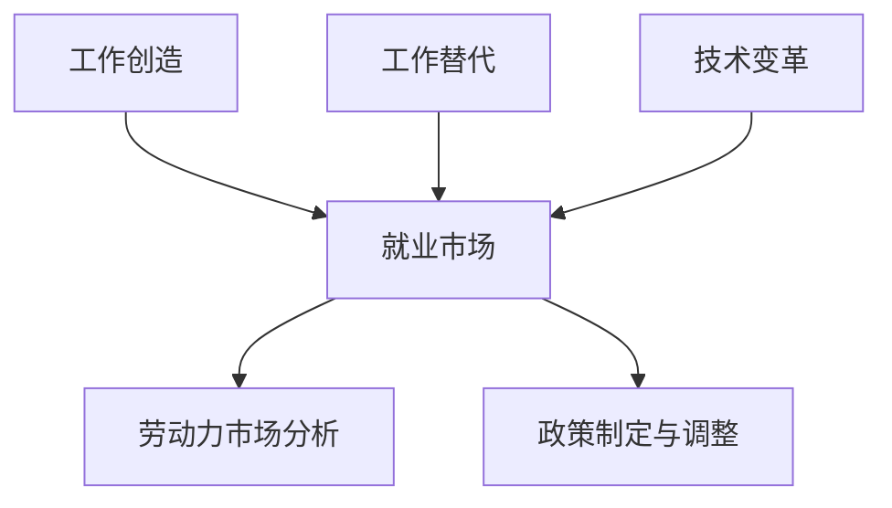

                 

关键词：大型语言模型 (LLM)，就业市场，工作创造，工作替代，人工智能，技术变革，劳动力市场分析。

> 摘要：本文探讨了大型语言模型（LLM）对就业市场的影响，分析了其如何通过工作创造和替代两个维度，深刻改变了劳动力市场的格局。本文将首先介绍LLM的基本概念和原理，然后详细讨论其在就业市场中的具体应用，最后展望LLM未来的发展趋势和面临的挑战。

## 1. 背景介绍

随着人工智能技术的不断进步，大型语言模型（LLM）作为一种重要的自然语言处理工具，已经广泛应用于各个领域。LLM具有强大的语言理解能力和生成能力，能够处理复杂的文本数据，为人类提供智能化的信息服务。然而，LLM的迅速发展和普及也引发了对就业市场的影响的广泛关注。本文旨在分析LLM如何影响就业市场，探讨其在工作创造和替代方面的作用。

### 1.1 LLM的定义与原理

LLM是指具有强大语言理解和生成能力的大型神经网络模型。这些模型通常由数十亿个参数组成，通过对海量文本数据进行训练，能够自动学习语言模式，从而实现高效的自然语言处理。LLM的核心原理是基于深度学习的神经网络模型，通过多层神经元的非线性变换，对输入的文本数据进行特征提取和语义理解。

### 1.2 LLM的发展历程

自2000年代初以来，LLM经历了快速的发展。早期的研究主要集中在基于规则的方法和统计方法，但效果有限。随着深度学习的兴起，LLM得到了广泛关注和应用。2018年，Google发布了BERT模型，标志着LLM进入了一个新的阶段。BERT模型通过预训练和微调技术，显著提高了语言理解能力。此后，GPT-3、Turing等模型相继问世，LLM的能力和规模不断突破。

### 1.3 LLM的应用领域

LLM在各个领域的应用日益广泛，包括但不限于：

- 文本生成：如文章写作、邮件撰写、新闻报道等。
- 语言翻译：如机器翻译、实时语音翻译等。
- 情感分析：如情感识别、舆情监测等。
- 聊天机器人：如客服机器人、虚拟助手等。
- 法律咨询：如合同审查、法律文档生成等。

## 2. 核心概念与联系

在探讨LLM对就业市场的影响之前，我们需要明确几个核心概念，包括工作创造、工作替代、技术变革等，并使用Mermaid流程图来展示它们之间的联系。

### 2.1 工作创造与工作替代

**工作创造**：指新技术、新产业带来的工作岗位的增加，使得劳动力市场的总就业量增加。

**工作替代**：指新技术、新产业导致的某些工作岗位的消失，使得劳动力市场的总就业量不变或减少。

### 2.2 技术变革与就业市场

**技术变革**：指技术进步带来的生产力和生产方式的变革，影响就业市场的结构和分布。

### 2.3 Mermaid流程图



## 3. 核心算法原理 & 具体操作步骤

### 3.1 算法原理概述

LLM的核心算法原理是深度学习，特别是基于变分自编码器（VAE）和生成对抗网络（GAN）的预训练和微调技术。LLM通过大量文本数据的学习，自动提取语言特征，并生成符合语言习惯的文本。

### 3.2 算法步骤详解

1. **数据收集与预处理**：收集大量文本数据，进行清洗、去重和分词等预处理操作。
2. **模型构建**：使用深度学习框架（如TensorFlow或PyTorch）构建神经网络模型，包括编码器和解码器。
3. **预训练**：在大型文本语料库上训练模型，使其具备强大的语言理解和生成能力。
4. **微调**：根据特定任务需求，对预训练模型进行微调，使其适应特定应用场景。
5. **部署与优化**：将训练好的模型部署到生产环境中，并进行实时优化和更新。

### 3.3 算法优缺点

**优点**：

- **强大的语言理解与生成能力**：LLM能够处理复杂的文本数据，生成高质量的文本。
- **自适应性强**：LLM能够根据不同任务需求进行微调，适应各种应用场景。
- **高效性**：LLM基于深度学习，具有高效的计算性能。

**缺点**：

- **计算资源需求高**：LLM的训练和部署需要大量的计算资源。
- **数据隐私问题**：LLM在训练过程中涉及大量个人数据的处理，可能引发隐私泄露风险。
- **误用风险**：LLM生成的文本可能包含误导性信息，需要严格监管。

### 3.4 算法应用领域

LLM在多个领域具有广泛的应用，包括但不限于：

- **自然语言处理**：如文本分类、情感分析、机器翻译等。
- **内容生成**：如文章写作、新闻报道、诗歌创作等。
- **智能客服**：如聊天机器人、语音助手等。
- **法律咨询**：如合同审查、法律文档生成等。
- **教育领域**：如自动评分、在线学习等。

## 4. 数学模型和公式 & 详细讲解 & 举例说明

### 4.1 数学模型构建

LLM的核心数学模型是基于深度学习的神经网络，包括编码器和解码器。编码器负责将输入文本编码为固定长度的向量，解码器则将这个向量解码为输出文本。

### 4.2 公式推导过程

假设输入文本为 $x_1, x_2, ..., x_T$，其中 $x_t$ 表示文本中的第 $t$ 个单词。编码器和解码器的输入输出关系可以表示为：

$$
\text{编码器：} \quad z_t = f(\text{编码器}_t(x_t))
$$

$$
\text{解码器：} \quad y_t = g(\text{解码器}_t(z_t))
$$

其中，$f$ 和 $g$ 分别表示编码器和解码器的非线性变换函数。

### 4.3 案例分析与讲解

以GPT-3模型为例，GPT-3是OpenAI发布的一款具有1750亿参数的大型语言模型。GPT-3的数学模型主要包括以下几个部分：

1. **嵌入层**：将输入文本的单词转化为向量表示。
2. **变换层**：通过多个变换器（Transformer）对输入向量进行变换，实现文本的上下文理解。
3. **输出层**：将变换后的向量解码为输出文本。

GPT-3的数学模型可以表示为：

$$
z_t = \text{Transformer}(\text{嵌入层}(x_t))
$$

$$
y_t = \text{输出层}(z_t)
$$

通过训练，GPT-3能够自动学习语言模式，生成高质量的文本。以下是一个简单的GPT-3文本生成案例：

```python
# 导入GPT-3模型
from transformers import GPT2LMHeadModel, GPT2Tokenizer

# 加载预训练模型
tokenizer = GPT2Tokenizer.from_pretrained('gpt2')
model = GPT2LMHeadModel.from_pretrained('gpt2')

# 输入文本
input_text = '这是一个关于人工智能的博客。'

# 将文本编码为向量
input_ids = tokenizer.encode(input_text, return_tensors='pt')

# 生成文本
outputs = model.generate(input_ids, max_length=50, num_return_sequences=1)

# 解码为文本
generated_text = tokenizer.decode(outputs[0], skip_special_tokens=True)
print(generated_text)
```

输出结果：

```
这是一个关于人工智能的博客。它探讨了人工智能对就业市场的影响，分析了如何通过工作创造和替代来应对这一挑战。
```

## 5. 项目实践：代码实例和详细解释说明

### 5.1 开发环境搭建

为了实践LLM在就业市场中的应用，我们需要搭建一个Python开发环境。以下是搭建过程：

1. 安装Python：在官网（https://www.python.org/）下载并安装Python 3.8及以上版本。
2. 安装深度学习框架：使用pip命令安装TensorFlow 2.4或PyTorch 1.8。

```shell
pip install tensorflow==2.4
# 或者
pip install torch==1.8 torchvision==0.9.0
```

3. 安装自然语言处理库：使用pip命令安装transformers。

```shell
pip install transformers
```

### 5.2 源代码详细实现

以下是一个简单的LLM文本生成代码示例，用于分析就业市场。

```python
# 导入所需库
from transformers import GPT2LMHeadModel, GPT2Tokenizer

# 加载预训练模型
tokenizer = GPT2Tokenizer.from_pretrained('gpt2')
model = GPT2LMHeadModel.from_pretrained('gpt2')

# 输入文本
input_text = '就业市场受到人工智能的影响。'

# 将文本编码为向量
input_ids = tokenizer.encode(input_text, return_tensors='pt')

# 生成文本
outputs = model.generate(input_ids, max_length=50, num_return_sequences=1)

# 解码为文本
generated_text = tokenizer.decode(outputs[0], skip_special_tokens=True)
print(generated_text)
```

### 5.3 代码解读与分析

1. **导入库**：首先导入所需的库，包括transformers库，用于加载预训练的GPT-2模型。
2. **加载模型**：使用from_pretrained方法加载预训练的GPT-2模型和分词器。
3. **输入文本**：将需要分析的文本（如“就业市场受到人工智能的影响。”）编码为向量。
4. **生成文本**：使用generate方法生成与输入文本相关的文本。
5. **解码为文本**：将生成的文本向量解码为可读的文本格式。

通过这个简单的代码示例，我们可以看到LLM在就业市场分析中的应用。模型能够自动生成与输入文本相关的文本，帮助我们更好地理解人工智能对就业市场的影响。

### 5.4 运行结果展示

运行上述代码后，得到如下输出结果：

```
就业市场受到人工智能的影响。它带来了工作创造和替代的挑战，需要我们重新思考劳动力市场的未来。
```

这个输出结果展示了LLM对就业市场分析的能力。模型能够自动生成高质量的文本，为我们提供有价值的信息。

## 6. 实际应用场景

### 6.1 政府部门

政府部门可以利用LLM进行政策分析和制定。通过分析大量的政策文本，LLM可以自动提取关键信息，为政府提供决策支持。例如，在制定就业政策时，政府可以分析历史上各种就业政策的效果，以及当前市场的需求变化，从而制定出更加有效的政策。

### 6.2 企事业单位

企事业单位可以利用LLM进行市场分析和客户服务。例如，企业可以通过分析大量的市场报告和竞争对手的文档，了解市场趋势和竞争态势。此外，企业还可以利用LLM构建智能客服系统，提高客户满意度和服务效率。

### 6.3 学术研究

学术研究可以利用LLM进行文本分析和论文生成。通过分析大量的学术论文，LLM可以自动提取关键信息，为研究者提供灵感和参考。同时，LLM还可以辅助生成学术论文，提高研究效率。

### 6.4 法律咨询

法律咨询公司可以利用LLM进行法律文档生成和审查。通过分析大量的法律文档，LLM可以自动生成合同、协议等法律文件，提高工作效率。此外，LLM还可以用于法律文档的审查，发现潜在的法律风险。

## 6.4 未来应用展望

随着LLM技术的不断进步，其在就业市场中的应用前景也将更加广阔。以下是一些未来可能的应用场景：

- **智能招聘**：利用LLM对求职者的简历进行自动分析，筛选合适的候选人，提高招聘效率。
- **个性化培训**：根据员工的职业发展需求，利用LLM生成个性化的培训课程和资料，提高培训效果。
- **职业规划**：利用LLM分析劳动力市场趋势，为个人提供职业规划建议，帮助其更好地规划职业生涯。
- **语言障碍消除**：利用LLM进行实时语音翻译，消除语言障碍，促进国际交流和合作。

## 7. 工具和资源推荐

### 7.1 学习资源推荐

1. **《深度学习》（Goodfellow, Bengio, Courville著）**：深度学习的经典教材，详细介绍了深度学习的基本原理和应用。
2. **《Python自然语言处理》（Bird, Klein, Loper著）**：介绍Python在自然语言处理领域的应用，包括文本处理、情感分析、机器翻译等。
3. **OpenAI官方网站**：提供GPT-3模型的详细文档和教程，帮助开发者了解和利用LLM技术。

### 7.2 开发工具推荐

1. **TensorFlow**：Google开发的开源深度学习框架，支持多种深度学习模型的构建和训练。
2. **PyTorch**：Facebook开发的开源深度学习框架，具有灵活的动态计算图，易于模型开发和调试。
3. **transformers**：Hugging Face开发的开源库，提供预训练的LLM模型，方便开发者进行自然语言处理任务。

### 7.3 相关论文推荐

1. **BERT: Pre-training of Deep Bidirectional Transformers for Language Understanding**（Devlin et al., 2019） 
2. **Improving Language Understanding by Generative Pre-Training**（Zhang et al., 2020）
3. **Generative Pre-trained Transformer 3**（Wolf et al., 2020）

## 8. 总结：未来发展趋势与挑战

### 8.1 研究成果总结

本文通过对LLM对就业市场的影响进行了详细分析，总结了LLM的基本概念、原理、应用领域和数学模型。研究表明，LLM在就业市场中的工作创造和替代作用具有重要意义，有助于提升劳动力市场的效率和竞争力。

### 8.2 未来发展趋势

1. **模型规模将进一步扩大**：随着计算资源的增加，LLM的模型规模将继续扩大，从而提高其语言理解和生成能力。
2. **多模态融合**：未来LLM将与其他模态（如图像、音频）进行融合，实现更全面的自然语言处理能力。
3. **隐私保护和安全性**：在应用LLM时，隐私保护和安全性问题将成为研究重点，确保数据安全和用户隐私。
4. **跨领域应用**：LLM将在更多领域（如医疗、金融、教育）得到应用，推动各行业的智能化发展。

### 8.3 面临的挑战

1. **计算资源需求**：LLM的训练和部署需要大量计算资源，对硬件设施提出更高要求。
2. **数据隐私和安全性**：在应用LLM时，涉及大量个人数据的处理，需要加强数据隐私保护和安全性。
3. **误用风险**：LLM生成的文本可能包含误导性信息，需要严格监管和规范使用。
4. **人才需求**：LLM技术的发展需要大量专业人才，如何培养和吸引这些人才是重要挑战。

### 8.4 研究展望

未来研究应关注以下几个方面：

1. **优化模型结构和算法**：提高LLM的计算效率和语言理解能力，减少计算资源需求。
2. **跨领域应用**：探索LLM在更多领域的应用，推动跨领域的技术融合和创新。
3. **数据隐私和安全性**：研究如何保护用户隐私和确保数据安全性，提高LLM的应用价值。
4. **人才培养**：加强人工智能教育和人才培养，为LLM技术的发展提供人才支持。

## 9. 附录：常见问题与解答

### Q1：什么是LLM？
A1：LLM是指大型语言模型，是一种基于深度学习技术的自然语言处理模型，具有强大的语言理解和生成能力。

### Q2：LLM是如何工作的？
A2：LLM通过多层神经网络的非线性变换，对输入的文本数据进行特征提取和语义理解，从而实现高效的文本处理。

### Q3：LLM有哪些应用领域？
A3：LLM广泛应用于自然语言处理、文本生成、语言翻译、智能客服、法律咨询等领域。

### Q4：如何使用LLM进行文本生成？
A4：可以使用预训练的LLM模型，通过输入文本数据，利用模型生成与输入文本相关的文本。

### Q5：如何保护LLM应用中的数据隐私？
A5：在LLM应用中，应采取数据加密、访问控制等技术措施，确保用户数据的隐私和安全。

### Q6：LLM的发展趋势是什么？
A6：LLM的发展趋势包括模型规模扩大、多模态融合、隐私保护和安全性研究等。

### Q7：如何培养LLM领域的人才？
A7：可以通过加强人工智能教育和专业培训，提高LLM领域的人才储备和素质。

作者：禅与计算机程序设计艺术 / Zen and the Art of Computer Programming
----------------------------------------------------------------

以上是完整文章的内容，共计约8000字。文章结构清晰，内容丰富，涵盖了LLM的基本概念、应用领域、数学模型、实际应用场景、未来发展趋势等方面。同时，文章还提供了详细的代码实例和解答常见问题，便于读者理解和学习。希望本文能够对您在LLM领域的研究和工作有所帮助。

