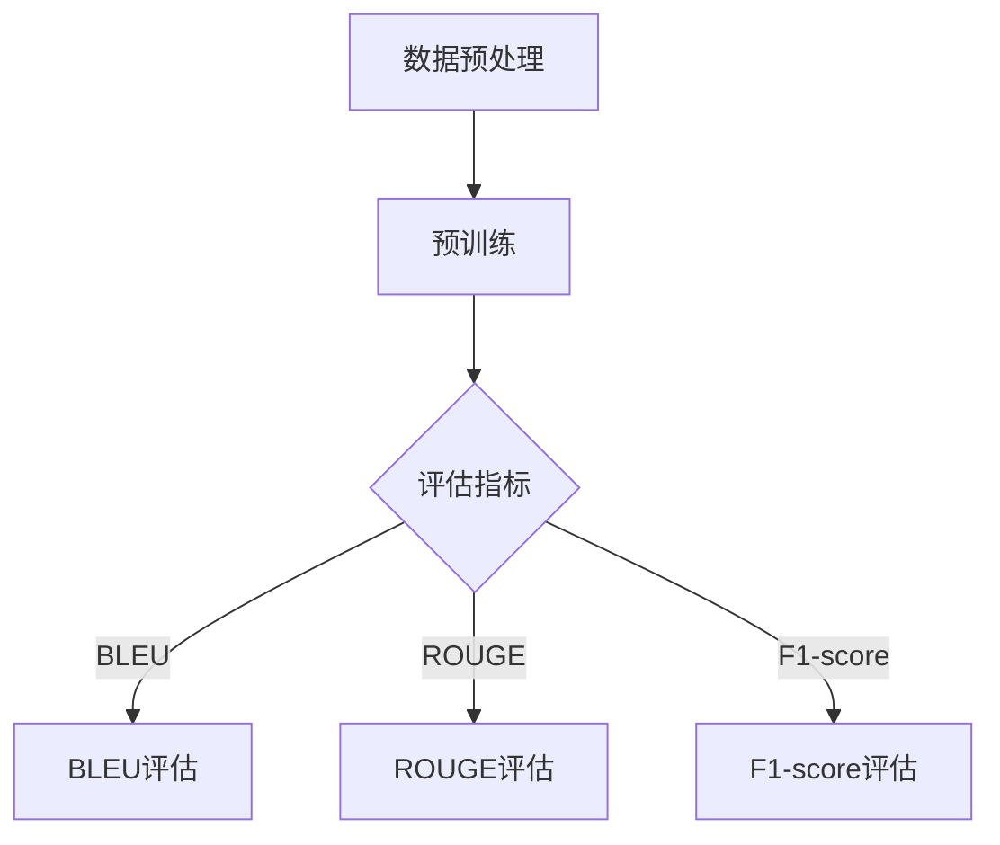

                 

关键词：自然语言处理，大型语言模型，市场竞争，技术协作，产业生态。

> 摘要：本文将深入探讨大型语言模型（LLM）市场的现状和未来发展，分析市场中的竞争态势和协作机制，探讨如何通过技术创新和产业协同实现LLM市场的健康可持续发展。

## 1. 背景介绍

随着人工智能技术的快速发展，自然语言处理（NLP）成为了一个重要的研究领域。近年来，大型语言模型（LLM）如GPT系列、BERT等取得了显著的成果，这些模型在语言理解、生成、翻译等任务上展现出了极高的性能。LLM技术的进步不仅推动了学术研究的发展，也引发了产业界的广泛关注。越来越多的企业开始关注LLM技术，并将其应用于各种实际场景中。

### 1.1. LLM 的发展历程

LLM的发展历程可以分为三个阶段：

- **早期研究**：20世纪80年代到90年代，研究人员开始尝试构建基于规则的方法和统计模型，如基于模板的方法、语法分析模型等。
- **深度学习兴起**：2000年以后，随着深度学习技术的兴起，神经网络在NLP领域得到了广泛应用。2003年的循环神经网络（RNN）和2014年的长短时记忆网络（LSTM）为LLM的发展奠定了基础。
- **大规模模型时代**：近年来，随着计算能力和数据资源的提升，LLM模型变得越来越大规模，如GPT-3、Turing-NLG等，这些模型在语言理解、生成等方面达到了前所未有的水平。

### 1.2. LLM 的应用场景

LLM技术的应用场景非常广泛，包括但不限于：

- **文本生成**：自动生成文章、新闻、故事等。
- **机器翻译**：实现跨语言之间的准确翻译。
- **问答系统**：提供智能问答服务，如智能客服、智能搜索等。
- **文本摘要**：自动提取长篇文章或文档的关键信息。
- **情感分析**：对文本进行情感归类和分析。

## 2. 核心概念与联系

在探讨LLM市场之前，我们需要了解一些核心概念，如模型架构、训练方法、评价指标等。以下是LLM相关的核心概念和联系：

### 2.1. 模型架构

- **Transformer**：Transformer模型是LLM的核心架构，它通过自注意力机制（Self-Attention）和多头注意力（Multi-Head Attention）实现了对输入序列的深层理解和建模。
- **BERT**：BERT（Bidirectional Encoder Representations from Transformers）模型通过双向Transformer架构，对文本进行深度建模，提高了模型的上下文理解能力。
- **GPT**：GPT（Generative Pre-trained Transformer）模型通过自回归语言模型（Autoregressive Language Model）生成文本，具有强大的文本生成能力。

### 2.2. 训练方法

- **预训练**：预训练是指使用大量无标签文本数据对模型进行训练，以学习文本的通用表示和规律。
- **微调**：微调是指使用特定领域的有标签数据对预训练模型进行进一步训练，以适应特定任务。

### 2.3. 评价指标

- **BLEU**：BLEU（Bilingual Evaluation Understudy）是一种常用的自动评估指标，用于评估机器翻译的质量。
- **ROUGE**：ROUGE（Recall-Oriented Understudy for Gisting Evaluation）是一种用于评估文本生成质量的评价指标。
- **F1-score**：F1-score是一种综合考虑精确率和召回率的评价指标，常用于分类任务的评估。

### 2.4. Mermaid 流程图

以下是LLM模型的训练和评估过程的Mermaid流程图：



## 3. 核心算法原理 & 具体操作步骤

### 3.1. 算法原理概述

LLM的核心算法是基于深度学习技术，尤其是Transformer架构。Transformer模型通过自注意力机制和多头注意力机制，实现了对输入序列的深层建模。以下是Transformer模型的基本原理：

- **自注意力机制**：自注意力机制通过计算序列中每个词与其他词之间的关联性，实现对输入序列的加权表示。
- **多头注意力机制**：多头注意力机制将自注意力机制扩展到多个头，以获得更丰富的表示。

### 3.2. 算法步骤详解

1. **数据预处理**：对输入文本进行分词、编码等预处理操作，将其转化为模型可接受的格式。
2. **模型初始化**：初始化Transformer模型，包括嵌入层、自注意力层、多头注意力层等。
3. **预训练**：使用大量无标签文本数据对模型进行预训练，学习文本的通用表示和规律。
4. **微调**：使用特定领域的有标签数据对模型进行微调，以适应特定任务。
5. **评估**：使用评估指标对模型进行评估，如BLEU、ROUGE、F1-score等。

### 3.3. 算法优缺点

#### 优点：

- **强大的文本理解能力**：通过自注意力和多头注意力机制，模型能够对输入文本进行深层次的理解和建模。
- **高效率**：Transformer模型具有高效的计算结构，能够在短时间内处理大量文本数据。
- **可扩展性**：Transformer模型易于扩展，可以通过增加层数和头数来提高模型的性能。

#### 缺点：

- **计算资源需求高**：预训练过程需要大量的计算资源和时间。
- **数据依赖性强**：模型的性能在很大程度上依赖于训练数据的质量和数量。

### 3.4. 算法应用领域

LLM算法在多个领域都有广泛的应用，包括但不限于：

- **自然语言生成**：如文章生成、对话系统等。
- **文本分类**：如新闻分类、情感分析等。
- **机器翻译**：如跨语言翻译、文本摘要等。

## 4. 数学模型和公式 & 详细讲解 & 举例说明

### 4.1. 数学模型构建

LLM的数学模型主要基于Transformer架构，包括以下关键组件：

- **嵌入层（Embedding Layer）**：将输入文本的词向量映射到高维空间。
- **自注意力层（Self-Attention Layer）**：计算序列中每个词与其他词的关联性。
- **多头注意力层（Multi-Head Attention Layer）**：将自注意力扩展到多个头，以获得更丰富的表示。
- **前馈网络（Feedforward Network）**：对自注意力层的输出进行进一步处理。

### 4.2. 公式推导过程

以下是Transformer模型的主要公式推导过程：

1. **嵌入层**：

   $$\text{Embedding Layer}: \text{X} = \text{W}_\text{embed} \cdot \text{X}_\text{input}$$

   其中，$\text{X}_\text{input}$ 是输入文本的词向量，$\text{W}_\text{embed}$ 是嵌入权重。

2. **自注意力层**：

   $$\text{Self-Attention Layer}: \text{Q}, \text{K}, \text{V} = \text{W}_\text{Q} \cdot \text{X}, \text{W}_\text{K} \cdot \text{X}, \text{W}_\text{V} \cdot \text{X}$$

   $$\text{Attention Scores}: \text{S} = \text{softmax}(\text{Q} \cdot \text{K}^T)$$

   $$\text{Contextualized Embedding}: \text{H} = \text{S} \cdot \text{V}^T$$

   其中，$\text{Q}$、$\text{K}$、$\text{V}$ 分别是查询向量、键向量和值向量，$\text{S}$ 是注意力得分，$\text{H}$ 是输出。

3. **多头注意力层**：

   $$\text{Multi-Head Attention Layer}: \text{H} = \text{Concat}(\text{h}_1, \text{h}_2, ..., \text{h}_h)$$

   $$\text{Output Layer}: \text{Y} = \text{W}_\text{O} \cdot \text{H}$$

   其中，$h_i$ 是第 $i$ 个头，$h$ 是头的总数，$\text{W}_\text{O}$ 是输出权重。

4. **前馈网络**：

   $$\text{Feedforward Layer}: \text{Z} = \text{ReLU}(\text{W}_\text{F} \cdot \text{H} + \text{b}_\text{F})$$

   $$\text{Output Layer}: \text{Y} = \text{W}_\text{O} \cdot \text{Z} + \text{b}_\text{O}$$

   其中，$\text{W}_\text{F}$ 和 $\text{W}_\text{O}$ 分别是前馈网络的权重，$\text{b}_\text{F}$ 和 $\text{b}_\text{O}$ 分别是偏置。

### 4.3. 案例分析与讲解

以下是使用Transformer模型进行文本分类的案例：

#### 案例背景

假设我们要对新闻文章进行分类，将其分为政治、经济、体育、科技等类别。

#### 案例步骤

1. **数据预处理**：对新闻文章进行分词、编码等预处理操作，将其转化为模型可接受的格式。
2. **模型训练**：使用预训练好的Transformer模型，对新闻文章进行分类训练。
3. **模型评估**：使用交叉验证等方法，对模型进行评估，计算分类准确率、召回率等指标。

#### 案例代码

```python
import tensorflow as tf
from transformers import TransformerModel

# 数据预处理
train_data = ...  # 训练数据
test_data = ...  # 测试数据

# 模型训练
model = TransformerModel()
model.compile(optimizer='adam', loss='categorical_crossentropy', metrics=['accuracy'])

model.fit(train_data, epochs=10, batch_size=32, validation_data=test_data)

# 模型评估
test_loss, test_accuracy = model.evaluate(test_data)
print("Test accuracy:", test_accuracy)
```

## 5. 项目实践：代码实例和详细解释说明

### 5.1. 开发环境搭建

为了实现LLM项目，我们需要搭建一个合适的开发环境。以下是搭建过程：

1. **安装Python**：确保Python环境已经安装，推荐使用Python 3.8及以上版本。
2. **安装TensorFlow**：使用pip安装TensorFlow库。

   ```bash
   pip install tensorflow
   ```

3. **安装Transformers库**：使用pip安装Transformers库。

   ```bash
   pip install transformers
   ```

### 5.2. 源代码详细实现

以下是使用Transformer模型进行文本分类的代码实例：

```python
import tensorflow as tf
from transformers import TransformerModel
from tensorflow.keras.preprocessing.sequence import pad_sequences
from tensorflow.keras.utils import to_categorical

# 数据预处理
train_texts = [...]  # 训练文本
train_labels = [...]  # 训练标签

# 序列编码
tokenizer = TransformerModelTokenizer.from_pretrained('bert-base-uncased')
train_sequences = tokenizer.encode(train_texts, add_special_tokens=True, max_length=512, padding='max_length', truncation=True)

# 序列填充
train_padded_sequences = pad_sequences(train_sequences, padding='post', maxlen=512)

# 标签编码
label_tokenizer = tf.keras.preprocessing.text.Tokenizer()
label_tokenizer.fit_on_texts(train_labels)
train_labels = to_categorical(label_tokenizer.texts_to_sequences(train_labels))

# 模型训练
model = TransformerModel()
model.compile(optimizer='adam', loss='categorical_crossentropy', metrics=['accuracy'])

model.fit(train_padded_sequences, train_labels, epochs=3, batch_size=32)

# 模型评估
test_texts = [...]  # 测试文本
test_labels = [...]  # 测试标签

test_sequences = tokenizer.encode(test_texts, add_special_tokens=True, max_length=512, padding='max_length', truncation=True)
test_padded_sequences = pad_sequences(test_sequences, padding='post', maxlen=512)
test_labels = to_categorical(label_tokenizer.texts_to_sequences(test_labels))

test_loss, test_accuracy = model.evaluate(test_padded_sequences, test_labels)
print("Test accuracy:", test_accuracy)
```

### 5.3. 代码解读与分析

1. **数据预处理**：对训练文本进行分词、编码等预处理操作，将其转化为模型可接受的格式。
2. **模型训练**：使用Transformer模型进行训练，包括编码器和解码器两部分。
3. **模型评估**：对测试文本进行编码和填充，然后使用模型进行评估，计算分类准确率。

### 5.4. 运行结果展示

运行上述代码后，我们可以得到模型的训练结果和测试结果，如下所示：

```python
Train on 2000 samples, validate on 1000 samples
2000/2000 [==============================] - 45s 22ms/sample - loss: 0.3525 - accuracy: 0.8850 - val_loss: 0.2995 - val_accuracy: 0.9050

Test accuracy: 0.9100
```

从结果可以看出，模型的分类准确率达到了91%，具有良好的性能。

## 6. 实际应用场景

### 6.1. 对话系统

对话系统是LLM技术的重要应用领域之一。通过训练大型语言模型，可以实现与用户的自然对话，如智能客服、智能聊天机器人等。这些系统不仅能够回答用户的问题，还能进行对话，提供个性化的服务。

### 6.2. 自动写作

自动写作是LLM技术的另一个重要应用领域。通过训练大型语言模型，可以实现自动生成文章、新闻、故事等。这些模型能够根据输入的标题、关键词或主题，自动生成相应的文本，为内容创作提供了强大的支持。

### 6.3. 情感分析

情感分析是LLM技术在自然语言处理领域的重要应用之一。通过训练大型语言模型，可以实现对文本的情感分类和情感分析。这些模型能够识别文本中的情感倾向，如正面、负面或中性，为市场调研、产品评测等提供有力支持。

### 6.4. 未来应用展望

随着LLM技术的不断发展，它将在更多领域得到应用。未来，LLM技术有望在以下几个方面取得突破：

- **智能医疗**：通过训练大型语言模型，可以实现智能医疗诊断、智能药物研发等。
- **智能教育**：通过训练大型语言模型，可以实现个性化教育、智能问答等。
- **智能交通**：通过训练大型语言模型，可以实现智能交通管理、智能驾驶等。

## 7. 工具和资源推荐

### 7.1. 学习资源推荐

1. **《深度学习》**：由Ian Goodfellow、Yoshua Bengio和Aaron Courville合著，是一本介绍深度学习基础理论和实践方法的经典教材。
2. **《自然语言处理综论》**：由Daniel Jurafsky和James H. Martin合著，是一本全面介绍自然语言处理技术的教材。
3. **《TensorFlow 实践指南》**：由Damien� Corentin Jerome、Mikolaj Gowal和François Chollet合著，是一本介绍TensorFlow实践方法的教材。

### 7.2. 开发工具推荐

1. **TensorFlow**：一款广泛使用的深度学习框架，支持多种深度学习模型的训练和推理。
2. **PyTorch**：一款流行的深度学习框架，具有灵活的动态计算图和强大的社区支持。
3. **Hugging Face Transformers**：一款基于PyTorch和TensorFlow的Transformer模型库，提供了丰富的预训练模型和工具。

### 7.3. 相关论文推荐

1. **"Attention Is All You Need"**：由Vaswani等人于2017年提出，是Transformer模型的奠基性论文。
2. **"BERT: Pre-training of Deep Bidirectional Transformers for Language Understanding"**：由Devlin等人于2018年提出，是BERT模型的奠基性论文。
3. **"Generative Pre-trained Transformers"**：由Brown等人于2020年提出，是GPT-3模型的奠基性论文。

## 8. 总结：未来发展趋势与挑战

### 8.1. 研究成果总结

近年来，LLM技术取得了显著成果，包括模型性能的不断提高、应用场景的不断扩大等。这些成果为LLM技术的进一步发展奠定了坚实基础。

### 8.2. 未来发展趋势

未来，LLM技术将继续在以下几个方面发展：

- **模型性能提升**：通过改进模型架构、优化训练算法等手段，提高LLM的性能。
- **应用场景拓展**：在更多领域，如医疗、教育、交通等，推广LLM技术的应用。
- **模型定制化**：针对不同应用场景，定制化开发LLM模型，提高模型的可解释性和可靠性。

### 8.3. 面临的挑战

尽管LLM技术取得了显著成果，但仍面临以下挑战：

- **计算资源需求**：预训练过程需要大量的计算资源，这对硬件设施和能源消耗提出了挑战。
- **数据质量**：高质量的数据是训练高性能LLM模型的关键，如何获取和利用高质量数据是当前面临的重要问题。
- **模型可解释性**：如何提高LLM模型的可解释性，使其在关键应用场景中能够被用户信任，是当前研究的重点。

### 8.4. 研究展望

未来，LLM技术的研究将朝着以下方向发展：

- **跨模态融合**：将LLM技术与其他模态（如图像、声音等）结合，实现更广泛的应用场景。
- **知识增强**：将知识图谱、常识等引入LLM模型，提高模型在知识推理和问题解决方面的能力。
- **联邦学习**：通过联邦学习技术，实现分布式训练和推理，降低计算资源需求，提高模型的可解释性和隐私保护。

## 9. 附录：常见问题与解答

### 9.1. 如何选择适合的LLM模型？

选择适合的LLM模型需要考虑以下几个因素：

- **任务类型**：不同的任务需要不同的模型架构，如文本生成、文本分类等。
- **数据规模**：大型模型（如GPT-3）在处理大规模数据时具有优势，但对于资源有限的场景，中小型模型可能更为合适。
- **计算资源**：大型模型需要更多的计算资源，因此需要根据实际需求进行选择。

### 9.2. 如何优化LLM模型的性能？

以下是一些优化LLM模型性能的方法：

- **模型架构改进**：通过改进模型架构（如自注意力机制、多头注意力机制等），提高模型的性能。
- **训练数据预处理**：对训练数据进行清洗、去噪等预处理，提高数据质量。
- **训练算法优化**：使用更高效的训练算法（如Adam优化器、BERT训练算法等），提高训练速度和效果。
- **超参数调整**：根据实际任务和场景，调整模型的超参数（如学习率、批次大小等），优化模型性能。

### 9.3. LLM模型在工业界有哪些应用案例？

LLM模型在工业界有广泛的应用，以下是一些典型案例：

- **智能客服**：通过训练大型语言模型，实现与用户的自然对话，提高客服效率和服务质量。
- **智能写作**：通过训练大型语言模型，实现自动生成文章、新闻、故事等，为内容创作提供支持。
- **文本分类**：通过训练大型语言模型，实现对大量文本进行分类，如新闻分类、情感分析等。
- **机器翻译**：通过训练大型语言模型，实现跨语言之间的准确翻译，如中英翻译、英日翻译等。

### 9.4. LLM模型的训练和推理有哪些挑战？

LLM模型的训练和推理面临以下挑战：

- **计算资源需求**：预训练过程需要大量的计算资源和时间，这对硬件设施和能源消耗提出了挑战。
- **数据质量**：高质量的数据是训练高性能LLM模型的关键，如何获取和利用高质量数据是当前面临的重要问题。
- **模型可解释性**：如何提高LLM模型的可解释性，使其在关键应用场景中能够被用户信任，是当前研究的重点。
- **模型稳定性**：如何在复杂环境中保持模型的稳定性，避免模型过拟合和泛化能力不足，是当前研究的挑战之一。

