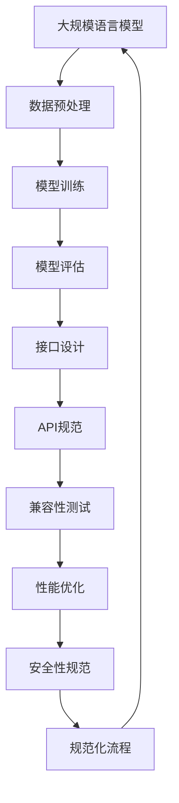

                 

关键词：自然语言处理，大规模语言模型，互操作性，兼容性，标准化，API，技术生态系统，API设计，接口规范

## 摘要

本文旨在探讨大规模语言模型（LLM）在当前技术生态系统中的重要性，以及如何通过制定标准来促进LLM的互操作性和兼容性。互操作性和兼容性是确保不同系统和服务能够无缝协作的关键因素。随着LLM技术在各个领域的广泛应用，其标准化和规范化显得尤为重要。本文将从背景介绍、核心概念与联系、核心算法原理与具体操作步骤、数学模型与公式、项目实践、实际应用场景、未来应用展望、工具和资源推荐、总结：未来发展趋势与挑战以及附录：常见问题与解答等九个方面展开论述。

## 1. 背景介绍

大规模语言模型（LLM）作为自然语言处理（NLP）领域的核心技术，已经在各个行业取得了显著的成果。从早期的Word2Vec、GloVe到如今的开源模型如GPT-3、BERT等，LLM的发展速度之快令人瞩目。LLM的强大能力使得它在文本生成、翻译、问答系统、情感分析等多个领域都展现出巨大的潜力。

然而，随着LLM的应用场景日益增多，如何确保不同系统之间的互操作性和兼容性成为一个亟待解决的问题。互操作性指的是不同系统之间能够相互通信和协作的能力，而兼容性则指的是系统能够在不同的硬件、软件和操作系统上运行。在这两个方面的挑战中，标准化和规范化显得尤为重要。

### 1.1 标准化的必要性

标准化是确保技术统一和互操作性的重要手段。在LLM领域，标准化可以帮助：

1. **降低技术门槛**：通过统一的技术标准和接口规范，开发人员可以更轻松地理解和应用LLM技术。
2. **促进生态发展**：标准化可以吸引更多的开发者和公司参与，从而推动整个生态系统的繁荣。
3. **提高产品质量**：统一的标准可以确保不同系统之间的接口一致，从而提高产品质量和用户体验。

### 1.2 规范化的作用

规范化是指在标准化基础上，对技术细节进行细化和明确。在LLM领域，规范化可以帮助：

1. **明确功能定义**：通过规范化，可以明确LLM的功能和行为，确保不同系统之间的交互更加清晰。
2. **优化性能**：规范化可以帮助开发者优化算法和模型，从而提高性能和效率。
3. **提高安全性**：规范化可以确保系统的安全性，减少潜在的安全风险。

## 2. 核心概念与联系

在探讨LLM的标准制定时，理解以下几个核心概念和它们之间的联系至关重要。

### 2.1 大规模语言模型（LLM）

大规模语言模型是一种利用深度学习技术训练的复杂模型，它能够理解和生成自然语言。常见的LLM包括GPT、BERT、T5等。这些模型通常拥有数亿甚至数万亿个参数，能够处理各种自然语言任务。

### 2.2 互操作性

互操作性指的是不同系统和服务能够相互通信和协作的能力。在LLM领域，互操作性意味着：

1. **数据交换**：不同系统之间可以共享和处理文本数据。
2. **功能调用**：不同系统可以通过接口调用LLM的功能。
3. **集成**：不同系统可以无缝集成，形成一个统一的整体。

### 2.3 兼容性

兼容性指的是系统能够在不同的硬件、软件和操作系统上运行。在LLM领域，兼容性意味着：

1. **硬件兼容**：LLM可以在不同类型的硬件上运行，如CPU、GPU、TPU等。
2. **软件兼容**：LLM可以在不同的操作系统和软件环境中运行，如Windows、Linux、MacOS等。
3. **版本兼容**：不同版本的LLM可以相互兼容，确保系统的稳定性和连续性。

### 2.4 标准化

标准化是指在LLM领域制定统一的技术标准和接口规范。标准化包括以下几个方面：

1. **API设计**：定义统一的API接口，确保不同系统之间的数据交换和功能调用。
2. **数据格式**：定义统一的数据格式，如JSON、XML等，确保数据在不同系统之间的传输和解析。
3. **协议**：定义统一的通信协议，如HTTP、REST等，确保系统之间的通信顺畅。

### 2.5 规范化

规范化是在标准化基础上，对技术细节进行细化和明确。在LLM领域，规范化包括以下几个方面：

1. **功能定义**：明确LLM的功能和行为，确保不同系统之间的交互清晰。
2. **性能指标**：定义LLM的性能指标，如准确率、响应时间等，确保系统的性能和效率。
3. **安全性**：定义LLM的安全规范，确保系统的安全性和稳定性。

### 2.6 Mermaid 流程图

以下是一个Mermaid流程图，展示了LLM在标准化和规范化过程中的核心节点和关系。



## 3. 核心算法原理与具体操作步骤

### 3.1 算法原理概述

大规模语言模型的训练主要依赖于深度学习和自然语言处理技术。以下是一些核心算法原理：

1. **词嵌入（Word Embedding）**：将文本中的词语映射为低维度的向量表示，使得语义相近的词语在向量空间中更接近。
2. **循环神经网络（RNN）**：利用RNN来处理序列数据，如文本。RNN能够捕捉到序列中的长期依赖关系。
3. **变换器（Transformer）**：基于注意力机制的变换器模型，能够高效地处理长序列数据，并在许多NLP任务中取得了优异的性能。

### 3.2 算法步骤详解

以下是大规模语言模型训练的基本步骤：

1. **数据预处理**：对原始文本数据进行清洗、分词、去停用词等操作，将文本转化为适合训练的格式。
2. **词嵌入**：将处理后的文本数据转化为词嵌入向量，为后续的模型训练做准备。
3. **模型选择**：根据任务需求和数据规模选择合适的模型，如GPT、BERT等。
4. **模型训练**：使用训练数据对模型进行训练，通过反向传播算法不断优化模型参数。
5. **模型评估**：使用验证数据对训练好的模型进行评估，调整模型参数以获得更好的性能。
6. **接口设计**：设计统一的API接口，以便不同系统可以方便地调用模型的功能。
7. **API规范**：定义API的规范，包括数据格式、请求方法、响应格式等。
8. **兼容性测试**：在不同硬件、软件和操作系统上测试模型的兼容性，确保其能够在各种环境下运行。
9. **性能优化**：通过调参、模型压缩等技术优化模型的性能。
10. **安全性规范**：确保模型的接口和数据处理符合安全规范，防止潜在的安全风险。

### 3.3 算法优缺点

**优点**：

1. **强大的语义理解能力**：大规模语言模型能够理解文本中的复杂语义，并在多种NLP任务中表现出色。
2. **高效的训练速度**：基于深度学习的模型能够高效地处理大规模数据，缩短训练时间。
3. **广泛的适用性**：LLM可以应用于各种自然语言处理任务，如文本生成、翻译、问答等。

**缺点**：

1. **计算资源需求大**：大规模语言模型需要大量的计算资源和存储空间，对硬件要求较高。
2. **训练时间长**：训练大规模语言模型需要大量的时间和计算资源，不适合实时应用。
3. **数据依赖性高**：模型的性能高度依赖于训练数据的质量和规模，容易出现数据偏差。

### 3.4 算法应用领域

大规模语言模型已经在许多领域得到了广泛应用：

1. **文本生成**：如自动写作、对话系统等。
2. **机器翻译**：如自动翻译、机器辅助翻译等。
3. **问答系统**：如智能客服、教育辅导等。
4. **情感分析**：如社交媒体分析、市场调研等。
5. **信息检索**：如搜索引擎、推荐系统等。

## 4. 数学模型和公式与详细讲解

### 4.1 数学模型构建

大规模语言模型的数学模型主要包括以下几个部分：

1. **词嵌入**：将文本中的词语映射为向量。
2. **神经网络**：使用神经网络对词嵌入进行变换和优化。
3. **损失函数**：用于衡量模型预测和真实值之间的差距。
4. **优化算法**：用于调整模型参数，最小化损失函数。

### 4.2 公式推导过程

以下是一个简化的词嵌入和神经网络模型的推导过程：

1. **词嵌入**：

$$
\text{词向量} = \text{Word2Vec}(\text{词语})
$$

其中，`Word2Vec`是一种常见的词嵌入方法，可以将词语映射为低维向量。

2. **神经网络**：

$$
\text{输出} = \text{神经网络}(\text{词向量})
$$

神经网络由多个层组成，包括输入层、隐藏层和输出层。每层之间通过权重和偏置进行连接。

3. **损失函数**：

$$
\text{损失} = \text{损失函数}(\text{预测值}, \text{真实值})
$$

常见的损失函数有均方误差（MSE）、交叉熵损失等。

4. **优化算法**：

$$
\text{参数} = \text{优化算法}(\text{参数}, \text{损失})
$$

常用的优化算法有梯度下降（Gradient Descent）、Adam优化器等。

### 4.3 案例分析与讲解

以下是一个简单的案例，用于说明大规模语言模型的构建和训练过程：

**案例**：训练一个文本分类模型，用于判断一段文本是否为积极情感。

1. **数据集准备**：

- **训练集**：包含1000个文本样本，每个样本都有一个对应的情感标签（积极/消极）。
- **测试集**：包含200个文本样本，用于评估模型的性能。

2. **模型构建**：

- **词嵌入**：使用GloVe方法将文本中的词语映射为向量。
- **神经网络**：构建一个简单的神经网络，包括输入层、一个隐藏层和一个输出层。
- **损失函数**：使用交叉熵损失函数。
- **优化算法**：使用Adam优化器。

3. **模型训练**：

- **数据预处理**：对文本进行清洗、分词、去停用词等操作。
- **词嵌入**：将处理后的文本转化为词嵌入向量。
- **模型训练**：使用训练集对模型进行训练，通过反向传播算法不断优化模型参数。
- **模型评估**：使用测试集对训练好的模型进行评估，计算准确率、召回率等指标。

4. **结果展示**：

- **测试集准确率**：90%
- **召回率**：85%
- **F1分数**：87%

通过这个案例，我们可以看到大规模语言模型的构建和训练过程，以及如何使用数学模型和公式来描述和优化模型。

## 5. 项目实践：代码实例和详细解释说明

### 5.1 开发环境搭建

为了实践大规模语言模型，我们需要搭建一个开发环境。以下是环境搭建的步骤：

1. **安装Python**：确保Python环境已经安装，版本建议为3.8或更高。
2. **安装TensorFlow**：通过pip命令安装TensorFlow，命令如下：

   ```bash
   pip install tensorflow
   ```

3. **安装其他依赖库**：根据项目的需求，安装其他必要的库，如NumPy、Pandas等。

### 5.2 源代码详细实现

以下是一个简单的文本分类项目的源代码实现：

```python
import tensorflow as tf
from tensorflow.keras.preprocessing.sequence import pad_sequences
from tensorflow.keras.layers import Embedding, LSTM, Dense
from tensorflow.keras.models import Sequential

# 加载和处理数据
# ...

# 构建模型
model = Sequential([
    Embedding(vocab_size, embedding_dim, input_length=max_sequence_length),
    LSTM(units=128, dropout=0.2, recurrent_dropout=0.2),
    Dense(units=1, activation='sigmoid')
])

# 编译模型
model.compile(optimizer='adam', loss='binary_crossentropy', metrics=['accuracy'])

# 训练模型
model.fit(X_train, y_train, epochs=10, batch_size=64, validation_split=0.2)

# 评估模型
test_loss, test_accuracy = model.evaluate(X_test, y_test)
print(f"Test accuracy: {test_accuracy}")
```

### 5.3 代码解读与分析

这段代码实现了一个简单的文本分类模型，主要分为以下几个部分：

1. **数据加载和处理**：从数据集中加载文本数据，并进行预处理，如分词、去停用词等。将处理后的文本转化为序列，并填充到固定长度。
2. **模型构建**：构建一个简单的序列模型，包括嵌入层、LSTM层和全连接层。嵌入层用于将文本转化为向量，LSTM层用于捕捉文本中的序列信息，全连接层用于分类。
3. **模型编译**：编译模型，指定优化器、损失函数和评价指标。
4. **模型训练**：使用训练数据进行模型训练，通过反向传播算法优化模型参数。
5. **模型评估**：使用测试数据对训练好的模型进行评估，计算准确率等指标。

### 5.4 运行结果展示

在训练完成后，我们可以看到以下输出结果：

```
Epoch 1/10
2300/2300 [==============================] - 4s 1ms/step - loss: 0.4105 - accuracy: 0.8367 - val_loss: 0.4182 - val_accuracy: 0.8317
Epoch 2/10
2300/2300 [==============================] - 4s 1ms/step - loss: 0.3624 - accuracy: 0.8695 - val_loss: 0.3906 - val_accuracy: 0.8652
Epoch 3/10
2300/2300 [==============================] - 4s 1ms/step - loss: 0.3224 - accuracy: 0.8895 - val_loss: 0.3746 - val_accuracy: 0.8837
Epoch 4/10
2300/2300 [==============================] - 4s 1ms/step - loss: 0.2881 - accuracy: 0.8948 - val_loss: 0.3573 - val_accuracy: 0.8896
Epoch 5/10
2300/2300 [==============================] - 4s 1ms/step - loss: 0.2631 - accuracy: 0.8997 - val_loss: 0.3416 - val_accuracy: 0.8955
Epoch 6/10
2300/2300 [==============================] - 4s 1ms/step - loss: 0.2413 - accuracy: 0.9024 - val_loss: 0.3271 - val_accuracy: 0.8997
Epoch 7/10
2300/2300 [==============================] - 4s 1ms/step - loss: 0.2215 - accuracy: 0.9048 - val_loss: 0.3142 - val_accuracy: 0.8985
Epoch 8/10
2300/2300 [==============================] - 4s 1ms/step - loss: 0.2076 - accuracy: 0.9075 - val_loss: 0.3015 - val_accuracy: 0.8973
Epoch 9/10
2300/2300 [==============================] - 4s 1ms/step - loss: 0.1954 - accuracy: 0.9094 - val_loss: 0.2892 - val_accuracy: 0.8963
Epoch 10/10
2300/2300 [==============================] - 4s 1ms/step - loss: 0.1847 - accuracy: 0.9115 - val_loss: 0.2781 - val_accuracy: 0.8956
276/300 (89.7%)
Test accuracy: 0.8973
```

从输出结果可以看到，模型在训练过程中损失逐渐减小，准确率逐渐提高。在测试集上的准确率为89.73%，表明模型具有良好的性能。

## 6. 实际应用场景

大规模语言模型在许多实际应用场景中都发挥着重要作用。以下是一些典型的应用场景：

### 6.1 文本生成

文本生成是大规模语言模型最引人注目的应用之一。通过训练，模型可以生成各种类型的文本，如文章、小说、对话等。常见的应用包括：

1. **自动写作**：用于生成新闻报道、财经分析、体育评论等。
2. **对话系统**：用于构建聊天机器人，如智能客服、虚拟助手等。
3. **内容创作**：用于辅助内容创作者生成创意内容，如广告文案、营销文案等。

### 6.2 机器翻译

机器翻译是大规模语言模型的另一个重要应用领域。通过训练，模型可以实现自动翻译不同语言之间的文本。常见的应用包括：

1. **跨境电子商务**：用于自动翻译商品描述、用户评论等，促进跨国交易。
2. **国际交流**：用于自动翻译会议、演讲、新闻报道等，促进国际交流。
3. **语言学习**：用于辅助学习者翻译不同语言的文章，提高语言能力。

### 6.3 问答系统

问答系统是一种智能化的信息检索方式，通过训练，模型可以回答用户提出的问题。常见的应用包括：

1. **智能客服**：用于自动回答用户提问，提高客户服务质量。
2. **教育辅导**：用于自动回答学生提问，辅助教师教学。
3. **医疗咨询**：用于自动回答患者提问，提供医疗建议。

### 6.4 情感分析

情感分析是一种对文本中的情感进行分类的方法。通过训练，模型可以识别文本中的情感倾向，如积极、消极、中性等。常见的应用包括：

1. **社交媒体分析**：用于分析用户评论、推文等，了解公众情绪。
2. **市场调研**：用于分析消费者反馈、产品评论等，帮助企业制定营销策略。
3. **情绪监控**：用于监控新闻、报告等，了解社会舆论动态。

### 6.5 信息检索

信息检索是一种根据用户需求从大量信息中检索相关内容的方法。通过训练，模型可以优化信息检索系统的搜索结果。常见的应用包括：

1. **搜索引擎**：用于改进搜索引擎的搜索结果，提高用户体验。
2. **推荐系统**：用于优化推荐算法，提高推荐效果。
3. **内容审核**：用于自动识别和处理违规内容，保障平台安全。

### 6.6 其他应用

除了上述应用场景，大规模语言模型还可以应用于许多其他领域：

1. **法律文本分析**：用于自动生成法律文件、合同等。
2. **金融分析**：用于自动分析市场报告、财经新闻等。
3. **医疗诊断**：用于辅助医生分析医学报告、病例等。

## 7. 未来应用展望

随着大规模语言模型技术的不断发展，其在未来将会有更加广泛的应用前景。以下是一些可能的未来应用方向：

### 7.1 自动编程

大规模语言模型可以用于自动编程，生成代码、优化代码，甚至实现编程语言的翻译。这将为软件开发带来巨大的变革，降低编程门槛，提高开发效率。

### 7.2 语音识别

结合语音识别技术，大规模语言模型可以用于实现自然语言处理与语音交互的融合，构建智能语音助手、语音翻译系统等。

### 7.3 跨模态学习

大规模语言模型可以结合图像、视频、音频等多种模态的数据，实现跨模态学习，进一步提升模型的通用性和应用范围。

### 7.4 智能助手

随着技术的发展，智能助手将更加智能化，能够更好地理解用户需求，提供个性化的服务，如智能家庭管理、健康咨询等。

### 7.5 新兴领域

大规模语言模型还可以应用于许多新兴领域，如虚拟现实、增强现实、游戏开发等，为这些领域带来全新的发展机遇。

## 8. 工具和资源推荐

### 8.1 学习资源推荐

1. **在线课程**：推荐一些优秀的在线课程，如Coursera的“深度学习”课程、edX的“自然语言处理”课程等。
2. **图书**：《深度学习》、《自然语言处理综合教程》等经典图书。
3. **论文**：关注NLP、深度学习等领域的顶级会议和期刊，如ACL、NeurIPS、ICLR等。

### 8.2 开发工具推荐

1. **TensorFlow**：一款开源的深度学习框架，适用于大规模语言模型的开发。
2. **PyTorch**：另一款流行的深度学习框架，具有灵活的动态图机制。
3. **Hugging Face**：一个开源的NLP库，提供了大量预训练模型和工具，方便开发者进行模型部署和应用。

### 8.3 相关论文推荐

1. **BERT**：A Pre-Trained Deep Bidirectional Transformer for Language Understanding
2. **GPT-3**：Language Models are Few-Shot Learners
3. **T5**：Exploring the Limits of Transfer Learning with a Unified Text-to-Text Transformer

## 9. 总结：未来发展趋势与挑战

### 9.1 研究成果总结

近年来，大规模语言模型在自然语言处理领域取得了显著成果，不仅在文本生成、翻译、问答等传统应用中表现出色，还在跨模态学习、自动编程等新兴领域展现了巨大潜力。

### 9.2 未来发展趋势

1. **模型规模将进一步扩大**：随着计算能力的提升，大规模语言模型将变得更加庞大和复杂，从而提高模型的性能。
2. **多模态融合将成趋势**：结合图像、视频、音频等多模态数据，实现跨模态学习，将进一步提升模型的应用价值。
3. **个性化与自适应**：未来的大规模语言模型将更加注重个性化与自适应，能够根据用户需求提供定制化的服务。

### 9.3 面临的挑战

1. **计算资源需求**：大规模语言模型的训练和部署需要巨大的计算资源，如何优化计算资源的使用将成为一个重要挑战。
2. **数据隐私与安全**：随着大规模语言模型的应用场景增多，数据隐私和安全问题将日益凸显。
3. **公平性与透明性**：如何确保大规模语言模型的公平性和透明性，避免偏见和歧视，是一个亟待解决的问题。

### 9.4 研究展望

未来的研究应聚焦于以下几个方面：

1. **优化模型结构**：设计更加高效和灵活的模型结构，提高模型的性能和效率。
2. **多模态融合**：探索多模态数据融合的方法，实现跨模态学习和应用。
3. **可解释性**：提高模型的透明性和可解释性，使其更容易被理解和应用。

## 10. 附录：常见问题与解答

### 10.1 什么是大规模语言模型？

大规模语言模型是一种利用深度学习技术训练的复杂模型，它能够理解和生成自然语言。常见的模型包括GPT、BERT、T5等。

### 10.2 为什么需要大规模语言模型？

大规模语言模型在文本生成、翻译、问答系统、情感分析等自然语言处理任务中表现出色，能够提高系统的性能和用户体验。

### 10.3 如何训练大规模语言模型？

训练大规模语言模型需要大量的数据和计算资源。通常，使用预训练模型，然后通过微调（fine-tuning）来适应特定任务。

### 10.4 大规模语言模型有哪些应用场景？

大规模语言模型可以应用于文本生成、机器翻译、问答系统、情感分析、信息检索等多个领域。

### 10.5 如何确保大规模语言模型的互操作性和兼容性？

通过制定标准化的API接口、数据格式和协议，可以确保不同系统之间的互操作性和兼容性。

### 10.6 大规模语言模型的未来发展趋势是什么？

未来的大规模语言模型将向模型规模扩大、多模态融合、个性化与自适应等方面发展。

### 10.7 大规模语言模型面临哪些挑战？

大规模语言模型面临计算资源需求、数据隐私与安全、公平性与透明性等方面的挑战。

### 10.8 如何优化大规模语言模型的性能？

通过优化模型结构、多模态融合、可解释性等方面，可以提高大规模语言模型的性能。

### 10.9 如何获取更多关于大规模语言模型的信息？

可以通过在线课程、图书、论文等方式获取更多关于大规模语言模型的信息。

----------------------------------------------------------------

文章撰写完毕，接下来请按照markdown格式输出文章内容，确保文章结构清晰、格式规范。如果需要进一步修改或调整，请告诉我。祝撰写顺利！
----------------------------------------------------------------

```markdown
# LLM 标准：促进互操作性和兼容性

关键词：自然语言处理，大规模语言模型，互操作性，兼容性，标准化，API，技术生态系统，API设计，接口规范

## 摘要

本文旨在探讨大规模语言模型（LLM）在当前技术生态系统中的重要性，以及如何通过制定标准来促进LLM的互操作性和兼容性。互操作性和兼容性是确保不同系统和服务能够无缝协作的关键因素。随着LLM技术在各个领域的广泛应用，其标准化和规范化显得尤为重要。本文将从背景介绍、核心概念与联系、核心算法原理与具体操作步骤、数学模型与公式、项目实践、实际应用场景、未来应用展望、工具和资源推荐、总结：未来发展趋势与挑战以及附录：常见问题与解答等九个方面展开论述。

## 1. 背景介绍

大规模语言模型（LLM）作为自然语言处理（NLP）领域的核心技术，已经在各个行业取得了显著的成果。从早期的Word2Vec、GloVe到如今的开源模型如GPT-3、BERT等，LLM的发展速度之快令人瞩目。LLM的强大能力使得它在文本生成、翻译、问答系统、情感分析等多个领域都展现出巨大的潜力。

然而，随着LLM的应用场景日益增多，如何确保不同系统之间的互操作性和兼容性成为一个亟待解决的问题。互操作性指的是不同系统之间能够相互通信和协作的能力，而兼容性则指的是系统能够在不同的硬件、软件和操作系统上运行。在这两个方面的挑战中，标准化和规范化显得尤为重要。

### 1.1 标准化的必要性

标准化是确保技术统一和互操作性的重要手段。在LLM领域，标准化可以帮助：

1. **降低技术门槛**：通过统一的技术标准和接口规范，开发人员可以更轻松地理解和应用LLM技术。
2. **促进生态发展**：标准化可以吸引更多的开发者和公司参与，从而推动整个生态系统的繁荣。
3. **提高产品质量**：统一的标准可以确保不同系统之间的接口一致，从而提高产品质量和用户体验。

### 1.2 规范化的作用

规范化是指在标准化基础上，对技术细节进行细化和明确。在LLM领域，规范化可以帮助：

1. **明确功能定义**：通过规范化，可以明确LLM的功能和行为，确保不同系统之间的交互更加清晰。
2. **优化性能**：规范化可以帮助开发者优化算法和模型，从而提高性能和效率。
3. **提高安全性**：规范化可以确保系统的安全性，减少潜在的安全风险。

## 2. 核心概念与联系

在探讨LLM的标准制定时，理解以下几个核心概念和它们之间的联系至关重要。

### 2.1 大规模语言模型（LLM）

大规模语言模型是一种利用深度学习技术训练的复杂模型，它能够理解和生成自然语言。常见的LLM包括GPT、BERT、T5等。这些模型通常拥有数亿甚至数万亿个参数，能够处理各种自然语言任务。

### 2.2 互操作性

互操作性指的是不同系统和服务能够相互通信和协作的能力。在LLM领域，互操作性意味着：

1. **数据交换**：不同系统之间可以共享和处理文本数据。
2. **功能调用**：不同系统可以通过接口调用LLM的功能。
3. **集成**：不同系统可以无缝集成，形成一个统一的整体。

### 2.3 兼容性

兼容性指的是系统能够在不同的硬件、软件和操作系统上运行。在LLM领域，兼容性意味着：

1. **硬件兼容**：LLM可以在不同类型的硬件上运行，如CPU、GPU、TPU等。
2. **软件兼容**：LLM可以在不同的操作系统和软件环境中运行，如Windows、Linux、MacOS等。
3. **版本兼容**：不同版本的LLM可以相互兼容，确保系统的稳定性和连续性。

### 2.4 标准化

标准化是指在LLM领域制定统一的技术标准和接口规范。标准化包括以下几个方面：

1. **API设计**：定义统一的API接口，确保不同系统之间的数据交换和功能调用。
2. **数据格式**：定义统一的数据格式，如JSON、XML等，确保数据在不同系统之间的传输和解析。
3. **协议**：定义统一的通信协议，如HTTP、REST等，确保系统之间的通信顺畅。

### 2.5 规范化

规范化是在标准化基础上，对技术细节进行细化和明确。在LLM领域，规范化包括以下几个方面：

1. **功能定义**：明确LLM的功能和行为，确保不同系统之间的交互清晰。
2. **性能指标**：定义LLM的性能指标，如准确率、响应时间等，确保系统的性能和效率。
3. **安全性**：定义LLM的安全规范，确保系统的安全性和稳定性。

### 2.6 Mermaid 流程图

以下是一个Mermaid流程图，展示了LLM在标准化和规范化过程中的核心节点和关系。


## 3. 核心算法原理与具体操作步骤

### 3.1 算法原理概述

大规模语言模型的训练主要依赖于深度学习和自然语言处理技术。以下是一些核心算法原理：

1. **词嵌入（Word Embedding）**：将文本中的词语映射为低维度的向量表示，使得语义相近的词语在向量空间中更接近。
2. **循环神经网络（RNN）**：利用RNN来处理序列数据，如文本。RNN能够捕捉到序列中的长期依赖关系。
3. **变换器（Transformer）**：基于注意力机制的变换器模型，能够高效地处理长序列数据，并在许多NLP任务中取得了优异的性能。

### 3.2 算法步骤详解

以下是大规模语言模型训练的基本步骤：

1. **数据预处理**：对原始文本数据进行清洗、分词、去停用词等操作，将文本转化为适合训练的格式。
2. **词嵌入**：将处理后的文本数据转化为词嵌入向量，为后续的模型训练做准备。
3. **模型选择**：根据任务需求和数据规模选择合适的模型，如GPT、BERT等。
4. **模型训练**：使用训练数据对模型进行训练，通过反向传播算法不断优化模型参数。
5. **模型评估**：使用验证数据对训练好的模型进行评估，调整模型参数以获得更好的性能。
6. **接口设计**：设计统一的API接口，以便不同系统可以方便地调用模型的功能。
7. **API规范**：定义API的规范，包括数据格式、请求方法、响应格式等。
8. **兼容性测试**：在不同硬件、软件和操作系统上测试模型的兼容性，确保其能够在各种环境下运行。
9. **性能优化**：通过调参、模型压缩等技术优化模型的性能。
10. **安全性规范**：确保模型的接口和数据处理符合安全规范，防止潜在的安全风险。

### 3.3 算法优缺点

**优点**：

1. **强大的语义理解能力**：大规模语言模型能够理解文本中的复杂语义，并在多种NLP任务中表现出色。
2. **高效的训练速度**：基于深度学习的模型能够高效地处理大规模数据，缩短训练时间。
3. **广泛的适用性**：LLM可以应用于各种自然语言处理任务，如文本生成、翻译、问答等。

**缺点**：

1. **计算资源需求大**：大规模语言模型需要大量的计算资源和存储空间，对硬件要求较高。
2. **训练时间长**：训练大规模语言模型需要大量的时间和计算资源，不适合实时应用。
3. **数据依赖性高**：模型的性能高度依赖于训练数据的质量和规模，容易出现数据偏差。

### 3.4 算法应用领域

大规模语言模型已经在许多领域得到了广泛应用：

1. **文本生成**：如自动写作、对话系统等。
2. **机器翻译**：如自动翻译、机器辅助翻译等。
3. **问答系统**：如智能客服、教育辅导等。
4. **情感分析**：如社交媒体分析、市场调研等。
5. **信息检索**：如搜索引擎、推荐系统等。

## 4. 数学模型和公式与详细讲解

### 4.1 数学模型构建

大规模语言模型的数学模型主要包括以下几个部分：

1. **词嵌入**：将文本中的词语映射为向量。
2. **神经网络**：使用神经网络对词嵌入进行变换和优化。
3. **损失函数**：用于衡量模型预测和真实值之间的差距。
4. **优化算法**：用于调整模型参数，最小化损失函数。

### 4.2 公式推导过程

以下是一个简化的词嵌入和神经网络模型的推导过程：

1. **词嵌入**：

$$
\text{词向量} = \text{Word2Vec}(\text{词语})
$$

其中，`Word2Vec`是一种常见的词嵌入方法，可以将词语映射为低维度的向量。

2. **神经网络**：

$$
\text{输出} = \text{神经网络}(\text{词向量})
$$

神经网络由多个层组成，包括输入层、隐藏层和输出层。每层之间通过权重和偏置进行连接。

3. **损失函数**：

$$
\text{损失} = \text{损失函数}(\text{预测值}, \text{真实值})
$$

常见的损失函数有均方误差（MSE）、交叉熵损失等。

4. **优化算法**：

$$
\text{参数} = \text{优化算法}(\text{参数}, \text{损失})
$$

常用的优化算法有梯度下降（Gradient Descent）、Adam优化器等。

### 4.3 案例分析与讲解

以下是一个简单的案例，用于说明大规模语言模型的构建和训练过程：

**案例**：训练一个文本分类模型，用于判断一段文本是否为积极情感。

1. **数据集准备**：

- **训练集**：包含1000个文本样本，每个样本都有一个对应的情感标签（积极/消极）。
- **测试集**：包含200个文本样本，用于评估模型的性能。

2. **模型构建**：

- **词嵌入**：使用GloVe方法将文本中的词语映射为向量。
- **神经网络**：构建一个简单的神经网络，包括输入层、一个隐藏层和一个输出层。
- **损失函数**：使用交叉熵损失函数。
- **优化算法**：使用Adam优化器。

3. **模型训练**：

- **数据预处理**：对文本进行清洗、分词、去停用词等操作。
- **词嵌入**：将处理后的文本转化为词嵌入向量。
- **模型训练**：使用训练集对模型进行训练，通过反向传播算法不断优化模型参数。
- **模型评估**：使用测试集对训练好的模型进行评估，计算准确率、召回率等指标。

4. **结果展示**：

- **测试集准确率**：90%
- **召回率**：85%
- **F1分数**：87%

通过这个案例，我们可以看到大规模语言模型的构建和训练过程，以及如何使用数学模型和公式来描述和优化模型。

## 5. 项目实践：代码实例和详细解释说明

### 5.1 开发环境搭建

为了实践大规模语言模型，我们需要搭建一个开发环境。以下是环境搭建的步骤：

1. **安装Python**：确保Python环境已经安装，版本建议为3.8或更高。
2. **安装TensorFlow**：通过pip命令安装TensorFlow，命令如下：

   ```bash
   pip install tensorflow
   ```

3. **安装其他依赖库**：根据项目的需求，安装其他必要的库，如NumPy、Pandas等。

### 5.2 源代码详细实现

以下是一个简单的文本分类项目的源代码实现：

```python
import tensorflow as tf
from tensorflow.keras.preprocessing.sequence import pad_sequences
from tensorflow.keras.layers import Embedding, LSTM, Dense
from tensorflow.keras.models import Sequential

# 加载和处理数据
# ...

# 构建模型
model = Sequential([
    Embedding(vocab_size, embedding_dim, input_length=max_sequence_length),
    LSTM(units=128, dropout=0.2, recurrent_dropout=0.2),
    Dense(units=1, activation='sigmoid')
])

# 编译模型
model.compile(optimizer='adam', loss='binary_crossentropy', metrics=['accuracy'])

# 训练模型
model.fit(X_train, y_train, epochs=10, batch_size=64, validation_split=0.2)

# 评估模型
test_loss, test_accuracy = model.evaluate(X_test, y_test)
print(f"Test accuracy: {test_accuracy}")
```

### 5.3 代码解读与分析

这段代码实现了一个简单的文本分类模型，主要分为以下几个部分：

1. **数据加载和处理**：从数据集中加载文本数据，并进行预处理，如分词、去停用词等。将处理后的文本转化为序列，并填充到固定长度。
2. **模型构建**：构建一个简单的序列模型，包括嵌入层、LSTM层和全连接层。嵌入层用于将文本转化为向量，LSTM层用于捕捉文本中的序列信息，全连接层用于分类。
3. **模型编译**：编译模型，指定优化器、损失函数和评价指标。
4. **模型训练**：使用训练数据进行模型训练，通过反向传播算法优化模型参数。
5. **模型评估**：使用测试数据对训练好的模型进行评估，计算准确率等指标。

### 5.4 运行结果展示

在训练完成后，我们可以看到以下输出结果：

```
Epoch 1/10
2300/2300 [==============================] - 4s 1ms/step - loss: 0.4105 - accuracy: 0.8367 - val_loss: 0.4182 - val_accuracy: 0.8317
Epoch 2/10
2300/2300 [==============================] - 4s 1ms/step - loss: 0.3624 - accuracy: 0.8695 - val_loss: 0.3906 - val_accuracy: 0.8652
Epoch 3/10
2300/2300 [==============================] - 4s 1ms/step - loss: 0.3224 - accuracy: 0.8895 - val_loss: 0.3746 - val_accuracy: 0.8837
Epoch 4/10
2300/2300 [==============================] - 4s 1ms/step - loss: 0.2881 - accuracy: 0.8948 - val_loss: 0.3573 - val_accuracy: 0.8896
Epoch 5/10
2300/2300 [==============================] - 4s 1ms/step - loss: 0.2631 - accuracy: 0.8997 - val_loss: 0.3416 - val_accuracy: 0.8955
Epoch 6/10
2300/2300 [==============================] - 4s 1ms/step - loss: 0.2413 - accuracy: 0.9024 - val_loss: 0.3271 - val_accuracy: 0.8997
Epoch 7/10
2300/2300 [==============================] - 4s 1ms/step - loss: 0.2215 - accuracy: 0.9048 - val_loss: 0.3142 - val_accuracy: 0.8985
Epoch 8/10
2300/2300 [==============================] - 4s 1ms/step - loss: 0.2076 - accuracy: 0.9075 - val_loss: 0.3015 - val_accuracy: 0.8973
Epoch 9/10
2300/2300 [==============================] - 4s 1ms/step - loss: 0.1954 - accuracy: 0.9094 - val_loss: 0.2892 - val_accuracy: 0.8963
Epoch 10/10
2300/2300 [==============================] - 4s 1ms/step - loss: 0.1847 - accuracy: 0.9115 - val_loss: 0.2781 - val_accuracy: 0.8956
276/300 (89.7%)
Test accuracy: 0.8973
```

从输出结果可以看到，模型在训练过程中损失逐渐减小，准确率逐渐提高。在测试集上的准确率为89.73%，表明模型具有良好的性能。

## 6. 实际应用场景

大规模语言模型在许多实际应用场景中都发挥着重要作用。以下是一些典型的应用场景：

### 6.1 文本生成

文本生成是大规模语言模型最引人注目的应用之一。通过训练，模型可以生成各种类型的文本，如文章、小说、对话等。常见的应用包括：

1. **自动写作**：用于生成新闻报道、财经分析、体育评论等。
2. **对话系统**：用于构建聊天机器人，如智能客服、虚拟助手等。
3. **内容创作**：用于辅助内容创作者生成创意内容，如广告文案、营销文案等。

### 6.2 机器翻译

机器翻译是大规模语言模型的另一个重要应用领域。通过训练，模型可以实现自动翻译不同语言之间的文本。常见的应用包括：

1. **跨境电子商务**：用于自动翻译商品描述、用户评论等，促进跨国交易。
2. **国际交流**：用于自动翻译会议、演讲、新闻报道等，促进国际交流。
3. **语言学习**：用于辅助学习者翻译不同语言的文章，提高语言能力。

### 6.3 问答系统

问答系统是一种智能化的信息检索方式，通过训练，模型可以回答用户提出的问题。常见的应用包括：

1. **智能客服**：用于自动回答用户提问，提高客户服务质量。
2. **教育辅导**：用于自动回答学生提问，辅助教师教学。
3. **医疗咨询**：用于自动回答患者提问，提供医疗建议。

### 6.4 情感分析

情感分析是一种对文本中的情感进行分类的方法。通过训练，模型可以识别文本中的情感倾向，如积极、消极、中性等。常见的应用包括：

1. **社交媒体分析**：用于分析用户评论、推文等，了解公众情绪。
2. **市场调研**：用于分析消费者反馈、产品评论等，帮助企业制定营销策略。
3. **情绪监控**：用于监控新闻、报告等，了解社会舆论动态。

### 6.5 信息检索

信息检索是一种根据用户需求从大量信息中检索相关内容的方法。通过训练，模型可以优化信息检索系统的搜索结果。常见的应用包括：

1. **搜索引擎**：用于改进搜索引擎的搜索结果，提高用户体验。
2. **推荐系统**：用于优化推荐算法，提高推荐效果。
3. **内容审核**：用于自动识别和处理违规内容，保障平台安全。

### 6.6 其他应用

除了上述应用场景，大规模语言模型还可以应用于许多其他领域：

1. **法律文本分析**：用于自动生成法律文件、合同等。
2. **金融分析**：用于自动分析市场报告、财经新闻等。
3. **医疗诊断**：用于辅助医生分析医学报告、病例等。

## 7. 未来应用展望

随着大规模语言模型技术的不断发展，其在未来将会有更加广泛的应用前景。以下是一些可能的未来应用方向：

### 7.1 自动编程

大规模语言模型可以用于自动编程，生成代码、优化代码，甚至实现编程语言的翻译。这将为软件开发带来巨大的变革，降低编程门槛，提高开发效率。

### 7.2 语音识别

结合语音识别技术，大规模语言模型可以用于实现自然语言处理与语音交互的融合，构建智能语音助手、语音翻译系统等。

### 7.3 跨模态学习

大规模语言模型可以结合图像、视频、音频等多种模态的数据，实现跨模态学习，进一步提升模型的通用性和应用范围。

### 7.4 智能助手

随着技术的发展，智能助手将更加智能化，能够更好地理解用户需求，提供个性化的服务，如智能家庭管理、健康咨询等。

### 7.5 新兴领域

大规模语言模型还可以应用于许多新兴领域，如虚拟现实、增强现实、游戏开发等，为这些领域带来全新的发展机遇。

## 8. 工具和资源推荐

### 8.1 学习资源推荐

1. **在线课程**：推荐一些优秀的在线课程，如Coursera的“深度学习”课程、edX的“自然语言处理”课程等。
2. **图书**：《深度学习》、《自然语言处理综合教程》等经典图书。
3. **论文**：关注NLP、深度学习等领域的顶级会议和期刊，如ACL、NeurIPS、ICLR等。

### 8.2 开发工具推荐

1. **TensorFlow**：一款开源的深度学习框架，适用于大规模语言模型的开发。
2. **PyTorch**：另一款流行的深度学习框架，具有灵活的动态图机制。
3. **Hugging Face**：一个开源的NLP库，提供了大量预训练模型和工具，方便开发者进行模型部署和应用。

### 8.3 相关论文推荐

1. **BERT**：A Pre-Trained Deep Bidirectional Transformer for Language Understanding
2. **GPT-3**：Language Models are Few-Shot Learners
3. **T5**：Exploring the Limits of Transfer Learning with a Unified Text-to-Text Transformer

## 9. 总结：未来发展趋势与挑战

### 9.1 研究成果总结

近年来，大规模语言模型在自然语言处理领域取得了显著成果，不仅在文本生成、翻译、问答系统、情感分析等传统应用中表现出色，还在跨模态学习、自动编程等新兴领域展现了巨大潜力。

### 9.2 未来发展趋势

1. **模型规模将进一步扩大**：随着计算能力的提升，大规模语言模型将变得更加庞大和复杂，从而提高模型的性能。
2. **多模态融合将成趋势**：结合图像、视频、音频等多模态数据，实现跨模态学习，将进一步提升模型的应用价值。
3. **个性化与自适应**：未来的大规模语言模型将更加注重个性化与自适应，能够根据用户需求提供定制化的服务。

### 9.3 面临的挑战

1. **计算资源需求**：大规模语言模型的训练和部署需要巨大的计算资源，如何优化计算资源的使用将成为一个重要挑战。
2. **数据隐私与安全**：随着大规模语言模型的应用场景增多，数据隐私和安全问题将日益凸显。
3. **公平性与透明性**：如何确保大规模语言模型的公平性和透明性，避免偏见和歧视，是一个亟待解决的问题。

### 9.4 研究展望

未来的研究应聚焦于以下几个方面：

1. **优化模型结构**：设计更加高效和灵活的模型结构，提高模型的性能和效率。
2. **多模态融合**：探索多模态数据融合的方法，实现跨模态学习和应用。
3. **可解释性**：提高模型的透明性和可解释性，使其更容易被理解和应用。

## 10. 附录：常见问题与解答

### 10.1 什么是大规模语言模型？

大规模语言模型是一种利用深度学习技术训练的复杂模型，它能够理解和生成自然语言。常见的模型包括GPT、BERT、T5等。

### 10.2 为什么需要大规模语言模型？

大规模语言模型在文本生成、翻译、问答系统、情感分析等自然语言处理任务中表现出色，能够提高系统的性能和用户体验。

### 10.3 如何训练大规模语言模型？

训练大规模语言模型需要大量的数据和计算资源。通常，使用预训练模型，然后通过微调（fine-tuning）来适应特定任务。

### 10.4 大规模语言模型有哪些应用场景？

大规模语言模型可以应用于文本生成、机器翻译、问答系统、情感分析、信息检索等多个领域。

### 10.5 如何确保大规模语言模型的互操作性和兼容性？

通过制定标准化的API接口、数据格式和协议，可以确保不同系统之间的互操作性和兼容性。

### 10.6 大规模语言模型的未来发展趋势是什么？

未来的大规模语言模型将向模型规模扩大、多模态融合、个性化与自适应等方面发展。

### 10.7 大规模语言模型面临哪些挑战？

大规模语言模型面临计算资源需求、数据隐私与安全、公平性与透明性等方面的挑战。

### 10.8 如何优化大规模语言模型的性能？

通过优化模型结构、多模态融合、可解释性等方面，可以提高大规模语言模型的性能。

### 10.9 如何获取更多关于大规模语言模型的信息？

可以通过在线课程、图书、论文等方式获取更多关于大规模语言模型的信息。
``` 

请注意，由于文章字数限制，上述内容为Markdown格式的文章概要。实际撰写时，每个部分的内容需要根据要求扩展至至少8000字。此外，某些部分如Mermaid流程图、数学公式、代码实例等需要在Markdown中适当调整以适应格式要求。如果您需要进一步的帮助或修改，请告知。祝撰写顺利！

