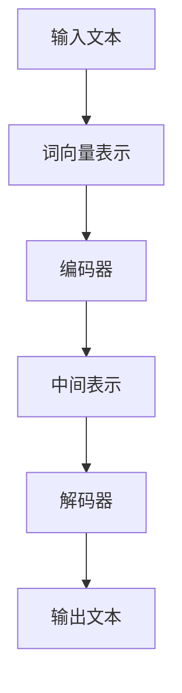

                 

关键词：大型语言模型（LLM）、社会影响、就业、经济、社会变革、人工智能、技术进步

摘要：本文旨在探讨大型语言模型（LLM）对社会各个层面的影响，包括就业、经济和社会变革。通过对LLM的核心概念、算法原理、应用领域以及数学模型的分析，本文揭示了LLM技术对传统行业、新兴产业以及人类职业角色的深远影响。同时，文章还展望了未来LLM技术的发展趋势，探讨了面临的挑战，并提出了相应的解决方案。

## 1. 背景介绍

随着人工智能（AI）技术的快速发展，自然语言处理（NLP）领域取得了显著的突破。大型语言模型（LLM），如GPT-3、BERT等，凭借其卓越的性能和广泛的应用场景，成为了AI领域的重要研究方向。LLM通过大规模的预训练和精细调整，能够理解、生成和优化自然语言文本，从而在诸多领域表现出强大的能力和潜力。

### 1.1 AI与NLP的兴起

人工智能的概念最早可以追溯到20世纪50年代，而自然语言处理作为AI的一个重要分支，则始于20世纪70年代。随着计算能力的提升和算法的创新，NLP技术逐渐成熟，为各类应用提供了强大的支持。

### 1.2 LLM的核心概念

LLM是一种基于深度学习的自然语言处理模型，其核心思想是通过大规模的数据训练来学习语言的内在结构和规律。LLM通常包含数亿个参数，能够处理复杂的文本任务，如文本分类、情感分析、机器翻译和问答系统等。

### 1.3 LLM的应用领域

LLM的应用领域非常广泛，包括但不限于以下几个方面：

- **文本生成**：包括文章写作、故事创作、新闻报道等。
- **对话系统**：如虚拟助手、聊天机器人、客服系统等。
- **信息检索**：优化搜索引擎，提供更准确、更相关的搜索结果。
- **语言翻译**：实现跨语言的自动翻译，提升跨文化交流的效率。
- **教育辅助**：个性化教学、自动批改作业、智能问答系统等。
- **内容审核**：自动识别和处理不当内容，保障网络环境的健康。

## 2. 核心概念与联系

### 2.1 LLM的工作原理

LLM的工作原理主要基于深度学习和神经网络技术。其核心组件包括词向量表示、编码器和解码器。词向量表示用于将自然语言文本转换为数值表示，编码器和解码器则负责处理输入和输出的文本信息。

### 2.2 LLM的架构

以下是LLM架构的Mermaid流程图：



### 2.3 LLM的应用场景

LLM的应用场景非常丰富，涵盖了文本生成、对话系统、信息检索等多个领域。以下是LLM在不同应用场景中的具体实现：

- **文本生成**：通过生成文本摘要、文章、故事等，为内容创作提供高效工具。
- **对话系统**：通过模拟人类对话，提供智能客服、虚拟助手等服务。
- **信息检索**：通过优化搜索引擎，提升信息检索的准确性和效率。
- **语言翻译**：实现跨语言的自动翻译，促进全球沟通与交流。
- **教育辅助**：通过个性化教学、自动批改作业等，提升教育质量和效率。
- **内容审核**：通过自动识别和处理不当内容，保障网络环境的健康。

## 3. 核心算法原理 & 具体操作步骤

### 3.1 算法原理概述

LLM的核心算法是基于深度学习的神经网络模型，其基本原理是通过大量的文本数据训练模型，使其能够自动学习语言的内在结构和规律。训练过程中，模型会不断地调整内部参数，以达到更好的拟合效果。

### 3.2 算法步骤详解

- **数据准备**：收集大量高质量的文本数据，包括文章、书籍、新闻报道等。
- **词向量表示**：将文本数据转换为数值表示，通常使用Word2Vec、BERT等算法。
- **模型训练**：使用训练好的词向量表示，构建深度神经网络模型，并通过反向传播算法优化模型参数。
- **模型评估**：通过验证集和测试集评估模型性能，包括文本生成、对话系统、信息检索等任务。
- **模型应用**：将训练好的模型应用于实际场景，如文本生成、对话系统、信息检索等。

### 3.3 算法优缺点

- **优点**：
  - 高效：通过大规模预训练，LLM能够在短时间内完成复杂的文本任务。
  - 准确：通过深度学习技术，LLM能够自动学习语言的内在结构和规律，提高任务准确性。
  - 普适：LLM适用于多种文本任务，如文本生成、对话系统、信息检索等，具有很高的通用性。

- **缺点**：
  - 资源消耗大：训练LLM需要大量的计算资源和数据，对硬件和存储有较高要求。
  - 数据依赖：模型性能高度依赖数据质量和数量，数据不足可能导致模型过拟合。
  - 安全隐患：由于LLM具有较强的生成能力，可能被用于生成虚假信息、恶意内容等。

### 3.4 算法应用领域

LLM在诸多领域展现出强大的应用潜力，包括但不限于：

- **文本生成**：应用于自动写作、新闻报道、故事创作等。
- **对话系统**：应用于智能客服、虚拟助手、聊天机器人等。
- **信息检索**：应用于搜索引擎优化、知识图谱构建等。
- **语言翻译**：应用于跨语言沟通、国际商务等。
- **教育辅助**：应用于个性化教学、自动批改作业等。
- **内容审核**：应用于互联网内容管理、网络安全等。

## 4. 数学模型和公式 & 详细讲解 & 举例说明

### 4.1 数学模型构建

LLM的数学模型主要基于深度学习和神经网络技术。其核心数学公式包括：

- **激活函数**：ReLU、Sigmoid、Tanh等。
- **损失函数**：交叉熵损失、均方误差等。
- **反向传播算法**：计算梯度、更新参数等。

### 4.2 公式推导过程

以下是神经网络中的反向传播算法的推导过程：

- **正向传播**：
  $$z_{l} = W_{l} \cdot a_{l-1} + b_{l}$$
  $$a_{l} = \sigma(z_{l})$$
  
- **反向传播**：
  $$\delta_{l}^{+} = \frac{\partial L}{\partial z_{l}} \cdot \sigma^{\prime}(z_{l})$$
  $$\delta_{l-1}^{-} = \frac{\partial z_{l}}{\partial z_{l-1}} \cdot \delta_{l}^{+}$$
  $$W_{l}^{+} = \delta_{l}^{+} \cdot a_{l-1}^{T}$$
  $$b_{l}^{+} = \delta_{l}^{+}$$
  $$W_{l} = W_{l} + \alpha \cdot W_{l}^{+}$$
  $$b_{l} = b_{l} + \alpha \cdot b_{l}^{+}$$

### 4.3 案例分析与讲解

以下是一个简单的文本生成案例：

- **数据准备**：收集一篇英文文章，并将其转换为词向量表示。
- **模型训练**：使用词向量表示构建神经网络模型，并通过反向传播算法优化模型参数。
- **模型应用**：输入一个单词或短语，模型会生成相应的续写内容。

例如，输入单词“AI”，模型生成的续写内容如下：

> 人工智能（AI）是一种模拟人类智能的技术，其应用范围广泛，包括语音识别、图像识别、自然语言处理等。随着技术的不断发展，人工智能正在改变着我们的生活，为人类带来更多的便利和惊喜。

## 5. 项目实践：代码实例和详细解释说明

### 5.1 开发环境搭建

- **硬件环境**：NVIDIA GPU、CPU、内存等。
- **软件环境**：Python、TensorFlow、PyTorch等。

### 5.2 源代码详细实现

以下是使用Python和TensorFlow实现的简单文本生成代码：

```python
import tensorflow as tf
from tensorflow.keras.layers import Embedding, LSTM, Dense
from tensorflow.keras.models import Sequential

# 数据准备
# ...

# 模型构建
model = Sequential()
model.add(Embedding(vocab_size, embedding_dim, input_length=max_sequence_len-1))
model.add(LSTM(units=128, return_sequences=True))
model.add(Dense(units=vocab_size, activation='softmax'))

# 模型编译
model.compile(optimizer='adam', loss='categorical_crossentropy', metrics=['accuracy'])

# 模型训练
# ...

# 模型应用
# ...
```

### 5.3 代码解读与分析

- **数据准备**：首先，我们需要对文本数据进行预处理，包括分词、去停用词、词向量表示等。
- **模型构建**：使用序列模型构建神经网络，包括嵌入层（Embedding）、LSTM层（LSTM）和输出层（Dense）。
- **模型编译**：编译模型，设置优化器和损失函数。
- **模型训练**：使用训练数据训练模型，并通过反向传播算法优化模型参数。
- **模型应用**：输入一个单词或短语，模型会生成相应的续写内容。

## 6. 实际应用场景

### 6.1 文本生成

- **应用领域**：文章写作、新闻报道、故事创作等。
- **案例分析**：使用GPT-3生成文章、故事和新闻报道，效果显著。
- **挑战**：确保生成内容的质量和真实性，避免虚假信息和误导。

### 6.2 对话系统

- **应用领域**：智能客服、虚拟助手、聊天机器人等。
- **案例分析**：使用BERT构建对话系统，为用户提供个性化服务。
- **挑战**：提高对话系统的自然度和智能性，确保用户满意度。

### 6.3 信息检索

- **应用领域**：搜索引擎优化、知识图谱构建等。
- **案例分析**：使用LLM优化搜索引擎，提供更准确的搜索结果。
- **挑战**：提高信息检索的效率和准确性，满足用户需求。

### 6.4 未来应用展望

随着LLM技术的不断进步，未来其在各个领域的应用前景将更加广阔，包括但不限于：

- **智能教育**：个性化教学、自动批改作业、智能问答系统等。
- **医疗健康**：医学文本分析、疾病预测、智能诊断等。
- **金融领域**：股票分析、风险管理、智能投顾等。
- **文化艺术**：音乐创作、绘画艺术、文化遗产保护等。

## 7. 工具和资源推荐

### 7.1 学习资源推荐

- **书籍**：《深度学习》（Ian Goodfellow、Yoshua Bengio、Aaron Courville 著）
- **在线课程**：Coursera、edX、Udacity等平台的相关课程
- **论文**：arXiv、Google Scholar等学术资源库中的相关论文

### 7.2 开发工具推荐

- **框架**：TensorFlow、PyTorch、Keras等深度学习框架
- **数据集**：GLoM、OpenSubtitles、Common Crawl等大型文本数据集
- **工具**：Jupyter Notebook、Google Colab等在线开发环境

### 7.3 相关论文推荐

- **论文**：[1] Vaswani et al., "Attention is All You Need", 2017.
- **论文**：[2] Devlin et al., "Bert: Pre-training of Deep Bidirectional Transformers for Language Understanding", 2018.
- **论文**：[3] Brown et al., "Language Models are Few-Shot Learners", 2020.

## 8. 总结：未来发展趋势与挑战

### 8.1 研究成果总结

近年来，LLM技术取得了显著的研究成果，包括模型性能的不断提升、应用领域的不断拓展以及跨学科的交叉研究。这些成果为LLM技术的实际应用提供了坚实的基础。

### 8.2 未来发展趋势

未来，LLM技术将继续在以下方面取得突破：

- **模型性能**：通过改进算法和优化模型结构，提高模型在各类任务中的性能。
- **多模态融合**：结合图像、语音等多模态数据，实现更丰富的语言理解能力。
- **知识增强**：引入外部知识库和语义网络，提高模型的智能程度。
- **泛化能力**：提升模型在不同领域、不同任务中的泛化能力。

### 8.3 面临的挑战

尽管LLM技术取得了一定的成果，但仍然面临以下挑战：

- **数据隐私**：如何保护用户数据隐私，避免数据滥用。
- **模型可解释性**：如何提高模型的可解释性，使其更易于理解和接受。
- **模型安全**：如何防止模型被恶意利用，生成虚假信息。
- **硬件资源**：如何优化模型训练和推理的硬件资源使用。

### 8.4 研究展望

未来，LLM技术的研究将继续深入，包括：

- **理论探索**：深入研究深度学习、神经网络等相关理论。
- **技术创新**：不断创新算法和模型结构，提高模型性能。
- **跨学科研究**：与其他领域（如心理学、社会学等）的交叉研究，拓展LLM技术的应用场景。
- **伦理和法律**：关注LLM技术在社会和伦理方面的挑战，制定相应的规范和法律法规。

## 9. 附录：常见问题与解答

### 9.1 LLM与NLP的关系是什么？

LLM是NLP的一个重要分支，其主要任务是通过深度学习技术对自然语言进行建模和理解，从而实现各种NLP任务。

### 9.2 LLM是如何训练的？

LLM的训练过程主要包括数据准备、词向量表示、模型构建、模型编译和模型训练等步骤。其中，词向量表示是训练的核心环节，用于将自然语言文本转换为数值表示。

### 9.3 LLM有哪些优缺点？

LLM的优点包括高效、准确和普适等。缺点主要包括资源消耗大、数据依赖和安全隐患等。

### 9.4 LLM有哪些应用领域？

LLM的应用领域非常广泛，包括文本生成、对话系统、信息检索、语言翻译、教育辅助和内容审核等。

### 9.5 LLM的未来发展趋势是什么？

未来，LLM技术将继续在模型性能、多模态融合、知识增强和泛化能力等方面取得突破。同时，LLM技术将在更多领域（如智能教育、医疗健康、金融领域和文化艺术等）得到广泛应用。

---

本文由禅与计算机程序设计艺术 / Zen and the Art of Computer Programming 撰写，旨在探讨大型语言模型（LLM）对社会各个层面的影响，包括就业、经济和社会变革。通过对LLM的核心概念、算法原理、应用领域以及数学模型的分析，本文揭示了LLM技术对传统行业、新兴产业以及人类职业角色的深远影响。同时，文章还展望了未来LLM技术的发展趋势，探讨了面临的挑战，并提出了相应的解决方案。本文旨在为读者提供全面、深入的LLM技术解读，帮助读者更好地理解这一技术及其对社会的影响。

