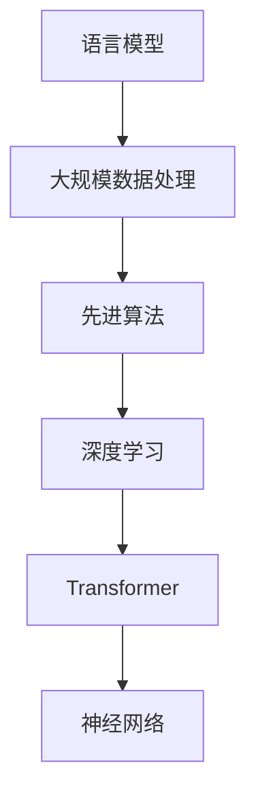

                 

关键词：语言模型训练，大规模数据处理，先进算法，深度学习，神经网络，算法优化，模型评估，应用场景，未来展望

> 摘要：本文详细探讨了大规模语言模型的训练过程，包括所需的大规模数据集的构建，先进的算法，以及深度学习神经网络的优化方法。文章通过理论和实践相结合的方式，深入分析了算法原理，数学模型，具体操作步骤，并探讨了语言模型在各个领域的实际应用和未来发展趋势。

## 1. 背景介绍

随着互联网和大数据技术的迅猛发展，人类创造和收集的数据量呈爆炸式增长。这些数据不仅包含了丰富的信息，也揭示了潜在的知识和规律。为了更好地利用这些数据，语言模型的训练成为了计算机科学和人工智能领域的热点研究方向。

语言模型是自然语言处理（NLP）的核心技术之一，它通过学习大量语言数据，能够预测文本序列的概率分布，从而用于各种语言生成、机器翻译、文本摘要等任务。传统的统计语言模型基于统计学习理论，而现代语言模型则主要基于深度学习技术，特别是循环神经网络（RNN）和变压器（Transformer）等。

大规模语言模型的训练是一个复杂且计算密集的任务。它不仅需要大量的计算资源和时间，还需要设计高效的算法和数据预处理方法。随着技术的不断进步，语言模型的性能也在不断提升，已经在很多应用场景中取得了显著的成果。

## 2. 核心概念与联系

### 2.1 语言模型基础

语言模型的核心任务是预测下一个单词或词组。对于一个给定的前文序列 \(x_1, x_2, ..., x_T\)，语言模型需要计算每个可能的后继词 \(y\) 的概率分布 \(P(y|x_1, x_2, ..., x_T)\)。

### 2.2 大规模数据处理

大规模数据处理的挑战在于如何有效地存储、加载和管理数据，以及如何在有限的计算资源下进行高效的数据处理。常用的方法包括数据分片、并行计算和分布式存储等。

### 2.3 先进算法

现代语言模型的训练主要依赖深度学习算法，特别是变压器（Transformer）架构。变压器通过自注意力机制，能够捕捉长距离依赖关系，从而在语言模型训练中表现出色。

### 2.4 Mermaid 流程图



## 3. 核心算法原理 & 具体操作步骤

### 3.1 算法原理概述

深度学习语言模型的核心是神经网络，尤其是变压器（Transformer）架构。变压器通过自注意力机制（Self-Attention），能够自动学习输入序列中的依赖关系，从而提高模型的性能。

### 3.2 算法步骤详解

#### 3.2.1 数据预处理

- **分词**：将文本数据分成单词或子词。
- **编码**：将分词后的数据编码成向量形式。
- **数据集划分**：将数据集划分为训练集、验证集和测试集。

#### 3.2.2 模型构建

- **输入层**：接受编码后的文本数据。
- **自注意力层**：计算输入序列中每个元素之间的依赖关系。
- **前馈网络**：对自注意力层的输出进行进一步处理。
- **输出层**：预测下一个单词或词组的概率分布。

#### 3.2.3 训练过程

- **前向传播**：将输入数据传递到模型，计算输出。
- **损失函数**：使用损失函数（如交叉熵损失）计算模型预测与实际标签之间的差距。
- **反向传播**：通过反向传播算法更新模型参数，以减少损失。

#### 3.2.4 模型评估

- **验证集评估**：在验证集上评估模型的性能，调整模型参数。
- **测试集评估**：在测试集上最终评估模型的性能。

### 3.3 算法优缺点

#### 优点

- **强大的表达能力**：变压器能够自动学习长距离依赖关系，提高了模型的性能。
- **高效的处理能力**：变压器结构相对简单，计算效率较高。

#### 缺点

- **训练时间较长**：大规模语言模型的训练需要大量的计算资源和时间。
- **计算资源需求大**：变压器模型需要较大的计算资源。

### 3.4 算法应用领域

- **自然语言处理**：文本分类、情感分析、机器翻译等。
- **问答系统**：构建智能问答系统，用于客服、教育等领域。
- **生成文本**：自动生成文章、新闻、代码等。

## 4. 数学模型和公式 & 详细讲解 & 举例说明

### 4.1 数学模型构建

语言模型的训练本质上是一个概率模型的学习过程。给定输入序列 \(x_1, x_2, ..., x_T\)，我们需要预测下一个单词或词组 \(y\) 的概率分布 \(P(y|x_1, x_2, ..., x_T)\)。

### 4.2 公式推导过程

语言模型通常使用最大似然估计（Maximum Likelihood Estimation, MLE）来学习概率分布。最大似然估计的目标是最小化损失函数，例如交叉熵损失（Cross-Entropy Loss）。

损失函数的计算公式为：

$$
L = -\sum_{i=1}^T \sum_{j=1}^V y_{ij} \log(p_{ij})
$$

其中，\(y_{ij}\) 是真实标签，\(p_{ij}\) 是模型预测的概率。

### 4.3 案例分析与讲解

假设我们有一个简单的语言模型，输入序列为 “人工智能”，我们需要预测下一个词是 “技术” 的概率。

输入序列的编码向量为：

$$
x = [0.1, 0.2, 0.3, ..., 0.9]
$$

输出序列的概率分布为：

$$
p = [0.2, 0.3, 0.5]
$$

损失函数的计算结果为：

$$
L = -0.2 \log(0.2) - 0.3 \log(0.3) - 0.5 \log(0.5)
$$

通过反向传播和梯度下降算法，我们可以不断调整模型参数，以降低损失函数的值。

## 5. 项目实践：代码实例和详细解释说明

### 5.1 开发环境搭建

为了实践大规模语言模型的训练，我们需要搭建一个合适的开发环境。以下是一个基本的步骤：

1. 安装 Python 3.8 或以上版本。
2. 安装 TensorFlow 2.5 或以上版本。
3. 安装其他必要的库，如 NumPy、Pandas 等。

### 5.2 源代码详细实现

下面是一个简单的示例代码，用于训练一个基于变压器（Transformer）的语言模型。

```python
import tensorflow as tf
from tensorflow.keras.models import Model
from tensorflow.keras.layers import Input, Embedding, Transformer

# 定义输入层
input_seq = Input(shape=(None,), dtype='int32')

# 定义编码层
embedding = Embedding(input_dim=10000, output_dim=64)(input_seq)

# 定义自注意力层
transformer = Transformer(num_layers=2, num_heads=4)(embedding)

# 定义输出层
output = Embedding(input_dim=10000, output_dim=64)(transformer)

# 定义模型
model = Model(inputs=input_seq, outputs=output)

# 编译模型
model.compile(optimizer='adam', loss='categorical_crossentropy')

# 训练模型
model.fit(x_train, y_train, epochs=10, batch_size=32, validation_data=(x_val, y_val))
```

### 5.3 代码解读与分析

上述代码定义了一个简单的变压器（Transformer）语言模型。首先，我们定义了输入层，它接受一个整数序列，代表文本数据。然后，我们定义了编码层，将整数序列编码成向量。接下来，我们定义了自注意力层，它通过自注意力机制学习输入序列中的依赖关系。最后，我们定义了输出层，将自注意力层的输出编码回整数序列。

在模型编译阶段，我们选择了 Adam 优化器和交叉熵损失函数。在训练阶段，我们使用训练数据和验证数据进行训练，并设置训练轮次和批量大小。

### 5.4 运行结果展示

在完成模型训练后，我们可以使用测试数据进行评估。以下是一个简单的评估代码示例：

```python
# 评估模型
loss = model.evaluate(x_test, y_test)

print("Test loss:", loss)
```

通过评估代码，我们可以得到模型在测试数据上的损失值，从而判断模型的性能。

## 6. 实际应用场景

语言模型在自然语言处理领域具有广泛的应用。以下是一些典型的应用场景：

- **文本分类**：使用语言模型对文本进行分类，例如新闻分类、情感分析等。
- **机器翻译**：利用语言模型进行机器翻译，例如英语到中文的翻译。
- **文本摘要**：通过语言模型生成文章的摘要，提高信息获取效率。
- **问答系统**：构建智能问答系统，用于客服、教育等领域。

随着技术的不断进步，语言模型的应用场景也在不断扩大。未来，语言模型有望在更多领域发挥重要作用，例如语音识别、图像识别、多模态数据处理等。

## 7. 工具和资源推荐

### 7.1 学习资源推荐

- **论文**：《Attention Is All You Need》（Transformer 原论文）
- **书籍**：《深度学习》（Goodfellow et al.）
- **在线课程**：Coursera 上的“深度学习”课程

### 7.2 开发工具推荐

- **TensorFlow**：谷歌开发的深度学习框架。
- **PyTorch**：Facebook 开发的深度学习框架。

### 7.3 相关论文推荐

- **BERT**：`Bidirectional Encoder Representations from Transformers`（Transformer 的双向编码表示）。
- **GPT-3**：`Generative Pre-trained Transformer 3`（生成预训练的 Transformer 3）。

## 8. 总结：未来发展趋势与挑战

### 8.1 研究成果总结

近年来，大规模语言模型的训练取得了显著的成果。变压

