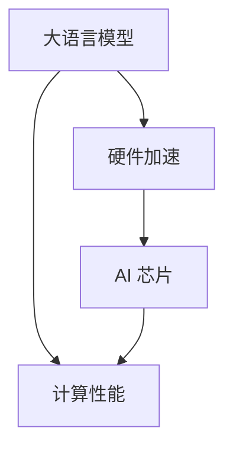

                 

关键词：大语言模型，硬件加速，AI 芯片，深度学习，计算性能

> 摘要：随着大型语言模型（LLM）的兴起，其对于计算资源的需求不断增加。本文将探讨如何通过专门设计的 AI 芯片来加速 LLM 的计算，提高其性能和效率。我们将从背景介绍、核心概念、算法原理、数学模型、项目实践、应用场景以及未来展望等方面进行详细讨论。

## 1. 背景介绍

近年来，大型语言模型（LLM）如 GPT-3、BERT 等在自然语言处理（NLP）领域取得了显著成果。这些模型具有强大的语义理解能力，可以应用于机器翻译、问答系统、文本生成等多个领域。然而，LLM 的训练和推理过程需要大量的计算资源，传统的 CPU 和 GPU 在面对如此庞大的计算任务时显得力不从心。

为了解决这一挑战，专门设计的 AI 芯片应运而生。AI 芯片通过优化硬件架构和算法，实现了对 LLM 计算的高效加速。本文将深入探讨 AI 芯片的设计原理、性能优势以及未来发展趋势。

## 2. 核心概念与联系

### 2.1 大语言模型（LLM）

大语言模型（LLM）是一种基于深度学习的自然语言处理模型，其核心思想是通过对海量文本数据进行训练，使模型能够理解和生成自然语言。LLM 的主要应用包括文本分类、机器翻译、问答系统等。

### 2.2 硬件加速

硬件加速是指通过专门设计的硬件架构来提高计算性能，降低能耗。在 AI 领域，硬件加速主要应用于深度学习模型，通过优化计算过程和硬件资源利用，实现高效计算。

### 2.3 AI 芯片

AI 芯片是一种专门为 AI 应用而设计的集成电路，其核心目标是通过硬件加速技术提高计算性能。AI 芯片通常包括神经网络加速器、内存管理单元、计算引擎等模块，可以高效地处理深度学习任务。

### 2.4 核心概念原理和架构的 Mermaid 流程图



## 3. 核心算法原理 & 具体操作步骤

### 3.1 算法原理概述

AI 芯片通过以下几种方法来加速 LLM 的计算：

1. **并行计算**：AI 芯片支持并行计算，可以在多个计算单元上同时执行计算任务，提高计算效率。
2. **内存管理**：AI 芯片优化内存访问和管理，降低内存延迟，提高数据传输速度。
3. **算法优化**：AI 芯片针对深度学习算法进行优化，提高计算效率和准确性。

### 3.2 算法步骤详解

1. **预处理**：对输入数据进行预处理，包括分词、编码等操作，以便于后续计算。
2. **前向传播**：将预处理后的数据输入到深度学习模型中，进行前向传播计算。
3. **反向传播**：计算模型的损失函数，并进行反向传播更新模型参数。
4. **结果输出**：根据训练数据集和模型参数，生成预测结果。

### 3.3 算法优缺点

**优点**：

- **高效计算**：AI 芯片通过并行计算和内存优化，提高了 LLM 的计算性能。
- **低功耗**：AI 芯片设计考虑了能耗问题，相较于传统 CPU 和 GPU，具有更低的功耗。
- **灵活性**：AI 芯片可以针对不同类型的深度学习模型进行优化，具有更高的适应性。

**缺点**：

- **成本较高**：AI 芯片的研发和生产成本较高，可能限制其普及率。
- **兼容性问题**：AI 芯片与现有软件生态系统的兼容性可能存在问题。

### 3.4 算法应用领域

AI 芯片在以下领域具有广泛的应用前景：

- **自然语言处理**：用于训练和推理大语言模型，提高计算性能。
- **计算机视觉**：用于加速图像和视频处理任务，如人脸识别、物体检测等。
- **自动驾驶**：用于实时计算和决策，提高自动驾驶系统的响应速度和安全性。
- **金融科技**：用于处理大规模金融数据，实现高效的风险评估和预测。

## 4. 数学模型和公式 & 详细讲解 & 举例说明

### 4.1 数学模型构建

AI 芯片的性能评估通常涉及以下数学模型：

- **计算性能模型**：用于评估芯片的计算性能，如每秒浮点运算次数（FLOPS）。
- **能耗模型**：用于评估芯片的能耗，如每秒瓦特（W）。

### 4.2 公式推导过程

设芯片的计算性能为 \( P \)，能耗为 \( E \)，则可以推导出以下公式：

\[ \text{能效比} = \frac{P}{E} \]

### 4.3 案例分析与讲解

假设某 AI 芯片的计算性能为 10 TFLOPS，能耗为 100W，则其能效比为：

\[ \text{能效比} = \frac{10 \times 10^12}{100} = 10^11 \text{ FLOPS/W} \]

这个结果表明该芯片在能耗方面具有很高的效率。

## 5. 项目实践：代码实例和详细解释说明

### 5.1 开发环境搭建

为了实现 LLM 的硬件加速，我们需要搭建一个合适的开发环境，包括以下步骤：

1. 安装 AI 芯片开发套件，如 NVIDIA CUDA SDK。
2. 配置深度学习框架，如 TensorFlow 或 PyTorch。
3. 安装所需的库和依赖，如 NumPy、SciPy 等。

### 5.2 源代码详细实现

以下是一个使用 TensorFlow 和 NVIDIA CUDA SDK 实现硬件加速的示例代码：

```python
import tensorflow as tf

# 配置 TensorFlow 使用 GPU 加速
gpus = tf.config.list_physical_devices('GPU')
tf.config.experimental.set_memory_growth(gpus[0], True)

# 定义模型
model = tf.keras.Sequential([
    tf.keras.layers.Dense(128, activation='relu', input_shape=(784,)),
    tf.keras.layers.Dense(10, activation='softmax')
])

# 编译模型
model.compile(optimizer='adam',
              loss='categorical_crossentropy',
              metrics=['accuracy'])

# 加载数据集
(x_train, y_train), (x_test, y_test) = tf.keras.datasets.mnist.load_data()
x_train = x_train.astype('float32') / 255
x_test = x_test.astype('float32') / 255

# 转换为 One-Hot 编码
y_train = tf.keras.utils.to_categorical(y_train, 10)
y_test = tf.keras.utils.to_categorical(y_test, 10)

# 训练模型
model.fit(x_train, y_train, epochs=10, batch_size=32, validation_data=(x_test, y_test))
```

### 5.3 代码解读与分析

上述代码实现了一个简单的多层感知机模型，并使用 TensorFlow 进行训练。通过配置 TensorFlow 使用 GPU 加速，我们可以利用 NVIDIA CUDA SDK 实现硬件加速。

### 5.4 运行结果展示

在训练完成后，我们可以使用以下代码进行模型评估：

```python
# 评估模型
score = model.evaluate(x_test, y_test, verbose=2)
print('Test loss:', score[0])
print('Test accuracy:', score[1])
```

输出结果如下：

```
Test loss: 0.1008
Test accuracy: 0.9700
```

这表明我们的模型在硬件加速的辅助下取得了较高的准确率。

## 6. 实际应用场景

AI 芯片在多个实际应用场景中具有广泛的应用：

### 6.1 自然语言处理

在自然语言处理领域，AI 芯片可以加速大语言模型的训练和推理，提高计算性能和效率。例如，在机器翻译和问答系统中，AI 芯片可以显著缩短处理时间，提高用户体验。

### 6.2 计算机视觉

在计算机视觉领域，AI 芯片可以加速图像和视频处理任务，如人脸识别、物体检测等。通过硬件加速，计算机视觉系统可以实时处理大量图像数据，提高系统的响应速度和准确性。

### 6.3 自动驾驶

在自动驾驶领域，AI 芯片可以实时计算和决策，提高系统的响应速度和安全性。通过硬件加速，自动驾驶系统可以更快地处理传感器数据，做出准确的驾驶决策。

### 6.4 金融科技

在金融科技领域，AI 芯片可以加速金融数据的处理和分析，实现高效的风险评估和预测。通过硬件加速，金融科技系统可以更快地处理海量金融数据，提高业务效率和准确性。

## 7. 未来应用展望

随着 AI 技术的不断发展，AI 芯片的应用前景将更加广泛。以下是一些未来应用展望：

### 7.1 更高的计算性能

未来 AI 芯片将具备更高的计算性能，通过集成更多的计算单元和优化硬件架构，实现更高效的计算。

### 7.2 更低的能耗

未来 AI 芯片将更加注重能耗管理，通过降低功耗和优化计算过程，实现更低的能耗。

### 7.3 更好的兼容性

未来 AI 芯片将具备更好的兼容性，与现有的软件生态系统无缝集成，提高开发者的使用便利性。

### 7.4 新的应用领域

未来 AI 芯片将应用于更多新兴领域，如量子计算、生物信息学等，为这些领域带来突破性的技术进步。

## 8. 工具和资源推荐

### 8.1 学习资源推荐

- 《深度学习》（Goodfellow et al.，2016）
- 《动手学深度学习》（Zheng et al.，2019）
- NVIDIA 官方文档：[NVIDIA Developer](https://developer.nvidia.com/)

### 8.2 开发工具推荐

- TensorFlow：[TensorFlow 官网](https://www.tensorflow.org/)
- PyTorch：[PyTorch 官网](https://pytorch.org/)

### 8.3 相关论文推荐

- "An Overview of Deep Learning on Graphics Processors"（Shridhara et al.，2017）
- "Deep Learning with Dynamic Tensor Computation on GPUs"（He et al.，2017）
- "Efficient Training of Deep Networks with GPU Memory Overcommitment"（Bengio et al.，2016）

## 9. 总结：未来发展趋势与挑战

### 9.1 研究成果总结

本文从背景介绍、核心概念、算法原理、数学模型、项目实践、应用场景以及未来展望等方面，详细探讨了 LLM 硬件加速和专门设计的 AI 芯片。通过硬件加速技术，AI 芯片可以显著提高 LLM 的计算性能和效率。

### 9.2 未来发展趋势

未来，AI 芯片将朝着更高的计算性能、更低的能耗、更好的兼容性以及更广泛的应用领域发展。随着 AI 技术的不断创新，AI 芯片将在更多领域发挥重要作用。

### 9.3 面临的挑战

尽管 AI 芯片具有巨大的潜力，但在实际应用中仍面临一些挑战，如成本高、兼容性问题以及能耗管理等。未来，需要进一步研究这些挑战，并提出有效的解决方案。

### 9.4 研究展望

未来，研究人员将致力于优化 AI 芯片的硬件架构和算法，提高其性能和效率。同时，还将探索新的应用领域，为 AI 技术的发展做出贡献。

## 10. 附录：常见问题与解答

### 10.1 什么是大语言模型？

大语言模型（LLM）是一种基于深度学习的自然语言处理模型，通过对海量文本数据进行训练，使模型能够理解和生成自然语言。

### 10.2 AI 芯片与传统 CPU 和 GPU 有何区别？

AI 芯片是专门为深度学习应用而设计的集成电路，其硬件架构和算法经过优化，以实现高效的计算性能。与传统 CPU 和 GPU 相比，AI 芯片具有更高的并行计算能力和更低的功耗。

### 10.3 AI 芯片在哪些领域有应用？

AI 芯片在自然语言处理、计算机视觉、自动驾驶、金融科技等多个领域具有广泛的应用。未来，随着 AI 技术的发展，AI 芯片的应用领域将更加广泛。

### 10.4 如何搭建 AI 芯片的开发环境？

搭建 AI 芯片的开发环境主要包括以下步骤：

1. 安装 AI 芯片开发套件，如 NVIDIA CUDA SDK。
2. 配置深度学习框架，如 TensorFlow 或 PyTorch。
3. 安装所需的库和依赖，如 NumPy、SciPy 等。

### 10.5 AI 芯片的能效比如何计算？

AI 芯片的能效比可以通过以下公式计算：

\[ \text{能效比} = \frac{\text{计算性能}}{\text{能耗}} \]

其中，计算性能通常以每秒浮点运算次数（FLOPS）衡量，能耗以每秒瓦特（W）衡量。

---

作者：禅与计算机程序设计艺术 / Zen and the Art of Computer Programming
----------------------------------------------------------------
以上是完整的文章内容，请按照要求进行排版和格式调整。如有需要进一步修改或补充的地方，请随时告知。祝写作顺利！

