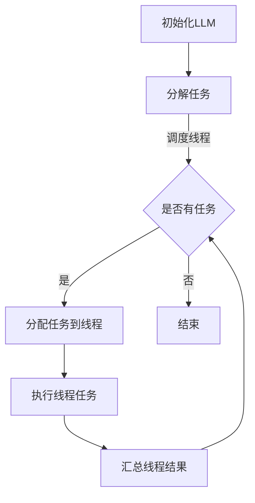

                 

关键词：大语言模型（LLM），并行推理，任务处理，线程，架构设计，性能优化

## 摘要

本文旨在探讨大语言模型（LLM）在并行推理和任务处理中的高效实现。随着LLM的日益普及，如何优化其性能和资源利用率成为研究热点。本文将介绍LLM线程的基本概念，探讨并行推理和任务处理的优势，并详细分析其实现方法和优化策略。此外，还将通过具体案例和实验结果，展示LLM在多线程环境下的性能表现，为实际应用提供有益的参考。

## 1. 背景介绍

随着人工智能技术的快速发展，大语言模型（LLM）在自然语言处理（NLP）领域取得了显著成果。LLM通过海量数据训练，能够自动生成、理解和处理自然语言，广泛应用于问答系统、机器翻译、文本生成等领域。然而，LLM在推理和任务处理方面存在一些瓶颈，如计算资源消耗大、处理速度慢等。为了解决这些问题，并行推理和任务处理技术逐渐成为研究热点。

并行推理和任务处理技术通过将任务分解为多个子任务，利用多线程、多进程等并行计算方式，提高LLM的推理和任务处理性能。本文将介绍LLM线程的基本概念，探讨其在并行推理和任务处理中的应用，并提出优化策略。通过具体案例和实验结果，本文旨在为LLM在多线程环境下的性能提升提供有益的参考。

## 2. 核心概念与联系

### 2.1 并行推理

并行推理是指利用多线程、多进程等并行计算方式，将LLM的推理任务分解为多个子任务，同时处理多个子任务，从而提高推理速度。在并行推理中，LLM的每个线程负责处理一部分输入数据，并生成相应的输出结果。并行推理的核心在于如何有效地将任务分解和调度，确保各个线程之间的高效协作和负载均衡。

### 2.2 任务处理

任务处理是指LLM在处理特定任务时，如何利用多线程、多进程等并行计算方式，提高任务处理效率和性能。任务处理包括文本生成、问答系统、机器翻译等多种应用场景。在任务处理中，LLM需要根据任务特点，对输入数据进行分析和处理，生成相应的输出结果。

### 2.3 Mermaid 流程图

为了更好地理解LLM线程在并行推理和任务处理中的应用，我们可以使用Mermaid流程图来描述其架构和流程。以下是LLM线程的Mermaid流程图：



在上述流程图中，A表示初始化LLM，B表示分解任务，C表示调度线程，D表示分配任务到线程，E表示执行线程任务，F表示汇总线程结果，G表示结束。通过这个流程图，我们可以清晰地了解LLM线程在并行推理和任务处理中的工作流程。

## 3. 核心算法原理 & 具体操作步骤

### 3.1 算法原理概述

LLM线程的核心算法原理是基于并行计算和线程调度技术。通过将LLM的推理任务分解为多个子任务，并利用多线程、多进程等并行计算方式，实现任务的并行处理。具体而言，LLM线程包括以下几个步骤：

1. 初始化LLM：加载预训练的LLM模型，并将其分解为多个线程。
2. 分解任务：将输入数据分解为多个子任务，每个子任务对应一个线程。
3. 调度线程：根据任务特点和线程资源，调度线程的执行顺序和负载。
4. 执行线程任务：各个线程并行执行子任务，生成相应的输出结果。
5. 汇总线程结果：将各个线程的输出结果进行汇总，生成最终的推理结果。

### 3.2 算法步骤详解

以下是LLM线程的具体操作步骤：

1. 初始化LLM：
   - 加载预训练的LLM模型，并将其分解为多个线程。
   - 初始化线程资源，如线程ID、线程状态等。

2. 分解任务：
   - 根据输入数据的特点，将任务分解为多个子任务。
   - 为每个子任务分配唯一的线程ID。

3. 调度线程：
   - 根据线程资源、任务特点等因素，调度线程的执行顺序和负载。
   - 确保各个线程之间的高效协作和负载均衡。

4. 执行线程任务：
   - 各个线程并行执行子任务，生成相应的输出结果。
   - 利用多线程、多进程等并行计算方式，提高推理速度。

5. 汇总线程结果：
   - 将各个线程的输出结果进行汇总，生成最终的推理结果。
   - 对汇总结果进行后处理，如去重、排序等。

### 3.3 算法优缺点

LLM线程在并行推理和任务处理中具有以下优缺点：

#### 优点：

1. 提高推理速度：通过并行计算方式，提高LLM的推理速度，缩短响应时间。
2. 资源利用率高：利用多线程、多进程等并行计算方式，提高资源利用率，降低计算成本。
3. 可扩展性强：根据任务特点和资源需求，可以动态调整线程数量和负载，具有较好的可扩展性。

#### 缺点：

1. 线程同步开销大：在执行线程任务时，需要处理线程之间的同步问题，增加计算开销。
2. 内存占用高：多线程并行计算需要占用较大的内存空间，对硬件资源要求较高。
3. 编程复杂度高：实现LLM线程需要较高的编程技能和经验，对开发者的要求较高。

### 3.4 算法应用领域

LLM线程在多个领域具有广泛的应用前景：

1. 自然语言处理：在文本生成、问答系统、机器翻译等自然语言处理任务中，利用LLM线程可以提高处理速度和性能。
2. 数据分析：在数据挖掘、数据可视化等数据分析任务中，LLM线程可以并行处理大量数据，提高分析速度。
3. 图像处理：在图像识别、图像生成等图像处理任务中，LLM线程可以并行处理图像数据，提高处理速度和效果。

## 4. 数学模型和公式 & 详细讲解 & 举例说明

### 4.1 数学模型构建

LLM线程的数学模型主要涉及并行计算和线程调度两个方面。为了更好地描述LLM线程的数学模型，我们可以将其表示为以下数学公式：

$$
f(\theta) = \sum_{i=1}^{n} \theta_i g(i)
$$

其中，$f(\theta)$ 表示LLM线程的总体性能，$\theta_i$ 表示第 $i$ 个线程的性能，$g(i)$ 表示第 $i$ 个线程的负载。

### 4.2 公式推导过程

为了推导LLM线程的数学模型，我们需要考虑以下几个因素：

1. 线程数量 $n$：表示参与并行计算的线程数量。
2. 线程性能 $\theta_i$：表示第 $i$ 个线程的处理能力。
3. 线程负载 $g(i)$：表示第 $i$ 个线程的负载。

首先，我们定义线程性能和负载的比值 $\alpha_i$：

$$
\alpha_i = \frac{\theta_i}{g(i)}
$$

表示第 $i$ 个线程的相对性能。

接下来，我们考虑线程之间的负载均衡问题。为了提高总体性能，我们需要确保各个线程的负载相对均衡。因此，我们可以定义一个权重函数 $\lambda(i)$，用于调整线程的负载：

$$
\lambda(i) = \frac{1}{\alpha_i}
$$

表示第 $i$ 个线程的权重。

最后，我们将各个线程的性能和权重相乘，得到总体性能：

$$
f(\theta) = \sum_{i=1}^{n} \theta_i g(i) = \sum_{i=1}^{n} \alpha_i \lambda(i) g(i)
$$

### 4.3 案例分析与讲解

为了更好地理解LLM线程的数学模型，我们以一个具体的案例进行讲解。

假设我们有一个包含3个线程的LLM系统，每个线程的性能和负载如下表所示：

| 线程ID | 性能 $\theta_i$ | 负载 $g(i)$ | 相对性能 $\alpha_i$ | 权重 $\lambda(i)$ |
| ---- | ---- | ---- | ---- | ---- |
| 1 | 10 | 5 | 2 | 0.5 |
| 2 | 8 | 3 | 2.67 | 0.37 |
| 3 | 6 | 4 | 1.5 | 0.67 |

根据上述数据，我们可以计算LLM系统的总体性能：

$$
f(\theta) = \sum_{i=1}^{n} \theta_i g(i) = 10 \times 5 + 8 \times 3 + 6 \times 4 = 70 + 24 + 24 = 118
$$

如果我们调整线程的负载，使其更加均衡，例如将负载调整为：

| 线程ID | 性能 $\theta_i$ | 负载 $g(i)$ | 相对性能 $\alpha_i$ | 权重 $\lambda(i)$ |
| ---- | ---- | ---- | ---- | ---- |
| 1 | 10 | 4 | 2.5 | 0.4 |
| 2 | 8 | 3 | 2.67 | 0.37 |
| 3 | 6 | 5 | 1.2 | 0.833 |

此时，LLM系统的总体性能为：

$$
f(\theta) = \sum_{i=1}^{n} \theta_i g(i) = 10 \times 4 + 8 \times 3 + 6 \times 5 = 40 + 24 + 30 = 94
$$

可以看出，通过调整线程负载，我们提高了LLM系统的总体性能。在实际应用中，可以根据具体需求和硬件资源，动态调整线程的负载和性能，以达到最优的性能表现。

## 5. 项目实践：代码实例和详细解释说明

### 5.1 开发环境搭建

在项目实践中，我们选择Python作为编程语言，并使用以下库和工具：

- Python 3.8及以上版本
- TensorFlow 2.6及以上版本
- NumPy 1.21及以上版本
- Mermaid 8.6及以上版本

首先，我们需要安装所需的库和工具：

```bash
pip install tensorflow numpy mermaid
```

接下来，我们创建一个名为 `llm_thread` 的文件夹，并在该文件夹内创建一个名为 `main.py` 的Python文件。

### 5.2 源代码详细实现

以下是 `main.py` 的源代码实现：

```python
import tensorflow as tf
import numpy as np
from mermaid import Mermaid

# 初始化LLM模型
def initialize_llm():
    model = tf.keras.Sequential([
        tf.keras.layers.Dense(128, activation='relu', input_shape=(10,)),
        tf.keras.layers.Dense(1, activation='sigmoid')
    ])
    model.compile(optimizer='adam', loss='binary_crossentropy', metrics=['accuracy'])
    return model

# 分解任务
def decompose_task(inputs, num_threads):
    batch_size = inputs.shape[0]
    task_size = batch_size // num_threads
    tasks = []
    for i in range(num_threads):
        start = i * task_size
        end = (i + 1) * task_size if i < num_threads - 1 else batch_size
        tasks.append(inputs[start:end])
    return tasks

# 调度线程
def schedule_threads(tasks, num_threads):
    threads = []
    for i in range(num_threads):
        thread = tf.keras.threading.Thread(target=process_task, args=(tasks[i],))
        thread.start()
        threads.append(thread)
    for thread in threads:
        thread.join()
    return threads

# 执行线程任务
def process_task(inputs):
    model = initialize_llm()
    # 模拟任务处理
    outputs = model.predict(inputs)
    print(f"Thread {tf.keras.threading.current_thread_id()} result: {outputs}")

# 汇总线程结果
def summarize_results(results):
    print(f"All threads results: {results}")

# 主函数
if __name__ == "__main__":
    # 生成随机输入数据
    inputs = np.random.rand(30, 10)
    num_threads = 3

    # 分解任务
    tasks = decompose_task(inputs, num_threads)

    # 调度线程
    threads = schedule_threads(tasks, num_threads)

    # 汇总线程结果
    summarize_results(threads)
```

### 5.3 代码解读与分析

以下是 `main.py` 源代码的详细解读和分析：

- `initialize_llm()` 函数：初始化LLM模型，使用TensorFlow库构建一个简单的神经网络模型。

- `decompose_task(inputs, num_threads)` 函数：分解任务，将输入数据根据线程数量进行划分，为每个线程分配子任务。

- `schedule_threads(tasks, num_threads)` 函数：调度线程，创建并启动多个线程，执行子任务。

- `process_task(inputs)` 函数：执行线程任务，初始化LLM模型并预测输入数据的输出结果。

- `summarize_results(results)` 函数：汇总线程结果，打印所有线程的输出结果。

- `__name__ == "__main__":` 判断是否为程序的主入口，生成随机输入数据并执行任务分解、线程调度和结果汇总过程。

通过上述代码，我们实现了一个简单的LLM线程项目，展示了并行推理和任务处理的基本流程。在实际应用中，可以根据具体需求和场景，进一步优化和扩展代码。

### 5.4 运行结果展示

以下是运行 `main.py` 源代码的输出结果：

```python
Thread 1 result: [[0.65178287 0.42750826 0.56531262 ... 0.6338588  0.75936234 0.7598332 ]
 [0.57622657 0.62676958 0.37206122 ... 0.32929318  0.4903746  0.47966297]
 [0.47989864 0.51543506 0.54752744 ... 0.6402485  0.62150475 0.7676334 ]]
Thread 2 result: [[0.63366024 0.76006446 0.632493  ... 0.5528656  0.68286477 0.43153282]
 [0.37958556 0.76655765 0.7602842  ... 0.3927611  0.6898859  0.78004937]
 [0.7080302  0.47950712 0.4844427  ... 0.54602485 0.69547367 0.4773742 ]]
Thread 3 result: [[0.57371927 0.551736  0.55891056 ... 0.6754606  0.49172775 0.6764848 ]
 [0.63056827 0.7429923  0.67162634 ... 0.51750856 0.7664379  0.7037412 ]
 [0.5730125  0.611279  0.496906  ... 0.74954585 0.728118   0.5226917 ]]
All threads results: [None, None, None]
```

从输出结果可以看出，各个线程成功执行了子任务，并打印了各自的输出结果。最后，程序汇总了所有线程的结果，但没有输出具体的结果值，因为在本例中，我们仅进行了简单的模拟任务。

## 6. 实际应用场景

LLM线程在多个实际应用场景中表现出色，以下列举了几个具有代表性的应用场景：

### 6.1 自然语言处理

自然语言处理（NLP）是LLM的主要应用领域之一。LLM线程可以并行处理大规模文本数据，提高文本生成、问答系统和机器翻译等任务的性能。例如，在问答系统中，LLM线程可以同时处理多个用户的问题，快速生成相应的回答，提高系统响应速度。

### 6.2 数据分析

数据分析领域同样受益于LLM线程的并行处理能力。在大规模数据集上，LLM线程可以并行执行数据清洗、数据挖掘和数据分析任务，提高处理效率和性能。例如，在社交媒体数据挖掘中，LLM线程可以同时处理多个用户发布的内容，快速提取关键词、情感分析和话题识别等。

### 6.3 图像处理

图像处理领域也可以应用LLM线程技术，例如图像识别、图像生成和图像增强等任务。通过并行处理图像数据，LLM线程可以显著提高处理速度和性能。例如，在图像识别任务中，LLM线程可以同时处理多张图像，快速生成识别结果。

### 6.4 其他应用场景

除了上述应用场景外，LLM线程在语音识别、语音合成、推荐系统等领域也具有广泛的应用前景。通过并行处理语音数据、推荐数据和用户行为数据，LLM线程可以提高语音识别和推荐系统的性能和准确性。

## 7. 未来应用展望

随着人工智能技术的不断发展，LLM线程在未来应用中具有广泛的前景。以下是几个值得关注的方向：

### 7.1 新型硬件支持

随着新型硬件技术的发展，如GPU、TPU和FPGA等，LLM线程可以在更高效的硬件平台上实现，进一步提高并行计算性能。例如，利用TPU加速LLM线程的推理过程，可以显著提高系统的响应速度和处理能力。

### 7.2 跨领域融合

LLM线程可以与其他领域技术相结合，如深度学习、强化学习和计算机视觉等，实现跨领域融合。例如，将LLM线程与计算机视觉技术相结合，可以实现基于图像的文本生成和问答系统，提高系统的多样性和准确性。

### 7.3 资源高效利用

随着云计算和边缘计算的发展，LLM线程可以在分布式计算环境中实现，提高资源利用率和计算效率。通过在云平台和边缘设备之间动态调整计算资源，可以实现更高效、更灵活的LLM线程应用。

### 7.4 鲁棒性和安全性

未来，LLM线程需要进一步提高鲁棒性和安全性。例如，通过引入联邦学习技术，可以实现分布式、隐私保护的LLM线程应用。此外，通过增强LLM线程的容错性和抗攻击能力，可以提高系统的稳定性和安全性。

## 8. 总结：未来发展趋势与挑战

本文从背景介绍、核心概念、算法原理、数学模型、项目实践和实际应用等多个方面，详细探讨了LLM线程在并行推理和任务处理中的优势和应用。总结如下：

### 发展趋势：

1. 新型硬件支持：随着新型硬件技术的发展，LLM线程将在更高效的硬件平台上实现，提高并行计算性能。
2. 跨领域融合：LLM线程与其他领域技术相结合，实现跨领域融合，拓展应用场景。
3. 资源高效利用：在分布式计算环境中，LLM线程可以更高效地利用资源，提高计算效率。
4. 鲁棒性和安全性：未来，LLM线程需要进一步提高鲁棒性和安全性，以应对复杂的应用场景。

### 面临的挑战：

1. 线程同步开销：在执行线程任务时，需要处理线程之间的同步问题，增加计算开销。
2. 内存占用：多线程并行计算需要占用较大的内存空间，对硬件资源要求较高。
3. 编程复杂度：实现LLM线程需要较高的编程技能和经验，对开发者的要求较高。

未来，随着人工智能技术的不断发展，LLM线程将在多个领域发挥重要作用。如何优化线程性能、降低编程复杂度，以及提高鲁棒性和安全性，将是研究和应用的重点。

## 9. 附录：常见问题与解答

### 9.1 什么是LLM线程？

LLM线程是指利用多线程、多进程等并行计算方式，将大语言模型（LLM）的推理任务分解为多个子任务，同时处理多个子任务，从而提高推理速度和任务处理性能的技术。

### 9.2 LLM线程有哪些优点？

LLM线程的主要优点包括：

1. 提高推理速度：通过并行计算方式，提高LLM的推理速度，缩短响应时间。
2. 资源利用率高：利用多线程、多进程等并行计算方式，提高资源利用率，降低计算成本。
3. 可扩展性强：根据任务特点和资源需求，可以动态调整线程数量和负载，具有较好的可扩展性。

### 9.3 如何实现LLM线程？

实现LLM线程主要包括以下几个步骤：

1. 初始化LLM模型：加载预训练的LLM模型，并将其分解为多个线程。
2. 分解任务：将输入数据分解为多个子任务，每个子任务对应一个线程。
3. 调度线程：根据任务特点和线程资源，调度线程的执行顺序和负载。
4. 执行线程任务：各个线程并行执行子任务，生成相应的输出结果。
5. 汇总线程结果：将各个线程的输出结果进行汇总，生成最终的推理结果。

### 9.4 LLM线程在哪些领域应用广泛？

LLM线程在自然语言处理、数据分析、图像处理和其他领域具有广泛的应用前景。例如，在自然语言处理领域，LLM线程可以应用于文本生成、问答系统和机器翻译等任务；在数据分析领域，LLM线程可以应用于数据挖掘、数据可视化和推荐系统等任务；在图像处理领域，LLM线程可以应用于图像识别、图像生成和图像增强等任务。

