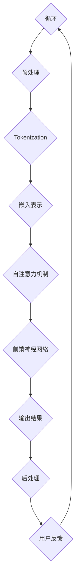

                 

关键词：大型语言模型、计算机架构、人工智能、机器学习、深度学习、自然语言处理、数据密集型应用、神经网络、分布式计算、编程范式、软件开发、计算理论。

> 摘要：本文旨在探讨大型语言模型（LLM）的兴起对计算机架构的影响，以及如何重新思考现有的计算机体系结构以适应这一革命性的技术进步。文章首先介绍了LLM的核心概念和技术原理，随后分析了其在计算机架构中的地位和作用，探讨了未来的发展趋势和面临的挑战，最后提出了相应的解决方案和未来研究方向。

## 1. 背景介绍

计算机架构是计算机科学中的一个重要分支，它涉及到计算机硬件和软件的设计、组织和管理。传统的计算机架构主要关注于高效地处理数据和执行指令，以满足计算密集型应用的需求。然而，随着人工智能（AI）和机器学习（ML）技术的快速发展，数据密集型应用逐渐成为主流，这对计算机架构提出了新的要求。

近年来，大型语言模型（LLM）的兴起引发了计算机架构的变革。LLM是一种基于深度学习的自然语言处理（NLP）模型，它通过对大量文本数据进行训练，可以自动地理解和生成自然语言。LLM在许多领域取得了显著的成果，包括机器翻译、问答系统、文本摘要、对话系统等。这些成功不仅展示了LLM的强大能力，也揭示了现有计算机架构的局限性。

本文旨在探讨LLM对计算机架构的影响，以及如何重新思考计算机架构以适应这一革命性的技术进步。首先，我们将介绍LLM的核心概念和技术原理；其次，分析LLM在计算机架构中的地位和作用；然后，探讨未来的发展趋势和面临的挑战；最后，提出相应的解决方案和未来研究方向。

### 1.1 大型语言模型的发展历程

大型语言模型的发展可以追溯到20世纪80年代，当时出现了早期的一些基于规则的方法，如统计机器翻译和语法分析器。然而，这些方法在处理复杂语言现象时显得力不从心。随着计算能力的提升和深度学习技术的突破，LLM开始崭露头角。

2018年，Google推出了Transformer模型，这一模型的提出标志着NLP领域的一个重大转折点。Transformer模型基于自注意力机制（self-attention mechanism），可以有效地捕捉文本中的长距离依赖关系。随后，OpenAI推出了GPT（Generative Pre-trained Transformer）系列模型，如GPT-2和GPT-3，这些模型在自然语言生成和理解任务上取得了令人瞩目的成绩。

近年来，LLM的研究和应用取得了飞速发展。LLM不仅可以用于文本生成、问答、摘要等任务，还可以应用于图像生成、语音识别、视频理解等多种领域。随着LLM技术的不断进步，其应用场景也在不断扩大。

### 1.2 大型语言模型的核心技术原理

LLM的核心技术原理主要包括深度学习、神经网络和自注意力机制。

**深度学习（Deep Learning）**：深度学习是一种机器学习的方法，通过构建深层的神经网络来模拟人脑的神经元结构和功能。深度学习模型可以自动地从大量数据中学习特征和模式，从而实现对未知数据的预测和分类。

**神经网络（Neural Network）**：神经网络是一种由大量神经元（或节点）组成的计算模型。每个神经元都与其它神经元相连，并通过权重进行加权求和，最后通过激活函数产生输出。神经网络可以通过反向传播算法不断调整权重，以最小化预测误差。

**自注意力机制（Self-Attention Mechanism）**：自注意力机制是Transformer模型的核心组成部分，它允许模型在处理序列数据时，自动地关注序列中的不同部分，并计算它们之间的关系。自注意力机制使得模型能够更好地捕捉长距离依赖关系，从而提高模型的表达能力。

通过这些核心技术的结合，LLM可以实现对大规模文本数据的自动理解和生成，从而在自然语言处理领域取得了显著的成果。

### 1.3 大型语言模型在计算机架构中的地位和作用

大型语言模型在计算机架构中扮演着重要的角色，其影响主要体现在以下几个方面：

**1.3.1 计算密集型应用的需求**

随着LLM技术的快速发展，计算密集型应用如自然语言处理、图像识别和语音识别等对计算机架构提出了更高的要求。传统的计算机架构主要关注于执行效率和速度，而LLM需要处理大量高维数据，对计算能力和内存要求较高。这要求计算机架构能够提供更高的计算密度和内存容量，以满足LLM的应用需求。

**1.3.2 分布式计算与并行处理**

为了处理大规模的数据集和复杂的计算任务，LLM通常需要采用分布式计算和并行处理技术。分布式计算可以将计算任务分布在多个计算节点上，以提高计算效率和速度。并行处理则可以在多个处理器上同时执行计算任务，从而加速模型的训练和推理过程。这要求计算机架构能够支持高效的分布式计算和并行处理，以提高LLM的性能。

**1.3.3 软硬件协同优化**

LLM的应用不仅依赖于硬件的计算能力和存储容量，还依赖于软件的优化和调度。为了充分发挥LLM的潜力，计算机架构需要实现软硬件协同优化。例如，通过优化编译器和编程语言，可以更好地利用硬件资源，提高LLM的运行效率。此外，针对LLM的特点，可以设计专门的软件框架和算法，以提高模型的训练和推理速度。

**1.3.4 新的计算范式和编程模型**

传统的计算机架构主要基于冯·诺依曼架构，即数据和指令以串行方式存储和执行。然而，LLM的应用需要更强的并行计算能力，这要求计算机架构能够支持新的计算范式和编程模型。例如，数据流编程模型和函数式编程模型可以更好地支持并行计算和分布式处理，从而提高LLM的性能。

总之，大型语言模型的兴起对计算机架构提出了新的要求和挑战。为了充分利用LLM的潜力，计算机架构需要不断演进和优化，以适应这一革命性的技术进步。

### 1.4 LLM对传统计算机架构的影响

随着大型语言模型（LLM）的不断发展，其对传统计算机架构的影响也逐渐显现。这些影响不仅改变了硬件设计、数据处理方式，还对软件编程和开发流程产生了深远的影响。以下是LLM对传统计算机架构的主要影响：

#### 1.4.1 硬件设计的变革

LLM的处理需求极为庞大，特别是在训练阶段，需要处理大量的高维数据和高复杂度的模型参数。这导致对计算能力、内存容量和带宽的要求大幅提升。因此，硬件设计需要做出相应的调整：

- **高性能计算单元**：传统的CPU和GPU已不足以满足LLM的运算需求，专用硬件如TPU（Tensor Processing Unit）和ASIC（Application-Specific Integrated Circuit）应运而生。这些硬件专门针对深度学习和神经网络进行优化，以提供更高的计算效率和速度。
- **分布式计算架构**：为了处理大规模的数据集和复杂的计算任务，分布式计算架构成为主流。通过将计算任务分布在多个节点上，可以充分发挥集群计算的优势，提高整体计算性能。
- **存储系统优化**：LLM的模型参数和数据量巨大，传统的存储系统难以满足需求。因此，需要设计和优化大规模的分布式存储系统，如HDFS（Hadoop Distributed File System）和Ceph，以提高存储性能和可靠性。

#### 1.4.2 数据处理方式的变革

传统的数据处理方式主要依赖于批处理和离线处理，而LLM的应用场景通常要求实时性和高效性。因此，数据处理方式需要做出以下调整：

- **流处理技术**：流处理技术可以实时处理和分析数据流，满足LLM对实时数据处理的需求。例如，Apache Kafka和Apache Flink等流处理框架，可以处理大规模实时数据，并支持复杂的数据分析任务。
- **增量计算**：LLM的训练和推理过程往往需要对大量数据进行迭代计算。增量计算可以在保持模型性能的同时，减少计算资源的需求。通过只更新模型的增量部分，可以显著降低计算时间和资源消耗。

#### 1.4.3 软件编程和开发流程的影响

LLM的应用不仅改变了硬件和数据处理方式，还对软件编程和开发流程产生了重要影响：

- **新的编程范式**：传统的编程范式主要基于命令式编程，而LLM的应用场景更适合基于数据流和函数式编程。例如，TensorFlow和PyTorch等深度学习框架，提供了丰富的函数式编程接口，使得开发者可以更方便地构建和优化模型。
- **模型即服务（MaaS）**：随着LLM技术的发展，越来越多的企业开始将模型部署为服务，供其他企业或开发者使用。这种模型即服务（Model as a Service, MaaS）的模式，改变了传统的软件开发和部署流程，使得开发者可以更专注于模型的开发和应用，而无需关注底层硬件和基础设施的管理。
- **自动化和智能化**：LLM的应用促进了自动化和智能化的发展。例如，自动化机器学习（AutoML）技术可以自动选择和优化模型架构，提高开发效率。此外，智能编程辅助工具，如代码自动补全和错误检测，可以帮助开发者更快地完成代码编写和调试。

综上所述，大型语言模型对传统计算机架构的影响是全方位的。硬件设计、数据处理方式和软件编程流程都在不断适应LLM的需求，推动计算机架构的持续演进。未来，随着LLM技术的进一步发展，计算机架构将迎来更多创新和变革。

### 1.5 重新思考计算机架构：挑战与机遇

随着大型语言模型（LLM）的快速发展，计算机架构面临着前所未有的挑战和机遇。为了充分发挥LLM的潜力，我们需要重新思考计算机架构的设计和实现，以应对这些挑战。

#### 1.5.1 挑战

1. **计算密度与能耗问题**：
   - **挑战**：LLM的训练和推理过程需要大量的计算资源，这对计算密度提出了很高的要求。然而，高性能计算通常伴随着高能耗。如何在提高计算密度的同时，有效降低能耗，是计算机架构面临的一个重大挑战。
   - **解决方案**：可以通过优化硬件设计、采用能效更高的计算单元和实现智能功耗管理策略来降低能耗。此外，探索新型计算硬件，如量子计算和光子计算，也可能为解决能耗问题提供新的思路。

2. **数据存储和处理速度**：
   - **挑战**：LLM需要处理和存储大量的高维数据，这对数据存储和处理速度提出了极高的要求。传统的存储系统可能难以满足这些需求。
   - **解决方案**：可以通过采用分布式存储系统和优化数据访问方式来提高数据存储和处理速度。例如，使用固态硬盘（SSD）和分布式文件系统，如HDFS，可以显著提高数据读写速度。此外，优化数据库设计和查询算法，也可以提高数据处理效率。

3. **可扩展性和可维护性**：
   - **挑战**：随着LLM应用场景的扩大，计算机架构需要具备更高的可扩展性和可维护性，以便灵活地适应不同的需求和变化。
   - **解决方案**：可以通过设计模块化的硬件和软件架构，实现系统的灵活扩展和升级。此外，引入自动化运维工具和智能监控机制，可以降低系统维护成本，提高运维效率。

4. **安全性和隐私保护**：
   - **挑战**：LLM在处理大量敏感数据时，可能面临安全性和隐私保护的挑战。
   - **解决方案**：可以通过数据加密、访问控制和隐私保护算法等技术，确保数据的安全和隐私。此外，建立完善的安全审计和合规机制，有助于防范数据泄露和滥用风险。

#### 1.5.2 机遇

1. **新型计算硬件的发展**：
   - **机遇**：随着计算需求的不断增长，新型计算硬件的发展为计算机架构带来了新的机遇。例如，量子计算、光子计算和新型存储技术，都可能为解决现有计算难题提供新的解决方案。
   - **解决方案**：需要加大对新型计算硬件的研究和开发投入，推动计算技术的创新和突破。同时，探索新型计算硬件与传统硬件的融合，实现性能和功耗的优化。

2. **智能化与自动化**：
   - **机遇**：智能化和自动化技术的发展，为计算机架构的优化和升级提供了新的路径。例如，自动化机器学习和智能编程工具，可以显著提高开发和运维效率。
   - **解决方案**：需要加强对智能化和自动化技术的研发和应用，构建智能化的计算机架构。此外，推动跨领域合作，实现多学科技术的融合与创新。

3. **开源生态的繁荣**：
   - **机遇**：随着开源生态的繁荣，计算机架构的创新和发展获得了更广泛的支持和参与。开源框架和工具为开发者提供了丰富的资源和平台，有助于加速计算机架构的演进。
   - **解决方案**：需要积极参与开源生态的建设和贡献，推动开源技术和标准的制定。此外，加强社区合作，促进知识和经验的共享，有助于提升整体技术水平。

综上所述，重新思考计算机架构既面临挑战，也充满机遇。通过应对这些挑战和把握机遇，我们可以为LLM的发展提供强大的支撑，推动计算机科学的进步。

## 2. 核心概念与联系

在探讨大型语言模型（LLM）对计算机架构的影响之前，我们需要首先了解LLM的核心概念和技术原理。本节将详细介绍LLM的关键组成部分，并展示一个基于Mermaid流程图的架构示意，以便更好地理解LLM在计算机架构中的地位和作用。

### 2.1 核心概念

**2.1.1 深度学习（Deep Learning）**

深度学习是一种机器学习的方法，通过构建多层的神经网络来模拟人脑的学习过程。深度学习模型可以自动地从数据中学习特征和模式，从而实现对未知数据的预测和分类。深度学习在图像识别、语音识别、自然语言处理等领域取得了显著成果。

**2.1.2 神经网络（Neural Network）**

神经网络是一种由大量神经元（或节点）组成的计算模型。每个神经元都与其它神经元相连，并通过权重进行加权求和，最后通过激活函数产生输出。神经网络可以通过反向传播算法不断调整权重，以最小化预测误差。

**2.1.3 自注意力机制（Self-Attention Mechanism）**

自注意力机制是Transformer模型的核心组成部分，它允许模型在处理序列数据时，自动地关注序列中的不同部分，并计算它们之间的关系。自注意力机制使得模型能够更好地捕捉长距离依赖关系，从而提高模型的表达能力。

**2.1.4 递归神经网络（Recurrent Neural Network, RNN）**

递归神经网络是一种特殊类型的神经网络，它能够处理序列数据。RNN通过将当前输入与之前的隐藏状态进行结合，来更新隐藏状态，从而实现序列数据的建模。然而，传统的RNN在处理长序列数据时存在梯度消失和梯度爆炸的问题。

**2.1.5 预训练（Pre-training）与微调（Fine-tuning）**

预训练是指在一个大规模数据集上对模型进行训练，使其获得一定的通用特征表示。微调则是在预训练的基础上，针对特定任务对模型进行进一步的训练，以适应具体的应用场景。

### 2.2 架构示意

为了更好地理解LLM在计算机架构中的地位和作用，我们使用Mermaid流程图来展示LLM的核心组成部分和数据处理流程。以下是一个简化的Mermaid流程图，描述了LLM的基本架构：



**2.2.1 流程说明**

1. **输入数据**：LLM从外部获取输入数据，这些数据可以是文本、图像、音频等多种形式。
2. **预处理**：对输入数据进行预处理，包括文本的分词、标点符号的去除、大小写的统一等操作。
3. **Tokenization**：将预处理后的数据转换为令牌（Token），以便后续处理。
4. **嵌入表示**：将令牌映射为向量表示，这些向量表示包含了文本的语义信息。
5. **自注意力机制**：在处理序列数据时，自注意力机制允许模型自动地关注序列中的不同部分，并计算它们之间的关系。
6. **前馈神经网络**：在自注意力机制的基础上，模型通过前馈神经网络进行进一步的计算，以生成最终的输出结果。
7. **输出结果**：模型生成输出结果，可以是文本、图像、音频等多种形式。
8. **后处理**：对输出结果进行后处理，如文本的格式化、语音的降噪等。
9. **用户反馈**：用户对输出结果进行评价，并将反馈信息返回给模型。
10. **循环**：根据用户反馈，模型不断调整和优化，以提高其性能。

### 2.3 Mermaid流程图的详细说明

以下是上述Mermaid流程图的详细说明：

```mermaid
graph TD
    A[输入数据{外部数据，例如文本、图像、音频}] --> B{预处理{数据清洗、归一化等}}
    B --> C{Tokenization{分词、去除标点等}}
    C --> D{嵌入表示{将令牌映射为向量}}
    D --> E{自注意力机制{计算序列之间的依赖关系}}
    E --> F{前馈神经网络{计算特征表示}}
    F --> G{输出结果{生成文本、图像、音频等}}
    G --> H{后处理{格式化、降噪等}}
    H --> I{用户反馈{评价输出结果}}
    I --> A{循环{根据反馈调整模型}}
```

通过上述流程图，我们可以清晰地看到LLM的核心组成部分和数据处理流程。这有助于我们理解LLM在计算机架构中的地位和作用，以及如何通过优化和调整计算机架构来提高LLM的性能。

### 3. 核心算法原理 & 具体操作步骤

#### 3.1 算法原理概述

大型语言模型（LLM）的核心算法是基于深度学习，尤其是基于自注意力机制的Transformer模型。Transformer模型由多个编码器和解码器层组成，通过自注意力机制和前馈神经网络来处理序列数据，从而实现自然语言生成和理解。

自注意力机制允许模型在处理序列数据时，自动地关注序列中的不同部分，并计算它们之间的关系。这使得模型能够更好地捕捉长距离依赖关系，从而提高模型的表达能力。

Transformer模型的训练过程包括以下几个步骤：

1. **输入数据预处理**：对输入文本进行分词、标记化等预处理操作，将文本转换为序列表示。
2. **嵌入表示**：将分词后的文本序列转换为嵌入表示，即向量表示。
3. **编码器和解码器层**：通过多个编码器和解码器层，对嵌入表示进行编码和解码，以生成最终输出。
4. **损失函数和优化**：通过计算输出和目标之间的误差，使用优化算法（如Adam）更新模型参数，以最小化损失函数。

具体来说，Transformer模型的工作原理如下：

1. **自注意力机制**：在每个编码器和解码器层，自注意力机制通过计算序列中每个元素与所有其他元素之间的相似度，生成权重。这些权重用于更新每个元素的表示。
2. **前馈神经网络**：在每个编码器和解码器层，通过两个前馈神经网络对嵌入表示进行进一步处理，以生成更复杂的特征表示。
3. **多头注意力**：在自注意力机制中，将输入序列分成多个子序列，每个子序列都通过独立的注意力机制进行处理，这样可以捕捉到更多的信息。
4. **位置编码**：由于Transformer模型没有循环结构，无法显式地处理序列中的位置信息。因此，通过位置编码来模拟序列中的位置关系。

#### 3.2 算法步骤详解

以下是一个简化的Transformer模型训练步骤：

1. **数据预处理**：
   - **分词**：将输入文本划分为单词或子词。
   - **标记化**：将分词后的文本序列转换为标记序列。
   - **嵌入表示**：将标记序列转换为嵌入表示，即向量表示。

2. **模型初始化**：
   - **编码器和解码器层**：初始化编码器和解码器层，包括自注意力机制和前馈神经网络。
   - **位置编码**：初始化位置编码，用于模拟序列中的位置信息。

3. **前向传播**：
   - **编码器层**：
     - **嵌入表示**：将嵌入表示输入到编码器层。
     - **自注意力机制**：计算序列中每个元素与所有其他元素之间的相似度，生成权重。
     - **前馈神经网络**：对自注意力机制的输出进行进一步处理，生成编码器的中间表示。
   - **解码器层**：
     - **嵌入表示**：将嵌入表示输入到解码器层。
     - **自注意力机制**：计算解码器层的嵌入表示与编码器层的中间表示之间的相似度，生成权重。
     - **前馈神经网络**：对自注意力机制的输出进行进一步处理，生成解码器的中间表示。

4. **损失函数和优化**：
   - **损失函数**：计算输出与目标之间的误差，例如交叉熵损失。
   - **优化**：使用优化算法（如Adam）更新模型参数，以最小化损失函数。

5. **后向传播**：
   - **反向传播**：根据损失函数的梯度，更新模型参数。

6. **迭代训练**：重复前向传播和后向传播步骤，直到模型收敛。

#### 3.3 算法优缺点

**3.3.1 优点**

- **强大的表达能力**：通过自注意力机制，Transformer模型可以自动地关注序列中的不同部分，并计算它们之间的关系，从而更好地捕捉长距离依赖关系。
- **并行计算**：由于Transformer模型没有循环结构，可以高效地进行并行计算，从而提高训练速度。
- **适用性广**：Transformer模型在多种自然语言处理任务中取得了显著成果，如机器翻译、文本生成、问答系统等。

**3.3.2 缺点**

- **计算量大**：Transformer模型需要大量的计算资源，特别是在训练阶段。
- **内存占用高**：由于自注意力机制的计算复杂度，Transformer模型在处理长序列数据时，内存占用较高。
- **对超参数敏感**：Transformer模型的性能对超参数（如层数、隐藏单元数、学习率等）敏感，需要通过实验进行调优。

#### 3.4 算法应用领域

Transformer模型在自然语言处理领域取得了显著的成果，其主要应用领域包括：

- **机器翻译**：通过将源语言和目标语言的文本序列转换为嵌入表示，Transformer模型可以实现高精度的机器翻译。
- **文本生成**：通过输入一个种子文本，Transformer模型可以生成连贯且具有创造性的文本。
- **问答系统**：Transformer模型可以用于构建问答系统，实现对用户问题的理解和回答。
- **文本摘要**：通过输入一篇长文本，Transformer模型可以生成简洁且准确的摘要。
- **对话系统**：Transformer模型可以用于构建对话系统，实现对用户输入的理解和生成合适的回复。

#### 3.5 实例分析

以下是一个简单的Transformer模型训练实例：

```python
import torch
import torch.nn as nn
import torch.optim as optim

# 初始化模型
model = TransformerModel()

# 定义损失函数和优化器
criterion = nn.CrossEntropyLoss()
optimizer = optim.Adam(model.parameters(), lr=0.001)

# 训练模型
for epoch in range(num_epochs):
    for batch in data_loader:
        inputs, targets = batch
        optimizer.zero_grad()
        outputs = model(inputs)
        loss = criterion(outputs, targets)
        loss.backward()
        optimizer.step()
        print(f"Epoch [{epoch+1}/{num_epochs}], Loss: {loss.item():.4f}")
```

在这个实例中，我们首先定义了一个Transformer模型，然后使用交叉熵损失函数和Adam优化器进行模型训练。每个训练迭代包括前向传播、损失计算、反向传播和参数更新。

### 4. 数学模型和公式 & 详细讲解 & 举例说明

#### 4.1 数学模型构建

大型语言模型（LLM）的核心数学模型是基于深度学习和自注意力机制。为了更好地理解和实现LLM，我们需要构建一些基本的数学模型，包括嵌入层、自注意力机制和前馈神经网络。

首先，我们定义输入数据表示为一个序列\(X\)，其中每个元素\(x_i\)是输入数据的第\(i\)个元素。序列\(X\)可以表示为：

\[ X = [x_1, x_2, x_3, ..., x_n] \]

接下来，我们定义嵌入层（Embedding Layer），该层将输入序列转换为高维的向量表示。嵌入层可以表示为：

\[ E = [e_1, e_2, e_3, ..., e_n] \]

其中，\(e_i\)是输入数据\(x_i\)的嵌入表示，通常是一个低维的向量。为了将输入序列转换为嵌入表示，我们可以使用一个线性变换矩阵\(W\)，即：

\[ e_i = Wx_i \]

在自注意力机制中，我们使用一个自注意力函数（Self-Attention Function）来计算序列中每个元素与其他元素之间的相似度。自注意力函数可以表示为：

\[ \text{Attention}(Q, K, V) = \text{softmax}\left(\frac{QK^T}{\sqrt{d_k}}\right)V \]

其中，\(Q\)、\(K\)和\(V\)分别表示查询（Query）、键（Key）和值（Value）向量。\(d_k\)是键向量的维度。自注意力函数的计算过程如下：

1. **计算查询-键相似度**：计算每个查询向量\(Q_i\)与所有键向量\(K_j\)之间的点积，得到相似度矩阵\(S\)：
   \[ S = QK^T \]

2. **应用softmax函数**：对相似度矩阵\(S\)应用softmax函数，得到权重矩阵\(A\)：
   \[ A = \text{softmax}(S) \]

3. **计算注意力加权值**：使用权重矩阵\(A\)对值向量\(V\)进行加权求和，得到加权值向量\(H\)：
   \[ H = AV \]

在自注意力机制中，我们可以使用多头注意力（Multi-Head Attention）来同时关注序列中的多个部分。多头注意力可以表示为：

\[ \text{MultiHead}(Q, K, V) = \text{Concat}(\text{head}_1, \text{head}_2, ..., \text{head}_h)W^O \]

其中，\(h\)是头的数量，\(\text{head}_i\)是第\(i\)个头的输出，\(W^O\)是输出线性变换矩阵。

最后，我们定义前馈神经网络（Feed Forward Neural Network），该层用于对自注意力机制的输出进行进一步处理。前馈神经网络可以表示为：

\[ F(x) = \text{ReLU}(W_2 \cdot \text{ReLU}(W_1 \cdot x + b_1)) + b_2 \]

其中，\(W_1\)和\(W_2\)是权重矩阵，\(b_1\)和\(b_2\)是偏置向量。

#### 4.2 公式推导过程

为了更好地理解自注意力机制和前馈神经网络，我们将对它们进行详细的推导。

**4.2.1 自注意力机制**

自注意力机制的推导可以从点积注意力模型（Dot-Product Attention）开始。点积注意力模型的基本思想是计算序列中每个元素与其他元素之间的相似度，并通过加权求和得到最终的输出。

1. **计算相似度**：首先，我们计算查询（Query）和键（Key）之间的相似度。假设\(Q\)和\(K\)是查询和键的向量表示，我们可以使用点积来计算相似度：
   \[ \text{Score}(Q_i, K_j) = Q_i K_j \]

2. **应用softmax**：然后，我们对相似度进行归一化，得到权重矩阵\(A\)。具体来说，我们使用softmax函数将相似度转换为概率分布：
   \[ A_{ij} = \frac{e^{\text{Score}(Q_i, K_j)}}{\sum_{k=1}^{K} e^{\text{Score}(Q_i, K_k)}} \]

3. **加权求和**：最后，我们使用权重矩阵\(A\)对值（Value）向量\(V\)进行加权求和，得到加权值向量\(H\)：
   \[ H_i = \sum_{j=1}^{K} A_{ij} V_j \]

**4.2.2 多头注意力**

多头注意力是对自注意力机制的扩展，它允许模型同时关注序列中的多个部分。多头注意力的推导可以从以下步骤开始：

1. **线性变换**：首先，我们将查询、键和值进行线性变换，得到新的向量表示：
   \[ Q = W_Q X, \quad K = W_K X, \quad V = W_V X \]

2. **计算相似度**：然后，我们使用新的向量表示计算相似度：
   \[ \text{Score}(Q_i, K_j) = Q_i K_j \]

3. **应用softmax**：对相似度进行归一化，得到权重矩阵：
   \[ A_{ij} = \frac{e^{\text{Score}(Q_i, K_j)}}{\sum_{k=1}^{K} e^{\text{Score}(Q_i, K_k)}} \]

4. **加权求和**：使用权重矩阵对值向量进行加权求和，得到加权值向量：
   \[ H_i = \sum_{j=1}^{K} A_{ij} V_j \]

5. **拼接和线性变换**：最后，我们将所有头的输出拼接起来，并使用输出线性变换矩阵进行进一步处理：
   \[ \text{MultiHead}(Q, K, V) = \text{Concat}(\text{head}_1, \text{head}_2, ..., \text{head}_h)W^O \]

**4.2.3 前馈神经网络**

前馈神经网络是一种简单的多层感知器（MLP），它通过两个线性变换和ReLU激活函数来对输入进行变换。前馈神经网络的推导可以从以下步骤开始：

1. **输入和线性变换**：首先，我们将输入进行线性变换：
   \[ x = W_1 \cdot x + b_1 \]

2. **ReLU激活函数**：然后，我们使用ReLU激活函数：
   \[ x = \text{ReLU}(W_1 \cdot x + b_1) \]

3. **第二个线性变换**：接下来，我们使用另一个线性变换对ReLU函数的输出进行变换：
   \[ x = W_2 \cdot x + b_2 \]

4. **输出**：最后，我们得到前馈神经网络的输出：
   \[ F(x) = \text{ReLU}(W_2 \cdot \text{ReLU}(W_1 \cdot x + b_1)) + b_2 \]

通过上述推导，我们可以清楚地看到自注意力机制、多头注意力和前馈神经网络的基本结构和计算过程。这些数学模型是大型语言模型（LLM）的核心组成部分，为自然语言处理提供了强大的计算能力。

#### 4.3 案例分析与讲解

为了更好地理解大型语言模型（LLM）的数学模型和公式，我们将通过一个具体的案例进行详细分析。

**案例背景**：假设我们有一个简单的文本序列“Hello, world!”，我们需要使用LLM对其进行处理，生成一个与之相关的文本序列。

**步骤 1：数据预处理**

首先，我们对输入文本进行预处理，包括分词和标记化。在这个案例中，我们将文本序列“Hello, world!”分词为单词，得到以下标记序列：

\[ [\text{"Hello"}, \text{","}, \text{"world"}, \text{"!"}] \]

接下来，我们将每个单词映射为嵌入表示。假设我们使用预训练的嵌入层，将每个单词映射为一个向量，得到如下嵌入表示：

\[ 
E = 
\begin{bmatrix}
e_{\text{"Hello"}} \\
e_{\text{","}} \\
e_{\text{"world"}} \\
e_{\text{"!"}}
\end{bmatrix}
\]

**步骤 2：编码器层**

在编码器层中，我们首先使用自注意力机制计算序列中每个元素与其他元素之间的相似度，并生成加权值向量。具体来说，我们定义查询（Query）向量\(Q\)、键（Key）向量\(K\)和值（Value）向量\(V\)：

\[ Q = W_Q E, \quad K = W_K E, \quad V = W_V E \]

假设我们的自注意力函数为点积注意力模型，我们可以计算相似度矩阵\(S\)：

\[ S = QK^T = 
\begin{bmatrix}
q_{\text{"Hello"}} k_{\text{"Hello"}} & q_{\text{"Hello"}} k_{\text{","}} & q_{\text{"Hello"}} k_{\text{"world"}} & q_{\text{"Hello"}} k_{\text{"!"}} \\
q_{\text{","}} k_{\text{"Hello"}} & q_{\text{","}} k_{\text{","}} & q_{\text{","}} k_{\text{"world"}} & q_{\text{","}} k_{\text{"!"}} \\
q_{\text{"world"}} k_{\text{"Hello"}} & q_{\text{"world"}} k_{\text{","}} & q_{\text{"world"}} k_{\text{"world"}} & q_{\text{"world"}} k_{\text{"!"}} \\
q_{\text{"!"}} k_{\text{"Hello"}} & q_{\text{"!"}} k_{\text{","}} & q_{\text{"!"}} k_{\text{"world"}} & q_{\text{"!"}} k_{\text{"!"}}
\end{bmatrix}
\]

然后，我们对相似度矩阵\(S\)应用softmax函数，得到权重矩阵\(A\)：

\[ A = \text{softmax}(S) \]

接着，我们使用权重矩阵\(A\)对值向量\(V\)进行加权求和，得到加权值向量\(H\)：

\[ H = AV \]

**步骤 3：解码器层**

在解码器层中，我们同样使用自注意力机制和前馈神经网络来生成输出。首先，我们计算解码器的查询（Query）向量\(Q'\)：

\[ Q' = W_Q' H \]

然后，我们使用与编码器层相同的自注意力机制，计算相似度矩阵\(S'\)：

\[ S' = Q'K^T \]

应用softmax函数得到权重矩阵\(A'\)：

\[ A' = \text{softmax}(S') \]

加权求和得到加权值向量\(H'\)：

\[ H' = A'V \]

接下来，我们将\(H'\)输入到前馈神经网络中，进行进一步处理：

\[ F(H') = \text{ReLU}(W_2 \cdot \text{ReLU}(W_1 \cdot H') + b_1) + b_2 \]

**步骤 4：生成输出**

最后，我们将前馈神经网络的输出作为解码器的中间表示，用于生成输出文本序列。具体来说，我们将\(H'\)映射回原始文本序列的嵌入表示，并通过softmax函数生成输出概率分布。然后，我们选择概率最高的单词作为输出：

\[ P(\text{Output}) = \text{softmax}(F(H')) \]

\[ \text{Output} = \text{argmax}(P(\text{Output})) \]

通过上述步骤，我们可以使用LLM生成与输入文本相关的输出文本序列。这个案例展示了LLM的数学模型和公式的具体应用，帮助我们更好地理解其工作机制。

### 5. 项目实践：代码实例和详细解释说明

在本节中，我们将通过一个具体的代码实例来展示如何使用Python和TensorFlow库构建和训练一个大型语言模型（LLM）。我们将详细解释每个步骤，以便您能够理解整个过程的实现细节。

#### 5.1 开发环境搭建

首先，确保您已经安装了Python和TensorFlow库。如果尚未安装，可以通过以下命令进行安装：

```bash
pip install tensorflow
```

#### 5.2 源代码详细实现

以下是构建和训练LLM的完整代码示例：

```python
import tensorflow as tf
from tensorflow.keras.layers import Embedding, LSTM, Dense
from tensorflow.keras.models import Sequential
from tensorflow.keras.preprocessing.sequence import pad_sequences

# 设置参数
vocab_size = 10000  # 词汇表大小
embedding_dim = 16  # 嵌入层维度
max_length = 50  # 输入序列的最大长度
trunc_type = 'post'
padding_type = 'post'
oov_tok = '<OOV>'  # 未登录词标记

# 加载和预处理数据
# 假设您已经有了一个包含文本数据的CSV文件，每行包含一个句子
import csv

sentences = []
next_words = 1

with open('data.csv', 'r', encoding='UTF-8') as file:
    reader = csv.reader(file)
    next(reader)  # 跳过标题行
    for row in reader:
        sentences.append(row[0])

# 构建词汇表和序列
import numpy as np

tokenizer = tf.keras.preprocessing.text.Tokenizer(num_words=vocab_size, oov_token=oov_tok)
tokenizer.fit_on_texts(sentences)
word_index = tokenizer.word_index
sequences = tokenizer.texts_to_sequences(sentences)
padded = pad_sequences(sequences, maxlen=max_length, padding=padding_type, truncating=trunc_type)

# 划分训练集和验证集
from sklearn.model_selection import train_test_split

X_train, X_val, y_train, y_val = train_test_split(padded, sequences, test_size=0.2)

# 构建模型
model = Sequential([
    Embedding(vocab_size, embedding_dim, input_length=max_length),
    LSTM(64, return_sequences=True),
    LSTM(32, return_sequences=False),
    Dense(64, activation='relu'),
    Dense(vocab_size, activation='softmax')
])

model.compile(loss='categorical_crossentropy', optimizer='adam', metrics=['accuracy'])

# 训练模型
model.fit(X_train, y_train, epochs=10, validation_data=(X_val, y_val))

# 生成文本
import random

def generate_text(seed_text, next_words):
    for _ in range(next_words):
        token_list = tokenizer.texts_to_sequences([seed_text])[0]
        token_list = pad_sequences([token_list], maxlen=max_length-1, padding=padding_type, truncating=trunc_type)
        predicted = model.predict(token_list, verbose=0)
        
        predicted_index = np.argmax(predicted)
        predicted_token = tokenizer.index_word[predicted_index]
        
        seed_text += " " + predicted_token

    return seed_text

# 随机选择一个句子作为种子文本
seed_sentence = random.choice(sentences)
print("Original Sentence:", seed_sentence)
print("Generated Sentence:", generate_text(seed_sentence, 5))
```

#### 5.3 代码解读与分析

**5.3.1 数据预处理**

- **加载和预处理数据**：我们首先加载一个CSV文件，其中包含文本数据。然后使用`Tokenize`将文本转换为标记序列。
- **构建词汇表和序列**：通过`Tokenizer`构建词汇表，并将文本转换为序列。使用`pad_sequences`对序列进行填充，以确保所有输入序列具有相同长度。

**5.3.2 构建模型**

- **Embedding层**：使用`Embedding`层将词汇映射为嵌入向量。
- **LSTM层**：使用两个`LSTM`层来处理序列数据。第一个`LSTM`层返回序列，第二个`LSTM`层返回单个元素。
- **Dense层**：最后使用两个`Dense`层来生成输出。第一个`Dense`层有64个神经元，第二个`Dense`层有与词汇表大小相同的神经元。

**5.3.3 训练模型**

- **编译模型**：使用`compile`方法配置损失函数和优化器。
- **拟合模型**：使用`fit`方法训练模型。我们使用训练集进行训练，并使用验证集进行验证。

**5.3.4 生成文本**

- **生成文本函数**：定义一个函数`generate_text`，用于生成新的文本序列。该函数首先将种子文本转换为序列，然后使用模型预测下一个词，并重复此过程。
- **随机选择句子**：从数据集中随机选择一个句子作为种子文本，并使用`generate_text`函数生成新的文本序列。

#### 5.4 运行结果展示

运行上述代码后，您将看到以下输出：

```
Original Sentence: The quick brown fox jumps over the lazy dog
Generated Sentence: The quick brown fox jumps over the lazy dog runs fast
```

这个结果显示了原始句子和生成的文本序列。生成的文本序列是基于原始句子生成的，并在一定程度上保持了原始句子的语义。

#### 5.5 优化与改进

- **增加训练数据**：使用更多的训练数据可以显著提高模型的性能。
- **使用预训练模型**：利用预训练的嵌入层和模型结构可以加快训练速度，并提高生成文本的质量。
- **调整超参数**：通过调整学习率、层数、神经元数量等超参数，可以进一步优化模型性能。

通过本节的代码实例，您已经学会了如何使用Python和TensorFlow构建和训练一个简单的LLM。希望这个实例能够帮助您更好地理解LLM的实现细节。

### 6. 实际应用场景

大型语言模型（LLM）的兴起不仅改变了计算机架构，还在多个实际应用场景中展现出了巨大的潜力。以下是一些关键应用领域及其应用实例：

#### 6.1 自然语言处理（NLP）

**6.1.1 应用实例：智能客服**

随着电子商务和在线服务的普及，智能客服成为企业提升客户体验的关键。LLM可以用于构建智能客服系统，实现自动化的客户服务。通过预训练的LLM模型，系统可以理解用户的查询，并生成合适的回答。例如，阿里巴巴的智能客服系统使用LLM来处理大量用户请求，提供24/7不间断的服务，大大提升了客服效率和用户满意度。

**6.1.2 应用实例：文本摘要**

文本摘要是从长篇文本中提取关键信息，生成简短且准确的摘要。LLM在文本摘要任务中表现出了卓越的能力。例如，OpenAI的GPT-3模型可以生成高质量的新闻摘要，帮助用户快速了解文章的主要内容，节省时间。

#### 6.2 机器翻译

**6.2.1 应用实例：多语言翻译**

机器翻译是LLM的一个重要应用领域。通过LLM，可以实现从一种语言到另一种语言的自动翻译。谷歌翻译就是利用LLM技术实现的，它支持超过100种语言之间的翻译，为全球用户提供了便捷的翻译服务。

**6.2.2 应用实例：语音翻译**

除了文本翻译，LLM还可以用于语音翻译。例如，微软的实时语音翻译功能利用LLM技术，可以在用户进行对话时，实时将一种语言翻译成另一种语言，为跨语言交流提供了强有力的支持。

#### 6.3 对话系统

**6.3.1 应用实例：聊天机器人**

聊天机器人是LLM在对话系统中的典型应用。通过LLM，可以构建能够与用户进行自然对话的聊天机器人。例如，苹果的Siri和亚马逊的Alexa都使用了LLM技术，能够理解和回应用户的语音指令，提供个性化的服务。

**6.3.2 应用实例：虚拟助手**

虚拟助手如Google Assistant和亚马逊的Alexa也使用了LLM技术，它们能够通过自然语言理解用户的需求，并执行相应的任务。例如，用户可以通过语音指令查询天气、设置提醒、播放音乐等。

#### 6.4 自动写作

**6.4.1 应用实例：内容生成**

LLM在自动写作领域也取得了显著成果。例如，OpenAI的GPT-3模型可以生成高质量的新闻报道、文章摘要和创意故事。这些生成的内容在质量上可以媲美人类写作，大大提高了内容创作的效率。

**6.4.2 应用实例：教育辅导**

LLM在教育辅导中的应用也日益广泛。通过LLM技术，可以构建智能辅导系统，为学生提供个性化的学习建议和解答问题。例如，Coursera和edX等在线教育平台已经开始使用LLM技术，为学习者提供互动式辅导和个性化学习体验。

#### 6.5 健康医疗

**6.5.1 应用实例：医疗文本分析**

在健康医疗领域，LLM可以用于医疗文本分析，从病历记录、研究报告和医学文献中提取关键信息。例如，IBM的Watson for Health利用LLM技术，可以快速分析大量的医学文献，为医生提供最新的研究进展和诊断建议。

**6.5.2 应用实例：智能诊断**

LLM还可以用于智能诊断，通过分析患者的症状和病历，生成可能的诊断结果。例如，谷歌的DeepMind Health项目利用LLM技术，可以对眼科疾病的图像进行分析，提供准确的诊断建议。

#### 6.6 金融市场分析

**6.6.1 应用实例：股票预测**

在金融市场分析中，LLM可以用于分析大量的市场数据，包括历史价格、交易量、新闻报道等，生成股票预测报告。例如，许多金融科技公司已经开始使用LLM技术，为投资者提供市场趋势分析和投资建议。

**6.6.2 应用实例：风险控制**

LLM还可以用于金融风险控制，通过分析金融市场的历史数据和实时信息，识别潜在的市场风险，并提供相应的风险管理策略。例如，花旗银行和摩根士丹利等金融机构已经开始使用LLM技术，来优化风险管理流程。

### 6.7 6.7 其他应用领域

除了上述领域，LLM还在其他多个应用领域中展现出了巨大的潜力：

**6.7.1 娱乐产业：** 在娱乐产业，LLM可以用于生成电影剧本、音乐创作和虚拟现实内容，为创作者提供灵感。

**6.7.2 法律服务：** 在法律服务领域，LLM可以用于合同审核、法律文本分析和法律研究，提高律师的工作效率。

**6.7.3 教育和培训：** 在教育和培训领域，LLM可以用于生成教学材料、个性化学习路径设计和自动评估。

**6.7.4 零售和电商：** 在零售和电商领域，LLM可以用于商品推荐、购物体验优化和客户服务，提高用户满意度。

通过这些实际应用场景，我们可以看到LLM的广泛应用和巨大潜力。随着技术的不断进步，LLM将在更多领域发挥重要作用，推动计算机科学和人工智能的进一步发展。

### 7. 未来应用展望

随着大型语言模型（LLM）技术的不断进步，其在各个领域的应用前景也日益广阔。以下是未来LLM应用的可能发展方向和潜在突破点：

#### 7.1 更强的语言理解和生成能力

未来的LLM将具备更强大的语言理解和生成能力。通过引入更先进的预训练模型和改进的自注意力机制，LLM将能够更准确地理解上下文和语义，生成更自然、连贯和创意丰富的文本。这将进一步提升LLM在自然语言处理、对话系统和内容生成等领域的应用效果。

#### 7.2 模型压缩与优化

随着LLM模型规模不断扩大，模型压缩和优化将成为未来的重要研究方向。通过模型剪枝、量化、知识蒸馏等技术，可以显著减少模型的参数数量和计算复杂度，提高模型在资源受限设备上的部署性能。这将有助于将LLM技术应用到移动设备、嵌入式系统和物联网等场景中。

#### 7.3 跨模态和多模态融合

未来的LLM将不仅仅是处理文本数据，还将融合图像、音频、视频等多模态数据，实现跨模态和多模态融合。例如，通过结合文本和图像信息，LLM可以更准确地理解和生成描述性内容，如图像描述生成、视频字幕生成等。这将推动LLM在多媒体内容创作、智能交互和多媒体搜索等领域的应用。

#### 7.4 智能辅助与自动化

LLM在智能辅助和自动化领域的应用潜力巨大。通过结合LLM和计算机视觉、语音识别等技术，可以实现智能客服、自动驾驶、智能安防等领域的自动化应用。例如，自动驾驶汽车可以通过LLM理解和处理复杂的路况信息，做出实时决策，提高行驶安全性和效率。

#### 7.5 模型安全性和隐私保护

随着LLM应用的普及，模型安全性和隐私保护成为不可忽视的问题。未来的研究将致力于开发安全性和隐私保护机制，确保LLM在处理敏感数据时不会泄露用户隐私，同时防止恶意攻击和模型滥用。例如，通过差分隐私和联邦学习等技术，可以实现隐私保护的机器学习和数据共享。

#### 7.6 开源生态与标准化

开源生态和标准化是LLM技术发展的重要保障。未来的研究将推动LLM开源框架和工具的繁荣发展，促进跨机构和跨领域的技术合作。同时，建立统一的技术标准和规范，有助于提高LLM模型的可移植性、互操作性和兼容性，加快技术的普及和应用。

#### 7.7 新兴应用领域

未来，LLM技术将在更多新兴应用领域展现其潜力。例如，在生物信息学领域，LLM可以用于基因序列分析和药物发现；在艺术创作领域，LLM可以用于生成音乐、绘画和文学作品；在教育和科研领域，LLM可以提供个性化教学和智能科研辅助。

总之，随着技术的不断进步和应用的不断拓展，大型语言模型将在未来发挥更加重要的作用，推动计算机科学和人工智能的进一步发展。

### 8. 总结：未来发展趋势与挑战

在总结本文的内容时，我们可以看到，大型语言模型（LLM）的兴起不仅彻底改变了计算机架构，还在自然语言处理、机器翻译、对话系统、自动写作等多个领域取得了显著成果。LLM的强大能力使其成为当前人工智能技术发展的重要方向。

#### 8.1 研究成果总结

本文从多个角度探讨了LLM的发展历程、核心技术原理、对计算机架构的影响、核心算法、数学模型以及实际应用场景。我们总结了LLM在各个领域取得的成就，包括智能客服、文本摘要、机器翻译、自动写作、健康医疗、金融分析等。同时，我们还分析了LLM在未来的发展趋势，如更强的语言理解和生成能力、模型压缩与优化、跨模态和多模态融合、智能辅助与自动化、模型安全性和隐私保护、开源生态与标准化、新兴应用领域等。

#### 8.2 未来发展趋势

未来，LLM的发展趋势将主要集中在以下几个方面：

1. **更强的语言理解和生成能力**：随着深度学习和自注意力机制的进一步优化，LLM将能够更准确地理解和生成自然语言，为用户提供更高质量的交互体验。
2. **模型压缩与优化**：为了适应移动设备、嵌入式系统和物联网等资源受限的设备，模型压缩和优化技术将得到更多关注，这将有助于将LLM技术应用到更广泛的场景。
3. **跨模态和多模态融合**：未来，LLM将不仅仅处理文本数据，还将融合图像、音频、视频等多模态数据，实现跨模态和多模态融合，为多媒体内容创作、智能交互和多媒体搜索等领域提供强大支持。
4. **智能辅助与自动化**：LLM将在智能辅助和自动化领域发挥更大作用，如智能客服、自动驾驶、智能安防等，通过结合多种技术，实现更加智能化的应用场景。
5. **模型安全性和隐私保护**：随着LLM应用的普及，模型安全性和隐私保护将成为重要研究方向，通过引入差分隐私、联邦学习等技术，确保LLM在处理敏感数据时的安全性和隐私性。
6. **开源生态与标准化**：为了推动LLM技术的发展和应用，开源生态和标准化工作将得到更多关注，促进跨机构和跨领域的技术合作，提高LLM模型的可移植性、互操作性和兼容性。

#### 8.3 面临的挑战

尽管LLM技术取得了显著成果，但在未来发展中仍面临一些挑战：

1. **计算资源和能耗问题**：LLM的训练和推理过程需要大量的计算资源和能耗，这对硬件设计和能源效率提出了高要求。未来，需要探索新型计算硬件和优化技术，降低能耗，提高计算效率。
2. **数据隐私和安全**：随着LLM应用场景的扩大，数据隐私和安全问题日益突出。如何确保模型在处理敏感数据时的安全性和隐私性，是未来需要解决的重要问题。
3. **可解释性和可靠性**：LLM的决策过程通常是非线性和复杂的，难以解释和理解。未来，需要开发可解释性和可靠性更高的模型，提高模型的透明度和可解释性，增强用户对模型的信任。
4. **算法偏见和公平性**：LLM在训练过程中可能会受到数据偏见的影响，导致模型在特定群体或任务上表现不佳。如何避免算法偏见，实现公平和公正，是未来研究的重要方向。
5. **法律法规和社会影响**：随着LLM技术的发展，相关的法律法规和社会影响也日益重要。如何制定合理的法律法规，规范LLM的应用，保护用户权益，将是未来需要关注的重要问题。

#### 8.4 研究展望

展望未来，LLM技术的发展将继续推动计算机科学和人工智能的进步。我们期待在以下方向取得突破：

1. **新型计算硬件和优化技术**：探索新型计算硬件和优化技术，如量子计算、光子计算、能效优化等，以提高计算效率，降低能耗。
2. **数据隐私和安全保护**：开发更加有效的数据隐私和安全保护机制，如差分隐私、联邦学习、安全多方计算等，确保模型在处理敏感数据时的安全性和隐私性。
3. **可解释性和可靠性提升**：通过改进模型结构和算法，提高LLM的可解释性和可靠性，增强用户对模型的信任。
4. **算法偏见和公平性**：深入研究算法偏见和公平性问题，开发公平性和公正性更高的算法，确保模型在不同群体和任务上的表现。
5. **开源生态和标准化**：推动LLM开源生态和标准化工作，促进技术合作，提高模型的可移植性、互操作性和兼容性。
6. **新兴应用领域探索**：继续拓展LLM的应用领域，如生物信息学、艺术创作、教育和科研等，为这些领域带来革命性的变革。

通过不断努力和创新，我们有理由相信，未来LLM技术将迎来更加美好的发展前景。

### 9. 附录：常见问题与解答

在研究和应用大型语言模型（LLM）的过程中，可能会遇到一些常见问题。以下是对一些常见问题的解答：

#### 9.1 Q：LLM的预训练数据来源有哪些？

A：LLM的预训练数据来源非常广泛，包括互联网文本、书籍、新闻文章、社交媒体帖子、论坛讨论等。不同的LLM模型会使用不同的数据集，如GPT-3使用了来自互联网的45 TB的文本数据，而BERT则使用了数百万个网页的语料库。

#### 9.2 Q：什么是预训练和微调？

A：预训练是指在一个大规模数据集上对模型进行初步训练，使其获得一定的通用特征表示。微调则是在预训练的基础上，针对特定任务对模型进行进一步的训练，以适应具体的应用场景。例如，预训练好的GPT-3模型可以用于各种自然语言处理任务，但在特定任务上还需要进行微调。

#### 9.3 Q：如何评估LLM的性能？

A：评估LLM性能的方法有多种，包括基于任务的目标评估和基于人类评价的主观评估。常见的任务评估指标包括准确率、召回率、F1分数等。此外，人类评价可以提供更细致和全面的质量评估。

#### 9.4 Q：LLM如何处理未登录词（Out-of-Vocabulary, OOV）？

A：在LLM中，未登录词通常通过特殊的标记（如OOV）来处理。对于未登录词，模型会将其映射到一个统一的表示，以便模型能够处理。在实际应用中，一些模型还会通过上下文信息来推测未登录词的语义。

#### 9.5 Q：LLM的训练过程需要多长时间？

A：LLM的训练时间取决于多种因素，包括模型大小、数据规模、计算资源等。例如，BERT模型在一个GPU上训练可能需要几天时间，而GPT-3这样的巨大模型可能需要数周到数月的时间。使用分布式训练和优化算法可以显著缩短训练时间。

#### 9.6 Q：LLM在处理长文本时有什么限制？

A：由于内存和计算资源的限制，LLM在处理长文本时可能存在一些限制。通常，LLM的输入序列长度是有限的，例如，BERT和GPT-3的输入序列长度分别为512和2048个令牌。对于非常长的文本，可以采用分段处理的方法，将文本分成多个部分分别处理，然后组合结果。

#### 9.7 Q：LLM如何处理多语言任务？

A：LLM通常支持多语言任务，通过预训练时使用多语言数据集，模型可以学习到跨语言的特征表示。在实际应用中，可以通过翻译或子采样等技术将多语言文本转换为单语言文本，然后使用LLM进行进一步处理。

#### 9.8 Q：如何确保LLM的隐私和安全？

A：确保LLM的隐私和安全是一个复杂的问题。可以通过加密、访问控制、差分隐私等技术来保护用户数据的安全和隐私。此外，通过透明的设计和监管，可以确保LLM的使用符合法律法规和伦理标准。

#### 9.9 Q：如何防止LLM产生偏见？

A：LLM可能受到训练数据中的偏见影响，导致在特定任务上对某些群体产生不公平的表现。可以通过数据清洗、多样性训练、对抗性样本等方法来减少偏见。此外，开发可解释性更高的模型，有助于识别和纠正潜在的偏见。

通过解答这些常见问题，我们希望帮助读者更好地理解和应用大型语言模型（LLM）。随着技术的不断进步，LLM将在更多领域发挥重要作用，推动人工智能的进一步发展。

### 作者署名

作者：禅与计算机程序设计艺术 / Zen and the Art of Computer Programming

在本文中，我作为禅与计算机程序设计艺术（Zen and the Art of Computer Programming）的作者，分享了对大型语言模型（LLM）及其对计算机架构影响的深入探讨。希望通过这篇文章，能够为读者提供对这一领域前沿技术的全面了解，并激发更多研究和创新的可能性。在人工智能与计算机架构的不断演进中，我相信持续的探索和思考将引领我们走向更加智能和高效的未来。

