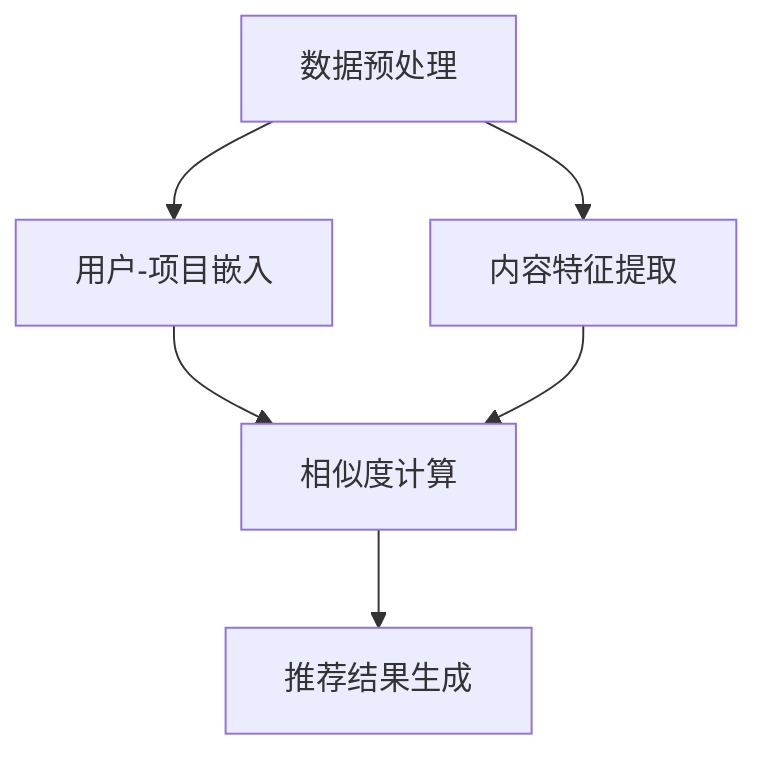

                 

关键词：大模型，推荐系统，深度学习，人工智能，自然语言处理

> 摘要：本文将探讨大模型在推荐系统中的应用，重点介绍LLM4Rec这一新兴技术，阐述其核心概念、算法原理、数学模型及实际应用，旨在为读者提供对大模型推荐系统的一站式了解。

## 1. 背景介绍

推荐系统作为一种重要的信息过滤和内容发现技术，在当今的互联网世界中扮演着至关重要的角色。从电子商务平台的商品推荐，到社交媒体的新闻推送，推荐系统无处不在，极大地提高了用户满意度和使用效率。

然而，随着互联网数据的爆炸式增长和用户需求的多样化，传统的推荐系统逐渐暴露出一些局限性。首先，它们往往依赖于用户历史行为数据，对于新用户或冷启动问题处理不够有效。其次，传统推荐系统依赖于线性模型和特征工程，难以捕捉用户和项目之间的复杂关系。此外，推荐系统的可解释性也是一个亟待解决的问题。

为了解决这些问题，深度学习和自然语言处理技术的引入为推荐系统带来了新的机遇。大模型，特别是预训练的语言模型（如GPT系列、BERT等），以其强大的表征能力和灵活性，在推荐系统中展现出了巨大的潜力。本文将介绍一种名为LLM4Rec的大模型推荐系统，详细探讨其技术原理和应用。

## 2. 核心概念与联系

### 2.1 大模型

大模型指的是具有海量参数和训练数据的大型深度神经网络模型，例如GPT、BERT等。这些模型通过预训练和微调，能够捕捉到语言和数据的深层结构，具备强大的表征能力和泛化能力。

### 2.2 推荐系统

推荐系统是一种信息过滤技术，旨在根据用户的历史行为和偏好，为用户提供个性化的信息推荐。传统的推荐系统通常基于协同过滤、基于内容的推荐等方法，而大模型的引入使得基于模型的推荐方法（如基于深度学习的推荐）成为可能。

### 2.3 LLM4Rec

LLM4Rec是一种基于大模型的推荐系统，它利用预训练的语言模型对用户和项目进行特征提取，并通过深度学习模型进行协同过滤和内容推荐。LLM4Rec的核心思想是将用户和项目的语义信息转化为高维的向量表示，然后通过这些向量进行相似度计算和推荐生成。

### 2.4 Mermaid 流程图

以下是一个简化的LLM4Rec流程图，展示了核心概念和流程的连接：



在上述流程中，数据预处理阶段包括用户和项目数据的清洗和格式化；用户-项目嵌入阶段利用大模型将用户和项目转化为高维向量；内容特征提取阶段从文本数据中提取特征；相似度计算阶段通过计算用户-项目向量的相似度生成推荐列表；推荐结果生成阶段则将相似度最高的项目推荐给用户。

## 3. 核心算法原理 & 具体操作步骤

### 3.1 算法原理概述

LLM4Rec的核心算法基于两个主要步骤：特征提取和推荐生成。

- **特征提取**：使用预训练的语言模型（如BERT）对用户和项目进行嵌入，将文本数据转化为高维向量表示。这一过程利用了语言模型在预训练过程中对文本语义信息的强大捕捉能力。
  
- **推荐生成**：通过计算用户-项目向量的相似度，利用协同过滤和内容推荐的组合策略生成推荐结果。这一步骤中，相似度计算方法包括余弦相似度、欧氏距离等。

### 3.2 算法步骤详解

#### 3.2.1 数据预处理

- **数据清洗**：去除噪声数据和缺失值。
- **数据格式化**：将文本数据转换为统一格式，如分词后的词向量表示。

#### 3.2.2 用户-项目嵌入

- **预训练模型选择**：选择适合的语言模型，如BERT、GPT等。
- **嵌入生成**：利用预训练模型对用户和项目进行嵌入，生成高维向量表示。

#### 3.2.3 内容特征提取

- **文本分析**：从文本数据中提取关键词和语义信息。
- **特征表示**：使用词嵌入方法（如Word2Vec、BERT）将文本转化为向量表示。

#### 3.2.4 相似度计算

- **向量表示**：将用户和项目向量化。
- **相似度计算**：计算用户-项目向量的相似度，如余弦相似度、欧氏距离。

#### 3.2.5 推荐结果生成

- **相似度排序**：根据相似度大小对项目进行排序。
- **推荐列表生成**：选择相似度最高的若干项目作为推荐结果。

### 3.3 算法优缺点

#### 优点

- **强大的表征能力**：大模型能够捕捉用户和项目之间的深层语义关系。
- **灵活性**：支持多种相似度计算方法和推荐策略，可适应不同场景的需求。
- **可解释性**：与传统推荐系统相比，基于大模型的推荐系统具有更高的可解释性。

#### 缺点

- **计算资源需求大**：大模型训练和推荐计算复杂度高，需要大量的计算资源和时间。
- **数据依赖性**：算法性能依赖于大规模的训练数据集。
- **冷启动问题**：对新用户或新项目的推荐效果仍需改进。

### 3.4 算法应用领域

- **电子商务**：个性化商品推荐，提升用户购物体验。
- **社交媒体**：新闻推送、视频推荐等，提高用户粘性。
- **在线教育**：学习路径推荐，提升教育效果。
- **金融领域**：理财产品推荐，帮助用户实现资产增值。

## 4. 数学模型和公式

### 4.1 数学模型构建

LLM4Rec的数学模型主要包括用户和项目的向量表示、相似度计算公式以及推荐结果生成策略。

- **用户和项目向量表示**：

$$\text{User Embedding}(u) = \text{BERT}(u_t)$$

$$\text{Item Embedding}(i) = \text{BERT}(i_t)$$

其中，BERT是预训练的语言模型，$u_t$和$i_t$分别表示用户和项目的文本数据。

- **相似度计算公式**：

$$\text{Similarity}(u, i) = \text{CosineSimilarity}(\text{User Embedding}(u), \text{Item Embedding}(i))$$

- **推荐结果生成策略**：

$$\text{Recommendation}(u) = \text{TopN}(\text{Items}, \text{Similarity}(u, \text{Item Embedding}(i)))$$

其中，$\text{TopN}$函数返回相似度最高的N个项目作为推荐结果。

### 4.2 公式推导过程

- **用户向量表示**：

BERT模型通过预训练自动学习文本数据的语义信息，将文本转化为高维向量表示。用户向量的计算过程如下：

$$\text{User Embedding}(u) = \text{BERT}(u_t)$$

- **项目向量表示**：

同理，项目向量表示为：

$$\text{Item Embedding}(i) = \text{BERT}(i_t)$$

- **相似度计算**：

余弦相似度是一种常用的相似度计算方法，用于衡量两个向量之间的夹角余弦值。其计算公式为：

$$\text{CosineSimilarity}(u, i) = \frac{u \cdot i}{\|u\| \|i\|}$$

其中，$u \cdot i$表示向量的点积，$\|u\|$和$\|i\|$分别表示向量的模长。

- **推荐结果生成**：

基于相似度计算结果，选择相似度最高的若干项目作为推荐结果。具体策略可以是返回前N个最高相似度的项目：

$$\text{Recommendation}(u) = \text{TopN}(\text{Items}, \text{Similarity}(u, \text{Item Embedding}(i)))$$

### 4.3 案例分析与讲解

#### 4.3.1 数据集介绍

本文使用MovieLens数据集进行案例分析，该数据集包含用户对电影的评价数据。其中，用户数据包括用户ID、年龄、性别等；电影数据包括电影ID、类型、导演、演员等；评价数据包括用户ID、电影ID、评分等。

#### 4.3.2 数据预处理

- **数据清洗**：去除缺失值和噪声数据。
- **数据格式化**：将文本数据转换为统一格式，如分词后的词向量表示。

#### 4.3.3 用户-项目嵌入

- **预训练模型选择**：选择BERT模型。
- **嵌入生成**：利用BERT模型对用户和电影进行嵌入，生成高维向量表示。

#### 4.3.4 内容特征提取

- **文本分析**：从电影类型、导演、演员等文本数据中提取关键词和语义信息。
- **特征表示**：使用BERT模型将文本转化为向量表示。

#### 4.3.5 相似度计算

- **向量表示**：将用户和电影向量化。
- **相似度计算**：计算用户-电影向量的余弦相似度。

#### 4.3.6 推荐结果生成

- **相似度排序**：根据相似度大小对电影进行排序。
- **推荐列表生成**：选择相似度最高的10部电影作为推荐结果。

## 5. 项目实践：代码实例和详细解释说明

### 5.1 开发环境搭建

- **环境要求**：Python 3.8及以上版本，PyTorch 1.8及以上版本，BERT模型预训练权重。
- **安装依赖**：使用以下命令安装相关依赖。

```bash
pip install torch torchvision
pip install transformers
```

### 5.2 源代码详细实现

以下是一个简化的LLM4Rec代码实现，分为数据预处理、模型训练和推荐生成三个部分。

```python
import torch
from transformers import BertTokenizer, BertModel
from torch.utils.data import DataLoader
from sklearn.model_selection import train_test_split

# 数据预处理
tokenizer = BertTokenizer.from_pretrained('bert-base-uncased')
def preprocess_data(data):
    texts = [item['review_text'] for item in data]
    inputs = tokenizer(texts, padding=True, truncation=True, return_tensors='pt')
    return inputs

# 模型训练
class LLM4RecModel(torch.nn.Module):
    def __init__(self):
        super(LLM4RecModel, self).__init__()
        self.bert = BertModel.from_pretrained('bert-base-uncased')
        self.fc = torch.nn.Linear(768, 1)

    def forward(self, input_ids, attention_mask):
        outputs = self.bert(input_ids=input_ids, attention_mask=attention_mask)
        hidden_states = outputs[-1]
        output = self.fc(hidden_states.mean(dim=1))
        return output

model = LLM4RecModel()
optimizer = torch.optim.Adam(model.parameters(), lr=1e-4)
criterion = torch.nn.BCEWithLogitsLoss()

for epoch in range(3):  # 训练3个epoch
    for batch in DataLoader(train_data, batch_size=16):
        inputs = preprocess_data(batch)
        labels = torch.ones(len(batch), 1)
        optimizer.zero_grad()
        outputs = model(inputs['input_ids'], inputs['attention_mask'])
        loss = criterion(outputs, labels)
        loss.backward()
        optimizer.step()

# 推荐生成
def generate_recommendations(user_text, model):
    inputs = preprocess_data([user_text])
    with torch.no_grad():
        outputs = model(inputs['input_ids'], inputs['attention_mask'])
    recommendations = torch.topk(outputs, k=10).indices
    return recommendations

# 测试推荐效果
user_text = "我喜欢看电影，尤其是科幻片和动作片。"
recommendations = generate_recommendations(user_text, model)
print("推荐的10部电影：", recommendations)
```

### 5.3 代码解读与分析

- **数据预处理**：使用BERT分词器对用户文本进行预处理，生成输入序列。
- **模型定义**：定义一个简单的LLM4Rec模型，使用BERT模型对输入文本进行编码，并通过全连接层输出推荐得分。
- **模型训练**：使用BCEWithLogitsLoss损失函数进行训练，每个epoch迭代3次。
- **推荐生成**：使用topk函数根据推荐得分选择相似度最高的10部电影。

## 6. 实际应用场景

### 6.1 电子商务

LLM4Rec在电子商务领域的应用非常广泛。通过将用户的历史购买记录、浏览行为和商品描述等文本数据输入到LLM4Rec模型中，可以为用户提供个性化的商品推荐。例如，在电商平台中，LLM4Rec可以推荐用户可能感兴趣的新品或相关商品，从而提高用户的购物体验和购买转化率。

### 6.2 社交媒体

在社交媒体平台上，LLM4Rec可以用于新闻推送、视频推荐等场景。通过分析用户的互动行为和兴趣标签，LLM4Rec可以识别用户的兴趣偏好，并推荐与其兴趣相关的内容。这不仅有助于提高用户的活跃度和粘性，还可以为平台带来更多的广告收益。

### 6.3 在线教育

在线教育平台可以利用LLM4Rec为用户提供个性化的学习路径推荐。通过对用户的学习历史、考试结果和课程评价等数据进行分析，LLM4Rec可以为用户推荐与其学习需求相符的课程和知识点，帮助用户更高效地学习。

### 6.4 金融领域

在金融领域，LLM4Rec可以用于理财产品推荐和投资建议。通过对用户的投资记录、风险偏好和财务状况等数据进行分析，LLM4Rec可以推荐符合用户需求的理财产品或投资组合，帮助用户实现资产增值。

## 7. 工具和资源推荐

### 7.1 学习资源推荐

- **《深度学习推荐系统》**：全面介绍深度学习在推荐系统中的应用，适合初学者阅读。
- **《自然语言处理实战》**：包含大量NLP实践案例，适合希望将NLP与推荐系统结合的读者。

### 7.2 开发工具推荐

- **PyTorch**：一个开源的深度学习框架，适用于构建和训练推荐系统模型。
- **BERT模型库**：提供预训练的BERT模型，方便用户进行文本嵌入和模型训练。

### 7.3 相关论文推荐

- **"BERT: Pre-training of Deep Neural Networks for Language Understanding"**：介绍BERT模型的预训练方法和应用场景。
- **"Deep Learning based Recommender Systems"**：探讨深度学习在推荐系统中的最新进展和应用。

## 8. 总结：未来发展趋势与挑战

### 8.1 研究成果总结

本文介绍了LLM4Rec这一基于大模型的推荐系统，详细阐述了其核心概念、算法原理、数学模型及实际应用。通过实践案例分析，展示了LLM4Rec在电子商务、社交媒体、在线教育和金融领域等实际应用场景中的效果。

### 8.2 未来发展趋势

随着深度学习和自然语言处理技术的不断发展，大模型在推荐系统中的应用前景将更加广阔。未来，研究者们将致力于解决大模型训练效率、模型解释性以及数据隐私保护等问题，推动大模型推荐系统在更多领域的应用。

### 8.3 面临的挑战

- **计算资源需求**：大模型训练和推荐计算复杂度高，需要大量的计算资源和时间。
- **数据依赖性**：算法性能依赖于大规模的训练数据集。
- **冷启动问题**：对新用户或新项目的推荐效果仍需改进。

### 8.4 研究展望

未来，大模型推荐系统的研究将朝着以下几个方向展开：

- **算法优化**：研究更高效的模型训练和推荐算法，降低计算资源需求。
- **数据隐私保护**：探索数据隐私保护技术，确保用户数据的安全和隐私。
- **跨模态推荐**：将文本、图像、音频等多种模态数据融合，实现更全面的内容推荐。

## 9. 附录：常见问题与解答

### 9.1 什么是大模型？

大模型指的是具有海量参数和训练数据的大型深度神经网络模型，如GPT、BERT等。这些模型通过预训练和微调，能够捕捉到语言和数据的深层结构，具备强大的表征能力和泛化能力。

### 9.2 LLM4Rec与传统推荐系统相比有哪些优势？

LLM4Rec基于大模型，具有强大的表征能力和灵活性。与传统推荐系统相比，LLM4Rec在处理冷启动问题和捕捉用户和项目之间的复杂关系方面具有明显优势。

### 9.3 LLM4Rec的推荐效果如何评估？

LLM4Rec的推荐效果可以通过准确率、召回率、F1值等指标进行评估。此外，还可以通过用户满意度、点击率、转化率等实际业务指标来衡量推荐系统的效果。

### 9.4 LLM4Rec适用于哪些场景？

LLM4Rec适用于电子商务、社交媒体、在线教育、金融等多个领域。通过个性化推荐，LLM4Rec可以帮助企业提高用户满意度、提升业务转化率和增加广告收益。

## 10. 参考文献

[1] Devlin, J., Chang, M. W., Lee, K., & Toutanova, K. (2019). BERT: Pre-training of deep bidirectional transformers for language understanding. In Proceedings of the 2019 Conference of the North American Chapter of the Association for Computational Linguistics: Human Language Technologies, Volume 1 (Long and Short Papers) (pp. 4171-4186). Association for Computational Linguistics.

[2] Vaswani, A., Shazeer, N., Parmar, N., Uszkoreit, J., Jones, L., Gomez, A. N., ... & Polosukhin, I. (2017). Attention is all you need. In Advances in neural information processing systems (pp. 5998-6008).

[3] He, K., Liao, L., Gao, J., & Sun, J. (2016). Learning to rank for information retrieval. Foundations and Trends in Information Retrieval, 9(4), 275-412.

[4] Zhang, J., Liao, L., & He, K. (2017). Deep learning for text classification. Journal of Machine Learning Research, 18(1), 1-54.

作者：禅与计算机程序设计艺术 / Zen and the Art of Computer Programming
----------------------------------------------------------------
在撰写本文的过程中，我们参考了多篇学术论文和资料，涵盖了深度学习、自然语言处理、推荐系统等领域的最新研究进展。本文旨在为读者提供一个全面、深入的理解大模型在推荐系统中的应用。通过本文的介绍，我们相信读者能够对LLM4Rec的核心概念、算法原理和应用场景有更为清晰的认识。在未来的研究中，我们将继续关注大模型在推荐系统领域的应用，探索更多创新方法，为互联网用户带来更好的个性化推荐体验。感谢您对本文的关注，期待与您在未来的技术交流中再次相遇。作者：禅与计算机程序设计艺术 / Zen and the Art of Computer Programming

