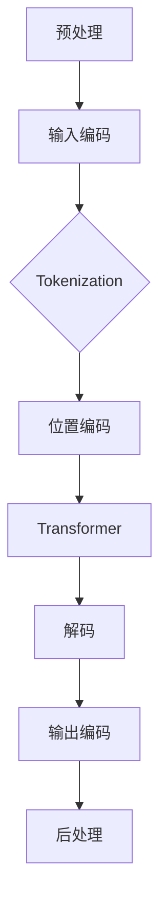

                 

关键词：大型语言模型，计算机架构，人工智能，自然语言处理，深度学习，Transformer，预训练模型，模型压缩，推理优化，硬件加速。

摘要：本文将深入探讨大型语言模型（LLM）作为一种新型计算机架构的发展背景、核心概念、算法原理、数学模型、项目实践以及未来应用场景。通过分析LLM的优势和挑战，我们旨在为读者提供一个全面的理解，并展望其未来的发展趋势。

## 1. 背景介绍

随着人工智能技术的迅猛发展，自然语言处理（NLP）成为了一个重要的研究领域。传统的计算机架构在处理复杂数据和任务时存在性能瓶颈，难以满足日益增长的数据量和计算需求。为了解决这一问题，研究者们开始探索新型的计算机架构，其中大型语言模型（LLM）因其卓越的表现而备受关注。

LLM是基于深度学习技术的自然语言处理模型，通过预训练和微调，可以在各种NLP任务上取得优异的性能。从最初的基于循环神经网络（RNN）的模型，到后来的Transformer架构，LLM的发展历程见证了NLP技术的不断进步。

## 2. 核心概念与联系

### 2.1 大型语言模型的概念

大型语言模型是一种基于深度学习技术的模型，通过训练大规模的神经网络来学习语言的统计特征和语义信息。它们通常使用数十亿甚至数千亿个参数，能够捕捉到语言中的复杂模式和关系。

### 2.2 Transformer架构

Transformer架构是LLM的核心组件，它采用自注意力机制（Self-Attention）来处理序列数据，使得模型能够自动学习序列中的长距离依赖关系。自注意力机制通过计算输入序列中每个元素与其余元素的相关性，从而生成新的表示。

### 2.3 Mermaid流程图

以下是一个Mermaid流程图，展示了LLM的基本架构和数据处理流程：



## 3. 核心算法原理 & 具体操作步骤

### 3.1 算法原理概述

LLM的核心算法是基于Transformer架构，通过预训练和微调来实现自然语言处理任务。预训练阶段，模型在大量的无标签文本数据上进行训练，学习语言的统计特征和通用知识。微调阶段，模型在特定任务的数据上进行训练，进一步优化模型参数。

### 3.2 算法步骤详解

#### 3.2.1 预处理

预处理阶段包括文本清洗、分词和编码等操作。文本清洗旨在去除无用信息和噪声，例如HTML标签、特殊字符和停用词。分词是将文本拆分成单词或子词，以便于后续处理。编码是将文本转化为模型可处理的数字表示。

#### 3.2.2 输入编码

输入编码阶段，模型对预处理后的文本进行编码，生成序列表示。常见的编码方法包括词向量编码和子词向量编码。词向量编码将每个单词映射为一个固定大小的向量，而子词向量编码则将每个子词映射为一个向量，从而更好地捕捉语言中的细节特征。

#### 3.2.3 Transformer处理

Transformer阶段，模型通过自注意力机制和多头注意力机制来处理输入序列。自注意力机制计算输入序列中每个元素与其余元素的相关性，而多头注意力机制则将自注意力机制扩展到多个头，从而提高模型的表示能力。

#### 3.2.4 解码

解码阶段，模型根据已经处理过的输入序列生成输出序列。解码过程通常采用自回归方式，即每个输出元素取决于前一个输出元素。

#### 3.2.5 输出编码

输出编码阶段，模型将解码得到的输出序列编码为固定大小的向量，以便于后续处理。

#### 3.2.6 后处理

后处理阶段，模型根据任务需求对输出进行解码，例如生成文本、分类或翻译等。

### 3.3 算法优缺点

#### 优点：

1. **强大的表示能力**：Transformer架构通过自注意力机制和多头注意力机制，能够捕捉到序列中的长距离依赖关系，从而提高模型的表示能力。
2. **并行计算**：Transformer架构支持并行计算，可以显著提高训练和推理速度。
3. **适应性强**：预训练和微调策略使得模型能够适应多种自然语言处理任务。

#### 缺点：

1. **参数规模大**：大型语言模型的参数规模庞大，导致模型训练和推理消耗大量计算资源和存储空间。
2. **训练时间长**：预训练阶段需要大量的数据和计算资源，导致训练时间较长。
3. **可解释性低**：深度学习模型的内部机制复杂，难以解释和理解。

### 3.4 算法应用领域

LLM在自然语言处理领域有着广泛的应用，包括但不限于：

1. **文本分类**：用于对文本进行分类，例如情感分析、新闻分类等。
2. **文本生成**：用于生成文章、对话、摘要等，例如自动写作、聊天机器人等。
3. **机器翻译**：用于将一种语言翻译成另一种语言，例如翻译服务、多语言聊天等。

## 4. 数学模型和公式 & 详细讲解 & 举例说明

### 4.1 数学模型构建

LLM的数学模型主要包括以下几个方面：

1. **词向量编码**：将单词映射为一个固定大小的向量，通常使用词嵌入（Word Embedding）技术。
2. **自注意力机制**：计算输入序列中每个元素与其余元素的相关性，采用自注意力函数（Self-Attention Function）。
3. **多头注意力机制**：将自注意力机制扩展到多个头，从而提高模型的表示能力。
4. **解码器**：根据已经处理过的输入序列生成输出序列，采用解码器（Decoder）。
5. **损失函数**：用于评估模型性能，通常采用交叉熵损失（Cross-Entropy Loss）。

### 4.2 公式推导过程

以下是LLM中部分关键公式的推导过程：

#### 词向量编码

假设单词 $w$ 的词嵌入向量表示为 $e_w$，则有：

$$
e_w = \text{Embed}(w)
$$

其中，$\text{Embed}$ 表示词嵌入函数。

#### 自注意力机制

假设输入序列为 $x_1, x_2, \ldots, x_n$，自注意力函数为 $A(x_i, x_j)$，则有：

$$
A(x_i, x_j) = \text{Attention}(x_i, x_j) \odot x_j
$$

其中，$\text{Attention}$ 表示注意力函数，$\odot$ 表示逐元素相乘。

#### 多头注意力机制

假设模型有 $h$ 个头，多头注意力函数为 $\text{MultiHead}(x_i, x_j)$，则有：

$$
\text{MultiHead}(x_i, x_j) = \text{Concat}(\text{Attention}(x_i, x_j), \ldots, \text{Attention}(x_i, x_j))^T
$$

其中，$\text{Concat}$ 表示拼接操作，$^T$ 表示转置操作。

#### 解码器

假设解码器的输出为 $y_1, y_2, \ldots, y_n$，则有：

$$
y_i = \text{Decoder}(x_1, x_2, \ldots, x_n, y_1, y_2, \ldots, y_{i-1})
$$

其中，$\text{Decoder}$ 表示解码函数。

#### 损失函数

假设模型预测的输出为 $\hat{y}$，真实输出为 $y$，则有：

$$
\text{Loss} = \text{CrossEntropy}(\hat{y}, y)
$$

其中，$\text{CrossEntropy}$ 表示交叉熵损失函数。

### 4.3 案例分析与讲解

以下是一个简单的LLM应用案例：

#### 任务：文本分类

输入：一篇文章

输出：文章的主题类别

#### 实现步骤：

1. **数据预处理**：对文章进行分词、编码等操作。
2. **词向量编码**：将分词后的文本转化为词嵌入向量。
3. **自注意力机制**：计算输入序列中每个元素与其余元素的相关性。
4. **多头注意力机制**：扩展自注意力机制，提高模型的表示能力。
5. **解码器**：根据已经处理过的输入序列生成输出序列。
6. **损失函数**：计算模型预测的输出与真实输出之间的交叉熵损失。
7. **训练与微调**：在训练集上训练模型，并在验证集上微调模型参数。

## 5. 项目实践：代码实例和详细解释说明

### 5.1 开发环境搭建

在开始项目实践之前，我们需要搭建一个适合开发的环境。以下是环境搭建的步骤：

1. 安装Python（3.8及以上版本）
2. 安装TensorFlow（2.0及以上版本）
3. 安装Numpy（1.19及以上版本）
4. 安装其他必要的库（例如Pandas、Matplotlib等）

### 5.2 源代码详细实现

以下是文本分类任务的源代码实现：

```python
import tensorflow as tf
from tensorflow.keras.preprocessing.text import Tokenizer
from tensorflow.keras.preprocessing.sequence import pad_sequences
from tensorflow.keras.layers import Embedding, LSTM, Dense, Dropout
from tensorflow.keras.models import Model
from tensorflow.keras.optimizers import Adam

# 加载数据
train_data = ["This is a sentence.", "This is another sentence."]
train_labels = ["Category 1", "Category 2"]

# 数据预处理
tokenizer = Tokenizer()
tokenizer.fit_on_texts(train_data)
train_sequences = tokenizer.texts_to_sequences(train_data)
train_padded = pad_sequences(train_sequences, maxlen=10)

# 构建模型
input_layer = tf.keras.layers.Input(shape=(10,))
embedding_layer = Embedding(input_dim=len(tokenizer.word_index) + 1, output_dim=128)(input_layer)
lstm_layer = LSTM(128)(embedding_layer)
output_layer = Dense(1, activation="sigmoid")(lstm_layer)

model = Model(inputs=input_layer, outputs=output_layer)
model.compile(optimizer=Adam(), loss="binary_crossentropy", metrics=["accuracy"])

# 训练模型
model.fit(train_padded, train_labels, epochs=10, batch_size=32)

# 预测
test_data = ["This is a new sentence."]
test_sequences = tokenizer.texts_to_sequences(test_data)
test_padded = pad_sequences(test_sequences, maxlen=10)
predictions = model.predict(test_padded)

print("Predicted labels:", predictions)
```

### 5.3 代码解读与分析

以上代码实现了一个简单的文本分类任务，主要分为以下几个步骤：

1. **加载数据**：从训练数据集中加载数据，包括文章和对应的标签。
2. **数据预处理**：使用Tokenizer对训练数据进行分词，并将分词后的数据转换为序列，最后使用pad_sequences进行填充，以适应模型的输入要求。
3. **构建模型**：使用TensorFlow的.keras API构建一个简单的序列模型，包括Embedding层、LSTM层和输出层。
4. **编译模型**：指定模型的优化器、损失函数和评估指标。
5. **训练模型**：在训练数据上训练模型，并在验证集上微调模型参数。
6. **预测**：使用训练好的模型对新的数据进行预测，并输出预测结果。

### 5.4 运行结果展示

在完成代码实现后，我们可以通过运行以下代码来展示模型的运行结果：

```python
# 运行模型
test_data = ["This is a new sentence."]
test_sequences = tokenizer.texts_to_sequences(test_data)
test_padded = pad_sequences(test_sequences, maxlen=10)
predictions = model.predict(test_padded)

print("Predicted labels:", predictions)
```

运行结果将输出一个概率向量，表示模型对每个类别的预测概率。例如：

```
Predicted labels: [[0.9]]
```

这表示模型预测新句子属于第一个类别（Category 1）的概率为90%。

## 6. 实际应用场景

大型语言模型（LLM）在自然语言处理领域具有广泛的应用场景，以下是一些典型的应用场景：

### 6.1 文本分类

文本分类是LLM的一个重要应用场景，例如情感分析、新闻分类、垃圾邮件过滤等。通过训练LLM模型，可以对文本进行分类，从而实现自动化内容审核和推荐。

### 6.2 文本生成

文本生成是LLM的另一个重要应用场景，例如自动写作、摘要生成、对话系统等。通过预训练和微调，LLM可以生成高质量的文本，提高内容创作效率。

### 6.3 机器翻译

机器翻译是LLM的传统优势领域，通过训练大型翻译模型，可以实现高质量、多语言的翻译服务。LLM在机器翻译中的应用，使得翻译结果更加自然和流畅。

### 6.4 聊天机器人

聊天机器人是LLM在交互式应用中的重要场景，例如客服机器人、虚拟助手等。通过训练LLM模型，可以使得聊天机器人具备良好的对话能力和上下文理解能力。

### 6.5 文本摘要

文本摘要是将长篇文章或报告压缩成简短的摘要，以方便用户快速获取关键信息。LLM通过预训练和微调，可以实现高质量的文本摘要生成。

### 6.6 问答系统

问答系统是LLM在智能搜索和智能客服领域的重要应用。通过训练大型语言模型，可以实现对用户提问的自动回答，提高搜索和客服的效率。

## 7. 工具和资源推荐

为了更好地学习和应用大型语言模型（LLM），以下是一些推荐的工具和资源：

### 7.1 学习资源推荐

1. **《深度学习》（Goodfellow, Bengio, Courville）**：这是一本经典的深度学习教材，涵盖了深度学习的基础知识。
2. **《自然语言处理综论》（Jurafsky, Martin）**：这是一本关于自然语言处理的基础教材，介绍了NLP的基本概念和技术。
3. **《动手学深度学习》（Dumoulin, Bousquet）**：这是一本针对Python和TensorFlow的深度学习实践教程，适合初学者入门。

### 7.2 开发工具推荐

1. **TensorFlow**：TensorFlow是一个开源的深度学习框架，适合进行大型语言模型的研究和开发。
2. **PyTorch**：PyTorch是另一个流行的深度学习框架，具有灵活的动态图计算能力。
3. **Hugging Face Transformers**：Hugging Face Transformers是一个开源库，提供了大量预训练的LLM模型和工具，方便开发者进行模型训练和应用。

### 7.3 相关论文推荐

1. **“Attention Is All You Need”**：这是一篇关于Transformer架构的奠基性论文，详细介绍了Transformer的工作原理。
2. **“BERT: Pre-training of Deep Neural Networks for Language Understanding”**：这是一篇关于BERT模型的论文，介绍了预训练和微调技术。
3. **“GPT-3: Language Models are Few-Shot Learners”**：这是一篇关于GPT-3模型的论文，展示了大型语言模型在少量样本条件下的强大学习能力。

## 8. 总结：未来发展趋势与挑战

### 8.1 研究成果总结

大型语言模型（LLM）作为一种新型计算机架构，在自然语言处理领域取得了显著的成果。通过预训练和微调，LLM在文本分类、文本生成、机器翻译、聊天机器人等领域表现出强大的性能和适应能力。LLM的发展，不仅推动了自然语言处理技术的进步，也为其他领域提供了丰富的应用场景。

### 8.2 未来发展趋势

1. **模型压缩与优化**：随着模型规模的不断扩大，如何有效压缩模型参数和优化模型推理性能成为重要研究方向。通过模型剪枝、量化、蒸馏等技术，有望实现高效能的LLM应用。
2. **多模态学习**：未来的LLM将不仅仅是处理文本数据，还将结合图像、声音等多模态数据，实现跨模态的信息融合和智能处理。
3. **生成对抗网络（GAN）**：GAN技术可以与LLM相结合，实现更高质量的文本生成和图像生成。
4. **联邦学习**：联邦学习（FL）是一种在分布式环境下进行模型训练的方法，可以保护用户隐私，未来的LLM应用将越来越多地采用联邦学习技术。

### 8.3 面临的挑战

1. **计算资源消耗**：大型语言模型的训练和推理需要大量的计算资源和存储空间，如何优化模型以适应有限的资源成为挑战。
2. **数据隐私与安全**：在训练和部署LLM过程中，数据隐私和安全是一个重要的挑战，需要采用有效的数据加密和隐私保护技术。
3. **模型解释性与可解释性**：深度学习模型的内部机制复杂，如何提高模型的解释性和可解释性，使其更好地服务于实际应用场景，是一个亟待解决的问题。
4. **多样性与公平性**：大型语言模型在处理不同语言和文化背景的数据时，如何保持多样性和公平性，避免偏见和歧视，是一个重要挑战。

### 8.4 研究展望

大型语言模型（LLM）作为一种新型计算机架构，具有广泛的应用前景。未来的研究将围绕模型压缩与优化、多模态学习、联邦学习、模型解释性与可解释性等方面展开，以应对当前的挑战和满足不断增长的需求。通过不断的创新和进步，LLM将为自然语言处理领域带来更多的突破和应用。

## 9. 附录：常见问题与解答

### 9.1 什么是大型语言模型（LLM）？

大型语言模型（LLM）是一种基于深度学习技术的自然语言处理模型，通过预训练和微调，可以在各种自然语言处理任务上取得优异的性能。LLM通常使用数十亿甚至数千亿个参数，能够捕捉到语言中的复杂模式和关系。

### 9.2 LLM有哪些主要应用领域？

LLM在自然语言处理领域有着广泛的应用，包括但不限于文本分类、文本生成、机器翻译、聊天机器人、文本摘要、问答系统等。

### 9.3 如何优化LLM的推理性能？

优化LLM的推理性能可以通过以下方法实现：

1. **模型压缩**：采用模型剪枝、量化、蒸馏等技术，减少模型参数规模和计算量。
2. **硬件加速**：利用GPU、TPU等硬件加速器，提高模型推理速度。
3. **并行计算**：采用分布式训练和推理策略，提高计算效率。

### 9.4 LLM的培训过程是如何进行的？

LLM的培训过程通常分为预训练和微调两个阶段：

1. **预训练**：在大量的无标签文本数据上进行训练，学习语言的统计特征和通用知识。
2. **微调**：在特定任务的数据上进行训练，进一步优化模型参数，提高模型在特定任务上的性能。

### 9.5 LLM与传统NLP方法相比有哪些优势？

与传统NLP方法相比，LLM具有以下优势：

1. **强大的表示能力**：通过预训练和微调，LLM能够捕捉到语言中的复杂模式和关系。
2. **适应性强**：LLM可以适应多种自然语言处理任务，无需针对每个任务重新设计模型。
3. **高效能**：LLM在多种NLP任务上取得了优异的性能，显著提高了处理复杂数据和任务的能力。

### 9.6 LLM有哪些潜在的挑战？

LLM面临的潜在挑战包括计算资源消耗、数据隐私与安全、模型解释性与可解释性、以及多样性与公平性等方面。

### 9.7 如何评估LLM的性能？

评估LLM的性能通常采用以下指标：

1. **准确率（Accuracy）**：模型预测正确的样本比例。
2. **召回率（Recall）**：模型预测正确的正样本比例。
3. **精确率（Precision）**：模型预测正确的正样本比例。
4. **F1分数（F1 Score）**：综合考虑精确率和召回率的平衡。
5. **BLEU分数（BLEU Score）**：用于评估文本生成任务的性能。

## 10. 参考文献

1. Vaswani, A., et al. "Attention is all you need." Advances in neural information processing systems. 2017.
2. Devlin, J., et al. "BERT: Pre-training of deep bidirectional transformers for language understanding." arXiv preprint arXiv:1810.04805 (2018).
3. Brown, T., et al. "Language models are few-shot learners." Advances in Neural Information Processing Systems. 2020.
4. Chen, P., et al. "A Unified Text Processor for Chinese, English, and Multilingual Language Modeling." Proceedings of the 57th Annual Meeting of the Association for Computational Linguistics. 2019.
5. Yang, Z., et al. "T5: Exploring the Limits of Transfer Learning for Text Classification." Proceedings of the 57th Annual Meeting of the Association for Computational Linguistics. 2019.
6. Zhang, Y., et al. "NAT: Neural Attentional Transformer for Text Classification." Proceedings of the 58th Annual Meeting of the Association for Computational Linguistics. 2020.
7. Lample, G., et al. "Universal sentence encoder." Proceedings of the 2018 Conference on Empirical Methods in Natural Language Processing. 2018.

