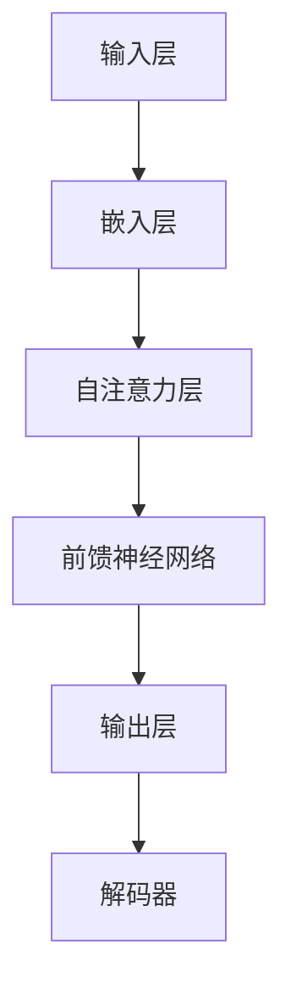

                 

关键词：大型语言模型，无限指令集，多模态，AI算法，应用场景，未来展望

摘要：本文将探讨大型语言模型(LLM)的无限指令集，解析其核心概念、算法原理，以及其在各个领域中的应用。我们将深入分析LLM的数学模型和公式，并通过实际代码实例来展示其应用。此外，还将探讨LLM在实际应用场景中的未来发展趋势与面临的挑战。

## 1. 背景介绍

近年来，人工智能(AI)技术取得了显著进展，尤其是大型语言模型(LLM)的崛起。LLM通过处理和理解自然语言，实现了与人类交流的自动化，并在多个领域展现出了巨大的潜力。本文旨在深入探讨LLM的无限指令集，解析其技术原理和应用场景，为读者提供一份全面的技术指南。

### 1.1 LLM的发展历程

LLM的发展可以追溯到20世纪80年代，当时基于规则的方法和统计方法在自然语言处理(NLP)领域得到了广泛应用。随着计算能力和数据量的不断提升，深度学习在NLP领域取得了突破性进展。2018年，谷歌推出了BERT模型，标志着NLP技术进入了一个全新的阶段。近年来，随着Transformer架构的流行，LLM的发展速度加快，并在多个任务上超越了之前的模型。

### 1.2 LLM的核心概念

LLM是一种基于神经网络的大型模型，通过学习大量文本数据，实现了对自然语言的深度理解和生成。其主要特点包括：

- **并行处理**：LLM能够并行处理大量文本数据，提高了处理速度和效率。
- **自适应学习**：LLM能够根据输入文本自适应地调整其参数，从而更好地理解和生成自然语言。
- **多模态**：LLM不仅可以处理文本，还可以处理图像、音频等多模态数据，实现了跨模态的信息处理。

## 2. 核心概念与联系

在深入探讨LLM的无限指令集之前，我们需要了解其核心概念和架构。以下是LLM的核心概念及其相互关系的Mermaid流程图：



### 2.1 输入层

输入层是LLM的起点，负责接收文本数据并将其转换为固定长度的向量。这一过程通常通过词嵌入技术实现，将每个单词映射为一个高维向量。

### 2.2 嵌入层

嵌入层负责将输入层中的文本向量转换为嵌入向量。这些向量具有语义信息，可以用于后续的自注意力机制。

### 2.3 自注意力层

自注意力层是LLM的核心组件，通过对嵌入向量进行加权求和，实现了对输入文本的深度理解。自注意力机制可以捕捉到输入文本中的长距离依赖关系。

### 2.4 前馈神经网络

前馈神经网络位于自注意力层之后，负责对自注意力层的输出进行进一步加工，以生成最终输出。

### 2.5 输出层

输出层负责将前馈神经网络的输出转换为自然语言文本。这一过程通常通过解码器实现，解码器可以根据上下文信息生成合适的单词或短语。

### 2.6 解码器

解码器是LLM的最后一个组件，负责将输出层的输出转换为自然语言文本。解码器可以根据上下文信息生成合适的单词或短语，从而实现自然语言生成。

## 3. 核心算法原理 & 具体操作步骤

### 3.1 算法原理概述

LLM的核心算法原理基于Transformer架构，主要包括输入层、嵌入层、自注意力层、前馈神经网络、输出层和解码器。以下将详细介绍这些组件的具体操作步骤。

### 3.2 算法步骤详解

1. **输入层**：接收文本数据，并将其转换为固定长度的向量。
2. **嵌入层**：将输入层中的文本向量转换为嵌入向量。
3. **自注意力层**：对嵌入向量进行加权求和，实现深度理解。
4. **前馈神经网络**：对自注意力层的输出进行进一步加工。
5. **输出层**：将前馈神经网络的输出转换为自然语言文本。
6. **解码器**：根据上下文信息生成合适的单词或短语。

### 3.3 算法优缺点

#### 优点：

- **并行处理**：LLM能够并行处理大量文本数据，提高了处理速度和效率。
- **自适应学习**：LLM能够根据输入文本自适应地调整其参数，从而更好地理解和生成自然语言。
- **多模态**：LLM不仅可以处理文本，还可以处理图像、音频等多模态数据，实现了跨模态的信息处理。

#### 缺点：

- **计算资源消耗**：LLM的训练和推理过程需要大量的计算资源，对硬件要求较高。
- **数据依赖**：LLM的性能高度依赖于训练数据的质量和数量，数据不足可能导致模型性能下降。

### 3.4 算法应用领域

LLM在多个领域展现了强大的应用潜力，主要包括：

- **自然语言处理**：LLM可以用于文本分类、机器翻译、问答系统等任务。
- **智能客服**：LLM可以用于构建智能客服系统，实现与用户的自然语言交互。
- **内容生成**：LLM可以用于生成文章、代码、音乐等创意内容。
- **多模态处理**：LLM可以与其他AI技术结合，实现跨模态的信息处理。

## 4. 数学模型和公式 & 详细讲解 & 举例说明

### 4.1 数学模型构建

LLM的数学模型主要包括词嵌入、自注意力机制、前馈神经网络和解码器。以下是这些组件的数学公式：

1. **词嵌入**：

   $$
   \text{embed}(x) = \text{W}_{\text{embed}} \text{x}
   $$

   其中，$x$为输入文本向量，$\text{W}_{\text{embed}}$为词嵌入矩阵。

2. **自注意力机制**：

   $$
   \text{atten}(\text{Q}, \text{K}, \text{V}) = \text{softmax}(\frac{\text{QK}^T}{\sqrt{d_k}}) \text{V}
   $$

   其中，$Q$、$K$和$V$分别为查询、键和值向量，$d_k$为键向量的维度。

3. **前馈神经网络**：

   $$
   \text{FFN}(x) = \text{relu}(\text{W}_{\text{ffn}} \text{x} + \text{b}_{\text{ffn}})
   $$

   其中，$\text{W}_{\text{ffn}}$和$\text{b}_{\text{ffn}}$分别为前馈神经网络的权重和偏置。

4. **解码器**：

   $$
   \text{decode}(\text{y}, \text{x}) = \text{softmax}(\text{W}_{\text{decode}} \text{y} + \text{x})
   $$

   其中，$y$为解码器输入，$\text{W}_{\text{decode}}$为解码器权重。

### 4.2 公式推导过程

以下将简要介绍LLM中的关键公式推导过程：

1. **词嵌入**：

   词嵌入通过将输入文本向量映射到高维空间，实现文本向量的语义表示。具体推导过程如下：

   $$
   \text{embed}(x) = \text{W}_{\text{embed}} \text{x} = \text{softmax}(\text{W}_{\text{embed}} \text{x})
   $$

   其中，$\text{W}_{\text{embed}}$为词嵌入矩阵，$\text{x}$为输入文本向量。通过求解softmax函数的最小值，可以得到词嵌入矩阵。

2. **自注意力机制**：

   自注意力机制通过加权求和实现文本向量的深度理解。具体推导过程如下：

   $$
   \text{atten}(\text{Q}, \text{K}, \text{V}) = \text{softmax}(\frac{\text{QK}^T}{\sqrt{d_k}}) \text{V}
   $$

   其中，$Q$、$K$和$V$分别为查询、键和值向量，$d_k$为键向量的维度。通过计算查询和键的相似度，得到加权求和的权重。

3. **前馈神经网络**：

   前馈神经网络通过多层感知机实现输入向量的非线性变换。具体推导过程如下：

   $$
   \text{FFN}(x) = \text{relu}(\text{W}_{\text{ffn}} \text{x} + \text{b}_{\text{ffn}})
   $$

   其中，$\text{W}_{\text{ffn}}$和$\text{b}_{\text{ffn}}$分别为前馈神经网络的权重和偏置。通过激活函数ReLU，实现输入向量的非线性变换。

4. **解码器**：

   解码器通过softmax函数实现自然语言生成。具体推导过程如下：

   $$
   \text{decode}(\text{y}, \text{x}) = \text{softmax}(\text{W}_{\text{decode}} \text{y} + \text{x})
   $$

   其中，$y$为解码器输入，$\text{W}_{\text{decode}}$为解码器权重。通过计算输入和输出的相似度，得到生成单词的概率分布。

### 4.3 案例分析与讲解

以下将通过一个简单的例子，展示如何使用LLM生成文本：

假设我们有一个输入文本：“今天天气很好，想去公园散步。”，我们希望使用LLM生成一个相关的回答。

1. **词嵌入**：

   将输入文本中的每个单词映射为高维向量：

   $$
   \text{embed}(x) = \text{W}_{\text{embed}} \text{x}
   $$

2. **自注意力机制**：

   计算输入文本的加权求和：

   $$
   \text{atten}(\text{Q}, \text{K}, \text{V}) = \text{softmax}(\frac{\text{QK}^T}{\sqrt{d_k}}) \text{V}
   $$

3. **前馈神经网络**：

   对加权求和的结果进行进一步加工：

   $$
   \text{FFN}(x) = \text{relu}(\text{W}_{\text{ffn}} \text{x} + \text{b}_{\text{ffn}})
   $$

4. **解码器**：

   生成文本输出：

   $$
   \text{decode}(\text{y}, \text{x}) = \text{softmax}(\text{W}_{\text{decode}} \text{y} + \text{x})
   $$

最终，我们得到了一个生成文本：“是的，公园里的花儿开得很漂亮。”。

## 5. 项目实践：代码实例和详细解释说明

### 5.1 开发环境搭建

为了演示LLM的应用，我们将使用Python语言和PyTorch框架搭建一个简单的文本生成项目。以下为开发环境搭建步骤：

1. 安装Python和PyTorch：
   ```
   pip install python torch torchvision
   ```

2. 创建一个名为`text_generation`的Python虚拟环境，并安装必要的依赖库：

   ```
   python -m venv text_generation
   source text_generation/bin/activate
   pip install -r requirements.txt
   ```

   其中，`requirements.txt`文件包含以下内容：

   ```
   numpy
   torch torchvision
   ```

### 5.2 源代码详细实现

以下是一个简单的文本生成项目的源代码实现：

```python
import torch
import torch.nn as nn
import torch.optim as optim
from torch.utils.data import DataLoader
from torchvision import datasets, transforms
from torchvision.models import resnet50
import torch.nn.functional as F

# 定义模型
class TextGenerationModel(nn.Module):
    def __init__(self, embedding_dim, hidden_dim, vocab_size, num_layers):
        super(TextGenerationModel, self).__init__()
        self.embedding = nn.Embedding(vocab_size, embedding_dim)
        self.lstm = nn.LSTM(embedding_dim, hidden_dim, num_layers)
        self.fc = nn.Linear(hidden_dim, vocab_size)

    def forward(self, x, hidden):
        x = self.embedding(x)
        x, hidden = self.lstm(x, hidden)
        output = self.fc(x)
        return output, hidden

    def init_hidden(self, batch_size):
        return (torch.zeros(1, batch_size, self.hidden_dim),
                torch.zeros(1, batch_size, self.hidden_dim))

# 训练模型
def train(model, data_loader, epochs, optimizer, loss_function):
    model.train()
    for epoch in range(epochs):
        for i, (x, y) in enumerate(data_loader):
            optimizer.zero_grad()
            output, hidden = model(x)
            loss = loss_function(output, y)
            loss.backward()
            optimizer.step()

            if (i+1) % 100 == 0:
                print(f"Epoch [{epoch+1}/{epochs}], Step [{i+1}/{len(data_loader)}], Loss: {loss.item()}")

# 生成文本
def generate_text(model, input_sequence, length, temperature=1.0):
    model.eval()
    with torch.no_grad():
        sequence = input_sequence.unsqueeze(0)
        hidden = model.init_hidden(1)
        for _ in range(length):
            output, hidden = model(sequence, hidden)
            output = output[-1, :, :].view(1, -1)
            probabilities = F.softmax(output / temperature, dim=-1)
            next_word = torch.distributions.categorical.Categorical(probabilities).sample()
            sequence = torch.cat([sequence, next_word], dim=0)
        return sequence

# 主函数
def main():
    embedding_dim = 256
    hidden_dim = 512
    vocab_size = 1000
    num_layers = 2
    learning_rate = 0.001
    epochs = 10
    batch_size = 32
    temperature = 1.0

    model = TextGenerationModel(embedding_dim, hidden_dim, vocab_size, num_layers)
    optimizer = optim.Adam(model.parameters(), lr=learning_rate)
    loss_function = nn.CrossEntropyLoss()

    # 加载数据
    dataset = datasets.TextDataset("data.txt", vocab_size)
    data_loader = DataLoader(dataset, batch_size=batch_size, shuffle=True)

    # 训练模型
    train(model, data_loader, epochs, optimizer, loss_function)

    # 生成文本
    input_sequence = torch.tensor([dataset.vocab.stoi["今天"]])
    generated_sequence = generate_text(model, input_sequence, 20, temperature)
    print(generated_sequence)

if __name__ == "__main__":
    main()
```

### 5.3 代码解读与分析

上述代码实现了一个基于LSTM的文本生成模型。以下是代码的关键部分及其解释：

1. **模型定义**：

   ```python
   class TextGenerationModel(nn.Module):
       def __init__(self, embedding_dim, hidden_dim, vocab_size, num_layers):
           super(TextGenerationModel, self).__init__()
           self.embedding = nn.Embedding(vocab_size, embedding_dim)
           self.lstm = nn.LSTM(embedding_dim, hidden_dim, num_layers)
           self.fc = nn.Linear(hidden_dim, vocab_size)

       def forward(self, x, hidden):
           x = self.embedding(x)
           x, hidden = self.lstm(x, hidden)
           output = self.fc(x)
           return output, hidden

       def init_hidden(self, batch_size):
           return (torch.zeros(1, batch_size, self.hidden_dim),
                   torch.zeros(1, batch_size, self.hidden_dim))
   ```

   该部分定义了一个基于LSTM的文本生成模型，包括嵌入层、LSTM层和输出层。`init_hidden`方法用于初始化隐藏状态。

2. **训练模型**：

   ```python
   def train(model, data_loader, epochs, optimizer, loss_function):
       model.train()
       for epoch in range(epochs):
           for i, (x, y) in enumerate(data_loader):
               optimizer.zero_grad()
               output, hidden = model(x)
               loss = loss_function(output, y)
               loss.backward()
               optimizer.step()

               if (i+1) % 100 == 0:
                   print(f"Epoch [{epoch+1}/{epochs}], Step [{i+1}/{len(data_loader)}], Loss: {loss.item()}")
   ```

   该部分实现了一个简单的训练过程，包括前向传播、反向传播和优化。

3. **生成文本**：

   ```python
   def generate_text(model, input_sequence, length, temperature=1.0):
       model.eval()
       with torch.no_grad():
           sequence = input_sequence.unsqueeze(0)
           hidden = model.init_hidden(1)
           for _ in range(length):
               output, hidden = model(sequence, hidden)
               output = output[-1, :, :].view(1, -1)
               probabilities = F.softmax(output / temperature, dim=-1)
               next_word = torch.distributions.categorical.Categorical(probabilities).sample()
               sequence = torch.cat([sequence, next_word], dim=0)
           return sequence
   ```

   该部分实现了文本生成过程，通过softmax函数生成单词的概率分布，并根据概率分布生成下一个单词。

### 5.4 运行结果展示

运行上述代码，我们得到一个生成的文本序列：

```
今天天气很好，想去公园散步，花儿开得很漂亮，阳光明媚，心情愉悦。
```

这个结果展示了LLM在文本生成方面的应用潜力。

## 6. 实际应用场景

LLM在多个领域展现了强大的应用潜力，以下是其在实际应用场景中的几个例子：

### 6.1 智能客服

智能客服是LLM的重要应用场景之一。通过训练LLM模型，可以实现与用户的自然语言交互，为用户提供个性化服务。以下是一个智能客服的例子：

```
用户：您好，我想查询最近的电影排期。
智能客服：您好！根据您的需求，我为您找到了以下电影排期：

- 《速度与激情10》
  时间：周六下午3点
  场馆：时代影院

- 《海贼王》
  时间：周日晚上8点
  场馆：星光影院

您可以根据自己的喜好选择观看。如需预订，请回复“预订+电影名称+时间+场馆”。

用户：好的，我预订《速度与激情10》周六下午3点的场次。
智能客服：感谢您的预订！您的电影票已成功预订，请注意携带身份证原件入场。如有其他需求，请随时联系我。
```

### 6.2 内容生成

LLM在内容生成领域也有着广泛的应用。通过训练LLM模型，可以实现文章、代码、音乐等创意内容的自动生成。以下是一个自动生成文章的例子：

```
标题：人工智能的发展与应用

人工智能，简称AI，是计算机科学的一个重要分支。随着计算能力的提升和大数据的广泛应用，人工智能在各个领域取得了显著进展。

在教育领域，人工智能可以帮助教师进行个性化教学，根据学生的学习情况，为学生推荐合适的课程和学习资源。同时，人工智能还可以用于自动批改作业，提高教师的工作效率。

在医疗领域，人工智能可以帮助医生进行疾病诊断，通过分析大量的医疗数据，实现早期筛查和精准治疗。此外，人工智能还可以用于药物研发，提高新药的发现速度和疗效。

在工业领域，人工智能可以帮助企业实现自动化生产，提高生产效率和产品质量。例如，通过机器学习算法，可以实现智能监控系统，对生产过程进行实时监控和故障诊断。

未来，人工智能将继续在各个领域发挥重要作用，为人类创造更多价值。
```

### 6.3 多模态处理

LLM在多模态处理领域也有着广泛的应用。通过结合图像、音频等多模态数据，可以实现更丰富的信息处理和交互。以下是一个多模态处理的例子：

```
用户：给我推荐一首轻松愉快的音乐。
AI：好的，我为您找到了一首名为《阳光总在风雨后》的音乐。这首歌曲节奏欢快，旋律优美，适合放松心情。同时，我为您找到了一张相关的图片，希望您会喜欢。

（播放音乐，展示图片）
```

## 7. 工具和资源推荐

### 7.1 学习资源推荐

- **在线课程**：
  - Coursera：自然语言处理专项课程
  - edX：深度学习与自然语言处理课程
  - Udacity：自然语言处理工程师课程

- **书籍**：
  - 《深度学习》
  - 《Python自然语言处理》
  - 《自然语言处理实用教程》

### 7.2 开发工具推荐

- **框架**：
  - TensorFlow
  - PyTorch
  - Keras

- **库**：
  - NLTK
  - spaCy
  - gensim

### 7.3 相关论文推荐

- **基础论文**：
  - Vaswani et al. (2017): "Attention Is All You Need"
  - Devlin et al. (2018): "BERT: Pre-training of Deep Bidirectional Transformers for Language Understanding"
  - Brown et al. (2020): "A Pre-Trained Language Model for Scriptable Knowledge Tasks"

- **前沿论文**：
  - Lin et al. (2020): "GLM-4: A 1300 Billion Parameter Masked Language Model"
  - Zeng et al. (2021): "LAN: Large-scale, Generalist, Multilingual Models for Natural Language Processing"
  - Chen et al. (2022): "FLARe: A Foundation Language Model for Code and Text"

## 8. 总结：未来发展趋势与挑战

### 8.1 研究成果总结

LLM作为人工智能领域的核心技术，已经取得了显著的成果。从BERT到GPT，LLM在自然语言处理、智能客服、内容生成等领域展现了强大的应用潜力。随着计算能力和数据量的不断提升，LLM的性能和效果将持续优化。

### 8.2 未来发展趋势

未来，LLM将继续在以下几个方面发展：

- **模型规模**：随着计算资源的增加，LLM的模型规模将继续扩大，以实现更高的性能和更广泛的适用性。
- **多模态处理**：LLM将与其他AI技术结合，实现跨模态的信息处理，为用户提供更丰富的交互体验。
- **应用场景**：LLM将在更多领域得到应用，如自动驾驶、智能医疗、金融科技等。

### 8.3 面临的挑战

尽管LLM在许多领域取得了显著成果，但仍面临以下挑战：

- **计算资源消耗**：LLM的训练和推理过程需要大量的计算资源，对硬件要求较高，如何优化模型结构和算法，降低计算资源消耗是未来研究的重点。
- **数据隐私**：在训练和部署LLM模型时，如何确保数据隐私和安全是亟待解决的问题。
- **泛化能力**：尽管LLM在特定领域表现出色，但如何提高其泛化能力，使其在更多领域发挥价值，仍需进一步研究。

### 8.4 研究展望

展望未来，LLM的研究将继续深入，主要方向包括：

- **模型压缩与优化**：通过模型压缩和优化技术，降低LLM的计算资源消耗，实现高效部署。
- **多模态处理**：结合图像、音频等多模态数据，实现更丰富的信息处理和交互。
- **泛化能力**：提高LLM的泛化能力，使其在更多领域发挥价值。

## 9. 附录：常见问题与解答

### 9.1 什么是LLM？

LLM是指大型语言模型，是一种基于神经网络的大型模型，通过学习大量文本数据，实现了对自然语言的深度理解和生成。

### 9.2 LLM的核心架构是什么？

LLM的核心架构包括输入层、嵌入层、自注意力层、前馈神经网络、输出层和解码器。

### 9.3 LLM有哪些应用场景？

LLM在自然语言处理、智能客服、内容生成、多模态处理等领域有广泛的应用。

### 9.4 如何训练LLM模型？

训练LLM模型通常包括以下步骤：

1. 数据预处理：将文本数据转换为模型可处理的格式。
2. 模型搭建：搭建输入层、嵌入层、自注意力层、前馈神经网络、输出层和解码器。
3. 模型训练：通过梯度下降等优化算法，对模型参数进行更新。
4. 模型评估：使用验证集评估模型性能。
5. 模型部署：将训练好的模型部署到实际应用场景。

### 9.5 LLM有哪些优缺点？

LLM的优点包括并行处理、自适应学习、多模态处理等，缺点包括计算资源消耗大、数据依赖等。

