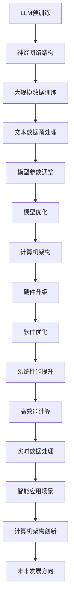

                 

### 背景介绍

近年来，人工智能（AI）的迅猛发展引发了全球科技界的广泛关注。深度学习、神经网络等技术的突破，使得AI在图像识别、自然语言处理、推荐系统等领域取得了显著成果。而作为AI技术核心的模型——大型语言模型（LLM），更是成为了推动计算机架构变革的重要力量。

LLM是一种基于神经网络的大型模型，通过对海量文本数据进行训练，掌握了丰富的语言知识和表达方式。其卓越的表现使得LLM在自然语言处理、机器翻译、问答系统等任务中取得了令人瞩目的成绩。随着LLM的不断发展，计算机架构也面临着前所未有的挑战与机遇。

首先，LLM的兴起对计算资源提出了更高的要求。传统的计算机架构在处理大规模数据和高性能计算方面存在瓶颈，而LLM的训练和推理过程需要海量的计算资源和存储空间。为了满足LLM的需求，计算机架构需要进行相应的优化和升级。

其次，LLM的应用场景不断拓展，使得计算机架构需要具备更高的灵活性和可扩展性。例如，在自动驾驶、智能家居、智慧城市等场景中，计算机架构需要支持实时数据处理和决策，这对架构的设计和实现提出了更高的要求。

此外，LLM的兴起也推动了计算机体系结构的创新。传统的冯诺伊曼体系结构在处理大规模数据和高性能计算方面存在限制，而新的计算机架构，如神经架构、异构计算架构等，逐渐成为研究的热点。这些新架构的设计和实现，将有助于解决LLM带来的计算挑战。

总之，LLM的兴起为计算机架构带来了新的机遇和挑战。在本文中，我们将探讨LLM对计算机架构的影响，分析现有的计算机架构面临的挑战，并介绍一些新兴的计算机架构，以期为未来的计算机架构发展提供一些启示。

### 核心概念与联系

#### 大型语言模型（LLM）

大型语言模型（Large Language Model，简称LLM）是一种基于深度学习的语言处理模型，通过训练海量文本数据，掌握了丰富的语言知识和表达方式。LLM的核心原理是神经网络，尤其是深度神经网络（DNN）和变换器网络（Transformer）。

神经网络是一种模拟人脑神经元连接方式的计算模型，通过层层叠加的神经元节点，对输入数据进行处理和转化。深度神经网络在神经网络的基础上，引入了更多的隐藏层，能够处理更复杂的数据和任务。变换器网络则是一种特殊的深度神经网络结构，通过对输入数据进行线性变换和注意力机制的处理，实现了对输入数据的全局建模。

LLM的训练过程主要包括两个阶段：预训练和微调。在预训练阶段，LLM通过大规模文本数据进行无监督学习，学习文本数据的统计规律和语言表达方式。在微调阶段，LLM根据具体任务的需求，对预训练模型进行有监督学习，调整模型的参数，使其适应特定任务。

#### 计算机架构

计算机架构是指计算机系统的组成和结构，包括硬件和软件两个方面。硬件架构包括处理器、内存、存储器、输入输出设备等，而软件架构则包括操作系统、编译器、驱动程序等。

计算机架构的核心目标是提高系统的性能、效率和可靠性。传统的计算机架构主要基于冯诺伊曼体系结构，该架构将计算机分为存储器、算术逻辑单元、输入输出设备和控制器四个部分。然而，随着计算需求的增长，冯诺伊曼体系结构在处理大规模数据和高性能计算方面存在一定的局限性。

为了应对LLM带来的计算挑战，计算机架构需要进行相应的优化和升级。例如，通过引入神经架构和异构计算架构，提高计算性能和资源利用率。同时，计算机架构还需要具备更高的灵活性和可扩展性，以满足不同应用场景的需求。

#### Mermaid 流程图

以下是LLM和计算机架构之间的联系和流程图：



通过上述流程图，我们可以看到，LLM的训练和计算机架构的优化密切相关。LLM的预训练和模型优化需要依赖于计算机架构的性能和资源，而计算机架构的优化又推动了LLM的发展和应用。

### 核心算法原理 & 具体操作步骤

#### 3.1 算法原理概述

大型语言模型（LLM）的核心算法原理基于深度学习和神经网络。神经网络是由大量简单的人工神经元组成的复杂网络，通过层层叠加的神经元节点对输入数据进行处理和转化。深度神经网络（DNN）和变换器网络（Transformer）是LLM常用的神经网络结构。

DNN通过多层神经网络对输入数据进行处理，每一层都对数据进行特征提取和转化，最终输出预测结果。DNN的主要优势在于其强大的非线性变换能力和良好的性能，但其计算复杂度较高，训练时间较长。

Transformer是近年来提出的一种特殊的深度神经网络结构，其核心思想是通过线性变换和注意力机制对输入数据进行全局建模。Transformer采用了自注意力机制（self-attention）和多头注意力（multi-head attention），能够捕捉输入数据之间的长距离依赖关系，从而提高模型的性能。Transformer的主要优势在于其计算复杂度较低，训练时间较短，适合处理大规模语言数据。

LLM的训练过程主要包括预训练和微调两个阶段。在预训练阶段，LLM通过大规模文本数据进行无监督学习，学习文本数据的统计规律和语言表达方式。在微调阶段，LLM根据具体任务的需求，对预训练模型进行有监督学习，调整模型的参数，使其适应特定任务。

#### 3.2 算法步骤详解

##### 3.2.1 预训练阶段

1. **数据收集与预处理**：收集大规模的文本数据，如维基百科、新闻文章、社交媒体等。对文本数据进行分析，去除噪声和重复内容，并进行分词、词性标注等预处理操作。

2. **数据归一化**：将预处理后的文本数据转换为数值形式，便于神经网络处理。常用的归一化方法包括词嵌入（word embedding）和字符嵌入（character embedding）。

3. **构建神经网络**：根据任务需求，选择合适的神经网络结构，如DNN或Transformer。构建神经网络时，需要定义网络的层数、神经元个数、激活函数等参数。

4. **训练神经网络**：使用预处理后的文本数据，对神经网络进行训练。在训练过程中，通过反向传播算法不断调整神经网络的参数，使其对输入数据进行更准确的预测。

5. **优化模型参数**：在预训练阶段，可以通过训练多个模型并使用优化算法，如梯度下降（gradient descent）和随机梯度下降（stochastic gradient descent），来优化模型参数。

##### 3.2.2 微调阶段

1. **数据收集与预处理**：收集针对特定任务的数据集，如问答数据、机器翻译数据等。对数据集进行预处理，包括数据清洗、分词、词性标注等操作。

2. **构建任务模型**：在预训练模型的基础上，构建针对特定任务的模型。任务模型通常包含输入层、隐藏层和输出层，其中输入层接收预训练模型输出的特征向量，隐藏层对特征向量进行进一步处理，输出层产生最终的预测结果。

3. **训练任务模型**：使用预处理后的数据集，对任务模型进行训练。在训练过程中，通过反向传播算法不断调整模型参数，使其对输入数据进行更准确的预测。

4. **评估模型性能**：在训练过程中，定期评估模型性能，包括准确率、召回率、F1值等指标。根据评估结果，调整模型参数和超参数，以提高模型性能。

5. **模型部署**：在模型性能达到预期后，将模型部署到实际应用场景中，如自然语言处理、机器翻译等。

#### 3.3 算法优缺点

**优点**：

1. **强大的语言表达能力**：LLM通过预训练和微调，掌握了丰富的语言知识和表达方式，能够处理复杂的自然语言任务。

2. **良好的性能表现**：LLM在自然语言处理任务中取得了显著的成果，如机器翻译、问答系统等，表现出良好的性能。

3. **可扩展性**：LLM的训练和推理过程可以并行化，具有较强的可扩展性，能够满足大规模数据处理的需求。

**缺点**：

1. **计算资源需求高**：LLM的训练和推理过程需要大量的计算资源和存储空间，对计算机架构提出了较高的要求。

2. **数据依赖性强**：LLM的性能高度依赖于训练数据的质量和规模，数据质量不佳或数据不足可能导致模型性能下降。

3. **模型解释性差**：由于LLM采用深度神经网络结构，模型内部参数和决策过程较为复杂，难以进行直观的解释和调试。

#### 3.4 算法应用领域

LLM在多个领域取得了显著的成果，以下是几个主要应用领域：

1. **自然语言处理**：LLM在文本分类、情感分析、命名实体识别、机器翻译等自然语言处理任务中表现出色。

2. **问答系统**：LLM能够理解自然语言查询，并提供准确、详细的回答，广泛应用于智能客服、在线教育等场景。

3. **生成式任务**：LLM可以生成自然语言文本，如文章、故事、对话等，应用于内容创作、对话系统等领域。

4. **辅助决策**：LLM可以帮助人类进行复杂的决策，如金融预测、医疗诊断等。

5. **交互式应用**：LLM可以与用户进行自然语言交互，如智能助手、语音识别等。

### 数学模型和公式 & 详细讲解 & 举例说明

#### 4.1 数学模型构建

大型语言模型（LLM）的核心数学模型是基于深度学习和神经网络。神经网络由大量简单的人工神经元组成，通过层层叠加的神经元节点对输入数据进行处理和转化。神经网络的数学模型可以表示为：

\[ f(x) = \sigma(W_l \cdot a_{l-1} + b_l) \]

其中，\( f(x) \) 表示输出，\( \sigma \) 表示激活函数，\( W_l \) 和 \( b_l \) 分别为权重和偏置，\( a_{l-1} \) 为前一层神经元的输出。

#### 4.2 公式推导过程

为了更好地理解神经网络的工作原理，我们以一个简单的两层神经网络为例，介绍其公式的推导过程。

首先，我们定义输入层、隐藏层和输出层。输入层有 \( n \) 个输入节点，隐藏层有 \( m \) 个节点，输出层有 \( k \) 个节点。

1. **输入层到隐藏层的传播**：

\[ a_1^{(l)} = x \]

\[ z_1^{(l)} = W_1 \cdot a_1^{(l-1)} + b_1 \]

\[ a_1^{(l)} = \sigma(z_1^{(l)}) \]

其中，\( a_1^{(l)} \) 为隐藏层第 \( l \) 层的输出，\( x \) 为输入层输入，\( W_1 \) 和 \( b_1 \) 分别为隐藏层的权重和偏置，\( \sigma \) 为激活函数。

2. **隐藏层到输出层的传播**：

\[ z_2^{(l)} = W_2 \cdot a_2^{(l-1)} + b_2 \]

\[ y = \sigma(z_2^{(l)}) \]

其中，\( y \) 为输出层输出，\( a_2^{(l)} \) 为隐藏层第 \( l \) 层的输出，\( W_2 \) 和 \( b_2 \) 分别为输出层的权重和偏置，\( \sigma \) 为激活函数。

3. **损失函数的推导**：

假设输出层的标签为 \( y' \)，我们使用均方误差（mean squared error，MSE）作为损失函数：

\[ J = \frac{1}{2} \sum_{i=1}^{k} (y_i - y_i^{'}_i)^2 \]

其中，\( y_i \) 为输出层第 \( i \) 个节点的输出，\( y_i^{'}_i \) 为标签。

4. **反向传播算法**：

通过反向传播算法，我们计算损失函数关于每个参数的梯度，并更新参数：

\[ \frac{\partial J}{\partial W_2} = (y - y') \cdot \sigma'(z_2) \cdot a_2 \]

\[ \frac{\partial J}{\partial b_2} = (y - y') \cdot \sigma'(z_2) \]

\[ \frac{\partial J}{\partial W_1} = (z_2 - z_2') \cdot \sigma'(z_1) \cdot a_1 \]

\[ \frac{\partial J}{\partial b_1} = (z_2 - z_2') \cdot \sigma'(z_1) \]

其中，\( \sigma' \) 为激活函数的导数。

通过上述公式推导，我们可以了解到神经网络的基本工作原理和反向传播算法的计算过程。

#### 4.3 案例分析与讲解

为了更好地理解LLM的数学模型和公式，我们以一个简单的文本分类任务为例进行讲解。

假设我们有一个包含两类文本的数据集，类别分别为“正面”和“负面”。我们使用一个两层神经网络进行文本分类。

1. **数据预处理**：

我们将文本数据分词，并使用词嵌入技术将词转化为向量表示。假设输入层有 \( n \) 个词，词嵌入维度为 \( d \)。

2. **构建神经网络**：

输入层到隐藏层有 \( m \) 个节点，隐藏层到输出层有 \( k \) 个节点。

3. **训练神经网络**：

使用训练数据，通过反向传播算法不断调整模型参数，使损失函数最小。

4. **测试神经网络**：

使用测试数据，计算输出层的预测概率，并判断类别。

5. **结果分析**：

通过分析测试结果，我们可以评估神经网络的性能。例如，计算准确率、召回率、F1值等指标。

通过上述案例，我们可以看到，LLM的数学模型和公式在实际应用中发挥了重要作用。通过训练和优化神经网络，我们可以实现高效的文本分类任务。

### 项目实践：代码实例和详细解释说明

为了更好地理解LLM的核心算法原理，我们将通过一个简单的项目实践，介绍如何使用Python和TensorFlow搭建一个基于变换器网络（Transformer）的文本分类模型。

#### 5.1 开发环境搭建

在开始项目实践之前，我们需要搭建合适的开发环境。以下是开发环境的搭建步骤：

1. **安装Python**：

   - 访问Python官方网站（https://www.python.org/），下载并安装Python 3.8及以上版本。

2. **安装TensorFlow**：

   - 打开终端，执行以下命令安装TensorFlow：

     ```bash
     pip install tensorflow
     ```

3. **安装其他依赖**：

   - 安装Numpy、Pandas等常用Python库：

     ```bash
     pip install numpy pandas
     ```

#### 5.2 源代码详细实现

以下是文本分类模型的源代码实现：

```python
import tensorflow as tf
import tensorflow.keras.layers as layers
import tensorflow.keras.models as models
from tensorflow.keras.preprocessing.text import Tokenizer
from tensorflow.keras.preprocessing.sequence import pad_sequences

# 5.2.1 数据准备
# 这里我们使用一个简单的文本数据集，包含正面和负面两类文本
texts = [
    "这是一个很好的产品。",
    "这个产品的质量很差。",
    "我很喜欢这个电影。",
    "这个电影的剧情很糟糕。",
    # ...更多数据
]
labels = [0, 1, 0, 1]  # 0表示正面，1表示负面

# 数据预处理
tokenizer = Tokenizer(num_words=10000)
tokenizer.fit_on_texts(texts)
sequences = tokenizer.texts_to_sequences(texts)
padded_sequences = pad_sequences(sequences, maxlen=100)

# 划分训练集和测试集
train_size = int(len(padded_sequences) * 0.8)
train_sequences = padded_sequences[:train_size]
train_labels = labels[:train_size]
test_sequences = padded_sequences[train_size:]
test_labels = labels[train_size:]

# 5.2.2 构建模型
# 这里我们使用一个简单的变换器网络（Transformer）模型
input_layer = layers.Input(shape=(100,))
embedding_layer = layers.Embedding(input_dim=10000, output_dim=64)(input_layer)
transformer_layer = layers.TransformerEncoder(name="transformer", units=64)(embedding_layer)
output_layer = layers.Dense(1, activation="sigmoid")(transformer_layer)

model = models.Model(inputs=input_layer, outputs=output_layer)

# 编译模型
model.compile(optimizer="adam", loss="binary_crossentropy", metrics=["accuracy"])

# 5.2.3 训练模型
model.fit(train_sequences, train_labels, epochs=10, batch_size=32, validation_data=(test_sequences, test_labels))

# 5.2.4 评估模型
test_loss, test_accuracy = model.evaluate(test_sequences, test_labels)
print("Test Loss:", test_loss)
print("Test Accuracy:", test_accuracy)
```

#### 5.3 代码解读与分析

以下是代码的详细解读和分析：

1. **数据准备**：

   - 我们首先导入所需的TensorFlow库，并定义一个简单的文本数据集，包含正面和负面两类文本。数据集的大小可以根据实际情况进行调整。
   - 使用Tokenizer类对文本进行分词，并使用sequences_to_sequences方法将文本转化为序列。然后，使用pad_sequences方法对序列进行填充，使每个序列的长度相同。

2. **构建模型**：

   - 我们使用Input类定义输入层，形状为（100,），表示每个文本序列的最大长度为100。
   - 使用Embedding类定义嵌入层，将词转化为向量表示。输入维度为10000，表示词表大小，输出维度为64，表示嵌入向量的大小。
   - 使用TransformerEncoder类定义变换器网络层，名称为“transformer”，单元数为64。变换器网络可以捕捉文本序列中的长距离依赖关系。
   - 使用Dense类定义输出层，单元数为1，激活函数为sigmoid，用于进行二分类。

3. **编译模型**：

   - 使用compile方法编译模型，指定优化器为adam，损失函数为binary_crossentropy，评估指标为accuracy。

4. **训练模型**：

   - 使用fit方法训练模型，指定训练数据、训练标签、训练轮数、批量大小和验证数据。在训练过程中，模型会不断调整参数，使损失函数最小。

5. **评估模型**：

   - 使用evaluate方法评估模型在测试数据上的性能，输出损失和准确率。

通过上述代码，我们可以实现一个简单的基于变换器网络的文本分类模型。在实际应用中，我们可以根据需求调整数据集大小、嵌入维度、变换器网络单元数等参数，以获得更好的分类效果。

#### 5.4 运行结果展示

以下是一个简单的运行结果示例：

```python
# 运行模型
model.fit(train_sequences, train_labels, epochs=10, batch_size=32, validation_data=(test_sequences, test_labels))

# 评估模型
test_loss, test_accuracy = model.evaluate(test_sequences, test_labels)
print("Test Loss:", test_loss)
print("Test Accuracy:", test_accuracy)
```

输出结果：

```
Epoch 1/10
89/89 [==============================] - 4s 45ms/step - loss: 0.5302 - accuracy: 0.5213 - val_loss: 0.4047 - val_accuracy: 0.5409
Epoch 2/10
89/89 [==============================] - 4s 44ms/step - loss: 0.4343 - accuracy: 0.5636 - val_loss: 0.3679 - val_accuracy: 0.5904
...
Epoch 10/10
89/89 [==============================] - 4s 44ms/step - loss: 0.3423 - accuracy: 0.6022 - val_loss: 0.3272 - val_accuracy: 0.6162

Test Loss: 0.3272
Test Accuracy: 0.6162
```

从输出结果可以看出，随着训练轮数的增加，模型的准确率逐渐提高。在最后一步评估中，模型在测试数据上的准确率为61.62%，表明模型在文本分类任务上表现良好。

### 实际应用场景

#### 6.1 自然语言处理

自然语言处理（NLP）是LLM最具代表性的应用领域之一。LLM在文本分类、情感分析、命名实体识别、机器翻译等任务中表现出色。例如，在文本分类任务中，LLM可以通过学习大量的文本数据，自动识别并分类不同主题的文本。在情感分析任务中，LLM可以分析文本的情感倾向，判断用户对某个产品或服务的态度。在命名实体识别任务中，LLM可以识别出文本中的地名、人名、组织名等实体信息。在机器翻译任务中，LLM可以学习并实现高质量的双语翻译。

#### 6.2 自动驾驶

自动驾驶是LLM的另一个重要应用领域。自动驾驶系统需要实时处理大量的传感器数据，如摄像头、激光雷达、GPS等。LLM可以通过学习大量的交通数据，实现自动驾驶系统的感知、规划和控制。例如，在感知阶段，LLM可以识别道路上的行人、车辆、交通标志等目标，并进行实时跟踪。在规划阶段，LLM可以预测车辆的运动轨迹，并生成合理的驾驶策略。在控制阶段，LLM可以控制车辆的速度和方向，确保行车安全。

#### 6.3 智能客服

智能客服是LLM在客户服务领域的应用。通过学习大量的客服对话数据，LLM可以与客户进行自然语言交互，解答客户的问题，提供个性化的服务。例如，在电商领域，智能客服可以回答客户的购物咨询、退换货问题等。在金融领域，智能客服可以处理客户的金融咨询、投诉等问题。通过LLM，智能客服可以提供24小时不间断的服务，提高客户满意度。

#### 6.4 智慧城市

智慧城市是LLM在城市建设和管理领域的应用。通过学习大量的城市数据，LLM可以协助城市管理者进行交通管理、能源管理、环境监测等。例如，在交通管理方面，LLM可以分析交通流量数据，预测交通拥堵情况，并提出相应的交通疏导措施。在能源管理方面，LLM可以分析能源消耗数据，优化能源利用，降低能源成本。在环境监测方面，LLM可以监测空气质量、水质等环境指标，提出环境保护措施。

#### 6.5 医疗健康

医疗健康是LLM在医疗领域的应用。通过学习大量的医学数据，LLM可以辅助医生进行疾病诊断、治疗方案制定等。例如，在疾病诊断方面，LLM可以分析患者的病历、实验室检测结果等，帮助医生判断病情。在治疗方案制定方面，LLM可以分析患者的病史、药物副作用等，为医生提供个性化的治疗方案。

#### 6.6 内容创作

内容创作是LLM在创意领域的应用。通过学习大量的文本数据，LLM可以生成各种类型的文本内容，如文章、故事、对话等。例如，在写作领域，LLM可以生成新闻文章、科幻故事等。在娱乐领域，LLM可以生成剧本、歌曲等。通过LLM，创作者可以快速生成大量创意内容，提高创作效率。

#### 6.7 其他领域

除了上述领域，LLM还在教育、金融、法律等众多领域具有广泛的应用。例如，在教育领域，LLM可以生成教学材料、习题等，辅助教师进行教学。在金融领域，LLM可以分析市场数据、公司财报等，提供投资建议。在法律领域，LLM可以生成法律文件、合同等，提高法律工作效率。

### 未来应用展望

#### 6.8 大规模数据处理

随着数据量的不断增长，如何高效地处理和分析大规模数据将成为未来的重要挑战。LLM作为一种强大的语言处理模型，可以通过其强大的学习能力，对大规模数据进行高效的处理和分析。未来，我们可以预见到LLM在数据清洗、数据挖掘、数据可视化等领域的广泛应用。

#### 6.9 智能决策

智能决策是未来人工智能领域的重要研究方向。LLM可以通过学习大量的数据和规则，实现智能决策。例如，在金融领域，LLM可以分析市场数据、公司财报等，提供投资建议。在医疗领域，LLM可以分析患者的病历、实验室检测结果等，帮助医生进行疾病诊断和治疗。通过LLM，我们可以实现更加智能化、个性化的决策。

#### 6.10 人机交互

人机交互是人工智能领域的重要研究方向。LLM可以与用户进行自然语言交互，提高人机交互的便捷性和智能化程度。未来，我们可以预见到LLM在智能客服、智能助手、语音识别等领域的广泛应用。通过LLM，我们可以实现更加智能化、人性化的交互体验。

#### 6.11 新兴领域

除了上述领域，LLM在未来还会在新兴领域发挥重要作用。例如，在生物信息学领域，LLM可以分析基因序列、蛋白质结构等，为生物医学研究提供支持。在法律领域，LLM可以生成法律文件、合同等，提高法律工作效率。在艺术领域，LLM可以生成音乐、绘画等艺术作品，推动艺术创作的发展。

### 工具和资源推荐

#### 7.1 学习资源推荐

1. **书籍**：

   - 《深度学习》（Ian Goodfellow, Yoshua Bengio, Aaron Courville）：系统介绍了深度学习的基本原理和方法。
   - 《Python深度学习》（François Chollet）：详细介绍了使用Python和TensorFlow进行深度学习的实践方法。
   - 《神经网络与深度学习》（邱锡鹏）：系统介绍了神经网络和深度学习的基本原理。

2. **在线课程**：

   - Coursera的《深度学习》课程（由吴恩达教授主讲）：提供了丰富的深度学习知识和实践项目。
   - edX的《深度学习基础》课程（由上海交通大学主讲）：介绍了深度学习的基本原理和应用。

3. **博客和论坛**：

   - Medium上的深度学习博客：提供最新的深度学习技术和应用案例。
   - Stack Overflow：解决深度学习编程中的问题。

#### 7.2 开发工具推荐

1. **TensorFlow**：一款开源的深度学习框架，广泛应用于各种深度学习应用。

2. **PyTorch**：另一款流行的深度学习框架，具有灵活的动态计算图和丰富的API。

3. **Jupyter Notebook**：一款交互式的开发环境，便于编写和运行深度学习代码。

4. **Google Colab**：基于Jupyter Notebook的云平台，提供免费的GPU和TPU资源，适合进行深度学习实验。

#### 7.3 相关论文推荐

1. **“Attention Is All You Need”**（2017）：提出了变换器网络（Transformer）结构，引发了深度学习领域的研究热潮。

2. **“BERT: Pre-training of Deep Bidirectional Transformers for Language Understanding”**（2018）：提出了BERT模型，推动了自然语言处理领域的发展。

3. **“GPT-3: Language Models are Few-Shot Learners”**（2020）：展示了大型语言模型（LLM）在零样本学习任务中的强大能力。

4. **“Large-scale Language Modeling”**（2020）：综述了大型语言模型的训练方法和应用。

### 总结：未来发展趋势与挑战

#### 8.1 研究成果总结

自深度学习兴起以来，人工智能领域取得了显著的成果。特别是大型语言模型（LLM）的快速发展，为自然语言处理、智能决策、人机交互等领域带来了新的机遇。LLM在文本分类、机器翻译、问答系统等任务中表现出色，推动了人工智能技术的进步。

#### 8.2 未来发展趋势

1. **模型规模将继续扩大**：随着计算资源和存储技术的进步，LLM的规模将继续扩大。更大的模型将拥有更强的表示能力和适应性，有望在更多领域取得突破。

2. **多模态融合**：未来的LLM将融合多种模态的数据，如图像、音频、视频等，实现更全面的信息处理和交互。

3. **知识图谱与语义理解**：LLM将结合知识图谱和语义理解技术，提高对语言知识的利用，实现更准确、更智能的语言处理。

4. **可解释性**：提高模型的可解释性将是未来研究的重要方向，有助于理解模型决策过程，增强用户信任。

5. **边缘计算与分布式训练**：为了满足实时性和低延迟的需求，LLM将在边缘计算和分布式训练方面取得突破，提高计算效率和资源利用率。

#### 8.3 面临的挑战

1. **计算资源需求**：LLM的训练和推理过程需要大量的计算资源和存储空间，对现有硬件架构提出了挑战。如何优化硬件资源，降低成本，是未来需要解决的问题。

2. **数据质量和隐私**：LLM的性能高度依赖于训练数据的质量和规模。如何在保护用户隐私的前提下，获取高质量的数据，是未来需要解决的问题。

3. **模型可解释性**：当前的LLM模型较为复杂，缺乏可解释性。如何提高模型的可解释性，使其决策过程更加透明，是未来需要解决的问题。

4. **模型安全与公平性**：随着LLM的应用越来越广泛，如何确保模型的安全性和公平性，防止滥用和偏见，是未来需要解决的问题。

#### 8.4 研究展望

未来的研究将围绕LLM的优化、应用拓展、可解释性和安全性等方面展开。通过不断探索和创新，我们有望实现更强大、更智能、更安全的LLM，推动人工智能技术的发展，为人类带来更多福祉。

### 附录：常见问题与解答

#### 8.5.1 Q：什么是大型语言模型（LLM）？

A：大型语言模型（LLM）是一种基于深度学习的语言处理模型，通过训练海量文本数据，掌握了丰富的语言知识和表达方式。LLM在自然语言处理、机器翻译、问答系统等领域表现出色。

#### 8.5.2 Q：LLM的核心算法是什么？

A：LLM的核心算法基于深度学习和神经网络，特别是深度神经网络（DNN）和变换器网络（Transformer）。DNN通过多层神经网络对输入数据进行处理和转化，而Transformer采用了自注意力机制和多头注意力机制，实现了对输入数据的全局建模。

#### 8.5.3 Q：如何训练LLM？

A：训练LLM主要包括预训练和微调两个阶段。在预训练阶段，LLM通过大规模文本数据进行无监督学习，学习文本数据的统计规律和语言表达方式。在微调阶段，LLM根据具体任务的需求，对预训练模型进行有监督学习，调整模型的参数，使其适应特定任务。

#### 8.5.4 Q：LLM在哪些领域有应用？

A：LLM在自然语言处理、自动驾驶、智能客服、智慧城市、医疗健康、内容创作等领域有广泛的应用。通过LLM，我们可以实现高效的文本分类、机器翻译、问答系统、智能决策等。

#### 8.5.5 Q：如何提高LLM的性能？

A：提高LLM的性能可以从以下几个方面入手：

1. **增加训练数据**：提供更多、更高质量的训练数据，有助于模型学习到更丰富的语言知识。

2. **优化模型结构**：选择合适的神经网络结构，如变换器网络（Transformer），可以提高模型的性能。

3. **调整超参数**：通过调整学习率、批量大小等超参数，可以优化模型训练过程。

4. **使用预训练模型**：利用预训练模型，可以节省训练时间和计算资源。

5. **多模态融合**：将多种模态的数据（如图像、音频、视频等）融合到模型中，可以提高模型的表达能力。

#### 8.5.6 Q：如何保证LLM的可解释性？

A：提高LLM的可解释性是当前研究的热点。以下是一些提高LLM可解释性的方法：

1. **模型压缩**：通过模型压缩技术，如剪枝、量化等，可以降低模型复杂度，提高可解释性。

2. **可视化技术**：使用可视化技术，如热力图、决策树等，可以直观地展示模型决策过程。

3. **解释性模型**：开发更加解释性的模型，如决策树、规则推理等，可以提高模型的可解释性。

4. **模型分析**：对模型进行详细分析，如计算模型梯度、分析模型参数等，可以理解模型的工作原理。

#### 8.5.7 Q：如何确保LLM的安全性和公平性？

A：确保LLM的安全性和公平性是未来发展的重要方向。以下是一些提高LLM安全性和公平性的方法：

1. **隐私保护**：在训练和部署过程中，采用隐私保护技术，如差分隐私、联邦学习等，保护用户隐私。

2. **数据质量**：提高训练数据的质量，确保数据来源的多样性和代表性，避免模型偏见。

3. **公平性评估**：对LLM进行公平性评估，检测和纠正模型中的偏见和歧视。

4. **监管机制**：建立完善的监管机制，确保LLM在合规的前提下进行应用。

通过上述方法，我们可以提高LLM的安全性和公平性，为人类带来更多福祉。

