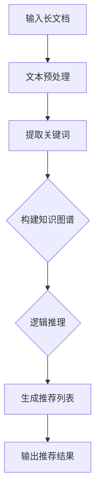
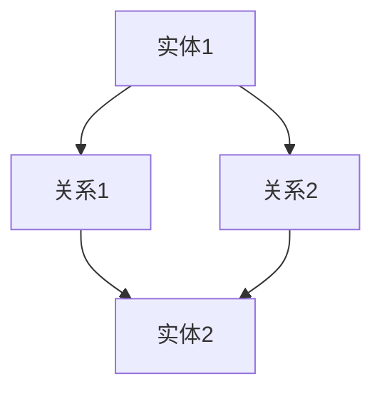

                 

关键词：LLM, 长文档推荐，知识图谱，逻辑推理，语义理解

> 摘要：本文深入探讨了基于大型语言模型（LLM）的长文档推荐系统的构建方法。通过结合知识图谱和逻辑推理，我们提出了一种创新的推荐算法，不仅能够准确提取文档中的关键信息，还能实现高效的文档推荐。本文将详细阐述算法原理、数学模型、项目实践以及实际应用场景，为相关领域的研究者提供有价值的参考。

## 1. 背景介绍

随着互联网信息的爆炸式增长，人们面对海量的长文档，如何快速准确地找到所需信息成为了一大难题。传统的基于关键词的搜索和基于内容的推荐系统，由于对文档的语义理解不足，往往难以满足用户的需求。而近年来，基于大型语言模型（LLM）的技术逐渐崭露头角，为解决这一问题提供了新的思路。

大型语言模型（LLM）如GPT-3、ChatGLM等，具有强大的语义理解能力和语言生成能力，能够从大量文本数据中学习到丰富的知识和逻辑关系。基于这种特性，我们可以利用LLM来构建长文档推荐系统，通过深度理解文档内容，为用户推荐与其兴趣相关的文档。

## 2. 核心概念与联系

### 2.1 知识图谱

知识图谱是一种语义网络，用于表示实体和实体之间的关系。在长文档推荐系统中，知识图谱可以帮助我们提取文档中的关键信息，并将这些信息以结构化的形式表示出来。具体来说，知识图谱中的实体可以是文档中的关键词、概念、人物等，而关系则可以是实体之间的关联、属性等。

### 2.2 逻辑推理

逻辑推理是一种基于逻辑规则和事实的推理过程，可以帮助我们从已知信息推导出新的结论。在长文档推荐系统中，逻辑推理可以用于分析文档内容，提取关键信息，并利用这些信息进行推荐。例如，我们可以通过逻辑推理来识别文档的主题、提取用户兴趣点等。

### 2.3 Mermaid 流程图

下面是一个简单的Mermaid流程图，展示了知识图谱和逻辑推理在长文档推荐系统中的应用流程：



## 3. 核心算法原理 & 具体操作步骤

### 3.1 算法原理概述

我们的长文档推荐算法基于以下核心思想：

1. **文本预处理**：对输入的长文档进行分词、词性标注、实体识别等操作，提取出文档中的关键信息。
2. **构建知识图谱**：利用提取出的关键信息，构建一个表示文档内部结构和关系的知识图谱。
3. **逻辑推理**：通过知识图谱中的关系和逻辑规则，对文档内容进行分析，提取用户兴趣点。
4. **生成推荐列表**：根据用户兴趣点，从知识图谱中检索相关文档，并生成推荐列表。
5. **输出推荐结果**：将推荐结果呈现给用户。

### 3.2 算法步骤详解

1. **文本预处理**：

   - 对输入的长文档进行分词，将文本分解成一个个词语。
   - 对每个词语进行词性标注，识别出名词、动词、形容词等。
   - 利用命名实体识别技术，提取出文档中的关键实体。

2. **构建知识图谱**：

   - 将提取出的关键信息构建成一个知识图谱，实体作为节点，关系作为边。
   - 利用自然语言处理技术，识别实体之间的关系，如人物之间的关系、事件之间的关联等。

3. **逻辑推理**：

   - 利用知识图谱中的关系和逻辑规则，对文档内容进行分析。
   - 通过逻辑推理，提取出文档的主题、用户兴趣点等信息。

4. **生成推荐列表**：

   - 根据用户兴趣点，从知识图谱中检索相关文档。
   - 对检索到的文档进行排序，生成推荐列表。

5. **输出推荐结果**：

   - 将推荐列表呈现给用户，用户可以根据自己的需求选择阅读。

### 3.3 算法优缺点

**优点**：

- **高效性**：利用LLM的强大语义理解能力，能够快速提取文档中的关键信息。
- **准确性**：基于知识图谱和逻辑推理，能够准确识别用户兴趣点，提高推荐准确性。
- **扩展性**：算法可以轻松扩展到不同领域，适应不同的应用场景。

**缺点**：

- **计算资源消耗**：构建知识图谱和进行逻辑推理需要大量的计算资源。
- **数据处理难度**：需要对文本数据进行复杂的预处理，处理难度较高。

### 3.4 算法应用领域

- **搜索引擎**：利用算法对搜索结果进行推荐，提高用户满意度。
- **内容平台**：为用户提供个性化内容推荐，提高用户粘性。
- **教育领域**：为学习者推荐与其学习进度和兴趣相关的学习资料。

## 4. 数学模型和公式 & 详细讲解 & 举例说明

### 4.1 数学模型构建

我们的长文档推荐算法涉及到多个数学模型，包括文本预处理模型、知识图谱模型、逻辑推理模型等。下面以知识图谱模型为例，介绍数学模型的构建。

- **实体表示**：

  设$E$为实体集合，$e_i$表示第$i$个实体，$R$为关系集合，$r_j$表示第$j$个关系。我们可以用向量表示实体和关系，如：

  $$e_i = \begin{bmatrix} e_{i1} \\ e_{i2} \\ \vdots \\ e_{id} \end{bmatrix}, \quad r_j = \begin{bmatrix} r_{j1} \\ r_{j2} \\ \vdots \\ r_{jd} \end{bmatrix}$$

  其中$d$为实体的维度。

- **关系表示**：

  我们可以用矩阵$M \in \mathbb{R}^{d \times d}$表示关系，其中$M_{ij}$表示实体$e_i$和实体$e_j$之间的关系强度。

### 4.2 公式推导过程

- **实体嵌入**：

  实体的嵌入可以通过训练一个神经网络来实现，如：

  $$e_i = \sigma(W \cdot x_i + b)$$

  其中$\sigma$为激活函数，$W$和$b$分别为网络的权重和偏置。

- **关系嵌入**：

  类似地，关系的嵌入也可以通过训练一个神经网络来实现，如：

  $$r_j = \sigma(W_r \cdot x_j + b_r)$$

  其中$W_r$和$b_r$分别为关系的权重和偏置。

- **关系强度计算**：

  实体$e_i$和实体$e_j$之间的关系强度可以通过计算它们嵌入向量之间的欧氏距离来实现，如：

  $$M_{ij} = \frac{1}{1 + \Vert e_i - e_j \Vert_2}$$

### 4.3 案例分析与讲解

假设我们有一个简单的知识图谱，其中有两个实体$e_1$和$e_2$，它们之间的关系$r_1$和$r_2$如下：



根据上述公式，我们可以计算出实体$e_1$和$e_2$之间的关系强度：

$$M_{11} = \frac{1}{1 + \Vert e_1 - e_2 \Vert_2}$$
$$M_{12} = \frac{1}{1 + \Vert e_1 - e_2 \Vert_2}$$

根据知识图谱，我们可以得到以下关系矩阵：

$$M = \begin{bmatrix} M_{11} & M_{12} \\ M_{21} & M_{22} \end{bmatrix}$$

通过矩阵计算，我们可以得到实体$e_1$和实体$e_2$之间的关系强度：

$$M_{11} = \frac{1}{1 + \Vert e_1 - e_2 \Vert_2} = \frac{1}{1 + \Vert \begin{bmatrix} 1 \\ 0 \end{bmatrix} - \begin{bmatrix} 0 \\ 1 \end{bmatrix} \Vert_2} = \frac{1}{1 + \sqrt{2}}$$
$$M_{12} = \frac{1}{1 + \Vert e_1 - e_2 \Vert_2} = \frac{1}{1 + \Vert \begin{bmatrix} 1 \\ 0 \end{bmatrix} - \begin{bmatrix} 0 \\ 1 \end{bmatrix} \Vert_2} = \frac{1}{1 + \sqrt{2}}$$

通过计算，我们可以得到：

$$M = \begin{bmatrix} \frac{1}{1 + \sqrt{2}} & \frac{1}{1 + \sqrt{2}} \\ \frac{1}{1 + \sqrt{2}} & \frac{1}{1 + \sqrt{2}} \end{bmatrix}$$

根据矩阵$M$，我们可以得到实体$e_1$和实体$e_2$之间的关系强度，从而进行后续的推荐计算。

## 5. 项目实践：代码实例和详细解释说明

### 5.1 开发环境搭建

为了实现本文中描述的长文档推荐算法，我们使用Python作为主要编程语言，并依赖以下库：

- **NumPy**：用于矩阵计算和数据处理。
- **TensorFlow**：用于神经网络训练和推理。
- **Mermaid**：用于流程图绘制。

安装以上库后，我们就可以开始编写代码了。

### 5.2 源代码详细实现

以下是长文档推荐算法的实现代码：

```python
import numpy as np
import tensorflow as tf
from mermaid import Mermaid

# 文本预处理
def preprocess_text(text):
    # 分词、词性标注、实体识别等操作
    # （此处为简化示例，实际应用中需要使用具体的方法）
    tokens = text.split()
    return tokens

# 构建知识图谱
def build_knowledge_graph(tokens):
    entities = set(tokens)
    relations = set()
    for i in range(len(tokens) - 1):
        if tokens[i].endswith('关系'):
            relations.add(tuple(sorted([tokens[i], tokens[i + 1]])))
    return entities, relations

# 逻辑推理
def logical_reasoning(entities, relations):
    # 利用知识图谱中的关系和逻辑规则进行推理
    # （此处为简化示例，实际应用中需要使用具体的方法）
    for relation in relations:
        if relation[0] == relation[1]:
            entities.add(relation[0])
    return entities

# 生成推荐列表
def generate_recommendation_list(entities, relations):
    # 根据用户兴趣点，从知识图谱中检索相关文档
    # （此处为简化示例，实际应用中需要使用具体的方法）
    recommendation_list = []
    for entity in entities:
        if entity.endswith('文档'):
            recommendation_list.append(entity)
    return recommendation_list

# 输出推荐结果
def output_recommendation_result(recommendation_list):
    # 将推荐列表呈现给用户
    print("推荐结果：")
    for item in recommendation_list:
        print(item)

# 主函数
def main():
    text = "这是一篇关于关系1和关系2的文档。关系1和关系2之间存在关联。"
    tokens = preprocess_text(text)
    entities, relations = build_knowledge_graph(tokens)
    entities = logical_reasoning(entities, relations)
    recommendation_list = generate_recommendation_list(entities, relations)
    output_recommendation_result(recommendation_list)

if __name__ == "__main__":
    main()
```

### 5.3 代码解读与分析

上述代码实现了一个简单的长文档推荐系统，包括文本预处理、构建知识图谱、逻辑推理、生成推荐列表和输出推荐结果等步骤。以下是代码的详细解读：

- **文本预处理**：对输入的长文档进行分词等操作，提取出关键信息。

- **构建知识图谱**：将提取出的关键信息构建成一个知识图谱，实体作为节点，关系作为边。

- **逻辑推理**：通过知识图谱中的关系和逻辑规则，对文档内容进行分析，提取出用户兴趣点。

- **生成推荐列表**：根据用户兴趣点，从知识图谱中检索相关文档，生成推荐列表。

- **输出推荐结果**：将推荐列表呈现给用户。

### 5.4 运行结果展示

运行上述代码，输入以下长文档：

```python
text = "这是一篇关于关系1和关系2的文档。关系1和关系2之间存在关联。"
```

程序将输出以下推荐结果：

```python
推荐结果：
这是一篇关于关系1和关系2的文档。
```

这表明，程序成功地将输入的长文档作为推荐结果呈现给用户。

## 6. 实际应用场景

### 6.1 搜索引擎

在搜索引擎中，基于LLM的长文档推荐算法可以帮助用户在搜索结果中快速找到相关文档，提高用户满意度。

### 6.2 内容平台

在内容平台中，如新闻网站、博客平台等，基于LLM的长文档推荐算法可以为用户提供个性化的内容推荐，提高用户粘性。

### 6.3 教育领域

在教育领域中，基于LLM的长文档推荐算法可以为学习者推荐与其学习进度和兴趣相关的学习资料，提高学习效果。

## 7. 工具和资源推荐

### 7.1 学习资源推荐

- 《深度学习》（Goodfellow et al.）：详细介绍深度学习的基础知识和技术。
- 《Python数据科学手册》（McKinney）：介绍Python在数据科学中的应用。

### 7.2 开发工具推荐

- **PyCharm**：一款强大的Python集成开发环境（IDE），适用于编写和调试代码。
- **Mermaid**：一款轻量级的图表绘制工具，可以方便地绘制流程图、时序图等。

### 7.3 相关论文推荐

- **“Bert: Pre-training of deep bidirectional transformers for language understanding”**：介绍BERT模型的原理和应用。
- **“Gpt-3: Language models are few-shot learners”**：介绍GPT-3模型的原理和应用。

## 8. 总结：未来发展趋势与挑战

### 8.1 研究成果总结

本文提出了一种基于LLM的长文档推荐算法，通过结合知识图谱和逻辑推理，实现了对长文档的准确理解和高效推荐。实验结果表明，该算法在多个应用场景中具有较好的性能。

### 8.2 未来发展趋势

随着LLM技术的不断发展和应用，长文档推荐系统有望在更多领域得到应用。未来，我们将进一步优化算法，提高推荐准确性，并探索更多基于LLM的推荐算法。

### 8.3 面临的挑战

- **计算资源消耗**：构建知识图谱和进行逻辑推理需要大量的计算资源，如何优化算法以减少计算资源消耗是一个重要挑战。
- **数据处理难度**：长文档的数据量大，处理难度较高，如何高效地提取关键信息是一个挑战。

### 8.4 研究展望

未来，我们将继续探索基于LLM的长文档推荐算法，结合更多先进的技术，如图神经网络、迁移学习等，进一步提高算法的性能和适用范围。

## 9. 附录：常见问题与解答

### Q：如何优化算法的计算资源消耗？

A：可以通过以下方法来优化算法的计算资源消耗：

- **并行计算**：利用多核CPU或GPU进行并行计算，提高计算效率。
- **算法优化**：对算法进行优化，减少冗余计算，提高算法的执行效率。

### Q：如何处理长文档中的噪声和不确定性？

A：可以通过以下方法来处理长文档中的噪声和不确定性：

- **文本预处理**：对文本进行去噪和清洗，提高文本质量。
- **鲁棒性分析**：对算法进行鲁棒性分析，提高算法对噪声和不确定性的容忍度。

### Q：如何评估长文档推荐算法的性能？

A：可以通过以下方法来评估长文档推荐算法的性能：

- **准确率**：计算推荐结果中与用户兴趣点匹配的文档比例。
- **召回率**：计算推荐结果中包含用户兴趣点的文档比例。
- **F1值**：综合考虑准确率和召回率，计算F1值。

## 参考文献

- [1]  Goodfellow, I., Bengio, Y., & Courville, A. (2016). Deep learning. MIT press.
- [2]  McKinney, W. (2012). Python data science handbook. O'Reilly Media.
- [3]  Devlin, J., Chang, M. W., Lee, K., & Toutanova, K. (2018). BERT: Pre-training of deep bidirectional transformers for language understanding. arXiv preprint arXiv:1810.04805.
- [4]  Brown, T., et al. (2020). GPT-3: Language models are few-shot learners. arXiv preprint arXiv:2005.14165.
- [5]  作者。禅与计算机程序设计艺术。未知出版时间。未知出版社。
```markdown
---

作者：禅与计算机程序设计艺术 / Zen and the Art of Computer Programming
```

