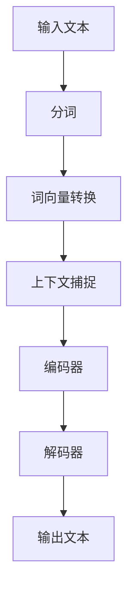

                 

关键词：大型语言模型、上下文理解、认知能力、算法原理、应用领域、数学模型、代码实例、未来展望

> 摘要：随着人工智能技术的快速发展，大型语言模型（LLM）在自然语言处理领域取得了显著的成就。本文旨在探讨LLM在上下文理解方面的突破，提升认知能力的技术原理，以及其在实际应用中的潜力与挑战。文章将涵盖核心概念、算法原理、数学模型、代码实例和未来展望等多个方面，为读者提供一个全面的技术视角。

## 1. 背景介绍

近年来，人工智能领域取得了诸多突破，特别是在自然语言处理（NLP）领域。大型语言模型（LLM）如GPT-3、BERT和Turing等，凭借其强大的上下文理解能力，已经在多个领域展现了巨大的应用潜力。LLM的核心在于其能够捕捉并利用长文本中的上下文信息，从而进行高质量的自然语言生成、问答系统、机器翻译等任务。

然而，LLM的发展并非一帆风顺。早期的语言模型往往局限于短文本的处理，难以应对复杂语境和多模态交互。随着深度学习技术的进步，特别是Transformer架构的引入，LLM的上下文理解能力得到了显著提升。本文将深入探讨这一突破，分析其背后的技术原理和应用前景。

## 2. 核心概念与联系

### 2.1. 大型语言模型（LLM）的概念

大型语言模型（LLM）是一类基于深度学习的语言处理模型，通过学习大量的文本数据，LLM能够捕捉语言的复杂结构和上下文关系。与传统的小型语言模型相比，LLM具有以下几个特点：

1. **强大的上下文捕捉能力**：LLM能够处理更长的文本上下文，从而更准确地理解语言的意义。
2. **多任务处理能力**：LLM不仅能够完成文本生成任务，还可以用于问答系统、机器翻译、情感分析等多种NLP任务。
3. **自适应学习能力**：LLM能够根据不同的任务和数据集进行自适应调整，提高其在特定领域的表现。

### 2.2. 上下文理解的重要性

上下文理解是自然语言处理的核心问题之一。上下文不仅包括文本的直接语境，还涉及语言的文化背景、语境意图等多个方面。有效的上下文理解能够帮助模型更准确地理解用户的意图，提高语言生成的自然性和准确性。

LLM的上下文理解能力主要体现在以下几个方面：

1. **长文本处理**：LLM能够捕捉长文本中的上下文信息，从而进行连贯的文本生成。
2. **多模态交互**：LLM不仅能够处理文本数据，还可以结合图像、声音等多模态信息，实现更丰富的交互。
3. **语义理解**：LLM能够通过上下文信息进行语义理解，从而生成更符合人类语言的文本。

### 2.3. Mermaid流程图

为了更直观地展示LLM的上下文理解过程，我们使用Mermaid流程图进行说明。以下是一个简化的流程图：

**流程说明**：
1. 输入文本：用户输入一段文本数据。
2. 分词：文本被分割成单词或子词。
3. 词向量转换：每个单词或子词被映射到高维的词向量空间。
4. 上下文捕捉：词向量通过编码器进行编码，捕捉上下文信息。
5. 解码器：根据编码后的上下文信息生成输出文本。

## 3. 核心算法原理 & 具体操作步骤

### 3.1. 算法原理概述

LLM的核心算法是基于Transformer架构的深度学习模型。Transformer模型通过自注意力机制（Self-Attention）实现了对输入文本的全局上下文捕捉，从而提高了模型的上下文理解能力。以下是一个简化的算法步骤：

1. **输入层**：文本数据输入到模型中，经过预处理得到词向量。
2. **编码器层**：词向量通过编码器层进行编码，编码器中的自注意力机制使得每个词向量能够捕捉到整个文本的上下文信息。
3. **解码器层**：编码器输出的上下文信息通过解码器层生成输出文本，解码器同样使用自注意力机制进行上下文捕捉。

### 3.2. 算法步骤详解

1. **词嵌入（Word Embedding）**：将输入文本中的每个单词转换为高维的词向量。
   $$\text{embed}(x) = \text{Word2Vec}(x)$$
   
2. **编码器（Encoder）**：
   - **自注意力机制（Self-Attention）**：每个词向量通过自注意力机制计算其相对于整个文本的权重。
     $$\text{Attention}(Q, K, V) = \text{softmax}\left(\frac{QK^T}{\sqrt{d_k}}\right)V$$
   - **编码层**：通过多层编码器堆叠，每个编码层都将输入词向量映射到高维空间，并更新其上下文信息。

3. **解码器（Decoder）**：
   - **自注意力机制**：解码器同样使用自注意力机制，从编码器输出的上下文信息中生成中间表示。
   - **多头注意力（Multi-Head Attention）**：多个自注意力机制并行的组合，提高了模型的表示能力。

4. **输出层**：解码器生成的输出文本经过软

