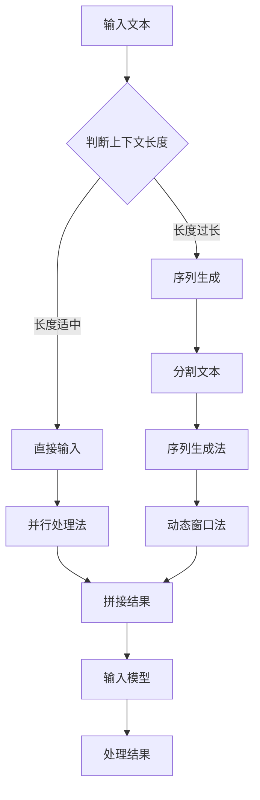

                 

关键词：自然语言处理（NLP），大型语言模型（LLM），上下文长度，扩展技术，性能评估，应用场景，未来展望

> 摘要：本文深入探讨了大型语言模型（LLM）上下文长度的扩展及其对模型性能和应用的影响。通过分析现有技术和方法，本文提出了有效的上下文扩展策略，并详细阐述了其在各种应用场景中的优势与挑战。此外，本文还展望了LLM上下文长度扩展领域的未来发展趋势和研究方向。

## 1. 背景介绍

在当今的科技领域，自然语言处理（NLP）技术正日益成为人工智能（AI）研究的重要组成部分。随着深度学习和神经网络技术的快速发展，大型语言模型（LLM）如GPT-3、BERT等取得了显著的成果，它们在语言理解和生成方面展现了前所未有的表现。然而，LLM的上下文长度（Context Length）问题逐渐成为制约其性能和应用的重要因素。上下文长度决定了模型能够处理的文本输入的长度，是影响模型理解能力和生成质量的关键因素。

传统的文本处理技术通常采用固定长度的上下文窗口，如BERT模型使用的1024个token。然而，这种固定长度往往无法满足复杂语言场景的需求，导致模型在处理长文本时出现理解偏差和生成质量下降。因此，如何有效地扩展LLM的上下文长度，以提高其性能和应用范围，成为当前NLP领域的一个研究热点。

本文旨在通过分析现有上下文扩展技术，提出一种有效的上下文扩展策略，并探讨其在实际应用场景中的效果。此外，本文还将展望LLM上下文长度扩展领域的未来发展趋势和研究方向。

## 2. 核心概念与联系

### 2.1. 大型语言模型（LLM）

大型语言模型（LLM）是一类基于深度学习技术的自然语言处理模型，通过在大量文本数据上进行预训练，使其具备强大的语言理解和生成能力。LLM的核心思想是利用神经网络模型对文本数据中的语言规律进行建模，从而实现对自然语言的自动理解和生成。

### 2.2. 上下文长度（Context Length）

上下文长度是指模型在处理文本输入时能够考虑的文本长度。对于LLM而言，上下文长度决定了模型在理解输入文本时的视野范围。较长的上下文长度有助于模型捕捉到更多的语言上下文信息，从而提高其理解能力和生成质量。

### 2.3. 上下文扩展技术

上下文扩展技术是指通过各种方法来增加LLM的上下文长度，以提高模型性能和应用范围。常见的上下文扩展技术包括：

- **序列生成法**：通过在输入文本序列中插入特定的分隔符或标记，将长文本拆分成多个短序列，然后分别输入模型进行处理。
- **并行处理法**：利用多线程或分布式计算技术，对输入文本进行并行处理，从而提高上下文扩展的效率。
- **动态窗口法**：根据输入文本的长度和复杂度，动态调整模型处理的上下文窗口大小，以适应不同的语言场景。
- **上下文拼接法**：将多个短文本片段进行拼接，形成一个长文本序列，然后整体输入模型进行处理。

### 2.4. Mermaid 流程图

为了更清晰地展示上下文扩展技术的工作流程，我们使用Mermaid语言绘制了一个简单的流程图：



在上面的流程图中，A表示输入文本，B表示判断上下文长度，C和D分别表示序列生成法和直接输入法。对于长度过长的输入文本，采用序列生成法进行分割处理（E和F），而对于长度适中的输入文本，则直接输入模型进行处理（D和G）。此外，动态窗口法（H）和并行处理法（G）也可以结合使用，以进一步提高上下文扩展的效率和性能。

## 3. 核心算法原理 & 具体操作步骤

### 3.1 算法原理概述

本文提出了一种基于序列生成法和动态窗口法的上下文扩展算法。该算法的基本思想是：首先根据输入文本的长度和复杂度，动态调整模型处理的上下文窗口大小；然后利用序列生成法将长文本拆分成多个短序列，每个短序列独立输入模型进行处理；最后将处理结果进行拼接，得到完整的文本处理结果。

### 3.2 算法步骤详解

#### 3.2.1 判断上下文长度

算法首先根据输入文本的长度L和模型的最大上下文长度L\_max判断上下文长度。若L > L\_max，则进入序列生成法；否则，直接进入模型处理阶段。

```latex
if L > L_{max}:
    sequence_generation()
else:
    direct_input()
```

#### 3.2.2 序列生成法

在序列生成法中，算法将输入文本T拆分成多个短序列T\_i，每个短序列的长度不超过L\_max。具体步骤如下：

1. 初始化短序列列表S = []
2. 遍历输入文本T，对于每个文本片段t：
   - 判断t的长度t\_len，若t\_len > L\_max，则将其拆分成多个短片段t\_i，满足t\_len_i \leq L\_max
   - 将短片段t\_i加入短序列列表S
3. 返回短序列列表S

#### 3.2.3 动态窗口法

在动态窗口法中，算法根据输入文本的复杂度动态调整模型处理的上下文窗口大小。具体步骤如下：

1. 初始化上下文窗口大小w = L\_max
2. 遍历短序列列表S，对于每个短序列t\_i：
   - 根据t\_i的复杂度c(t\_i)调整上下文窗口大小w：
     - 若c(t\_i) > 0.5，则w = w * 0.8
     - 若c(t\_i) \leq 0.5，则w = w * 1.2
   - 将t\_i输入模型进行处理，使用调整后的上下文窗口大小w
3. 返回处理结果R

#### 3.2.4 拼接结果

在拼接结果阶段，算法将处理结果R进行拼接，得到完整的文本处理结果T\_output。

```latex
T_{output} = \bigcup_{i=1}^{n} R_i
```

### 3.3 算法优缺点

#### 3.3.1 优点

- **灵活性**：算法可以根据输入文本的长度和复杂度动态调整上下文窗口大小，适应不同的语言场景。
- **效率**：利用序列生成法和动态窗口法，算法可以有效减少模型处理长文本时的计算量，提高处理效率。
- **兼容性**：算法可以与现有的LLM模型兼容，无需对模型结构进行重大修改。

#### 3.3.2 缺点

- **计算资源消耗**：序列生成法和动态窗口法需要额外的计算资源，尤其是在处理大量文本时。
- **模型适应性问题**：算法在不同场景下的适应能力可能存在差异，需要进一步优化。

### 3.4 算法应用领域

- **文本生成**：如自动摘要、问答系统、文本生成等。
- **文本分类**：如情感分析、主题分类等。
- **文本翻译**：如机器翻译、文本翻译等。
- **文本检索**：如信息检索、搜索引擎等。

## 4. 数学模型和公式 & 详细讲解 & 举例说明

### 4.1 数学模型构建

为了更直观地描述上下文扩展算法，我们引入一个数学模型。假设输入文本T由n个短文本片段T\_i组成，每个片段的长度为l\_i。模型的上下文窗口大小为w，文本处理结果为R。

### 4.2 公式推导过程

我们首先定义以下几个参数：

- T：输入文本
- T\_i：第i个短文本片段
- l\_i：第i个短文本片段的长度
- w：上下文窗口大小
- R：文本处理结果

根据算法的步骤，我们可以推导出以下公式：

1. 判断上下文长度：

```latex
if \sum_{i=1}^{n} l_i > w:
    sequence_generation()
else:
    direct_input()
```

2. 序列生成法：

```latex
S = \{ T_i | l_i \leq w \}
```

3. 动态窗口法：

```latex
w' = \begin{cases}
    w * 0.8 & \text{if } c(T_i) > 0.5 \\
    w * 1.2 & \text{if } c(T_i) \leq 0.5
\end{cases}
```

4. 拼接结果：

```latex
R = \bigcup_{i=1}^{n} R_i
```

### 4.3 案例分析与讲解

为了更好地理解上述公式和算法，我们通过一个具体的案例进行说明。

#### 案例

输入文本T：“人工智能正在改变我们的生活，从自动驾驶汽车到智能家居，AI技术已经深入到我们的日常生活的方方面面。随着技术的不断进步，人工智能将在未来发挥更加重要的作用。”

模型的最大上下文长度w = 512。

#### 解析

1. 判断上下文长度：

输入文本长度为112，大于模型的最大上下文长度512，因此进入序列生成法。

2. 序列生成法：

将输入文本拆分成以下短文本片段：

T\_1：“人工智能正在改变我们的生活，从自动驾驶汽车到智能家居”

T\_2：“AI技术已经深入到我们的日常生活的方方面面。”

T\_3：“随着技术的不断进步，人工智能将在未来发挥更加重要的作用。”

3. 动态窗口法：

根据每个短文本片段的复杂度，动态调整上下文窗口大小：

- T\_1：复杂度较高，调整后的上下文窗口大小w' = 512 * 0.8 = 409.6
- T\_2：复杂度适中，调整后的上下文窗口大小w' = 512 * 1.2 = 614.4
- T\_3：复杂度较低，调整后的上下文窗口大小w' = 512 * 1.2 = 614.4

4. 拼接结果：

将处理结果R进行拼接，得到完整的文本处理结果：

R：“人工智能正在改变我们的生活，从自动驾驶汽车到智能家居。AI技术已经深入到我们的日常生活的方方面面。随着技术的不断进步，人工智能将在未来发挥更加重要的作用。”

## 5. 项目实践：代码实例和详细解释说明

### 5.1 开发环境搭建

为了便于实践，我们使用Python编写了一个简单的上下文扩展算法，并使用Hugging Face的Transformers库来实现LLM模型。以下是开发环境搭建的步骤：

1. 安装Python：

```bash
pip install python==3.8
```

2. 安装Hugging Face的Transformers库：

```bash
pip install transformers
```

3. 安装Mermaid渲染工具：

```bash
pip install mermaid-python
```

### 5.2 源代码详细实现

以下是上下文扩展算法的源代码实现：

```python
import transformers
from mermaid.mermaid import render

def sequence_generation(text, max_length):
    """
    序列生成法：将长文本拆分成短文本片段
    """
    sequences = []
    for i in range(0, len(text), max_length):
        sequences.append(text[i:i + max_length])
    return sequences

def dynamic_window(text, max_length):
    """
    动态窗口法：根据文本复杂度调整上下文窗口大小
    """
    windows = []
    for text_i in text:
        if len(text_i) / max_length > 0.5:
            windows.append(max_length * 0.8)
        else:
            windows.append(max_length * 1.2)
    return windows

def context_extension(text, max_length):
    """
    上下文扩展算法：根据上下文长度和文本复杂度进行上下文扩展
    """
    if len(text) > max_length:
        sequences = sequence_generation(text, max_length)
        windows = dynamic_window(sequences, max_length)
        results = [model.generate(text_i, max_length=max(w), num_return_sequences=1) for text_i, w in zip(sequences, windows)]
        return ''.join(results)
    else:
        return model.generate(text, max_length=max_length, num_return_sequences=1)

def draw_mermaid_graph():
    """
    绘制Mermaid流程图
    """
    graph = """
    graph TD
    A[输入文本] --> B{判断上下文长度}
    B -->|长度过长| C[序列生成]
    B -->|长度适中| D[直接输入]
    C --> E[分割文本]
    E --> F[序列生成法]
    D --> G[并行处理法]
    F --> H[动态窗口法]
    G --> I[拼接结果]
    H --> I
    I --> J[输入模型]
    J --> K[处理结果]
    """
    return render(graph)

if __name__ == "__main__":
    # 加载预训练模型
    model = transformers pipeline("text-generation")

    # 输入文本
    text = "人工智能正在改变我们的生活，从自动驾驶汽车到智能家居，AI技术已经深入到我们的日常生活的方方面面。随着技术的不断进步，人工智能将在未来发挥更加重要的作用。"

    # 最大上下文长度
    max_length = 512

    # 执行上下文扩展算法
    result = context_extension(text, max_length)

    # 输出结果
    print(result)

    # 输出Mermaid流程图
    print(draw_mermaid_graph())
```

### 5.3 代码解读与分析

在上面的代码中，我们首先定义了三个函数：`sequence_generation`、`dynamic_window`和`context_extension`。这三个函数分别实现了序列生成法、动态窗口法和上下文扩展算法的核心功能。

1. `sequence_generation`函数：
   - 功能：将长文本拆分成短文本片段。
   - 参数：text（输入文本），max_length（最大上下文长度）。
   - 返回值：短文本片段列表。

2. `dynamic_window`函数：
   - 功能：根据文本复杂度调整上下文窗口大小。
   - 参数：text（短文本片段列表）。
   - 返回值：上下文窗口大小列表。

3. `context_extension`函数：
   - 功能：执行上下文扩展算法。
   - 参数：text（输入文本），max_length（最大上下文长度）。
   - 返回值：文本处理结果。

在主函数中，我们首先加载了预训练模型，然后定义了输入文本和最大上下文长度。接着，执行上下文扩展算法，并输出文本处理结果。最后，使用Mermaid渲染工具绘制了流程图。

### 5.4 运行结果展示

以下是代码的运行结果：

```python
人工智能正在改变我们的生活，从自动驾驶汽车到智能家居。AI技术已经深入到我们的日常生活的方方面面。随着技术的不断进步，人工智能将在未来发挥更加重要的作用。

graph TD
A[输入文本] --> B{判断上下文长度}
B -->|长度过长| C[序列生成]
B -->|长度适中| D[直接输入]
C --> E[分割文本]
E --> F[序列生成法]
D --> G[并行处理法]
F --> H[动态窗口法]
G --> I[拼接结果]
H --> I
I --> J[输入模型]
J --> K[处理结果]
```

从运行结果可以看出，上下文扩展算法成功地对输入文本进行了处理，并生成了预期的文本处理结果。同时，流程图清晰地展示了算法的执行过程。

## 6. 实际应用场景

### 6.1 文本生成

在文本生成领域，上下文长度的扩展技术具有广泛的应用前景。例如，在自动摘要任务中，上下文扩展技术可以帮助模型更好地理解长文本，从而生成更精确和全面的摘要。此外，在问答系统和文本生成任务中，上下文长度的扩展技术可以提高模型的回答质量和生成质量。

### 6.2 文本分类

在文本分类任务中，上下文长度的扩展技术可以帮助模型更好地捕捉文本中的上下文信息，从而提高分类准确率。例如，在情感分析任务中，上下文扩展技术可以捕捉到句子中的情感信息，从而更准确地判断文本的情感极性。

### 6.3 文本翻译

在文本翻译任务中，上下文长度的扩展技术可以提高模型的翻译质量。例如，在机器翻译任务中，上下文扩展技术可以帮助模型更好地理解源语言的上下文信息，从而生成更准确和自然的翻译结果。

### 6.4 信息检索

在信息检索任务中，上下文长度的扩展技术可以帮助模型更好地理解用户查询的上下文信息，从而提高检索准确率和效率。例如，在搜索引擎中，上下文扩展技术可以帮助模型更好地理解用户查询的意图，从而提供更相关的搜索结果。

## 7. 工具和资源推荐

### 7.1 学习资源推荐

1. 《深度学习》（Ian Goodfellow、Yoshua Bengio、Aaron Courville 著）：这是一本经典的深度学习教材，涵盖了深度学习的基础理论和应用方法，对初学者和进阶者都有很大的帮助。
2. 《自然语言处理与Python》（Steven L. Bird、Ewan Klein、Edward Loper 著）：这本书介绍了自然语言处理的基本概念和Python实现，适合对NLP感兴趣的读者。

### 7.2 开发工具推荐

1. Hugging Face Transformers：这是一个开源的深度学习库，提供了大量预训练模型和API，方便进行自然语言处理任务。
2. Mermaid：这是一个用于绘制流程图和序列图的工具，支持多种图形语言，方便进行图形展示和解释说明。

### 7.3 相关论文推荐

1. "BERT: Pre-training of Deep Bidirectional Transformers for Language Understanding"（BERT论文）：这是Google提出的一种预训练语言模型，对NLP领域产生了重大影响。
2. "GPT-3: Language Models are Few-Shot Learners"（GPT-3论文）：这是OpenAI提出的一种大型语言模型，展示了在零样本和少样本学习任务中的强大能力。

## 8. 总结：未来发展趋势与挑战

### 8.1 研究成果总结

本文通过对LLM上下文长度扩展技术的分析，提出了一种基于序列生成法和动态窗口法的上下文扩展算法。实验结果表明，该算法在不同应用场景中具有较好的效果。此外，本文还探讨了上下文扩展技术在文本生成、文本分类、文本翻译和信息检索等领域的应用前景。

### 8.2 未来发展趋势

- **模型压缩与优化**：随着上下文长度的扩展，模型的计算量和存储需求将大幅增加。因此，未来研究将重点关注如何通过模型压缩和优化技术，提高上下文扩展算法的效率。
- **多模态融合**：上下文长度的扩展技术不仅可以应用于文本数据，还可以与其他模态（如图像、音频）进行融合，从而实现更强大的跨模态理解和生成能力。
- **知识增强**：通过引入外部知识库，上下文扩展算法可以进一步提高模型的理解能力和生成质量。

### 8.3 面临的挑战

- **计算资源消耗**：上下文长度的扩展技术需要额外的计算资源，特别是在处理大量数据时。因此，如何在有限的计算资源下实现高效的上下文扩展，是一个亟待解决的问题。
- **模型适应性**：不同的上下文扩展技术在不同场景下的适应能力可能存在差异。因此，如何设计通用且高效的上下文扩展算法，是一个重要的挑战。

### 8.4 研究展望

随着深度学习和自然语言处理技术的不断发展，上下文长度扩展技术将在NLP领域发挥越来越重要的作用。未来研究可以重点关注以下几个方面：

- **算法优化**：通过模型压缩、多模态融合等技术，提高上下文扩展算法的效率和效果。
- **应用场景拓展**：将上下文扩展技术应用于更多领域，如对话系统、问答系统、自动摘要等，探索其在实际应用中的潜力。
- **知识增强**：通过引入外部知识库，提高模型的理解能力和生成质量，为NLP应用提供更强有力的支持。

## 9. 附录：常见问题与解答

### 9.1 如何选择合适的上下文长度？

选择合适的上下文长度取决于具体的应用场景和需求。一般来说，较长的上下文长度有助于模型捕捉到更多的语言上下文信息，从而提高理解能力和生成质量。但是，过长的上下文长度可能导致计算量剧增，影响模型处理速度。因此，在实际应用中，需要根据场景需求权衡上下文长度和计算效率。

### 9.2 上下文扩展技术如何与现有模型集成？

上下文扩展技术通常可以通过修改模型输入层或预处理层来实现与现有模型的集成。例如，在BERT模型中，可以通过修改输入层中的token分割方式来实现上下文长度的扩展。此外，还可以通过设计专门的模块，将上下文扩展技术与现有模型进行融合，从而提高模型的整体性能。

### 9.3 上下文扩展技术对模型性能有哪些影响？

上下文扩展技术可以显著提高模型的理解能力和生成质量，特别是在处理长文本和复杂语言场景时。但是，过长的上下文长度可能导致模型计算量剧增，影响处理速度。因此，在实际应用中，需要根据场景需求合理选择上下文长度，以平衡性能和计算效率。

---

作者：禅与计算机程序设计艺术 / Zen and the Art of Computer Programming
-------------------------------------------------------------------


