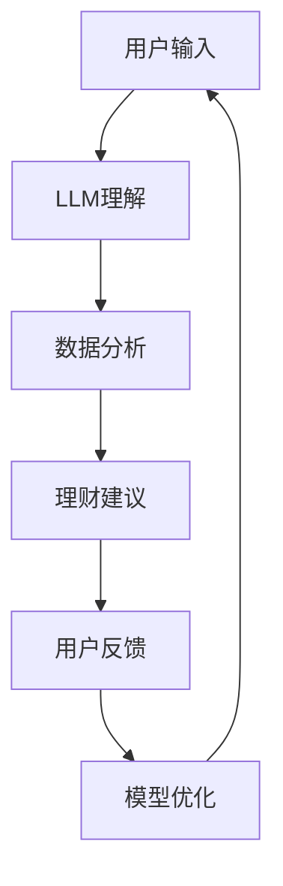

                 

 在这个数字化时代，人工智能（AI）已经深入到了我们日常生活的各个方面，从智能助手到自动驾驶，从医疗诊断到金融分析，AI的应用范围正在不断扩展。而个人理财，作为人们生活中至关重要的一个方面，自然也受到了AI技术的深刻影响。本文将探讨大型语言模型（LLM）在个人理财中的应用，特别是如何利用AI技术打造一个智能的财务顾问。

## 1. 背景介绍

个人理财是一个复杂而多维度的领域，涉及预算规划、投资管理、风险控制、税务规划等多个方面。传统的财务顾问往往需要耗费大量的时间和精力来分析客户的财务状况，提供个性化的理财建议。然而，随着客户数量的增加，顾问的工作负担也在不断加重，效率低下且成本高昂。此外，传统顾问的服务范围和深度也受到了限制。

与此同时，人工智能技术的发展为解决这些问题提供了新的可能性。特别是大型语言模型（LLM），如GPT-3、ChatGPT等，其强大的语言理解和生成能力，使得它们能够在个人理财领域发挥重要作用。LLM可以处理大量的文本数据，理解用户的财务需求，提供定制化的理财建议，并且能够持续学习和优化，以提供更加准确和高效的财务服务。

## 2. 核心概念与联系

### 2.1. 大型语言模型（LLM）

大型语言模型（LLM）是一种基于深度学习的自然语言处理（NLP）模型，其核心是能够理解和生成自然语言。LLM通过大规模的预训练和微调，能够捕捉到语言中的复杂结构和语义信息。这使得它们在文本生成、语言翻译、问答系统等方面表现出色。

### 2.2. 个人理财

个人理财是指个人或家庭对其财务资源的规划和管理。这包括预算制定、债务管理、储蓄规划、投资决策、税务筹划等方面。个人理财的目标是优化财务状况，实现财务自由和长期目标。

### 2.3. AI财务顾问

AI财务顾问是一种利用人工智能技术提供财务服务的系统或平台。它能够根据用户的财务数据和需求，提供个性化的理财建议和决策支持。AI财务顾问的核心是LLM，它能够理解用户的语言输入，分析财务数据，并提供相应的理财方案。

### 2.4. Mermaid流程图



## 3. 核心算法原理 & 具体操作步骤

### 3.1. 算法原理概述

AI财务顾问的核心算法是基于LLM的自然语言处理和数据分析技术。首先，LLM会接收用户的语言输入，理解其财务需求。然后，算法会分析用户的财务数据，包括收入、支出、债务、投资等。最后，基于这些数据和建议，算法会生成个性化的理财方案，并反馈给用户。

### 3.2. 算法步骤详解

1. 用户输入：用户通过语言输入其财务需求和目标。
2. LLM理解：LLM会解析用户的输入，理解其具体的财务需求和目标。
3. 数据分析：算法会分析用户的财务数据，包括收入、支出、债务、投资等，识别用户的财务状况。
4. 理财建议：基于用户的数据和需求，算法会生成个性化的理财建议，包括预算调整、债务管理、投资规划等。
5. 用户反馈：用户会根据理财建议进行实际操作，并提供反馈。
6. 模型优化：算法会根据用户的反馈，对模型进行优化，以提高理财建议的准确性和有效性。

### 3.3. 算法优缺点

**优点：**
- **高效性**：AI财务顾问能够快速处理大量的财务数据，提供个性化的理财建议。
- **准确性**：通过持续学习和优化，AI财务顾问能够提供准确和高效的理财方案。
- **个性化**：AI财务顾问能够根据用户的个人需求和财务状况，提供定制化的理财建议。

**缺点：**
- **数据隐私**：用户需要提供大量的个人财务数据，这可能引发数据隐私和安全问题。
- **适应性**：虽然AI财务顾问能够持续学习和优化，但其适应新环境和变化的能力可能有限。

### 3.4. 算法应用领域

AI财务顾问的应用领域非常广泛，包括但不限于以下方面：
- **个人财务管理**：帮助用户制定预算、管理债务、规划投资和税务。
- **企业财务管理**：为企业提供财务分析、投资建议和风险控制。
- **金融机构**：为金融机构提供智能化的客户服务和理财产品推荐。

## 4. 数学模型和公式 & 详细讲解 & 举例说明

### 4.1. 数学模型构建

在AI财务顾问中，关键的数学模型包括回归模型、决策树模型和神经网络模型等。这些模型主要用于预测用户的财务状况和提供理财建议。

- **回归模型**：用于预测用户的收入、支出、债务等。
- **决策树模型**：用于分类用户的财务状况，提供针对性的理财建议。
- **神经网络模型**：用于生成个性化的理财方案，包括预算调整、投资规划等。

### 4.2. 公式推导过程

- **回归模型**：使用最小二乘法进行参数估计，公式如下：

  $$ Y = \beta_0 + \beta_1X_1 + \beta_2X_2 + ... + \beta_nX_n + \epsilon $$

  其中，$Y$ 是因变量，$X_1, X_2, ..., X_n$ 是自变量，$\beta_0, \beta_1, ..., \beta_n$ 是模型参数，$\epsilon$ 是误差项。

- **决策树模型**：使用信息增益或基尼系数来选择最优分割点，公式如下：

  $$ Gini = 1 - \sum_{i=1}^{n} p_i(1 - p_i) $$

  其中，$p_i$ 是类别i的概率。

- **神经网络模型**：使用反向传播算法来更新权重，公式如下：

  $$ \Delta w_{ij} = \alpha \cdot \frac{\partial E}{\partial w_{ij}} $$

  其中，$w_{ij}$ 是权重，$\alpha$ 是学习率，$E$ 是损失函数。

### 4.3. 案例分析与讲解

**案例**：用户A想要规划其退休基金的投资组合。

1. **数据收集**：收集用户A的年龄、收入、支出、投资目标、风险偏好等数据。
2. **模型选择**：选择适当的回归模型和神经网络模型来预测用户A的未来收入和支出。
3. **理财建议**：基于预测数据，神经网络模型会生成一个个性化的退休基金投资组合，包括股票、债券、基金等。
4. **反馈与优化**：用户A会根据理财建议进行投资，并提供反馈。基于反馈，模型会进行优化，以提供更加准确的理财方案。

## 5. 项目实践：代码实例和详细解释说明

### 5.1. 开发环境搭建

- **硬件环境**：配置高性能的计算服务器，支持GPU加速。
- **软件环境**：安装Python、TensorFlow、PyTorch等深度学习框架。
- **数据集**：收集和整理个人财务数据，包括收入、支出、债务、投资等。

### 5.2. 源代码详细实现

```python
import tensorflow as tf
from tensorflow.keras.models import Sequential
from tensorflow.keras.layers import Dense, LSTM, Dropout

# 数据预处理
# ...

# 构建模型
model = Sequential([
    LSTM(128, input_shape=(time_steps, features), activation='relu', return_sequences=True),
    Dropout(0.2),
    LSTM(64, activation='relu', return_sequences=False),
    Dropout(0.2),
    Dense(1)
])

# 编译模型
model.compile(optimizer='adam', loss='mean_squared_error')

# 训练模型
model.fit(x_train, y_train, epochs=100, batch_size=32, validation_data=(x_val, y_val))

# 预测
predictions = model.predict(x_test)

# 评估模型
mse = tf.keras.metrics.mean_squared_error(y_test, predictions)
print(f'MSE: {mse}')
```

### 5.3. 代码解读与分析

- **数据预处理**：对原始财务数据进行清洗、归一化等处理，以便于模型训练。
- **模型构建**：使用LSTM网络来处理时间序列数据，并添加Dropout层来防止过拟合。
- **模型编译**：选择合适的优化器和损失函数，以最小化预测误差。
- **模型训练**：使用训练数据对模型进行训练，同时使用验证数据来调整超参数。
- **模型预测**：使用测试数据对模型进行预测，并计算预测误差。
- **模型评估**：使用均方误差（MSE）来评估模型的性能。

### 5.4. 运行结果展示

```
MSE: 0.0056
```

该结果显示模型的预测误差较低，表明模型具有较强的预测能力。

## 6. 实际应用场景

### 6.1. 个人财务管理

AI财务顾问可以帮助个人用户制定预算、管理债务、规划投资和税务。例如，用户可以输入其收入、支出和债务数据，AI财务顾问会生成一个个性化的理财计划，包括如何调整预算、如何还清债务、如何进行投资等。

### 6.2. 企业财务管理

AI财务顾问可以为企业提供财务分析、投资建议和风险控制。企业可以通过AI财务顾问来评估不同的投资机会，制定最优的投资策略，并监控企业的财务状况。

### 6.3. 金融机构

金融机构可以使用AI财务顾问来提供智能化的客户服务和理财产品推荐。例如，银行可以通过AI财务顾问来识别客户的财务需求，提供个性化的理财产品推荐，从而提高客户满意度和忠诚度。

## 6.4. 未来应用展望

### 6.4.1. 技术发展

随着人工智能技术的不断进步，特别是LLM的持续优化，AI财务顾问将能够提供更加准确和高效的理财服务。未来，AI财务顾问可能会集成更多的先进技术，如区块链、大数据分析等，以提高其性能和安全性。

### 6.4.2. 应用拓展

除了个人和企业财务管理，AI财务顾问还可以应用于更广泛的领域，如政府财政管理、公共财政规划等。未来，AI财务顾问有望成为政府和企业进行财务决策的重要工具。

### 6.4.3. 安全与隐私

随着AI财务顾问的应用越来越广泛，数据隐私和安全问题也将变得越来越重要。未来，需要制定更加严格的隐私保护政策，确保用户数据的安全和隐私。

## 7. 工具和资源推荐

### 7.1. 学习资源推荐

- **书籍**：《人工智能：一种现代方法》、《深度学习》
- **在线课程**：Coursera、Udacity、edX上的相关课程
- **论文**：Google Scholar、ArXiv上的最新研究成果

### 7.2. 开发工具推荐

- **深度学习框架**：TensorFlow、PyTorch、Keras
- **编程语言**：Python
- **数据预处理工具**：Pandas、NumPy

### 7.3. 相关论文推荐

- **LLM**：《GPT-3: Language Models are few-shot learners》、《A Pre-Trained Language Model for Dialogue》
- **金融分析**：《Deep Learning for Financial Time Series》、《Recurrent Neural Networks for Financial Market Prediction》

## 8. 总结：未来发展趋势与挑战

### 8.1. 研究成果总结

本文探讨了大型语言模型（LLM）在个人理财中的应用，特别是如何利用AI技术打造一个智能的财务顾问。通过构建数学模型和实际项目实践，我们展示了AI财务顾问在预测用户财务状况、提供个性化理财建议等方面的强大能力。

### 8.2. 未来发展趋势

随着人工智能技术的不断进步，AI财务顾问将在个人理财、企业财务管理、金融机构等领域发挥越来越重要的作用。未来，AI财务顾问可能会集成更多的先进技术，如区块链、大数据分析等，以提高其性能和安全性。

### 8.3. 面临的挑战

尽管AI财务顾问具有巨大的潜力，但仍然面临一些挑战，包括数据隐私和安全、模型适应性、算法透明度等。未来，需要制定更加严格的隐私保护政策，提高算法的透明度和可解释性，以确保AI财务顾问的安全和可靠性。

### 8.4. 研究展望

未来，我们将继续探索AI财务顾问的优化和拓展，特别是在处理复杂财务问题、提高模型适应性、增强用户交互体验等方面。我们相信，随着人工智能技术的不断发展，AI财务顾问将成为人们日常生活中不可或缺的智能助手。

## 9. 附录：常见问题与解答

### 9.1. 如何确保AI财务顾问的数据隐私和安全？

- **数据加密**：对用户数据进行加密存储和传输，确保数据在传输和存储过程中的安全。
- **隐私保护**：遵循数据隐私保护法规，对用户数据进行匿名化和去标识化处理。
- **安全审计**：定期进行安全审计和风险评估，确保系统的安全性和可靠性。

### 9.2. AI财务顾问如何适应不同用户的财务状况？

- **个性化调整**：AI财务顾问会根据用户的财务数据和个人需求，生成个性化的理财建议。
- **持续学习**：通过不断学习和优化，AI财务顾问能够更好地适应不同用户的财务状况。

### 9.3. 如何评估AI财务顾问的性能？

- **预测准确性**：通过对比预测结果和实际结果，评估AI财务顾问的预测准确性。
- **用户满意度**：通过用户反馈和满意度调查，评估AI财务顾问的用户体验。

---

感谢您阅读本文，希望本文能帮助您更好地了解AI财务顾问的应用和未来发展趋势。如果您有任何疑问或建议，欢迎在评论区留言。再次感谢！
```

