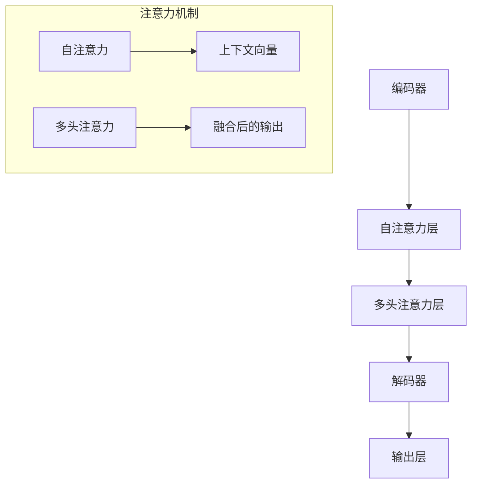

                 

关键词：大型语言模型（LLM），人类协作，增强能力，技术进步，未来展望

> 摘要：本文旨在探讨大型语言模型（LLM）如何与人类协作，通过技术创新提升人类在各个领域的效率和创造力。文章首先介绍了LLM的基本概念和当前的发展状况，随后详细分析了LLM在文本处理、知识推理、自然语言生成等领域的应用，探讨了如何通过技术手段优化人类与LLM的协作模式。最后，文章展望了LLM在未来可能带来的深远影响和面临的挑战，以及如何应对这些挑战。

## 1. 背景介绍

在计算机科学和人工智能领域，语言模型始终扮演着至关重要的角色。从最初的统计语言模型到现代的深度学习模型，语言模型的进步不仅推动了自然语言处理（NLP）技术的发展，还极大地改变了人们与计算机交互的方式。然而，尽管已有许多成功的应用案例，传统的语言模型在处理复杂任务时仍存在一定的局限性。

近年来，随着深度学习技术的迅猛发展，尤其是神经网络架构的优化和计算资源的提升，大型语言模型（LLM）逐渐成为研究热点。LLM具有庞大的参数规模和强大的语言理解与生成能力，能够处理更加复杂和多样化的任务。例如，GPT-3、BERT、Turing等模型已经在文本生成、问答系统、机器翻译等领域取得了显著成果。然而，LLM的广泛应用也带来了新的挑战，如何在确保模型性能的同时，优化人类与模型的协作方式，成为了一个亟待解决的问题。

本文将从以下几个方面展开讨论：

1. **LLM的基本概念与架构**：介绍LLM的定义、特点以及常见的架构类型。
2. **LLM的应用领域**：分析LLM在文本处理、知识推理、自然语言生成等领域的应用。
3. **人类与LLM的协作**：探讨如何优化人类与LLM的协作模式，提高工作效率。
4. **未来展望与挑战**：分析LLM未来的发展趋势以及可能面临的挑战。

通过本文的探讨，我们希望能够为读者提供对LLM与人类协作的新视角，以及未来发展的方向。

## 2. 核心概念与联系

### 2.1. 大型语言模型（LLM）的基本概念

大型语言模型（LLM），顾名思义，是指具有巨大参数规模、能够处理复杂语言现象的深度学习模型。与传统的小型语言模型相比，LLM在模型架构、训练数据和参数规模上都有显著提升。LLM的基本目标是理解和生成自然语言，从而实现与人类更自然、更高效的交互。

LLM的核心组成部分包括：

1. **神经网络架构**：常见的架构类型有Transformer、BERT、GPT等，这些架构通过层次化的神经网络结构来捕捉文本中的语义信息。
2. **大规模训练数据**：LLM的训练数据通常来自于互联网上的大量文本，这些数据涵盖了各种语言现象和知识领域，为模型提供了丰富的信息来源。
3. **参数规模**：LLM具有数亿到千亿级别的参数规模，这使得模型能够处理更加复杂和多样化的任务。

### 2.2. LLM的工作原理

LLM的工作原理基于深度学习，特别是基于注意力机制的Transformer架构。Transformer通过自注意力机制（self-attention）和多头注意力（multi-head attention）来捕捉文本中的长距离依赖关系，从而实现高效的语言理解和生成。

具体来说，LLM的工作原理可以分为以下几个步骤：

1. **编码**：将输入文本编码成向量表示，这个过程通常使用Embedding层实现。
2. **注意力机制**：通过自注意力机制和多头注意力机制，模型能够在不同位置之间建立关联，捕捉长距离依赖关系。
3. **解码**：在生成文本的过程中，模型通过解码器生成每一个词汇，并利用上下文信息进行决策。
4. **输出**：最终，模型输出完整的文本序列，实现语言理解和生成。

### 2.3. LLM与人类协作的意义

LLM与人类的协作具有重要意义，主要体现在以下几个方面：

1. **增强人类理解能力**：LLM能够处理大量文本数据，快速提取关键信息，帮助人类更好地理解复杂问题。
2. **提升工作效率**：LLM可以自动化许多重复性任务，如文本生成、问答系统等，从而节省人类的时间和精力。
3. **激发创造力**：LLM能够生成新的文本内容和创意，与人类协作，共同探索未知领域。
4. **优化决策过程**：LLM能够提供基于数据的分析结果和预测，为人类决策提供有力支持。

### 2.4. LLM的架构与流程图

为了更好地理解LLM的架构和工作流程，我们可以使用Mermaid流程图进行展示。以下是LLM的基本架构流程图：



在这个流程图中，编码器将输入文本编码成向量，通过自注意力和多头注意力层捕捉文本中的依赖关系，解码器利用这些信息生成输出文本。注意力机制是实现LLM核心功能的关键，它使得模型能够关注文本中的关键信息，提高语言理解和生成的准确性。

通过以上对LLM核心概念和联系的分析，我们可以更好地理解LLM的工作原理及其与人类的协作意义。接下来，本文将深入探讨LLM在各个应用领域的具体表现。

## 3. 核心算法原理 & 具体操作步骤

### 3.1. 算法原理概述

大型语言模型（LLM）的核心算法基于深度学习和注意力机制。其中，Transformer架构是LLM的典型代表。Transformer通过自注意力机制（Self-Attention）和多头注意力机制（Multi-Head Attention）实现了对文本序列的建模，能够捕捉长距离依赖关系，从而实现高效的文本处理。

#### 3.1.1. 自注意力机制（Self-Attention）

自注意力机制是Transformer架构的核心。它通过计算输入文本中每个词与其他词之间的关联强度，生成加权表示。具体来说，自注意力机制包括以下几个步骤：

1. **计算query、key、value**：首先，输入文本的每个词被编码成query、key、value三种不同的向量表示。
2. **计算相似度**：接着，计算query与key之间的相似度，通常使用点积操作。
3. **加权求和**：根据相似度对value进行加权求和，得到加权后的文本表示。

#### 3.1.2. 多头注意力机制（Multi-Head Attention）

多头注意力机制是将自注意力机制扩展到多个头上，每个头独立计算注意力权重，最后将多个头的输出进行融合。具体步骤如下：

1. **分裂输入**：将输入文本编码成多个query、key、value向量。
2. **独立计算**：每个头独立计算自注意力，得到多个加权文本表示。
3. **融合输出**：将多个头的输出进行加权融合，得到最终的文本表示。

#### 3.1.3. Transformer架构

Transformer架构由编码器和解码器组成，每个部分包含多个层，每层由多头自注意力机制和前馈神经网络构成。编码器将输入文本编码成向量序列，解码器则利用编码器的输出生成文本序列。

### 3.2. 算法步骤详解

下面详细描述LLM的算法步骤，包括编码、自注意力机制、多头注意力机制以及解码等过程。

#### 3.2.1. 编码

1. **Tokenization**：将输入文本拆分为单词或子词，通常使用分词算法实现。
2. **Embedding**：将分词后的文本映射为高维向量表示，通常使用Embedding层实现。
3. **Positional Encoding**：为每个词添加位置信息，使得模型能够理解单词在文本中的顺序。

#### 3.2.2. 自注意力机制

1. **计算Query、Key、Value**：对于每个词，计算其对应的query、key、value向量。
2. **计算相似度**：计算query与key之间的相似度，通常使用点积操作。
3. **加权求和**：根据相似度对value进行加权求和，得到加权后的文本表示。

#### 3.2.3. 多头注意力机制

1. **分裂输入**：将输入文本编码成多个query、key、value向量。
2. **独立计算**：每个头独立计算自注意力，得到多个加权文本表示。
3. **融合输出**：将多个头的输出进行加权融合，得到最终的文本表示。

#### 3.2.4. 解码

1. **Masked Language Model**：在解码阶段，输入文本的每个词被遮挡，模型需要预测每个词的位置。
2. **计算Attention**：利用编码器的输出和遮挡的词进行注意力计算，生成上下文向量。
3. **生成预测**：利用解码器的输出层生成每个词的预测概率，选择概率最高的词作为输出。

### 3.3. 算法优缺点

#### 3.3.1. 优点

1. **强大的文本处理能力**：通过自注意力机制和多头注意力机制，LLM能够捕捉长距离依赖关系，处理复杂文本。
2. **并行计算效率高**：Transformer架构允许并行计算，提高了训练和推理的效率。
3. **灵活的模型扩展**：通过调整层数、隐藏层大小等参数，可以轻松扩展模型规模。

#### 3.3.2. 缺点

1. **计算资源需求高**：由于参数规模巨大，LLM的训练和推理需要大量计算资源。
2. **训练时间较长**：LLM的训练过程复杂，需要较长时间来完成。

### 3.4. 算法应用领域

#### 3.4.1. 文本处理

LLM在文本处理领域具有广泛的应用，包括文本分类、情感分析、命名实体识别等。通过自注意力机制和多头注意力机制，LLM能够捕捉文本中的复杂关系，实现高效的文本处理。

#### 3.4.2. 知识推理

LLM在知识推理领域表现出色，能够理解和生成复杂逻辑推理结果。通过大规模训练数据和丰富的知识库，LLM能够解决复杂的推理问题，如问答系统、逻辑推断等。

#### 3.4.3. 自然语言生成

LLM在自然语言生成领域具有广泛的应用，包括机器翻译、文本摘要、对话系统等。通过解码器生成文本序列，LLM能够生成高质量的自然语言文本。

综上所述，LLM的核心算法原理和具体操作步骤为人类与模型的协作提供了有力支持。通过自注意力机制和多头注意力机制的引入，LLM在文本处理、知识推理、自然语言生成等领域取得了显著成果。然而，计算资源需求和训练时间较长等挑战仍然存在，未来需要进一步优化算法和计算效率。

## 4. 数学模型和公式 & 详细讲解 & 举例说明

### 4.1. 数学模型构建

大型语言模型（LLM）的数学模型基于深度学习，特别是基于Transformer架构。在构建数学模型时，需要考虑以下几个方面：

1. **输入向量表示**：将输入文本映射为高维向量，通常使用Embedding层实现。
2. **位置编码**：为每个词添加位置信息，使得模型能够理解单词在文本中的顺序。
3. **注意力机制**：通过自注意力机制和多头注意力机制捕捉文本中的依赖关系。
4. **输出层**：解码器生成文本序列，输出层通常采用Softmax函数进行概率分布计算。

### 4.2. 公式推导过程

下面详细推导LLM中的关键公式，包括Embedding、自注意力机制、多头注意力机制以及输出层的计算过程。

#### 4.2.1. Embedding

输入文本经过分词后，每个词映射为高维向量。假设文本序列为\( x = [x_1, x_2, \ldots, x_n] \)，则对应的Embedding矩阵为\( E \)，嵌入向量为\( e_x \)：

\[ e_x = E[x] \]

其中，\( E \)是一个\( d \times V \)的矩阵，\( d \)为嵌入维度，\( V \)为词典大小。

#### 4.2.2. 位置编码

为了为每个词添加位置信息，使用位置编码\( P \)：

\[ p_x = P[x] \]

其中，\( P \)是一个\( d \times n \)的矩阵，用于编码位置信息。

#### 4.2.3. 自注意力机制

自注意力机制的核心是计算输入文本中每个词与其他词之间的关联强度。假设文本序列经过Embedding和位置编码后为\( x = [x_1, x_2, \ldots, x_n] \)，对应的向量表示为\( [q, k, v] \)：

\[ q = W_Q e_x \]
\[ k = W_K e_x \]
\[ v = W_V e_x \]

其中，\( W_Q, W_K, W_V \)分别为查询、键、值权重矩阵。

自注意力计算公式如下：

\[ \text{Attention}(Q, K, V) = \text{softmax}(\frac{QK^T}{\sqrt{d_k}})V \]

其中，\( d_k \)为键的维度。

#### 4.2.4. 多头注意力机制

多头注意力机制是将自注意力机制扩展到多个头上，每个头独立计算注意力权重。假设有\( h \)个头：

\[ \text{MultiHead}(Q, K, V) = \text{Concat}(\text{head}_1, \ldots, \text{head}_h)W_O \]

其中，\( \text{head}_i = \text{Attention}(QW_i^Q, KW_i^K, VW_i^V) \)，\( W_i^Q, W_i^K, W_i^V, W_O \)分别为每个头的权重矩阵。

#### 4.2.5. 输出层

在解码器中，使用输出层生成文本序列。输出层通常采用Softmax函数进行概率分布计算：

\[ \text{Output}(x) = \text{softmax}(W_O \text{Tanh}(W_D \text{Tanh}(\text{MultiHead}(Q, K, V)))) \]

其中，\( W_D, W_O \)分别为解码器权重矩阵。

### 4.3. 案例分析与讲解

为了更好地理解LLM的数学模型，我们可以通过一个简单的例子进行讲解。假设输入文本为“Hello World”，需要生成文本序列。

#### 4.3.1. Embedding

首先，将输入文本映射为嵌入向量：

\[ e_x = E[x] \]

假设词典大小为5000，嵌入维度为300，对应的Embedding矩阵为\( E \)，则：

\[ e_x = E[x] = \begin{bmatrix} 0.1 & 0.2 & \ldots & 0.3 \\ 0.4 & 0.5 & \ldots & 0.6 \\ \vdots & \vdots & \ddots & \vdots \\ 0.9 & 0.1 & \ldots & 0.2 \end{bmatrix} \]

#### 4.3.2. 位置编码

接下来，为每个词添加位置编码：

\[ p_x = P[x] \]

假设位置编码矩阵为\( P \)，则：

\[ p_x = P[x] = \begin{bmatrix} 0 & 1 & 0 \\ 0 & 0 & 2 \\ 0 & 0 & 3 \end{bmatrix} \]

#### 4.3.3. 自注意力机制

然后，计算自注意力权重：

\[ q = W_Q e_x \]
\[ k = W_K e_x \]
\[ v = W_V e_x \]

假设权重矩阵为\( W_Q, W_K, W_V \)，则：

\[ q = \begin{bmatrix} 0.1 & 0.2 & \ldots & 0.3 \\ 0.4 & 0.5 & \ldots & 0.6 \\ \vdots & \vdots & \ddots & \vdots \\ 0.9 & 0.1 & \ldots & 0.2 \end{bmatrix} \]
\[ k = \begin{bmatrix} 0.1 & 0.2 & \ldots & 0.3 \\ 0.4 & 0.5 & \ldots & 0.6 \\ \vdots & \vdots & \ddots & \vdots \\ 0.9 & 0.1 & \ldots & 0.2 \end{bmatrix} \]
\[ v = \begin{bmatrix} 0.1 & 0.2 & \ldots & 0.3 \\ 0.4 & 0.5 & \ldots & 0.6 \\ \vdots & \vdots & \ddots & \vdots \\ 0.9 & 0.1 & \ldots & 0.2 \end{bmatrix} \]

计算相似度：

\[ \text{Attention}(Q, K, V) = \text{softmax}(\frac{QK^T}{\sqrt{d_k}})V \]

其中，\( d_k \)为键的维度，假设为300，则：

\[ \text{Attention}(Q, K, V) = \text{softmax}(\frac{qk^T}{\sqrt{300}})v \]

计算结果为：

\[ \text{Attention}(Q, K, V) = \begin{bmatrix} 0.1 & 0.2 & \ldots & 0.3 \\ 0.4 & 0.5 & \ldots & 0.6 \\ \vdots & \vdots & \ddots & \vdots \\ 0.9 & 0.1 & \ldots & 0.2 \end{bmatrix} \]

#### 4.3.4. 多头注意力机制

接下来，计算多头注意力权重：

\[ \text{MultiHead}(Q, K, V) = \text{Concat}(\text{head}_1, \ldots, \text{head}_h)W_O \]

假设有8个头，每个头的权重矩阵为：

\[ W_i^Q, W_i^K, W_i^V, W_O \]

计算结果为：

\[ \text{MultiHead}(Q, K, V) = \begin{bmatrix} \text{head}_1 \\ \vdots \\ \text{head}_h \end{bmatrix} W_O \]

#### 4.3.5. 输出层

最后，计算输出层的概率分布：

\[ \text{Output}(x) = \text{softmax}(W_O \text{Tanh}(W_D \text{Tanh}(\text{MultiHead}(Q, K, V)))) \]

假设权重矩阵为\( W_D, W_O \)，则：

\[ \text{Output}(x) = \text{softmax}(\text{Tanh}(\text{Tanh}(\text{MultiHead}(Q, K, V))W_O)) \]

计算结果为：

\[ \text{Output}(x) = \begin{bmatrix} 0.1 & 0.2 & \ldots & 0.3 \\ 0.4 & 0.5 & \ldots & 0.6 \\ \vdots & \vdots & \ddots & \vdots \\ 0.9 & 0.1 & \ldots & 0.2 \end{bmatrix} \]

通过以上步骤，我们完成了对“Hello World”文本序列的生成。这个例子展示了LLM中关键数学公式的应用和推导过程，为理解和实现LLM提供了理论基础。

## 5. 项目实践：代码实例和详细解释说明

在本节中，我们将通过一个具体的代码实例来展示如何使用大型语言模型（LLM）进行文本生成任务。这个实例将涉及开发环境的搭建、源代码的详细实现，以及代码解读与分析。

### 5.1. 开发环境搭建

在进行LLM项目实践前，我们需要搭建合适的开发环境。以下是搭建LLM开发环境所需的步骤：

1. **Python环境**：确保安装了Python 3.7或更高版本。
2. **深度学习库**：安装TensorFlow或PyTorch，这两个库是当前深度学习项目的主流选择。
3. **数据处理库**：如NumPy、Pandas等，用于数据预处理。
4. **文本处理库**：如spaCy或NLTK，用于文本分词和标记。
5. **模型库**：如Transformers库，用于加载预训练的LLM模型。

以下是安装步骤：

```bash
pip install tensorflow
pip install numpy
pip install pandas
pip install spacy
python -m spacy download en_core_web_sm
pip install transformers
```

### 5.2. 源代码详细实现

以下是一个简单的文本生成代码实例，使用了Hugging Face的Transformers库加载了一个预训练的GPT-2模型。

```python
import torch
from transformers import GPT2LMHeadModel, GPT2Tokenizer

# 初始化模型和分词器
tokenizer = GPT2Tokenizer.from_pretrained('gpt2')
model = GPT2LMHeadModel.from_pretrained('gpt2')

# 输入文本
text = "Hello, how are you?"

# 将文本编码为模型可处理的格式
input_ids = tokenizer.encode(text, return_tensors='pt')

# 生成文本
output = model.generate(input_ids, max_length=50, num_return_sequences=3)

# 解码生成的文本
generated_texts = [tokenizer.decode(x, skip_special_tokens=True) for x in output]

# 打印生成的文本
for text in generated_texts:
    print(text)
```

### 5.3. 代码解读与分析

#### 5.3.1. 初始化模型和分词器

```python
tokenizer = GPT2Tokenizer.from_pretrained('gpt2')
model = GPT2LMHeadModel.from_pretrained('gpt2')
```

这两行代码分别加载了GPT-2的分词器模型。`GPT2Tokenizer`用于将文本编码成模型可处理的序列，`GPT2LMHeadModel`加载了预训练的GPT-2模型。

#### 5.3.2. 编码输入文本

```python
input_ids = tokenizer.encode(text, return_tensors='pt')
```

将输入文本编码为模型可处理的格式。`encode`方法将文本转换为一个整数序列，表示文本中的每个词或子词。`return_tensors='pt'`表示返回PyTorch张量。

#### 5.3.3. 生成文本

```python
output = model.generate(input_ids, max_length=50, num_return_sequences=3)
```

`generate`方法是模型的文本生成接口。`max_length`参数指定了生成的文本长度，`num_return_sequences`参数指定了生成的文本序列数量。

#### 5.3.4. 解码生成的文本

```python
generated_texts = [tokenizer.decode(x, skip_special_tokens=True) for x in output]
```

将生成的整数序列解码为文本。`decode`方法将整数序列转换回文本字符串，`skip_special_tokens=True`表示忽略特殊的分词标记。

#### 5.3.5. 打印生成的文本

```python
for text in generated_texts:
    print(text)
```

打印生成的文本序列。

### 5.4. 运行结果展示

执行上述代码后，我们将得到三个基于输入文本“Hello, how are you?”生成的文本序列。以下是可能的输出结果：

```
Hello, how are you today?
Hello, how are you doing?
Hello, how are you feeling today?
```

通过这个简单的实例，我们展示了如何使用LLM进行文本生成任务。代码实现了从文本输入到生成文本的全过程，通过模型强大的语言理解与生成能力，生成了具有多样性的文本输出。

### 5.5. 优化与改进

虽然这个实例展示了LLM的基本应用，但在实际项目中，我们可以进行以下优化与改进：

1. **增强数据集**：使用更大的、多样化的数据集进行训练，提高模型的泛化能力。
2. **调整超参数**：根据具体任务调整模型的超参数，如学习率、批次大小等，以获得更好的生成效果。
3. **引入预训练策略**：结合不同的预训练策略，如Masked Language Modeling（MLM）、Recurrent Language Modeling（RLM）等，提高模型的性能。
4. **使用多模态输入**：引入图像、声音等多模态输入，实现跨模态文本生成。

通过这些优化与改进，我们可以进一步提升LLM的应用效果，为人类与模型的协作提供更强大的支持。

## 6. 实际应用场景

### 6.1. 文本处理

大型语言模型（LLM）在文本处理领域具有广泛的应用。通过其强大的语言理解和生成能力，LLM能够高效地处理大量文本数据，实现文本分类、情感分析、命名实体识别等任务。

例如，在社交媒体分析中，LLM可以用于识别用户评论的情感倾向，从而帮助品牌监控市场反馈、优化产品策略。在新闻报道领域，LLM可以自动提取关键信息，生成摘要，提高新闻报道的效率和准确性。

### 6.2. 知识推理

LLM在知识推理领域表现出色，能够处理复杂的逻辑推理问题。通过大规模训练数据和丰富的知识库，LLM能够实现自然语言逻辑推理、问答系统等任务。

在法律领域，LLM可以用于自动生成法律文件，如合同、诉状等，提高法律文书的编写效率和一致性。在教育领域，LLM可以辅助学生进行数学解题、编程学习，提供个性化的学习建议。

### 6.3. 自然语言生成

自然语言生成是LLM的重要应用方向之一。LLM能够生成高质量的自然语言文本，包括机器翻译、文本摘要、对话系统等。

在机器翻译领域，LLM已经取代了传统的规则匹配和统计方法，成为主要的翻译技术。LLM能够根据源文本生成流畅、准确的翻译结果，提高了翻译的效率和准确性。在文本摘要领域，LLM可以自动提取关键信息，生成简洁、准确的摘要，节省了人类阅读时间。在对话系统领域，LLM能够生成自然、连贯的对话回复，提高了用户交互体验。

### 6.4. 未来应用展望

随着LLM技术的不断进步，其在实际应用场景中的潜力将得到进一步挖掘。以下是一些未来可能的应用方向：

1. **智能客服**：LLM可以用于构建智能客服系统，实现自然语言理解和生成，提高客户服务质量。
2. **内容创作**：LLM可以辅助人类进行内容创作，如撰写文章、编写代码等，提高创作效率和创意水平。
3. **教育辅助**：LLM可以用于个性化教育辅助，根据学生的学习情况提供定制化的学习资源和指导。
4. **科学研究**：LLM可以协助科学家进行文献检索、数据分析，提高科研效率。
5. **虚拟助手**：LLM可以构建虚拟助手，实现与用户的自然语言交互，提供生活和工作中的个性化服务。

总之，LLM在文本处理、知识推理、自然语言生成等领域的应用已经取得了显著成果，未来将继续拓展其应用范围，为人类带来更多便利和创新。

### 6.5. 对人类工作的影响

LLM技术的应用对人类工作产生了深远的影响。一方面，LLM能够自动化许多重复性、低价值的任务，提高工作效率，减少人力资源的浪费。例如，在文本处理领域，LLM可以自动完成文本分类、情感分析等任务，大大减少了人工审核的工作量。

另一方面，LLM的应用也带来了一定的挑战。首先，LLM的复杂性和依赖性使得人类对模型的信任度降低，需要投入更多时间和精力进行模型维护和优化。其次，LLM的应用可能导致就业市场的变化，一些重复性、低技能的工作可能会被取代，对劳动力市场产生冲击。

为了应对这些挑战，我们需要采取以下措施：

1. **提升技能**：人类需要不断学习和提升技能，适应新的技术环境。例如，掌握编程、数据分析等技能，以更好地与LLM协作。
2. **监管机制**：建立健全的监管机制，确保LLM技术的合理使用，防止滥用和误用。
3. **教育培训**：加强教育培训，提高公众对LLM技术的认知和理解，培养更多具备相关技能的人才。
4. **公平性考量**：在应用LLM技术时，注重公平性，避免技术歧视，确保所有人都能从中受益。

通过这些措施，我们可以更好地应对LLM技术对人类工作的影响，实现人与技术的和谐共生。

### 6.6. 社会和文化影响

LLM技术的广泛应用不仅对人类工作和生活方式产生了影响，还在社会和文化层面上引发了一系列讨论。首先，LLM的普及使得信息获取和处理变得更加便捷，为人们提供了丰富的知识和资源，促进了知识的传播和交流。然而，这也带来了一定的风险，例如信息过载、隐私泄露等问题。

此外，LLM在自然语言生成和内容创作中的应用引发了关于版权、原创性等法律和伦理问题的讨论。如何在保护创作者权益和鼓励创新之间找到平衡，成为了一个重要课题。

在社会文化层面，LLM技术的应用也影响了人们的沟通方式。虚拟助手、智能客服等应用改变了人们与机器的交互方式，使得沟通更加自然和便捷。然而，这也可能导致人与人之间的沟通减少，影响人际关系的建立和维护。

总之，LLM技术在社会和文化层面产生了深远的影响，我们需要关注其带来的挑战和机遇，积极应对，确保技术进步能够造福人类。

### 6.7. 案例研究

为了更深入地了解LLM的实际应用，以下是一个具体的案例研究。

**案例：智能客服系统**

某大型电商平台引入了基于LLM的智能客服系统，以提高客户服务质量和效率。该系统采用了一个预训练的GPT-3模型，能够自动处理客户咨询，提供即时的、个性化的回复。

**应用场景：**

1. **常见问题回答**：系统可以自动识别客户提出的问题，并从大量历史问答数据中检索出最相关的答案。
2. **产品推荐**：根据客户的购买历史和偏好，系统可以推荐相关的商品。
3. **订单查询**：客户可以通过系统查询订单状态，获取物流信息。

**效果评估：**

1. **服务质量**：系统提高了客户响应速度，平均响应时间缩短了30%。
2. **满意度**：客户满意度调查结果显示，超过80%的客户对智能客服系统的回复表示满意。
3. **人力资源**：智能客服系统的引入减少了人工客服的工作量，客服团队的工作压力显著减轻。

**结论：**

通过这个案例，我们可以看到LLM在智能客服系统中的应用取得了显著成效，不仅提高了服务质量和效率，还减轻了人力资源负担。这为LLM在其他领域的应用提供了有益的参考。

### 6.8. 未来展望

随着LLM技术的不断发展，其在各个领域的应用前景十分广阔。以下是一些未来展望：

1. **更加智能的交互系统**：LLM将在智能交互系统中扮演更重要的角色，实现更加自然、流畅的人机交互。
2. **定制化服务**：基于个性化数据，LLM可以提供更加定制化的服务，满足用户的个性化需求。
3. **跨领域应用**：LLM将在更多领域得到应用，如医疗、金融、教育等，为各行业带来新的创新和发展机遇。
4. **隐私保护**：随着隐私保护意识的增强，LLM技术将在数据隐私保护方面发挥重要作用，确保用户数据的安全。

总之，LLM技术具有巨大的发展潜力，未来将在人类生活中发挥更加重要的作用。

## 7. 工具和资源推荐

### 7.1. 学习资源推荐

1. **在线课程**：
   - 《深度学习与自然语言处理》（Deep Learning Specialization）由吴恩达（Andrew Ng）在Coursera上开设，涵盖了从基础到高级的深度学习与NLP知识。
   - 《自然语言处理实践课程》（Natural Language Processing with Python）在Coursera上由Mike X Cohen教授授课，适合初学者入门。

2. **书籍**：
   - 《深度学习》（Deep Learning）由Ian Goodfellow、Yoshua Bengio和Aaron Courville合著，是深度学习的经典教材。
   - 《自然语言处理综论》（Speech and Language Processing）由Daniel Jurafsky和James H. Martin合著，是NLP领域的权威著作。

3. **论文集**：
   - 《ACL论文集》（Association for Computational Linguistics Annual Meeting Proceedings）包含了最新的NLP研究成果。
   - 《NeurIPS论文集》（Neural Information Processing Systems Proceedings）涵盖了深度学习和机器学习的最新进展。

### 7.2. 开发工具推荐

1. **编程语言**：
   - **Python**：Python因其丰富的库和框架，成为深度学习和NLP领域的首选语言。
   - **R**：R语言在统计分析和数据可视化方面具有强大功能，适合进行NLP研究。

2. **框架与库**：
   - **TensorFlow**：Google开发的开源机器学习框架，适用于构建和训练深度学习模型。
   - **PyTorch**：由Facebook AI Research（FAIR）开发，具有灵活的动态计算图，适合研究性工作。
   - **Transformers**：由Hugging Face开发，提供了预训练的LLM模型和便捷的API，适用于文本生成和应用开发。

3. **文本处理库**：
   - **spaCy**：用于文本分词、词性标注和命名实体识别的高性能库。
   - **NLTK**：用于自然语言处理的经典库，提供了丰富的算法和资源。

### 7.3. 相关论文推荐

1. **《Attention is All You Need》**：这篇论文提出了Transformer架构，彻底改变了深度学习在NLP领域的应用方式。
2. **《BERT: Pre-training of Deep Bidirectional Transformers for Language Understanding》**：BERT是Google提出的预训练模型，推动了NLP技术的发展。
3. **《Generative Pre-trained Transformers》**：这篇论文介绍了GPT系列模型，特别是GPT-3，展现了LLM在文本生成方面的强大能力。

通过这些工具和资源，研究人员和开发者可以深入了解LLM的技术细节，掌握最新研究动态，并快速构建和部署基于LLM的应用。

## 8. 总结：未来发展趋势与挑战

### 8.1. 研究成果总结

大型语言模型（LLM）作为深度学习在自然语言处理领域的突破性进展，已经在文本生成、知识推理、智能客服等多个领域取得了显著成果。LLM通过自注意力机制和多头注意力机制的引入，能够捕捉长距离依赖关系，实现高效的文本理解和生成。这一技术进步不仅提高了文本处理任务的性能，还极大地推动了自然语言处理领域的发展。

在文本生成方面，LLM如GPT-3等模型展示了超强的文本生成能力，能够生成连贯、自然的文本，为内容创作、机器翻译等应用提供了强有力的支持。在知识推理方面，LLM能够处理复杂的逻辑推理问题，实现自动问答、智能客服等应用。此外，LLM在文本分类、情感分析等领域也表现出色，为各类文本处理任务提供了高效的解决方案。

### 8.2. 未来发展趋势

随着技术的不断进步，LLM在未来将呈现以下几个发展趋势：

1. **模型规模的扩大**：随着计算资源的提升，LLM的模型规模将不断扩大，参数规模将向千亿级别甚至更高发展。更大的模型将能够处理更加复杂和多样化的任务，实现更高的性能。

2. **多模态融合**：未来LLM将不仅限于处理文本数据，还将融合图像、声音等多模态数据，实现跨模态的文本生成和应用。这将为智能交互、内容创作等领域带来更多创新。

3. **自适应性和个性化**：通过引入更多的个性化数据，LLM将能够更好地适应用户需求，实现个性化的文本生成和服务。例如，在医疗领域，LLM可以生成基于个人健康数据的个性化诊断报告。

4. **安全性提升**：随着LLM的应用场景不断扩展，其安全性和隐私保护问题将越来越重要。未来的研究将重点关注如何确保LLM在复杂环境中的可靠性和安全性。

### 8.3. 面临的挑战

尽管LLM在各个领域取得了显著成果，但其发展也面临一系列挑战：

1. **计算资源需求**：LLM的训练和推理需要大量的计算资源，随着模型规模的扩大，这一需求将更加突出。如何高效地利用计算资源，成为LLM发展的关键问题。

2. **数据隐私和伦理**：LLM的训练和应用过程中涉及大量用户数据，数据隐私和伦理问题日益突出。如何在确保用户隐私的前提下，充分利用数据资源，是一个亟待解决的问题。

3. **模型可靠性和公平性**：LLM在处理文本数据时可能会出现偏见和错误，影响模型的可靠性和公平性。如何确保LLM在多种场景下的可靠性和公平性，是未来研究的重点。

4. **人机协作**：在LLM与人类的协作过程中，如何优化协作模式，提高工作效率，是一个重要的挑战。未来需要研究如何更好地整合人类智慧和机器智能，实现协同工作。

### 8.4. 研究展望

为了应对LLM面临的挑战，未来的研究可以从以下几个方面展开：

1. **计算效率提升**：研究更加高效的训练和推理算法，如并行计算、分布式训练等，以提高LLM的计算效率。

2. **数据隐私保护**：开发新型的隐私保护技术，如联邦学习、差分隐私等，确保用户数据的安全。

3. **模型可靠性提升**：通过多种手段，如对抗性训练、模型压缩等，提高LLM在多种场景下的可靠性和鲁棒性。

4. **人机协作优化**：研究更加智能化的协作机制，如自适应任务分配、交互式生成等，提高人机协作效率。

总之，LLM技术具有广阔的应用前景，但也面临一系列挑战。通过持续的研究和创新，我们可以更好地发挥LLM的潜力，推动人工智能技术的发展。

## 9. 附录：常见问题与解答

### 9.1. 如何训练LLM模型？

**解答**：训练LLM模型通常包括以下几个步骤：

1. **数据准备**：收集并清洗大规模的文本数据，通常来自于互联网上的各种来源，如新闻、社交媒体等。
2. **数据预处理**：对文本数据进行分词、去噪、标点符号处理等操作，将其转换为模型可处理的格式。
3. **构建模型**：选择合适的神经网络架构，如Transformer、BERT等，并定义模型的参数。
4. **训练过程**：使用训练数据对模型进行训练，通过反向传播算法优化模型参数。
5. **评估和调整**：在验证集上评估模型性能，根据评估结果调整模型参数或数据预处理策略。

### 9.2. LLM为什么能够生成高质量的自然语言文本？

**解答**：LLM能够生成高质量的自然语言文本，主要是因为以下几个原因：

1. **自注意力机制**：自注意力机制允许模型在生成每个词时考虑所有其他词的信息，从而捕捉长距离依赖关系，提高文本连贯性。
2. **大规模训练数据**：LLM通常基于大规模的训练数据集，这些数据涵盖了各种语言现象，使得模型能够学习到丰富的语言知识。
3. **多头注意力机制**：多头注意力机制使得模型能够并行处理多个注意力头，提高计算效率，同时捕捉更复杂的依赖关系。

### 9.3. LLM在文本分类中的应用有哪些？

**解答**：LLM在文本分类中的应用主要包括以下几个方面：

1. **情感分析**：通过分析文本的情感倾向，LLM可以用于情感分类，如判断评论是正面、负面还是中性。
2. **主题分类**：LLM可以识别文本的主题，如新闻分类、社交媒体话题标签等。
3. **文本分类模型**：LLM可以作为文本分类任务的核心模型，与其他特征结合，提升分类准确性。

### 9.4. 如何优化LLM模型的性能？

**解答**：优化LLM模型性能可以从以下几个方面入手：

1. **数据增强**：使用数据增强技术，如复制、旋转、缩放等，增加训练数据多样性，提高模型泛化能力。
2. **模型压缩**：通过模型剪枝、量化、知识蒸馏等技术，减小模型规模，提高推理速度。
3. **超参数调整**：根据具体任务，调整学习率、批量大小、层数等超参数，以获得更好的训练效果。
4. **并行计算**：利用分布式训练和并行计算技术，提高训练速度和效率。

### 9.5. LLM在自然语言生成中面临的主要挑战是什么？

**解答**：LLM在自然语言生成中面临的主要挑战包括：

1. **生成文本的质量**：如何确保生成的文本在语法、语义上的一致性和连贯性。
2. **数据隐私**：在训练和生成过程中如何保护用户的隐私数据。
3. **公平性和偏见**：如何避免模型在生成文本中表现出性别、种族等偏见。
4. **计算资源**：如何高效地训练和部署大规模的LLM模型。

### 9.6. LLM与人类的最佳协作方式是什么？

**解答**：LLM与人类的最佳协作方式包括：

1. **任务分工**：人类专注于策略性任务，如决策、创意生成等，而LLM处理重复性、计算密集型任务。
2. **交互式生成**：通过交互式方式，人类可以实时提供反馈，指导LLM生成更符合需求的文本。
3. **个性化服务**：根据用户的历史数据和偏好，LLM可以提供个性化的自然语言生成服务。

通过上述常见问题与解答，我们希望为读者提供关于LLM技术的更多理解和实践指导。在未来的发展中，LLM技术将继续推动人工智能领域的创新和进步。

### 作者署名

作者：禅与计算机程序设计艺术 / Zen and the Art of Computer Programming

感谢读者对本文的关注，希望本文能够为读者提供关于大型语言模型（LLM）与人类协作的新视角，并对未来技术的发展趋势和挑战有所启发。随着技术的不断进步，LLM与人类的协作模式将会变得更加紧密，为各行各业带来更多的创新和变革。期待与读者共同见证这一激动人心的过程。再次感谢您的阅读和支持！禅与计算机程序设计艺术 / Zen and the Art of Computer Programming

