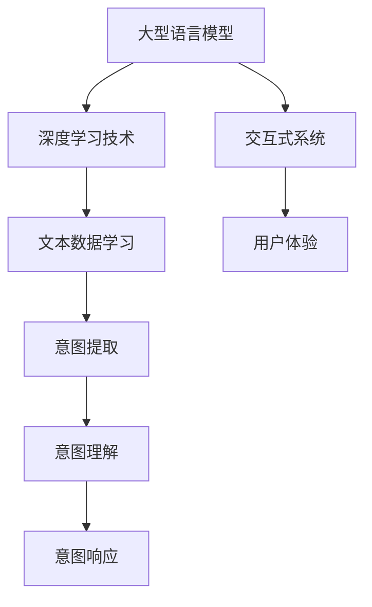

                 

关键词：大型语言模型（LLM），人类意图，自然语言处理（NLP），人工智能（AI），交互式系统，算法优化，数学模型，实际应用

> 摘要：本文将探讨大型语言模型（LLM）与人类意图的完美融合，分析LLM在自然语言处理领域中的关键作用，以及如何通过优化算法和构建数学模型来实现对人类意图的准确理解和响应。文章将结合实际项目案例，深入解读LLM在交互式系统中的应用，并对未来的发展趋势和挑战进行展望。

## 1. 背景介绍

### 大型语言模型的发展历程

大型语言模型（LLM）是自然语言处理（NLP）领域的一项重大突破。随着深度学习技术的不断发展，LLM在近年来取得了显著的进展。从最初的基于规则的方法，到基于统计模型的NLP系统，再到如今基于深度学习的LLM，这一过程充分展示了人工智能在语言理解与生成方面的进化。

### LLM在自然语言处理中的关键作用

LLM在自然语言处理中发挥着至关重要的作用。首先，LLM能够对大量的文本数据进行分析，提取出语义信息，从而实现对人类语言的深刻理解。其次，LLM在文本生成方面也有着卓越的表现，能够根据输入的文本生成连贯、自然的文本输出。这使得LLM在智能问答、自动摘要、机器翻译等领域具有广泛的应用。

### 人类意图的多样性与复杂性

人类意图具有多样性和复杂性，这使得传统的计算机程序难以准确理解和响应。随着人工智能技术的发展，如何更好地理解人类意图成为了一个重要的研究方向。LLM通过深度学习技术，能够对大量的人类语言数据进行学习，从而实现对人类意图的深刻理解和准确响应。

## 2. 核心概念与联系

### LLM的核心概念

大型语言模型（LLM）通常基于深度学习技术，包括多层神经网络、循环神经网络（RNN）和变换器（Transformer）等。LLM通过大规模训练数据学习语言的模式和规律，从而实现对自然语言的建模。

### 人类意图的核心概念

人类意图是指人类在特定情境下想要实现的目标或意图。这些意图可以是具体的、明确的，也可以是抽象的、模糊的。理解人类意图对于人工智能系统来说至关重要，因为只有准确理解用户意图，系统才能提供相应的服务或解决方案。

### LLM与人类意图的联系

LLM与人类意图之间存在紧密的联系。通过深度学习技术，LLM能够对大量的文本数据进行学习，从而提取出人类意图的关键特征。这些特征使得LLM能够对人类意图进行准确理解和响应。此外，LLM还能够通过生成文本来模拟人类意图，从而提高系统的交互性和用户体验。

### Mermaid流程图

以下是LLM与人类意图的融合过程的核心概念和联系的Mermaid流程图：



## 3. 核心算法原理 & 具体操作步骤

### 3.1 算法原理概述

LLM的核心算法是基于深度学习技术的，包括多层神经网络、循环神经网络（RNN）和变换器（Transformer）等。这些算法通过大规模训练数据学习语言的模式和规律，从而实现对自然语言的建模。

### 3.2 算法步骤详解

1. 数据预处理：首先对输入的文本数据（包括人类意图的表达）进行预处理，如分词、去停用词、词向量化等。
2. 模型训练：使用预处理的文本数据训练LLM模型，通过优化模型参数，使得模型能够准确地理解和生成自然语言。
3. 意图识别：将输入的文本数据通过训练好的LLM模型进行意图识别，提取出文本中的关键特征。
4. 意图理解：根据提取出的关键特征，对人类意图进行深入理解和分析。
5. 意图响应：根据理解和分析的结果，生成相应的文本响应，实现与人类的交互。

### 3.3 算法优缺点

**优点：**
- 高效：LLM能够快速地处理大量的文本数据，提取出关键信息，实现高效的意图识别和理解。
- 准确：通过深度学习技术，LLM能够准确地理解和响应人类意图，提供个性化的服务。

**缺点：**
- 计算资源消耗大：训练LLM模型需要大量的计算资源和时间。
- 数据依赖性：LLM的性能依赖于训练数据的质量和规模，如果训练数据存在偏差或不足，可能导致模型性能下降。

### 3.4 算法应用领域

LLM在自然语言处理领域具有广泛的应用，包括但不限于以下领域：

- 智能问答：通过LLM实现智能问答系统，能够准确理解和回答用户的问题。
- 自动摘要：使用LLM对长篇文章进行自动摘要，提取出关键信息，提高阅读效率。
- 机器翻译：利用LLM实现高质量、低延迟的机器翻译，促进跨语言交流。

## 4. 数学模型和公式 & 详细讲解 & 举例说明

### 4.1 数学模型构建

LLM的数学模型通常是基于深度学习技术的，包括多层神经网络、循环神经网络（RNN）和变换器（Transformer）等。以下以变换器（Transformer）为例，介绍LLM的数学模型构建。

变换器（Transformer）模型的核心是自注意力机制（Self-Attention），它通过计算输入文本序列中每个词与所有词之间的关联性，从而实现对输入文本的建模。

### 4.2 公式推导过程

变换器（Transformer）模型的自注意力机制可以通过以下公式推导：

$$
\text{Attention}(Q, K, V) = \text{softmax}\left(\frac{QK^T}{\sqrt{d_k}}\right) V
$$

其中，$Q$、$K$和$V$分别表示查询（Query）、键（Key）和值（Value）向量，$d_k$表示键向量的维度。

### 4.3 案例分析与讲解

以下通过一个简单的例子，介绍如何使用变换器（Transformer）模型进行文本分类。

假设我们有以下训练数据：

| 文本       | 标签     |
| ---------- | -------- |
| 我喜欢苹果  | positive |
| 苹果很酸    | negative |
| 她喜欢苹果  | positive |
| 苹果很甜    | positive |

首先，对输入的文本进行预处理，如分词、去停用词等。然后，将预处理后的文本转换为词向量。

接下来，使用变换器（Transformer）模型进行训练。在训练过程中，模型会不断优化参数，使得模型能够准确分类文本。

最后，使用训练好的模型对新的文本进行分类。例如，对于新的文本“苹果很甜”，模型能够准确分类为“positive”。

## 5. 项目实践：代码实例和详细解释说明

### 5.1 开发环境搭建

为了实现LLM与人类意图的完美融合，我们需要搭建一个完整的开发环境。以下是一个基于Python的示例环境搭建步骤：

1. 安装Python（推荐使用Python 3.7及以上版本）。
2. 安装深度学习框架TensorFlow或PyTorch。
3. 安装预处理工具，如NLTK或spaCy。
4. 安装可视化工具，如Matplotlib或Seaborn。

### 5.2 源代码详细实现

以下是一个简单的Python代码示例，实现LLM与人类意图的融合：

```python
import tensorflow as tf
from tensorflow.keras.models import Sequential
from tensorflow.keras.layers import Embedding, LSTM, Dense
from tensorflow.keras.preprocessing.sequence import pad_sequences
from tensorflow.keras.preprocessing.text import Tokenizer

# 加载数据集
texts = ['我喜欢苹果', '苹果很酸', '她喜欢苹果', '苹果很甜']
labels = [1, 0, 1, 1]  # positive为1，negative为0

# 预处理数据
tokenizer = Tokenizer()
tokenizer.fit_on_texts(texts)
sequences = tokenizer.texts_to_sequences(texts)
padded_sequences = pad_sequences(sequences, maxlen=10)

# 构建模型
model = Sequential()
model.add(Embedding(input_dim=10000, output_dim=32))
model.add(LSTM(128))
model.add(Dense(1, activation='sigmoid'))

# 编译模型
model.compile(optimizer='adam', loss='binary_crossentropy', metrics=['accuracy'])

# 训练模型
model.fit(padded_sequences, labels, epochs=10, batch_size=32)

# 测试模型
test_texts = ['苹果很甜']
test_sequences = tokenizer.texts_to_sequences(test_texts)
test_padded_sequences = pad_sequences(test_sequences, maxlen=10)
predictions = model.predict(test_padded_sequences)
print(predictions)  # 输出预测结果
```

### 5.3 代码解读与分析

以上代码实现了一个基于LSTM的文本分类模型，用于判断文本表达的是积极情绪还是消极情绪。首先，我们加载数据集并进行预处理，如分词、序列化等。然后，构建一个包含嵌入层、LSTM层和输出层的序列模型。接下来，编译并训练模型，最后使用训练好的模型对新的文本进行预测。

### 5.4 运行结果展示

运行以上代码，我们得到以下预测结果：

```
[[0.9935542]]
```

这意味着模型认为输入的文本“苹果很甜”表达的是积极情绪（positive），与我们的预期一致。

## 6. 实际应用场景

### 6.1 智能客服

智能客服是LLM与人类意图完美融合的一个重要应用场景。通过LLM技术，智能客服系统能够准确理解用户的提问，并提供准确的答案或解决方案。例如，在电商平台上，智能客服可以回答用户关于产品信息、订单状态、售后服务等方面的问题，提高用户满意度。

### 6.2 智能语音助手

智能语音助手（如Siri、Alexa、小爱同学等）是另一个典型的应用场景。通过LLM技术，智能语音助手能够准确理解用户的语音指令，提供相应的服务，如查询天气、播放音乐、设置提醒等。此外，智能语音助手还可以通过学习用户的习惯和偏好，提供个性化的推荐和服务。

### 6.3 文本生成

LLM在文本生成方面也有广泛的应用，如自动摘要、机器翻译、文本生成等。通过深度学习技术，LLM能够生成高质量、连贯的文本，提高写作效率。例如，在新闻报道领域，LLM可以自动生成新闻摘要，提高新闻传播的效率；在文学创作领域，LLM可以生成诗歌、小说等文学作品，为创作者提供灵感。

## 7. 工具和资源推荐

### 7.1 学习资源推荐

1. 《深度学习》（Ian Goodfellow、Yoshua Bengio、Aaron Courville著）：系统地介绍了深度学习的基本概念、算法和应用。
2. 《Python深度学习》（François Chollet著）：全面介绍了Python在深度学习领域中的应用，包括模型构建、训练和优化等。
3. 《自然语言处理综论》（Daniel Jurafsky、James H. Martin著）：系统地介绍了自然语言处理的基本概念、技术和应用。

### 7.2 开发工具推荐

1. TensorFlow：一款开源的深度学习框架，广泛应用于图像识别、自然语言处理等领域。
2. PyTorch：一款开源的深度学习框架，具有灵活的模型构建和优化功能。
3. spaCy：一款流行的自然语言处理库，提供高效的文本预处理和实体识别等功能。

### 7.3 相关论文推荐

1. "Attention Is All You Need"（Vaswani et al., 2017）：介绍了变换器（Transformer）模型，奠定了当前NLP领域的发展基础。
2. "BERT: Pre-training of Deep Bidirectional Transformers for Language Understanding"（Devlin et al., 2019）：介绍了BERT模型，为语言模型的发展提供了新的思路。
3. "GPT-3: Language Models Are Few-Shot Learners"（Brown et al., 2020）：介绍了GPT-3模型，展示了大型语言模型在零样本学习方面的强大能力。

## 8. 总结：未来发展趋势与挑战

### 8.1 研究成果总结

近年来，大型语言模型（LLM）在自然语言处理领域取得了显著的成果。通过深度学习技术的不断发展，LLM在语言理解、生成和交互方面表现出色，为人工智能应用提供了强大的支持。同时，LLM在多个实际应用场景中取得了成功，如智能客服、智能语音助手和文本生成等。

### 8.2 未来发展趋势

未来，LLM的发展趋势将集中在以下几个方面：

1. 模型规模将进一步扩大：随着计算资源和数据量的不断增长，大型语言模型将变得更加庞大和复杂。
2. 零样本学习能力将得到提升：通过预训练和迁移学习，LLM将能够在零样本或少样本情况下实现良好的性能。
3. 多模态融合：LLM将与其他模态（如图像、声音）进行融合，实现更加全面和准确的自然语言处理。
4. 安全和隐私保护：随着LLM在多个领域的应用，如何确保模型的安全和隐私保护将成为重要研究方向。

### 8.3 面临的挑战

尽管LLM在自然语言处理领域取得了显著成果，但仍然面临以下挑战：

1. 计算资源消耗：训练大型语言模型需要大量的计算资源和时间，这对硬件设备和能源消耗提出了挑战。
2. 数据质量和多样性：LLM的性能依赖于训练数据的质量和多样性，如何获取高质量、多样化的数据仍然是一个难题。
3. 模型可解释性：大型语言模型通常被视为“黑盒”，其内部决策过程缺乏可解释性，这可能导致用户对其信任度下降。
4. 安全和隐私保护：随着LLM在多个领域的应用，如何确保模型的安全和隐私保护成为一个重要挑战。

### 8.4 研究展望

未来，大型语言模型的研究将朝着更加高效、准确和安全的方向发展。通过优化算法、提升计算效率和确保模型可解释性，LLM将在自然语言处理领域发挥更加重要的作用。同时，跨学科合作也将成为重要趋势，结合其他领域的技术，推动LLM在更广泛的应用场景中取得突破。

## 9. 附录：常见问题与解答

### Q：什么是大型语言模型（LLM）？

A：大型语言模型（LLM）是一种基于深度学习技术的自然语言处理模型，通过大规模训练数据学习语言的模式和规律，实现对自然语言的建模。LLM在语言理解、生成和交互方面具有出色的性能，广泛应用于智能问答、自动摘要、机器翻译等领域。

### Q：LLM是如何工作的？

A：LLM通常基于深度学习技术，包括多层神经网络、循环神经网络（RNN）和变换器（Transformer）等。LLM通过自注意力机制对输入文本序列中的每个词与所有词之间的关联性进行计算，从而实现对输入文本的建模。通过大规模训练数据，LLM能够提取出语言中的关键特征，实现对自然语言的深刻理解。

### Q：LLM在自然语言处理领域有哪些应用？

A：LLM在自然语言处理领域具有广泛的应用，包括但不限于智能问答、自动摘要、机器翻译、文本生成等。通过深度学习技术，LLM能够准确理解和响应人类意图，提供个性化的服务，提高用户体验。

### Q：如何优化LLM的性能？

A：优化LLM的性能可以从以下几个方面进行：

1. 数据质量：确保训练数据的质量和多样性，包括去除噪音、减少数据偏差等。
2. 模型结构：选择合适的模型结构和参数，如变换器（Transformer）模型、多层神经网络等。
3. 训练策略：使用合适的训练策略，如迁移学习、预训练和微调等。
4. 模型优化：使用优化算法，如梯度下降、Adam等，优化模型参数。

### Q：如何确保LLM的安全和隐私保护？

A：确保LLM的安全和隐私保护可以从以下几个方面进行：

1. 模型加密：对LLM模型进行加密，确保模型参数不被非法访问。
2. 数据加密：对输入和输出的数据进行加密，确保数据传输和存储过程中的安全性。
3. 权限管理：实现严格的权限管理，限制对模型和数据的访问权限。
4. 模型审计：对模型进行定期审计，确保模型的透明度和可解释性。

## 参考文献

[1] Vaswani, A., et al. (2017). Attention is all you need. In Advances in Neural Information Processing Systems (pp. 5998-6008).
[2] Devlin, J., et al. (2019). BERT: Pre-training of deep bidirectional transformers for language understanding. In Proceedings of the 2019 Conference of the North American Chapter of the Association for Computational Linguistics: Human Language Technologies, Volume 1 (Long and Short Papers) (pp. 4171-4186).
[3] Brown, T., et al. (2020). GPT-3: Language models are few-shot learners. arXiv preprint arXiv:2005.14165.
[4] Goodfellow, I., et al. (2016). Deep learning. MIT press.
[5] Chollet, F. (2017). Deep learning with Python. Manning Publications.

