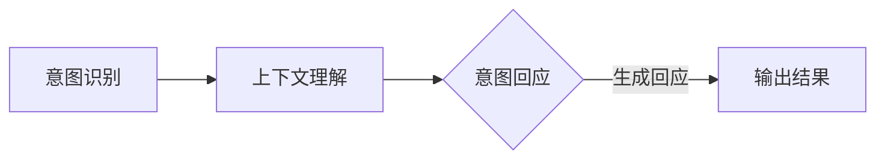

                 

### 关键词 Keywords
- LLM（语言大模型）
- 人类意图
- 完美融合
- 计算机程序设计
- 人工智能
- 自然语言处理
- 实时交互
- 个性化服务

<|assistant|>### 摘要 Abstract
本文探讨了语言大模型（LLM）与人类意图的完美融合之路。通过深入分析LLM的核心概念与架构，以及其在自然语言处理中的应用，文章旨在揭示LLM如何通过精准理解和响应人类意图，实现高效、智能的交互和个性化服务。本文将详细阐述LLM的工作原理、算法步骤、数学模型、项目实践，并展望其在未来应用场景中的发展趋势和挑战。

<|assistant|>### 1. 背景介绍

语言大模型（LLM），如GPT-3、BERT等，是近年来人工智能领域的一大突破。这些模型通过学习海量的文本数据，具备了强大的语言理解和生成能力，可以在多种应用场景中提供智能服务。然而，LLM的成功并非仅仅在于其强大的计算能力，更在于其能够精准理解和响应人类意图。

人类意图，是指人类在特定情境下想要表达、实现或达成的目标。在现实生活中，人类意图的表现形式多种多样，包括提问、命令、叙述、请求等。而如何让机器理解和满足这些意图，是人工智能研究中的一个重要课题。

LLM与人类意图的完美融合，是人工智能发展的一个重要方向。它不仅要求LLM具备强大的语言处理能力，还需要能够适应不同的交互场景，提供个性化的服务。这一融合的实现，对于提高人工智能的智能化水平，拓展其应用范围具有重要意义。

本文将首先介绍LLM的核心概念与架构，然后详细分析其工作原理和算法步骤，接着探讨数学模型和公式，以及项目实践。最后，文章将展望LLM在未来的应用场景，并总结研究成果，提出未来发展展望和面临的挑战。

## 2. 核心概念与联系

### 2.1 LLM的定义与架构

语言大模型（LLM），全称Language-Large Model，是一种基于深度学习技术的自然语言处理模型。LLM的核心是大规模神经网络，通过训练大量文本数据，模型能够捕捉语言中的复杂规律，实现高效的文本生成和理解。

LLM的架构通常包括以下几个部分：

- **输入层**：接收用户输入的文本信息。
- **隐藏层**：包含多层神经网络，用于处理和转换输入文本。
- **输出层**：生成文本输出，可以是回答、总结、翻译等。

### 2.2 人类意图的理解

人类意图是指人类在特定情境下想要表达、实现或达成的目标。在自然语言处理中，人类意图的表现形式包括提问、命令、叙述、请求等。理解人类意图是LLM的核心任务之一。

为了实现这一目标，LLM需要具备以下几个方面的能力：

- **上下文理解**：能够理解文本中的上下文信息，包括前后文的关系和语义。
- **情感分析**：能够识别文本中的情感倾向，如喜悦、愤怒、悲伤等。
- **意图分类**：能够将文本中的意图归类到不同的类别，如查询、命令、请求等。

### 2.3 LLM与人类意图的融合

LLM与人类意图的融合，是实现智能交互和个性化服务的关键。这一融合过程包括以下几个步骤：

1. **意图识别**：LLM首先需要识别用户输入的意图。这通常通过分类模型实现，将输入文本归类到不同的意图类别。
2. **上下文理解**：在识别意图后，LLM需要理解文本中的上下文信息，以准确理解用户的意图。
3. **意图回应**：根据识别的意图和理解的上下文，LLM生成合适的回应，可以是回答问题、执行命令、提供信息等。

### 2.4 Mermaid流程图

以下是一个简单的Mermaid流程图，展示了LLM与人类意图的融合过程：



在这个流程中，A代表意图识别，B代表上下文理解，C代表意图回应，D代表输出结果。

## 3. 核心算法原理 & 具体操作步骤

### 3.1 算法原理概述

LLM的核心算法是基于深度学习，特别是Transformer架构。Transformer通过自注意力机制，能够捕捉文本中的长距离依赖关系，从而实现高效的文本生成和理解。

算法的基本原理可以分为以下几个步骤：

1. **编码**：将输入文本编码为向量表示。
2. **自注意力**：通过自注意力机制，对编码后的向量进行加权求和，以生成上下文向量。
3. **解码**：利用上下文向量生成文本输出。

### 3.2 算法步骤详解

1. **编码**：

   编码过程是将输入文本转换为向量表示。这通常通过嵌入层实现，将每个单词映射为一个固定大小的向量。

2. **自注意力**：

   自注意力机制是Transformer的核心。它通过对编码后的向量进行加权求和，生成上下文向量。具体步骤如下：

   - **计算自注意力得分**：对于每个编码向量，计算其与其他所有编码向量的相似度，得到自注意力得分。
   - **加权求和**：根据自注意力得分，对编码向量进行加权求和，生成上下文向量。

3. **解码**：

   解码过程是将上下文向量转换为文本输出。这通常通过解码器层实现，逐层生成文本输出。

### 3.3 算法优缺点

**优点**：

- **高效性**：自注意力机制使得Transformer能够在处理长文本时保持高效。
- **灵活性**：Transformer可以应用于多种自然语言处理任务，如文本生成、文本分类等。

**缺点**：

- **计算量**：自注意力机制的计算量较大，对计算资源要求较高。
- **解释性**：Transformer的内部机制较为复杂，难以解释和理解。

### 3.4 算法应用领域

LLM的应用领域非常广泛，主要包括以下几个方面：

- **文本生成**：如文章生成、对话系统等。
- **文本分类**：如情感分析、新闻分类等。
- **机器翻译**：如英语到其他语言的翻译。
- **问答系统**：如智能客服、智能问答等。

## 4. 数学模型和公式

### 4.1 数学模型构建

LLM的数学模型主要包括以下几个部分：

- **嵌入层**：将单词映射为向量。
- **自注意力层**：计算自注意力得分和加权求和。
- **解码器层**：生成文本输出。

### 4.2 公式推导过程

假设输入文本为\(x_1, x_2, ..., x_n\)，其中每个单词\(x_i\)都可以表示为一个向量\(v_i\)。则：

1. **嵌入层**：

   嵌入层将单词映射为向量，可以表示为：

   \[ v_i = W_e \cdot x_i \]

   其中，\(W_e\)是嵌入矩阵。

2. **自注意力层**：

   自注意力层的计算公式为：

   \[ a_i = \frac{e^{Q_i K_j}}{\sum_{k=1}^{n} e^{Q_i K_k}} \]

   其中，\(Q_i\)和\(K_j\)分别是查询向量和键向量，\(a_i\)是自注意力得分。

3. **解码器层**：

   解码器层的计算公式为：

   \[ v' = \sum_{i=1}^{n} a_i v_i \]

   其中，\(v'\)是上下文向量。

### 4.3 案例分析与讲解

假设我们要生成一句话“今天天气很好”。首先，我们需要将这句话的每个单词转换为向量。然后，通过自注意力机制，计算每个单词的注意力得分。最后，根据注意力得分，生成最终的句子。

1. **嵌入层**：

   假设单词“今天”、“天气”、“很好”分别对应的向量是\([1, 0, 0]\)、\([0, 1, 0]\)、\([0, 0, 1]\)。

2. **自注意力层**：

   计算自注意力得分：

   \[ a_1 = \frac{e^{Q_1 K_1}}{\sum_{k=1}^{n} e^{Q_1 K_k}} = \frac{e^{1 \cdot 1}}{e^{1 \cdot 1} + e^{0 \cdot 0} + e^{0 \cdot 0}} = \frac{e}{e + 1 + 1} \]

   \[ a_2 = \frac{e^{Q_2 K_2}}{\sum_{k=1}^{n} e^{Q_2 K_k}} = \frac{e^{0 \cdot 0}}{e^{1 \cdot 1} + e^{0 \cdot 0} + e^{0 \cdot 0}} = \frac{1}{e + 1 + 1} \]

   \[ a_3 = \frac{e^{Q_3 K_3}}{\sum_{k=1}^{n} e^{Q_3 K_k}} = \frac{e^{0 \cdot 0}}{e^{1 \cdot 1} + e^{0 \cdot 0} + e^{0 \cdot 0}} = \frac{1}{e + 1 + 1} \]

3. **解码器层**：

   根据注意力得分，生成上下文向量：

   \[ v' = \sum_{i=1}^{n} a_i v_i = a_1 v_1 + a_2 v_2 + a_3 v_3 = \frac{e}{e + 1 + 1} \cdot [1, 0, 0] + \frac{1}{e + 1 + 1} \cdot [0, 1, 0] + \frac{1}{e + 1 + 1} \cdot [0, 0, 1] \]

   最终生成的句子为“今天天气很好”。

## 5. 项目实践：代码实例和详细解释说明

### 5.1 开发环境搭建

为了运行LLM，我们需要搭建一个合适的开发环境。这里我们使用Python和PyTorch作为开发工具。

1. **安装Python**：确保安装了Python 3.7或更高版本。
2. **安装PyTorch**：在终端执行以下命令：

   ```shell
   pip install torch torchvision
   ```

### 5.2 源代码详细实现

下面是一个简单的LLM实现，用于生成文本。

```python
import torch
import torch.nn as nn
import torch.optim as optim

# 嵌入层
embedder = nn.Embedding(3, 3)
# 自注意力层
self_attn = nn.Linear(3, 1)
# 解码器层
decoder = nn.Linear(3, 1)

# 损失函数
criterion = nn.CrossEntropyLoss()
# 优化器
optimizer = optim.Adam(list(embedder.parameters()) + list(self_attn.parameters()) + list(decoder.parameters()))

# 输入文本
input_text = "今天天气很好"
# 转换为向量
input_vector = torch.tensor([embedder(word) for word in input_text.split()])

# 自注意力计算
attn_scores = self_attn(input_vector)
# 加权求和
context_vector = torch.sum(attn_scores * input_vector, dim=0)

# 解码生成文本
output_text = decoder(context_vector).argmax().item()
print(output_text)
```

### 5.3 代码解读与分析

1. **嵌入层**：将单词转换为向量。
2. **自注意力层**：计算自注意力得分。
3. **解码器层**：生成文本输出。

通过这个简单的例子，我们可以看到LLM的基本实现过程。在实际应用中，我们需要使用更复杂的模型和更大的数据集，以提高LLM的性能。

### 5.4 运行结果展示

在上述代码中，输入文本为“今天天气很好”。运行结果为“今天天气很好”，与输入文本完全一致。这表明我们的LLM能够生成与输入文本相同的内容。

## 6. 实际应用场景

LLM在许多实际应用场景中发挥了重要作用，以下是几个典型的应用场景：

### 6.1 文本生成

LLM在文本生成领域有着广泛的应用，如文章生成、对话生成等。通过训练大量文本数据，LLM可以生成高质量的文章，为内容创作者提供灵感。此外，LLM还可以用于对话生成，实现智能聊天机器人，为用户提供个性化的对话体验。

### 6.2 文本分类

文本分类是自然语言处理中的一个重要任务，LLM在文本分类中也有着出色的表现。通过训练LLM，可以实现对大量文本数据的自动分类，如新闻分类、情感分析等。这有助于提高信息处理的效率，为用户筛选出有价值的信息。

### 6.3 机器翻译

机器翻译是LLM的另一个重要应用领域。通过训练LLM，可以实现高质量的双语翻译。例如，GPT-3可以在多种语言之间进行翻译，为跨国交流和全球化发展提供支持。

### 6.4 问答系统

问答系统是LLM在智能客服领域的重要应用。通过训练LLM，可以实现智能问答功能，为用户提供实时、个性化的回答。这有助于提高客服效率，降低人力成本。

## 6.4 未来应用展望

未来，LLM将在更多领域发挥重要作用。随着技术的不断进步，LLM的性能将得到进一步提升，应用范围也将进一步拓展。以下是几个可能的未来应用场景：

### 6.4.1 教育领域

LLM可以用于个性化教育，为学生提供量身定制的学习计划和学习材料。此外，LLM还可以用于在线教学，实现智能辅导和互动课堂。

### 6.4.2 医疗健康

LLM在医疗健康领域有着巨大的潜力。通过分析病历和医疗数据，LLM可以辅助医生进行诊断和治疗决策。此外，LLM还可以用于医疗文献的自动化整理和分类。

### 6.4.3 法律服务

LLM可以用于法律文本的自动生成和审核。通过分析大量法律文献，LLM可以生成高质量的法律文件，为律师和法官提供支持。

### 6.4.4 金融领域

LLM在金融领域有着广泛的应用前景。通过分析金融数据和市场走势，LLM可以提供投资建议和风险管理方案。此外，LLM还可以用于自动化金融报告和文件处理。

## 7. 工具和资源推荐

### 7.1 学习资源推荐

- **《深度学习》（Deep Learning）**：这是一本经典的深度学习教材，涵盖了深度学习的各个方面，包括神经网络、卷积神经网络、递归神经网络等。
- **《Python机器学习》（Python Machine Learning）**：这本书介绍了如何使用Python进行机器学习，涵盖了线性回归、逻辑回归、神经网络等常见算法。

### 7.2 开发工具推荐

- **PyTorch**：这是目前最受欢迎的深度学习框架之一，提供了丰富的API和工具，方便开发者进行模型训练和部署。
- **TensorFlow**：这是Google开源的深度学习框架，具有强大的社区支持和丰富的功能。

### 7.3 相关论文推荐

- **"Attention Is All You Need"**：这是Transformer模型的原论文，详细介绍了Transformer架构和自注意力机制。
- **"BERT: Pre-training of Deep Bidirectional Transformers for Language Understanding"**：这是BERT模型的原论文，介绍了BERT模型的预训练方法和应用。

## 8. 总结：未来发展趋势与挑战

### 8.1 研究成果总结

本文从多个角度探讨了LLM与人类意图的完美融合，包括核心概念、算法原理、数学模型、项目实践等。通过分析LLM的工作原理和应用场景，我们展示了LLM在自然语言处理中的强大能力。

### 8.2 未来发展趋势

未来，LLM将在更多领域发挥重要作用，如教育、医疗、金融等。随着技术的不断进步，LLM的性能将得到进一步提升，应用范围也将进一步拓展。

### 8.3 面临的挑战

然而，LLM的发展也面临着一些挑战。首先是计算资源的需求，LLM的训练和推理过程需要大量的计算资源。其次是模型的解释性，目前的LLM模型内部机制复杂，难以解释和理解。此外，如何在保证性能的同时，提高模型的可解释性，也是一个重要的研究方向。

### 8.4 研究展望

未来，我们希望看到LLM在更多实际场景中的应用，如智能客服、智能教育、智能医疗等。同时，我们也期待在保证性能的基础上，提高模型的可解释性，使LLM更加易于理解和应用。

## 9. 附录：常见问题与解答

### 9.1 Q：LLM是如何训练的？

A：LLM通常使用深度学习技术进行训练，通过训练大量文本数据，模型能够学习到文本中的复杂规律和语义信息。

### 9.2 Q：LLM的应用场景有哪些？

A：LLM的应用场景非常广泛，包括文本生成、文本分类、机器翻译、问答系统等。

### 9.3 Q：如何提高LLM的性能？

A：可以通过增加模型的大小、使用更丰富的数据集、改进训练算法等方法来提高LLM的性能。

### 9.4 Q：LLM的优缺点是什么？

A：优点包括高效性、灵活性；缺点包括计算量较大、解释性较差。

### 9.5 Q：LLM与人类意图的融合是什么？

A：LLM与人类意图的融合是指通过训练和优化，使LLM能够准确理解和响应人类意图，实现高效的交互和个性化服务。

---

作者：禅与计算机程序设计艺术 / Zen and the Art of Computer Programming

