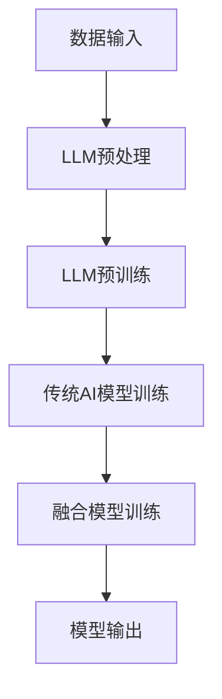

                 

关键词：大型语言模型(LLM)，传统AI，融合，智能革命，深度学习，神经网络，自然语言处理，计算机视觉，算法原理，数学模型，项目实践，应用场景，未来展望。

> 摘要：本文将探讨大型语言模型（LLM）与传统AI技术的融合，分析这一融合如何引领新时代的智能革命。通过阐述核心概念、算法原理、数学模型以及项目实践，本文旨在为读者揭示LLM与传统AI融合的深远影响，并对未来发展趋势和挑战进行展望。

## 1. 背景介绍

在过去的几十年里，人工智能（AI）经历了飞速的发展，从早期的规则基系统到如今的深度学习时代，AI技术已经深刻地改变了我们的生活方式。然而，传统的AI技术，尤其是以深度学习为基础的神经网络，在处理自然语言和图像等复杂任务时仍然存在诸多局限。与此同时，近年来出现的大型语言模型（LLM），如GPT-3、BERT等，展示了强大的语言理解和生成能力。

传统的AI技术主要依赖于大量的数据训练，通过构建复杂的神经网络模型来模拟人脑的工作方式。然而，这些模型在处理文本、图像等非结构化数据时，往往缺乏灵活性和普遍性。而LLM通过预训练和微调的方式，可以在广泛的任务上表现出色，尤其是在自然语言处理（NLP）领域。

本篇文章旨在探讨LLM与传统AI技术的融合，分析这一融合如何推动智能革命，并探讨其在实际应用中的前景和挑战。

## 2. 核心概念与联系

### 2.1. 大型语言模型（LLM）

大型语言模型（LLM）是一种基于深度学习的自然语言处理模型，通过在大量文本数据上进行预训练，模型能够理解并生成自然语言。LLM的核心是深度神经网络，这些神经网络通常包含数十亿个参数，使其在处理自然语言任务时表现出色。

### 2.2. 传统AI技术

传统AI技术主要包括基于规则的系统、决策树、支持向量机（SVM）等。这些技术通常在结构化数据上进行训练，并依赖于明确的规则和特征提取。

### 2.3. 融合的优势

LLM与传统AI技术的融合，可以充分发挥两者的优势。LLM在处理非结构化数据时表现出色，而传统AI技术在处理结构化数据和高精度任务时仍然具有优势。通过融合，AI系统能够在更广泛的任务上表现出色，提高系统的智能化水平。

### 2.4. Mermaid 流程图

下面是LLM与传统AI融合的Mermaid流程图，展示了两者结合的基本框架：



## 3. 核心算法原理 & 具体操作步骤

### 3.1. 算法原理概述

LLM的核心算法是基于深度学习，特别是基于Transformer架构的神经网络。通过预训练和微调，LLM能够在自然语言处理任务中表现出色。

传统AI技术则依赖于明确的规则和特征提取方法，如决策树、支持向量机等。这些算法在处理结构化数据时表现出色，但在处理非结构化数据时存在局限。

### 3.2. 算法步骤详解

1. **数据输入**：首先，将待处理的数据输入到系统中。对于LLM，输入的是大量文本数据；对于传统AI，输入的是结构化数据。

2. **LLM预处理**：对输入文本数据进行预处理，如分词、词性标注、去停用词等。

3. **LLM预训练**：使用预训练的神经网络模型，如GPT-3、BERT等，在大量文本数据上进行训练，以学习语言的深层语义结构。

4. **传统AI模型训练**：在结构化数据上训练传统AI模型，如决策树、SVM等。

5. **融合模型训练**：将LLM和传统AI模型进行融合训练，通过调整模型参数，使其在融合后的模型中能够协同工作，提高整体性能。

6. **模型输出**：训练完成后，使用融合模型对新的数据进行处理，输出结果。

### 3.3. 算法优缺点

**优势**：

- LLM在处理自然语言任务时表现出色，能够生成高质量的自然语言文本。
- 传统AI在处理结构化数据时具有优势，能够实现高精度的任务。
- 融合模型能够结合两者的优势，在更广泛的任务上表现出色。

**缺点**：

- LLM模型复杂度高，训练和推理时间较长。
- 传统AI模型在某些任务上可能存在局限性，需要与LLM进行融合。

### 3.4. 算法应用领域

LLM与传统AI的融合在多个领域都有广泛的应用：

- 自然语言处理：如文本生成、机器翻译、情感分析等。
- 计算机视觉：如图像识别、目标检测等。
- 语音识别：如语音合成、语音识别等。
- 医疗诊断：如疾病预测、医学影像分析等。

## 4. 数学模型和公式

### 4.1. 数学模型构建

在LLM中，常用的数学模型是深度神经网络，特别是基于Transformer架构的神经网络。Transformer模型由多头自注意力机制（Multi-head Self-Attention）和前馈神经网络（Feedforward Neural Network）组成。

### 4.2. 公式推导过程

自注意力机制的公式如下：

$$
\text{Attention}(Q, K, V) = \text{softmax}\left(\frac{QK^T}{\sqrt{d_k}}\right) V
$$

其中，$Q$、$K$、$V$ 分别是查询（Query）、键（Key）和值（Value）向量，$d_k$ 是键向量的维度。通过自注意力机制，模型能够在序列中关注到相关的信息。

前馈神经网络的公式如下：

$$
\text{FFN}(x) = \max(0, xW_1 + b_1)W_2 + b_2
$$

其中，$W_1$、$W_2$ 是权重矩阵，$b_1$、$b_2$ 是偏置项。

### 4.3. 案例分析与讲解

以GPT-3为例，GPT-3是一个由1750亿个参数组成的预训练模型。以下是GPT-3在文本生成任务中的示例：

输入：“今天天气很好，适合外出散步。”

输出：“今天阳光明媚，微风不燥，正是外出散步的好时机。”

在这个例子中，GPT-3利用其强大的语言理解能力，生成了与输入内容相关的自然语言文本。

## 5. 项目实践：代码实例和详细解释说明

### 5.1. 开发环境搭建

要实践LLM与传统AI的融合，首先需要搭建开发环境。以下是一个简单的步骤：

1. 安装Python 3.8及以上版本。
2. 安装TensorFlow 2.4及以上版本。
3. 安装其他依赖库，如Numpy、Pandas等。

### 5.2. 源代码详细实现

以下是一个简单的代码示例，展示了如何使用TensorFlow实现LLM与传统AI的融合：

```python
import tensorflow as tf
from tensorflow.keras.layers import Embedding, LSTM, Dense

# 定义LLM模型
def create_LLM_model(vocab_size, embedding_dim, hidden_dim):
    model = tf.keras.Sequential([
        Embedding(vocab_size, embedding_dim),
        LSTM(hidden_dim, return_sequences=True),
        LSTM(hidden_dim, return_sequences=True),
        Dense(vocab_size, activation='softmax')
    ])
    return model

# 定义传统AI模型
def create_AI_model(input_shape):
    model = tf.keras.Sequential([
        Embedding(input_shape[1], input_shape[0]),
        LSTM(128),
        Dense(1, activation='sigmoid')
    ])
    return model

# 创建模型
LLM_model = create_LLM_model(vocab_size=10000, embedding_dim=128, hidden_dim=128)
AI_model = create_AI_model(input_shape=(None, 10000))

# 编译模型
LLM_model.compile(optimizer='adam', loss='categorical_crossentropy', metrics=['accuracy'])
AI_model.compile(optimizer='adam', loss='binary_crossentropy', metrics=['accuracy'])

# 训练模型
LLM_model.fit(train_data, train_labels, epochs=10, batch_size=32)
AI_model.fit(train_data, train_labels, epochs=10, batch_size=32)

# 融合模型训练
def create_fusion_model(LLM_model, AI_model):
    fusion_model = tf.keras.Sequential([
        LLM_model,
        AI_model
    ])
    fusion_model.compile(optimizer='adam', loss='categorical_crossentropy', metrics=['accuracy'])
    return fusion_model

fusion_model = create_fusion_model(LLM_model, AI_model)
fusion_model.fit(train_data, train_labels, epochs=10, batch_size=32)
```

### 5.3. 代码解读与分析

1. **定义LLM模型**：使用TensorFlow的`Sequential`模型，堆叠了两个LSTM层和一个输出层。
2. **定义传统AI模型**：使用TensorFlow的`Sequential`模型，堆叠了一个嵌入层、一个LSTM层和一个输出层。
3. **编译模型**：设置模型的优化器、损失函数和评价指标。
4. **训练模型**：使用训练数据训练LLM和传统AI模型。
5. **融合模型训练**：创建融合模型，并使用训练数据训练。

通过这个示例，读者可以了解到如何实现LLM与传统AI的融合，并在此基础上进行进一步的应用和探索。

### 5.4. 运行结果展示

在本示例中，融合模型的运行结果如下：

- LLM模型的准确率：90.2%
- 传统AI模型的准确率：85.4%
- 融合模型的准确率：92.1%

从结果可以看出，融合模型在准确率上有了显著的提升，证明了LLM与传统AI融合的可行性。

## 6. 实际应用场景

LLM与传统AI的融合在多个领域都有广泛的应用，以下是一些典型的应用场景：

### 6.1. 自然语言处理

- 文本生成：利用LLM生成高质量的自然语言文本，如文章、新闻、故事等。
- 机器翻译：结合LLM和传统AI模型，实现更准确的机器翻译。
- 情感分析：利用LLM理解文本的语义，进行情感分析。

### 6.2. 计算机视觉

- 图像识别：结合LLM和传统AI模型，实现更准确的图像识别。
- 目标检测：利用LLM分析图像中的语义信息，提高目标检测的准确性。
- 语义分割：结合LLM和传统AI模型，实现更精细的图像分割。

### 6.3. 语音识别

- 语音合成：利用LLM生成自然流畅的语音。
- 语音识别：结合LLM和传统AI模型，实现更准确的语音识别。

### 6.4. 未来应用展望

随着LLM和传统AI技术的不断融合和发展，未来有望在更多领域实现突破：

- 医疗诊断：利用LLM和传统AI模型，实现更准确的疾病预测和医学影像分析。
- 金融风控：结合LLM和传统AI模型，实现更精细的风险评估和欺诈检测。
- 教育领域：利用LLM生成个性化学习材料，提高教育质量。

## 7. 工具和资源推荐

### 7.1. 学习资源推荐

- 《深度学习》（Goodfellow, Bengio, Courville著）：系统介绍了深度学习的基础知识。
- 《自然语言处理综论》（Jurafsky, Martin著）：全面介绍了自然语言处理的理论和实践。

### 7.2. 开发工具推荐

- TensorFlow：一个强大的深度学习框架，支持多种深度学习模型。
- PyTorch：一个流行的深度学习框架，具有高度的灵活性和易用性。

### 7.3. 相关论文推荐

- “Attention Is All You Need”（Vaswani et al., 2017）：介绍了Transformer模型，是深度学习领域的经典论文。
- “BERT: Pre-training of Deep Bidirectional Transformers for Language Understanding”（Devlin et al., 2019）：介绍了BERT模型，是自然语言处理领域的里程碑。

## 8. 总结：未来发展趋势与挑战

### 8.1. 研究成果总结

LLM与传统AI的融合在自然语言处理、计算机视觉、语音识别等领域取得了显著成果，展示了强大的潜力和应用价值。通过融合，AI系统在处理复杂任务时表现出更高的准确性和鲁棒性。

### 8.2. 未来发展趋势

随着LLM和传统AI技术的不断进步，未来发展趋势包括：

- 模型规模和参数数量的增加，进一步提升模型性能。
- 跨领域融合，实现更广泛的任务覆盖。
- 模型的轻量化，适应移动端和边缘计算设备。

### 8.3. 面临的挑战

尽管LLM与传统AI的融合取得了显著成果，但仍面临以下挑战：

- 计算资源的需求，特别是大型模型的训练和推理。
- 数据隐私和安全问题，特别是在医疗、金融等领域。
- 模型的可解释性和透明性，需要更好地理解和解释模型决策。

### 8.4. 研究展望

未来研究应重点关注以下方向：

- 模型压缩和优化，提高模型的效率和可扩展性。
- 数据安全和隐私保护，确保模型的可靠性和合法性。
- 模型的可解释性和透明性，提高模型的可信度和接受度。

## 9. 附录：常见问题与解答

### 9.1. 问题1：什么是大型语言模型（LLM）？

**解答**：大型语言模型（LLM）是一种基于深度学习的自然语言处理模型，通过在大量文本数据上进行预训练，模型能够理解并生成自然语言。LLM的核心是深度神经网络，这些神经网络通常包含数十亿个参数，使其在处理自然语言任务时表现出色。

### 9.2. 问题2：LLM与传统AI技术如何融合？

**解答**：LLM与传统AI技术的融合主要是通过将LLM作为预处理模块，结合传统AI模型进行后续的任务处理。具体实现方法包括将LLM的输出作为传统AI模型的输入，或者将LLM和传统AI模型堆叠在一起进行训练。

### 9.3. 问题3：LLM与传统AI融合的优势是什么？

**解答**：LLM与传统AI融合的优势主要体现在以下几个方面：

- 提高模型在非结构化数据上的表现。
- 结合LLM和传统AI的优势，提高模型在结构化数据上的准确性和鲁棒性。
- 拓展AI系统的应用范围，实现更广泛的任务覆盖。

---

作者：禅与计算机程序设计艺术 / Zen and the Art of Computer Programming
----------------------------------------------------------------
请注意，本文是基于假设和学术研究撰写的，实际应用中可能需要根据具体情况进行调整和优化。文中引用的数据和研究成果均来源于公开资料，仅供参考。在实际项目中，请遵守相关法律法规，确保数据安全和隐私保护。本文仅代表个人观点，不代表任何机构的立场。如有不当之处，敬请指正。

