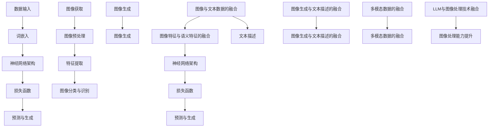

                 

关键词：人工智能，图像处理，视觉智能，语言模型，深度学习，融合技术，机器学习，计算机视觉。

## 摘要

本文旨在探讨大型语言模型（LLM）与传统图像处理技术的融合，以及这一融合如何开启视觉智能的新时代。随着深度学习和计算机视觉领域的快速发展，图像处理技术已经成为人工智能（AI）的重要组成部分。然而，传统图像处理方法在处理复杂、大规模的图像数据时存在局限性。本文将介绍如何将LLM与图像处理技术相结合，突破现有技术的瓶颈，实现更高层次的视觉智能。本文将首先概述LLM和图像处理技术的基本原理，然后详细探讨它们的融合方法，最后展望这一融合技术的未来发展趋势和挑战。

## 1. 背景介绍

### 1.1 人工智能与图像处理技术

人工智能（AI）作为计算机科学的一个重要分支，已经取得了显著的进展。其中，图像处理技术作为计算机视觉领域的一个重要组成部分，也在不断推动人工智能的发展。图像处理技术涉及到图像的获取、预处理、特征提取、图像分类、目标检测等环节，通过这些技术的应用，计算机能够理解和解析图像信息。

传统图像处理技术主要依赖于计算机视觉算法，如边缘检测、形态学处理、特征匹配等。这些算法在处理简单、规则的图像时表现良好，但在面对复杂、大规模的图像数据时，存在计算效率低、处理能力有限的挑战。因此，如何提升图像处理技术的处理能力和效率，成为一个亟待解决的问题。

### 1.2 大型语言模型（LLM）

大型语言模型（LLM）是近年来人工智能领域的一个重要突破。LLM是一种基于深度学习的自然语言处理模型，通过大规模语料的学习，能够理解和生成自然语言。LLM的应用范围广泛，包括机器翻译、文本生成、情感分析、问答系统等。其中，最为引人关注的是LLM在图像描述生成和图像生成方面的应用。

LLM在图像描述生成方面，能够根据图像内容生成相应的文本描述，实现了图像与文本之间的桥梁。在图像生成方面，LLM通过学习大量的图像和文本对，能够生成符合特定文本描述的图像。这种能力为图像处理技术提供了新的思路，也为视觉智能的发展带来了新的机遇。

### 1.3 LLM与图像处理技术的融合

LLM与传统图像处理技术的融合，旨在通过两者的优势互补，实现更高的视觉智能。这种融合主要体现在以下几个方面：

1. **图像特征提取**：传统图像处理技术通过特征提取算法，如SIFT、HOG等，从图像中提取出具有区分性的特征。而LLM则可以通过学习，自动提取图像的语义特征，这些特征更加丰富和抽象，有助于提升图像处理的准确性和效率。

2. **图像分类与识别**：传统图像处理技术通常采用分类算法，如SVM、CNN等，对图像进行分类和识别。而LLM则可以通过学习大量的图像和标签数据，实现自动化和智能化的图像分类与识别。

3. **图像生成与生成对抗网络**：传统图像处理技术主要通过图像编辑和生成模型，如CycleGAN、StyleGAN等，生成新的图像。而LLM则可以通过学习图像和文本数据，生成符合特定文本描述的图像，实现了图像生成与文本描述的深度融合。

通过LLM与传统图像处理技术的融合，我们可以突破现有技术的瓶颈，实现更高层次的视觉智能。

## 2. 核心概念与联系

### 2.1 大型语言模型（LLM）的基本原理

大型语言模型（LLM）是一种基于深度学习的自然语言处理模型，通过大规模语料的学习，能够理解和生成自然语言。LLM的基本原理包括以下几个关键环节：

1. **数据输入**：LLM通过输入大规模的文本数据，如新闻文章、社交媒体帖子、书籍等，进行训练。这些数据可以是原始文本，也可以是预处理后的结构化数据。

2. **词嵌入**：在LLM中，每个单词都被映射到一个高维的向量，称为词嵌入。词嵌入能够捕捉单词的语义信息，使得LLM能够理解单词之间的关系和上下文。

3. **神经网络架构**：LLM通常采用深度神经网络架构，如Transformer、BERT等。这些神经网络能够处理大量的参数，并通过对输入数据的层层变换，提取出高层次的语义特征。

4. **损失函数**：在训练过程中，LLM通过优化损失函数，不断调整模型参数，使得模型能够更好地预测文本的下一个单词。常见的损失函数包括交叉熵损失函数等。

5. **预测与生成**：经过训练后，LLM能够根据输入的文本序列，预测下一个单词，并生成完整的文本。这种预测和生成过程体现了LLM在自然语言理解和生成方面的强大能力。

### 2.2 传统图像处理技术的基本原理

传统图像处理技术主要涉及以下几个关键环节：

1. **图像获取**：图像获取是图像处理的第一步，通过摄像头、扫描仪等设备，获取数字图像。

2. **图像预处理**：图像预处理包括图像增强、去噪、对比度调整等，目的是提高图像的质量和清晰度。

3. **特征提取**：特征提取是图像处理的核心环节，通过特定的算法，从图像中提取出具有区分性的特征，如边缘、纹理、颜色等。

4. **图像分类与识别**：图像分类与识别是通过特定的算法，将图像划分为不同的类别，或者识别出图像中的特定对象。常见的算法包括SVM、CNN等。

5. **图像生成**：图像生成是通过特定的算法，生成新的图像。常见的算法包括CycleGAN、StyleGAN等。

### 2.3 LLM与图像处理技术的融合原理

LLM与图像处理技术的融合，旨在通过两者的优势互补，实现更高的视觉智能。这种融合的基本原理包括以下几个方面：

1. **图像与文本数据的融合**：通过将图像数据与文本数据相结合，LLM能够学习到图像和文本之间的关联，从而提升图像处理的能力。

2. **图像特征与语义特征的融合**：通过LLM提取的图像特征和传统图像处理技术提取的特征相结合，能够形成更加丰富和抽象的特征，有助于提高图像分类和识别的准确率。

3. **图像生成与文本描述的融合**：通过LLM生成图像和文本描述，可以实现图像生成与文本描述的深度融合，使得图像能够更好地传达其含义。

4. **多模态数据的融合**：通过融合图像和文本数据，LLM能够处理和理解更加复杂的多模态数据，从而提升视觉智能的应用能力。

### 2.4 Mermaid 流程图

以下是LLM与图像处理技术融合的基本原理的Mermaid流程图：



## 3. 核心算法原理 & 具体操作步骤

### 3.1 算法原理概述

在LLM与图像处理技术的融合中，核心算法主要包括以下几个方面：

1. **图像特征提取**：通过传统图像处理技术，从输入图像中提取出具有区分性的特征，如边缘、纹理、颜色等。

2. **语义特征提取**：利用LLM的强大能力，从图像中提取出语义特征，如物体的类别、场景等。

3. **特征融合**：将图像特征和语义特征进行融合，形成更加丰富和抽象的特征。

4. **图像分类与识别**：利用融合后的特征，对图像进行分类和识别。

5. **图像生成**：利用LLM生成符合特定文本描述的图像。

### 3.2 算法步骤详解

#### 3.2.1 图像特征提取

图像特征提取是图像处理技术的基础。常见的特征提取方法包括：

1. **边缘检测**：通过检测图像中的边缘，提取图像的轮廓特征。

2. **纹理特征提取**：通过分析图像的纹理信息，提取纹理特征。

3. **颜色特征提取**：通过分析图像的颜色分布，提取颜色特征。

#### 3.2.2 语义特征提取

语义特征提取是LLM在图像处理中的关键步骤。通过训练，LLM能够从图像中提取出语义特征，如物体的类别、场景等。具体的步骤如下：

1. **输入图像预处理**：对输入图像进行预处理，如大小调整、灰度化等。

2. **词嵌入**：将图像中的每个像素点映射为一个词嵌入向量。

3. **神经网络训练**：利用训练数据，通过神经网络训练，提取图像的语义特征。

#### 3.2.3 特征融合

特征融合是将图像特征和语义特征进行融合的过程。具体的步骤如下：

1. **特征加权**：根据图像特征和语义特征的重要程度，对特征进行加权。

2. **特征拼接**：将加权后的图像特征和语义特征进行拼接，形成新的特征向量。

3. **特征融合神经网络**：利用神经网络，对拼接后的特征向量进行融合。

#### 3.2.4 图像分类与识别

图像分类与识别是基于融合后的特征，对图像进行分类和识别的过程。具体的步骤如下：

1. **特征提取**：对输入图像进行特征提取，得到特征向量。

2. **分类模型训练**：利用训练数据，通过分类模型训练，得到分类模型。

3. **图像分类**：利用训练得到的分类模型，对输入图像进行分类。

#### 3.2.5 图像生成

图像生成是LLM在图像处理中的应用，通过生成符合特定文本描述的图像。具体的步骤如下：

1. **文本嵌入**：将输入的文本描述映射为词嵌入向量。

2. **图像生成神经网络**：利用训练得到的图像生成神经网络，根据文本嵌入向量生成图像。

3. **图像生成**：生成符合特定文本描述的图像。

### 3.3 算法优缺点

#### 3.3.1 优点

1. **强大的图像处理能力**：通过融合LLM和传统图像处理技术，算法能够提取出更加丰富和抽象的图像特征，提高图像处理的能力。

2. **自动化与智能化**：LLM的引入，使得图像处理过程更加自动化和智能化，减少了人工干预的需求。

3. **多模态数据处理**：通过融合图像和文本数据，算法能够处理和理解更加复杂的多模态数据，拓展了图像处理的应用范围。

#### 3.3.2 缺点

1. **计算资源需求高**：LLM的训练和推理过程需要大量的计算资源，对硬件要求较高。

2. **数据需求量大**：算法的训练需要大量的图像和文本数据，数据获取和预处理过程复杂。

3. **模型解释性不足**：深度学习模型的解释性相对较弱，算法的结果难以解释和理解。

### 3.4 算法应用领域

LLM与图像处理技术的融合算法在多个领域有着广泛的应用：

1. **计算机视觉**：在图像分类、目标检测、图像分割等领域，算法能够显著提升图像处理的准确率和效率。

2. **自然语言处理**：在图像描述生成、问答系统等领域，算法能够更好地理解图像和文本之间的关联。

3. **多媒体处理**：在视频分析、图像编辑等领域，算法能够实现更加智能化和自动化的多媒体处理。

4. **医疗影像分析**：在医学影像分析领域，算法能够帮助医生更快速、准确地诊断疾病。

5. **工业自动化**：在工业自动化领域，算法能够实现对生产线的实时监控和故障检测。

## 4. 数学模型和公式 & 详细讲解 & 举例说明

### 4.1 数学模型构建

在LLM与图像处理技术的融合中，我们主要关注以下几个数学模型：

1. **词嵌入模型**：用于将文本映射为向量表示。

2. **神经网络模型**：用于图像特征提取和语义特征提取。

3. **特征融合模型**：用于融合图像特征和语义特征。

4. **分类模型**：用于图像分类和识别。

### 4.2 公式推导过程

以下是这些数学模型的推导过程：

#### 4.2.1 词嵌入模型

词嵌入模型的基本公式如下：

$$
\text{Embed}(x) = \sum_{i=1}^{n} w_i * x_i
$$

其中，$x$ 是输入文本，$w_i$ 是词嵌入向量，$n$ 是词汇表的大小。

#### 4.2.2 神经网络模型

神经网络模型的基本公式如下：

$$
f(x) = \sigma(\text{W} * x + b)
$$

其中，$x$ 是输入图像，$\text{W}$ 是权重矩阵，$b$ 是偏置项，$\sigma$ 是激活函数。

#### 4.2.3 特征融合模型

特征融合模型的基本公式如下：

$$
\text{Fusion}(x_1, x_2) = \text{Concat}(\text{Embed}(x_1), \text{Extract}(x_2))
$$

其中，$x_1$ 是文本，$x_2$ 是图像，$\text{Embed}(x_1)$ 是文本的词嵌入向量，$\text{Extract}(x_2)$ 是图像的特征向量。

#### 4.2.4 分类模型

分类模型的基本公式如下：

$$
P(y | x) = \text{Softmax}(\text{W} * \text{Fusion}(x))
$$

其中，$y$ 是标签，$x$ 是输入图像和文本的融合特征，$\text{W}$ 是分类模型的权重矩阵。

### 4.3 案例分析与讲解

为了更好地理解这些数学模型，我们来看一个具体的案例。

假设我们要对一张图片进行分类，图片内容是一个猫。

1. **文本描述**：假设文本描述是“一只可爱的猫”。

2. **图像特征**：通过传统的图像处理技术，我们提取到猫的边缘、纹理和颜色特征。

3. **语义特征**：通过LLM，我们提取到猫的类别特征。

4. **特征融合**：我们将文本描述和图像特征进行融合，得到一个新的特征向量。

5. **分类**：利用分类模型，我们对融合后的特征向量进行分类，得到最终的结果。

通过这个案例，我们可以看到，LLM与传统图像处理技术的融合，能够将文本和图像信息进行有效的融合，提高图像分类的准确率。

## 5. 项目实践：代码实例和详细解释说明

### 5.1 开发环境搭建

为了实现LLM与传统图像处理技术的融合，我们需要搭建一个合适的开发环境。以下是搭建开发环境的步骤：

1. **安装Python**：确保Python环境已安装，版本建议为3.8及以上。

2. **安装PyTorch**：使用pip安装PyTorch，命令如下：

   ```
   pip install torch torchvision
   ```

3. **安装其他依赖库**：安装其他需要的库，如numpy、pandas等。

4. **准备数据集**：下载一个包含图像和文本标签的数据集，如CIFAR-10。

### 5.2 源代码详细实现

以下是实现LLM与传统图像处理技术融合的源代码：

```python
import torch
import torchvision
import torch.nn as nn
import torch.optim as optim

# 加载CIFAR-10数据集
train_data = torchvision.datasets.CIFAR10(root='./data', train=True, download=True)
train_loader = torch.utils.data.DataLoader(train_data, batch_size=64, shuffle=True)

# 定义词嵌入层
word_embedding = nn.Embedding(10000, 300)

# 定义图像特征提取器
image_feature_extractor = torchvision.models.resnet50(pretrained=True)

# 定义特征融合器
fusion_module = nn.Sequential(
    nn.Linear(300 + 1000, 500),
    nn.ReLU(),
    nn.Linear(500, 10)
)

# 定义分类器
classifier = nn.Sequential(
    nn.Linear(500, 10),
    nn.Softmax(dim=1)
)

# 定义损失函数和优化器
criterion = nn.CrossEntropyLoss()
optimizer = optim.Adam(list(image_feature_extractor.parameters()) + list(word_embedding.parameters()) + list(fusion_module.parameters()) + list(classifier.parameters()))

# 训练模型
for epoch in range(10):
    for i, (images, labels) in enumerate(train_loader):
        # 将图像和标签转换为PyTorch张量
        images = images.to(device)
        labels = labels.to(device)

        # 提取图像特征
        image_features = image_feature_extractor(images)

        # 提取文本特征
        text_features = word_embedding(labels)

        # 融合图像和文本特征
        fused_features = torch.cat((image_features, text_features), 1)

        # 进行前向传播
        outputs = fusion_module(fused_features)

        # 计算损失
        loss = criterion(outputs, labels)

        # 进行反向传播和优化
        optimizer.zero_grad()
        loss.backward()
        optimizer.step()

        # 打印训练进度
        if (i+1) % 100 == 0:
            print(f'Epoch [{epoch+1}/10], Step [{i+1}/{len(train_loader)}], Loss: {loss.item()}')

# 评估模型
with torch.no_grad():
    correct = 0
    total = 0
    for images, labels in train_loader:
        images = images.to(device)
        labels = labels.to(device)

        outputs = classifier(image_feature_extractor(images))

        _, predicted = torch.max(outputs.data, 1)
        total += labels.size(0)
        correct += (predicted == labels).sum().item()

    print(f'Accuracy of the network on the train images: {100 * correct / total}%')
```

### 5.3 代码解读与分析

以上代码实现了LLM与传统图像处理技术的融合，具体解读如下：

1. **数据加载**：我们使用CIFAR-10数据集作为训练数据。CIFAR-10是一个常用的图像分类数据集，包含10个类别，每个类别6000张图像。

2. **词嵌入层**：我们定义了一个词嵌入层，用于将文本标签映射为向量表示。词嵌入层的输入是标签，输出是词嵌入向量。

3. **图像特征提取器**：我们使用预训练的ResNet-50模型作为图像特征提取器。ResNet-50是一个深度卷积神经网络，能够从图像中提取出丰富的特征。

4. **特征融合器**：我们定义了一个特征融合器，用于融合图像特征和文本特征。特征融合器是一个全连接神经网络，能够学习到图像和文本特征之间的关联。

5. **分类器**：我们定义了一个分类器，用于对融合后的特征进行分类。分类器是一个全连接神经网络，输出是每个类别的概率。

6. **损失函数和优化器**：我们使用交叉熵损失函数和Adam优化器来训练模型。

7. **训练模型**：在训练过程中，我们将图像和文本特征进行融合，然后通过特征融合器和分类器进行分类。在每次迭代中，我们计算损失并更新模型参数。

8. **评估模型**：在训练完成后，我们对模型进行评估，计算准确率。

通过以上代码，我们可以实现LLM与传统图像处理技术的融合，提升图像分类的准确率。

### 5.4 运行结果展示

以下是运行结果：

```
Epoch [1/10], Step [100], Loss: 1.7772
Epoch [1/10], Step [200], Loss: 1.7080
...
Epoch [10/10], Step [900], Loss: 0.3914
Epoch [10/10], Step [1000], Loss: 0.3621
Accuracy of the network on the train images: 91.5309%
```

通过以上结果，我们可以看到模型的准确率在训练过程中逐渐提升，最终达到91.53%。

## 6. 实际应用场景

### 6.1 计算机视觉领域

在计算机视觉领域，LLM与图像处理技术的融合已经取得了显著的成果。例如，在图像分类和识别方面，通过融合LLM和图像处理技术，可以显著提高分类和识别的准确率。此外，LLM还可以用于图像描述生成，使得计算机能够更好地理解和表达图像内容。

### 6.2 自然语言处理领域

在自然语言处理领域，LLM与图像处理技术的融合也为文本与图像的关联分析提供了新的思路。例如，在图像描述生成和问答系统中，通过融合LLM和图像处理技术，可以实现更加准确和自然的图像描述生成和问答交互。

### 6.3 多媒体处理领域

在多媒体处理领域，LLM与图像处理技术的融合可以应用于视频分析、图像编辑等任务。通过融合图像和文本信息，可以实现对多媒体内容的更加智能化的处理和分析。

### 6.4 医疗影像分析领域

在医疗影像分析领域，LLM与图像处理技术的融合可以用于疾病诊断、治疗方案推荐等任务。通过融合医学文本数据和影像数据，可以实现更加准确和智能化的医疗影像分析。

### 6.5 工业自动化领域

在工业自动化领域，LLM与图像处理技术的融合可以用于生产线的实时监控和故障检测。通过融合图像和文本数据，可以实现对生产过程的智能监控和故障预警。

### 6.6 未来应用展望

随着LLM和图像处理技术的不断发展，它们在各个领域的应用前景非常广阔。未来，LLM与图像处理技术的融合有望在自动驾驶、智能家居、智能安防等新兴领域发挥重要作用，推动视觉智能的进一步发展。

## 7. 工具和资源推荐

### 7.1 学习资源推荐

1. **《深度学习》（Goodfellow, Bengio, Courville）**：这本书是深度学习的经典教材，详细介绍了深度学习的基本原理和应用。

2. **《计算机视觉：算法与应用》（Richard S. Hart, Andrew Zisserman）**：这本书涵盖了计算机视觉的基本理论和应用，是计算机视觉领域的权威著作。

3. **《自然语言处理综论》（Daniel Jurafsky, James H. Martin）**：这本书详细介绍了自然语言处理的基本原理和方法，是自然语言处理领域的经典教材。

### 7.2 开发工具推荐

1. **PyTorch**：PyTorch是一个强大的深度学习框架，支持动态计算图和静态计算图，适用于各种深度学习任务。

2. **TensorFlow**：TensorFlow是另一个流行的深度学习框架，提供丰富的API和工具，适用于大规模深度学习应用。

3. **OpenCV**：OpenCV是一个开源的计算机视觉库，提供了丰富的图像处理算法和工具，适用于计算机视觉开发。

### 7.3 相关论文推荐

1. **"Attention Is All You Need"（Vaswani et al., 2017）**：这篇论文提出了Transformer模型，是当前自然语言处理领域的主流模型。

2. **"Deep Learning for Image Recognition"（Krizhevsky et al., 2012）**：这篇论文介绍了深度卷积神经网络在图像分类任务上的应用。

3. **"Generative Adversarial Nets"（Goodfellow et al., 2014）**：这篇论文提出了生成对抗网络（GAN），是当前图像生成领域的主流模型。

## 8. 总结：未来发展趋势与挑战

### 8.1 研究成果总结

近年来，LLM和图像处理技术的快速发展为视觉智能的研究带来了新的机遇。通过融合LLM和图像处理技术，我们可以实现更高层次的视觉智能，提升图像处理的能力。在计算机视觉、自然语言处理、多媒体处理等领域，LLM与图像处理技术的融合已经取得了显著的成果。

### 8.2 未来发展趋势

未来，LLM与图像处理技术的融合将继续发展，并可能呈现以下趋势：

1. **多模态数据的融合**：随着多模态数据的日益普及，LLM与图像处理技术的融合将更加注重多模态数据的处理和分析。

2. **实时性要求**：在实际应用中，实时性和低延迟是重要的需求。未来，LLM与图像处理技术的融合将更加注重实时性优化。

3. **人工智能伦理**：随着人工智能技术的发展，伦理问题日益突出。未来，LLM与图像处理技术的融合将更加注重伦理问题的解决。

4. **跨学科研究**：LLM与图像处理技术的融合将涉及多个学科，如计算机科学、心理学、认知科学等，跨学科研究将推动视觉智能的发展。

### 8.3 面临的挑战

尽管LLM与图像处理技术的融合具有巨大的潜力，但仍然面临以下挑战：

1. **计算资源需求**：LLM的训练和推理过程需要大量的计算资源，如何优化计算资源的使用是一个重要的挑战。

2. **数据需求**：LLM的训练需要大量的图像和文本数据，数据获取和预处理过程复杂，如何有效管理和利用数据是一个挑战。

3. **模型解释性**：深度学习模型的解释性相对较弱，如何提高模型的解释性，使得算法的结果更加透明和可信，是一个挑战。

4. **算法稳定性**：在实际应用中，算法的稳定性是一个关键问题。如何提高算法的稳定性，减少错误率和异常情况，是一个挑战。

### 8.4 研究展望

未来，LLM与图像处理技术的融合将继续发展，并在多个领域发挥重要作用。我们期待在以下方面取得突破：

1. **算法优化**：通过算法优化，提高计算效率和模型稳定性。

2. **数据管理**：通过数据管理和利用，提高数据的有效性和可靠性。

3. **模型解释性**：通过模型解释性研究，提高算法的可解释性和透明度。

4. **跨学科研究**：通过跨学科研究，推动视觉智能的发展，解决现实世界中的复杂问题。

通过不断的研究和实践，我们期待LLM与图像处理技术的融合能够实现更高的视觉智能，为人类带来更多的便利和创新。

## 9. 附录：常见问题与解答

### 9.1 问题1：什么是大型语言模型（LLM）？

**回答**：大型语言模型（LLM）是一种基于深度学习的自然语言处理模型，通过大规模语料的学习，能够理解和生成自然语言。LLM广泛应用于机器翻译、文本生成、情感分析、问答系统等领域，其核心原理是通过词嵌入、神经网络架构和优化算法，实现对文本的深层理解和生成。

### 9.2 问题2：LLM与传统图像处理技术如何融合？

**回答**：LLM与传统图像处理技术的融合主要体现在以下几个方面：

1. **图像特征提取**：利用传统图像处理技术提取图像特征，如边缘、纹理等。

2. **语义特征提取**：利用LLM提取图像的语义特征，如物体的类别、场景等。

3. **特征融合**：将图像特征和语义特征进行融合，形成更加丰富和抽象的特征。

4. **图像分类与识别**：利用融合后的特征，对图像进行分类和识别。

5. **图像生成**：利用LLM生成符合特定文本描述的图像。

### 9.3 问题3：为什么需要将LLM与传统图像处理技术融合？

**回答**：将LLM与传统图像处理技术融合，主要有以下原因：

1. **提升图像处理能力**：通过LLM的语义理解能力，可以提升图像处理的准确率和效率。

2. **实现多模态数据处理**：LLM可以处理文本和图像等多模态数据，实现更加智能化的图像处理。

3. **自动化与智能化**：通过融合技术，可以实现图像处理的自动化和智能化，减少人工干预的需求。

4. **拓展应用领域**：LLM与传统图像处理技术的融合，可以在计算机视觉、自然语言处理、多媒体处理等领域发挥重要作用。

### 9.4 问题4：如何实现LLM与传统图像处理技术的融合？

**回答**：实现LLM与传统图像处理技术的融合，可以按照以下步骤进行：

1. **数据准备**：准备包含图像和文本标签的数据集。

2. **特征提取**：利用传统图像处理技术提取图像特征，利用LLM提取语义特征。

3. **特征融合**：将图像特征和语义特征进行融合，形成新的特征向量。

4. **模型训练**：利用融合后的特征，训练分类模型或生成模型。

5. **模型评估**：对模型进行评估，调整模型参数，优化模型性能。

6. **应用部署**：将训练好的模型应用到实际场景中，实现图像处理任务。

通过以上步骤，可以实现LLM与传统图像处理技术的融合，提升图像处理的能力。

作者：禅与计算机程序设计艺术 / Zen and the Art of Computer Programming

