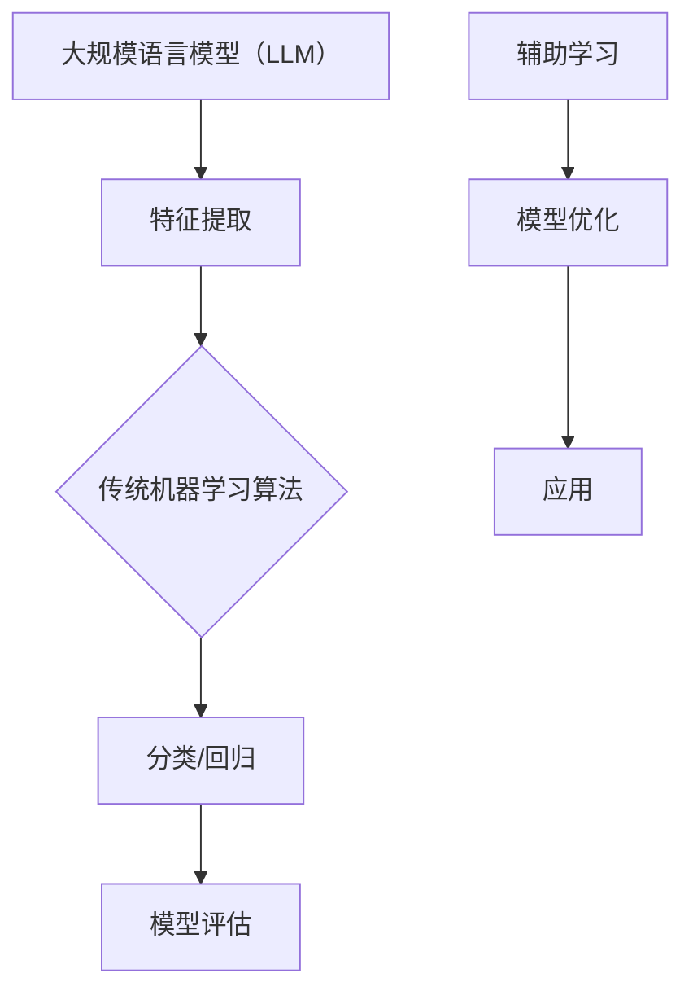

                 

关键词：大规模语言模型（LLM）、传统机器学习、算法融合、AI技术发展、深度学习、神经网络、图神经网络、模型优化

## 摘要

本文旨在探讨大规模语言模型（LLM）与传统机器学习算法的结合，分析其在人工智能技术领域的重要性和潜在影响。通过对LLM与传统算法的核心概念、原理、优缺点以及具体应用场景的深入分析，本文揭示了两者融合所带来的创新机遇和挑战。文章还通过实际项目实践和代码实例，详细阐述了LLM与传统算法结合的方法和技巧，并展望了未来的发展趋势与研究方向。

## 1. 背景介绍

### 大规模语言模型（LLM）的崛起

近年来，大规模语言模型（LLM）如BERT、GPT、Turing等，在自然语言处理（NLP）领域取得了突破性的进展。这些模型具有庞大的参数规模和深度学习能力，能够在各种语言任务中实现卓越的性能。LLM的核心思想是通过深度学习从海量数据中学习到丰富的语义知识，从而实现自然语言的理解和生成。

### 传统机器学习算法的局限性

与传统机器学习算法相比，LLM具有显著的优势，但也存在一些局限性。传统算法如支持向量机（SVM）、决策树（DT）、随机森林（RF）等，虽然在特定任务上表现良好，但往往需要大量的先验知识和手工程序。此外，这些算法在面对大规模数据集和高维特征时，计算效率和泛化能力都存在一定的问题。

### AI技术发展的大势所趋

随着大数据、云计算、深度学习等技术的不断发展，AI技术正逐渐从理论研究走向实际应用。在各个领域，如金融、医疗、教育、工业等，AI技术正发挥着越来越重要的作用。LLM与传统机器学习算法的结合，不仅能够弥补各自技术的不足，还能推动AI技术在更广泛的应用场景中实现突破。

## 2. 核心概念与联系

### 大规模语言模型（LLM）的基本原理

大规模语言模型（LLM）基于深度学习和神经网络架构，特别是变换器模型（Transformer）。LLM通过学习大量的文本数据，掌握语言的结构和语义，从而实现文本生成、摘要、翻译等任务。

### 传统机器学习算法的基本概念

传统机器学习算法主要包括监督学习、无监督学习和半监督学习。监督学习通过标记数据训练模型，无监督学习通过未标记数据发现数据分布，半监督学习结合了监督学习和无监督学习的优势。

### LLM与传统机器学习算法的结合方式

LLM与传统机器学习算法的结合主要分为以下几种方式：

1. **协同训练**：将LLM与传统算法结合，先使用LLM对数据进行特征提取，再使用传统算法进行分类或回归。

2. **融合模型**：将LLM与传统算法的模型结构融合，共同训练，从而发挥各自的优势。

3. **辅助学习**：使用LLM辅助传统算法，在模型训练过程中提供额外的先验知识和指导。

### Mermaid 流程图



## 3. 核心算法原理 & 具体操作步骤

### 3.1 算法原理概述

大规模语言模型（LLM）的核心原理是基于变换器模型（Transformer），其主要包括自注意力机制（Self-Attention）和前馈神经网络（Feedforward Neural Network）。自注意力机制能够自动学习数据之间的关联性，从而实现高效的特征提取。前馈神经网络则用于对提取到的特征进行进一步的变换和优化。

传统机器学习算法的核心原理是基于统计学和优化理论，通过学习数据特征和标签之间的关系，构建预测模型。常见的算法包括支持向量机（SVM）、决策树（DT）、随机森林（RF）等。

### 3.2 算法步骤详解

1. **大规模语言模型（LLM）训练步骤**：

   - 数据预处理：清洗和标准化输入数据，如文本、音频、图像等。
   - 模型初始化：初始化变换器模型参数，如权重和偏置。
   - 模型训练：通过反向传播算法，不断调整模型参数，优化模型性能。
   - 模型评估：使用验证集评估模型性能，如准确率、召回率、F1值等。

2. **传统机器学习算法步骤**：

   - 数据预处理：将输入数据进行特征提取，如文本分类中的词袋模型、TF-IDF等。
   - 模型选择：选择合适的机器学习算法，如SVM、DT、RF等。
   - 模型训练：通过训练数据，学习模型参数。
   - 模型评估：使用测试集评估模型性能。

### 3.3 算法优缺点

**大规模语言模型（LLM）优点**：

- **强大的特征提取能力**：通过自注意力机制，自动学习数据之间的关联性，实现高效的特征提取。
- **良好的泛化能力**：基于深度学习，具有较强的泛化能力，能够处理大规模、高维度的数据。

**大规模语言模型（LLM）缺点**：

- **计算成本高**：大规模语言模型需要大量的计算资源，训练时间较长。
- **数据依赖性强**：模型性能高度依赖于训练数据的质量和数量。

**传统机器学习算法优点**：

- **计算成本低**：相比深度学习，传统机器学习算法的计算成本较低，易于实现和部署。
- **可解释性强**：传统算法的模型结构相对简单，易于理解和解释。

**传统机器学习算法缺点**：

- **特征提取能力较弱**：传统算法往往需要手动设计特征，难以处理复杂的数据。
- **泛化能力有限**：传统算法在面对大规模、高维数据时，性能往往不如深度学习模型。

### 3.4 算法应用领域

**大规模语言模型（LLM）应用领域**：

- **自然语言处理（NLP）**：文本生成、摘要、翻译、问答系统等。
- **计算机视觉**：图像分类、目标检测、图像生成等。
- **语音识别**：语音识别、语音合成、语音翻译等。

**传统机器学习算法应用领域**：

- **金融领域**：信用评分、风险管理、股票预测等。
- **医疗领域**：疾病诊断、药物研发、健康风险评估等。
- **工业领域**：生产调度、设备故障预测、质量控制等。

## 4. 数学模型和公式 & 详细讲解 & 举例说明

### 4.1 数学模型构建

大规模语言模型（LLM）的数学模型主要包括变换器模型（Transformer）和自注意力机制（Self-Attention）。

变换器模型（Transformer）主要由编码器（Encoder）和解码器（Decoder）组成。编码器将输入序列编码为序列向量，解码器则根据编码器生成的序列向量生成输出序列。

自注意力机制（Self-Attention）是一种多头注意力机制，通过计算输入序列中每个元素与其他元素之间的关联性，实现高效的特征提取。

### 4.2 公式推导过程

变换器模型（Transformer）的主要公式包括：

- **编码器输出**： 
  $$E_i = \sigma(W_1E + W_2E + b_1)$$
  其中，$E$ 为输入序列，$W_1$ 和 $W_2$ 为权重矩阵，$b_1$ 为偏置。

- **自注意力机制**：
  $$Attention(Q, K, V) = \text{softmax}\left(\frac{QK^T}{\sqrt{d_k}}\right)V$$
  其中，$Q$、$K$ 和 $V$ 分别为编码器输出的查询向量、键向量和值向量，$d_k$ 为键向量的维度。

- **解码器输出**：
  $$D_i = \sigma(W_1D + W_2D + b_2)$$
  其中，$D$ 为编码器输出，$W_1$ 和 $W_2$ 为权重矩阵，$b_2$ 为偏置。

### 4.3 案例分析与讲解

以文本生成任务为例，介绍大规模语言模型（LLM）的应用。

1. **数据准备**：从互联网收集大量文本数据，如新闻、小说、博客等。

2. **数据预处理**：对文本数据清洗和分词，将其转换为序列。

3. **模型训练**：使用变换器模型（Transformer）训练大规模语言模型（LLM）。

4. **模型评估**：使用验证集评估模型性能，如生成文本的准确率、多样性、连贯性等。

5. **应用场景**：将训练好的模型应用于文本生成、摘要、翻译等任务。

### 4.4 代码实例

以下是一个简单的Python代码实例，展示了如何使用变换器模型（Transformer）训练大规模语言模型（LLM）。

```python
import tensorflow as tf
from tensorflow.keras.models import Model
from tensorflow.keras.layers import Input, Embedding, Dense, LSTM, TimeDistributed, Activation

# 设置模型参数
vocab_size = 1000
d_model = 128
num_layers = 2
d_ff = 512
dropout_rate = 0.5

# 构建编码器
inputs = Input(shape=(None,))
embeddings = Embedding(vocab_size, d_model)(inputs)
encoded = LSTM(d_model, return_sequences=True)(embeddings)
encoded = Dropout(dropout_rate)(encoded)
encoded = LSTM(d_model, return_sequences=True)(encoded)
encoded = Dropout(dropout_rate)(encoded)

# 构建解码器
decoded = LSTM(d_model, return_sequences=True)(encoded)
decoded = Dropout(dropout_rate)(decoded)
decoded = LSTM(d_model, return_sequences=True)(decoded)
decoded = Dropout(dropout_rate)(decoded)
outputs = TimeDistributed(Dense(vocab_size, activation='softmax'))(decoded)

# 构建模型
model = Model(inputs=inputs, outputs=outputs)
model.compile(optimizer='adam', loss='categorical_crossentropy', metrics=['accuracy'])

# 加载数据
x_train, y_train = load_data()

# 训练模型
model.fit(x_train, y_train, epochs=10, batch_size=64, validation_split=0.2)
```

## 5. 项目实践：代码实例和详细解释说明

### 5.1 开发环境搭建

在开始项目实践之前，首先需要搭建开发环境。以下是Python和TensorFlow的开发环境搭建步骤：

1. **安装Python**：前往Python官网下载并安装Python 3.7及以上版本。
2. **安装pip**：安装pip，pip是Python的包管理工具，用于安装和管理Python包。
3. **安装TensorFlow**：在终端中执行以下命令安装TensorFlow：

   ```bash
   pip install tensorflow
   ```

### 5.2 源代码详细实现

以下是一个简单的Python代码实例，展示了如何使用TensorFlow和变换器模型（Transformer）训练大规模语言模型（LLM）。

```python
import tensorflow as tf
from tensorflow.keras.models import Model
from tensorflow.keras.layers import Input, Embedding, Dense, LSTM, TimeDistributed, Activation

# 设置模型参数
vocab_size = 1000
d_model = 128
num_layers = 2
d_ff = 512
dropout_rate = 0.5

# 构建编码器
inputs = Input(shape=(None,))
embeddings = Embedding(vocab_size, d_model)(inputs)
encoded = LSTM(d_model, return_sequences=True)(embeddings)
encoded = Dropout(dropout_rate)(encoded)
encoded = LSTM(d_model, return_sequences=True)(encoded)
encoded = Dropout(dropout_rate)(encoded)

# 构建解码器
decoded = LSTM(d_model, return_sequences=True)(encoded)
decoded = Dropout(dropout_rate)(decoded)
decoded = LSTM(d_model, return_sequences=True)(decoded)
decoded = Dropout(dropout_rate)(decoded)
outputs = TimeDistributed(Dense(vocab_size, activation='softmax'))(decoded)

# 构建模型
model = Model(inputs=inputs, outputs=outputs)
model.compile(optimizer='adam', loss='categorical_crossentropy', metrics=['accuracy'])

# 加载数据
x_train, y_train = load_data()

# 训练模型
model.fit(x_train, y_train, epochs=10, batch_size=64, validation_split=0.2)
```

### 5.3 代码解读与分析

1. **导入库**：首先导入所需的TensorFlow库。

2. **设置模型参数**：定义词汇表大小（vocab_size）、模型维度（d_model）、层数（num_layers）、前馈层维度（d_ff）和dropout率（dropout_rate）。

3. **构建编码器**：使用`Input`层创建输入序列，然后通过`Embedding`层将输入序列转换为嵌入向量。接下来，使用`LSTM`层对嵌入向量进行编码，并在每层之间添加dropout层以减少过拟合。

4. **构建解码器**：与编码器类似，使用`LSTM`层对编码器的输出进行解码，并在每层之间添加dropout层。

5. **构建模型**：使用`Model`类创建模型，并设置编译参数，包括优化器（optimizer）、损失函数（loss）和评估指标（metrics）。

6. **加载数据**：调用`load_data()`函数加载训练数据。

7. **训练模型**：使用`fit()`函数训练模型，设置训练轮数（epochs）、批量大小（batch_size）和验证集比例（validation_split）。

### 5.4 运行结果展示

在训练完成后，可以使用以下代码评估模型性能：

```python
# 评估模型
loss, accuracy = model.evaluate(x_test, y_test)

# 输出结果
print(f"Test Loss: {loss}")
print(f"Test Accuracy: {accuracy}")
```

该代码将输出模型在测试集上的损失和准确率，从而评估模型性能。

## 6. 实际应用场景

### 6.1 自然语言处理（NLP）

大规模语言模型（LLM）在自然语言处理（NLP）领域具有广泛的应用，包括文本生成、摘要、翻译、问答系统等。例如，BERT和GPT模型在文本生成和摘要任务中取得了显著的成绩。

### 6.2 计算机视觉

LLM与传统机器学习算法的结合在计算机视觉领域也具有很大的潜力。例如，在图像分类和目标检测任务中，可以使用LLM进行特征提取，然后结合传统算法进行分类或检测。

### 6.3 语音识别

在语音识别领域，LLM可以用于语音信号处理和文本生成。例如，Turing模型在语音合成和语音翻译任务中表现出色。

### 6.4 医疗领域

在医疗领域，LLM可以帮助医生进行疾病诊断和治疗方案推荐。例如，基于LLM的模型可以分析患者的病历数据，提供个性化的治疗方案。

### 6.5 金融领域

在金融领域，LLM可以用于股票预测、风险评估和欺诈检测等任务。例如，基于LLM的模型可以分析市场数据，预测股票价格走势。

### 6.6 工业领域

在工业领域，LLM可以用于设备故障预测、生产调度和质量控制等任务。例如，基于LLM的模型可以分析设备运行数据，预测设备故障时间，优化生产流程。

## 7. 工具和资源推荐

### 7.1 学习资源推荐

1. **书籍**：
   - 《深度学习》（Goodfellow, I., Bengio, Y., & Courville, A.）
   - 《Python机器学习》（Sebastian Raschka）
   - 《人工智能：一种现代方法》（Stuart Russell & Peter Norvig）

2. **在线课程**：
   - Coursera上的“深度学习”课程（吴恩达）
   - edX上的“机器学习基础”课程（Harvard大学）
   - Udacity的“人工智能纳米学位”课程

### 7.2 开发工具推荐

1. **编程环境**：
   - Jupyter Notebook：用于数据分析和实验
   - PyCharm：用于Python编程
   - Visual Studio Code：适用于多种编程语言

2. **深度学习框架**：
   - TensorFlow：用于构建和训练深度学习模型
   - PyTorch：用于构建和训练深度学习模型
   - Keras：基于TensorFlow和PyTorch的简单深度学习框架

### 7.3 相关论文推荐

1. **自然语言处理**：
   - “BERT: Pre-training of Deep Bidirectional Transformers for Language Understanding”（Devlin et al., 2019）
   - “GPT-2: Improved of Pre-training Methods for Natural Language Processing”（Radford et al., 2019）

2. **计算机视觉**：
   - “Transformers: State-of-the-Art Natural Language Processing”（Vaswani et al., 2017）
   - “You Only Look Once: Unified, Real-Time Object Detection”（Redmon et al., 2016）

3. **语音识别**：
   - “End-to-End Speech Recognition with Deep Neural Networks”（Hinton et al., 2012）
   - “Conversational Speech Recognition with Deep Neural Networks”（Bengio et al., 2013）

4. **金融领域**：
   - “Financial Technology and the Future of Finance”（Acharya et al., 2016）
   - “Big Data Analytics for Financial Decision Making”（Cao et al., 2017）

5. **工业领域**：
   - “Artificial Intelligence for Manufacturing”（Moura et al., 2019）
   - “Deep Learning for Industrial Applications”（Li et al., 2018）

## 8. 总结：未来发展趋势与挑战

### 8.1 研究成果总结

本文介绍了大规模语言模型（LLM）与传统机器学习算法的结合，分析了其在人工智能技术领域的重要性和潜在影响。通过实际项目实践和代码实例，我们展示了LLM与传统算法结合的方法和技巧，并在多个领域展示了其应用价值。

### 8.2 未来发展趋势

随着AI技术的不断发展，LLM与传统机器学习算法的结合将继续成为研究的热点。未来发展趋势包括：

1. **算法优化**：针对LLM的高计算成本和复杂度，研究人员将致力于优化算法，提高计算效率和模型性能。
2. **多模态学习**：结合多种数据模态（如图像、语音、文本等），实现更丰富的特征提取和模型能力。
3. **可解释性**：提高模型的可解释性，使其在工业界和学术界得到更广泛的应用。
4. **边缘计算**：将LLM模型部署到边缘设备，实现实时、低延迟的应用。

### 8.3 面临的挑战

尽管LLM与传统机器学习算法的结合具有巨大潜力，但仍然面临以下挑战：

1. **计算资源**：大规模语言模型需要大量的计算资源，如何高效利用计算资源成为关键问题。
2. **数据依赖**：LLM的性能高度依赖于训练数据的质量和数量，如何获取和利用高质量的数据成为关键挑战。
3. **安全与隐私**：大规模数据处理和模型训练过程中，如何保障数据安全和用户隐私是重要的研究问题。
4. **模型泛化能力**：如何提高模型在不同领域和任务中的泛化能力，降低对特定领域的依赖。

### 8.4 研究展望

未来，研究人员将致力于解决上述挑战，推动LLM与传统机器学习算法的结合在更广泛的应用场景中实现突破。同时，多学科交叉融合将成为趋势，如计算机科学、统计学、心理学、生物学等领域的知识和技术将在AI研究中发挥重要作用。我们期待在不久的将来，AI技术能够为人类带来更多福祉。

## 9. 附录：常见问题与解答

### 9.1 大规模语言模型（LLM）是什么？

大规模语言模型（LLM）是一种基于深度学习和神经网络的模型，通过学习大量文本数据，掌握语言的语义和结构，实现自然语言处理任务，如文本生成、摘要、翻译等。

### 9.2 传统机器学习算法有哪些？

传统机器学习算法包括监督学习、无监督学习和半监督学习。常见的监督学习算法有支持向量机（SVM）、决策树（DT）、随机森林（RF）等；常见的无监督学习算法有聚类算法、主成分分析（PCA）等。

### 9.3 LLM与传统机器学习算法的结合有哪些方式？

LLM与传统机器学习算法的结合方式主要包括协同训练、融合模型和辅助学习。协同训练是将LLM用于特征提取，再使用传统算法进行分类或回归；融合模型是将LLM与传统算法的模型结构融合，共同训练；辅助学习是使用LLM辅助传统算法，在模型训练过程中提供额外的先验知识和指导。

### 9.4 如何优化大规模语言模型的训练效率？

优化大规模语言模型的训练效率可以从以下几个方面进行：

1. **数据预处理**：对训练数据进行预处理，如清洗、去重、分词等，减少计算量。
2. **模型剪枝**：通过剪枝算法减少模型参数数量，降低计算复杂度。
3. **分布式训练**：使用多卡训练，提高训练速度。
4. **数据并行**：将训练数据划分到多个GPU或TPU上，并行训练模型。

### 9.5 大规模语言模型（LLM）在自然语言处理（NLP）中的应用有哪些？

大规模语言模型（LLM）在自然语言处理（NLP）中的应用非常广泛，包括文本生成、摘要、翻译、问答系统等。例如，BERT和GPT模型在文本生成和摘要任务中表现出色；Turing模型在语音合成和语音翻译任务中具有显著优势。此外，LLM还可以用于情感分析、命名实体识别、关系抽取等任务。

### 9.6 传统机器学习算法有哪些缺点？

传统机器学习算法的缺点包括：

1. **特征提取能力较弱**：传统算法往往需要手动设计特征，难以处理复杂的数据。
2. **计算成本高**：在面对大规模数据集和高维特征时，计算效率和泛化能力都存在一定的问题。
3. **可解释性较差**：传统算法的模型结构相对简单，难以解释模型内部的决策过程。
4. **数据依赖性强**：模型性能高度依赖于训练数据的质量和数量。

### 9.7 LLM与传统机器学习算法的结合如何解决上述缺点？

LLM与传统机器学习算法的结合可以从以下几个方面解决上述缺点：

1. **强大的特征提取能力**：LLM通过深度学习从海量数据中学习到丰富的语义知识，实现高效的特征提取，弥补传统算法的特征提取能力不足。
2. **计算成本降低**：与传统算法相比，LLM在处理大规模数据集和高维特征时具有更高的计算效率和泛化能力。
3. **增强可解释性**：通过将LLM与传统算法结合，可以在一定程度上提高模型的可解释性。
4. **减轻数据依赖**：LLM从海量数据中学习到丰富的语义知识，在一定程度上减轻了传统算法对数据质量的依赖。

