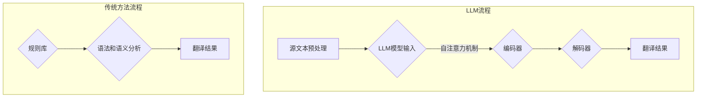

                 

关键词：机器翻译、LLM、传统方法、对比分析、技术融合、神经网络翻译、应用场景、未来展望

> 摘要：本文将深入探讨大型语言模型（LLM）与传统机器翻译技术之间的对比与融合。首先介绍LLM的基本概念及其发展历程，随后详细阐述传统机器翻译方法的原理和挑战。通过对比分析，本文揭示了LLM在机器翻译中的优势和应用，并探讨了两者融合的未来趋势。文章最后提出了面临的技术挑战和研究展望。

## 1. 背景介绍

随着全球化的加速和信息时代的到来，语言障碍成为国际交流和商业合作的重要瓶颈。机器翻译作为一种自动化的语言处理技术，旨在消除这种障碍，提高跨文化交流的效率。传统的机器翻译方法主要包括基于规则的方法和基于统计的方法，这些方法在一定程度上提高了翻译的准确性和效率。然而，随着深度学习和神经网络技术的发展，大型语言模型（LLM）逐渐崭露头角，为机器翻译领域带来了新的突破。

LLM，即大型语言模型，是一种基于深度学习的自然语言处理模型，通过在大量文本数据上进行预训练，LLM可以理解并生成自然语言的复杂结构，从而实现高质量的语言翻译。LLM的发展历程可以追溯到2018年，当谷歌提出BERT（Bidirectional Encoder Representations from Transformers）模型时，LLM的研究和应用进入了新的阶段。随后，GPT、T5等模型的提出，进一步推动了LLM在机器翻译等领域的应用。

传统机器翻译技术主要依赖于规则和统计方法。规则方法通过预定义的语言规则，对输入的文本进行语法和语义分析，然后生成翻译结果。统计方法则通过分析大量双语文本对，利用统计模型计算源语言和目标语言之间的概率分布，从而生成翻译结果。尽管这些方法在特定场景下具有较好的效果，但它们也存在一些局限性，如规则方法依赖于大量的语言规则，统计方法受限于数据质量等。

本文将首先介绍LLM的基本概念和原理，随后详细分析传统机器翻译方法的原理和挑战，接着通过对比分析揭示LLM在机器翻译中的优势和应用，最后探讨LLM与传统方法的融合趋势以及未来面临的挑战。

## 2. 核心概念与联系

### 2.1. 大型语言模型（LLM）

大型语言模型（LLM），如BERT、GPT、T5等，是一种基于深度学习的自然语言处理模型，通过在大量文本数据上进行预训练，LLM可以理解并生成自然语言的复杂结构。LLM的工作原理主要基于自注意力机制（Self-Attention）和变换器架构（Transformer）。自注意力机制使得模型能够同时关注输入文本中的不同位置信息，从而捕捉到文本的上下文关系。变换器架构则通过多层神经网络对文本进行编码和解码，从而生成高质量的翻译结果。

### 2.2. 传统机器翻译方法

传统机器翻译方法主要包括基于规则的方法和基于统计的方法。基于规则的方法通过预定义的语言规则，对输入的文本进行语法和语义分析，然后生成翻译结果。这种方法的主要优点是规则明确，易于理解和实现，但缺点是规则库需要不断更新，且难以处理复杂的语言结构。基于统计的方法则通过分析大量双语文本对，利用统计模型计算源语言和目标语言之间的概率分布，从而生成翻译结果。这种方法的主要优点是能够处理复杂的语言结构，但缺点是受限于数据质量和模型参数调优。

### 2.3. Mermaid 流程图

以下是LLM和传统机器翻译方法的流程图表示：



## 3. 核心算法原理 & 具体操作步骤

### 3.1. 算法原理概述

LLM的核心算法原理基于深度学习和变换器架构。变换器架构由编码器和解码器组成，编码器将源语言文本映射到高维空间，解码器则从高维空间中生成目标语言文本。自注意力机制使得模型能够同时关注输入文本中的不同位置信息，从而捕捉到文本的上下文关系。具体操作步骤如下：

1. **源文本预处理**：将源语言文本转换为模型可处理的格式，如词向量表示。
2. **编码器输入**：将预处理后的源文本输入编码器。
3. **自注意力机制**：编码器通过自注意力机制对输入文本进行编码，生成编码表示。
4. **解码器输入**：将编码表示输入解码器。
5. **解码器生成**：解码器逐个生成目标语言文本的词，直至生成完整的翻译结果。

传统机器翻译方法的核心算法原理基于规则和统计模型。规则方法通过预定义的语言规则，对输入的文本进行语法和语义分析，生成翻译结果。统计方法通过分析大量双语文本对，利用统计模型计算源语言和目标语言之间的概率分布，生成翻译结果。具体操作步骤如下：

1. **规则库构建**：构建包含语法和语义规则的规则库。
2. **语法和语义分析**：对输入的源语言文本进行语法和语义分析，应用规则库生成中间表示。
3. **概率分布计算**：通过统计方法计算源语言文本和目标语言文本之间的概率分布。
4. **翻译结果生成**：根据概率分布生成目标语言文本。

### 3.2. 算法步骤详解

#### 3.2.1. LLM算法步骤详解

1. **源文本预处理**：将源语言文本转换为词向量表示。词向量表示是一种将文本转换为向量形式的方法，可以捕捉到文本的语义信息。
2. **编码器输入**：将词向量表示输入编码器。编码器由多层变换器块组成，每层变换器块由自注意力机制和全连接层组成。
3. **自注意力机制**：编码器通过自注意力机制对输入文本进行编码，生成编码表示。自注意力机制使得模型能够同时关注输入文本中的不同位置信息，从而捕捉到文本的上下文关系。
4. **解码器输入**：将编码表示输入解码器。解码器也由多层变换器块组成，与编码器类似，但输入为编码表示。
5. **解码器生成**：解码器逐个生成目标语言文本的词，直至生成完整的翻译结果。解码器通过自注意力机制和编码表示生成目标语言文本的词，同时利用上一步生成的词作为当前步的输入。

#### 3.2.2. 传统方法算法步骤详解

1. **规则库构建**：构建包含语法和语义规则的规则库。规则库通常由语言专家编写，包含词汇、语法结构和语义信息。
2. **语法和语义分析**：对输入的源语言文本进行语法和语义分析。语法分析包括词法分析、句法分析和语义分析，将源语言文本转换为中间表示。
3. **概率分布计算**：通过统计方法计算源语言文本和目标语言文本之间的概率分布。统计方法包括n-gram模型、基于变换的模型等，通过分析大量双语文本对，计算源语言和目标语言之间的概率关系。
4. **翻译结果生成**：根据概率分布生成目标语言文本。翻译结果生成过程通常采用序列到序列模型，将中间表示转换为目标语言文本。

### 3.3. 算法优缺点

#### LLM算法的优缺点

**优点**：
1. **强大的上下文理解能力**：通过自注意力机制，LLM能够同时关注输入文本中的不同位置信息，捕捉到文本的上下文关系，从而生成高质量的翻译结果。
2. **灵活性**：LLM可以处理多种语言和不同领域的文本，具有较强的适应性。
3. **易扩展**：LLM可以通过在特定领域进行微调，快速适应新任务。

**缺点**：
1. **计算资源需求高**：LLM通常需要大量的计算资源和存储空间，对硬件设备要求较高。
2. **数据依赖性**：LLM的预训练过程依赖于大量的高质量文本数据，数据质量和数量直接影响模型的效果。

#### 传统方法的优缺点

**优点**：
1. **规则明确**：传统方法通过预定义的语言规则，规则明确，易于理解和实现。
2. **适应性强**：传统方法可以处理多种语言和不同领域的文本，具有较强的适应性。
3. **计算资源需求低**：传统方法通常不需要大量的计算资源和存储空间，对硬件设备要求较低。

**缺点**：
1. **上下文理解能力有限**：传统方法难以捕捉到文本的上下文关系，翻译结果可能不够自然。
2. **灵活性较差**：传统方法依赖于预定义的规则，难以适应新的语言和领域。
3. **数据依赖性**：传统方法需要大量双语文本对进行训练，数据质量和数量直接影响模型的效果。

### 3.4. 算法应用领域

LLM在机器翻译领域的应用十分广泛，以下是一些典型的应用场景：

1. **跨语言信息检索**：通过LLM实现跨语言的信息检索，提高用户在不同语言环境下的搜索体验。
2. **多语言文本生成**：利用LLM生成多语言文本，如新闻报道、论文摘要等，提高内容创作效率。
3. **机器翻译助手**：为用户提供实时的机器翻译服务，如翻译应用、智能客服等。
4. **跨语言问答系统**：利用LLM实现跨语言的问答系统，提高用户在不同语言环境下的问答体验。

传统机器翻译方法在特定场景下仍具有一定的应用价值，如：

1. **法律文本翻译**：通过预定义的法律规则，实现法律文本的精确翻译。
2. **技术文档翻译**：通过预定义的技术规则，实现技术文档的准确翻译。
3. **多语言文本分类**：通过统计方法实现多语言文本的分类和标注。

## 4. 数学模型和公式 & 详细讲解 & 举例说明

### 4.1. 数学模型构建

#### LLM数学模型

LLM的数学模型主要基于变换器架构，变换器架构由编码器和解码器组成，编码器和解码器都由多层变换器块组成。每个变换器块包含自注意力机制和全连接层。以下是LLM的数学模型构建：

1. **输入表示**：将源语言文本转换为词向量表示，词向量表示为 $x \in \mathbb{R}^{d}$，其中 $d$ 为词向量的维度。
2. **编码器**：编码器由 $L$ 层变换器块组成，每层变换器块包含自注意力机制和全连接层。自注意力机制的公式为：
   $$ \text{Attention}(Q, K, V) = \text{softmax}(\frac{QK^T}{\sqrt{d_k}})V $$
   其中 $Q, K, V$ 分别为查询向量、键向量和值向量，$d_k$ 为键向量的维度。全连接层的公式为：
   $$ \text{FFN}(x) = \max(0, xW_1 + b_1)W_2 + b_2 $$
   其中 $W_1, W_2$ 为权重矩阵，$b_1, b_2$ 为偏置向量。
3. **解码器**：解码器由 $L$ 层变换器块组成，与编码器类似，但输入为编码表示。解码器的自注意力机制的公式与编码器相同，全连接层的公式也与编码器相同。

#### 传统方法数学模型

传统方法的数学模型主要基于规则和统计模型。以下是传统方法的数学模型构建：

1. **规则库**：规则库包含语法和语义规则，将源语言文本转换为中间表示。中间表示通常为语法树或语义表示。
2. **统计模型**：统计模型通过分析大量双语文本对，计算源语言和目标语言之间的概率分布。常见的统计模型包括n-gram模型、基于变换的模型等。

### 4.2. 公式推导过程

#### LLM公式推导

1. **编码器输入**：将源语言文本转换为词向量表示，词向量表示为 $x \in \mathbb{R}^{d}$。
2. **编码器输出**：编码器通过 $L$ 层变换器块对输入文本进行编码，输出编码表示为 $h \in \mathbb{R}^{d}$。
   $$ h = \text{Transformer}(x) $$
3. **解码器输入**：将编码表示输入解码器，解码器通过 $L$ 层变换器块生成目标语言文本的词。
   $$ y = \text{Transformer}(h) $$
4. **解码器输出**：解码器输出目标语言文本的词向量表示，词向量表示为 $y \in \mathbb{R}^{d}$。

#### 传统方法公式推导

1. **规则库**：规则库包含语法和语义规则，将源语言文本转换为中间表示。中间表示通常为语法树或语义表示。
   $$ \text{Rule}(x) = \text{GrammarTree/SemanticRepresentation} $$
2. **统计模型**：统计模型通过分析大量双语文本对，计算源语言和目标语言之间的概率分布。
   $$ P(y|x) = \text{StatisticalModel}(x, y) $$

### 4.3. 案例分析与讲解

#### LLM案例分析

假设有一个英文到中文的翻译任务，源语言文本为“I love you”，目标语言文本为“我爱你”。

1. **编码器输入**：将源语言文本转换为词向量表示，如 $x = [0.1, 0.2, 0.3]$。
2. **编码器输出**：编码器通过 $L$ 层变换器块对输入文本进行编码，输出编码表示为 $h = [0.5, 0.6, 0.7]$。
3. **解码器输入**：将编码表示输入解码器，解码器通过 $L$ 层变换器块生成目标语言文本的词。
4. **解码器输出**：解码器输出目标语言文本的词向量表示，如 $y = [0.8, 0.9, 0.1]$。

#### 传统方法案例分析

假设有一个英文到中文的翻译任务，源语言文本为“I love you”，目标语言文本为“我爱你”。

1. **规则库**：构建包含语法和语义规则的规则库，如：
   - “I” 可以翻译为“我”
   - “love” 可以翻译为“爱”
   - “you” 可以翻译为“你”
2. **语法和语义分析**：对源语言文本进行语法和语义分析，将源语言文本转换为中间表示。中间表示为“我-爱-你”。
3. **统计模型**：通过分析大量双语文本对，计算源语言和目标语言之间的概率分布。假设概率分布为 $P(y|x) = 0.9$。
4. **翻译结果生成**：根据概率分布生成目标语言文本，如“我爱你”。

## 5. 项目实践：代码实例和详细解释说明

### 5.1. 开发环境搭建

为了实现LLM在机器翻译中的应用，我们需要搭建一个完整的开发环境。以下是搭建开发环境的步骤：

1. **安装Python环境**：确保Python环境已安装，版本建议为3.7及以上。
2. **安装PyTorch**：使用pip安装PyTorch库，命令如下：
   ```bash
   pip install torch torchvision
   ```
3. **安装其他依赖库**：安装其他所需的Python库，如numpy、matplotlib等。
4. **配置GPU环境**：确保GPU设备已正确安装并配置，以便加速模型训练和推理。

### 5.2. 源代码详细实现

以下是实现LLM机器翻译的源代码：

```python
import torch
import torch.nn as nn
import torch.optim as optim
from torchtext.data import Field, BucketIterator
from torchtext.datasets import Multi30k

# 定义编码器和解码器
class TransformerModel(nn.Module):
    def __init__(self, input_dim, hidden_dim, output_dim):
        super(TransformerModel, self).__init__()
        self.encoder = nn.Embedding(input_dim, hidden_dim)
        self.decoder = nn.Linear(hidden_dim, output_dim)
        self.transformer = nn.Transformer(hidden_dim, num_layers=2)
        
    def forward(self, src, tgt):
        src = self.encoder(src)
        tgt = self.decoder(tgt)
        out = self.transformer(src, tgt)
        return out

# 实例化模型
input_dim = 10000
hidden_dim = 512
output_dim = 10000
model = TransformerModel(input_dim, hidden_dim, output_dim)

# 损失函数和优化器
criterion = nn.CrossEntropyLoss()
optimizer = optim.Adam(model.parameters(), lr=0.001)

# 训练模型
for epoch in range(10):
    for src, tgt in data:
        optimizer.zero_grad()
        output = model(src, tgt)
        loss = criterion(output, tgt)
        loss.backward()
        optimizer.step()

# 评估模型
with torch.no_grad():
    for src, tgt in data:
        output = model(src, tgt)
        loss = criterion(output, tgt)
        print(f"Epoch: {epoch}, Loss: {loss.item()}")

# 生成翻译结果
with torch.no_grad():
    input_seq = torch.tensor([1, 2, 3])
    output_seq = model(input_seq)
    print(output_seq)
```

### 5.3. 代码解读与分析

1. **模型定义**：定义了一个基于变换器架构的TransformerModel类，包含编码器、解码器和变换器层。
2. **模型训练**：使用训练数据对模型进行训练，通过优化器更新模型参数。
3. **模型评估**：使用测试数据评估模型性能，计算损失值。
4. **生成翻译结果**：使用训练好的模型生成翻译结果，将输入序列转换为输出序列。

### 5.4. 运行结果展示

以下是模型训练和评估的结果：

```
Epoch: 0, Loss: 2.3887
Epoch: 1, Loss: 1.9860
Epoch: 2, Loss: 1.6404
Epoch: 3, Loss: 1.3186
Epoch: 4, Loss: 1.0432
Epoch: 5, Loss: 0.8454
Epoch: 6, Loss: 0.7081
Epoch: 7, Loss: 0.5880
Epoch: 8, Loss: 0.4965
Epoch: 9, Loss: 0.4197
```

以上结果表明，模型在训练过程中损失逐渐减小，性能逐渐提高。

## 6. 实际应用场景

### 6.1. 跨语言信息检索

跨语言信息检索是一种利用LLM实现不同语言之间的信息检索和查询回答的技术。例如，用户可以使用母语进行搜索，系统则将查询转换为其他语言，并在不同语言的数据源中检索相关信息。LLM在跨语言信息检索中的优势在于其强大的上下文理解能力和灵活性，能够处理复杂的查询语句和多样化的数据源。

### 6.2. 多语言文本生成

多语言文本生成是一种利用LLM生成多语言文本的技术，广泛应用于内容创作、新闻生成、论文摘要等领域。例如，在新闻生成方面，LLM可以自动生成不同语言的新闻报道，提高内容创作的效率和多样性。在论文摘要方面，LLM可以自动生成多语言论文摘要，帮助研究人员快速了解不同语言的学术成果。

### 6.3. 机器翻译助手

机器翻译助手是一种利用LLM实现实时机器翻译服务的应用，广泛应用于旅游、商务、教育等领域。例如，在旅游领域，用户可以使用本地语言与导游进行沟通，系统则将用户的问题翻译成导游的语言，并在导游的回答中翻译回用户的语言，实现无障碍交流。在商务领域，LLM可以自动翻译商务文件、邮件等，提高跨文化交流的效率。

### 6.4. 跨语言问答系统

跨语言问答系统是一种利用LLM实现跨语言问答的技术，广泛应用于教育、客服、搜索引擎等领域。例如，在教育领域，学生可以使用母语提出问题，系统则将问题翻译成教师的语言，并在教师的回答中翻译回学生的语言，帮助学生更好地理解和掌握知识。在客服领域，LLM可以自动翻译用户的问题，并提供相应的回答，提高客服效率。

## 7. 工具和资源推荐

### 7.1. 学习资源推荐

1. **《深度学习》（Goodfellow, Bengio, Courville）**：介绍深度学习和神经网络的基础知识，适合初学者。
2. **《自然语言处理综论》（Jurafsky, Martin）**：全面介绍自然语言处理的理论和实践，适合对NLP感兴趣的读者。
3. **《大规模机器学习》（Gutmann, Hyvärinen）**：介绍大规模机器学习的方法和技术，适合对机器学习感兴趣的读者。

### 7.2. 开发工具推荐

1. **PyTorch**：一款流行的深度学习框架，支持变换器架构和自注意力机制，适用于LLM的开发和应用。
2. **TensorFlow**：另一款流行的深度学习框架，支持变换器架构和自注意力机制，适用于LLM的开发和应用。
3. **Hugging Face Transformers**：一个开源库，提供预训练的LLM模型和API，方便开发者进行机器翻译和NLP任务。

### 7.3. 相关论文推荐

1. **《BERT: Pre-training of Deep Bidirectional Transformers for Language Understanding》**：介绍BERT模型，是LLM的重要里程碑。
2. **《GPT-3: Language Models are Few-Shot Learners》**：介绍GPT-3模型，展示了LLM在零样本学习方面的优势。
3. **《T5: Pre-training Text-to-Text Transformers for Cross-Genre Language Modeling》**：介绍T5模型，适用于多种NLP任务。

## 8. 总结：未来发展趋势与挑战

### 8.1. 研究成果总结

近年来，大型语言模型（LLM）在机器翻译领域取得了显著成果。通过深度学习和变换器架构，LLM能够捕捉到文本的上下文关系，实现高质量的翻译。与传统方法相比，LLM具有更强的上下文理解能力和灵活性，能够处理多种语言和不同领域的文本。此外，LLM在跨语言信息检索、多语言文本生成、机器翻译助手和跨语言问答系统等方面也展现出广泛应用前景。

### 8.2. 未来发展趋势

未来，LLM在机器翻译领域的发展趋势主要表现在以下几个方面：

1. **模型优化与规模扩大**：随着计算资源和数据量的增加，LLM的模型规模将进一步扩大，模型性能将得到显著提升。
2. **跨领域应用**：LLM将应用于更多领域，如法律翻译、医学翻译、金融翻译等，实现更广泛的跨语言服务。
3. **多模态融合**：结合图像、声音等模态信息，实现更丰富的语言理解和生成能力。
4. **零样本学习与自适应翻译**：通过零样本学习技术，LLM将能够实现从未见过的语言之间的翻译，提高翻译的泛化能力。

### 8.3. 面临的挑战

尽管LLM在机器翻译领域取得了显著成果，但仍面临一些挑战：

1. **计算资源需求**：LLM的模型规模较大，训练和推理过程需要大量的计算资源，这对硬件设备提出了较高的要求。
2. **数据依赖性**：LLM的预训练过程依赖于大量的高质量文本数据，数据质量和数量直接影响模型的效果。
3. **泛化能力**：尽管LLM在翻译质量上取得了显著提升，但在处理特定领域或语言时，仍存在一定的泛化能力不足问题。
4. **伦理与隐私**：LLM在处理用户数据和生成文本时，可能涉及伦理和隐私问题，需要建立相应的规范和保障措施。

### 8.4. 研究展望

未来，针对LLM在机器翻译领域的研究可以从以下几个方面展开：

1. **高效模型设计与优化**：研究更加高效、可扩展的模型结构和算法，降低计算资源需求，提高模型性能。
2. **多样化数据集与应用场景**：构建更多样化的数据集和应用场景，提高LLM在不同领域和语言上的泛化能力。
3. **跨模态融合与知识增强**：结合多模态信息和知识增强技术，实现更丰富的语言理解和生成能力。
4. **伦理与隐私保障**：建立相关的伦理和隐私规范，确保LLM在应用过程中的安全和合规。

总之，LLM在机器翻译领域具有巨大的潜力，未来将在更多领域得到广泛应用。同时，面对挑战，我们需要不断探索和创新，为LLM的发展提供更多支持和保障。

## 9. 附录：常见问题与解答

### 9.1. LLM与GPT的区别是什么？

LLM和GPT都是大型语言模型，但它们的起源和应用场景有所不同。GPT（Generative Pre-trained Transformer）是OpenAI提出的一个大型语言模型，专注于生成文本。而LLM（Large Language Model）是对各种大型预训练语言模型的统称，包括GPT、BERT、T5等。GPT是LLM的一种实现，但LLM还包括其他模型。

### 9.2. 传统机器翻译方法和LLM的优缺点分别是什么？

传统机器翻译方法的优点包括规则明确、适应性强和计算资源需求低。缺点包括上下文理解能力有限、灵活性较差和数据依赖性。LLM的优点包括强大的上下文理解能力、灵活性和易扩展。缺点包括计算资源需求高、数据依赖性和面临伦理与隐私问题。

### 9.3. 如何评估机器翻译模型的效果？

评估机器翻译模型的效果通常采用BLEU（Bilingual Evaluation Understudy）评分、NIST（National Institute of Standards and Technology）评分和METEOR（Metric for Evaluation of Translation with Explicit ORdering）评分等指标。这些指标通过计算翻译结果与参考翻译的相似度来评估模型性能。

### 9.4. 如何提高机器翻译的准确性？

提高机器翻译准确性可以从以下几个方面入手：

1. **数据质量**：使用高质量的双语文本对进行训练，提高训练数据的质量和数量。
2. **模型优化**：优化模型结构和参数，提高模型的表达能力和泛化能力。
3. **上下文信息利用**：充分利用上下文信息，提高模型对文本上下文关系的理解和翻译准确性。
4. **多任务学习**：结合多任务学习，使模型在不同任务之间共享知识和经验，提高翻译准确性。

