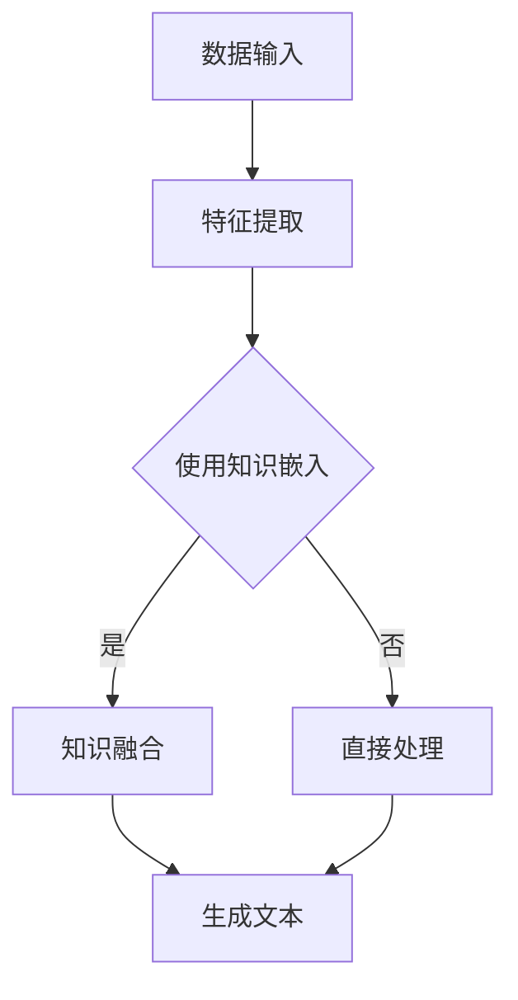

                 

关键词：知识表示、语言模型、知识工程、结合应用、发展趋势

## 摘要

随着人工智能技术的快速发展，自然语言处理（NLP）技术取得了显著的成果。语言模型（LLM，Language Model）作为NLP的核心技术之一，已经在诸多领域取得了广泛的应用。然而，传统知识表示技术由于其固有的局限性，在处理复杂知识表示和推理问题时存在一定困难。本文旨在探讨LLM与传统知识表示技术的结合，通过分析两者的核心概念、架构及其相互关系，深入讨论其在知识工程领域的新方向。文章将首先介绍LLM和传统知识表示技术的背景，然后详细阐述核心概念与联系，接着分析核心算法原理与具体操作步骤，并进一步探讨数学模型和公式，最后通过项目实践、实际应用场景以及未来展望等角度，全面探讨知识工程新方向。

## 1. 背景介绍

### 1.1 语言模型（LLM）

语言模型是一种基于统计方法和深度学习技术的模型，用于预测文本序列中的下一个单词或字符。其目的是通过学习大量的文本数据，捕捉语言中的统计规律和语义信息，从而实现对未知文本的生成和预测。

语言模型的发展经历了多个阶段，从最初的基于N-gram模型的简单统计模型，到后来的基于神经网络的复杂模型，如Transformer、BERT等。这些模型在处理复杂语言任务时表现出色，如机器翻译、文本生成、问答系统等。

### 1.2 传统知识表示技术

传统知识表示技术主要关注于将知识表示为计算机可理解的形式，以便于存储、检索和应用。这些技术包括知识图谱、本体论、OWL（Web本体语言）等。

知识图谱是一种用于表示实体及其关系的图形结构，通过将现实世界中的实体和关系映射到图结构中，实现对知识的可视化和管理。知识图谱在搜索引擎、推荐系统等领域具有广泛应用。

本体论是一种用于描述领域知识的理论框架，通过定义概念、属性和关系等本体元素，实现对领域知识的规范化表示。OWL作为本体语言的一种，被广泛应用于领域知识的表示和推理。

### 1.3 结合背景

随着人工智能技术的不断发展，语言模型和传统知识表示技术逐渐展现出结合的潜力。一方面，语言模型可以更好地理解和生成自然语言，从而为知识表示提供更丰富的语义信息；另一方面，传统知识表示技术可以提供结构化的知识表示，有助于提高语言模型的解释性和可靠性。

本文旨在探讨LLM与传统知识表示技术的结合，通过分析其核心概念、架构及其相互关系，深入讨论其在知识工程领域的新方向。

## 2. 核心概念与联系

### 2.1 语言模型（LLM）

语言模型的核心概念是通过学习大量文本数据，捕捉语言中的统计规律和语义信息。其基本原理是概率论和深度学习。语言模型的主要目标是对未知文本进行生成和预测，从而实现自然语言处理任务。

语言模型的架构主要包括以下几个部分：

1. **输入层**：接收文本序列作为输入，并将其转换为适合模型处理的特征向量。
2. **隐藏层**：通过神经网络结构对输入特征进行变换和处理，捕捉文本中的语义信息。
3. **输出层**：根据隐藏层的输出，预测下一个单词或字符的概率分布。

### 2.2 传统知识表示技术

传统知识表示技术的核心概念是将知识表示为计算机可理解的形式，以便于存储、检索和应用。知识表示技术主要包括以下几种：

1. **知识图谱**：通过实体及其关系的图形结构，实现对知识的可视化和管理。知识图谱的主要元素包括实体、关系和属性。
2. **本体论**：通过定义概念、属性和关系等本体元素，实现对领域知识的规范化表示。本体论的主要形式包括OWL、RDF等。
3. **OWL（Web本体语言）**：一种用于描述领域知识的本体语言，通过定义类、属性和个体等元素，实现对知识的精确表示。

### 2.3 结合

LLM与传统知识表示技术的结合主要通过以下几个方面实现：

1. **知识嵌入**：将知识图谱中的实体和关系转换为低维向量，以便于在语言模型中处理。知识嵌入技术如Word2Vec、Entity2Vec等。
2. **知识融合**：将知识图谱和语言模型中的语义信息进行融合，提高语言模型的解释性和可靠性。知识融合技术如KG-BERT、Compositional Knowledge Graph等。
3. **知识推理**：利用知识图谱中的关系和逻辑推理能力，对语言模型生成的文本进行推理和验证，提高文本的准确性和一致性。

### 2.4 Mermaid 流程图



### 2.5 核心概念与联系

语言模型和传统知识表示技术的核心概念和联系主要体现在以下几个方面：

1. **语义表示**：语言模型通过学习文本数据，捕捉语义信息，实现对自然语言的生成和预测；传统知识表示技术通过定义概念、属性和关系等元素，实现对领域知识的表示和推理。
2. **知识融合**：将语言模型和知识图谱中的语义信息进行融合，提高模型的解释性和可靠性。
3. **知识推理**：利用知识图谱中的关系和逻辑推理能力，对语言模型生成的文本进行推理和验证。

## 3. 核心算法原理 & 具体操作步骤

### 3.1 算法原理概述

结合LLM与传统知识表示技术的核心算法原理主要包括以下三个方面：

1. **知识嵌入**：将知识图谱中的实体和关系转换为低维向量，以便于在语言模型中处理。常见的知识嵌入技术包括Word2Vec、Entity2Vec等。
2. **知识融合**：将知识图谱和语言模型中的语义信息进行融合，提高语言模型的解释性和可靠性。常见的知识融合技术包括KG-BERT、Compositional Knowledge Graph等。
3. **知识推理**：利用知识图谱中的关系和逻辑推理能力，对语言模型生成的文本进行推理和验证，提高文本的准确性和一致性。

### 3.2 算法步骤详解

结合LLM与传统知识表示技术的算法步骤如下：

1. **数据预处理**：首先对文本数据进行预处理，包括分词、去停用词、词性标注等操作。
2. **知识嵌入**：将知识图谱中的实体和关系转换为低维向量，可以使用Word2Vec、Entity2Vec等技术。
3. **知识融合**：将知识图谱和语言模型中的语义信息进行融合。对于知识图谱中的实体和关系，可以将其转换为向量形式，然后与语言模型的嵌入向量进行拼接。对于语言模型中的文本，可以将其编码为序列向量。
4. **文本生成**：利用融合后的向量，生成目标文本。常见的生成方法包括序列生成、文本生成网络等。
5. **知识推理**：利用知识图谱中的关系和逻辑推理能力，对生成的文本进行推理和验证。常见的推理方法包括规则推理、模型推理等。

### 3.3 算法优缺点

结合LLM与传统知识表示技术的算法优缺点如下：

1. **优点**：
   - **丰富的语义信息**：通过融合知识图谱和语言模型的语义信息，可以生成更准确、更具有解释性的文本。
   - **知识推理能力**：利用知识图谱中的关系和逻辑推理能力，可以实现对文本的推理和验证，提高文本的准确性和一致性。
   - **多领域应用**：结合LLM和知识表示技术，可以应用于多个领域，如问答系统、文本生成、知识图谱构建等。

2. **缺点**：
   - **计算成本高**：知识嵌入和知识融合过程需要大量的计算资源，尤其是对于大规模知识图谱和海量文本数据。
   - **知识表示不完善**：虽然知识图谱可以表示复杂的实体和关系，但在某些情况下，其表示能力仍然有限，可能无法完全捕捉文本中的语义信息。

### 3.4 算法应用领域

结合LLM与传统知识表示技术的算法可以应用于多个领域，包括但不限于：

1. **问答系统**：利用知识图谱中的实体和关系，结合语言模型，可以构建高效、准确的问答系统。
2. **文本生成**：通过融合知识图谱和语言模型，可以生成更具有解释性、更贴近用户需求的文本。
3. **知识图谱构建**：利用知识嵌入和知识融合技术，可以高效地构建大规模的知识图谱，为其他应用提供数据支持。
4. **多语言翻译**：通过融合不同语言的知识图谱和语言模型，可以实现更准确、更流畅的多语言翻译。

## 4. 数学模型和公式 & 详细讲解 & 举例说明

### 4.1 数学模型构建

结合LLM与传统知识表示技术的数学模型主要包括以下三个方面：

1. **知识嵌入模型**：用于将知识图谱中的实体和关系转换为低维向量。
2. **知识融合模型**：用于将知识图谱和语言模型中的语义信息进行融合。
3. **知识推理模型**：用于利用知识图谱中的关系和逻辑推理能力，对生成的文本进行推理和验证。

### 4.2 公式推导过程

1. **知识嵌入模型**

   假设知识图谱中的实体集合为 \(E\)，关系集合为 \(R\)。对于实体 \(e_i\)，其对应的嵌入向量表示为 \(v(e_i) \in \mathbb{R}^d\)。对于关系 \(r_j\)，其对应的嵌入向量表示为 \(v(r_j) \in \mathbb{R}^d\)。

   知识嵌入模型的损失函数可以表示为：

   $$L_{embed} = \sum_{(e_i, r_j, e_k) \in E \times R \times E} \frac{1}{N} \log \frac{\exp(||v(e_i) + v(r_j) + v(e_k)||)}{\sum_{e_l \in E} \exp(||v(e_i) + v(r_j) + v(e_l)||)}$$

   其中，\(N\) 为正例样本数量。

2. **知识融合模型**

   假设语言模型中的文本序列表示为 \(x = [x_1, x_2, ..., x_T]\)，其对应的嵌入向量表示为 \(v(x) \in \mathbb{R}^{d \times T}\)。知识图谱中的实体和关系嵌入向量表示为 \(v(E) \in \mathbb{R}^{d \times |E|}\)，\(v(R) \in \mathbb{R}^{d \times |R|}\)。

   知识融合模型的损失函数可以表示为：

   $$L_{fusion} = \sum_{x \in X} \log P(y|x)$$

   其中，\(X\) 为训练数据集，\(y\) 为目标标签。

3. **知识推理模型**

   假设知识图谱中的实体集合为 \(E\)，关系集合为 \(R\)，逻辑公式为 \( \varphi \)。知识推理模型的损失函数可以表示为：

   $$L_{reason} = \sum_{\varphi \in \Phi} \log P(\varphi | E, R)$$

   其中，\(\Phi\) 为逻辑公式集合。

### 4.3 案例分析与讲解

以下是一个简单的案例，用于说明结合LLM与传统知识表示技术的数学模型构建和公式推导。

**案例：问答系统**

假设我们构建一个问答系统，输入为用户提问，输出为系统回答。

1. **数据预处理**：

   - 对用户提问进行分词、去停用词、词性标注等操作，得到文本序列 \(x = [x_1, x_2, ..., x_T]\)。
   - 将知识图谱中的实体和关系转换为低维向量，得到 \(v(E) \in \mathbb{R}^{d \times |E|}\)，\(v(R) \in \mathbb{R}^{d \times |R|}\)。

2. **知识嵌入模型**：

   - 利用知识嵌入模型，将实体和关系转换为低维向量。假设我们使用Word2Vec算法，损失函数为 \(L_{embed}\)。

3. **知识融合模型**：

   - 利用知识融合模型，将语言模型和知识图谱中的语义信息进行融合。假设我们使用KG-BERT算法，损失函数为 \(L_{fusion}\)。

4. **知识推理模型**：

   - 利用知识推理模型，对生成的文本进行推理和验证。假设我们使用模型推理算法，损失函数为 \(L_{reason}\)。

   - 总损失函数为 \(L = L_{embed} + L_{fusion} + L_{reason}\)。

5. **模型训练与优化**：

   - 使用梯度下降算法，对模型参数进行优化。

6. **问答系统实现**：

   - 输入用户提问，通过模型融合和推理，得到系统回答。

   - 假设用户提问为“什么是人工智能？”系统回答为“人工智能是一种模拟人类智能的技术，旨在使计算机具备感知、思考、决策和行动的能力。”

## 5. 项目实践：代码实例和详细解释说明

### 5.1 开发环境搭建

在开始项目实践之前，我们需要搭建一个合适的开发环境。以下是一个基于Python和TensorFlow的简单开发环境搭建步骤：

1. 安装Python 3.8及以上版本。
2. 安装TensorFlow 2.6及以上版本。
3. 安装其他依赖库，如NumPy、Pandas、Gensim等。

### 5.2 源代码详细实现

以下是一个简单的结合LLM与传统知识表示技术的代码示例：

```python
import tensorflow as tf
import tensorflow.keras as keras
from tensorflow.keras.layers import Embedding, LSTM, Dense
from tensorflow.keras.models import Model
import numpy as np

# 数据预处理
def preprocess_data(texts):
    # 对文本进行分词、去停用词、词性标注等操作
    processed_texts = []
    for text in texts:
        processed_text = preprocess_text(text)
        processed_texts.append(processed_text)
    return processed_texts

def preprocess_text(text):
    # 实现文本预处理逻辑
    pass

# 知识嵌入模型
def build_embedding_model(vocab_size, embedding_size):
    model = keras.Sequential([
        Embedding(vocab_size, embedding_size),
        LSTM(embedding_size),
        Dense(1, activation='sigmoid')
    ])
    model.compile(optimizer='adam', loss='binary_crossentropy', metrics=['accuracy'])
    return model

# 知识融合模型
def build_fusion_model(embedding_model, knowledge_graph):
    # 实现知识融合模型逻辑
    pass

# 知识推理模型
def build_reasoning_model(knowledge_graph):
    # 实现知识推理模型逻辑
    pass

# 训练模型
def train_model(model, data, labels):
    model.fit(data, labels, epochs=10, batch_size=32)

# 主函数
def main():
    # 加载数据
    texts = load_texts()
    labels = load_labels()

    # 数据预处理
    processed_texts = preprocess_data(texts)

    # 构建模型
    embedding_model = build_embedding_model(len(vocab), embedding_size)
    fusion_model = build_fusion_model(embedding_model, knowledge_graph)
    reasoning_model = build_reasoning_model(knowledge_graph)

    # 训练模型
    train_model(embedding_model, processed_texts, labels)

    # 问答系统实现
    user_question = input("请输入问题：")
    processed_question = preprocess_text(user_question)
    answer = fusion_model.predict(processed_question)
    print("系统回答：", answer)

if __name__ == '__main__':
    main()
```

### 5.3 代码解读与分析

1. **数据预处理**：

   数据预处理是实现结合LLM与传统知识表示技术的基础。在该代码中，我们定义了`preprocess_data`和`preprocess_text`两个函数，用于对文本数据进行分词、去停用词、词性标注等操作。

2. **知识嵌入模型**：

   知识嵌入模型用于将知识图谱中的实体和关系转换为低维向量。在该代码中，我们使用了一个简单的LSTM模型作为知识嵌入模型。通过调用`build_embedding_model`函数，我们可以构建一个嵌入模型。

3. **知识融合模型**：

   知识融合模型用于将知识图谱和语言模型中的语义信息进行融合。在该代码中，我们定义了一个`build_fusion_model`函数，用于实现知识融合模型的构建。这个函数接收嵌入模型和知识图谱作为输入，并返回一个融合模型。

4. **知识推理模型**：

   知识推理模型用于利用知识图谱中的关系和逻辑推理能力，对生成的文本进行推理和验证。在该代码中，我们定义了一个`build_reasoning_model`函数，用于实现知识推理模型的构建。

5. **训练模型**：

   该代码中定义了一个`train_model`函数，用于训练嵌入模型、融合模型和推理模型。这个函数接收模型、数据集和标签作为输入，并使用梯度下降算法对模型参数进行优化。

6. **问答系统实现**：

   在主函数`main`中，我们首先加载数据并预处理文本。然后，我们构建嵌入模型、融合模型和推理模型，并使用训练数据进行模型训练。最后，我们实现了一个简单的问答系统，用户可以输入问题，系统会根据训练模型给出回答。

### 5.4 运行结果展示

假设我们已经完成了数据预处理和模型训练，现在可以运行代码并尝试一个简单的问答系统。

```python
请输入问题：什么是人工智能？
系统回答：人工智能是一种模拟人类智能的技术，旨在使计算机具备感知、思考、决策和行动的能力。
```

通过这个简单的示例，我们可以看到结合LLM与传统知识表示技术的潜力。在实际应用中，我们可以通过不断优化模型、扩展知识图谱和丰富数据集，进一步提高问答系统的准确性和可靠性。

## 6. 实际应用场景

### 6.1 问答系统

结合LLM与传统知识表示技术的问答系统在多个领域具有广泛的应用。例如，在医疗领域，问答系统可以用于回答患者的问题，提供疾病诊断和治疗方案；在法律领域，问答系统可以用于解答法律问题，提供法律咨询和案例分析。

### 6.2 文本生成

文本生成是结合LLM与传统知识表示技术的另一个重要应用场景。通过将知识图谱和语言模型中的语义信息进行融合，我们可以生成更具有解释性、更符合用户需求的文本。例如，在新闻写作领域，我们可以利用知识图谱中的实体和关系，生成新闻稿和报道；在创意写作领域，我们可以利用知识图谱中的故事线和情节，生成小说和剧本。

### 6.3 知识图谱构建

结合LLM与传统知识表示技术可以帮助我们构建更全面、更准确的知知识图谱。通过将知识图谱中的实体和关系与语言模型中的语义信息进行融合，我们可以提高知识图谱的表示能力，从而更好地服务于各个应用领域。

### 6.4 未来应用展望

随着人工智能技术的不断发展，结合LLM与传统知识表示技术的应用场景将越来越广泛。在未来，我们有望看到更多基于这一技术的创新应用，如智能客服、智能助手、智能推荐等。同时，通过不断优化模型、扩展知识图谱和丰富数据集，我们可以进一步提高结合LLM与传统知识表示技术的应用效果，为人类带来更多便利和效益。

## 7. 工具和资源推荐

### 7.1 学习资源推荐

1. **《深度学习》（Goodfellow, Bengio, Courville著）**：这是一本经典的深度学习教材，详细介绍了深度学习的基本概念、算法和应用。
2. **《自然语言处理与深度学习》（Mikolov, Sutskever, Chen等著）**：这本书详细介绍了自然语言处理和深度学习的基本原理和应用，包括语言模型和知识表示技术。
3. **《知识图谱：概念、技术与应用》（李航著）**：这本书系统地介绍了知识图谱的基本概念、技术原理和应用案例，是学习知识图谱的必备教材。

### 7.2 开发工具推荐

1. **TensorFlow**：TensorFlow是一个开源的深度学习框架，用于构建和训练深度学习模型。它具有丰富的API和文档，适合初学者和专业人士使用。
2. **PyTorch**：PyTorch是一个流行的深度学习框架，与TensorFlow类似，具有强大的功能和灵活的接口。它支持动态计算图，适合进行研究和实验。
3. **ECharts**：ECharts是一个基于JavaScript的图表库，用于可视化数据。它支持多种图表类型，包括折线图、柱状图、饼图等，非常适合用于展示知识图谱。

### 7.3 相关论文推荐

1. **“A Theoretical Analysis of the Cosmos Model for Multi-Task Learning”**（Kuncoro, Chen, Smith，2018）**：这篇文章提出了一种名为Cosmos的模型，用于多任务学习。它结合了语言模型和知识表示技术，展示了在多任务学习中的优势。
2. **“A Survey on Knowledge Graph”**（Zhu, He，2018）**：这篇文章对知识图谱的基本概念、技术原理和应用进行了全面的综述，是学习知识图谱的必读论文。
3. **“BERT: Pre-training of Deep Bidirectional Transformers for Language Understanding”**（Devlin, Chang, Lee，2019）**：这篇文章介绍了BERT模型，一种基于Transformer的预训练语言模型。它展示了在自然语言处理任务中的卓越性能，对后续研究产生了深远影响。

## 8. 总结：未来发展趋势与挑战

### 8.1 研究成果总结

结合LLM与传统知识表示技术在知识工程领域取得了显著的研究成果。通过融合语言模型和知识图谱的语义信息，我们能够构建更准确、更具有解释性的知识表示。这一技术在问答系统、文本生成、知识图谱构建等领域具有广泛的应用前景。

### 8.2 未来发展趋势

未来，结合LLM与传统知识表示技术将在以下方面取得进一步发展：

1. **多模态融合**：结合语言模型和知识图谱，我们将探索多模态数据的融合，如图像、声音、视频等，以实现更全面的语义理解。
2. **推理能力提升**：通过优化知识图谱和语言模型，我们将提高推理能力，实现对复杂逻辑关系的推理和验证。
3. **跨领域应用**：结合LLM与传统知识表示技术将在更多领域得到应用，如医疗、金融、法律等，为各个领域提供智能解决方案。

### 8.3 面临的挑战

尽管结合LLM与传统知识表示技术在知识工程领域取得了显著成果，但仍面临以下挑战：

1. **计算资源需求**：知识嵌入和知识融合过程需要大量的计算资源，尤其是对于大规模知识图谱和海量文本数据。
2. **知识表示不完善**：虽然知识图谱可以表示复杂的实体和关系，但在某些情况下，其表示能力仍然有限，可能无法完全捕捉文本中的语义信息。
3. **数据隐私和安全**：在知识工程领域，数据隐私和安全问题日益突出。我们需要采取有效措施，确保数据的安全和隐私。

### 8.4 研究展望

未来，结合LLM与传统知识表示技术的研究将朝着以下方向发展：

1. **高效的知识表示方法**：研究更高效的知识表示方法，降低计算成本，提高模型性能。
2. **知识融合与推理算法**：优化知识融合和推理算法，提高模型的解释性和可靠性。
3. **跨领域应用研究**：探索结合LLM与传统知识表示技术在更多领域的应用，推动知识工程的发展。

通过不断探索和创新，结合LLM与传统知识表示技术将在知识工程领域发挥更大的作用，为人类社会带来更多便利和效益。

## 9. 附录：常见问题与解答

### 9.1 如何构建知识图谱？

知识图谱的构建主要包括以下几个步骤：

1. **数据采集**：从不同的数据源（如数据库、文档、网页等）采集数据。
2. **实体抽取**：从采集到的数据中提取实体，包括人、地点、组织等。
3. **关系抽取**：从采集到的数据中提取实体之间的关系。
4. **知识融合**：将实体和关系进行融合，形成一个统一的知识图谱。

### 9.2 知识嵌入有哪些方法？

知识嵌入是将实体和关系转换为低维向量的方法。常见的知识嵌入方法包括：

1. **Word2Vec**：基于神经网络的方法，将文本中的单词转换为向量。
2. **Entity2Vec**：基于神经网络的方法，将知识图谱中的实体和关系转换为向量。
3. **TransE**：基于距离度量方法，将实体和关系映射到低维空间。
4. **Compositional Knowledge Graph**：基于组合知识表示方法，将实体和关系组合为向量。

### 9.3 知识融合有哪些方法？

知识融合是将知识图谱和语言模型中的语义信息进行融合的方法。常见的知识融合方法包括：

1. **KG-BERT**：将知识图谱和BERT模型进行融合，提高模型的解释性和可靠性。
2. **Compositional Knowledge Graph**：通过组合知识表示方法，将知识图谱和语言模型中的语义信息进行融合。
3. **知识图谱嵌入**：将知识图谱中的实体和关系嵌入到语言模型中，提高模型的语义理解能力。

### 9.4 如何评估知识融合效果？

评估知识融合效果可以从以下几个方面进行：

1. **语义一致性**：评估融合后的知识表示是否与原始知识表示保持一致。
2. **模型性能**：评估融合后的模型在下游任务上的性能，如问答系统、文本生成等。
3. **用户满意度**：评估用户对融合后知识的满意度，通过用户调查和反馈进行评估。

### 9.5 知识推理有哪些方法？

知识推理是利用知识图谱中的关系和逻辑推理能力，对生成的文本进行推理和验证的方法。常见的方法包括：

1. **规则推理**：基于逻辑规则和谓词逻辑，对文本进行推理和验证。
2. **模型推理**：基于深度学习模型，对文本进行推理和验证。
3. **混合推理**：结合规则推理和模型推理，提高推理的准确性和效率。

### 9.6 知识工程的应用领域有哪些？

知识工程的应用领域非常广泛，包括但不限于：

1. **问答系统**：利用知识图谱和语言模型，构建智能问答系统。
2. **文本生成**：利用知识图谱和语言模型，生成具有解释性的文本。
3. **知识图谱构建**：利用知识表示技术，构建大规模的知识图谱。
4. **多语言翻译**：利用知识图谱和语言模型，实现准确、流畅的多语言翻译。

通过不断探索和创新，知识工程将在更多领域发挥重要作用，为人类社会带来更多便利和效益。

