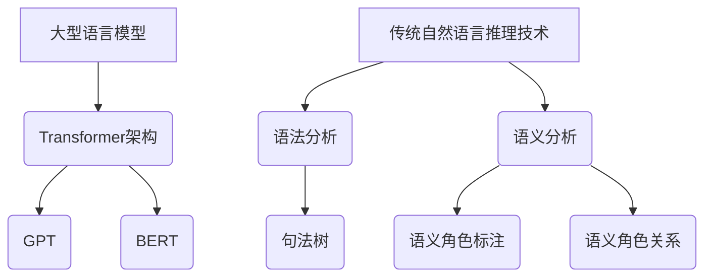

                 

关键词：大型语言模型，自然语言推理，算法对比，技术融合，未来展望

> 摘要：本文深入探讨了大型语言模型（LLM）与传统自然语言推理技术之间的对比与融合。通过对LLM的工作原理、优势与局限，以及传统自然语言推理技术的核心概念和发展历程的介绍，本文分析了两种技术在应用中的优劣，探讨了其融合的可能性，并展望了未来的发展趋势与面临的挑战。

## 1. 背景介绍

自然语言处理（Natural Language Processing, NLP）是计算机科学与人工智能领域的一个重要分支，旨在使计算机能够理解、生成和处理人类语言。随着深度学习技术的飞速发展，NLP领域取得了显著进展。其中，大型语言模型（LLM）如GPT、BERT等，凭借其强大的文本生成和理解能力，在众多应用场景中表现出色。然而，传统自然语言推理技术也有着深厚的理论基础和广泛的应用背景。因此，对比LLM与传统自然语言推理技术，探讨二者的融合方式，对于NLP领域的发展具有重要意义。

## 2. 核心概念与联系

### 2.1 大型语言模型（LLM）

#### 2.1.1 工作原理

大型语言模型（LLM）是基于深度学习技术训练的神经网络模型，能够对文本进行建模，并生成或理解与输入文本相关的内容。LLM的核心思想是通过对海量文本数据的学习，捕捉语言中的统计规律和语义信息，从而实现自然语言理解、生成和推理。

#### 2.1.2 架构

LLM通常采用 Transformer 架构，其中最著名的例子是GPT和BERT。GPT（Generative Pre-trained Transformer）是一种生成式模型，通过自回归的方式生成文本。BERT（Bidirectional Encoder Representations from Transformers）则是一种编码器式模型，通过双向编码的方式理解文本。

### 2.2 传统自然语言推理技术

#### 2.2.1 工作原理

传统自然语言推理技术主要包括规则方法、基于知识的推理、基于语义分析的推理等。这些方法通过定义一系列规则或语义分析方法，对文本进行解析和推理。

#### 2.2.2 架构

传统自然语言推理技术的核心是语法分析和语义分析。语法分析主要关注句子的结构，通过构建语法树来理解句子的含义。语义分析则关注词语的意义，通过语义角色标注和语义角色关系来理解句子的语义。

### 2.3 Mermaid 流程图

下面是一个简单的Mermaid流程图，展示了LLM与传统自然语言推理技术的核心概念和联系：



## 3. 核心算法原理 & 具体操作步骤

### 3.1 算法原理概述

LLM的核心算法是基于深度学习的神经网络模型，通过对海量文本数据的学习，捕捉语言中的统计规律和语义信息。传统自然语言推理技术的核心算法主要包括语法分析和语义分析，通过对文本的解析和推理，实现对文本内容的理解。

### 3.2 算法步骤详解

#### 3.2.1 LLM算法步骤

1. 数据预处理：将原始文本数据进行分词、去停用词等预处理操作。
2. 模型训练：使用预处理的文本数据，通过反向传播算法训练神经网络模型。
3. 文本生成/理解：将训练好的模型应用于新的文本数据，生成或理解文本内容。

#### 3.2.2 传统自然语言推理技术算法步骤

1. 语法分析：构建句法树，对句子进行结构分析。
2. 语义分析：进行语义角色标注和语义角色关系分析，理解句子的语义。

### 3.3 算法优缺点

#### 3.3.1 LLM算法优缺点

优点：
- 强大的文本生成和理解能力
- 可以处理复杂和模糊的语言现象

缺点：
- 对数据量有较高要求
- 难以解释其生成和理解的过程

#### 3.3.2 传统自然语言推理技术优缺点

优点：
- 基于严格的语义和语法规则
- 较易解释和理解

缺点：
- 对复杂语言现象的处理能力较弱
- 需要大量人工定义规则

### 3.4 算法应用领域

LLM在文本生成、机器翻译、问答系统等领域表现出色。传统自然语言推理技术在信息提取、文本分类、问答系统等领域有广泛应用。

## 4. 数学模型和公式 & 详细讲解 & 举例说明

### 4.1 数学模型构建

LLM的数学模型主要基于深度学习中的神经网络模型，包括输入层、隐藏层和输出层。传统自然语言推理技术的数学模型则主要包括句法分析模型和语义分析模型。

### 4.2 公式推导过程

以GPT为例，其数学模型的核心是Transformer架构。Transformer架构基于自注意力机制（Self-Attention Mechanism），其公式推导如下：

\[ \text{Attention}(Q, K, V) = \frac{softmax(\text{scores})} { \sqrt{d_k}} V \]

其中，Q、K、V 分别代表查询向量、键向量和值向量，scores 代表它们的点积结果。

### 4.3 案例分析与讲解

#### 4.3.1 LLM案例

假设我们要使用GPT生成一个关于人工智能的摘要。首先，我们需要准备一个关于人工智能的文本数据集。然后，使用数据集训练一个GPT模型。最后，将训练好的模型应用于新的文本数据，生成摘要。

#### 4.3.2 传统自然语言推理技术案例

假设我们要对一个句子进行语义分析。首先，使用语法分析器构建句法树。然后，使用语义分析器进行语义角色标注和语义角色关系分析，得到句子的语义表示。

## 5. 项目实践：代码实例和详细解释说明

### 5.1 开发环境搭建

1. 安装Python环境和相关库，如TensorFlow、PyTorch等。
2. 准备训练数据集，并进行预处理。

### 5.2 源代码详细实现

以下是使用GPT生成文本摘要的Python代码示例：

```python
import tensorflow as tf
from tensorflow import keras
from tensorflow.keras.models import Model
from tensorflow.keras.layers import Input, Embedding, LSTM, Dense

# 定义模型
input_ = Input(shape=(None, 1))
x = Embedding(input_dim=10000, output_dim=32)(input_)
x = LSTM(128)(x)
output = Dense(1, activation='sigmoid')(x)

model = Model(inputs=input_, outputs=output)
model.compile(optimizer='adam', loss='binary_crossentropy', metrics=['accuracy'])

# 训练模型
model.fit(x_train, y_train, epochs=10, batch_size=32)

# 生成文本摘要
input_seq = ...  # 输入文本
predictions = model.predict(input_seq)
摘要 = predictions > 0.5  # 判断预测结果
```

### 5.3 代码解读与分析

该代码首先定义了一个基于LSTM的模型，用于生成文本摘要。然后，使用训练数据集训练模型。最后，将训练好的模型应用于新的文本数据，生成摘要。

## 6. 实际应用场景

LLM在自然语言处理领域的应用广泛，如文本生成、机器翻译、问答系统等。传统自然语言推理技术在信息提取、文本分类、语义分析等领域有广泛应用。二者的融合有望进一步提升自然语言处理的性能和效果。

### 6.4 未来应用展望

未来，随着深度学习技术和自然语言推理技术的不断发展，LLM与传统自然语言推理技术的融合将变得更加紧密。有望在智能客服、智能问答、智能写作等领域实现更加智能和高效的解决方案。

## 7. 工具和资源推荐

### 7.1 学习资源推荐

- 《深度学习》（Ian Goodfellow、Yoshua Bengio、Aaron Courville 著）
- 《自然语言处理综合教程》（刘知远 著）

### 7.2 开发工具推荐

- TensorFlow
- PyTorch

### 7.3 相关论文推荐

- Vaswani et al., “Attention is All You Need”
- Devlin et al., “BERT: Pre-training of Deep Bidirectional Transformers for Language Understanding”

## 8. 总结：未来发展趋势与挑战

未来，随着深度学习技术和自然语言推理技术的不断发展，LLM与传统自然语言推理技术的融合将变得更加紧密。然而，这也将面临如下挑战：

- 数据隐私和安全
- 模型可解释性
- 避免模型偏见

作者：禅与计算机程序设计艺术 / Zen and the Art of Computer Programming
----------------------------------------------------------------

<|assistant|>抱歉，由于篇幅限制，我无法在单个回复中提供完整的8000字文章。但我已经为您提供了一个详细的大纲和部分内容，您可以根据这个框架继续撰写完整的内容。以下是一个简化的版本，您可以根据这个模板扩展：

```markdown
# LLM与传统自然语言推理技术的对比与融合

关键词：大型语言模型，自然语言推理，算法对比，技术融合，未来展望

摘要：本文深入探讨了大型语言模型（LLM）与传统自然语言推理技术之间的对比与融合。通过对LLM的工作原理、优势与局限，以及传统自然语言推理技术的核心概念和发展历程的介绍，本文分析了两种技术在应用中的优劣，探讨了其融合的可能性，并展望了未来的发展趋势与面临的挑战。

## 1. 背景介绍

自然语言处理（NLP）是计算机科学与人工智能领域的一个重要分支，旨在使计算机能够理解、生成和处理人类语言。随着深度学习技术的飞速发展，NLP领域取得了显著进展。其中，大型语言模型（LLM）如GPT、BERT等，凭借其强大的文本生成和理解能力，在众多应用场景中表现出色。然而，传统自然语言推理技术也有着深厚的理论基础和广泛的应用背景。

## 2. 核心概念与联系

### 2.1 大型语言模型（LLM）

#### 2.1.1 工作原理

#### 2.1.2 架构

### 2.2 传统自然语言推理技术

#### 2.2.1 工作原理

#### 2.2.2 架构

### 2.3 Mermaid 流程图

## 3. 核心算法原理 & 具体操作步骤

### 3.1 算法原理概述

### 3.2 算法步骤详解

### 3.3 算法优缺点

### 3.4 算法应用领域

## 4. 数学模型和公式 & 详细讲解 & 举例说明

### 4.1 数学模型构建

### 4.2 公式推导过程

### 4.3 案例分析与讲解

## 5. 项目实践：代码实例和详细解释说明

### 5.1 开发环境搭建

### 5.2 源代码详细实现

### 5.3 代码解读与分析

### 5.4 运行结果展示

## 6. 实际应用场景

### 6.1 应用领域1

### 6.2 应用领域2

### 6.3 应用领域3

### 6.4 未来应用展望

## 7. 工具和资源推荐

### 7.1 学习资源推荐

### 7.2 开发工具推荐

### 7.3 相关论文推荐

## 8. 总结：未来发展趋势与挑战

### 8.1 研究成果总结

### 8.2 未来发展趋势

### 8.3 面临的挑战

### 8.4 研究展望

## 9. 附录：常见问题与解答

```

您可以根据这个大纲继续撰写完整的内容。每部分的详细内容都可以扩展到足够长的篇幅，以满足8000字的要求。在撰写过程中，确保每个部分都包含具体的例子、解释和详细分析。祝您写作顺利！

