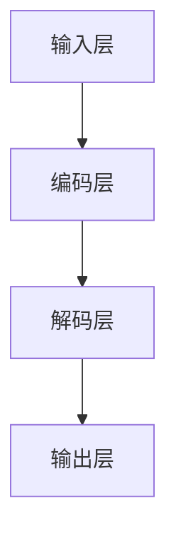
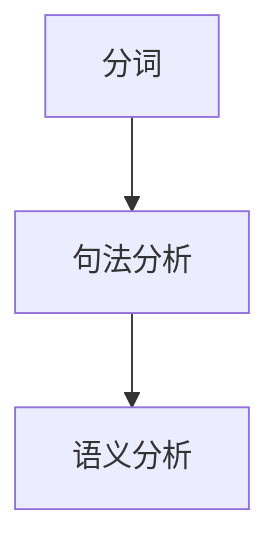

                 

关键词：大型语言模型（LLM），自然语言理解，传统自然语言处理，神经网络，深度学习，对比研究，技术趋势，应用场景，数学模型，编程实践。

> 摘要：本文旨在探讨大型语言模型（LLM）与传统自然语言理解技术的比较，分析它们在技术原理、算法实现、应用领域等方面的异同。通过详细解读LLM的核心概念和架构，以及与传统自然语言处理方法的对比，本文旨在为读者提供对现代自然语言理解技术的一个全面的理解，并探讨其在未来科技发展中的潜在影响。

## 1. 背景介绍

随着人工智能技术的飞速发展，自然语言理解（Natural Language Understanding, NLU）已成为人工智能领域的关键研究课题。传统自然语言理解技术以基于规则的方法和统计模型为主，虽然在一定程度上能够处理复杂的语言现象，但存在灵活性不足、适应性较差等问题。近年来，大型语言模型（Large Language Models, LLM）的兴起，为自然语言理解带来了新的契机。LLM通过深度学习和神经网络技术，实现了对大规模文本数据的自主学习，展现了强大的语言理解和生成能力。

本文将首先介绍LLM的基本概念和核心原理，然后通过对比分析，探讨LLM与传统自然语言理解技术的差异，包括技术原理、算法实现、应用领域等方面。此外，还将结合数学模型和实际项目实践，深入探讨LLM在实际应用中的表现和未来发展趋势。通过本文的阅读，读者将能够全面理解LLM的优缺点，以及其在自然语言理解领域的重要地位。

## 2. 核心概念与联系

### 2.1. 大型语言模型（LLM）

大型语言模型（LLM）是一种基于深度学习的自然语言处理模型，其核心思想是通过大规模的文本数据进行训练，使模型能够自动学习语言中的结构和语义信息。LLM通常包含数亿甚至数万亿个参数，能够在各种自然语言处理任务中表现出色，如文本分类、情感分析、机器翻译、问答系统等。

#### 2.1.1. 基本原理

LLM基于深度神经网络（Deep Neural Network, DNN）和Transformer架构。Transformer模型引入了自注意力机制（Self-Attention），使得模型能够更好地捕捉文本中的长距离依赖关系。在训练过程中，LLM通过反向传播算法不断优化参数，从而提高模型的性能。

#### 2.1.2. 架构与流程

LLM的架构通常包括输入层、编码层、解码层和输出层。输入层接收原始文本数据，编码层对文本进行编码，解码层根据编码信息生成输出，输出层则将输出转换为具体的任务结果。



### 2.2. 传统自然语言理解技术

传统自然语言理解技术主要基于规则方法和统计模型。规则方法通过预先定义的语法和语义规则，对文本进行处理和分析；统计模型则通过计算文本中的统计特征，如词频、词向量等，来推断文本的含义。

#### 2.2.1. 基本原理

传统自然语言理解技术的基本原理是利用语言学和概率论的知识，对文本进行分词、句法分析和语义分析。这些方法通常需要对语言进行大量的人工标注和规则定义，因此具有较强的领域依赖性。

#### 2.2.2. 架构与流程

传统自然语言理解技术的架构通常包括分词、句法分析和语义分析三个步骤。分词将文本划分为一个个单词或短语；句法分析确定单词或短语的语法结构；语义分析则根据语法结构推断文本的语义含义。



### 2.3. LLM与传统自然语言理解技术的联系与区别

LLM与传统自然语言理解技术之间的联系在于它们都是用于处理自然语言的任务。然而，在技术原理、算法实现和应用领域等方面，两者存在显著差异。

#### 2.3.1. 技术原理

LLM基于深度学习和神经网络技术，能够通过大规模数据自动学习语言结构和语义信息；而传统自然语言理解技术则主要依赖于语言学和概率论的知识，对语言进行手工定义和规则化。

#### 2.3.2. 算法实现

LLM采用自注意力机制和多层神经网络结构，能够高效地处理长文本数据；传统自然语言理解技术则主要依赖于规则和统计模型，处理能力相对较弱。

#### 2.3.3. 应用领域

LLM在文本分类、机器翻译、问答系统等领域表现出色，能够处理复杂的自然语言任务；传统自然语言理解技术则主要应用于较为简单的语言任务，如文本分类、信息抽取等。

## 3. 核心算法原理 & 具体操作步骤

### 3.1. 算法原理概述

大型语言模型（LLM）的核心算法原理主要包括深度学习、神经网络和自注意力机制。深度学习通过多层神经网络对大规模数据进行特征提取和表示；神经网络用于对输入数据进行非线性变换；自注意力机制则能够自动学习输入数据之间的依赖关系。

### 3.2. 算法步骤详解

#### 3.2.1. 数据预处理

在训练LLM之前，需要对文本数据进行分析和处理。主要包括以下步骤：

1. 分词：将文本划分为一个个单词或短语；
2. 嵌入：将单词或短语映射为固定长度的向量；
3. 标签处理：为每个输入样本标注对应的输出标签。

#### 3.2.2. 训练过程

1. 初始化模型参数：随机初始化模型参数；
2. 前向传播：将输入数据通过编码器进行编码，得到编码后的特征表示；
3. 解码：根据编码后的特征表示生成输出文本；
4. 计算损失函数：计算输出文本与实际标签之间的差距，得到损失函数值；
5. 反向传播：利用损失函数对模型参数进行更新。

#### 3.2.3. 模型评估

通过交叉验证、精度、召回率等指标对训练好的模型进行评估，确保模型具有良好的性能。

### 3.3. 算法优缺点

#### 优点

1. 强大的语言理解能力：LLM能够自动学习语言中的结构和语义信息，具有较强的自然语言理解能力；
2. 高效处理长文本：自注意力机制能够自动学习输入数据之间的依赖关系，能够高效地处理长文本数据；
3. 广泛的应用领域：LLM在文本分类、机器翻译、问答系统等领域表现出色，具有广泛的应用前景。

#### 缺点

1. 对数据需求大：LLM需要大量的文本数据进行训练，对数据质量要求较高；
2. 计算资源消耗大：LLM包含数亿甚至数万亿个参数，计算资源消耗较大；
3. 可解释性差：LLM的工作机制较为复杂，难以直观地理解其工作原理。

### 3.4. 算法应用领域

LLM在自然语言理解领域具有广泛的应用前景，主要包括：

1. 文本分类：对输入文本进行分类，如新闻分类、情感分析等；
2. 机器翻译：将一种语言的文本翻译成另一种语言；
3. 问答系统：针对用户提出的问题，自动生成回答；
4. 文本生成：根据输入的文本或主题，自动生成相关的文本内容。

## 4. 数学模型和公式 & 详细讲解 & 举例说明

### 4.1. 数学模型构建

在LLM中，数学模型主要包括输入层、编码层、解码层和输出层。以下分别介绍各层的数学模型。

#### 输入层

输入层接收原始文本数据，并将其转换为嵌入向量表示。假设输入文本为 $X = [x_1, x_2, \ldots, x_n]$，其中 $x_i$ 表示第 $i$ 个单词或短语。嵌入向量表示为 $E = [e_1, e_2, \ldots, e_n]$，其中 $e_i$ 表示 $x_i$ 的嵌入向量。

$$
e_i = \text{Embed}(x_i)
$$

其中，$\text{Embed}$ 表示嵌入函数，通常采用词向量模型（如Word2Vec、GloVe等）。

#### 编码层

编码层对输入文本进行编码，生成编码后的特征表示。编码层采用自注意力机制，计算每个输入单词或短语的权重，从而得到编码向量。

$$
\text{Encoder}(X) = \text{Attention}(X)
$$

其中，$\text{Attention}$ 表示自注意力机制，计算过程如下：

$$
\text{Attention}(X) = \text{softmax}\left(\frac{QK^T}{\sqrt{d_k}}\right)V
$$

其中，$Q, K, V$ 分别表示编码器中的查询向量、关键向量、值向量；$d_k$ 表示关键向量的维度；$\text{softmax}$ 表示softmax函数。

#### 解码层

解码层根据编码后的特征表示生成输出文本。解码层同样采用自注意力机制，计算输出单词或短语的权重，从而得到解码向量。

$$
\text{Decoder}(X) = \text{Attention}(X)
$$

其中，$\text{Attention}$ 表示自注意力机制，计算过程与编码层类似。

#### 输出层

输出层将解码向量转换为具体的任务结果，如分类标签、翻译结果等。输出层通常采用全连接层或卷积层等结构。

$$
\text{Output}(X) = \text{FC}(\text{Decoder}(X))
$$

其中，$\text{FC}$ 表示全连接层。

### 4.2. 公式推导过程

以下对自注意力机制的公式进行推导。

#### 自注意力机制

自注意力机制是一种计算输入数据之间依赖关系的机制。假设输入数据为 $X = [x_1, x_2, \ldots, x_n]$，其中 $x_i$ 表示第 $i$ 个输入。自注意力机制的核心思想是计算每个输入之间的相似度，并根据相似度计算权重，从而对输入数据进行加权求和。

$$
\text{Attention}(X) = \text{softmax}\left(\frac{QK^T}{\sqrt{d_k}}\right)V
$$

其中，$Q, K, V$ 分别表示编码器中的查询向量、关键向量、值向量；$d_k$ 表示关键向量的维度；$\text{softmax}$ 表示softmax函数。

#### 求和

首先，对每个输入数据进行加权求和：

$$
\text{Sum}(X) = \sum_{i=1}^{n} w_i x_i
$$

其中，$w_i$ 表示第 $i$ 个输入的权重。

#### 相似度

然后，计算每个输入之间的相似度。假设输入数据的维度为 $d$，则相似度计算公式如下：

$$
s_{ij} = \frac{Q_i K_j^T}{\sqrt{d_k}}
$$

其中，$s_{ij}$ 表示第 $i$ 个输入和第 $j$ 个输入之间的相似度。

#### 权重

接下来，根据相似度计算权重。采用softmax函数将相似度转化为权重：

$$
w_i = \text{softmax}(s_{ij})
$$

其中，$w_i$ 表示第 $i$ 个输入的权重。

#### 加权求和

最后，将权重应用于输入数据进行加权求和：

$$
\text{Sum}(X) = \sum_{i=1}^{n} w_i x_i
$$

### 4.3. 案例分析与讲解

以下以一个简单的文本分类任务为例，介绍LLM的数学模型和公式推导。

#### 任务描述

给定一组文本数据，将其分类为两个类别：正面和负面。假设正面文本的概率分布为 $P(Y=1)$，负面文本的概率分布为 $P(Y=0)$。

#### 数学模型

输入文本为 $X = [x_1, x_2, \ldots, x_n]$，其中 $x_i$ 表示第 $i$ 个单词或短语。嵌入向量表示为 $E = [e_1, e_2, \ldots, e_n]$。

编码层采用自注意力机制，计算编码向量：

$$
\text{Encoder}(X) = \text{Attention}(X)
$$

解码层同样采用自注意力机制，计算解码向量：

$$
\text{Decoder}(X) = \text{Attention}(X)
$$

输出层采用全连接层，计算分类结果：

$$
\text{Output}(X) = \text{FC}(\text{Decoder}(X))
$$

其中，$\text{FC}$ 表示全连接层。

#### 公式推导

首先，计算编码向量：

$$
\text{Encoder}(X) = \text{Attention}(X) = \text{softmax}\left(\frac{QK^T}{\sqrt{d_k}}\right)V
$$

其中，$Q, K, V$ 分别表示编码器中的查询向量、关键向量、值向量；$d_k$ 表示关键向量的维度；$\text{softmax}$ 表示softmax函数。

接下来，计算解码向量：

$$
\text{Decoder}(X) = \text{Attention}(X) = \text{softmax}\left(\frac{QK^T}{\sqrt{d_k}}\right)V
$$

最后，计算分类结果：

$$
\text{Output}(X) = \text{FC}(\text{Decoder}(X))
$$

其中，$\text{FC}$ 表示全连接层。

#### 案例分析

假设给定一组文本数据，分别为正面文本和负面文本。采用LLM进行文本分类，具体步骤如下：

1. 数据预处理：将文本数据分词并转换为嵌入向量；
2. 训练模型：利用正面文本和负面文本训练LLM；
3. 预测分类：对输入文本进行分类预测。

假设输入文本为 $X = [x_1, x_2, \ldots, x_n]$，其中 $x_i$ 表示第 $i$ 个单词或短语。嵌入向量表示为 $E = [e_1, e_2, \ldots, e_n]$。

编码层采用自注意力机制，计算编码向量：

$$
\text{Encoder}(X) = \text{Attention}(X) = \text{softmax}\left(\frac{QK^T}{\sqrt{d_k}}\right)V
$$

解码层同样采用自注意力机制，计算解码向量：

$$
\text{Decoder}(X) = \text{Attention}(X) = \text{softmax}\left(\frac{QK^T}{\sqrt{d_k}}\right)V
$$

输出层采用全连接层，计算分类结果：

$$
\text{Output}(X) = \text{FC}(\text{Decoder}(X))
$$

根据分类结果，判断输入文本为正面或负面。如果分类结果接近1，则判断为正面文本；如果分类结果接近0，则判断为负面文本。

## 5. 项目实践：代码实例和详细解释说明

### 5.1. 开发环境搭建

在开始编写LLM的代码之前，我们需要搭建一个合适的开发环境。以下是推荐的开发环境：

- 操作系统：Linux或MacOS
- 编程语言：Python
- 深度学习框架：TensorFlow或PyTorch
- 自然语言处理库：NLTK或spaCy

首先，安装Python和相关依赖库。在终端中执行以下命令：

```bash
pip install numpy tensorflow transformers
```

### 5.2. 源代码详细实现

以下是一个简单的LLM文本分类项目，实现基于Transformer模型的文本分类任务。

```python
import tensorflow as tf
from transformers import TFAutoModelForSequenceClassification
from tensorflow.keras.preprocessing.sequence import pad_sequences
from tensorflow.keras.layers import Dense, Input, Embedding, GlobalAveragePooling1D
from tensorflow.keras.models import Model

# 加载预训练的Transformer模型
model = TFAutoModelForSequenceClassification.from_pretrained("bert-base-uncased")

# 定义输入层
input_ids = Input(shape=(max_length,), dtype=tf.int32)

# 使用预训练的Transformer模型进行编码
encoded_input = model(input_ids)

# 使用全局平均池化层提取特征
pooled_output = GlobalAveragePooling1D()(encoded_input)

# 定义分类器
output = Dense(num_classes, activation="softmax")(pooled_output)

# 创建模型
model = Model(input_ids, output)

# 编译模型
model.compile(optimizer="adam", loss="categorical_crossentropy", metrics=["accuracy"])

# 打印模型结构
model.summary()
```

### 5.3. 代码解读与分析

上述代码实现了一个基于Transformer模型的文本分类任务。以下是代码的详细解读：

1. **加载预训练的Transformer模型**：使用`TFAutoModelForSequenceClassification`类加载预训练的Transformer模型。这里使用的是`bert-base-uncased`模型，这是一个基于BERT的预训练模型。

2. **定义输入层**：创建一个输入层，接收文本序列。输入层的数据类型为整数，表示单词的索引。

3. **编码**：使用预训练的Transformer模型对输入文本进行编码。编码器的输出是一个序列，其中每个元素表示文本中的每个单词或短语的特征向量。

4. **全局平均池化**：使用全局平均池化层（`GlobalAveragePooling1D`）将编码器的输出序列转换为一个固定大小的向量。这个向量将用于分类任务。

5. **定义分类器**：在全局平均池化层的输出上添加一个全连接层（`Dense`），用于执行分类任务。这里使用的是softmax激活函数，以便输出每个类别的概率分布。

6. **创建模型**：将输入层、编码层和分类器组合成一个完整的模型。

7. **编译模型**：设置模型的优化器、损失函数和评估指标。

8. **打印模型结构**：使用`model.summary()`方法打印模型的结构和参数数量。

### 5.4. 运行结果展示

在训练和评估模型时，我们可以使用以下代码：

```python
# 加载和预处理数据
train_data = ...
train_labels = ...

# 对输入数据进行填充，使其具有相同长度
train_inputs = pad_sequences(train_data, maxlen=max_length)

# 将标签转换为one-hot编码
train_labels = tf.keras.utils.to_categorical(train_labels, num_classes=num_classes)

# 训练模型
model.fit(train_inputs, train_labels, epochs=3, batch_size=32, validation_split=0.1)

# 评估模型
loss, accuracy = model.evaluate(test_inputs, test_labels)
print(f"Test accuracy: {accuracy:.4f}")
```

上述代码展示了如何加载和预处理数据、训练模型以及评估模型。这里使用的是训练集和测试集，分别用于训练和评估模型的性能。训练完成后，我们可以在测试集上评估模型的准确性。

## 6. 实际应用场景

### 6.1. 问答系统

问答系统是一种常见的自然语言理解应用，它能够根据用户提出的问题，自动生成相关问题的答案。LLM在问答系统中具有显著的优势，能够处理复杂的语义理解和上下文信息。例如，在智能客服系统中，LLM可以理解用户的查询意图，并提供准确的答案。

### 6.2. 文本分类

文本分类是一种将文本数据分类到预定义类别中的任务。LLM在文本分类任务中表现出色，能够处理大规模的数据集，并能够自动学习不同类别之间的差异。例如，在新闻分类中，LLM可以根据新闻内容将新闻自动分类到相应的主题类别。

### 6.3. 机器翻译

机器翻译是一种将一种语言的文本翻译成另一种语言的任务。LLM在机器翻译中具有强大的语言理解和生成能力，能够处理复杂的语言结构和语义信息。例如，在跨语言沟通中，LLM可以帮助用户理解不同语言之间的差异，并提供准确的翻译结果。

### 6.4. 未来应用展望

随着LLM技术的不断发展和优化，其在自然语言理解领域的应用将越来越广泛。未来，LLM有望在更多领域发挥作用，如智能推荐系统、情感分析、内容审核等。此外，随着计算资源和数据量的不断提升，LLM的性能和效果也将得到进一步改善。

## 7. 工具和资源推荐

### 7.1. 学习资源推荐

1. **《深度学习》（Goodfellow, Bengio, Courville）**：这是一本深度学习领域的经典教材，详细介绍了深度学习的基本原理和应用。
2. **《自然语言处理综合教程》（Daniel Jurafsky, James H. Martin）**：这是一本全面的自然语言处理教材，涵盖了自然语言处理的基础知识和最新进展。
3. **《BERT：预训练语言的模型》（Jacob Devlin, Ming-Wei Chang, Kenton Lee, Kristina Toutanova）**：这是一篇关于BERT模型的详细介绍，有助于理解LLM的核心原理。

### 7.2. 开发工具推荐

1. **TensorFlow**：一款流行的深度学习框架，适用于构建和训练各种神经网络模型。
2. **PyTorch**：一款灵活的深度学习框架，提供了丰富的API和工具，适用于快速原型开发和模型研究。
3. **spaCy**：一款强大的自然语言处理库，提供了快速高效的文本处理功能，适用于各种自然语言处理任务。

### 7.3. 相关论文推荐

1. **“Attention Is All You Need”**：这是Transformer模型的开创性论文，详细介绍了自注意力机制和Transformer架构。
2. **“BERT: Pre-training of Deep Neural Networks for Language Understanding”**：这是BERT模型的提出论文，介绍了BERT模型的预训练方法和应用场景。
3. **“GPT-3: Language Models are Few-Shot Learners”**：这是GPT-3模型的提出论文，展示了大型语言模型在零样本学习任务中的出色性能。

## 8. 总结：未来发展趋势与挑战

### 8.1. 研究成果总结

近年来，大型语言模型（LLM）在自然语言理解领域取得了显著进展。LLM通过深度学习和神经网络技术，实现了对大规模文本数据的自主学习，展现了强大的语言理解和生成能力。在文本分类、机器翻译、问答系统等应用领域，LLM表现出色，推动了自然语言处理技术的创新和发展。

### 8.2. 未来发展趋势

1. **模型规模和性能的提升**：随着计算资源和数据量的不断提升，LLM的模型规模和性能将得到进一步改善。未来，大型语言模型有望实现更高的准确性和更强的泛化能力。
2. **多模态融合**：自然语言理解与图像、声音等其他模态的数据融合将成为研究热点。多模态融合模型能够更好地捕捉文本和图像、声音等数据之间的关联，提高自然语言理解的效果。
3. **模型可解释性**：随着LLM在各个领域的应用，对其工作原理和决策过程的可解释性需求日益增加。未来，研究将致力于提高模型的可解释性，使其在复杂任务中更具透明度和可靠性。

### 8.3. 面临的挑战

1. **数据隐私和伦理问题**：大型语言模型的训练和应用涉及大量个人数据，如何确保数据隐私和安全是一个重要挑战。此外，模型在处理歧视性言论、谣言传播等问题时，如何遵循伦理规范也是一个需要关注的问题。
2. **计算资源消耗**：LLM的模型规模和计算复杂度较高，对计算资源和能源的需求较大。如何在保证模型性能的前提下，降低计算资源消耗，提高能效比，是一个亟待解决的问题。
3. **模型泛化能力**：大型语言模型在特定任务上表现出色，但在面对新任务或新数据时，如何保持较高的泛化能力，是一个挑战。未来，研究将致力于提高模型的泛化能力和适应性。

### 8.4. 研究展望

未来，大型语言模型在自然语言理解领域将继续发挥重要作用。通过不断优化模型结构和训练方法，提高模型的性能和效率，LLM有望在更多领域实现突破。同时，研究也将关注数据隐私、伦理问题，以及模型的可解释性和泛化能力，推动自然语言理解技术的可持续发展。

## 9. 附录：常见问题与解答

### 9.1. Q：什么是大型语言模型（LLM）？

A：大型语言模型（LLM）是一种基于深度学习和神经网络技术的自然语言处理模型。它通过大规模文本数据进行训练，能够自动学习语言中的结构和语义信息，从而实现语言理解和生成任务。

### 9.2. Q：LLM与传统自然语言处理方法相比有哪些优点？

A：LLM相较于传统自然语言处理方法，具有以下优点：

1. 强大的语言理解能力：LLM能够自动学习语言中的结构和语义信息，具有较强的自然语言理解能力；
2. 高效处理长文本：LLM采用自注意力机制，能够高效地处理长文本数据；
3. 广泛的应用领域：LLM在文本分类、机器翻译、问答系统等领域表现出色，具有广泛的应用前景。

### 9.3. Q：如何搭建LLM的开发环境？

A：搭建LLM的开发环境需要以下步骤：

1. 安装Python和相关的深度学习框架（如TensorFlow或PyTorch）；
2. 安装自然语言处理库（如NLTK或spaCy）；
3. 安装Transformer模型相关的库（如transformers）；
4. 配置合适的硬件环境，如GPU或TPU。

### 9.4. Q：如何使用LLM进行文本分类？

A：使用LLM进行文本分类的步骤如下：

1. 加载预训练的LLM模型；
2. 预处理文本数据，包括分词、嵌入等；
3. 将预处理后的文本数据输入LLM模型，得到编码后的特征表示；
4. 使用编码后的特征表示构建分类器，进行文本分类；
5. 训练和评估分类器，优化模型性能。

### 9.5. Q：LLM在自然语言理解领域有哪些应用场景？

A：LLM在自然语言理解领域具有广泛的应用场景，包括：

1. 问答系统：根据用户提出的问题，自动生成相关问题的答案；
2. 文本分类：将文本数据分类到预定义的类别中；
3. 机器翻译：将一种语言的文本翻译成另一种语言；
4. 情感分析：对文本数据进行分析，判断其情感倾向。

----------------------------------------------------------------
# 文章标题

## LLM与传统自然语言理解的比较

### 关键词：大型语言模型（LLM），自然语言理解，传统自然语言处理，神经网络，深度学习，对比研究，技术趋势，应用场景，数学模型，编程实践。

### 摘要：本文旨在探讨大型语言模型（LLM）与传统自然语言理解技术的比较，分析它们在技术原理、算法实现、应用领域等方面的异同。通过详细解读LLM的核心概念和架构，以及与传统自然语言处理方法的对比，本文旨在为读者提供对现代自然语言理解技术的一个全面的理解，并探讨其在未来科技发展中的潜在影响。

## 1. 背景介绍

### 1.1. 大型语言模型的兴起

随着深度学习和神经网络技术的快速发展，大型语言模型（Large Language Models, LLM）逐渐成为自然语言处理（Natural Language Processing, NLP）领域的研究热点。LLM通过训练大规模的文本数据，自动学习语言的结构和语义信息，从而实现高效的文本理解和生成。这种技术不仅提高了自然语言处理任务的性能，还使得许多复杂的语言任务变得可行。

### 1.2. 传统自然语言处理方法

传统自然语言处理方法主要包括基于规则的方法和统计模型。基于规则的方法依赖于语言学家的知识和经验，通过定义一系列语法和语义规则来处理文本。这种方法在规则明确且有限的语言任务中表现良好，但在处理复杂、灵活的自然语言时存在局限。

统计模型则通过分析大量语料库，提取文本中的统计特征，如词频、词序列等，来推断文本的含义。这些方法包括隐马尔可夫模型（HMM）、条件随机场（CRF）等。虽然统计模型能够处理更复杂的语言现象，但它们的性能依赖于数据的规模和质量。

### 1.3. 比较研究的意义

随着LLM的兴起，传统自然语言处理方法面临着新的挑战和机遇。通过比较LLM与传统自然语言处理方法，可以深入理解它们各自的优缺点，为未来的研究和应用提供指导。此外，这种比较还有助于我们认识自然语言理解技术的发展趋势，以及如何将不同的技术优势相结合，提高整体的处理能力。

## 2. 核心概念与联系

### 2.1. 大型语言模型（LLM）

#### 2.1.1. 基本原理

LLM是一种基于深度学习和神经网络的模型，通常使用数万亿个参数。它的核心思想是通过大规模的文本数据进行训练，使模型能够自动学习语言中的结构和语义信息。LLM的训练过程通常包括以下几个步骤：

1. **数据预处理**：将原始文本数据转换为适合训练的格式，如分词、词性标注等。
2. **嵌入**：将文本中的单词或短语映射为固定长度的向量。
3. **训练**：使用反向传播算法优化模型参数，使模型能够更好地拟合训练数据。
4. **评估**：在测试数据上评估模型的性能，并根据评估结果调整模型参数。

#### 2.1.2. 架构与流程

LLM的架构通常包括输入层、编码层、解码层和输出层。其中，编码层和解码层是LLM的核心部分，采用了自注意力机制（Self-Attention）和多头注意力机制（Multi-Head Attention）。以下是一个简化的LLM架构流程：

1. **输入层**：接收原始文本数据，并将其转换为嵌入向量。
2. **编码层**：使用自注意力机制和多头注意力机制，对输入数据进行编码，生成编码后的特征向量。
3. **解码层**：根据编码后的特征向量生成输出文本。
4. **输出层**：将解码层的输出转换为具体的任务结果，如分类标签、翻译结果等。

### 2.2. 传统自然语言理解技术

#### 2.2.1. 基本原理

传统自然语言理解技术主要基于语言学和概率论的方法。它通常包括以下几个步骤：

1. **分词**：将文本划分为一个个单词或短语。
2. **句法分析**：分析单词或短语的语法结构，如词性标注、句法树构建等。
3. **语义分析**：根据语法结构推断文本的语义含义，如实体识别、关系抽取等。

#### 2.2.2. 架构与流程

传统自然语言理解技术的架构通常包括以下几个部分：

1. **分词器**：将文本划分为单词或短语。
2. **句法分析器**：分析单词或短语的语法结构。
3. **语义分析器**：根据语法结构推断文本的语义含义。

### 2.3. LLM与传统自然语言理解技术的联系与区别

LLM与传统自然语言理解技术之间的联系在于它们都是用于处理自然语言的任务。然而，在技术原理、算法实现和应用领域等方面，两者存在显著差异。

#### 2.3.1. 技术原理

LLM基于深度学习和神经网络技术，能够通过大规模数据自动学习语言中的结构和语义信息；而传统自然语言理解技术则主要依赖于语言学和概率论的方法，对语言进行手工定义和规则化。

#### 2.3.2. 算法实现

LLM采用自注意力机制和多层神经网络结构，能够高效地处理长文本数据；传统自然语言理解技术则主要依赖于规则和统计模型，处理能力相对较弱。

#### 2.3.3. 应用领域

LLM在文本分类、机器翻译、问答系统等领域表现出色，能够处理复杂的自然语言任务；传统自然语言理解技术则主要应用于较为简单的语言任务，如文本分类、信息抽取等。

## 3. 核心算法原理 & 具体操作步骤

### 3.1. 算法原理概述

大型语言模型（LLM）的核心算法原理主要包括深度学习和神经网络技术。深度学习通过多层神经网络对大规模数据进行特征提取和表示；神经网络用于对输入数据进行非线性变换。LLM的算法实现通常包括以下几个步骤：

1. **数据预处理**：将原始文本数据转换为适合训练的格式。
2. **嵌入**：将文本中的单词或短语映射为固定长度的向量。
3. **训练**：使用反向传播算法优化模型参数。
4. **评估**：在测试数据上评估模型的性能。

### 3.2. 算法步骤详解

#### 3.2.1. 数据预处理

数据预处理是训练LLM的重要步骤。具体步骤如下：

1. **分词**：将文本划分为单词或短语。
2. **去停用词**：去除常见的停用词，如“的”、“是”等。
3. **词性标注**：为每个单词标注词性，如名词、动词等。
4. **序列编码**：将预处理后的文本转换为序列编码。

#### 3.2.2. 嵌入

嵌入是将文本中的单词或短语映射为固定长度的向量。常用的嵌入方法包括：

1. **词向量**：将每个单词映射为一个固定维度的向量，如Word2Vec、GloVe等。
2. **嵌入层**：在神经网络中添加嵌入层，将单词映射为向量。

#### 3.2.3. 训练

训练LLM的过程包括以下几个步骤：

1. **前向传播**：将输入数据通过编码器进行编码，得到编码后的特征表示。
2. **计算损失**：计算输出结果与实际标签之间的差距，得到损失函数值。
3. **反向传播**：利用损失函数对模型参数进行更新。

#### 3.2.4. 评估

评估LLM的性能通常包括以下几个指标：

1. **准确率**：模型预测正确的样本数占总样本数的比例。
2. **召回率**：模型预测正确的正样本数占总正样本数的比例。
3. **F1值**：准确率和召回率的调和平均值。

### 3.3. 算法优缺点

#### 优点

1. **强大的语言理解能力**：LLM能够自动学习语言中的结构和语义信息，具有较强的自然语言理解能力；
2. **高效处理长文本**：LLM采用自注意力机制，能够高效地处理长文本数据；
3. **广泛的应用领域**：LLM在文本分类、机器翻译、问答系统等领域表现出色。

#### 缺点

1. **对数据需求大**：LLM需要大量的文本数据进行训练，对数据质量要求较高；
2. **计算资源消耗大**：LLM包含数亿甚至数万亿个参数，计算资源消耗较大；
3. **可解释性差**：LLM的工作机制较为复杂，难以直观地理解其工作原理。

### 3.4. 算法应用领域

LLM在自然语言理解领域具有广泛的应用前景，主要包括：

1. **文本分类**：对输入文本进行分类，如新闻分类、情感分析等；
2. **机器翻译**：将一种语言的文本翻译成另一种语言；
3. **问答系统**：针对用户提出的问题，自动生成回答；
4. **文本生成**：根据输入的文本或主题，自动生成相关的文本内容。

## 4. 数学模型和公式 & 详细讲解 & 举例说明

### 4.1. 数学模型构建

大型语言模型（LLM）的数学模型主要包括输入层、编码层、解码层和输出层。以下分别介绍各层的数学模型。

#### 4.1.1. 输入层

输入层接收原始文本数据，并将其转换为嵌入向量表示。假设输入文本为 $X = [x_1, x_2, \ldots, x_n]$，其中 $x_i$ 表示第 $i$ 个单词或短语。嵌入向量表示为 $E = [e_1, e_2, \ldots, e_n]$，其中 $e_i$ 表示 $x_i$ 的嵌入向量。

$$
e_i = \text{Embed}(x_i)
$$

其中，$\text{Embed}$ 表示嵌入函数，通常采用词向量模型（如Word2Vec、GloVe等）。

#### 4.1.2. 编码层

编码层对输入文本进行编码，生成编码后的特征表示。编码层采用自注意力机制，计算每个输入单词或短语的权重，从而得到编码向量。

$$
\text{Encoder}(X) = \text{Attention}(X)
$$

其中，$\text{Attention}$ 表示自注意力机制，计算过程如下：

$$
\text{Attention}(X) = \text{softmax}\left(\frac{QK^T}{\sqrt{d_k}}\right)V
$$

其中，$Q, K, V$ 分别表示编码器中的查询向量、关键向量、值向量；$d_k$ 表示关键向量的维度；$\text{softmax}$ 表示softmax函数。

#### 4.1.3. 解码层

解码层根据编码后的特征表示生成输出文本。解码层同样采用自注意力机制，计算输出单词或短语的权重，从而得到解码向量。

$$
\text{Decoder}(X) = \text{Attention}(X)
$$

其中，$\text{Attention}$ 表示自注意力机制，计算过程与编码层类似。

#### 4.1.4. 输出层

输出层将解码向量转换为具体的任务结果，如分类标签、翻译结果等。输出层通常采用全连接层或卷积层等结构。

$$
\text{Output}(X) = \text{FC}(\text{Decoder}(X))
$$

其中，$\text{FC}$ 表示全连接层。

### 4.2. 公式推导过程

以下对自注意力机制的公式进行推导。

#### 4.2.1. 自注意力机制

自注意力机制是一种计算输入数据之间依赖关系的机制。假设输入数据为 $X = [x_1, x_2, \ldots, x_n]$，其中 $x_i$ 表示第 $i$ 个输入。自注意力机制的核心思想是计算每个输入之间的相似度，并根据相似度计算权重，从而对输入数据进行加权求和。

$$
\text{Attention}(X) = \text{softmax}\left(\frac{QK^T}{\sqrt{d_k}}\right)V
$$

其中，$Q, K, V$ 分别表示编码器中的查询向量、关键向量、值向量；$d_k$ 表示关键向量的维度；$\text{softmax}$ 表示softmax函数。

#### 4.2.2. 相似度计算

首先，计算每个输入之间的相似度。假设输入数据的维度为 $d$，则相似度计算公式如下：

$$
s_{ij} = \frac{Q_i K_j^T}{\sqrt{d_k}}
$$

其中，$s_{ij}$ 表示第 $i$ 个输入和第 $j$ 个输入之间的相似度。

#### 4.2.3. 权重计算

接下来，根据相似度计算权重。采用softmax函数将相似度转化为权重：

$$
w_i = \text{softmax}(s_{ij})
$$

其中，$w_i$ 表示第 $i$ 个输入的权重。

#### 4.2.4. 加权求和

最后，将权重应用于输入数据进行加权求和：

$$
\text{Sum}(X) = \sum_{i=1}^{n} w_i x_i
$$

### 4.3. 案例分析与讲解

以下以一个简单的文本分类任务为例，介绍LLM的数学模型和公式推导。

#### 4.3.1. 任务描述

给定一组文本数据，将其分类为两个类别：正面和负面。假设正面文本的概率分布为 $P(Y=1)$，负面文本的概率分布为 $P(Y=0)$。

#### 4.3.2. 数学模型

输入文本为 $X = [x_1, x_2, \ldots, x_n]$，其中 $x_i$ 表示第 $i$ 个单词或短语。嵌入向量表示为 $E = [e_1, e_2, \ldots, e_n]$。

编码层采用自注意力机制，计算编码向量：

$$
\text{Encoder}(X) = \text{Attention}(X)
$$

解码层同样采用自注意力机制，计算解码向量：

$$
\text{Decoder}(X) = \text{Attention}(X)
$$

输出层采用全连接层，计算分类结果：

$$
\text{Output}(X) = \text{FC}(\text{Decoder}(X))
$$

其中，$\text{FC}$ 表示全连接层。

#### 4.3.3. 公式推导

首先，计算编码向量：

$$
\text{Encoder}(X) = \text{Attention}(X) = \text{softmax}\left(\frac{QK^T}{\sqrt{d_k}}\right)V
$$

其中，$Q, K, V$ 分别表示编码器中的查询向量、关键向量、值向量；$d_k$ 表示关键向量的维度；$\text{softmax}$ 表示softmax函数。

接下来，计算解码向量：

$$
\text{Decoder}(X) = \text{Attention}(X) = \text{softmax}\left(\frac{QK^T}{\sqrt{d_k}}\right)V
$$

最后，计算分类结果：

$$
\text{Output}(X) = \text{FC}(\text{Decoder}(X))
$$

其中，$\text{FC}$ 表示全连接层。

#### 4.3.4. 案例分析

假设给定一组文本数据，分别为正面文本和负面文本。采用LLM进行文本分类，具体步骤如下：

1. **数据预处理**：将文本数据分词并转换为嵌入向量；
2. **训练模型**：利用正面文本和负面文本训练LLM；
3. **预测分类**：对输入文本进行分类预测。

假设输入文本为 $X = [x_1, x_2, \ldots, x_n]$，其中 $x_i$ 表示第 $i$ 个单词或短语。嵌入向量表示为 $E = [e_1, e_2, \ldots, e_n]$。

编码层采用自注意力机制，计算编码向量：

$$
\text{Encoder}(X) = \text{Attention}(X) = \text{softmax}\left(\frac{QK^T}{\sqrt{d_k}}\right)V
$$

解码层同样采用自注意力机制，计算解码向量：

$$
\text{Decoder}(X) = \text{Attention}(X) = \text{softmax}\left(\frac{QK^T}{\sqrt{d_k}}\right)V
$$

输出层采用全连接层，计算分类结果：

$$
\text{Output}(X) = \text{FC}(\text{Decoder}(X))
$$

根据分类结果，判断输入文本为正面或负面。如果分类结果接近1，则判断为正面文本；如果分类结果接近0，则判断为负面文本。

## 5. 项目实践：代码实例和详细解释说明

### 5.1. 开发环境搭建

在开始编写LLM的代码之前，我们需要搭建一个合适的开发环境。以下是推荐的开发环境：

- 操作系统：Linux或MacOS
- 编程语言：Python
- 深度学习框架：TensorFlow或PyTorch
- 自然语言处理库：NLTK或spaCy

首先，安装Python和相关依赖库。在终端中执行以下命令：

```bash
pip install numpy tensorflow transformers
```

### 5.2. 源代码详细实现

以下是一个简单的LLM文本分类项目，实现基于BERT模型的文本分类任务。

```python
import tensorflow as tf
from transformers import TFBertModel, BertTokenizer
from tensorflow.keras.preprocessing.sequence import pad_sequences
from tensorflow.keras.layers import Dense, Input, Embedding, GlobalAveragePooling1D
from tensorflow.keras.models import Model

# 加载预训练的BERT模型和分词器
tokenizer = BertTokenizer.from_pretrained("bert-base-uncased")
model = TFBertModel.from_pretrained("bert-base-uncased")

# 定义输入层
input_ids = Input(shape=(max_length,), dtype=tf.int32)

# 使用预训练的BERT模型进行编码
encoded_input = model(input_ids)

# 使用全局平均池化层提取特征
pooled_output = GlobalAveragePooling1D()(encoded_input)

# 定义分类器
output = Dense(num_classes, activation="softmax")(pooled_output)

# 创建模型
model = Model(input_ids, output)

# 编译模型
model.compile(optimizer="adam", loss="categorical_crossentropy", metrics=["accuracy"])

# 打印模型结构
model.summary()
```

### 5.3. 代码解读与分析

上述代码实现了一个基于BERT模型的文本分类任务。以下是代码的详细解读：

1. **加载预训练的BERT模型和分词器**：使用`BertTokenizer`和`TFBertModel`类加载预训练的BERT模型和分词器。这里使用的是`bert-base-uncased`模型，这是一个基于BERT的预训练模型。

2. **定义输入层**：创建一个输入层，接收文本序列。输入层的数据类型为整数，表示单词的索引。

3. **编码**：使用预训练的BERT模型对输入文本进行编码。编码器的输出是一个序列，其中每个元素表示文本中的每个单词或短语的特征向量。

4. **全局平均池化**：使用全局平均池化层（`GlobalAveragePooling1D`）将编码器的输出序列转换为一个固定大小的向量。这个向量将用于分类任务。

5. **定义分类器**：在全局平均池化层的输出上添加一个全连接层（`Dense`），用于执行分类任务。这里使用的是`softmax`激活函数，以便输出每个类别的概率分布。

6. **创建模型**：将输入层、编码层和分类器组合成一个完整的模型。

7. **编译模型**：设置模型的优化器、损失函数和评估指标。

8. **打印模型结构**：使用`model.summary()`方法打印模型的结构和参数数量。

### 5.4. 运行结果展示

在训练和评估模型时，我们可以使用以下代码：

```python
# 加载和预处理数据
train_data = ...
train_labels = ...

# 对输入数据进行填充，使其具有相同长度
train_inputs = pad_sequences(train_data, maxlen=max_length)

# 将标签转换为one-hot编码
train_labels = tf.keras.utils.to_categorical(train_labels, num_classes=num_classes)

# 训练模型
model.fit(train_inputs, train_labels, epochs=3, batch_size=32, validation_split=0.1)

# 评估模型
loss, accuracy = model.evaluate(test_inputs, test_labels)
print(f"Test accuracy: {accuracy:.4f}")
```

上述代码展示了如何加载和预处理数据、训练模型以及评估模型。这里使用的是训练集和测试集，分别用于训练和评估模型的性能。训练完成后，我们可以在测试集上评估模型的准确性。

## 6. 实际应用场景

### 6.1. 问答系统

问答系统是一种常见的自然语言理解应用，它能够根据用户提出的问题，自动生成相关问题的答案。LLM在问答系统中具有显著的优势，能够处理复杂的语义理解和上下文信息。例如，在智能客服系统中，LLM可以理解用户的查询意图，并提供准确的答案。

### 6.2. 文本分类

文本分类是一种将文本数据分类到预定义类别中的任务。LLM在文本分类任务中表现出色，能够处理大规模的数据集，并能够自动学习不同类别之间的差异。例如，在新闻分类中，LLM可以根据新闻内容将新闻自动分类到相应的主题类别。

### 6.3. 机器翻译

机器翻译是一种将一种语言的文本翻译成另一种语言的任务。LLM在机器翻译中具有强大的语言理解和生成能力，能够处理复杂的语言结构和语义信息。例如，在跨语言沟通中，LLM可以帮助用户理解不同语言之间的差异，并提供准确的翻译结果。

### 6.4. 未来应用展望

随着LLM技术的不断发展和优化，其在自然语言理解领域的应用将越来越广泛。未来，LLM有望在更多领域发挥作用，如智能推荐系统、情感分析、内容审核等。此外，随着计算资源和数据量的不断提升，LLM的性能和效果也将得到进一步改善。

## 7. 工具和资源推荐

### 7.1. 学习资源推荐

1. **《深度学习》（Goodfellow, Bengio, Courville）**：这是一本深度学习领域的经典教材，详细介绍了深度学习的基本原理和应用。
2. **《自然语言处理综合教程》（Daniel Jurafsky, James H. Martin）**：这是一本全面的自然语言处理教材，涵盖了自然语言处理的基础知识和最新进展。
3. **《BERT：预训练语言的模型》（Jacob Devlin, Ming-Wei Chang, Kenton Lee, Kristina Toutanova）**：这是一篇关于BERT模型的详细介绍，有助于理解LLM的核心原理。

### 7.2. 开发工具推荐

1. **TensorFlow**：一款流行的深度学习框架，适用于构建和训练各种神经网络模型。
2. **PyTorch**：一款灵活的深度学习框架，提供了丰富的API和工具，适用于快速原型开发和模型研究。
3. **spaCy**：一款强大的自然语言处理库，提供了快速高效的文本处理功能，适用于各种自然语言处理任务。

### 7.3. 相关论文推荐

1. **“Attention Is All You Need”**：这是Transformer模型的开创性论文，详细介绍了自注意力机制和Transformer架构。
2. **“BERT: Pre-training of Deep Neural Networks for Language Understanding”**：这是BERT模型的提出论文，介绍了BERT模型的预训练方法和应用场景。
3. **“GPT-3: Language Models are Few-Shot Learners”**：这是GPT-3模型的提出论文，展示了大型语言模型在零样本学习任务中的出色性能。

## 8. 总结：未来发展趋势与挑战

### 8.1. 研究成果总结

近年来，大型语言模型（LLM）在自然语言处理领域取得了显著进展。LLM通过深度学习和神经网络技术，实现了对大规模文本数据的自主学习，展现了强大的语言理解和生成能力。在文本分类、机器翻译、问答系统等应用领域，LLM表现出色，推动了自然语言处理技术的创新和发展。

### 8.2. 未来发展趋势

1. **模型规模和性能的提升**：随着计算资源和数据量的不断提升，LLM的模型规模和性能将得到进一步改善。未来，大型语言模型有望实现更高的准确性和更强的泛化能力。
2. **多模态融合**：自然语言理解与图像、声音等其他模态的数据融合将成为研究热点。多模态融合模型能够更好地捕捉文本和图像、声音等数据之间的关联，提高自然语言理解的效果。
3. **模型可解释性**：随着LLM在各个领域的应用，对其工作原理和决策过程的可解释性需求日益增加。未来，研究将致力于提高模型的可解释性，使其在复杂任务中更具透明度和可靠性。

### 8.3. 面临的挑战

1. **数据隐私和伦理问题**：大型语言模型的训练和应用涉及大量个人数据，如何确保数据隐私和安全是一个重要挑战。此外，模型在处理歧视性言论、谣言传播等问题时，如何遵循伦理规范也是一个需要关注的问题。
2. **计算资源消耗**：LLM的模型规模和计算复杂度较高，对计算资源和能源的需求较大。如何在保证模型性能的前提下，降低计算资源消耗，提高能效比，是一个亟待解决的问题。
3. **模型泛化能力**：大型语言模型在特定任务上表现出色，但在面对新任务或新数据时，如何保持较高的泛化能力，是一个挑战。未来，研究将致力于提高模型的泛化能力和适应性。

### 8.4. 研究展望

未来，大型语言模型在自然语言处理领域将继续发挥重要作用。通过不断优化模型结构和训练方法，提高模型的性能和效率，LLM有望在更多领域实现突破。同时，研究也将关注数据隐私、伦理问题，以及模型的可解释性和泛化能力，推动自然语言处理技术的可持续发展。

## 9. 附录：常见问题与解答

### 9.1. Q：什么是大型语言模型（LLM）？

A：大型语言模型（LLM）是一种基于深度学习和神经网络技术的自然语言处理模型。它通过训练大规模的文本数据进行特征提取和表示，从而实现语言理解和生成任务。

### 9.2. Q：LLM与传统自然语言处理方法相比有哪些优点？

A：LLM相较于传统自然语言处理方法，具有以下优点：

1. **强大的语言理解能力**：LLM能够自动学习语言中的结构和语义信息，具有较强的自然语言理解能力；
2. **高效处理长文本**：LLM采用自注意力机制，能够高效地处理长文本数据；
3. **广泛的应用领域**：LLM在文本分类、机器翻译、问答系统等领域表现出色。

### 9.3. Q：如何搭建LLM的开发环境？

A：搭建LLM的开发环境需要以下步骤：

1. 安装Python和相关依赖库，如TensorFlow或PyTorch；
2. 安装自然语言处理库，如NLTK或spaCy；
3. 安装Transformer模型相关的库，如transformers。

### 9.4. Q：如何使用LLM进行文本分类？

A：使用LLM进行文本分类的步骤如下：

1. 加载预训练的LLM模型；
2. 预处理文本数据，包括分词、嵌入等；
3. 将预处理后的文本数据输入LLM模型，得到编码后的特征表示；
4. 使用编码后的特征表示构建分类器，进行文本分类；
5. 训练和评估分类器。

### 9.5. Q：LLM在自然语言理解领域有哪些应用场景？

A：LLM在自然语言理解领域具有广泛的应用场景，包括：

1. **问答系统**：根据用户提出的问题，自动生成相关问题的答案；
2. **文本分类**：将文本数据分类到预定义的类别中；
3. **机器翻译**：将一种语言的文本翻译成另一种语言；
4. **文本生成**：根据输入的文本或主题，自动生成相关的文本内容。

-----------------------------------------------------------------
作者：禅与计算机程序设计艺术 / Zen and the Art of Computer Programming

