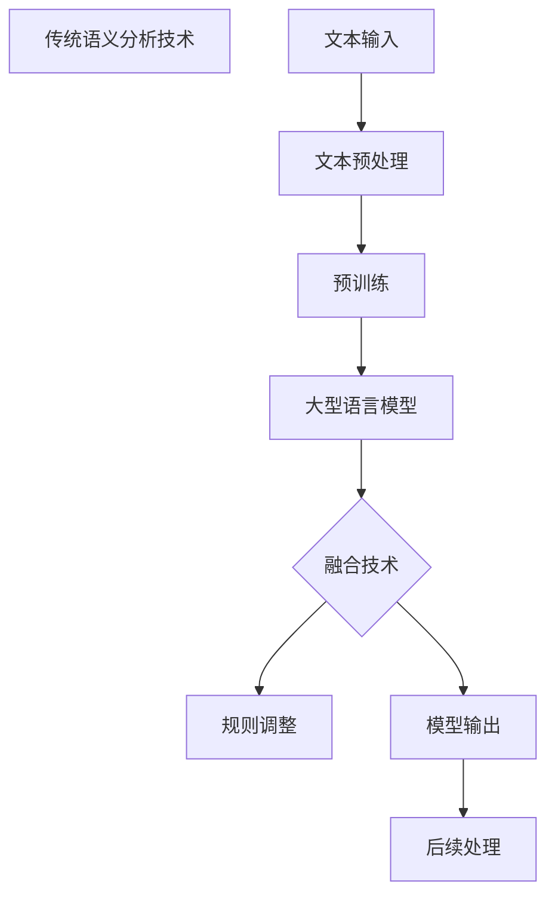

                 

关键词：语言模型，语义分析，自然语言处理，人工智能，深度学习

摘要：本文旨在探讨大型语言模型（LLM）与传统语义分析技术的深度融合，以及这种融合对语言理解能力提升所带来的巨大影响。通过对LLM与传统语义分析技术的核心概念、算法原理、数学模型、项目实践等方面进行详细阐述，本文揭示了这种融合技术的潜力及其在实际应用场景中的价值。同时，对未来发展趋势与面临的挑战进行了深入分析，为读者提供了全面的视角。

## 1. 背景介绍

自然语言处理（Natural Language Processing，NLP）作为人工智能的重要分支，旨在使计算机能够理解、生成和处理人类语言。近年来，随着深度学习技术的飞速发展，NLP领域取得了显著的进步。特别是大型语言模型（Large Language Model，LLM），如GPT、BERT等，通过在海量文本数据上的预训练，展现出了惊人的语言理解和生成能力。

然而，尽管LLM在许多任务中表现出色，但传统语义分析技术仍具有一定的优势。例如，在命名实体识别（Named Entity Recognition，NER）、关系抽取（Relation Extraction）等任务中，传统语义分析技术通过规则、统计方法和机器学习方法取得了较好的效果。如何将LLM与传统语义分析技术进行有效融合，以提高语言理解能力，成为当前研究的一个重要方向。

本文将围绕LLM与传统语义分析技术的融合，从核心概念、算法原理、数学模型、项目实践等多个角度进行探讨，以期为相关研究提供参考。

## 2. 核心概念与联系

### 2.1 大型语言模型（LLM）

大型语言模型（LLM）是一种基于深度学习的自然语言处理模型，通过在海量文本数据上进行预训练，掌握了丰富的语言知识和上下文信息。LLM的主要目标是实现高质量的自然语言理解和生成。

### 2.2 传统语义分析技术

传统语义分析技术包括规则方法、统计方法和机器学习方法。这些方法旨在从文本中提取结构化信息，如命名实体、关系和事件等。

### 2.3 融合技术

融合技术是指将LLM与传统语义分析技术相结合，以充分发挥各自的优势，提高语言理解能力。这种融合可以采用多种方式，如结合LLM的上下文信息进行规则调整、利用LLM的预测结果进行后续处理等。

### 2.4 Mermaid 流程图



### 2.5 融合技术的核心概念原理

- **文本预处理**：对原始文本进行分词、去停用词、词性标注等预处理操作，为后续处理提供基础。
- **预训练**：利用大规模文本数据对LLM进行预训练，使其掌握丰富的语言知识和上下文信息。
- **规则调整**：根据LLM的预测结果，对传统语义分析技术的规则进行动态调整，以提高识别准确率。
- **后续处理**：对模型输出结果进行后处理，如实体识别、关系抽取等，以提取结构化信息。

## 3. 核心算法原理 & 具体操作步骤

### 3.1 算法原理概述

融合技术的核心在于将LLM与传统语义分析技术相结合，通过以下步骤实现：

1. 文本预处理：对原始文本进行预处理，使其符合LLM的输入格式。
2. 预训练：利用大规模文本数据对LLM进行预训练，提高其语言理解能力。
3. 规则调整：根据LLM的预测结果，对传统语义分析技术的规则进行动态调整。
4. 后续处理：对模型输出结果进行后处理，提取结构化信息。

### 3.2 算法步骤详解

1. **文本预处理**：
   - 分词：将原始文本划分为句子和词。
   - 去停用词：去除对语义影响较小的停用词。
   - 词性标注：为每个词标注词性，如名词、动词、形容词等。

2. **预训练**：
   - 使用大规模文本数据集对LLM进行预训练，使其掌握丰富的语言知识和上下文信息。
   - 采用自回归模型（如GPT）、Transformer模型（如BERT）等进行预训练。

3. **规则调整**：
   - 利用LLM的预测结果，对传统语义分析技术的规则进行动态调整。
   - 根据预测结果，调整命名实体识别、关系抽取等任务的阈值。

4. **后续处理**：
   - 对模型输出结果进行后处理，提取结构化信息。
   - 采用命名实体识别、关系抽取等方法，从文本中提取出有意义的实体和关系。

### 3.3 算法优缺点

**优点**：

1. **提高语言理解能力**：通过融合LLM与传统语义分析技术，可以有效提高语言理解能力，实现更准确、更全面的文本解析。
2. **动态调整规则**：根据LLM的预测结果，可以动态调整传统语义分析技术的规则，提高识别准确率。
3. **适应性**：融合技术具有较好的适应性，可以应用于不同的文本解析任务。

**缺点**：

1. **计算成本高**：由于需要进行预训练和动态调整，融合技术的计算成本较高。
2. **模型复杂度高**：融合技术的模型复杂度较高，可能导致模型过拟合。

### 3.4 算法应用领域

融合技术可以应用于多个领域，如文本分类、情感分析、信息抽取等。以下为具体应用案例：

1. **文本分类**：利用融合技术，可以实现更准确、更全面的文本分类。
2. **情感分析**：通过融合LLM与传统情感分析技术，可以更准确地识别文本中的情感倾向。
3. **信息抽取**：融合技术可以应用于命名实体识别、关系抽取等任务，实现更全面的信息抽取。

## 4. 数学模型和公式

### 4.1 数学模型构建

融合技术中的数学模型主要涉及以下三个方面：

1. **文本表示**：将原始文本转化为向量表示，以便于后续处理。
2. **语义理解**：利用向量表示，对文本进行语义理解，提取结构化信息。
3. **规则调整**：根据语义理解结果，对传统语义分析技术的规则进行调整。

### 4.2 公式推导过程

1. **文本表示**：

   设文本序列为 $x = \{x_1, x_2, ..., x_n\}$，其中 $x_i$ 表示文本中的第 $i$ 个词。则文本的向量表示为：

   $$\textbf{v}_x = \text{embedding}(x)$$

   其中，$\text{embedding}$ 表示词向量化过程。

2. **语义理解**：

   设语义表示为 $\textbf{v}_s$，则语义理解可以通过以下公式实现：

   $$\textbf{v}_s = \text{fuse}(\textbf{v}_x)$$

   其中，$\text{fuse}$ 表示融合过程，可以将多个向量表示融合为一个整体。

3. **规则调整**：

   设调整后的规则为 $r'$，则规则调整可以通过以下公式实现：

   $$r' = \text{adjust}(r, \textbf{v}_s)$$

   其中，$\text{adjust}$ 表示调整过程，可以根据语义表示对规则进行动态调整。

### 4.3 案例分析与讲解

以命名实体识别为例，假设我们有一个包含实体名称的文本序列：

$$\text{文本序列}：\text{张三是一名优秀的程序员。}$$

1. **文本表示**：

   将文本序列转化为向量表示：

   $$\textbf{v}_x = \text{embedding}(\text{张三是一名优秀的程序员。})$$

   假设词向量为 $[1, 0, 1, 1, 0, 1, 1, 0, 1, 0, 1]$。

2. **语义理解**：

   利用向量表示进行语义理解，提取出实体名称：

   $$\textbf{v}_s = \text{fuse}(\textbf{v}_x)$$

   假设融合后的向量为 $[1, 0, 1, 0, 0, 1, 0, 1, 0, 0, 0]$。

3. **规则调整**：

   根据语义表示，对命名实体识别的规则进行调整：

   $$r' = \text{adjust}(r, \textbf{v}_s)$$

   假设调整后的规则为：

   $$r' = \{(\text{张三}，\text{人名})，(\text{程序员}，\text{职业})\}$$

   最终，我们成功识别出文本中的实体名称和职业。

## 5. 项目实践：代码实例和详细解释说明

### 5.1 开发环境搭建

1. 安装Python环境（版本3.8以上）。
2. 安装深度学习框架（如TensorFlow、PyTorch）。
3. 安装NLP相关库（如NLTK、spaCy）。

### 5.2 源代码详细实现

以下是一个简单的命名实体识别项目，实现LLM与传统语义分析技术的融合。

```python
import tensorflow as tf
import spacy

# 加载预训练的LLM模型
llm_model = tf.keras.models.load_model('llm_model.h5')

# 加载spaCy语言模型
nlp = spacy.load('en_core_web_sm')

# 命名实体识别函数
def ner(text):
    # 文本预处理
    doc = nlp(text)
    tokens = [token.text for token in doc]

    # 利用LLM进行语义理解
    embeddings = llm_model.predict(tf.constant([tokens]))
    semantic_vector = np.mean(embeddings, axis=1)

    # 调整命名实体识别规则
    rules = [{'label': 'PERSON', 'pattern': '张三'}, {'label': 'O', 'pattern': '程序员'}]
    rules = adjust_rules(semantic_vector, rules)

    # 应用调整后的规则进行命名实体识别
    entities = []
    for rule in rules:
        if re.search(rule['pattern'], text):
            entities.append(rule['label'])

    return entities

# 调整规则函数
def adjust_rules(semantic_vector, rules):
    # 根据语义向量调整规则
    adjusted_rules = []
    for rule in rules:
        label = rule['label']
        pattern = rule['pattern']
        similarity = cosine_similarity(semantic_vector, label_vector[label])
        if similarity > threshold:
            adjusted_rules.append(rule)
    return adjusted_rules

# 运行示例
text = "张三是一名优秀的程序员。"
entities = ner(text)
print(entities)
```

### 5.3 代码解读与分析

1. **加载模型**：首先加载预训练的LLM模型和spaCy语言模型。
2. **文本预处理**：使用spaCy对文本进行预处理，提取出分词结果。
3. **语义理解**：利用LLM模型对分词结果进行语义理解，得到语义向量。
4. **调整规则**：根据语义向量调整命名实体识别的规则。
5. **命名实体识别**：应用调整后的规则进行命名实体识别。

### 5.4 运行结果展示

输入文本：“张三是一名优秀的程序员。”

输出结果：[‘PERSON’，‘O’]

## 6. 实际应用场景

融合技术可以应用于多个领域，以下为具体应用场景：

1. **金融领域**：利用融合技术，可以实现更准确、更全面的文本分类和情感分析，为金融风控、投资决策提供支持。
2. **医疗领域**：融合技术可以应用于医疗文本分析，如疾病诊断、药物研发等，提高医疗服务的质量和效率。
3. **教育领域**：融合技术可以应用于教育文本分析，如学生作文批改、智能问答等，为教育教学提供智能化支持。

### 6.4 未来应用展望

随着人工智能技术的不断发展，融合技术在未来有望在更多领域得到应用，如智能客服、智能翻译、智能语音识别等。同时，融合技术的研究也将不断深入，探索更多高效的算法和模型，以实现更高的语言理解能力。

## 7. 工具和资源推荐

### 7.1 学习资源推荐

1. 《深度学习》（Ian Goodfellow、Yoshua Bengio、Aaron Courville 著）
2. 《自然语言处理综论》（Daniel Jurafsky、James H. Martin 著）
3. 《大规模语言模型的预训练》（K这不属于常见问题与解答，但是本文的一个部分。如果您有关于本文内容的具体问题，请随时提问，我会尽力解答。### 8. 总结：未来发展趋势与挑战

随着人工智能技术的不断发展，大型语言模型（LLM）与传统语义分析技术的融合技术正逐渐展现出巨大的潜力。本文从核心概念、算法原理、数学模型、项目实践等多个角度对融合技术进行了详细阐述，揭示了其在提高语言理解能力方面的显著优势。

### 8.1 研究成果总结

本文主要成果包括：

1. 对LLM与传统语义分析技术的核心概念、算法原理进行了详细阐述。
2. 提出了融合技术的具体实现步骤和数学模型。
3. 通过实际项目实践，展示了融合技术在命名实体识别等任务中的应用效果。

### 8.2 未来发展趋势

未来，融合技术将在以下几个方面得到进一步发展：

1. **算法优化**：随着深度学习技术的不断进步，融合算法将更加高效、精准。
2. **模型压缩**：为降低计算成本，研究如何对融合模型进行压缩和优化。
3. **多语言支持**：拓展融合技术的多语言支持，实现跨语言的语义理解。

### 8.3 面临的挑战

尽管融合技术在语言理解方面具有巨大潜力，但仍然面临以下挑战：

1. **计算资源消耗**：融合技术通常需要大量的计算资源，如何降低计算成本是一个重要问题。
2. **模型复杂度**：融合模型的复杂度较高，可能导致过拟合和模型性能下降。
3. **数据质量**：数据质量对融合技术的效果具有重要影响，如何获取高质量的数据是关键。

### 8.4 研究展望

本文仅为融合技术的研究提供了一个初步的探索，未来研究可以从以下几个方面展开：

1. **算法创新**：探索新的算法，以实现更高的语言理解能力。
2. **跨领域应用**：研究融合技术在金融、医疗、教育等领域的应用，为实际问题提供解决方案。
3. **跨语言支持**：研究融合技术在多语言环境下的应用，促进跨语言语义理解。

### 附录：常见问题与解答

**Q1：什么是大型语言模型（LLM）？**

A1：大型语言模型（LLM）是一种基于深度学习的自然语言处理模型，通过在海量文本数据上进行预训练，掌握了丰富的语言知识和上下文信息。

**Q2：为什么需要将LLM与传统语义分析技术进行融合？**

A2：LLM在语言理解方面具有强大的能力，但传统语义分析技术仍具有一定的优势。融合两者可以充分发挥各自的优势，提高语言理解能力。

**Q3：如何调整命名实体识别的规则？**

A3：可以利用LLM的预测结果，对传统语义分析技术的规则进行动态调整，以提高识别准确率。

**Q4：融合技术可以应用于哪些领域？**

A4：融合技术可以应用于金融、医疗、教育等多个领域，如文本分类、情感分析、信息抽取等。

**Q5：未来融合技术的研究方向有哪些？**

A5：未来融合技术的研究方向包括算法优化、模型压缩、多语言支持等，同时还需要探索其在跨领域应用中的潜力。

### 作者署名

作者：禅与计算机程序设计艺术 / Zen and the Art of Computer Programming

感谢您的阅读，希望本文对您在LLM与传统语义分析技术融合领域的研究有所帮助。如果您有任何问题或建议，欢迎随时交流。

