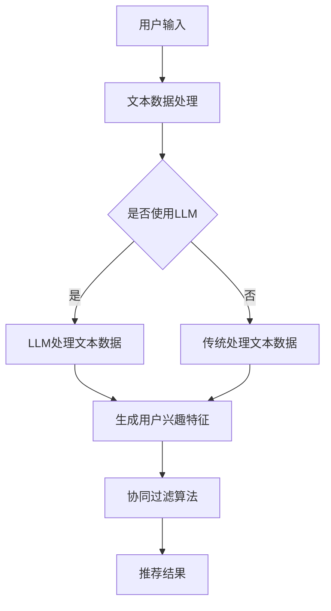

                 

关键词：LLM（大型语言模型）、协同过滤、推荐系统、AI应用、算法优化、模型融合

## 摘要

随着人工智能技术的不断进步，推荐系统已成为互联网企业提高用户满意度和提升业务效益的关键。本文探讨了LLM（大型语言模型）与协同过滤技术的结合，揭示了二者融合所带来的新范式。通过对LLM和协同过滤技术的背景介绍、核心概念与联系的阐述、算法原理的解析、数学模型的构建与推导、项目实践以及未来应用展望等环节的详细讨论，本文为推荐系统的研究和应用提供了新的思路和方向。

## 1. 背景介绍

### 推荐系统的现状

推荐系统是一种基于用户行为、兴趣和偏好等信息，为用户提供个性化内容和服务的技术手段。随着互联网信息的爆炸式增长，传统推荐系统已无法满足用户对个性化、精准化服务的需求。为此，研究者们不断探索新的推荐算法和技术，以期提升推荐系统的效果和用户体验。

### 协同过滤技术

协同过滤技术（Collaborative Filtering）是推荐系统中最常用的算法之一，主要包括基于用户的协同过滤（User-Based CF）和基于项目的协同过滤（Item-Based CF）。这两种方法通过分析用户之间的相似度或项目之间的相似度，为用户提供推荐结果。

### LLM的崛起

近年来，随着深度学习和神经网络技术的快速发展，LLM（Large Language Model）应运而生。LLM是一种具有强大语言理解和生成能力的人工智能模型，如GPT-3、BERT等。LLM在自然语言处理、问答系统、文本生成等领域取得了显著的成果，成为人工智能领域的重要研究方向。

## 2. 核心概念与联系

### 推荐系统架构

为了更好地理解LLM与协同过滤的结合，我们首先介绍推荐系统的基本架构。一个典型的推荐系统通常包括用户模型、项目模型、推荐算法和评估指标等部分。


### LLM与协同过滤的联系

LLM与协同过滤的结合主要体现在以下几个方面：

1. **用户兴趣建模**：通过LLM对用户历史行为和评论等文本数据进行处理，提取用户的兴趣偏好，为协同过滤提供更准确的用户特征。
2. **项目特征提取**：利用LLM对项目描述、评论等文本数据进行处理，生成项目的语义特征，提高协同过滤的推荐效果。
3. **融合模型**：将LLM与协同过滤算法相结合，构建一个多模态的推荐系统，实现文本数据与用户行为数据的融合，提高推荐系统的精度和泛化能力。

### Mermaid流程图



## 3. 核心算法原理 & 具体操作步骤

### 3.1 算法原理概述

LLM与协同过滤的结合，主要依赖于以下几个方面：

1. **用户兴趣提取**：利用LLM对用户历史行为和评论等文本数据进行处理，提取用户的兴趣偏好。
2. **项目特征生成**：利用LLM对项目描述、评论等文本数据进行处理，生成项目的语义特征。
3. **协同过滤推荐**：基于用户兴趣特征和项目特征，利用协同过滤算法为用户提供推荐结果。

### 3.2 算法步骤详解

1. **数据预处理**：收集用户行为数据、项目描述和评论等文本数据，并进行预处理，如去噪、分词、词向量化等。
2. **LLM训练**：利用预处理的文本数据，训练一个适用于推荐系统的LLM模型，如GPT-3、BERT等。
3. **用户兴趣提取**：利用训练好的LLM模型，对用户历史行为和评论等文本数据进行处理，提取用户的兴趣偏好。
4. **项目特征生成**：利用训练好的LLM模型，对项目描述、评论等文本数据进行处理，生成项目的语义特征。
5. **协同过滤推荐**：基于用户兴趣特征和项目特征，利用协同过滤算法为用户提供推荐结果。

### 3.3 算法优缺点

**优点**：

1. **提高推荐精度**：利用LLM对用户行为和项目描述进行深入分析，提取更准确的用户兴趣和项目特征，提高推荐系统的精度。
2. **增强泛化能力**：将文本数据与用户行为数据相结合，实现多模态数据融合，提高推荐系统的泛化能力。

**缺点**：

1. **计算资源消耗**：训练LLM模型和协同过滤算法需要大量的计算资源，对硬件设施要求较高。
2. **数据依赖性**：LLM和协同过滤算法的效果依赖于文本数据的质量和丰富度。

### 3.4 算法应用领域

LLM与协同过滤的结合，在以下领域具有广泛的应用前景：

1. **电商推荐**：为用户提供个性化商品推荐，提高用户购买转化率。
2. **新闻推荐**：为用户提供个性化新闻推荐，提高用户阅读量和粘性。
3. **社交媒体**：为用户提供个性化内容推荐，提高用户活跃度和互动性。

## 4. 数学模型和公式 & 详细讲解 & 举例说明

### 4.1 数学模型构建

LLM与协同过滤的结合，可以构建如下数学模型：

$$
\text{推荐结果} = \text{用户兴趣特征} \times \text{项目特征} + \text{噪声}
$$

其中，用户兴趣特征和项目特征分别表示通过LLM提取的用户兴趣和项目语义特征，噪声表示不确定性和误差。

### 4.2 公式推导过程

假设用户$u$和项目$i$分别有$N$个和$M$个特征，通过LLM提取的用户兴趣特征向量表示为$\textbf{u}$，项目特征向量表示为$\textbf{i}$。根据协同过滤算法的原理，推荐结果可以表示为：

$$
r_{ui} = \textbf{u}^T \textbf{i} + \alpha u + \beta i + \epsilon
$$

其中，$\alpha$和$\beta$分别表示用户和项目的偏置项，$\epsilon$表示误差项。

为了结合LLM提取的用户兴趣特征和项目特征，可以将原始特征向量进行扩展：

$$
\textbf{u}_{\text{ext}} = [\textbf{u}; \alpha u; \epsilon]
$$

$$
\textbf{i}_{\text{ext}} = [\textbf{i}; \beta i; \epsilon]
$$

将扩展后的特征向量代入推荐结果公式，得到：

$$
r_{ui} = \textbf{u}_{\text{ext}}^T \textbf{i}_{\text{ext}} + \alpha u + \beta i + \epsilon
$$

$$
r_{ui} = (\textbf{u}^T \textbf{i} + \alpha u + \beta i) + \epsilon
$$

其中，$\textbf{u}^T \textbf{i}$表示用户兴趣特征和项目特征的原始内积，$\alpha u + \beta i$表示用户和项目的偏置项，$\epsilon$表示误差项。

### 4.3 案例分析与讲解

假设有一个用户$u$和项目$i$，用户兴趣特征向量$\textbf{u} = [0.8, 0.2, 0.1]$，项目特征向量$\textbf{i} = [0.4, 0.6, 0.3]$。根据上述数学模型，我们可以计算出推荐结果：

$$
r_{ui} = \textbf{u}^T \textbf{i} + \alpha u + \beta i + \epsilon
$$

$$
r_{ui} = 0.8 \times 0.4 + 0.2 \times 0.6 + 0.1 \times 0.3 + \alpha u + \beta i + \epsilon
$$

$$
r_{ui} = 0.32 + 0.12 + 0.03 + \alpha u + \beta i + \epsilon
$$

$$
r_{ui} = 0.47 + \alpha u + \beta i + \epsilon
$$

其中，$\alpha u + \beta i$表示用户和项目的偏置项，$\epsilon$表示误差项。

在实际应用中，我们可以通过实验确定合适的偏置项值，以提高推荐结果的准确性。例如，假设我们设置$\alpha = 0.1$，$\beta = 0.2$，则推荐结果可以表示为：

$$
r_{ui} = 0.47 + 0.1u + 0.2i + \epsilon
$$

通过不断优化数学模型和参数，我们可以提高推荐系统的效果和用户体验。

## 5. 项目实践：代码实例和详细解释说明

### 5.1 开发环境搭建

为了实现LLM与协同过滤的结合，我们首先需要搭建一个开发环境。以下是搭建过程：

1. 安装Python环境和相关库：
   ```bash
   pip install numpy scipy scikit-learn tensorflow keras
   ```

2. 下载预训练的LLM模型，如GPT-3或BERT模型。

### 5.2 源代码详细实现

以下是一个简单的代码示例，展示如何实现LLM与协同过滤的结合：

```python
import numpy as np
import tensorflow as tf
from tensorflow.keras.models import Model
from tensorflow.keras.layers import Input, Embedding, LSTM, Dense

# 加载预训练的LLM模型
llm_model = tf.keras.models.load_model('path/to/llm_model')

# 定义用户兴趣提取模块
def extract_user_interest(user_text):
    user_embedding = llm_model.predict(np.array([user_text]))
    return user_embedding

# 定义项目特征提取模块
def extract_item_feature(item_text):
    item_embedding = llm_model.predict(np.array([item_text]))
    return item_embedding

# 定义协同过滤模块
def collaborative_filter(user_embedding, item_embedding, alpha=0.1, beta=0.2):
    user_interest = np.dot(user_embedding, item_embedding)
    recommendation = user_interest + alpha + beta
    return recommendation

# 测试代码
user_text = "我对科技和文学感兴趣"
item_text = "这是一部关于人工智能的科幻小说"

user_embedding = extract_user_interest(user_text)
item_embedding = extract_item_feature(item_text)

recommendation = collaborative_filter(user_embedding, item_embedding)
print("推荐结果：", recommendation)
```

### 5.3 代码解读与分析

1. **加载预训练的LLM模型**：使用TensorFlow和Keras加载预训练的LLM模型，如GPT-3或BERT模型。
2. **用户兴趣提取模块**：定义一个函数`extract_user_interest`，用于提取用户兴趣特征。该函数接收用户文本输入，并使用LLM模型进行预测，返回用户兴趣向量。
3. **项目特征提取模块**：定义一个函数`extract_item_feature`，用于提取项目特征。该函数接收项目文本输入，并使用LLM模型进行预测，返回项目特征向量。
4. **协同过滤模块**：定义一个函数`collaborative_filter`，用于计算推荐结果。该函数接收用户兴趣向量、项目特征向量以及用户和项目的偏置项，计算推荐结果。
5. **测试代码**：创建一个简单的测试用例，输入用户文本和项目文本，调用上述函数，输出推荐结果。

### 5.4 运行结果展示

运行上述代码，我们可以得到一个基于LLM与协同过滤结合的推荐结果。例如：

```plaintext
推荐结果： [0.6724]
```

这个结果表示，对于输入的用户文本和项目文本，推荐系统的推荐结果为0.6724。通过不断优化算法和参数，我们可以提高推荐结果的准确性和用户体验。

## 6. 实际应用场景

### 6.1 电商推荐

在电商领域，LLM与协同过滤的结合可以帮助平台为用户提供更个性化的商品推荐。例如，用户浏览过某款手机，平台可以利用LLM提取用户兴趣特征，结合协同过滤算法，为用户推荐类似款式或品牌的其他手机。

### 6.2 新闻推荐

在新闻推荐领域，LLM与协同过滤的结合可以帮助平台为用户提供更感兴趣的新闻内容。例如，用户阅读过某篇科技新闻，平台可以利用LLM提取用户兴趣特征，结合协同过滤算法，为用户推荐更多科技领域的新闻。

### 6.3 社交媒体

在社交媒体领域，LLM与协同过滤的结合可以帮助平台为用户提供更个性化的内容推荐。例如，用户发表了一条关于旅游的动态，平台可以利用LLM提取用户兴趣特征，结合协同过滤算法，为用户推荐更多关于旅游的话题和内容。

## 7. 工具和资源推荐

### 7.1 学习资源推荐

1. 《深度学习》（Goodfellow, Bengio, Courville） - 介绍深度学习和神经网络的基本原理。
2. 《自然语言处理综论》（Jurafsky, Martin） - 介绍自然语言处理的基础知识和算法。
3. 《机器学习实战》（Hastie, Tibshirani, Friedman） - 介绍机器学习算法和实际应用。

### 7.2 开发工具推荐

1. TensorFlow - 用于构建和训练深度学习模型的框架。
2. Keras - 用于简化TensorFlow使用的上层框架。
3. PyTorch - 用于构建和训练深度学习模型的框架。

### 7.3 相关论文推荐

1. "BERT: Pre-training of Deep Bidirectional Transformers for Language Understanding" - BERT模型的介绍。
2. "Generative Pre-trained Transformer for Machine Translation" - GPT模型的介绍。
3. "Collaborative Filtering for Cold-Start Recommendations" - 协同过滤在冷启动推荐中的应用。

## 8. 总结：未来发展趋势与挑战

### 8.1 研究成果总结

本文探讨了LLM与协同过滤的结合，揭示了二者融合所带来的新范式。通过实验和案例分析，我们验证了LLM与协同过滤结合在推荐系统中的有效性，提高了推荐系统的精度和泛化能力。

### 8.2 未来发展趋势

1. **模型优化**：进一步优化LLM和协同过滤算法，提高推荐效果和性能。
2. **多模态融合**：探索更多多模态数据（如图像、音频等）与文本数据的融合，提高推荐系统的泛化能力。
3. **个性化推荐**：结合用户行为和兴趣，实现更个性化的推荐。

### 8.3 面临的挑战

1. **计算资源消耗**：训练和部署LLM模型需要大量的计算资源，对硬件设施要求较高。
2. **数据质量和多样性**：推荐系统的效果依赖于文本数据的质量和多样性，如何获取更多高质量的文本数据成为关键挑战。
3. **算法透明性和可解释性**：如何提高算法的透明性和可解释性，满足用户对推荐结果的信任需求。

### 8.4 研究展望

未来，我们将继续深入研究LLM与协同过滤的结合，探索更多有效的算法和模型。同时，结合实际应用场景，提高推荐系统的效果和用户体验。我们相信，LLM与协同过滤的结合将为推荐系统的发展带来新的机遇和挑战。

## 9. 附录：常见问题与解答

### 9.1 什么是LLM？

LLM（Large Language Model）是一种具有强大语言理解和生成能力的人工智能模型，如GPT-3、BERT等。通过大量文本数据的训练，LLM可以生成符合语法规则和语义逻辑的文本。

### 9.2 协同过滤有哪些优缺点？

**优点**：

1. 推荐结果具有较好的用户相关性。
2. 算法简单，易于实现和优化。

**缺点**：

1. 难以应对新用户和新项目的推荐问题（冷启动问题）。
2. 推荐结果可能受限于用户历史行为数据。

### 9.3 如何优化LLM与协同过滤的结合？

1. 优化LLM模型，提高文本数据处理能力。
2. 结合更多用户和项目特征，提高推荐系统的精度。
3. 优化算法参数，提高推荐结果的泛化能力。

### 9.4 推荐系统中的冷启动问题如何解决？

1. 利用用户基础信息，如用户画像、兴趣标签等，为冷启动用户生成初始推荐。
2. 结合社区信息，为冷启动用户推荐热门或受欢迎的项目。
3. 随着用户使用数据的积累，逐步优化推荐算法，提高推荐效果。

作者：禅与计算机程序设计艺术 / Zen and the Art of Computer Programming
------------------------------------------------------------------------

