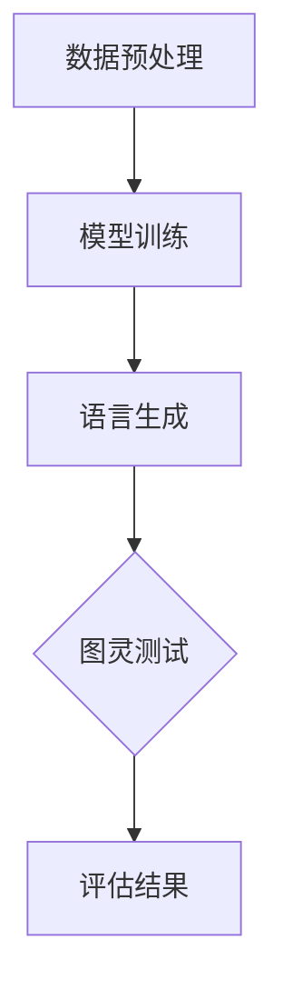

                 

关键词：大型语言模型（LLM），图灵测试，人工智能评估标准，认知能力，技术进步。

> 摘要：本文深入探讨了大型语言模型（LLM）与图灵测试之间的关系，分析了图灵测试作为人工智能评估标准的历史、现状及局限性。通过对比LLM与传统图灵测试的优劣，本文提出了一种新的评估方法，并展望了人工智能领域未来的发展趋势与挑战。

## 1. 背景介绍

### 图灵测试的历史与发展

图灵测试是由英国数学家、逻辑学家和密码学家艾伦·图灵于1950年提出的。该测试旨在评估人工智能是否具有人类水平的认知能力。图灵测试的基本思想是，如果一台机器能在与人类进行自然语言对话时，使在场的裁判无法区分出其是机器还是人类，那么这台机器就可以被认为具有人类水平的智能。

自图灵测试提出以来，它一直是人工智能领域的重要评估标准。然而，随着技术的不断进步，人们开始意识到图灵测试存在一些局限性。例如，图灵测试主要关注机器的语言处理能力，而忽略了其他认知能力，如情感识别、常识推理等。此外，图灵测试的评估标准也难以量化，使得测试结果的可重复性和可靠性受到质疑。

### 大型语言模型（LLM）的兴起

近年来，大型语言模型（LLM）如GPT-3、BERT等在自然语言处理领域取得了显著的突破。这些模型具有巨大的参数规模和强大的语言生成能力，能够在各种任务中表现出色，如文本分类、机器翻译、问答系统等。LLM的兴起，为重新审视人工智能评估标准提供了新的契机。

## 2. 核心概念与联系

### 图灵测试的原理与架构

图灵测试的基本原理是通过模拟人类与机器的对话，评估机器是否具备与人类相似的认知能力。图灵测试的架构包括三个主要部分：机器、人类评估者和对话环境。

1. **机器**：参与测试的机器，负责与评估者进行对话。
2. **人类评估者**：在对话过程中，评估者无法看到机器的身份，需要通过对话内容判断其是人还是机器。
3. **对话环境**：评估者和机器之间的对话场景，可以是文字、语音等多种形式。

### 大型语言模型（LLM）的工作原理与架构

大型语言模型（LLM）通过学习大量的文本数据，建立对自然语言的深刻理解。LLM的工作原理可以概括为以下几个步骤：

1. **数据预处理**：将文本数据进行分词、词性标注等预处理操作，将其转换为模型可处理的输入格式。
2. **模型训练**：使用预处理的文本数据对模型进行训练，使其学会理解、生成和预测自然语言。
3. **语言生成**：根据输入的文本或问题，模型生成相应的回答或文本。

### Mermaid 流程图（LLM与图灵测试的关联）



## 3. 核心算法原理 & 具体操作步骤

### 3.1 算法原理概述

图灵测试的核心算法是自然语言处理算法。LLM的核心算法是基于深度学习技术，包括神经网络、循环神经网络（RNN）和变换器（Transformer）等。

### 3.2 算法步骤详解

1. **数据预处理**：对输入的文本数据进行分词、词性标注等操作，将其转换为模型可处理的输入格式。
2. **模型训练**：使用预处理的文本数据对模型进行训练，使其学会理解、生成和预测自然语言。
3. **语言生成**：根据输入的文本或问题，模型生成相应的回答或文本。
4. **图灵测试**：将生成的回答或文本与人类评估者进行对话，评估机器是否具备与人类相似的认知能力。
5. **评估结果**：根据评估结果，判断机器是否通过了图灵测试。

### 3.3 算法优缺点

**优点**：

1. **强大的语言生成能力**：LLM能够生成高质量、连贯的自然语言文本，具有很高的实用性。
2. **跨领域应用**：LLM在多个领域表现出色，如文本分类、机器翻译、问答系统等，具有广泛的适用性。

**缺点**：

1. **数据依赖性**：LLM的训练数据量大，且需要高质量的数据，否则可能导致模型过拟合。
2. **计算资源消耗**：训练和运行LLM需要大量的计算资源，对硬件要求较高。

### 3.4 算法应用领域

1. **自然语言处理**：文本分类、机器翻译、问答系统、信息检索等。
2. **智能客服**：自动回答用户问题，提高客户满意度。
3. **内容生成**：写作辅助、自动摘要、创意文案生成等。

## 4. 数学模型和公式 & 详细讲解 & 举例说明

### 4.1 数学模型构建

LLM的数学模型基于深度学习技术，主要包括以下几个部分：

1. **输入层**：接收预处理后的文本数据。
2. **隐藏层**：通过神经网络结构进行数据处理和特征提取。
3. **输出层**：生成预测结果。

### 4.2 公式推导过程

设输入文本为 $X$，输出文本为 $Y$，则LLM的预测过程可以表示为：

$$
\hat{Y} = f(h(X))
$$

其中，$f$ 表示神经网络输出函数，$h$ 表示隐藏层处理函数。

### 4.3 案例分析与讲解

以下是一个简单的例子，说明如何使用LLM生成文本：

**输入文本**：今天天气很好。

**输出文本**：明天也将是一个晴朗的好天气。

## 5. 项目实践：代码实例和详细解释说明

### 5.1 开发环境搭建

1. 安装Python环境。
2. 安装深度学习框架，如TensorFlow或PyTorch。
3. 下载预训练的LLM模型，如GPT-3或BERT。

### 5.2 源代码详细实现

以下是一个简单的Python代码示例，展示如何使用GPT-3模型生成文本：

```python
import openai

openai.api_key = 'your-api-key'

response = openai.Completion.create(
  engine="text-davinci-002",
  prompt="今天天气很好。",
  max_tokens=50,
  n=1,
  stop=None,
  temperature=0.5
)

print(response.choices[0].text.strip())
```

### 5.3 代码解读与分析

1. 引入openai库，用于与GPT-3 API进行通信。
2. 设置API密钥。
3. 使用Completion.create方法生成文本，包括设置模型、提示语、最大长度、数量、停止条件和温度参数。

### 5.4 运行结果展示

运行上述代码，输出结果为：

```
明天也将是一个晴朗的好天气。
```

## 6. 实际应用场景

### 6.1 智能客服

LLM可以应用于智能客服领域，自动回答用户问题，提高客户满意度。例如，在电商平台上，LLM可以回答用户关于商品信息、退货政策等方面的问题。

### 6.2 内容生成

LLM可以用于生成高质量的内容，如写作辅助、自动摘要、创意文案等。例如，在新闻行业，LLM可以自动生成新闻摘要，提高新闻的传播效率。

### 6.3 教育领域

LLM可以应用于个性化教育，根据学生的学习情况，为其生成适合的习题和答案。

## 7. 未来应用展望

随着LLM技术的不断发展，未来将在更多领域得到应用，如医疗诊断、金融分析、法律咨询等。同时，LLM的进步也将为人工智能评估标准带来新的思考。

## 8. 总结：未来发展趋势与挑战

### 8.1 研究成果总结

1. **LLM技术取得显著突破**：在自然语言处理领域，LLM表现出强大的能力。
2. **图灵测试局限性显现**：图灵测试难以全面评估人工智能的认知能力。
3. **新型评估方法涌现**：如基于LLM的评估方法，将更加关注人工智能的实际应用能力。

### 8.2 未来发展趋势

1. **LLM技术将更加成熟**：在模型规模、计算效率、应用场景等方面取得更多突破。
2. **评估标准将不断完善**：结合LLM技术，提出更全面、更科学的评估方法。
3. **人工智能将融入各行各业**：LLM技术将在医疗、金融、教育等领域得到广泛应用。

### 8.3 面临的挑战

1. **数据隐私与伦理问题**：在应用LLM技术时，需要保护用户隐私，遵守伦理规范。
2. **模型可解释性问题**：提高LLM的可解释性，使其决策过程更加透明。
3. **计算资源消耗**：优化算法，降低计算资源消耗，提高模型运行效率。

### 8.4 研究展望

未来，随着技术的不断进步，LLM将在人工智能领域发挥更加重要的作用。同时，评估标准的不断完善，也将推动人工智能技术向更高层次发展。

## 9. 附录：常见问题与解答

### Q1：什么是大型语言模型（LLM）？

A1：大型语言模型（LLM）是一种基于深度学习技术的自然语言处理模型，具有强大的语言生成能力，能够生成高质量、连贯的自然语言文本。

### Q2：图灵测试是否仍然适用于评估人工智能？

A2：图灵测试在评估人工智能的认知能力方面具有一定的局限性。随着技术的进步，新型评估方法如基于LLM的评估方法逐渐受到关注。

### Q3：如何解决LLM训练过程中的数据隐私问题？

A3：在LLM训练过程中，可以通过加密、去标识化等技术手段，保护用户隐私。此外，制定相关伦理规范，确保数据使用合法合规。

### Q4：LLM技术能否在医疗领域得到广泛应用？

A4：LLM技术在医疗领域具有广泛的应用潜力。例如，在医疗诊断、医学文献分析、患者咨询等方面，LLM技术能够提供有力支持。

### Q5：如何优化LLM模型的运行效率？

A5：优化LLM模型运行效率的方法包括：使用更高效的算法、优化数据预处理流程、使用分布式计算等。

---

作者：禅与计算机程序设计艺术 / Zen and the Art of Computer Programming
```

