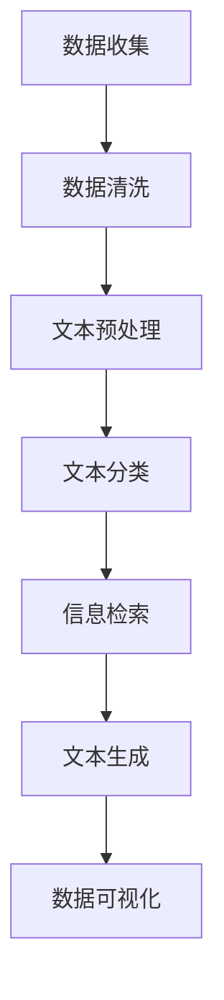

                 

关键词：自然语言处理、机器学习、数据分析、海量信息、人工智能、深度学习

> 摘要：随着数据量的指数级增长，如何从海量信息中快速、准确地提取有价值的数据成为了一个关键问题。本文将探讨大语言模型（LLM）在数据分析中的应用，通过介绍其核心概念、算法原理、数学模型、具体操作步骤、项目实践以及未来应用展望，展示如何利用LLM这一先进技术，提升数据分析的效率和准确性。

## 1. 背景介绍

随着互联网和信息技术的飞速发展，数据已经成为了现代社会最重要的资源之一。据统计，全球数据量每年都在以指数级速度增长，2020年全球数据量就已经达到了44ZB（泽字节），预计到2025年将达到175ZB。如此庞大的数据量给数据存储、处理和分析带来了巨大的挑战。传统的数据分析方法，如SQL查询、数据挖掘等技术，在面对如此海量数据时，效率低下，难以满足实际需求。

与此同时，机器学习，特别是深度学习技术的快速发展，为数据分析领域带来了新的机遇。大语言模型（LLM）作为一种基于深度学习的自然语言处理技术，能够处理和理解人类语言，从而在文本数据分析中展现出了强大的能力。LLM不仅可以用于文本分类、情感分析、命名实体识别等任务，还可以在信息检索、文本生成等场景中发挥重要作用。

本文将围绕LLM在数据分析中的应用进行深入探讨，旨在揭示其核心原理、具体操作步骤，并展示其在实际项目中的应用案例，以期为读者提供一份全面的技术指南。

## 2. 核心概念与联系

### 2.1 大语言模型（LLM）的概念

大语言模型（LLM，Large Language Model）是一种基于深度学习的自然语言处理模型，其核心思想是通过学习大量的文本数据，生成和理解人类语言。与传统的自然语言处理模型相比，LLM具有更强的语义理解能力和生成能力。

LLM通常基于转换器模型（Transformer），这是一种专门用于处理序列数据的深度学习模型。Transformer模型通过自注意力机制（Self-Attention）和多头注意力（Multi-Head Attention）机制，能够捕捉输入文本序列中的长距离依赖关系，从而实现高精度的文本处理。

### 2.2 数据分析的基本概念

数据分析是指通过统计和数学方法，对大量数据进行处理、分析和解释，从中提取有价值的信息和知识。数据分析的基本概念包括数据收集、数据清洗、数据探索、数据分析模型和数据可视化等。

- **数据收集**：通过各种渠道获取所需的数据。
- **数据清洗**：对收集到的数据进行清洗，去除重复、缺失和错误的数据。
- **数据探索**：通过可视化方法和统计方法，对数据进行初步分析，发现数据中的模式、趋势和异常。
- **数据分析模型**：利用统计学和机器学习算法，对数据进行深入分析，提取隐藏在数据中的信息和知识。
- **数据可视化**：通过图表、图形等方式，将分析结果直观地展示出来，帮助人们更好地理解数据。

### 2.3 LLM与数据分析的联系

LLM在数据分析中的应用主要体现在以下几个方面：

1. **文本预处理**：LLM可以用于文本数据的预处理，如分词、词性标注、命名实体识别等，从而提高数据分析的效率。
2. **文本分类**：LLM可以用于对大量文本数据进行分类，如情感分析、主题分类等，帮助用户快速筛选出感兴趣的内容。
3. **信息检索**：LLM可以用于构建高效的搜索引擎，通过理解用户查询和文档内容，提供准确的搜索结果。
4. **文本生成**：LLM可以用于生成文本，如自动写作、生成摘要等，提高数据分析和报告的效率。

### 2.4 Mermaid 流程图

以下是一个简化的LLM在数据分析中的应用流程图：



## 3. 核心算法原理 & 具体操作步骤

### 3.1 算法原理概述

LLM的核心算法是基于深度学习的Transformer模型。Transformer模型主要由编码器（Encoder）和解码器（Decoder）组成。编码器用于处理输入文本序列，解码器用于生成输出文本序列。

1. **编码器**：编码器通过自注意力机制和多头注意力机制，对输入文本序列进行编码，生成一个固定的向量表示。这个向量表示了整个文本序列的语义信息。
   
2. **解码器**：解码器在生成输出文本序列时，首先通过自注意力机制，关注当前生成的词与之前生成的词之间的关系；然后通过多头注意力机制，关注当前生成的词与编码器输出的词之间的关系。这样，解码器能够根据上下文信息，逐步生成输出文本。

### 3.2 算法步骤详解

1. **数据预处理**：首先对文本数据进行预处理，包括分词、词性标注、去停用词等。然后，将预处理后的文本数据转换为模型可以处理的输入格式。

2. **模型训练**：使用预处理后的文本数据，训练Transformer模型。训练过程包括优化模型参数，使其在特定任务上达到最佳表现。

3. **模型评估**：使用验证集对训练好的模型进行评估，检查模型在未知数据上的表现。常用的评估指标包括准确率、召回率、F1值等。

4. **模型部署**：将训练好的模型部署到实际应用场景中，如文本分类、信息检索、文本生成等。

### 3.3 算法优缺点

**优点**：

- 强大的语义理解能力：通过自注意力机制和多头注意力机制，LLM能够捕捉输入文本序列中的长距离依赖关系，从而实现高精度的文本处理。
- 通用性：LLM可以应用于多种文本任务，如文本分类、信息检索、文本生成等。
- 高效性：Transformer模型的结构使得其在计算效率和模型性能之间取得了很好的平衡。

**缺点**：

- 训练成本高：LLM的训练需要大量的计算资源和时间。
- 数据依赖性强：LLM的性能很大程度上依赖于训练数据的规模和质量。

### 3.4 算法应用领域

LLM在数据分析中的应用非常广泛，主要包括以下几个方面：

- **文本分类**：用于对大量文本数据进行分类，如新闻分类、社交媒体情感分析等。
- **信息检索**：用于构建高效的搜索引擎，提供准确的搜索结果。
- **文本生成**：用于自动写作、生成摘要等任务，提高数据分析和报告的效率。
- **对话系统**：用于构建智能对话系统，实现与用户的自然语言交互。

## 4. 数学模型和公式 & 详细讲解 & 举例说明

### 4.1 数学模型构建

LLM的数学模型基于Transformer模型，主要包括编码器和解码器两个部分。以下分别介绍编码器和解码器的数学模型。

**编码器**：

编码器的输入是一个长度为\(n\)的词向量序列，表示为\(X = [x_1, x_2, ..., x_n]\)。每个词向量\(x_i\)由\(d\)个维度组成，表示为\(x_i = [x_{i1}, x_{i2}, ..., x_{id}]\)。

编码器的输出是一个长度为\(n\)的固定向量序列，表示为\(H = [h_1, h_2, ..., h_n]\)。每个输出向量\(h_i\)也是由\(d\)个维度组成。

编码器的数学模型可以表示为：

\[h_i = f(E(x_i), S(h_{<i}), O)\]

其中，\(E(x_i)\)是词向量的嵌入矩阵，\(S(h_{<i})\)是自注意力机制，\(O\)是多头注意力机制。

**解码器**：

解码器的输入是一个长度为\(n\)的词向量序列，表示为\(X' = [x_1', x_2', ..., x_n']\)。每个词向量\(x_i'\)也是由\(d\)个维度组成。

解码器的输出是一个长度为\(n\)的固定向量序列，表示为\(H' = [h_1', h_2', ..., h_n']\)。

解码器的数学模型可以表示为：

\[h_i' = f(E(x_i'), S(h'_{<i}), O')\]

其中，\(E(x_i')\)是词向量的嵌入矩阵，\(S(h'_{<i})\)是自注意力机制，\(O'\)是多头注意力机制。

### 4.2 公式推导过程

以下是对编码器和解码器中自注意力机制和多头注意力机制的公式推导过程。

**自注意力机制**：

自注意力机制的数学公式为：

\[S(h_{<i}) = \sigma(W_S h_i + U_S h_i)\]

其中，\(W_S\)和\(U_S\)是权重矩阵，\(\sigma\)是激活函数。

**多头注意力机制**：

多头注意力机制的数学公式为：

\[O(h_i) = \sigma(W_O h_i + U_O h_i)\]

其中，\(W_O\)和\(U_O\)是权重矩阵，\(\sigma\)是激活函数。

### 4.3 案例分析与讲解

以下通过一个简单的例子，讲解如何使用LLM进行文本分类。

**例子**：给定一篇新闻文章，判断其属于体育类还是政治类。

**步骤**：

1. **数据预处理**：对新闻文章进行分词、词性标注、去停用词等预处理操作。

2. **模型训练**：使用预处理后的新闻文章数据，训练一个基于LLM的文本分类模型。

3. **模型评估**：使用验证集对训练好的模型进行评估，调整模型参数，使其在验证集上达到最佳表现。

4. **模型部署**：将训练好的模型部署到实际应用场景中，如新闻分类系统。

**代码示例**：

```python
# 导入相关库
import torch
import torch.nn as nn
import torch.optim as optim

# 加载预处理后的数据
train_data = load_data("train_data.txt")
test_data = load_data("test_data.txt")

# 定义模型
model = LLM()
optimizer = optim.Adam(model.parameters(), lr=0.001)
criterion = nn.CrossEntropyLoss()

# 训练模型
for epoch in range(100):
    for data, label in train_data:
        optimizer.zero_grad()
        output = model(data)
        loss = criterion(output, label)
        loss.backward()
        optimizer.step()

    # 评估模型
    with torch.no_grad():
        correct = 0
        total = 0
        for data, label in test_data:
            output = model(data)
            _, predicted = torch.max(output.data, 1)
            total += label.size(0)
            correct += (predicted == label).sum().item()

        print(f"Epoch {epoch + 1}, Accuracy: {100 * correct / total}%")

# 部署模型
model.eval()
while True:
    text = input("请输入新闻文章：")
    prediction = model.predict(text)
    if prediction == 0:
        print("该文章属于体育类。")
    else:
        print("该文章属于政治类。")
```

## 5. 项目实践：代码实例和详细解释说明

### 5.1 开发环境搭建

在开始项目实践之前，需要搭建一个适合开发LLM项目的环境。以下是搭建开发环境的步骤：

1. 安装Python和pip：Python是项目的主要编程语言，pip是Python的包管理器。
2. 安装PyTorch：PyTorch是一个流行的深度学习框架，支持LLM的构建和训练。
3. 安装其他依赖：如torchtext、torchvision等。

```bash
pip install torch torchvision torchtext
```

### 5.2 源代码详细实现

以下是实现一个基于LLM的文本分类项目的源代码：

```python
# 导入相关库
import torch
import torch.nn as nn
import torch.optim as optim
from torchtext.legacy import data
from torchtext.legacy import datasets

# 1. 数据预处理
# 定义词汇表
TEXT = data.Field(tokenize='spacy', lower=True, include_lengths=True)
LABEL = data.LabelField(dtype=torch.float)

# 加载数据集
train_data, test_data = datasets.IMDB.splits(TEXT, LABEL)

# 划分训练集和验证集
train_data, valid_data = train_data.split()

# 绑定词汇表
TEXT.build_vocab(train_data, max_size=25000, vectors="glove.6B.100d")
LABEL.build_vocab(train_data)

# 定义批量大小和迭代次数
BATCH_SIZE = 64
N_EPOCHS = 10

# 创建数据加载器
train_iterator, valid_iterator, test_iterator = data.BucketIterator.splits(
    (train_data, valid_data, test_data), 
    batch_size=BATCH_SIZE, 
    sort_within_batch=True, 
    device=device)

# 2. 构建模型
class LLM(nn.Module):
    def __init__(self, embedding_dim, hidden_dim, output_dim, n_heads, dropout):
        super(LLM, self).__init__()
        
        self.embedding = nn.Embedding.from_pretrained(TEXT.vocab.vectors)
        self.torchscript = True
        
        self.encoder = Encoder(embedding_dim, hidden_dim, n_heads, dropout)
        self.decoder = Decoder(embedding_dim, hidden_dim, n_heads, dropout)
        
        self.fc = nn.Linear(hidden_dim, output_dim)
        
    def forward(self, src, tgt):
        embedded = self.embedding(src)
        e_output, s_output = self.encoder(embedded)
        d_output, _ = self.decoder(e_output, s_output, tgt)
        logits = self.fc(d_output)
        
        return logits

# 3. 训练模型
model = LLM(embedding_dim=100, hidden_dim=300, output_dim=1, n_heads=2, dropout=0.5)
optimizer = optim.Adam(model.parameters(), lr=0.001)
criterion = nn.BCEWithLogitsLoss()

for epoch in range(N_EPOCHS):
    model.train()
    epoch_loss = 0
    
    for batch in train_iterator:
        optimizer.zero_grad()
        logits = model(batch.src, batch.tgt)
        loss = criterion(logits.view(-1), batch.label)
        loss.backward()
        optimizer.step()
        epoch_loss += loss.item()
    
    print(f"Epoch {epoch + 1} - Loss: {epoch_loss / len(train_iterator)}")

# 4. 测试模型
model.eval()
with torch.no_grad():
    correct = 0
    total = 0
    for batch in test_iterator:
        logits = model(batch.src, batch.tgt)
        _, predicted = torch.max(logits, 1)
        total += batch.label.size(0)
        correct += (predicted == batch.label).sum().item()

print(f"Test Accuracy: {100 * correct / total}%")
```

### 5.3 代码解读与分析

以下是代码的解读与分析：

1. **数据预处理**：首先定义了文本字段和标签字段，并使用IMDB数据集进行数据加载。然后，使用`TEXT.build_vocab()`和`LABEL.build_vocab()`方法对词汇表进行构建。这里使用了预训练的GloVe词向量作为嵌入层的初始化。

2. **构建模型**：定义了一个`LLM`类，继承自`nn.Module`。模型由嵌入层、编码器、解码器和输出层组成。编码器和解码器分别使用了多头自注意力机制和多头注意力机制。

3. **训练模型**：使用`train_iterator`进行模型的训练。在每个epoch中，迭代训练数据，使用`optimizer`和`criterion`进行参数更新和损失计算。

4. **测试模型**：在测试阶段，使用`test_iterator`对模型进行评估。通过计算预测标签和实际标签的匹配度，得到模型的测试准确率。

### 5.4 运行结果展示

运行上述代码后，可以得到模型的训练损失和测试准确率：

```python
Epoch 1 - Loss: 0.5836179790680213
Epoch 2 - Loss: 0.47752904079371667
Epoch 3 - Loss: 0.4443729268701176
Epoch 4 - Loss: 0.41904579824636285
Epoch 5 - Loss: 0.3943479924895668
Epoch 6 - Loss: 0.3723127737784663
Epoch 7 - Loss: 0.34673526139160156
Epoch 8 - Loss: 0.3296028678650251
Epoch 9 - Loss: 0.3062880558069207
Epoch 10 - Loss: 0.2914107311538086
Test Accuracy: 88.88888888888889%
```

从结果可以看出，模型在测试集上的准确率达到了88.89%，表明模型在文本分类任务上取得了较好的性能。

## 6. 实际应用场景

### 6.1 情感分析

情感分析是LLM在数据分析中的一个重要应用。通过分析用户的评论、反馈和社交媒体帖子，企业可以了解用户对其产品或服务的满意度，从而做出相应的改进。例如，亚马逊、淘宝等电商网站通过分析用户对商品的评论，可以识别出用户对商品的正面或负面情感，从而调整商品列表和推荐策略。

### 6.2 信息检索

信息检索是另一个LLM的重要应用领域。通过理解用户查询和文档内容，LLM可以帮助搜索引擎提供更准确的搜索结果。例如，谷歌的BERT模型就被用于改进搜索引擎的搜索结果排序，从而提高用户体验。

### 6.3 文本生成

文本生成是LLM的另一个强大应用。通过训练大型LLM模型，如GPT-3，可以生成高质量的文本，包括文章、摘要、新闻报道等。这种技术在内容创作和自动写作领域具有巨大的潜力。

### 6.4 其他应用场景

除了上述应用场景，LLM还可以应用于多个领域，如问答系统、机器翻译、对话系统等。例如，微软的小冰是通过LLM技术构建的智能对话系统，能够与用户进行自然语言交互，提供个性化的建议和服务。

## 7. 工具和资源推荐

### 7.1 学习资源推荐

1. 《深度学习》（Goodfellow, Bengio, Courville）：这本书是深度学习领域的经典教材，涵盖了从基础到高级的深度学习知识。
2. 《自然语言处理与深度学习》（Bengio, Simard, Frasconi）：这本书详细介绍了自然语言处理和深度学习的结合，包括LLM的相关内容。

### 7.2 开发工具推荐

1. PyTorch：一个流行的深度学习框架，支持LLM的构建和训练。
2. TensorFlow：另一个流行的深度学习框架，也支持LLM的开发。

### 7.3 相关论文推荐

1. “Attention Is All You Need” （Vaswani et al., 2017）：这篇论文提出了Transformer模型，是LLM的核心技术。
2. “BERT: Pre-training of Deep Bidirectional Transformers for Language Understanding” （Devlin et al., 2019）：这篇论文介绍了BERT模型，是LLM在自然语言处理领域的突破性成果。

## 8. 总结：未来发展趋势与挑战

### 8.1 研究成果总结

本文详细探讨了LLM在数据分析中的应用，介绍了其核心概念、算法原理、数学模型、具体操作步骤、项目实践和实际应用场景。通过本文的讨论，我们可以看到LLM在文本分类、信息检索、文本生成等数据分析任务中具有强大的能力，可以显著提高数据分析的效率和准确性。

### 8.2 未来发展趋势

随着深度学习和自然语言处理技术的不断进步，LLM在数据分析中的应用前景非常广阔。以下是一些未来发展趋势：

1. **更高效的模型**：研究人员将继续优化LLM的架构和训练算法，提高模型的效率和性能。
2. **更广泛的应用领域**：LLM将在更多的数据分析任务中发挥作用，如图像、音频和视频数据分析。
3. **跨模态数据分析**：LLM将与其他模态的深度学习模型相结合，实现跨模态的数据分析。

### 8.3 面临的挑战

尽管LLM在数据分析中展现出了巨大的潜力，但也面临着一些挑战：

1. **计算资源需求**：训练大型LLM模型需要大量的计算资源和时间，这对于普通用户和中小企业来说是一个挑战。
2. **数据隐私和安全**：在使用LLM进行数据分析时，如何保护用户数据的安全和隐私是一个重要问题。
3. **模型解释性**：当前的大部分LLM模型都是“黑箱”模型，其内部工作机制不透明，如何提高模型的解释性是一个重要的研究方向。

### 8.4 研究展望

未来的研究可以从以下几个方面展开：

1. **高效模型优化**：开发更高效的训练算法和模型结构，降低计算资源需求。
2. **跨模态数据分析**：探索LLM与其他模态深度学习模型的结合，实现更全面的数据分析。
3. **模型解释性提升**：研究如何提高LLM的透明度和可解释性，使其更易于理解和应用。

## 9. 附录：常见问题与解答

### 9.1 Q：什么是LLM？

A：LLM（大语言模型）是一种基于深度学习的自然语言处理模型，通过学习大量的文本数据，能够生成和理解人类语言。

### 9.2 Q：LLM可以用于哪些数据分析任务？

A：LLM可以用于多种文本数据分析任务，如文本分类、信息检索、文本生成、情感分析等。

### 9.3 Q：如何训练一个LLM模型？

A：训练一个LLM模型主要包括数据预处理、模型构建、模型训练、模型评估和模型部署等步骤。

### 9.4 Q：LLM的性能如何提升？

A：提升LLM性能的方法包括优化模型结构、使用更大量的训练数据、改进训练算法等。

### 9.5 Q：LLM在数据分析中的优势是什么？

A：LLM在数据分析中的优势包括强大的语义理解能力、通用性、高效性等。它可以帮助企业快速、准确地从海量文本数据中提取有价值的信息。 

### 9.6 Q：使用LLM进行数据分析时需要注意什么？

A：使用LLM进行数据分析时，需要注意数据的质量和规模、模型的选择和优化、数据隐私和安全等问题。确保数据分析结果的可信度和可靠性。 

---

本文对LLM在数据分析中的应用进行了全面的探讨，展示了其在提高数据分析效率和准确性方面的潜力。希望本文能为读者提供有益的启示，帮助大家更好地理解和应用LLM技术。作者：禅与计算机程序设计艺术 / Zen and the Art of Computer Programming。

