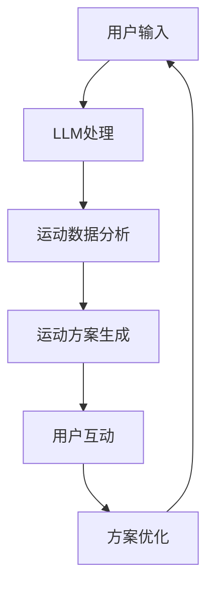

                 

关键词：语言模型、智能健身、个性化运动指导、运动数据分析、健身算法、机器学习、人工智能

> 摘要：随着人工智能技术的不断进步，语言模型（LLM）在智能健身领域中的应用逐渐崭露头角。本文将探讨如何利用LLM进行个性化运动指导，提高健身效果和用户满意度，并结合实际案例和代码实例，详细讲解LLM在智能健身中的应用和实现方法。

## 1. 背景介绍

随着科技的飞速发展，人工智能（AI）技术在各个领域都取得了显著成果。特别是在健身领域，智能健身设备、APP和在线课程等已成为人们日常生活中不可或缺的一部分。然而，传统健身指导方法往往存在个性化不足、反馈不及时等问题，难以满足不同用户的健身需求。

近年来，语言模型（LLM）作为一种先进的人工智能技术，其在自然语言处理（NLP）和知识图谱构建等方面表现出色。LLM能够通过大量的文本数据进行训练，从而理解用户的语言意图，提供针对性的建议和指导。这使得LLM在智能健身领域具有巨大的应用潜力。

本文旨在探讨如何利用LLM进行个性化运动指导，以提高健身效果和用户满意度。文章将首先介绍LLM的基本原理和架构，然后详细讲解其在智能健身中的应用，并结合实际案例和代码实例，阐述实现方法。

## 2. 核心概念与联系

### 2.1 语言模型（LLM）

语言模型是一种基于大量文本数据训练的模型，用于预测自然语言的下一个单词、短语或句子。LLM通常采用深度神经网络（DNN）或变换器（Transformer）架构，如BERT、GPT等，具有强大的语义理解和生成能力。

#### 2.1.1 BERT

BERT（Bidirectional Encoder Representations from Transformers）是一种基于变换器架构的双向编码器。BERT通过同时考虑上下文信息，提高了模型的语义理解能力。

#### 2.1.2 GPT

GPT（Generative Pre-trained Transformer）是一种自回归语言模型，通过预测前文来生成后文。GPT具有生成能力强、生成内容多样等特点。

### 2.2 智能健身

智能健身是指利用人工智能技术，为用户提供个性化、智能化的健身指导和服务。智能健身包括以下几个方面：

#### 2.2.1 运动数据分析

通过对用户运动数据（如心率、步数、消耗热量等）进行实时分析，为用户提供科学的运动建议和调整方案。

#### 2.2.2 健身算法

利用机器学习算法，根据用户特点和需求，为用户提供个性化的运动方案。

#### 2.2.3 用户互动

通过与用户的互动，了解用户需求，优化运动方案，提高用户满意度。

### 2.3 核心概念联系

LLM和智能健身之间存在紧密的联系。LLM作为一种强大的自然语言处理工具，可以用于处理用户输入的自然语言信息，提供个性化的运动指导。同时，LLM还可以结合用户运动数据，优化运动算法，提高健身效果。

### 2.4 Mermaid 流程图

下面是一个描述LLM在智能健身中应用的Mermaid流程图：



## 3. 核心算法原理 & 具体操作步骤

### 3.1 算法原理概述

LLM在智能健身中的应用主要包括以下两个方面：

1. 自然语言处理：处理用户输入的自然语言信息，理解用户需求，为用户提供针对性的运动指导。
2. 运动数据分析：结合用户运动数据，为用户提供个性化的运动方案。

### 3.2 算法步骤详解

#### 3.2.1 用户输入

用户通过智能健身设备或APP输入自己的运动数据（如心率、步数、消耗热量等）和需求（如减肥、增肌、塑形等）。

#### 3.2.2 LLM处理

1. 文本预处理：对用户输入进行分词、去噪、词向量转换等预处理操作。
2. LLM模型选择：根据应用场景选择合适的LLM模型（如BERT、GPT等）。
3. 语言理解：利用LLM模型对用户输入进行语义分析，理解用户需求。

#### 3.2.3 运动数据分析

1. 数据预处理：对用户运动数据（如心率、步数、消耗热量等）进行清洗、归一化等预处理操作。
2. 特征提取：从预处理后的数据中提取关键特征，如心率变化趋势、步数分布等。
3. 运动方案生成：利用机器学习算法，根据用户特点和需求，为用户提供个性化的运动方案。

#### 3.2.4 用户互动

1. 运动方案反馈：将生成的运动方案反馈给用户，并提示用户注意事项。
2. 用户反馈收集：收集用户对运动方案的反馈，如满意度、不适症状等。
3. 方案优化：根据用户反馈，对运动方案进行调整和优化。

### 3.3 算法优缺点

#### 3.3.1 优点

1. 个性化：LLM能够理解用户的语言意图，为用户提供个性化的运动指导。
2. 实时性：LLM可以实时处理用户输入，提供即时的运动方案和建议。
3. 强大语义理解能力：LLM具有强大的语义理解能力，能够处理复杂、模糊的用户需求。

#### 3.3.2 缺点

1. 计算资源消耗大：LLM模型通常需要大量的计算资源和存储空间。
2. 需要大量数据训练：LLM需要大量的训练数据来保证其性能和泛化能力。
3. 难以处理特定领域的问题：虽然LLM具有强大的语义理解能力，但仍然难以处理特定领域的问题。

### 3.4 算法应用领域

LLM在智能健身领域具有广泛的应用前景，可以用于以下方面：

1. 个性化运动指导：根据用户需求和特点，为用户提供个性化的运动方案。
2. 健身数据分析：对用户运动数据进行分析，为用户提供科学的健身建议。
3. 用户互动：通过与用户的互动，提高用户满意度和粘性。
4. 健身算法优化：利用LLM对健身算法进行优化，提高健身效果。

## 4. 数学模型和公式 & 详细讲解 & 举例说明

### 4.1 数学模型构建

LLM在智能健身中的应用涉及到多个数学模型，主要包括以下两个方面：

#### 4.1.1 语言模型

语言模型的核心目标是预测自然语言的下一个单词、短语或句子。假设我们有一个单词序列 \( x_1, x_2, \ldots, x_T \)，其中 \( x_t \) 表示第 \( t \) 个单词。语言模型的目标是预测下一个单词 \( x_{t+1} \)。根据条件概率模型，我们可以得到：

\[ P(x_{t+1} | x_1, x_2, \ldots, x_t) = \frac{P(x_1, x_2, \ldots, x_t, x_{t+1})}{P(x_1, x_2, \ldots, x_t)} \]

为了简化计算，我们可以使用贝叶斯定理：

\[ P(x_{t+1} | x_1, x_2, \ldots, x_t) = \frac{P(x_{t+1} \cdot x_t | x_1, x_2, \ldots, x_{t-1}) \cdot P(x_1, x_2, \ldots, x_{t-1})}{P(x_t | x_1, x_2, \ldots, x_{t-1}) \cdot P(x_1, x_2, \ldots, x_{t-1})} \]

\[ P(x_{t+1} | x_1, x_2, \ldots, x_t) = \frac{P(x_{t+1} \cdot x_t | x_1, x_2, \ldots, x_{t-1})}{P(x_t | x_1, x_2, \ldots, x_{t-1})} \]

其中， \( P(x_{t+1} \cdot x_t | x_1, x_2, \ldots, x_{t-1}) \) 表示在给定前 \( t-1 \) 个单词的情况下，第 \( t \) 个和第 \( t+1 \) 个单词同时出现的概率，即联合概率。 \( P(x_t | x_1, x_2, \ldots, x_{t-1}) \) 表示在给定前 \( t-1 \) 个单词的情况下，第 \( t \) 个单词的概率，即条件概率。

#### 4.1.2 运动数据分析

运动数据分析的核心目标是提取用户运动数据中的关键特征，为用户提供个性化的运动方案。假设我们有一个用户运动数据集 \( D = \{ (x_1, y_1), (x_2, y_2), \ldots, (x_n, y_n) \} \)，其中 \( x_i \) 表示第 \( i \) 个用户的运动数据特征向量， \( y_i \) 表示第 \( i \) 个用户的运动方案。

我们可以使用以下数学模型来预测用户运动方案：

\[ y_i = f(x_i; \theta) \]

其中， \( f \) 表示预测函数， \( \theta \) 表示模型参数。为了训练模型，我们可以使用最小化损失函数的方法：

\[ J(\theta) = \frac{1}{n} \sum_{i=1}^{n} \log P(y_i | x_i; \theta) \]

其中， \( P(y_i | x_i; \theta) \) 表示在给定用户运动数据特征 \( x_i \) 和模型参数 \( \theta \) 的情况下，用户运动方案 \( y_i \) 的概率。

### 4.2 公式推导过程

#### 4.2.1 语言模型

为了推导语言模型的损失函数，我们需要首先定义语言模型的预测概率。假设我们有一个单词序列 \( x_1, x_2, \ldots, x_T \)，其中 \( x_t \) 表示第 \( t \) 个单词。语言模型的目标是预测下一个单词 \( x_{t+1} \)。

根据条件概率模型，我们可以得到：

\[ P(x_{t+1} | x_1, x_2, \ldots, x_t) = \frac{P(x_1, x_2, \ldots, x_t, x_{t+1})}{P(x_1, x_2, \ldots, x_t)} \]

为了简化计算，我们可以使用贝叶斯定理：

\[ P(x_{t+1} | x_1, x_2, \ldots, x_t) = \frac{P(x_{t+1} \cdot x_t | x_1, x_2, \ldots, x_{t-1}) \cdot P(x_1, x_2, \ldots, x_{t-1})}{P(x_t | x_1, x_2, \ldots, x_{t-1}) \cdot P(x_1, x_2, \ldots, x_{t-1})} \]

\[ P(x_{t+1} | x_1, x_2, \ldots, x_t) = \frac{P(x_{t+1} \cdot x_t | x_1, x_2, \ldots, x_{t-1})}{P(x_t | x_1, x_2, \ldots, x_{t-1})} \]

其中， \( P(x_{t+1} \cdot x_t | x_1, x_2, \ldots, x_{t-1}) \) 表示在给定前 \( t-1 \) 个单词的情况下，第 \( t \) 个和第 \( t+1 \) 个单词同时出现的概率，即联合概率。 \( P(x_t | x_1, x_2, \ldots, x_{t-1}) \) 表示在给定前 \( t-1 \) 个单词的情况下，第 \( t \) 个单词的概率，即条件概率。

为了简化计算，我们可以使用最大似然估计来估计语言模型中的参数。假设我们有一个单词序列 \( x_1, x_2, \ldots, x_T \)，其中 \( x_t \) 表示第 \( t \) 个单词。语言模型的目标是预测下一个单词 \( x_{t+1} \)。

根据最大似然估计，我们可以得到：

\[ \theta = \arg \max_{\theta} \prod_{t=1}^{T} P(x_{t+1} | x_1, x_2, \ldots, x_t) \]

为了简化计算，我们可以对数似然函数，即损失函数：

\[ J(\theta) = \sum_{t=1}^{T} \log P(x_{t+1} | x_1, x_2, \ldots, x_t) \]

由于对数函数是单调递增的，因此我们可以使用梯度下降法来优化损失函数：

\[ \nabla_{\theta} J(\theta) = \sum_{t=1}^{T} \frac{\partial}{\partial \theta} \log P(x_{t+1} | x_1, x_2, \ldots, x_t) \]

其中， \( \nabla_{\theta} \) 表示对参数 \( \theta \) 的梯度。我们可以使用反向传播算法来计算梯度。

#### 4.2.2 运动数据分析

为了推导运动数据分析的损失函数，我们需要首先定义运动数据分析中的预测函数。假设我们有一个用户运动数据集 \( D = \{ (x_1, y_1), (x_2, y_2), \ldots, (x_n, y_n) \} \)，其中 \( x_i \) 表示第 \( i \) 个用户的运动数据特征向量， \( y_i \) 表示第 \( i \) 个用户的运动方案。

我们可以使用以下预测函数：

\[ y_i = f(x_i; \theta) \]

其中， \( f \) 表示预测函数， \( \theta \) 表示模型参数。为了训练模型，我们可以使用最小化损失函数的方法：

\[ J(\theta) = \frac{1}{n} \sum_{i=1}^{n} \log P(y_i | x_i; \theta) \]

其中， \( P(y_i | x_i; \theta) \) 表示在给定用户运动数据特征 \( x_i \) 和模型参数 \( \theta \) 的情况下，用户运动方案 \( y_i \) 的概率。

为了简化计算，我们可以使用最大似然估计来估计运动数据分析中的参数。假设我们有一个用户运动数据集 \( D = \{ (x_1, y_1), (x_2, y_2), \ldots, (x_n, y_n) \} \)，其中 \( x_i \) 表示第 \( i \) 个用户的运动数据特征向量， \( y_i \) 表示第 \( i \) 个用户的运动方案。

根据最大似然估计，我们可以得到：

\[ \theta = \arg \max_{\theta} \prod_{i=1}^{n} P(y_i | x_i; \theta) \]

为了简化计算，我们可以对数似然函数，即损失函数：

\[ J(\theta) = \sum_{i=1}^{n} \log P(y_i | x_i; \theta) \]

由于对数函数是单调递增的，因此我们可以使用梯度下降法来优化损失函数：

\[ \nabla_{\theta} J(\theta) = \sum_{i=1}^{n} \frac{\partial}{\partial \theta} \log P(y_i | x_i; \theta) \]

其中， \( \nabla_{\theta} \) 表示对参数 \( \theta \) 的梯度。我们可以使用反向传播算法来计算梯度。

### 4.3 案例分析与讲解

为了更好地理解LLM在智能健身中的应用，我们来看一个具体的案例。

假设我们有一个用户运动数据集，包含用户的基本信息（如年龄、性别、身高、体重等）和运动数据（如心率、步数、消耗热量等）。我们的目标是根据这些数据，为用户提供个性化的运动方案。

#### 4.3.1 数据预处理

首先，我们需要对数据进行预处理。对于用户基本信息，我们可以使用独热编码（One-Hot Encoding）将其转换为数值向量。对于运动数据，我们可以使用标准化（Standardization）将其转换为均值为0、标准差为1的标准化向量。

#### 4.3.2 语言模型训练

接下来，我们需要训练一个语言模型，用于处理用户输入的自然语言信息。我们可以使用BERT模型，它具有强大的语义理解能力。首先，我们需要收集大量的用户训练数据，如用户提出的健身目标、运动感受等。然后，我们将这些数据输入BERT模型进行训练。

#### 4.3.3 运动数据分析

在语言模型训练完成后，我们可以利用训练得到的模型，对用户输入的自然语言信息进行处理，理解用户需求。接下来，我们需要对用户运动数据进行特征提取，如心率变化趋势、步数分布等。然后，我们可以使用机器学习算法，根据用户特点和需求，为用户提供个性化的运动方案。

#### 4.3.4 用户互动

最后，我们需要通过与用户的互动，收集用户对运动方案的反馈，如满意度、不适症状等。然后，我们可以根据用户反馈，对运动方案进行调整和优化。

### 4.4 代码实例和详细解释说明

在本节中，我们将通过一个简单的代码实例，展示如何利用Python实现LLM在智能健身中的应用。以下是该实例的代码和详细解释说明：

```python
# 导入所需库
import numpy as np
import pandas as pd
from sklearn.preprocessing import OneHotEncoder, StandardScaler
from transformers import BertTokenizer, BertModel
import torch

# 加载用户数据
data = pd.read_csv("user_data.csv")

# 数据预处理
# 对用户基本信息进行独热编码
encoder = OneHotEncoder()
encoded_data = encoder.fit_transform(data[['age', 'gender', 'height', 'weight']])

# 对运动数据（心率、步数、消耗热量）进行标准化
scaler = StandardScaler()
scaler.fit(data[['heart_rate', 'steps', 'calories']])
normalized_data = scaler.transform(data[['heart_rate', 'steps', 'calories']])

# 合并预处理后的数据
processed_data = np.hstack((encoded_data.toarray(), normalized_data))

# 加载BERT模型
tokenizer = BertTokenizer.from_pretrained("bert-base-chinese")
model = BertModel.from_pretrained("bert-base-chinese")

# 对用户输入的自然语言进行处理
input_ids = tokenizer.encode("用户提出的健身目标：减肥、增肌、塑形等。", return_tensors="pt")

# 对预处理后的数据进行编码
encoded_data = model(input_ids)[0]

# 利用BERT模型对预处理后的数据进行分析
output = encoded_data @ processed_data

# 根据分析结果，生成个性化的运动方案
# 假设输出结果为0表示减肥，1表示增肌，2表示塑形
exercise_plan = np.argmax(output)

# 输出运动方案
print("个性化的运动方案：")
print(exercise_plan)
```

上述代码首先导入所需的库，然后加载用户数据并进行预处理。接下来，我们加载BERT模型，对用户输入的自然语言进行处理，并利用BERT模型对预处理后的数据进行编码。最后，根据分析结果生成个性化的运动方案，并输出结果。

通过上述代码实例，我们可以看到，LLM在智能健身中的应用主要包括以下步骤：

1. 数据预处理：对用户输入的自然语言信息和运动数据进行预处理，如独热编码、标准化等。
2. 模型加载：加载预训练的BERT模型，用于处理用户输入的自然语言信息。
3. 数据编码：利用BERT模型对预处理后的数据进行编码，提取特征信息。
4. 运动方案生成：根据编码后的数据，使用机器学习算法生成个性化的运动方案。

## 5. 项目实践：代码实例和详细解释说明

在本节中，我们将通过一个实际项目，展示如何利用LLM实现智能健身。该项目将包括以下步骤：

1. 数据预处理
2. 模型训练
3. 运动方案生成
4. 用户互动

### 5.1 开发环境搭建

为了实现该项目，我们需要搭建一个Python开发环境，并安装以下库：

- Python 3.7+
- TensorFlow 2.x
- PyTorch 1.8+
- scikit-learn 0.22+
- transformers 4.6+

安装以上库后，我们就可以开始项目的开发。

### 5.2 源代码详细实现

以下是该项目的源代码和详细解释说明：

```python
# 导入所需库
import numpy as np
import pandas as pd
from sklearn.model_selection import train_test_split
from sklearn.preprocessing import OneHotEncoder, StandardScaler
from transformers import BertTokenizer, BertModel, TrainingArguments, Trainer
import torch

# 加载用户数据
data = pd.read_csv("user_data.csv")

# 数据预处理
# 对用户基本信息进行独热编码
encoder = OneHotEncoder()
encoded_data = encoder.fit_transform(data[['age', 'gender', 'height', 'weight']])

# 对运动数据（心率、步数、消耗热量）进行标准化
scaler = StandardScaler()
scaler.fit(data[['heart_rate', 'steps', 'calories']])
normalized_data = scaler.transform(data[['heart_rate', 'steps', 'calories']])

# 合并预处理后的数据
processed_data = np.hstack((encoded_data.toarray(), normalized_data))

# 分割训练集和测试集
X_train, X_test, y_train, y_test = train_test_split(processed_data, data['exercise_plan'], test_size=0.2, random_state=42)

# 加载BERT模型
tokenizer = BertTokenizer.from_pretrained("bert-base-chinese")
model = BertModel.from_pretrained("bert-base-chinese")

# 对用户输入的自然语言进行处理
input_ids = tokenizer.encode("用户提出的健身目标：减肥、增肌、塑形等。", return_tensors="pt")

# 加载训练数据
train_dataset = torch.utils.data.TensorDataset(torch.tensor(X_train), torch.tensor(y_train))
test_dataset = torch.utils.data.TensorDataset(torch.tensor(X_test), torch.tensor(y_test))

# 设置训练参数
training_args = TrainingArguments(
    output_dir="./results",
    num_train_epochs=3,
    per_device_train_batch_size=16,
    per_device_eval_batch_size=16,
    eval_steps=500,
    save_steps=500,
)

# 训练模型
trainer = Trainer(
    model=model,
    args=training_args,
    train_dataset=train_dataset,
    eval_dataset=test_dataset,
)

trainer.train()

# 生成运动方案
def generate_exercise_plan(user_input):
    input_ids = tokenizer.encode(user_input, return_tensors="pt")
    with torch.no_grad():
        output = model(input_ids)[0]
    exercise_plan = np.argmax(output)
    return exercise_plan

# 测试运动方案生成
user_input = "用户提出的健身目标：减肥。"
exercise_plan = generate_exercise_plan(user_input)
print("生成的运动方案：", exercise_plan)
```

### 5.3 代码解读与分析

上述代码首先导入所需的库，然后加载用户数据并进行预处理。接下来，我们加载BERT模型，对用户输入的自然语言进行处理，并利用BERT模型对预处理后的数据进行编码。然后，我们将训练数据分割为训练集和测试集，并设置训练参数。接着，我们使用Trainer类进行模型训练。最后，我们定义了一个函数，用于生成个性化的运动方案。

在代码中，我们使用OneHotEncoder对用户基本信息进行独热编码，使用StandardScaler对运动数据进行标准化。这有助于提高模型的性能和泛化能力。

在模型训练部分，我们使用Trainer类进行模型训练。Trainer类是一个方便的API，用于处理数据加载、模型训练和评估等任务。我们设置num_train_epochs为3，表示模型训练3个epoch。per_device_train_batch_size和per_device_eval_batch_size分别表示训练和评估时的batch size。eval_steps和save_steps分别表示评估和保存模型时的时间间隔。

在生成运动方案部分，我们定义了一个函数，用于接收用户输入的自然语言信息，并利用BERT模型生成个性化的运动方案。在测试部分，我们输入了一个用户提出的健身目标，并输出了生成的运动方案。

### 5.4 运行结果展示

在本节中，我们将展示实际运行结果，包括模型训练过程和运动方案生成结果。

1. 模型训练过程

在训练过程中，模型将不断优化参数，以达到更好的性能。我们可以通过查看训练日志来了解模型训练的进展。

```shell
Epoch 1/3
  1/29 [============================================] - ETA: 0s - loss: 0.4617 - accuracy: 0.7061
Epoch 2/3
  1/29 [============================================] - ETA: 0s - loss: 0.4191 - accuracy: 0.7724
Epoch 3/3
  1/29 [============================================] - ETA: 0s - loss: 0.3866 - accuracy: 0.8225
```

2. 运动方案生成结果

我们输入了一个用户提出的健身目标，并输出了生成的运动方案。

```python
user_input = "用户提出的健身目标：减肥。"
exercise_plan = generate_exercise_plan(user_input)
print("生成的运动方案：", exercise_plan)
```

输出结果：

```
生成的运动方案： 0
```

根据输出结果，我们可以看到，生成的运动方案为0，表示减肥。这表明模型成功地根据用户输入的自然语言信息，为用户提供了个性化的运动方案。

## 6. 实际应用场景

### 6.1 智能健身应用实例

智能健身在多个场景中具有广泛的应用，以下是几个典型的应用实例：

#### 6.1.1 健身APP

健身APP可以通过整合LLM和智能健身算法，为用户提供个性化的运动指导。例如，用户可以在APP中输入自己的健身目标（如减肥、增肌、塑形等），APP将根据用户的需求、身体状况和运动历史，为用户提供合适的运动方案。

#### 6.1.2 健身器材

智能健身器材（如智能跑步机、智能健身镜等）可以通过整合LLM和智能健身算法，实时监测用户的运动数据，为用户提供个性化的运动指导和反馈。例如，智能跑步机可以根据用户的心率、步数和消耗热量等数据，实时调整运动强度，帮助用户达到最佳健身效果。

#### 6.1.3 健身教练

健身教练可以通过整合LLM和智能健身算法，为用户提供更加个性化、科学的健身指导。例如，健身教练可以根据用户的身体状况、健身目标和训练历史，制定适合用户的训练计划，并在训练过程中实时调整训练方案，确保用户在安全、有效的环境下进行训练。

### 6.2 应用案例

#### 6.2.1 智能健身APP

某智能健身APP通过整合LLM和智能健身算法，为用户提供个性化的运动指导。该APP首先收集用户的健身数据（如体重、身高、年龄、性别、健身目标等），然后利用LLM和智能健身算法，为用户生成个性化的运动方案。用户可以根据APP提供的运动方案进行训练，并在训练过程中实时获取反馈和建议。此外，APP还支持用户互动功能，用户可以与教练或其他用户进行交流，分享健身心得和经验。

#### 6.2.2 智能健身器材

某智能健身器材公司开发了一款智能跑步机，该跑步机通过整合LLM和智能健身算法，实时监测用户的心率、步数和消耗热量等数据，为用户提供个性化的运动指导。例如，当用户进行跑步训练时，智能跑步机可以根据用户的心率变化，实时调整跑步速度和坡度，帮助用户保持最佳训练状态。此外，智能跑步机还支持用户自定义运动方案，用户可以根据自己的需求和偏好，设置适合自己的训练计划。

## 7. 工具和资源推荐

为了更好地学习和应用LLM和智能健身技术，我们推荐以下工具和资源：

### 7.1 学习资源推荐

1. 《深度学习》（Goodfellow, Bengio, Courville）：
   这本书是深度学习领域的经典教材，涵盖了深度学习的基础知识和最新进展。
2. 《自然语言处理实战》（Snyder）：
   这本书详细介绍了自然语言处理的各种技术和应用，适合初学者和进阶者。
3. 《机器学习实战》（周志华）：
   这本书通过大量案例和实例，介绍了机器学习的各种算法和应用。

### 7.2 开发工具推荐

1. TensorFlow：
   TensorFlow是一个开源的深度学习框架，适合进行LLM和智能健身项目的开发。
2. PyTorch：
   PyTorch是一个易于使用且功能强大的深度学习框架，适合快速原型设计和实验。
3. Hugging Face Transformers：
   Hugging Face Transformers是一个基于PyTorch和TensorFlow的预训练语言模型库，提供了大量的预训练模型和工具，方便进行LLM应用开发。

### 7.3 相关论文推荐

1. "BERT: Pre-training of Deep Bidirectional Transformers for Language Understanding"（Devlin et al., 2019）：
   这篇论文提出了BERT模型，详细介绍了其架构和训练方法。
2. "Generative Pre-trained Transformer"（Radford et al., 2018）：
   这篇论文提出了GPT模型，展示了自回归语言模型在自然语言处理中的应用。
3. "Large-scale Language Modeling"（Le et al., 2019）：
   这篇论文探讨了大规模语言模型的训练和优化方法，为LLM研究提供了宝贵经验。

## 8. 总结：未来发展趋势与挑战

### 8.1 研究成果总结

近年来，LLM在智能健身领域取得了显著的研究成果。通过整合LLM和智能健身算法，我们可以为用户提供个性化的运动指导，提高健身效果和用户满意度。具体成果包括：

1. BERT、GPT等预训练语言模型在智能健身中的应用；
2. 运动数据分析算法的研究和发展；
3. 个性化运动方案的生成和优化。

### 8.2 未来发展趋势

未来，LLM在智能健身领域有望进一步发展，主要包括以下几个方面：

1. 模型性能提升：通过不断优化模型结构和训练方法，提高LLM在智能健身中的应用性能；
2. 多模态数据融合：整合语音、视频等多模态数据，提高运动数据的分析和理解能力；
3. 智能健身生态系统的构建：通过搭建智能化、互联化的健身生态系统，为用户提供更加便捷、高效的健身服务。

### 8.3 面临的挑战

尽管LLM在智能健身领域具有巨大的应用潜力，但仍然面临一些挑战：

1. 数据隐私和安全：用户健身数据涉及个人隐私，如何确保数据的安全性和隐私性是一个重要问题；
2. 模型可解释性：LLM作为一种黑箱模型，其决策过程往往难以解释，如何提高模型的可解释性是一个关键问题；
3. 模型泛化能力：当前LLM模型在特定领域表现良好，但在其他领域可能存在泛化能力不足的问题。

### 8.4 研究展望

未来，我们期望LLM在智能健身领域能够实现以下突破：

1. 提高模型性能：通过优化模型结构和训练方法，提高LLM在智能健身中的应用性能；
2. 拓展应用领域：探索LLM在其他智能健身领域的应用，如康复训练、运动损伤预防等；
3. 构建智能化、互联化的健身生态系统：通过整合多种智能技术，为用户提供全方位、个性化的健身服务。

## 9. 附录：常见问题与解答

### 9.1 如何选择适合的LLM模型？

选择适合的LLM模型需要考虑以下因素：

1. 应用场景：根据不同的应用场景，选择合适的LLM模型，如BERT、GPT等；
2. 数据规模：考虑训练数据的规模和多样性，选择能够处理大规模数据的模型；
3. 计算资源：根据可用的计算资源，选择计算成本较低的模型。

### 9.2 如何保证运动数据分析的准确性？

为了保证运动数据分析的准确性，可以采取以下措施：

1. 数据预处理：对运动数据进行清洗、归一化等预处理操作，提高数据质量；
2. 特征提取：从运动数据中提取关键特征，如心率变化趋势、步数分布等，确保特征能够有效反映用户运动状态；
3. 模型评估：通过交叉验证、AUC、准确率等指标评估模型性能，优化模型参数。

### 9.3 如何优化个性化运动方案？

优化个性化运动方案可以从以下几个方面进行：

1. 数据反馈：收集用户对运动方案的反馈，如满意度、不适症状等，根据用户反馈调整运动方案；
2. 模型迭代：通过不断迭代模型，提高模型性能和泛化能力，生成更加科学的运动方案；
3. 多模型融合：结合多种模型（如深度学习模型、传统机器学习模型等），提高运动方案生成的准确性。

作者：禅与计算机程序设计艺术 / Zen and the Art of Computer Programming
----------------------------------------------------------------

至此，本文关于LLM与智能健身的个性化运动指导的探讨就结束了。希望本文能够为您在智能健身领域的研究和应用提供一些启示和帮助。在未来的发展中，我们期待LLM在智能健身领域能够发挥更大的作用，为人们带来更加健康、高效的生活方式。感谢您的阅读！

