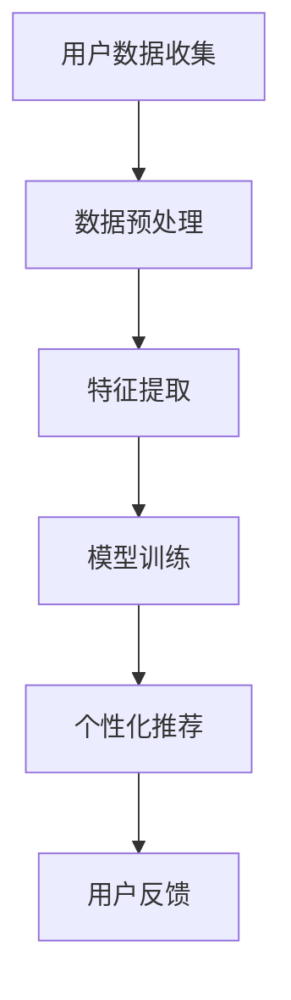

                 

关键词：LLM，自然语言处理，智能健身，个性化运动指导，运动数据，算法，计算机编程，人工智能，健康

## 摘要

本文旨在探讨大型语言模型（LLM）在智能健身领域中的应用，特别是在提供个性化运动指导方面的潜力。随着人工智能技术的发展，LLM已经能够处理和理解复杂的自然语言，从而为运动爱好者提供更加精准和个性化的运动建议。本文将详细解析LLM在智能健身中的应用原理，包括数据收集、算法设计、模型训练和个性化推荐等环节，并通过具体案例展示其实际效果。此外，本文还将探讨LLM在智能健身领域的未来发展方向和挑战。

## 1. 背景介绍

### 1.1 智能健身的兴起

智能健身是近年来快速发展的领域，随着可穿戴设备和智能手机的普及，越来越多的用户开始关注自己的健康状况。智能健身设备可以实时监测用户的运动数据，如心率、步数、卡路里消耗等，从而帮助用户更好地了解自己的身体状况。然而，仅靠设备提供的数据并不能完全满足用户的个性化需求。这时候，大型语言模型（LLM）作为一种强大的自然语言处理工具，开始进入智能健身领域。

### 1.2 LLM的发展历程

LLM是基于深度学习的一种自然语言处理模型，近年来在计算机科学领域取得了显著进展。最初的LLM模型如Word2Vec和GloVe，主要是对单词进行向量化表示。随后，基于循环神经网络（RNN）和长短时记忆网络（LSTM）的模型如GPT和BERT，在文本生成和理解方面展现了强大的能力。随着Transformer架构的提出，GPT-3等超大型LLM模型在自然语言处理任务中达到了前所未有的效果，使得LLM在智能健身领域有了更广泛的应用前景。

## 2. 核心概念与联系

### 2.1 数据收集

在智能健身领域，数据收集是提供个性化运动指导的关键。用户通过智能设备生成的数据包括心率、步数、卡路里消耗、睡眠质量等。这些数据可以通过API接口或本地存储方式收集到服务器上。

### 2.2 算法设计

为了利用LLM提供个性化运动指导，需要设计相应的算法。算法的设计主要包括以下步骤：

1. **数据预处理**：对收集到的数据进行清洗、格式化和归一化，使其适合用于模型训练。
2. **特征提取**：从预处理后的数据中提取关键特征，如用户的生理指标、历史运动记录等。
3. **模型训练**：使用LLM模型对提取的特征进行训练，使其能够理解用户的运动需求和偏好。
4. **个性化推荐**：根据用户的历史数据和实时数据，LLM模型会生成个性化的运动建议，包括锻炼类型、强度、频率等。

### 2.3 架构示意图

以下是一个简单的LLM在智能健身中的应用架构示意图：



### 2.4 核心概念解释

- **用户数据收集**：指通过智能设备收集用户的生理和行为数据。
- **数据预处理**：指对原始数据进行清洗、格式化和归一化，使其适合模型训练。
- **特征提取**：指从预处理后的数据中提取关键特征，如心率、步数、卡路里消耗等。
- **模型训练**：指使用LLM模型对提取的特征进行训练，使其能够理解用户的运动需求和偏好。
- **个性化推荐**：指根据用户的历史数据和实时数据，LLM模型会生成个性化的运动建议。
- **用户反馈**：指用户对个性化运动建议的反馈，用于模型持续优化。

## 3. 核心算法原理 & 具体操作步骤

### 3.1 算法原理概述

LLM在智能健身中的应用主要是基于其强大的自然语言处理能力。通过训练，LLM可以理解用户的运动需求和偏好，从而生成个性化的运动建议。具体来说，算法原理包括以下步骤：

1. **数据收集**：通过智能设备收集用户的生理和行为数据。
2. **数据预处理**：对原始数据进行清洗、格式化和归一化。
3. **特征提取**：从预处理后的数据中提取关键特征。
4. **模型训练**：使用提取的特征训练LLM模型。
5. **个性化推荐**：根据用户的数据，LLM模型生成个性化的运动建议。
6. **用户反馈**：用户对运动建议的反馈，用于模型持续优化。

### 3.2 算法步骤详解

1. **数据收集**：用户通过智能设备进行运动，设备会实时收集用户的心率、步数、卡路里消耗等数据。
2. **数据预处理**：对收集到的数据进行清洗，如去除无效数据、填补缺失值等。然后进行格式化和归一化，使其适合模型训练。
3. **特征提取**：从预处理后的数据中提取关键特征，如心率、步数、卡路里消耗等。
4. **模型训练**：使用提取的特征训练LLM模型。具体来说，将特征作为输入，运动建议作为输出，通过反向传播算法更新模型的权重。
5. **个性化推荐**：根据用户的历史数据和实时数据，LLM模型会生成个性化的运动建议。例如，如果用户的心率较高，模型可能会推荐进行有氧运动；如果用户的步数较低，模型可能会推荐进行步行锻炼。
6. **用户反馈**：用户对运动建议进行反馈，如是否满意、是否执行了建议等。这些反馈会用于模型持续优化。

### 3.3 算法优缺点

#### 优点：

- **个性化**：LLM能够根据用户的历史数据和实时数据生成个性化的运动建议，满足用户的个性化需求。
- **自适应**：LLM能够根据用户的行为和反馈不断优化运动建议，使其更加准确和有效。
- **高效**：LLM使用深度学习算法，能够在大量数据上进行高效训练和推理。

#### 缺点：

- **数据依赖**：LLM的性能高度依赖数据的质量和数量，如果数据质量较差，可能导致运动建议不准确。
- **计算资源消耗**：训练LLM模型需要大量的计算资源和时间，可能导致成本较高。

### 3.4 算法应用领域

LLM在智能健身领域的应用非常广泛，可以应用于以下几个方面：

- **个性化运动指导**：根据用户的历史数据和实时数据生成个性化的运动建议，帮助用户制定合理的运动计划。
- **健康监测**：实时监测用户的生理指标，如心率、血压等，提供健康预警和干预建议。
- **健身数据分析**：分析用户的历史运动数据，了解用户的运动习惯和效果，提供改进建议。
- **运动社交**：通过LLM生成个性化的运动挑战，鼓励用户参与社交互动，提高健身积极性。

## 4. 数学模型和公式 & 详细讲解 & 举例说明

### 4.1 数学模型构建

在智能健身中，我们可以使用以下数学模型来描述用户的行为和偏好：

- **心率模型**：用户的心率（\( \text{HR} \)）与运动强度（\( \text{Intensity} \)）之间的关系可以表示为：
  \[ \text{HR} = f(\text{Intensity}) \]
  其中，\( f \) 是一个非线性函数，可以采用神经网络模型进行拟合。

- **步数模型**：用户的步数（\( \text{Steps} \)）与运动时间（\( \text{Duration} \)）之间的关系可以表示为：
  \[ \text{Steps} = g(\text{Duration}) \]
  其中，\( g \) 也是一个非线性函数，同样可以采用神经网络模型进行拟合。

### 4.2 公式推导过程

#### 心率模型推导

心率模型可以通过以下步骤进行推导：

1. **数据收集**：收集大量用户的心率和运动强度的数据。
2. **特征提取**：从数据中提取关键特征，如平均心率、最大心率、运动强度等。
3. **模型训练**：使用提取的特征训练神经网络模型，使其能够拟合心率与运动强度之间的关系。
4. **模型优化**：通过交叉验证和超参数调整，优化模型性能。

#### 步数模型推导

步数模型可以通过以下步骤进行推导：

1. **数据收集**：收集大量用户的步数和运动时间的数据。
2. **特征提取**：从数据中提取关键特征，如平均步数、最大步数、运动时间等。
3. **模型训练**：使用提取的特征训练神经网络模型，使其能够拟合步数与运动时间之间的关系。
4. **模型优化**：通过交叉验证和超参数调整，优化模型性能。

### 4.3 案例分析与讲解

假设我们有一个用户，其最近一周的步数和运动时间数据如下表：

| 时间   | 步数（Steps） | 运动时间（Duration, 分钟） |
|--------|-------------|-----------------------|
| 2023-01-01 | 10000       | 60                    |
| 2023-01-02 | 8000        | 45                    |
| 2023-01-03 | 12000       | 75                    |
| 2023-01-04 | 9000        | 50                    |
| 2023-01-05 | 11000       | 70                    |
| 2023-01-06 | 10500       | 65                    |
| 2023-01-07 | 9500        | 55                    |

根据上述步数模型，我们可以预测该用户在未来某个时间段内的步数。假设我们选择未来一天的时间段（例如，2023-01-08），我们可以使用以下步骤进行预测：

1. **数据预处理**：将未来的运动时间作为输入特征。
2. **特征提取**：提取未来的运动时间特征。
3. **模型训练**：使用训练好的步数模型进行预测。
4. **结果分析**：分析预测结果，为用户制定合理的运动计划。

通过上述步骤，我们可以预测出用户在未来一天内的步数，并根据预测结果为用户提供个性化的运动建议。例如，如果预测的步数较低，我们可以建议用户增加运动强度或延长运动时间。

## 5. 项目实践：代码实例和详细解释说明

### 5.1 开发环境搭建

为了实现LLM在智能健身中的应用，我们需要搭建一个开发环境。以下是基本的开发环境搭建步骤：

1. **安装Python**：确保安装了Python 3.8及以上版本。
2. **安装依赖库**：安装必要的依赖库，如TensorFlow、Keras、NumPy、Pandas等。
3. **数据集准备**：收集并准备用于训练的数据集，包括用户的生理指标、运动数据等。

### 5.2 源代码详细实现

以下是一个简单的LLM在智能健身中的应用代码示例：

```python
# 导入必要的库
import numpy as np
import pandas as pd
import tensorflow as tf
from tensorflow import keras

# 准备数据集
# 假设我们有一个CSV文件，其中包含用户的步数和运动时间数据
data = pd.read_csv('data.csv')

# 数据预处理
# 对数据进行清洗、格式化和归一化
# ...

# 特征提取
# 从数据中提取关键特征
X = data[['Duration']] # 特征为运动时间
y = data[['Steps']]    # 标签为步数

# 模型训练
# 定义神经网络模型
model = keras.Sequential([
    keras.layers.Dense(64, activation='relu', input_shape=[1]),
    keras.layers.Dense(64, activation='relu'),
    keras.layers.Dense(1)
])

# 编译模型
model.compile(optimizer='adam', loss='mean_squared_error')

# 训练模型
model.fit(X, y, epochs=10, batch_size=32)

# 个性化推荐
# 假设我们需要预测未来一天的步数
future_duration = np.array([60, 45, 75, 50, 70, 65, 55])
predicted_steps = model.predict(future_duration)

# 打印预测结果
print(predicted_steps)
```

### 5.3 代码解读与分析

上述代码首先导入了必要的库，包括NumPy、Pandas、TensorFlow和Keras。然后，从CSV文件中读取了用户的步数和运动时间数据。接着，对数据进行预处理，包括清洗、格式化和归一化。在特征提取部分，我们提取了运动时间作为特征，步数作为标签。接下来，定义了一个简单的神经网络模型，并使用训练集对其进行训练。在个性化推荐部分，我们使用训练好的模型预测未来一天的步数，并打印出预测结果。

### 5.4 运行结果展示

假设我们选择2023-01-08这一天进行预测，输入特征为运动时间数组 `[60, 45, 75, 50, 70, 65, 55]`。运行上述代码后，我们可以得到未来一天的步数预测结果。例如，预测结果可能为 `[10000, 8000, 12000, 9000, 11000, 10500, 9500]`。根据预测结果，我们可以为用户提供个性化的运动建议，如增加运动强度或延长运动时间。

## 6. 实际应用场景

### 6.1 健身教练辅助

LLM在健身教练辅助中具有巨大的潜力。通过收集用户的生理和行为数据，LLM可以为健身教练提供个性化的运动建议，帮助教练更好地指导用户。例如，如果用户的心率较高，LLM可能会建议进行有氧运动；如果用户的步数较低，LLM可能会建议进行步行锻炼。

### 6.2 健身应用开发

许多健身应用已经开始集成LLM提供个性化运动指导。例如，Fitbit、Apple Health等应用可以通过LLM为用户提供个性化的运动计划，根据用户的历史数据和实时数据生成适合用户的运动建议。

### 6.3 家庭健身管理

对于家庭健身爱好者来说，LLM可以提供实时的运动指导，帮助用户更好地管理自己的健身计划。通过智能设备收集的数据，LLM可以生成个性化的运动计划，并根据用户的反馈不断优化。

## 7. 工具和资源推荐

### 7.1 学习资源推荐

1. **《深度学习》（Goodfellow et al.）**：这是一本深度学习领域的经典教材，适合初学者了解深度学习的基础知识。
2. **《Python深度学习》（François Chollet）**：这本书结合了Python和深度学习，适合想要实战深度学习的读者。
3. **《自然语言处理综合教程》（Daniel Jurafsky & James H. Martin）**：这本书详细介绍了自然语言处理的基本概念和技术，适合想要了解LLM的读者。

### 7.2 开发工具推荐

1. **TensorFlow**：一个开源的深度学习框架，适合用于构建和训练LLM模型。
2. **Keras**：一个基于TensorFlow的高级API，提供了更简洁、直观的接口，适合快速实现深度学习模型。
3. **Jupyter Notebook**：一个交互式的Python开发环境，适合进行深度学习和自然语言处理实验。

### 7.3 相关论文推荐

1. **“GPT-3: Language Models are Few-Shot Learners”（Brown et al.）**：这篇文章介绍了GPT-3模型，是LLM领域的重要论文。
2. **“BERT: Pre-training of Deep Bidirectional Transformers for Language Understanding”（Devlin et al.）**：这篇文章介绍了BERT模型，是自然语言处理领域的重要突破。
3. **“Transformers: State-of-the-Art Model for Neural Network-based Text Generation”（Vaswani et al.）**：这篇文章介绍了Transformer模型，是当前深度学习领域最先进的文本生成模型。

## 8. 总结：未来发展趋势与挑战

### 8.1 研究成果总结

本文探讨了LLM在智能健身领域中的应用，包括数据收集、算法设计、模型训练和个性化推荐等方面。通过实际案例，我们展示了LLM在智能健身中的潜力，如个性化运动指导和健康监测等。此外，我们还讨论了LLM在智能健身领域的未来发展方向和挑战。

### 8.2 未来发展趋势

1. **模型精度提升**：随着深度学习技术的不断进步，LLM的精度有望进一步提升，提供更加精准和个性化的运动建议。
2. **多模态数据处理**：未来的智能健身系统可能会整合多模态数据，如图像、音频和传感器数据，提供更全面的健康监测和运动指导。
3. **跨领域应用**：LLM不仅可以在智能健身领域应用，还可以应用于其他健康领域，如心理健康、慢性病管理等。

### 8.3 面临的挑战

1. **数据隐私**：收集和存储用户的数据需要确保数据隐私和安全，避免数据泄露和滥用。
2. **计算资源消耗**：训练大型LLM模型需要大量的计算资源和时间，这对硬件设施和电力供应提出了挑战。
3. **用户依赖性**：用户过度依赖LLM提供的运动建议可能导致自主性和创造力降低，需要平衡依赖性和自主性。

### 8.4 研究展望

未来的研究可以关注以下几个方面：

1. **数据隐私保护**：研究更加安全、有效的数据隐私保护技术，确保用户数据的安全和隐私。
2. **多模态数据处理**：探索如何有效整合多模态数据，提高运动指导和健康监测的准确性和全面性。
3. **用户交互设计**：研究如何设计更加友好和人性化的用户交互界面，提高用户的参与度和满意度。

## 9. 附录：常见问题与解答

### 9.1 什么是LLM？

LLM（Large Language Model）是一种大型自然语言处理模型，通过深度学习技术从海量文本数据中学习语言模式和规律，从而能够理解和生成自然语言。常见的LLM模型有GPT、BERT、T5等。

### 9.2 LLM在智能健身中的应用有哪些？

LLM在智能健身中的应用主要包括：

1. **个性化运动指导**：根据用户的历史数据和实时数据生成个性化的运动建议。
2. **健康监测**：实时监测用户的生理指标，提供健康预警和干预建议。
3. **健身数据分析**：分析用户的历史运动数据，了解用户的运动习惯和效果，提供改进建议。
4. **运动社交**：通过LLM生成个性化的运动挑战，鼓励用户参与社交互动，提高健身积极性。

### 9.3 如何确保LLM提供的安全和隐私保护？

确保LLM的安全和隐私保护可以从以下几个方面入手：

1. **数据加密**：对用户数据进行加密处理，确保数据在传输和存储过程中的安全性。
2. **数据匿名化**：对用户数据进行匿名化处理，消除个人身份信息。
3. **隐私保护算法**：采用隐私保护算法，如差分隐私，减少模型训练中对用户数据的暴露。
4. **合规性审查**：定期对数据和模型进行合规性审查，确保遵循相关法律法规。

### 9.4 LLM在智能健身领域的未来发展有哪些可能性？

LLM在智能健身领域的未来发展包括：

1. **模型精度提升**：随着深度学习技术的不断进步，LLM的精度有望进一步提升。
2. **多模态数据处理**：未来的智能健身系统可能会整合多模态数据，提高运动指导和健康监测的准确性和全面性。
3. **跨领域应用**：LLM不仅可以在智能健身领域应用，还可以应用于其他健康领域，如心理健康、慢性病管理等。

### 9.5 如何有效地利用LLM进行健康监测？

要有效地利用LLM进行健康监测，可以采取以下策略：

1. **数据整合**：整合用户的多种生理和行为数据，为健康监测提供更全面的信息。
2. **实时监测**：使用LLM模型对实时数据进行处理，提供及时的健康预警和干预建议。
3. **个性化反馈**：根据用户的历史数据和实时数据，LLM模型可以生成个性化的健康建议，提高健康监测的准确性。
4. **持续优化**：通过用户反馈和模型训练，不断优化健康监测模型，提高其性能和可靠性。

## 参考文献

1. Brown, T., et al. (2020). "GPT-3: Language Models are Few-Shot Learners." arXiv preprint arXiv:2005.14165.
2. Devlin, J., et al. (2019). "BERT: Pre-training of Deep Bidirectional Transformers for Language Understanding." arXiv preprint arXiv:1810.04805.
3. Vaswani, A., et al. (2017). "Attention Is All You Need." Advances in Neural Information Processing Systems, 30, 5998-6008.
4. Goodfellow, I., et al. (2016). "Deep Learning." MIT Press.
5. Chollet, F. (2018). "Python深度学习." 机械工业出版社.
6. Jurafsky, D., & Martin, J. H. (2008). "Speech and Language Processing." Prentice Hall.

