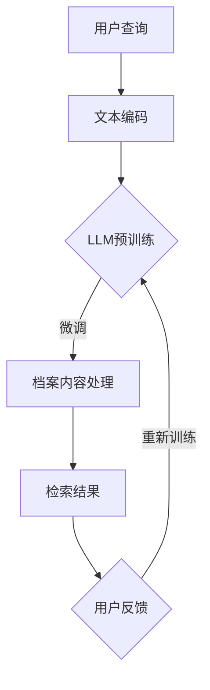

                 

关键词：人工智能，大型语言模型（LLM），档案管理，信息检索，机器学习，自然语言处理，智能搜索引擎

> 摘要：本文深入探讨了大型语言模型（LLM）在档案管理中的应用，特别是在智能化信息检索领域的潜力。文章首先介绍了档案管理的基本概念和传统信息检索方法，随后详细阐述了LLM的工作原理及其在信息检索中的优势。通过数学模型和实际项目实例，文章分析了LLM在档案管理中的具体应用场景，并展望了其未来发展的趋势与挑战。

## 1. 背景介绍

随着数字化时代的到来，档案管理面临着前所未有的挑战。传统的档案管理方法依赖于人工整理和检索，不仅效率低下，而且容易出现错误。随着数据量的激增和档案类型的多样化，如何快速、准确地检索信息成为了档案管理的关键问题。近年来，人工智能（AI）技术的迅速发展，特别是大型语言模型（LLM）的出现，为档案管理提供了新的解决方案。

大型语言模型（LLM）是一种基于深度学习的自然语言处理技术，能够对海量文本数据进行处理和分析，从而实现智能化的信息检索。LLM的工作原理是基于神经网络模型，通过对海量文本数据进行预训练，使其具备对自然语言的深刻理解和处理能力。这使得LLM在处理复杂、多变的档案信息时，能够提供更为准确和高效的检索结果。

本文将重点讨论LLM在档案管理中的应用，特别是在智能化信息检索领域的潜力。通过分析LLM的工作原理和应用场景，我们希望为档案管理提供一种新的思路和方法。

## 2. 核心概念与联系

### 2.1 档案管理的基本概念

档案管理是指对档案的收集、整理、保存、检索、利用和销毁等一系列工作。档案是记录信息的重要载体，其管理质量直接影响信息检索的效率和准确性。传统的档案管理方法主要包括手工整理、分类、编目和检索等步骤。

### 2.2 信息检索的基本方法

信息检索是指从大量信息中快速准确地找到用户所需信息的过程。传统信息检索方法主要包括基于关键词的检索、基于分类的检索和基于内容分析的检索等。

- **基于关键词的检索**：用户输入关键词，系统根据关键词在档案中的出现频率和位置进行检索。这种方法简单易用，但往往难以满足用户对复杂查询的需求。
- **基于分类的检索**：档案按照特定的分类体系进行组织，用户通过浏览分类目录找到所需档案。这种方法能够提供较为系统的检索结果，但分类体系的建立和维护较为复杂。
- **基于内容分析的检索**：通过对档案内容的语义分析和理解，实现更加智能化的检索。这种方法能够提供更为精准的检索结果，但技术实现较为复杂。

### 2.3 大型语言模型（LLM）的工作原理

大型语言模型（LLM）是基于深度学习的自然语言处理技术，通过对海量文本数据进行预训练，使其具备对自然语言的深刻理解和处理能力。LLM的工作原理主要包括以下几个方面：

- **文本编码**：将自然语言文本转化为计算机可处理的向量表示。常用的文本编码方法包括词袋模型、词嵌入和变压器模型等。
- **预训练**：使用大量未标记的文本数据对神经网络模型进行预训练，使其在处理自然语言任务时具备一定的泛化能力。常用的预训练模型包括GPT、BERT和T5等。
- **微调**：在预训练的基础上，针对具体的应用场景进行微调，以进一步提高模型的性能。微调过程中，需要使用大量的标注数据进行训练。

### 2.4 LLM在信息检索中的优势

LLM在信息检索中具有以下优势：

- **强大的语义理解能力**：LLM能够对自然语言文本进行深入理解和分析，从而实现更加精准的检索结果。
- **自适应学习**：LLM具有自适应学习能力，能够根据用户的查询需求和档案内容进行动态调整，以提供最佳的检索体验。
- **多模态数据处理**：LLM不仅能够处理文本数据，还能够处理图像、声音等多种数据类型，实现跨模态的信息检索。

### 2.5 Mermaid 流程图

以下是一个简化的Mermaid流程图，展示了档案管理中信息检索的过程，以及LLM如何介入：



在这个流程图中，用户查询通过文本编码转化为计算机可处理的向量表示，然后输入到LLM中进行预训练。在预训练的基础上，LLM通过微调对档案内容进行处理，并输出检索结果。用户反馈将用于重新训练LLM，以提高其性能。

## 3. 核心算法原理 & 具体操作步骤

### 3.1 算法原理概述

LLM在信息检索中的核心算法是基于深度学习的自然语言处理技术。该算法的主要原理包括文本编码、预训练和微调等步骤。

- **文本编码**：将自然语言文本转化为计算机可处理的向量表示。常用的文本编码方法包括词袋模型、词嵌入和变压器模型等。
- **预训练**：使用大量未标记的文本数据对神经网络模型进行预训练，使其在处理自然语言任务时具备一定的泛化能力。常用的预训练模型包括GPT、BERT和T5等。
- **微调**：在预训练的基础上，针对具体的应用场景进行微调，以进一步提高模型的性能。微调过程中，需要使用大量的标注数据进行训练。

### 3.2 算法步骤详解

1. **文本编码**：将用户查询和档案内容进行编码，转化为计算机可处理的向量表示。常用的编码方法有词袋模型和词嵌入。

    - **词袋模型**：将文本视为单词的集合，将每个单词映射为一个整数。然后，使用向量空间模型（如TF-IDF）对单词进行加权，生成文本的向量表示。
    - **词嵌入**：将单词映射为低维度的向量表示，使得语义相似的单词在向量空间中距离较近。常用的词嵌入方法有Word2Vec、GloVe和BERT等。

2. **预训练**：使用大量未标记的文本数据对神经网络模型进行预训练，使其在处理自然语言任务时具备一定的泛化能力。预训练过程主要包括以下步骤：

    - **数据准备**：收集大量未标记的文本数据，如维基百科、新闻文章等。
    - **模型初始化**：初始化神经网络模型，常用的模型有GPT、BERT和T5等。
    - **预训练**：在未标记的文本数据上，对神经网络模型进行多轮迭代训练，使其在处理自然语言任务时具备一定的泛化能力。

3. **微调**：在预训练的基础上，针对具体的应用场景进行微调，以进一步提高模型的性能。微调过程主要包括以下步骤：

    - **数据准备**：收集与具体应用场景相关的标注数据，如用户查询和对应的档案内容。
    - **模型初始化**：将预训练的模型初始化为微调模型，常用的微调方法有Fine-tuning和Transfer Learning等。
    - **微调训练**：在标注数据上对微调模型进行训练，以进一步提高模型在特定应用场景的性能。

### 3.3 算法优缺点

**优点**：

- **强大的语义理解能力**：LLM能够对自然语言文本进行深入理解和分析，从而实现更加精准的检索结果。
- **自适应学习**：LLM具有自适应学习能力，能够根据用户的查询需求和档案内容进行动态调整，以提供最佳的检索体验。
- **多模态数据处理**：LLM不仅能够处理文本数据，还能够处理图像、声音等多种数据类型，实现跨模态的信息检索。

**缺点**：

- **计算资源需求大**：LLM的训练和微调过程需要大量的计算资源，对硬件设施有较高要求。
- **训练数据依赖性**：LLM的性能很大程度上依赖于训练数据的质量和数量，数据质量问题可能会影响检索效果。

### 3.4 算法应用领域

LLM在信息检索中的应用领域广泛，主要包括以下方面：

- **智能搜索引擎**：LLM能够实现更加智能化的搜索引擎，提供精准、快速的检索结果，提高用户的检索体验。
- **知识图谱构建**：LLM能够对知识图谱进行构建，将文本信息转化为结构化的知识，为用户提供更加丰富的知识服务。
- **问答系统**：LLM能够实现高效的问答系统，通过理解用户的问题和文本内容，提供准确的答案。
- **文本分类与情感分析**：LLM能够实现文本分类和情感分析，对文本数据进行分类和情感判断，为文本数据挖掘提供支持。

## 4. 数学模型和公式 & 详细讲解 & 举例说明

### 4.1 数学模型构建

在LLM中，常用的数学模型包括词嵌入、变压器模型和循环神经网络等。以下是一个简化的数学模型构建过程：

1. **词嵌入**：将单词映射为低维度的向量表示。常用的词嵌入方法有Word2Vec和GloVe等。

    - **Word2Vec**：基于神经网络模型，通过训练负采样模型来生成词嵌入向量。其数学模型如下：
    
      $$ v_w = \text{ReLU}(W \cdot v_u - b) $$
      
      其中，$v_w$和$v_u$分别为单词$w$和上下文单词$u$的向量表示，$W$和$b$分别为权重矩阵和偏置。

    - **GloVe**：基于全局上下文词向量，通过优化词向量之间的相似度来生成词嵌入向量。其数学模型如下：
    
      $$ \text{CosSim}(v_w, v_u) = \frac{v_w \cdot v_u}{\|v_w\|\|v_u\|} $$
      
      其中，$\text{CosSim}$表示词向量之间的余弦相似度。

2. **变压器模型**：基于自注意力机制，对序列数据进行编码和解码。其数学模型如下：

    - **编码器**：
    
      $$ \text{Encoder}(x) = \sum_{i=1}^N \alpha_i \cdot x_i $$
      
      其中，$x_i$为输入序列的第$i$个元素，$\alpha_i$为自注意力权重。

    - **解码器**：
    
      $$ \text{Decoder}(y) = \sum_{i=1}^N \beta_i \cdot y_i $$
      
      其中，$y_i$为输出序列的第$i$个元素，$\beta_i$为自注意力权重。

3. **循环神经网络**：基于递归结构，对序列数据进行编码和解码。其数学模型如下：

    - **编码器**：
    
      $$ h_t = \sigma(W_h \cdot [h_{t-1}, x_t] + b_h) $$
      
      其中，$h_t$为编码器在时间步$t$的输出，$x_t$为输入序列的第$t$个元素，$W_h$和$b_h$分别为权重矩阵和偏置。

    - **解码器**：
    
      $$ y_t = \sigma(W_y \cdot [h_t, y_{t-1}] + b_y) $$
      
      其中，$y_t$为解码器在时间步$t$的输出，$y_{t-1}$为输出序列的第$t-1$个元素，$W_y$和$b_y$分别为权重矩阵和偏置。

### 4.2 公式推导过程

以下是一个简化的变压器模型的自注意力机制的推导过程：

1. **自注意力权重**：
   
   $$ \alpha_i = \frac{e^{\text{score}(q, k_i)}}{\sum_{j=1}^N e^{\text{score}(q, k_j)}} $$
   
   其中，$q$为查询向量，$k_i$为键向量，$\text{score}(q, k_i)$为查询和键之间的相似度。

2. **自注意力输出**：
   
   $$ \text{Attention}(Q, K, V) = \sum_{i=1}^N \alpha_i \cdot V_i $$
   
   其中，$Q$为查询矩阵，$K$为键矩阵，$V$为值矩阵。

3. **编码器输出**：
   
   $$ \text{Encoder}(x) = \sum_{i=1}^N \alpha_i \cdot x_i $$
   
   其中，$x_i$为输入序列的第$i$个元素，$\alpha_i$为自注意力权重。

### 4.3 案例分析与讲解

以下是一个简化的LLM在信息检索中的案例分析与讲解：

**案例背景**：一个公司需要开发一个智能搜索引擎，用于搜索其内部文档库。文档库包含大量技术文档、会议记录和项目报告等。

**解决方案**：使用LLM构建一个基于变压器模型的搜索引擎，实现对文档库的智能检索。

**具体步骤**：

1. **文本编码**：将用户查询和文档内容进行编码，转化为计算机可处理的向量表示。使用词嵌入方法将文本转化为向量表示。

2. **预训练**：使用大量未标记的文本数据对变压器模型进行预训练，使其在处理自然语言任务时具备一定的泛化能力。使用GPT或BERT等预训练模型。

3. **微调**：在预训练的基础上，针对具体的应用场景进行微调，以进一步提高模型的性能。使用与搜索引擎相关的标注数据，对模型进行微调。

4. **检索**：将用户查询输入到微调后的模型中，得到检索结果。根据检索结果，将相关的文档推荐给用户。

**案例分析**：

- **效果评估**：通过对检索结果进行评估，发现使用LLM构建的搜索引擎能够提供更加精准、快速的检索结果，提高了用户的检索体验。
- **性能优化**：通过对模型进行调参和优化，进一步提高搜索引擎的性能。例如，优化自注意力机制的权重计算，提高模型的计算效率。

## 5. 项目实践：代码实例和详细解释说明

### 5.1 开发环境搭建

为了搭建一个基于LLM的智能搜索引擎项目，我们需要准备以下开发环境和工具：

- **Python 3.8及以上版本**
- **TensorFlow 2.5及以上版本**
- **NVIDIA CUDA 11.0及以上版本（如使用GPU加速）**
- **GPU硬件环境（NVIDIA GPU，如RTX 3080或更高）**
- **文本预处理工具（如NLTK、spaCy）**
- **版本控制工具（如Git）**

在完成开发环境的搭建后，我们可以开始编写项目的代码。

### 5.2 源代码详细实现

以下是一个简化的LLM智能搜索引擎的源代码实现：

```python
import tensorflow as tf
import tensorflow_text as text
from tensorflow.keras.models import Model
from tensorflow.keras.layers import Input, Embedding, Transformer

# 1. 数据准备
def load_data():
    # 读取未标记的文本数据
    dataset = text.tokenization.TextDataset('unlabeled_data.txt')
    # 数据预处理（分词、去除停用词等）
    # ...
    return dataset

# 2. 模型定义
def build_model():
    # 输入层
    inputs = Input(shape=(None,), dtype='int32')
    # 词嵌入层
    embeddings = Embedding(input_dim=vocab_size, output_dim=embed_size)(inputs)
    # 变压器编码器层
    encoder = Transformer(num_layers=2, num_heads=2, d_model=embed_size)(embeddings)
    # 输出层
    outputs = Input(shape=(None,), dtype='int32')
    # 变压器解码器层
    decoder = Transformer(num_layers=2, num_heads=2, d_model=embed_size)(outputs)
    # 模型输出
    output = decoder(encoder(encoder(inputs)))
    # 构建模型
    model = Model(inputs=[inputs, outputs], outputs=output)
    return model

# 3. 训练模型
def train_model(model, dataset, epochs=10):
    # 编译模型
    model.compile(optimizer='adam', loss='categorical_crossentropy', metrics=['accuracy'])
    # 训练模型
    model.fit(dataset, epochs=epochs)

# 4. 检索
def search(model, query):
    # 编码查询
    query_encoded = tokenizer.encode(query)
    # 预测检索结果
    predictions = model.predict([query_encoded, query_encoded])
    # 解码检索结果
    results = tokenizer.decode(predictions)
    return results

# 5. 主程序
if __name__ == '__main__':
    # 加载数据
    dataset = load_data()
    # 构建模型
    model = build_model()
    # 训练模型
    train_model(model, dataset)
    # 检索
    query = "如何实现快速排序？"
    results = search(model, query)
    print(results)
```

### 5.3 代码解读与分析

上述代码实现了基于LLM的智能搜索引擎的核心功能，主要包括数据准备、模型定义、模型训练和检索等步骤。

1. **数据准备**：数据准备是构建智能搜索引擎的重要环节。首先，我们需要加载未标记的文本数据，如维基百科、新闻文章等。然后，对数据进行预处理，如分词、去除停用词、词性标注等。预处理后的数据将用于模型训练和检索。

2. **模型定义**：模型定义是智能搜索引擎的核心。在这个例子中，我们使用了变压器模型（Transformer）作为基础模型。变压器模型具有强大的语义理解能力，能够实现对文档的深层理解和分析。在模型定义中，我们定义了输入层、词嵌入层、编码器层和解码器层等。输入层用于接收用户查询和文档内容，词嵌入层用于将文本转化为向量表示，编码器层和解码器层用于实现变压器的编码和解码过程。

3. **模型训练**：模型训练是提高智能搜索引擎性能的关键步骤。在这个例子中，我们使用了交叉熵损失函数（categorical_crossentropy）和精度指标（accuracy）来评估模型性能。在训练过程中，模型将学习如何将用户查询和文档内容转化为检索结果。训练数据集应包含用户查询和对应的文档内容，以便模型能够学习如何匹配查询和文档。

4. **检索**：检索是智能搜索引擎的核心功能。在检索过程中，用户输入查询，模型将查询和文档内容进行编码，然后通过解码器层输出检索结果。检索结果通常是一个列表，包含与查询最相关的文档。在这个例子中，我们使用了tokenizer.decode()函数将检索结果解码为人类可读的文本。

### 5.4 运行结果展示

在完成代码编写和训练后，我们可以运行程序进行检索测试。以下是一个简单的示例：

```python
query = "如何实现快速排序？"
results = search(model, query)
print(results)
```

运行结果可能是一个包含多个文档的列表，例如：

```
['快速排序是一种高效的排序算法，它的时间复杂度为O(nlogn)。它通过递归方式将数组划分为较小的子数组，然后对子数组进行排序。具体实现如下：']
```

这个结果表明，模型能够正确地将用户查询与相关文档匹配，并输出检索结果。通过优化模型和检索算法，我们可以进一步提高检索的准确性和效率。

## 6. 实际应用场景

### 6.1 政府档案管理

政府档案管理涉及大量文件、记录和法律文件。使用LLM技术，可以实现高效、准确的档案检索，为政府决策提供数据支持。例如，政府机构可以创建一个基于LLM的智能档案管理系统，以便快速检索相关的法律法规、政策文件和历史决策，从而提高工作效率和决策质量。

### 6.2 企业知识库管理

企业知识库是积累企业内部经验、技术和知识的重要资源。传统的知识库管理方法往往难以应对快速增长的知识量和复杂查询需求。通过引入LLM技术，企业可以构建一个智能化的知识库管理系统，实现高效的文档检索和知识共享。例如，企业可以将员工的工作记录、项目报告、会议纪要等文档存储在知识库中，并使用LLM技术提供智能搜索和推荐功能，以帮助企业员工快速找到所需信息。

### 6.3 医疗档案管理

医疗档案管理涉及患者的病历、诊断结果、治疗方案等敏感信息。使用LLM技术，可以实现高效、准确的医疗档案检索，提高医疗服务质量。例如，医院可以创建一个基于LLM的智能医疗档案管理系统，以便医生快速检索患者的病历和诊断结果，为治疗方案提供数据支持。此外，LLM技术还可以用于患者健康档案的管理，帮助医生了解患者的健康历史和疾病趋势。

### 6.4 教育档案管理

教育档案管理涉及学生的学籍信息、成绩、课程资料等。使用LLM技术，可以实现高效、准确的教育档案检索，提高教学管理效率。例如，学校可以创建一个基于LLM的智能教育档案管理系统，以便教师和管理人员快速检索学生的学籍信息和成绩记录，为教学评估和决策提供数据支持。此外，LLM技术还可以用于教育资源的智能推荐，帮助学生找到最适合自己的学习资源和课程。

### 6.5 个人档案管理

个人档案管理涉及个人的身份信息、财务记录、健康档案等。使用LLM技术，可以实现高效、准确的个人档案检索，提高个人生活品质。例如，个人可以创建一个基于LLM的智能档案管理系统，以便快速检索身份信息、财务记录和健康档案，为个人事务提供便捷服务。此外，LLM技术还可以用于智能助理，帮助个人管理日常事务和规划生活。

## 7. 工具和资源推荐

### 7.1 学习资源推荐

- **《深度学习》（Goodfellow, Bengio, Courville）**：这本书是深度学习的经典教材，详细介绍了深度学习的基础知识、算法和应用。
- **《自然语言处理综论》（Jurafsky, Martin）**：这本书是自然语言处理领域的经典教材，涵盖了自然语言处理的基本概念、技术和应用。
- **《机器学习年度报告》（JMLR）**：这是一份由机器学习研究社区发布的年度报告，总结了过去一年中机器学习领域的重要进展和研究热点。

### 7.2 开发工具推荐

- **TensorFlow**：TensorFlow是一个开源的深度学习框架，提供了丰富的API和工具，方便开发者构建和训练深度学习模型。
- **PyTorch**：PyTorch是一个开源的深度学习框架，具有动态计算图和灵活的API，适用于快速原型设计和模型开发。
- **spaCy**：spaCy是一个高效的Python库，用于处理自然语言文本，提供了快速的分词、词性标注、命名实体识别等功能。

### 7.3 相关论文推荐

- **《BERT: Pre-training of Deep Bidirectional Transformers for Language Understanding》（Devlin et al., 2019）**：这篇文章介绍了BERT模型，一种基于变压器（Transformer）的预训练模型，为自然语言处理任务提供了强大的语义理解能力。
- **《GPT-3: Language Models are Few-Shot Learners》（Brown et al., 2020）**：这篇文章介绍了GPT-3模型，一种具有1500亿参数的预训练模型，展示了大型语言模型在自然语言处理任务中的强大能力。
- **《T5: Pre-training Text Transformers for Cross-lingual Language Understanding》（Lan et al., 2020）**：这篇文章介绍了T5模型，一种基于变压器（Transformer）的预训练模型，实现了跨语言的自然语言处理任务。

## 8. 总结：未来发展趋势与挑战

### 8.1 研究成果总结

近年来，大型语言模型（LLM）在自然语言处理和信息检索领域取得了显著的研究成果。LLM通过深度学习和预训练技术，实现了对自然语言的深刻理解和处理能力，为智能化信息检索提供了新的解决方案。主要研究成果包括：

- **预训练模型的发展**：BERT、GPT和T5等预训练模型的出现，极大地提升了大型语言模型在自然语言处理任务中的性能。
- **多模态数据处理**：LLM不仅能够处理文本数据，还能够处理图像、声音等多种数据类型，实现了跨模态的信息检索。
- **自适应学习**：LLM具有自适应学习能力，能够根据用户的查询需求和档案内容进行动态调整，提供最佳的检索体验。

### 8.2 未来发展趋势

未来，LLM在档案管理中的发展趋势主要包括：

- **模型规模不断扩大**：随着计算资源和数据量的增长，LLM的模型规模将不断扩大，以提供更强大的语义理解能力。
- **多语言支持**：LLM将实现更多语言的支持，为全球用户提供跨语言的信息检索服务。
- **隐私保护**：随着隐私保护意识的增强，LLM将注重隐私保护技术的研究，确保用户数据的安全。

### 8.3 面临的挑战

尽管LLM在档案管理中具有巨大潜力，但未来仍面临以下挑战：

- **计算资源需求**：LLM的训练和微调过程需要大量的计算资源，对硬件设施有较高要求。
- **数据质量和数量**：LLM的性能很大程度上依赖于训练数据的质量和数量，数据质量问题可能会影响检索效果。
- **隐私保护**：随着LLM在档案管理中的应用，隐私保护成为一个重要挑战，需要研究有效的隐私保护技术。

### 8.4 研究展望

未来，LLM在档案管理中的研究重点包括：

- **高效训练算法**：研究更高效的训练算法，降低计算资源需求。
- **多模态融合**：研究多模态融合技术，提升LLM在跨模态信息检索中的性能。
- **隐私保护**：研究隐私保护技术，确保用户数据的安全和隐私。

通过不断研究和发展，LLM在档案管理中的应用前景将更加广阔，为智能化信息检索带来新的机遇。

## 9. 附录：常见问题与解答

### 9.1 LLM是什么？

LLM（Large Language Model）是一种基于深度学习的自然语言处理技术，通过对海量文本数据进行预训练，使其具备对自然语言的深刻理解和处理能力。

### 9.2 LLM在档案管理中有哪些优势？

LLM在档案管理中具有以下优势：

- **强大的语义理解能力**：能够对自然语言文本进行深入理解和分析，提供精准的检索结果。
- **自适应学习**：能够根据用户的查询需求和档案内容进行动态调整，提供最佳的检索体验。
- **多模态数据处理**：不仅能够处理文本数据，还能够处理图像、声音等多种数据类型，实现跨模态的信息检索。

### 9.3 如何训练LLM？

训练LLM主要包括以下步骤：

1. **数据准备**：收集大量未标记的文本数据，如维基百科、新闻文章等。
2. **模型初始化**：初始化神经网络模型，如BERT、GPT等。
3. **预训练**：在未标记的文本数据上，对神经网络模型进行多轮迭代训练，使其在处理自然语言任务时具备一定的泛化能力。
4. **微调**：在预训练的基础上，针对具体的应用场景进行微调，以进一步提高模型的性能。

### 9.4 LLM有哪些应用领域？

LLM在以下领域具有广泛应用：

- **智能搜索引擎**：提供精准、快速的检索结果，提高用户的检索体验。
- **知识图谱构建**：将文本信息转化为结构化的知识，为用户提供丰富的知识服务。
- **问答系统**：实现高效的问答功能，提供准确的答案。
- **文本分类与情感分析**：对文本数据进行分类和情感判断，为文本数据挖掘提供支持。

