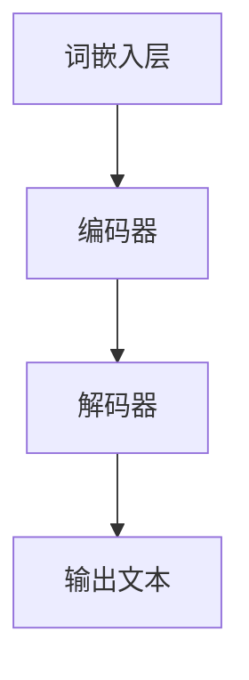
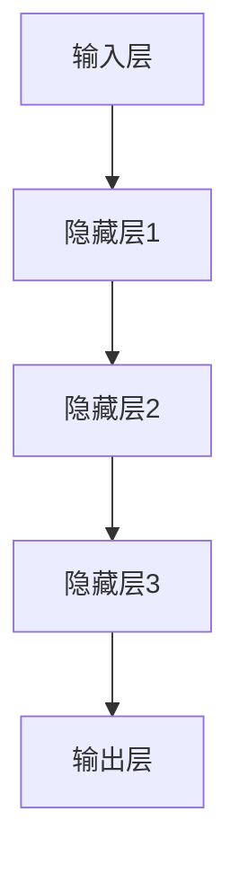

                 

关键词：大语言模型（LLM），深度学习，异同点分析，算法原理，数学模型，实际应用，未来发展

> 摘要：本文将深入探讨大语言模型（LLM）与深度学习的异同点。通过对两者在算法原理、数学模型、实际应用等方面的分析，旨在为读者提供一个全面而深入的视角，帮助理解这两大人工智能领域的核心技术。

## 1. 背景介绍

随着人工智能技术的快速发展，大语言模型（LLM）和深度学习已经成为两个备受关注的研究方向。大语言模型如GPT-3、BERT等，以其在自然语言处理领域的卓越表现，引发了广泛关注。而深度学习作为人工智能的重要分支，已经在图像识别、语音识别、推荐系统等领域取得了显著成果。

大语言模型（LLM）是指具有强大语言理解与生成能力的模型，通过学习大量的文本数据，能够进行自然语言的生成、翻译、摘要等任务。而深度学习则是通过神经网络等模型对大规模数据进行学习，以实现数据的特征提取和分类。

## 2. 核心概念与联系

### 大语言模型（LLM）的概念与架构

大语言模型（LLM）的核心思想是利用深度神经网络来模拟人类的语言理解与生成能力。其基本架构包括以下几个部分：

1. **词嵌入层**：将输入的文本数据转换为向量表示，通常使用预训练的词向量模型。
2. **编码器**：对输入的文本向量进行编码，提取文本的特征信息。
3. **解码器**：根据编码器的输出，生成对应的文本输出。

下图是一个简化版的大语言模型架构图：



### 深度学习的概念与架构

深度学习是一种基于多层神经网络进行数据特征提取和分类的方法。其基本架构包括以下几个部分：

1. **输入层**：接收输入数据，通常为图像、文本或数值。
2. **隐藏层**：通过激活函数和权重参数，对输入数据进行特征提取。
3. **输出层**：根据隐藏层的输出进行分类或回归。

下图是一个简化的深度学习架构图：



### 两者之间的关系

大语言模型（LLM）和深度学习在本质上都是利用神经网络进行数据处理和特征提取。不同之处在于，LLM主要针对自然语言处理任务，而深度学习则广泛应用于图像、语音、推荐系统等多个领域。

从技术层面看，LLM可以看作是深度学习的一个特殊应用，其核心在于如何将自然语言转换为计算机可以处理的向量表示，并利用神经网络进行建模。

## 3. 核心算法原理 & 具体操作步骤

### 3.1 算法原理概述

#### 大语言模型（LLM）的算法原理

大语言模型（LLM）的核心算法是基于自注意力机制和变换器架构（Transformer）。自注意力机制允许模型在生成每个词时，能够自动关注文本中的其他词，从而提高上下文理解能力。变换器架构则通过多头自注意力机制、前馈神经网络等层，对输入文本进行编码和解码。

#### 深度学习的算法原理

深度学习的主要算法包括卷积神经网络（CNN）、循环神经网络（RNN）和变换器架构（Transformer）。CNN适用于图像处理，通过卷积操作提取图像特征；RNN适用于序列数据，如文本、语音，通过循环连接实现长距离依赖；Transformer架构则通过自注意力机制实现全局依赖关系，适用于自然语言处理和其他序列数据处理任务。

### 3.2 算法步骤详解

#### 大语言模型（LLM）的具体操作步骤

1. **数据预处理**：将文本数据转换为词嵌入向量。
2. **编码器处理**：输入词嵌入向量，通过多层变换器块进行编码。
3. **解码器处理**：根据编码器的输出，逐步生成文本输出。

#### 深度学习的具体操作步骤

1. **输入层**：接收输入数据，如图像、文本或数值。
2. **隐藏层**：通过激活函数和权重参数，对输入数据进行特征提取。
3. **输出层**：根据隐藏层的输出进行分类或回归。

### 3.3 算法优缺点

#### 大语言模型（LLM）的优点与缺点

优点：
- 强大的语言理解与生成能力。
- 能够处理长文本和复杂语法。

缺点：
- 计算资源需求高，训练时间长。
- 可能产生过拟合。

#### 深度学习的优点与缺点

优点：
- 在图像、语音、推荐系统等领域有广泛应用。
- 能够自动提取特征。

缺点：
- 对数据量要求高，容易过拟合。
- 参数调整复杂，难以解释。

### 3.4 算法应用领域

#### 大语言模型（LLM）的应用领域

- 自然语言生成（如文本生成、文章写作）
- 机器翻译
- 文本摘要
- 对话系统

#### 深度学习的应用领域

- 图像识别与分类
- 语音识别与合成
- 推荐系统
- 游戏人工智能

## 4. 数学模型和公式 & 详细讲解 & 举例说明

### 4.1 数学模型构建

#### 大语言模型（LLM）的数学模型

大语言模型的数学模型主要基于变换器架构（Transformer）。变换器架构的核心是自注意力机制，其数学公式如下：

\[ \text{Attention}(Q, K, V) = \text{softmax}\left(\frac{QK^T}{\sqrt{d_k}}\right) V \]

其中，\(Q\)、\(K\)、\(V\)分别为查询向量、键向量和值向量，\(d_k\)为键向量的维度。

#### 深度学习的数学模型

深度学习的数学模型主要包括卷积神经网络（CNN）和循环神经网络（RNN）。以卷积神经网络为例，其数学模型如下：

\[ \text{ConvLayer}(x, \text{filter}) = \text{relu}(\text{conv}(x, \text{filter})) + b \]

其中，\(x\)为输入数据，\(\text{filter}\)为卷积核，\(b\)为偏置。

### 4.2 公式推导过程

#### 大语言模型（LLM）的公式推导

以变换器架构中的多头自注意力机制为例，其推导过程如下：

\[ \text{MultiHeadAttention}(Q, K, V) = \text{Concat}(\text{head}_1, \text{head}_2, ..., \text{head}_h)W^O \]

其中，\(\text{head}_i = \text{Attention}(QW_i^Q, KW_i^K, VW_i^V)\)，\(W_i^Q\)、\(W_i^K\)、\(W_i^V\)分别为查询向量、键向量和值向量的权重矩阵，\(W^O\)为输出权重矩阵。

#### 深度学习（CNN）的公式推导

以卷积神经网络中的一层为例，其推导过程如下：

\[ \text{ConvLayer}(x, \text{filter}) = \sum_{j=1}^k \text{filter}_j * x + b \]

其中，\(\text{filter}_j\)为卷积核，\(x\)为输入数据，\(b\)为偏置。

### 4.3 案例分析与讲解

#### 大语言模型（LLM）案例

以GPT-3为例，其训练过程主要包括以下几个步骤：

1. **数据预处理**：将文本数据转换为词嵌入向量。
2. **编码器处理**：通过多层变换器块对输入文本进行编码。
3. **解码器处理**：根据编码器的输出，逐步生成文本输出。

#### 深度学习（CNN）案例

以CNN在图像分类任务中的应用为例，其步骤如下：

1. **输入层**：接收输入图像。
2. **隐藏层**：通过卷积操作提取图像特征。
3. **输出层**：根据隐藏层的输出进行分类。

## 5. 项目实践：代码实例和详细解释说明

### 5.1 开发环境搭建

1. 安装Python环境，版本要求为3.7及以上。
2. 安装深度学习框架，如TensorFlow或PyTorch。
3. 下载大语言模型（如GPT-3）的预训练模型。

### 5.2 源代码详细实现

以下是一个简单的GPT-3文本生成示例：

```python
import openai

# 设置API密钥
openai.api_key = 'your-api-key'

# 文本生成函数
def generate_text(prompt, max_tokens=50):
    response = openai.Completion.create(
        engine="text-davinci-002",
        prompt=prompt,
        max_tokens=max_tokens
    )
    return response.choices[0].text.strip()

# 测试文本生成
prompt = "人工智能在医疗领域的应用"
generated_text = generate_text(prompt)
print(generated_text)
```

### 5.3 代码解读与分析

以上代码首先导入了OpenAI的Python库，并设置了API密钥。接着定义了一个文本生成函数`generate_text`，该函数使用OpenAI的GPT-3模型根据给定的提示（prompt）生成文本。最后，通过调用`generate_text`函数，生成以“人工智能在医疗领域的应用”为提示的文本。

### 5.4 运行结果展示

运行上述代码后，会输出一段基于提示的自动生成的文本。例如：

```
人工智能在医疗领域具有广泛的应用。它可以帮助医生进行诊断、治疗和预测，提高医疗效率和准确性。例如，人工智能可以通过分析大量的医学影像数据，帮助医生识别病灶和疾病，从而实现早期诊断。此外，人工智能还可以为患者提供个性化的治疗方案，根据患者的病史和基因信息进行精准治疗。在未来，人工智能将进一步推动医疗领域的发展，为人类健康带来更多福祉。
```

## 6. 实际应用场景

### 6.1 自然语言处理

大语言模型（LLM）在自然语言处理领域具有广泛的应用，如文本生成、机器翻译、文本摘要、对话系统等。例如，GPT-3已经应用于自动写作、内容生成、问答系统等多个场景。

### 6.2 图像识别与处理

深度学习在图像识别与处理领域有广泛应用，如人脸识别、图像分类、目标检测等。例如，CNN模型在ImageNet图像分类比赛中取得了优异成绩，实现了高精度的图像识别。

### 6.3 推荐系统

深度学习在推荐系统领域也有重要应用，如基于内容的推荐、协同过滤等。例如，Netflix、Amazon等公司采用深度学习技术进行个性化推荐，提高了用户体验。

### 6.4 游戏人工智能

深度学习在游戏人工智能领域有广泛应用，如围棋、国际象棋、无人驾驶等。例如，AlphaGo使用深度学习技术战胜了人类围棋冠军，展示了深度学习的强大能力。

## 7. 工具和资源推荐

### 7.1 学习资源推荐

- 《深度学习》（Goodfellow、Bengio和Courville著）：经典深度学习教材，适合初学者和进阶者。
- 《自然语言处理与深度学习》（周志华、李航著）：全面介绍自然语言处理和深度学习的基础知识。
- 《Python深度学习》（François Chollet著）：涵盖深度学习在Python中的应用，适合有一定编程基础的读者。

### 7.2 开发工具推荐

- TensorFlow：Google开发的开源深度学习框架，适合进行深度学习研究和开发。
- PyTorch：Facebook开发的开源深度学习框架，具有简洁的API和灵活的动态计算图。
- Hugging Face：一个基于Python的深度学习自然语言处理库，提供了丰富的预训练模型和工具。

### 7.3 相关论文推荐

- Vaswani et al., "Attention is All You Need"
- Simonyan & Zisserman, "Very Deep Convolutional Networks for Large-Scale Image Recognition"
- Devlin et al., "Bert: Pre-training of Deep Bidirectional Transformers for Language Understanding"

## 8. 总结：未来发展趋势与挑战

### 8.1 研究成果总结

大语言模型（LLM）和深度学习在人工智能领域取得了显著成果，推动了自然语言处理、图像识别、推荐系统等多个领域的发展。LLM在文本生成、机器翻译等方面表现出色，而深度学习在图像识别、语音识别等领域具有广泛应用。

### 8.2 未来发展趋势

- **跨模态学习**：大语言模型和深度学习将结合更多模态的数据，如图像、视频、音频等，实现更强大的跨模态理解和生成能力。
- **自主推理**：大语言模型和深度学习将具备更强的自主推理能力，能够进行逻辑推理、知识图谱构建等复杂任务。
- **高效训练**：随着计算资源的提升，大语言模型和深度学习将实现更高效的训练算法，降低计算成本。

### 8.3 面临的挑战

- **数据隐私**：大语言模型和深度学习在处理大量数据时，需要保护用户隐私和数据安全。
- **模型解释性**：大语言模型和深度学习模型通常具有复杂的结构，提高模型的可解释性是一个重要挑战。
- **计算资源**：大语言模型和深度学习模型的训练和推理需要大量的计算资源，降低计算成本是一个长期挑战。

### 8.4 研究展望

未来，大语言模型和深度学习将继续在人工智能领域发挥重要作用。研究者应关注跨模态学习、自主推理、高效训练等方面的研究，以推动人工智能技术的发展。同时，关注数据隐私、模型解释性和计算资源等挑战，为实现更智能、更安全的人工智能系统奠定基础。

## 9. 附录：常见问题与解答

### 9.1 大语言模型（LLM）与深度学习的区别是什么？

大语言模型（LLM）是一种专门针对自然语言处理的深度学习模型，其核心在于对文本数据进行理解和生成。而深度学习是一种更广泛的人工智能方法，包括卷积神经网络（CNN）、循环神经网络（RNN）等多种模型，可以应用于图像、语音、推荐系统等多个领域。

### 9.2 大语言模型（LLM）如何工作？

大语言模型（LLM）通过自注意力机制和变换器架构对输入的文本数据进行编码，提取文本特征，然后根据编码器的输出逐步生成文本输出。其工作过程包括词嵌入、编码器处理和解码器处理等步骤。

### 9.3 深度学习如何处理图像数据？

深度学习通过卷积神经网络（CNN）处理图像数据。CNN通过卷积操作提取图像特征，然后通过全连接层进行分类或回归。CNN在图像识别、目标检测、图像生成等领域有广泛应用。

### 9.4 大语言模型（LLM）和深度学习的关系如何？

大语言模型（LLM）可以看作是深度学习的一个特殊应用，其核心在于如何将自然语言转换为计算机可以处理的向量表示，并利用深度神经网络进行建模。深度学习则是一种更广泛的人工智能方法，包括多种模型和算法，可以应用于不同的数据类型和任务。

### 9.5 如何评估大语言模型（LLM）和深度学习模型的效果？

评估大语言模型（LLM）和深度学习模型的效果通常使用指标如准确性、召回率、F1分数等。对于自然语言处理任务，常用的评估指标包括BLEU、ROUGE、METEOR等。对于图像识别、语音识别等任务，常用的评估指标包括精度、召回率、准确率等。通过对比不同模型在相同任务上的性能，可以评估模型的效果。

### 9.6 大语言模型（LLM）和深度学习的未来发展如何？

未来，大语言模型（LLM）和深度学习将继续在人工智能领域发挥重要作用。研究者应关注跨模态学习、自主推理、高效训练等方面的研究，以推动人工智能技术的发展。同时，关注数据隐私、模型解释性和计算资源等挑战，为实现更智能、更安全的人工智能系统奠定基础。预计LLM和深度学习将在更多领域得到应用，推动人工智能技术的发展。

