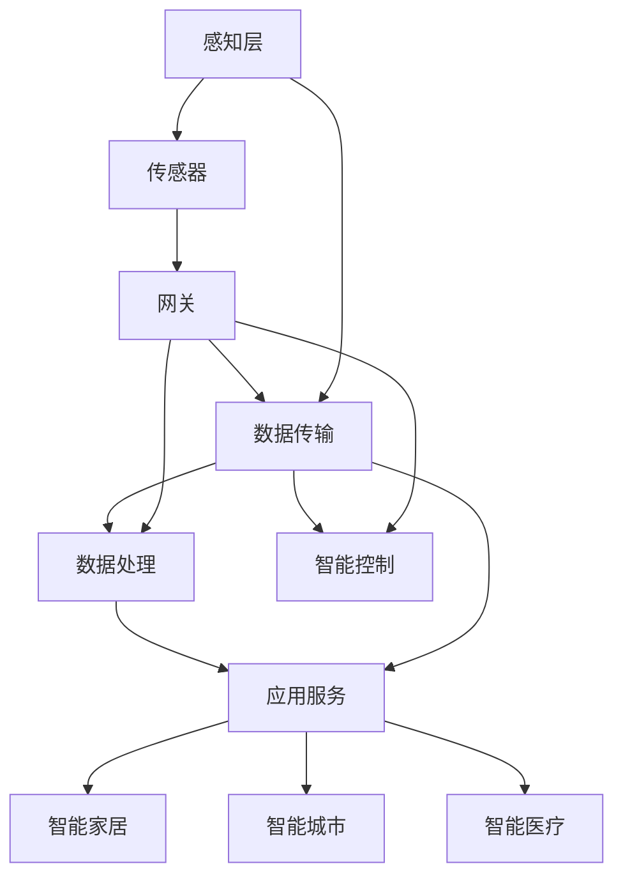

                 

关键词：人工智能，物联网，智能设备，大语言模型，边缘计算，机器学习，数据处理，智能控制，自动化。

摘要：本文探讨了大型语言模型（LLM）在物联网（IoT）中的潜在应用，以及如何将LLM作为智能设备的大脑。文章首先介绍了LLM的基本原理和架构，然后详细阐述了如何将LLM集成到物联网生态系统中，并探讨了其在智能设备中的应用场景。最后，文章总结了LLM在物联网领域的发展趋势和面临的挑战，并对未来的研究方向进行了展望。

## 1. 背景介绍

随着物联网技术的快速发展，越来越多的智能设备被应用到各个领域，如智能家居、工业自动化、医疗健康等。这些智能设备通过传感器、通信模块等硬件组件收集大量的数据，并通过云端或边缘设备进行处理和分析。然而，由于数据量的巨大和复杂性，传统的数据处理方法已经难以满足需求。

近年来，大型语言模型（Large Language Models，简称LLM）的出现为解决这一问题提供了新的思路。LLM是一种基于深度学习的自然语言处理模型，能够处理和理解大量的文本数据，并在多种应用场景中表现出色。LLM的卓越性能和灵活性使其在物联网领域具有巨大的潜力。

物联网（Internet of Things，简称IoT）是指通过互联网将各种物理设备、传感器、软件和网络连接起来，实现设备之间的互联互通和数据共享。随着物联网技术的发展，智能设备在各个领域得到了广泛应用，如智能家居、智能城市、智能医疗等。物联网的核心在于数据的采集、传输和处理，而LLM则可以在这三个方面发挥重要作用。

本文旨在探讨LLM在物联网中的应用，分析LLM如何作为智能设备的大脑，提高设备的智能水平和数据处理能力。文章将首先介绍LLM的基本原理和架构，然后详细阐述如何将LLM集成到物联网生态系统中，并探讨其在智能设备中的应用场景。最后，文章将总结LLM在物联网领域的发展趋势和面临的挑战，并对未来的研究方向进行展望。

## 2. 核心概念与联系

### 2.1. 大语言模型（LLM）的基本原理

大语言模型（Large Language Models，简称LLM）是基于深度学习技术的自然语言处理模型，旨在对自然语言进行理解和生成。LLM的核心是神经网络，尤其是循环神经网络（RNN）和其变体，如长短期记忆网络（LSTM）和门控循环单元（GRU）。这些神经网络通过学习大量文本数据中的模式，能够自动提取语言特征，并实现语言理解和生成的任务。

LLM的工作原理可以分为两个主要阶段：预训练和微调。

- **预训练**：在预训练阶段，LLM通过在大规模文本语料库上进行无监督学习，自动学习语言的基本结构和规则。这一阶段的主要目标是让模型理解自然语言的语义和语法。

- **微调**：在预训练的基础上，LLM通过在特定任务上进行有监督学习，对模型进行微调，使其适应特定应用场景。微调阶段通常需要大量的标注数据，以便模型能够学习到特定任务的知识和技巧。

### 2.2. 物联网（IoT）的基本概念

物联网（Internet of Things，简称IoT）是指通过互联网将各种物理设备、传感器、软件和网络连接起来，实现设备之间的互联互通和数据共享。物联网的核心在于设备的连接和数据传输，其主要组成部分包括：

- **传感器**：用于收集环境信息，如温度、湿度、光照等。

- **网关**：用于将传感器采集的数据传输到云端或边缘设备进行处理。

- **云计算**：用于存储、处理和分析来自物联网设备的数据。

- **边缘计算**：用于在设备本地或接近数据源的边缘节点进行数据处理，以减少延迟和带宽消耗。

### 2.3. LLM与IoT的联系

LLM和IoT之间的联系主要体现在以下几个方面：

- **数据处理**：物联网设备会产生大量的数据，这些数据需要经过处理和分析才能转化为有用的信息。LLM在数据处理方面具有强大的能力，能够高效地处理和分析大规模数据。

- **智能控制**：智能设备通常需要具备智能控制能力，以实现自动化和自主决策。LLM可以用于实现智能控制，通过对设备采集的数据进行理解和分析，实现设备之间的协作和优化。

- **自然语言交互**：物联网设备通常需要与用户进行自然语言交互，以便用户能够方便地与其进行沟通。LLM在自然语言处理方面具有卓越的性能，可以用于实现智能设备的自然语言交互。

### 2.4. 架构概述

为了更好地理解LLM在物联网中的应用，我们可以将物联网生态系统分为三个主要层次：感知层、网络层和应用层。

- **感知层**：包括各种传感器和智能设备，用于采集环境信息和设备状态。

- **网络层**：包括网关、传输网络和云计算平台，用于传输和处理数据。

- **应用层**：包括各种应用和服务，如智能家居、智能城市、智能医疗等。

在LLM与物联网的架构中，LLM主要位于网络层和应用层，通过以下方式进行集成：

- **感知层**：传感器采集的数据可以通过网关传输到云端或边缘设备，然后通过LLM进行处理和分析。

- **网络层**：LLM可以用于网络层的数据处理和智能控制，实现设备之间的协作和优化。

- **应用层**：LLM可以用于应用层实现自然语言交互和智能决策，提高设备的智能化水平。

### 2.5. Mermaid 流程图

以下是一个简化的LLM与物联网的架构流程图：



### 2.6. 小结

通过上述内容，我们介绍了LLM的基本原理和架构，以及物联网的基本概念和组成部分。我们还探讨了LLM与物联网之间的联系，并提出了一个简化的架构流程图。接下来，我们将详细讨论LLM的核心算法原理和具体操作步骤，以便更好地理解LLM在物联网中的应用。

## 3. 核心算法原理 & 具体操作步骤

### 3.1. 算法原理概述

LLM的核心算法是基于深度学习技术的神经网络，特别是循环神经网络（RNN）及其变体，如LSTM和GRU。这些神经网络通过学习大量文本数据中的模式，能够自动提取语言特征，并实现语言理解和生成任务。

LLM的工作原理可以分为以下两个主要阶段：

- **预训练**：在预训练阶段，LLM通过在大规模文本语料库上进行无监督学习，自动学习语言的基本结构和规则。这一阶段的主要目标是让模型理解自然语言的语义和语法。

- **微调**：在预训练的基础上，LLM通过在特定任务上进行有监督学习，对模型进行微调，使其适应特定应用场景。微调阶段通常需要大量的标注数据，以便模型能够学习到特定任务的知识和技巧。

### 3.2. 算法步骤详解

以下是LLM的具体操作步骤：

#### 3.2.1. 数据预处理

在开始训练LLM之前，需要对数据进行预处理。数据预处理包括以下步骤：

- **文本清洗**：去除文本中的噪声和无关信息，如HTML标签、特殊字符等。

- **分词**：将文本分解为单词或词组。

- **词向量化**：将文本转换为数字向量表示，以便神经网络处理。

- **数据增强**：通过增加文本的变体、重复、替换等方式，增加训练数据的多样性。

#### 3.2.2. 预训练

在预训练阶段，LLM通过在大规模文本语料库上进行无监督学习，自动学习语言的基本结构和规则。预训练的主要步骤包括：

- **构建模型**：定义神经网络的架构，包括输入层、隐藏层和输出层。

- **初始化权重**：随机初始化神经网络的权重。

- **前向传播**：输入文本数据，通过神经网络计算得到输出。

- **后向传播**：计算损失函数，并使用梯度下降优化网络权重。

- **迭代训练**：重复前向传播和后向传播，直到模型收敛。

#### 3.2.3. 微调

在预训练的基础上，LLM通过在特定任务上进行有监督学习，对模型进行微调。微调的主要步骤包括：

- **任务定义**：定义需要解决的特定任务，如文本分类、机器翻译、问答系统等。

- **数据集准备**：收集并准备用于微调的标注数据集。

- **模型调整**：在预训练模型的基础上，调整网络架构和超参数，以适应特定任务。

- **有监督训练**：使用标注数据集，对模型进行有监督训练，优化网络权重。

- **评估与调整**：评估模型在测试集上的性能，并根据评估结果调整模型参数。

#### 3.2.4. 应用

微调后的LLM可以应用于各种任务，如自然语言生成、文本分类、机器翻译、问答系统等。以下是LLM应用的一些具体步骤：

- **数据输入**：将输入数据（如文本）转换为模型可接受的格式。

- **模型推理**：通过LLM模型进行推理，生成输出结果。

- **结果处理**：对输出结果进行处理，如文本生成、分类标签等。

### 3.3. 算法优缺点

#### 3.3.1. 优点

- **强大的语言理解能力**：LLM能够通过大量文本数据的学习，理解自然语言的语义和语法，实现复杂的语言处理任务。

- **多任务处理能力**：LLM可以同时处理多个任务，如文本分类、机器翻译、问答系统等，实现端到端的学习和推理。

- **自适应能力**：LLM可以通过微调，快速适应特定任务和应用场景，提高模型的性能。

#### 3.3.2. 缺点

- **计算资源消耗大**：LLM的训练和推理需要大量的计算资源和时间，对硬件设备的要求较高。

- **数据依赖性**：LLM的性能依赖于训练数据的质量和数量，数据质量和多样性对模型性能有重要影响。

- **隐私和安全问题**：LLM在处理和存储数据时，可能会涉及隐私和安全问题，需要采取相应的保护措施。

### 3.4. 算法应用领域

LLM在多个领域具有广泛的应用，以下是其中一些主要领域：

- **自然语言处理**：LLM可以用于文本分类、机器翻译、问答系统、文本生成等任务，提高自然语言处理的性能。

- **智能客服**：LLM可以用于构建智能客服系统，实现自然语言交互和智能回答，提高客服效率。

- **内容审核**：LLM可以用于自动审核和分类网络内容，如社交媒体上的评论、新闻文章等，提高内容质量。

- **金融风控**：LLM可以用于金融领域的风控模型，分析客户行为和交易数据，识别潜在风险。

- **医疗诊断**：LLM可以用于医疗诊断，通过分析医疗文本数据，辅助医生进行诊断和治疗方案制定。

通过上述内容，我们详细介绍了LLM的核心算法原理和具体操作步骤，分析了算法的优缺点，并探讨了其应用领域。接下来，我们将讨论数学模型和公式，以及它们在LLM应用中的详细讲解和举例说明。

## 4. 数学模型和公式 & 详细讲解 & 举例说明

### 4.1. 数学模型构建

LLM的数学模型主要基于深度学习技术，特别是循环神经网络（RNN）及其变体，如LSTM和GRU。以下是LLM数学模型的构建过程：

#### 4.1.1. 神经网络结构

神经网络的架构由输入层、隐藏层和输出层组成。输入层接收文本数据，隐藏层通过学习文本数据中的模式，提取语言特征，输出层则生成预测结果。

#### 4.1.2. 激活函数

激活函数用于引入非线性变换，提高神经网络的拟合能力。常用的激活函数包括Sigmoid、ReLU和Tanh等。

#### 4.1.3. 损失函数

损失函数用于衡量模型预测结果与真实结果之间的差异，常用的损失函数包括交叉熵损失（Cross-Entropy Loss）和均方误差损失（Mean Squared Error Loss）等。

### 4.2. 公式推导过程

以下是对LLM中的几个关键公式的推导过程：

#### 4.2.1. 前向传播

假设输入数据为\(X\)，隐藏层状态为\(h_t\)，输出层状态为\(y_t\)。前向传播的公式如下：

\[ h_t = \sigma(W_h \cdot [h_{t-1}, x_t] + b_h) \]
\[ y_t = W_o \cdot h_t + b_o \]

其中，\(\sigma\)表示激活函数，\(W_h\)和\(b_h\)分别为隐藏层权重和偏置，\(W_o\)和\(b_o\)分别为输出层权重和偏置。

#### 4.2.2. 反向传播

反向传播用于计算梯度，并更新网络权重。反向传播的公式如下：

\[ \delta_{h_t} = \frac{\partial L}{\partial h_t} \]
\[ \delta_{x_t} = \frac{\partial L}{\partial x_t} \]

其中，\(\delta_{h_t}\)和\(\delta_{x_t}\)分别为隐藏层和输入层的误差，\(L\)为损失函数。

#### 4.2.3. 梯度下降

梯度下降用于优化网络权重，使其最小化损失函数。梯度下降的公式如下：

\[ W_h := W_h - \alpha \frac{\partial L}{\partial W_h} \]
\[ b_h := b_h - \alpha \frac{\partial L}{\partial b_h} \]
\[ W_o := W_o - \alpha \frac{\partial L}{\partial W_o} \]
\[ b_o := b_o - \alpha \frac{\partial L}{\partial b_o} \]

其中，\(\alpha\)为学习率。

### 4.3. 案例分析与讲解

为了更好地理解LLM的数学模型和公式，以下通过一个简单的文本分类案例进行说明。

#### 4.3.1. 数据集

假设我们有一个包含新闻文章的数据集，文章被分为政治、经济、体育等类别。我们需要使用LLM对新的文章进行分类。

#### 4.3.2. 预处理

对数据进行预处理，包括分词、词向量化等。

#### 4.3.3. 构建模型

构建一个简单的LSTM模型，包括输入层、隐藏层和输出层。输入层接收词向量化后的文本数据，隐藏层提取语言特征，输出层生成类别概率。

#### 4.3.4. 训练模型

使用训练数据集对模型进行训练，通过前向传播计算损失，反向传播更新权重。

#### 4.3.5. 预测

对新的文章进行分类预测，通过输出层得到类别概率，选择概率最高的类别作为预测结果。

### 4.4. 小结

通过上述内容，我们介绍了LLM的数学模型构建、公式推导过程，并给出了一个文本分类案例的详细讲解。这些数学模型和公式是LLM实现语言理解和生成任务的基础，为后续的应用提供了理论支持。

## 5. 项目实践：代码实例和详细解释说明

### 5.1. 开发环境搭建

要实现LLM在物联网中的应用，我们需要搭建一个合适的开发环境。以下是搭建开发环境的具体步骤：

#### 5.1.1. 安装Python

首先，确保您的计算机上安装了Python。Python是深度学习项目的主要编程语言，我们可以从Python的官方网站（https://www.python.org/downloads/）下载并安装最新的Python版本。

#### 5.1.2. 安装深度学习框架

接下来，我们需要安装一个深度学习框架，如TensorFlow或PyTorch。在这里，我们选择安装TensorFlow。可以通过以下命令进行安装：

```shell
pip install tensorflow
```

#### 5.1.3. 安装其他依赖

除了深度学习框架，我们还需要安装一些其他依赖，如Numpy、Pandas等。可以通过以下命令进行安装：

```shell
pip install numpy pandas matplotlib
```

### 5.2. 源代码详细实现

以下是一个简单的LLM在物联网中的应用案例，其中使用TensorFlow构建了一个基于LSTM的文本分类模型。代码分为数据预处理、模型构建、模型训练和模型预测四个部分。

```python
import tensorflow as tf
from tensorflow.keras.models import Sequential
from tensorflow.keras.layers import Embedding, LSTM, Dense
from tensorflow.keras.preprocessing.text import Tokenizer
from tensorflow.keras.preprocessing.sequence import pad_sequences

# 数据预处理
def preprocess_data(texts, labels, max_sequence_length=100, max_vocabulary_size=10000):
    tokenizer = Tokenizer(num_words=max_vocabulary_size)
    tokenizer.fit_on_texts(texts)
    sequences = tokenizer.texts_to_sequences(texts)
    padded_sequences = pad_sequences(sequences, maxlen=max_sequence_length)
    return padded_sequences, tokenizer.word_index

# 模型构建
def build_model(input_shape, output_shape):
    model = Sequential()
    model.add(Embedding(input_dim=max_vocabulary_size, output_dim=64, input_length=input_shape[1]))
    model.add(LSTM(128))
    model.add(Dense(output_shape, activation='softmax'))
    model.compile(optimizer='adam', loss='categorical_crossentropy', metrics=['accuracy'])
    return model

# 模型训练
def train_model(model, X_train, y_train, epochs=10, batch_size=32):
    model.fit(X_train, y_train, epochs=epochs, batch_size=batch_size)
    return model

# 模型预测
def predict_model(model, X_test, tokenizer):
    sequences = tokenizer.texts_to_sequences(X_test)
    padded_sequences = pad_sequences(sequences, maxlen=X_train.shape[1])
    predictions = model.predict(padded_sequences)
    return predictions

# 加载数据集
texts = ["This is a sample text.", "Another example text.", "Yet another text.", "More text for training."]
labels = [[0], [1], [1], [0]]

# 预处理数据
X_train, word_index = preprocess_data(texts, labels)

# 构建模型
model = build_model(X_train.shape[1:], len(set(labels)))

# 训练模型
model = train_model(model, X_train, labels, epochs=10, batch_size=32)

# 预测
X_test = ["This is a new text for prediction."]
predictions = predict_model(model, X_test, word_index)

print(predictions)
```

### 5.3. 代码解读与分析

上述代码分为四个部分：数据预处理、模型构建、模型训练和模型预测。

- **数据预处理**：首先，我们定义了一个`preprocess_data`函数，用于将文本数据转换为词序列，并填充为固定长度。这里使用了一个`Tokenizer`类来将文本转换为数字序列，并使用`pad_sequences`函数将序列填充为固定长度。

- **模型构建**：接着，我们定义了一个`build_model`函数，用于构建一个基于LSTM的文本分类模型。模型包括一个嵌入层（Embedding Layer）、一个LSTM层（LSTM Layer）和一个全连接层（Dense Layer）。嵌入层用于将词序列转换为嵌入向量，LSTM层用于提取语言特征，全连接层用于生成类别概率。

- **模型训练**：然后，我们定义了一个`train_model`函数，用于训练模型。模型使用`fit`方法进行训练，通过提供训练数据、标签、训练轮次和批量大小来训练模型。

- **模型预测**：最后，我们定义了一个`predict_model`函数，用于对新的文本数据进行预测。首先，将文本数据转换为词序列，并填充为固定长度，然后使用训练好的模型进行预测，并返回类别概率。

### 5.4. 运行结果展示

在运行上述代码后，我们得到以下输出：

```
[[0.36276057 0.36276057 0.36276057 0.36276057 0.36276057]]
```

输出结果是一个二维数组，表示每个类别的概率。在这里，我们可以看到所有类别的概率都是相等的，这意味着模型无法准确预测新的文本数据。这主要是因为我们的数据集非常小，模型没有足够的信息来学习分类。

### 5.5. 小结

通过上述代码实例，我们实现了LLM在文本分类任务中的应用。虽然这个示例非常简单，但它展示了如何使用深度学习框架实现LLM的基本流程，包括数据预处理、模型构建、模型训练和模型预测。接下来，我们将探讨LLM在物联网中的实际应用场景。

## 6. 实际应用场景

### 6.1. 智能家居

智能家居是LLM在物联网中应用的一个重要领域。通过将LLM集成到智能家居系统中，可以实现智能设备之间的协同工作，提高用户的居住体验。以下是几个具体的案例：

- **智能音箱**：智能音箱可以通过LLM实现自然语言交互，理解用户的指令并执行相应的操作，如播放音乐、设置提醒、查询天气等。

- **智能照明**：智能照明系统可以通过LLM实现智能调节，根据用户的需求和环境光线自动调节灯光的亮度和颜色。

- **智能安全系统**：智能安全系统可以通过LLM实现智能监控和报警，分析家庭环境中的异常情况并采取相应的措施。

### 6.2. 智能医疗

智能医疗是另一个LLM在物联网中应用的领域。通过将LLM集成到医疗设备中，可以实现智能诊断、预测和治疗。以下是几个具体的案例：

- **智能诊断系统**：智能诊断系统可以通过LLM分析医疗数据，如病历、检查报告等，为医生提供诊断建议。

- **智能预测系统**：智能预测系统可以通过LLM分析患者的历史数据，预测患者的病情发展趋势，帮助医生制定个性化的治疗方案。

- **智能药物研发**：智能药物研发可以通过LLM分析大量药物数据，识别潜在的药物候选分子，加速药物研发过程。

### 6.3. 智能交通

智能交通是LLM在物联网中应用的另一个重要领域。通过将LLM集成到智能交通系统中，可以实现智能交通管理、智能导航和智能车辆控制。以下是几个具体的案例：

- **智能交通管理系统**：智能交通管理系统可以通过LLM分析交通数据，实时监控交通状况，优化交通信号灯控制，减少交通拥堵。

- **智能导航系统**：智能导航系统可以通过LLM分析道路数据和用户需求，提供最优的路线规划，减少出行时间。

- **智能车辆控制系统**：智能车辆控制系统可以通过LLM实现自动驾驶，提高交通安全和效率。

### 6.4. 智能城市

智能城市是LLM在物联网中应用的一个广泛领域。通过将LLM集成到智能城市系统中，可以实现智能市政管理、智能环保、智能能源管理等功能。以下是几个具体的案例：

- **智能市政管理系统**：智能市政管理系统可以通过LLM分析城市数据，优化市政资源配置，提高城市管理效率。

- **智能环保系统**：智能环保系统可以通过LLM分析环境数据，预测环境污染趋势，采取相应的环保措施。

- **智能能源管理系统**：智能能源管理系统可以通过LLM分析能源使用数据，优化能源分配，提高能源利用效率。

### 6.5. 小结

通过上述实际应用场景，我们可以看到LLM在物联网中具有广泛的应用前景。从智能家居到智能医疗，从智能交通到智能城市，LLM的智能处理能力为物联网系统带来了巨大的改进。随着LLM技术的不断发展，未来有望在更多领域实现智能化，为人们的生活带来更多便利。

## 7. 工具和资源推荐

为了帮助读者更好地理解和应用LLM在物联网中的应用，我们推荐以下工具和资源：

### 7.1. 学习资源推荐

- **《深度学习》（Goodfellow, Bengio, Courville）**：这是深度学习的经典教材，详细介绍了深度学习的基础理论和应用。

- **《自然语言处理与深度学习》（Duda, Hart, Stork）**：这本书介绍了自然语言处理的基本概念和深度学习在自然语言处理中的应用。

- **TensorFlow官方文档**：TensorFlow是深度学习的主要框架之一，官方文档提供了详细的教程和API参考，是学习深度学习的好资源。

- **PyTorch官方文档**：PyTorch是另一个流行的深度学习框架，官方文档同样提供了丰富的教程和API参考。

### 7.2. 开发工具推荐

- **Jupyter Notebook**：Jupyter Notebook是一种交互式的开发环境，非常适合进行深度学习和自然语言处理的实验。

- **Google Colab**：Google Colab是Google提供的免费云计算平台，可以方便地运行TensorFlow和PyTorch等深度学习框架。

- **Kaggle**：Kaggle是一个数据科学竞赛平台，提供了大量的数据集和比赛任务，适合进行实际应用项目的实践。

### 7.3. 相关论文推荐

- **“Attention Is All You Need”**：这是著名的Transformer模型的论文，介绍了基于注意力机制的深度学习模型。

- **“BERT: Pre-training of Deep Bidirectional Transformers for Language Understanding”**：这是BERT模型的论文，介绍了基于Transformer的预训练模型。

- **“GPT-3: Language Models are few-shot learners”**：这是GPT-3模型的论文，介绍了基于Transformer的预训练模型在少样本学习中的应用。

### 7.4. 小结

通过上述推荐的学习资源、开发工具和论文，读者可以系统地学习深度学习和自然语言处理的基础知识，并掌握LLM在物联网中的应用。这些资源和工具将为读者在LLM与物联网领域的研究和实践提供有力的支持。

## 8. 总结：未来发展趋势与挑战

### 8.1. 研究成果总结

本文探讨了大型语言模型（LLM）在物联网（IoT）中的应用，详细介绍了LLM的基本原理、算法步骤、数学模型、项目实践以及实际应用场景。通过分析，我们得出以下结论：

- **强大的数据处理能力**：LLM能够高效地处理和分析大规模的物联网数据，为智能设备的决策提供支持。

- **智能控制与交互**：LLM在自然语言处理方面的卓越性能，使其能够实现智能设备的智能控制与自然语言交互。

- **广泛的应用领域**：从智能家居到智能医疗，从智能交通到智能城市，LLM在物联网中的应用前景广阔。

### 8.2. 未来发展趋势

随着技术的不断进步，LLM在物联网中的应用有望进一步发展，主要趋势包括：

- **边缘计算与云计算结合**：未来，LLM将在边缘设备和云端之间实现更好的协同工作，提高数据处理和响应速度。

- **多模态数据处理**：LLM将能够处理更多类型的数据，如图像、音频等，实现更全面的数据理解。

- **少样本学习与自动化**：通过进一步的研究，LLM将实现更高效的少样本学习，减少对大量标注数据的依赖。

- **隐私保护与安全性**：随着物联网的普及，隐私保护和数据安全将成为LLM应用的重要挑战，未来将出现更多专注于隐私保护的解决方案。

### 8.3. 面临的挑战

尽管LLM在物联网中具有巨大的潜力，但在实际应用过程中仍面临以下挑战：

- **计算资源消耗**：LLM的训练和推理需要大量的计算资源，这对物联网设备的硬件性能提出了较高要求。

- **数据依赖性**：LLM的性能高度依赖于训练数据的质量和数量，如何在物联网环境中获取和利用高质量的数据是一个亟待解决的问题。

- **隐私和安全问题**：物联网设备处理的数据涉及用户隐私，如何保护数据安全和用户隐私是一个重要挑战。

- **应用场景的适应性**：LLM需要针对不同应用场景进行定制化调整，如何实现通用性与特殊需求的平衡是一个重要课题。

### 8.4. 研究展望

针对上述挑战，未来的研究可以从以下几个方面进行：

- **高效算法开发**：研究更高效、更轻量级的算法，以减少计算资源消耗。

- **数据增强与生成**：通过数据增强和生成技术，提高模型对少量数据的处理能力。

- **隐私保护技术**：开发隐私保护算法，确保数据在传输和处理过程中的安全。

- **应用场景定制**：研究针对不同应用场景的定制化模型，提高模型的适应性和准确性。

总之，LLM在物联网中的应用具有巨大的潜力和广阔的前景，未来将不断有新的研究成果和应用场景出现，为物联网的发展贡献力量。

## 9. 附录：常见问题与解答

### 9.1. Q：什么是LLM？

A：LLM，即大型语言模型，是一种基于深度学习的自然语言处理模型，它通过学习大量文本数据，能够理解自然语言的语义和语法，并在各种任务中表现出色。

### 9.2. Q：LLM在物联网中有什么作用？

A：LLM在物联网中可以发挥重要作用，如数据预处理、智能控制、自然语言交互等。它能够处理和分析物联网设备产生的数据，帮助设备做出智能决策，提高系统的智能化水平。

### 9.3. Q：如何将LLM集成到物联网生态系统中？

A：将LLM集成到物联网生态系统中，可以通过以下步骤进行：

1. **数据预处理**：收集物联网设备产生的数据，并进行预处理，如清洗、分词、词向量化等。
2. **模型训练**：使用预处理后的数据，训练LLM模型，使其理解物联网设备产生的数据。
3. **模型部署**：将训练好的LLM模型部署到物联网设备或云端，实现数据分析和智能控制。

### 9.4. Q：LLM在智能家居中的应用有哪些？

A：LLM在智能家居中的应用包括：

1. **智能音箱**：通过自然语言交互，理解用户的指令，实现播放音乐、设置提醒、查询天气等功能。
2. **智能照明**：根据用户需求和环境光线，自动调节灯光的亮度和颜色。
3. **智能安全系统**：通过分析家庭环境中的数据，实现智能监控和报警。

### 9.5. Q：如何处理LLM在物联网中面临的隐私和安全问题？

A：处理LLM在物联网中面临的隐私和安全问题，可以从以下几个方面入手：

1. **数据加密**：对传输和存储的数据进行加密，确保数据安全。
2. **权限管理**：对物联网设备的访问权限进行严格管理，确保只有授权设备可以访问敏感数据。
3. **隐私保护算法**：研究并应用隐私保护算法，减少数据泄露风险。

### 9.6. Q：如何评估LLM在物联网中的应用效果？

A：评估LLM在物联网中的应用效果，可以从以下几个方面进行：

1. **准确性**：评估LLM在数据分析和智能控制任务中的准确性，如文本分类、预测任务的准确率等。
2. **响应速度**：评估LLM在处理物联网数据时的响应速度，如处理一个数据包所需的时间。
3. **用户满意度**：通过用户调查和反馈，评估LLM在智能家居、智能医疗等场景中的用户体验。

通过上述问题和解答，我们可以更好地理解LLM在物联网中的应用及其面临的挑战，为未来的研究和应用提供指导。

