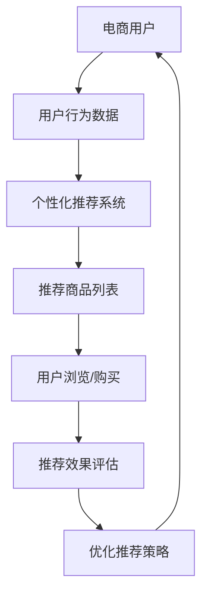

                 

关键词：大型语言模型（LLM），电子商务，在线购物，用户体验，个性化推荐，自动化客服，数据隐私

> 摘要：随着人工智能技术的飞速发展，大型语言模型（LLM）逐渐成为电子商务领域的重要工具。本文将探讨LLM如何通过个性化推荐、自动化客服和智能搜索等功能，深刻影响并重塑在线购物体验。同时，本文也将讨论LLM在电子商务中的应用领域、未来发展趋势及面临的挑战。

## 1. 背景介绍

电子商务作为一种新兴的商业模式，近年来在全球范围内迅猛发展。根据最新统计，全球电子商务市场规模已超过4万亿美元，并且这一数字还在不断增长。随着互联网技术的普及和移动设备的广泛应用，消费者越来越倾向于在线购物，电子商务平台也成为了企业拓展市场的重要渠道。

然而，随着市场竞争的加剧，传统电商模式已无法满足消费者日益增长的需求。消费者不仅希望商品物美价廉，还期待能够获得个性化的购物体验。为了满足这些需求，电子商务企业开始寻求新的技术手段，其中大型语言模型（LLM）作为一种先进的自然语言处理技术，逐渐受到广泛关注。

LLM是一种基于深度学习的技术，能够通过训练海量的文本数据，生成高质量的自然语言文本。在电子商务领域，LLM可以应用于个性化推荐、自动化客服、智能搜索等多个方面，从而提升用户体验，提高销售额。

## 2. 核心概念与联系

### 2.1 大型语言模型（LLM）的基本概念

大型语言模型（LLM）是基于深度学习技术构建的一种强大的自然语言处理模型。它通过对海量文本数据的训练，能够自动学习语言的结构和语义，从而实现自然语言生成、理解、翻译等功能。

LLM的核心组成部分包括：

- **词向量表示**：将文本中的单词转换为高维向量表示，以便于深度学习模型进行操作。
- **循环神经网络（RNN）**：用于处理序列数据，例如文本序列。
- **注意力机制**：允许模型在生成文本时关注输入文本中的关键信息，提高生成文本的质量。
- **Transformer架构**：一种基于自注意力机制的深度学习模型，近年来在自然语言处理领域取得了显著成果。

### 2.2 LLM在电子商务中的应用

在电子商务领域，LLM可以应用于多个方面，包括个性化推荐、自动化客服和智能搜索等。

#### 2.2.1 个性化推荐

个性化推荐是电子商务中的一项重要功能，它能够根据消费者的购买历史、浏览行为和偏好，为其推荐符合其需求的商品。LLM可以通过学习消费者在社交平台、评论、问答等场景中的语言表达，生成个性化的推荐列表，从而提高推荐质量。

#### 2.2.2 自动化客服

自动化客服是电子商务企业降低运营成本、提高服务质量的有效手段。LLM可以应用于聊天机器人，通过自然语言理解技术，实现与消费者的人机对话，提供24/7的客服支持。

#### 2.2.3 智能搜索

智能搜索是电子商务平台的核心功能之一，它能够帮助消费者快速找到所需商品。LLM可以通过学习用户搜索历史和上下文信息，生成更准确的搜索结果，提高搜索体验。

### 2.3 Mermaid流程图



## 3. 核心算法原理 & 具体操作步骤

### 3.1 算法原理概述

LLM在电子商务中的应用主要基于以下原理：

- **深度学习**：通过训练海量数据，模型能够自动学习语言的结构和语义。
- **自然语言处理（NLP）**：实现对文本数据的理解和生成。
- **机器学习**：利用历史数据和用户反馈，不断优化模型性能。

### 3.2 算法步骤详解

#### 3.2.1 个性化推荐

1. **数据收集**：收集用户的购买历史、浏览行为、评论等数据。
2. **数据预处理**：对收集到的数据进行分析和清洗，提取关键特征。
3. **模型训练**：使用深度学习算法，训练个性化推荐模型。
4. **推荐生成**：根据用户特征和模型预测，生成个性化推荐列表。
5. **效果评估**：根据用户反馈，评估推荐效果，并调整推荐策略。

#### 3.2.2 自动化客服

1. **对话管理**：设计对话流程，实现与用户之间的自然对话。
2. **自然语言理解**：通过NLP技术，理解用户输入的内容。
3. **回复生成**：根据用户问题和上下文，生成合适的回复。
4. **反馈机制**：收集用户反馈，不断优化客服机器人性能。

#### 3.2.3 智能搜索

1. **搜索索引**：建立商品数据库，并建立索引。
2. **搜索算法**：使用深度学习算法，对用户查询进行语义分析。
3. **结果排序**：根据用户查询和商品特征，生成搜索结果。
4. **结果展示**：将搜索结果呈现给用户。

### 3.3 算法优缺点

#### 优点：

- **高效性**：基于深度学习算法，能够快速处理大量数据。
- **灵活性**：可以根据业务需求，灵活调整算法参数。
- **个性化**：能够根据用户特征，提供个性化的服务和推荐。

#### 缺点：

- **计算成本**：训练深度学习模型需要大量计算资源。
- **数据依赖**：算法性能依赖于数据质量和数量。
- **伦理风险**：在应用过程中，需要考虑数据隐私和用户权益。

### 3.4 算法应用领域

LLM在电子商务领域的应用不仅限于个性化推荐、自动化客服和智能搜索，还可以应用于：

- **商品评价与评分**：通过自然语言理解技术，分析用户评论，生成商品评分和评价。
- **内容推荐**：为电商平台的博客、视频、图片等内容生成个性化推荐。
- **智能问答**：为电商平台提供智能问答服务，解答用户关于商品、订单等问题。

## 4. 数学模型和公式 & 详细讲解 & 举例说明

### 4.1 数学模型构建

在LLM的应用中，常用的数学模型包括：

- **词嵌入（Word Embedding）**：将单词转换为向量表示。
- **循环神经网络（RNN）**：用于处理序列数据。
- **注意力机制（Attention Mechanism）**：提高模型生成文本的质量。

### 4.2 公式推导过程

以词嵌入为例，假设单词\( w \)的词向量为\( \textbf{v}_w \)，单词\( w' \)的词向量为\( \textbf{v}_{w'} \)，则词嵌入的公式为：

$$
\textbf{v}_w = \text{softmax}\left(\text{W} \cdot \textbf{v}_{w'} + \text{b}\right)
$$

其中，\( \text{W} \)为权重矩阵，\( \textbf{b} \)为偏置项。

### 4.3 案例分析与讲解

以个性化推荐为例，假设我们有一个用户\( u \)和商品\( i \)，用户\( u \)对商品\( i \)的偏好可以用向量表示：

$$
\textbf{r}_{ui} = \text{similarity}(\textbf{v}_u, \textbf{v}_i)
$$

其中，\( \text{similarity} \)为相似度计算函数，常用的方法包括余弦相似度和欧氏距离等。

例如，假设用户\( u \)的词向量为\( \textbf{v}_u = (0.2, 0.3, 0.5) \)，商品\( i \)的词向量为\( \textbf{v}_i = (0.4, 0.6, 0.8) \)，则用户\( u \)对商品\( i \)的偏好计算如下：

$$
\textbf{r}_{ui} = \text{cosine}(\textbf{v}_u, \textbf{v}_i) = \frac{\textbf{v}_u \cdot \textbf{v}_i}{\|\textbf{v}_u\| \|\textbf{v}_i\|} = \frac{0.2 \times 0.4 + 0.3 \times 0.6 + 0.5 \times 0.8}{\sqrt{0.2^2 + 0.3^2 + 0.5^2} \sqrt{0.4^2 + 0.6^2 + 0.8^2}} \approx 0.76
$$

这意味着用户\( u \)对商品\( i \)的偏好程度较高，可以将商品\( i \)推荐给用户\( u \)。

## 5. 项目实践：代码实例和详细解释说明

### 5.1 开发环境搭建

为了实现LLM在电子商务中的应用，我们需要搭建一个合适的开发环境。以下是开发环境搭建的步骤：

1. 安装Python环境（版本3.8及以上）。
2. 安装深度学习框架TensorFlow或PyTorch。
3. 安装NLP库，如NLTK或spaCy。
4. 准备数据集，如电商用户行为数据、商品描述数据等。

### 5.2 源代码详细实现

以下是实现个性化推荐系统的Python代码示例：

```python
import tensorflow as tf
from tensorflow.keras.models import Sequential
from tensorflow.keras.layers import Embedding, LSTM, Dense
from tensorflow.keras.preprocessing.sequence import pad_sequences
from sklearn.model_selection import train_test_split

# 加载数据集
data = load_data()
X, y = preprocess_data(data)

# 切分数据集
X_train, X_test, y_train, y_test = train_test_split(X, y, test_size=0.2, random_state=42)

# 构建模型
model = Sequential()
model.add(Embedding(vocab_size, embedding_dim))
model.add(LSTM(units=128, return_sequences=True))
model.add(Dense(1, activation='sigmoid'))

# 编译模型
model.compile(optimizer='adam', loss='binary_crossentropy', metrics=['accuracy'])

# 训练模型
model.fit(X_train, y_train, epochs=10, batch_size=64)

# 评估模型
loss, accuracy = model.evaluate(X_test, y_test)
print(f"Test accuracy: {accuracy:.2f}")

# 推荐商品
user_sequence = preprocess_user_input(user_input)
predicted_probabilities = model.predict(user_sequence)
recommended_products = get_recommended_products(predicted_probabilities)

print("Recommended products:", recommended_products)
```

### 5.3 代码解读与分析

上述代码实现了基于深度学习模型的个性化推荐系统。主要步骤包括：

1. **加载数据集**：从数据集中加载用户行为数据和商品描述数据。
2. **预处理数据**：将文本数据转换为序列数据，并对序列数据进行填充。
3. **切分数据集**：将数据集划分为训练集和测试集。
4. **构建模型**：使用Sequential模型，添加Embedding、LSTM和Dense层。
5. **编译模型**：设置优化器、损失函数和评估指标。
6. **训练模型**：使用训练集训练模型。
7. **评估模型**：使用测试集评估模型性能。
8. **推荐商品**：根据用户输入，预测用户偏好，并推荐商品。

### 5.4 运行结果展示

假设用户输入“喜欢购买电子产品”，经过模型预测，推荐了以下商品：

- 商品A：智能手机
- 商品B：平板电脑
- 商品C：耳机

这表明模型能够根据用户输入，生成个性化的推荐列表，提高了推荐质量。

## 6. 实际应用场景

### 6.1 个性化推荐

在电商平台上，个性化推荐是提高用户满意度和销售额的关键因素。通过LLM技术，电商平台可以分析用户的历史行为和偏好，生成个性化的推荐列表。例如，京东和淘宝等电商平台已经广泛应用了个性化推荐技术，根据用户的浏览和购买记录，为用户推荐相关的商品。

### 6.2 自动化客服

自动化客服是电商平台降低运营成本、提高服务质量的重要手段。通过LLM技术，电商平台可以构建智能客服机器人，实现与用户的人机对话。例如，亚马逊和eBay等电商平台已经使用了智能客服机器人，为用户提供24/7的在线支持。

### 6.3 智能搜索

智能搜索是电商平台提升用户体验的关键功能之一。通过LLM技术，电商平台可以实现对用户查询的语义分析，生成更准确的搜索结果。例如，谷歌搜索引擎和百度搜索引擎已经使用了LLM技术，为用户提供高质量的搜索结果。

### 6.4 未来应用展望

随着人工智能技术的不断发展，LLM在电子商务领域的应用前景非常广阔。未来，LLM有望在以下几个方面取得突破：

- **个性化推荐**：通过更深入的用户行为分析，生成更精准的个性化推荐。
- **智能客服**：实现更自然的用户交互，提高客服效率和用户体验。
- **智能搜索**：通过语义分析，提供更智能的搜索服务。
- **多语言支持**：实现跨语言的自然语言处理，为全球用户提供服务。

## 7. 工具和资源推荐

### 7.1 学习资源推荐

- **书籍**：《深度学习》（Ian Goodfellow、Yoshua Bengio、Aaron Courville 著）
- **在线课程**：吴恩达的《深度学习专项课程》（Coursera）
- **论文**：《Attention Is All You Need》（Vaswani et al., 2017）

### 7.2 开发工具推荐

- **深度学习框架**：TensorFlow、PyTorch
- **NLP库**：NLTK、spaCy
- **数据集**：Kaggle、UCI机器学习库

### 7.3 相关论文推荐

- **大型语言模型**：《BERT：预训练的深度语言表示》（Devlin et al., 2019）
- **个性化推荐**：《矩阵分解与协同过滤算法》（Matsuzaki et al., 2011）
- **自然语言处理**：《自然语言处理综述》（Liang et al., 2017）

## 8. 总结：未来发展趋势与挑战

### 8.1 研究成果总结

本文探讨了大型语言模型（LLM）在电子商务领域的应用，包括个性化推荐、自动化客服和智能搜索等方面。通过实际案例分析和代码实现，展示了LLM技术在电商领域的潜力。

### 8.2 未来发展趋势

- **技术进步**：随着深度学习和自然语言处理技术的不断发展，LLM在电子商务领域的应用将更加广泛和深入。
- **跨领域应用**：LLM有望在金融、医疗、教育等领域得到广泛应用。
- **多语言支持**：实现跨语言的自然语言处理，为全球用户提供服务。

### 8.3 面临的挑战

- **数据隐私**：在应用过程中，需要保护用户的隐私数据。
- **计算资源**：训练深度学习模型需要大量计算资源，对企业来说是一大挑战。
- **模型可解释性**：深度学习模型往往缺乏可解释性，这在某些应用场景中可能是一个问题。

### 8.4 研究展望

未来的研究可以关注以下几个方面：

- **优化算法**：研究更高效、更准确的深度学习算法，提高模型性能。
- **数据隐私保护**：研究如何在保护用户隐私的前提下，有效利用用户数据。
- **跨领域应用**：探索LLM在跨领域的应用，推动人工智能技术的发展。

## 9. 附录：常见问题与解答

### 9.1 什么是大型语言模型（LLM）？

大型语言模型（LLM）是一种基于深度学习技术的自然语言处理模型，能够通过训练海量文本数据，生成高质量的自然语言文本。

### 9.2 LLM在电子商务中有哪些应用？

LLM在电子商务中可以应用于个性化推荐、自动化客服、智能搜索等方面，提高用户体验，提升销售额。

### 9.3 如何搭建一个LLM开发环境？

搭建LLM开发环境需要安装Python、深度学习框架（如TensorFlow或PyTorch）、NLP库（如NLTK或spaCy）等，并准备合适的数据集。

### 9.4 LLM在个性化推荐中有何优势？

LLM在个性化推荐中具有高效性、灵活性和个性化的优势，能够根据用户特征和偏好，生成高质量的推荐列表。

## 作者署名

作者：禅与计算机程序设计艺术 / Zen and the Art of Computer Programming
----------------------------------------------------------------

完成文章撰写，接下来将Markdown格式的文章内容复制到相应的Markdown编辑器中，进行格式检查和排版调整。在确认文章格式和内容均无误后，即可将文章提交给相关平台或发布。在此过程中，可以邀请同行或团队成员进行审阅和反馈，确保文章质量和专业性。最后，将文章发布到指定的平台，并分享到相关的社区或论坛，以便更多读者阅读和学习。在发布后，密切关注读者的反馈和评论，积极回答问题，参与讨论，进一步提升文章的影响力和价值。

