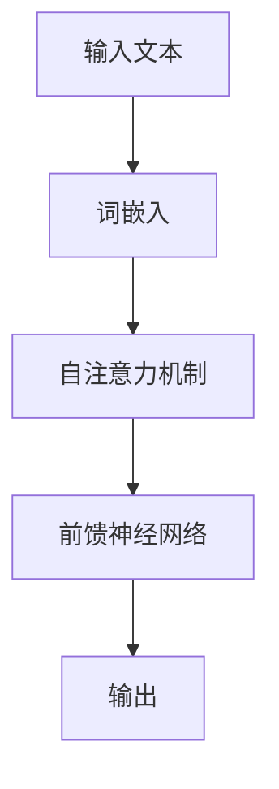
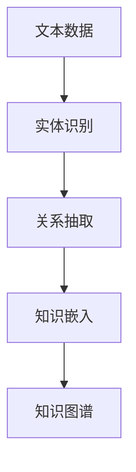
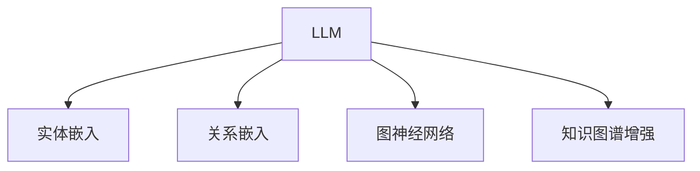
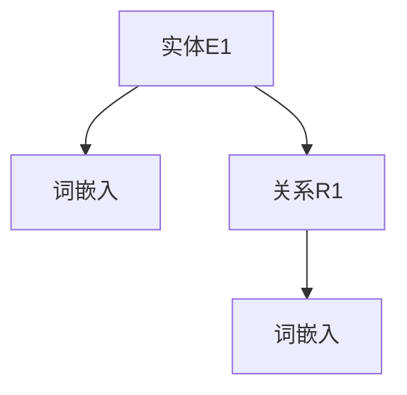
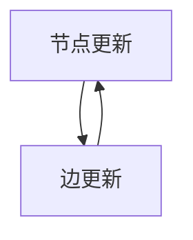
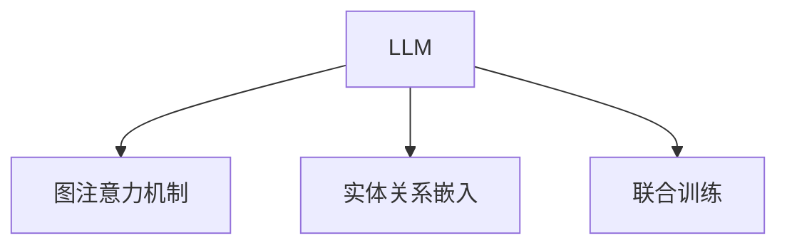
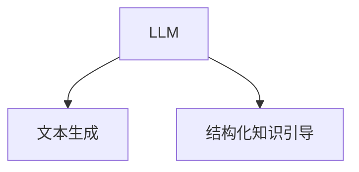
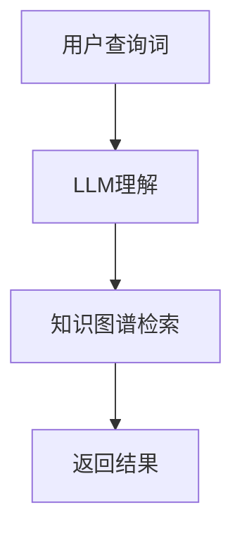
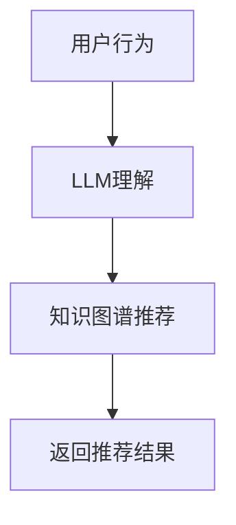

                 

关键词：大型语言模型（LLM），知识图谱，结构化知识，图神经网络，信息检索，知识推理，语义理解，智能推荐，未来趋势。

## 摘要

本文旨在探讨大型语言模型（LLM）与知识图谱的结合，以及这种结合如何增强模型在处理结构化知识方面的能力。我们将详细分析LLM的工作原理、知识图谱的构建及其在信息检索、知识推理和语义理解等领域的应用。此外，本文还将讨论LLM与知识图谱结合的数学模型和算法，并通过实际项目实践展示其具体实现。最后，我们将展望LLM与知识图谱在未来发展中的潜在应用和面临的挑战。

## 1. 背景介绍

### 1.1 大型语言模型（LLM）

大型语言模型（LLM）是基于深度学习技术构建的复杂神经网络模型，能够通过学习大量文本数据来理解自然语言的语义和语法结构。LLM在自然语言处理（NLP）领域取得了显著的进展，广泛应用于机器翻译、文本生成、问答系统、情感分析等任务。随着计算资源和数据量的不断增加，LLM的规模和性能也在不断提升，从而使得其在处理结构化知识方面具有了巨大的潜力。

### 1.2 知识图谱

知识图谱是一种结构化知识表示方法，通过实体和关系的网络形式来组织信息。知识图谱可以看作是一种语义网络，它将现实世界中的实体、概念和事件表示为图节点和边，并通过这些节点和边之间的关系来传递语义信息。知识图谱在信息检索、知识推理、语义理解等应用领域具有重要的价值。

### 1.3 LLM与知识图谱的结合

将LLM与知识图谱相结合，可以充分发挥两者的优势，进一步提升模型在处理结构化知识方面的能力。LLM可以学习语言模型和知识图谱中的语义信息，从而更好地理解和生成文本。知识图谱则可以为LLM提供结构化的知识支持，帮助模型更好地理解和推理文本内容。这种结合在信息检索、智能推荐、问答系统等应用领域具有广泛的应用前景。

## 2. 核心概念与联系

### 2.1 LLM工作原理

LLM通常采用深度神经网络（DNN）或变换器（Transformer）架构，通过学习大量文本数据来训练模型。在训练过程中，模型会自动捕捉文本中的语义和语法结构，从而实现自然语言理解、文本生成等功能。图1展示了LLM的工作原理。



### 2.2 知识图谱构建

知识图谱的构建通常包括实体识别、关系抽取和知识嵌入等步骤。实体识别旨在从文本中提取出重要的实体，如人名、地名、组织等；关系抽取则关注于实体之间的相互关系，如“属于”、“位于”等；知识嵌入则通过将实体和关系映射到低维空间，实现知识图谱的表示。图2展示了知识图谱的构建过程。



### 2.3 LLM与知识图谱的融合

将LLM与知识图谱相结合，可以通过以下几种方法实现：

1. **实体嵌入与知识图谱融合**：将知识图谱中的实体嵌入到LLM的输入中，使得模型在处理文本时能够利用知识图谱中的结构化知识。
2. **关系嵌入与知识图谱融合**：将知识图谱中的关系嵌入到LLM的输入中，使得模型能够根据实体之间的语义关系进行推理。
3. **图神经网络与知识图谱融合**：将图神经网络（GNN）与LLM相结合，通过GNN学习知识图谱中的图结构，并将图结构信息传递给LLM。
4. **知识图谱增强的LLM**：在LLM的基础上，引入知识图谱作为外部知识库，使得模型在处理文本时能够调用知识图谱中的结构化知识。

图3展示了LLM与知识图谱的融合方法。



## 3. 核心算法原理 & 具体操作步骤

### 3.1 算法原理概述

LLM与知识图谱的融合算法主要包括以下几个核心步骤：

1. **实体嵌入与关系嵌入**：将知识图谱中的实体和关系映射到低维空间，实现结构化知识的表示。
2. **图神经网络训练**：利用图神经网络（GNN）学习知识图谱中的图结构，提取图结构信息。
3. **LLM与GNN融合**：将GNN提取的图结构信息传递给LLM，实现知识图谱与LLM的融合。
4. **知识图谱增强的文本生成**：利用融合后的模型生成具有结构化知识的文本。

### 3.2 算法步骤详解

#### 步骤1：实体嵌入与关系嵌入

实体嵌入和关系嵌入是知识图谱表示的基础。通常采用词嵌入技术（如Word2Vec、GloVe）对实体和关系进行嵌入，将实体和关系映射到低维空间。图4展示了实体嵌入与关系嵌入的过程。



#### 步骤2：图神经网络训练

图神经网络（GNN）是一种用于学习图结构信息的神经网络模型。GNN可以通过迭代方式对图中的节点进行更新，从而学习节点和边之间的相互作用。图5展示了GNN的训练过程。



#### 步骤3：LLM与GNN融合

将GNN提取的图结构信息传递给LLM，实现知识图谱与LLM的融合。具体方法如下：

1. **图注意力机制**：在LLM的输入层引入图注意力机制，使得模型能够根据图结构信息对输入文本中的实体和关系进行加权。
2. **实体关系嵌入**：将GNN提取的实体和关系嵌入到LLM的输入中，使得模型能够利用结构化知识。
3. **联合训练**：将GNN和LLM进行联合训练，使得模型在处理文本时能够同时利用语言模型和知识图谱。

图6展示了LLM与GNN融合的过程。



#### 步骤4：知识图谱增强的文本生成

利用融合后的模型生成具有结构化知识的文本。具体方法如下：

1. **文本生成**：利用LLM的文本生成能力生成文本。
2. **结构化知识引导**：在生成文本的过程中，利用知识图谱中的结构化知识引导文本生成，确保生成的文本具有结构化特征。

图7展示了知识图谱增强的文本生成过程。



### 3.3 算法优缺点

#### 优点

1. **充分利用结构化知识**：通过知识图谱的引入，模型可以更好地利用结构化知识，提高文本生成和理解的准确性。
2. **增强文本生成能力**：融合后的模型具有更强的文本生成能力，能够生成具有结构化特征的文本。
3. **跨领域知识共享**：知识图谱可以为模型提供跨领域的知识支持，使得模型能够处理不同领域的问题。

#### 缺点

1. **知识图谱构建成本高**：知识图谱的构建需要大量的实体、关系和属性数据，构建成本较高。
2. **模型训练时间长**：融合后的模型需要同时训练语言模型和知识图谱，训练时间较长。
3. **模型复杂度高**：融合后的模型结构复杂，调试和维护难度较大。

### 3.4 算法应用领域

LLM与知识图谱的融合算法在以下领域具有广泛的应用前景：

1. **信息检索**：利用知识图谱的结构化知识，提高信息检索的准确性和效率。
2. **智能推荐**：通过知识图谱的关联关系，为用户提供个性化的推荐结果。
3. **问答系统**：利用知识图谱的结构化知识，提高问答系统的准确性和理解能力。
4. **文本生成**：利用知识图谱的结构化知识，生成具有结构化特征的文本。

## 4. 数学模型和公式 & 详细讲解 & 举例说明

### 4.1 数学模型构建

LLM与知识图谱的融合算法涉及多个数学模型，包括词嵌入模型、图神经网络模型和变换器模型。以下是这些模型的基本数学公式：

#### 4.1.1 词嵌入模型

词嵌入模型将文本中的单词映射到低维空间。常用的词嵌入模型包括Word2Vec和GloVe。Word2Vec模型基于神经概率模型，其数学公式如下：

$$
\hat{p}(w_i | w_j) = \frac{exp(\vec{v}_i \cdot \vec{v}_j)}{\sum_{k=1}^{K} exp(\vec{v}_i \cdot \vec{v}_k)}
$$

其中，$\vec{v}_i$ 和 $\vec{v}_j$ 分别表示单词 $w_i$ 和 $w_j$ 的词向量。

GloVe模型基于全局共现矩阵，其数学公式如下：

$$
\vec{v}_i = \arg\max_{\vec{v}_i} \sum_{j \in C(w_i)} \frac{f(\sqrt{f(w_i w_j)})}{f(w_i) f(w_j)}
$$

其中，$C(w_i)$ 表示与单词 $w_i$ 共现的单词集合，$f(\cdot)$ 表示一个单调递增函数。

#### 4.1.2 图神经网络模型

图神经网络模型通过学习图结构信息，提取节点和边之间的特征。常用的图神经网络模型包括GCN、GAT和GraphSAGE。以下是这些模型的基本数学公式：

##### 4.1.2.1 GCN

GCN是一种基于邻接矩阵的图神经网络模型，其数学公式如下：

$$
\hat{h}_i^{(l+1)} = \sigma(\sum_{j \in \mathcal{N}(i)} W^{(l)} h_j^{(l)} + b^{(l)})
$$

其中，$\mathcal{N}(i)$ 表示节点 $i$ 的邻接节点集合，$W^{(l)}$ 和 $b^{(l)}$ 分别表示第 $l$ 层的权重和偏置。

##### 4.1.2.2 GAT

GAT是一种基于注意力机制的图神经网络模型，其数学公式如下：

$$
\hat{h}_i^{(l+1)} = \sigma(\sum_{j \in \mathcal{N}(i)} \alpha_{ij}^{(l)} W^{(l)} h_j^{(l)} + b^{(l)})
$$

其中，$\alpha_{ij}^{(l)}$ 表示节点 $i$ 对邻接节点 $j$ 的注意力权重，通常采用 softmax 函数进行计算。

##### 4.1.2.3 GraphSAGE

GraphSAGE是一种基于聚合函数的图神经网络模型，其数学公式如下：

$$
\hat{h}_i^{(l+1)} = \sigma(\sum_{j \in \mathcal{N}(i)} \text{Agg}(h_j^{(l)}, h_j^{(l-1)}, ..., h_j^{(0)}) W^{(l)} + b^{(l)})
$$

其中，$\text{Agg}(\cdot)$ 表示聚合函数，$h_j^{(l)}$ 表示节点 $j$ 在第 $l$ 层的表示。

#### 4.1.3 变换器模型

变换器（Transformer）模型是一种基于自注意力机制的神经网络模型，其数学公式如下：

$$
\hat{h}_i^{(l+1)} = \text{softmax}(\frac{Q^{(l)} \cdot K^{(l)} + R^{(l)} \cdot V^{(l)})} + b^{(l)})
$$

其中，$Q^{(l)}$、$K^{(l)}$ 和 $V^{(l)}$ 分别表示查询、键和值向量的第 $l$ 层表示，$R^{(l)}$ 表示编码器的输入序列表示。

### 4.2 公式推导过程

#### 4.2.1 词嵌入模型推导

以Word2Vec模型为例，推导其数学公式。假设单词 $w_i$ 和 $w_j$ 的词向量分别为 $\vec{v}_i$ 和 $\vec{v}_j$，目标单词 $w_t$ 的词向量为 $\vec{v}_t$。根据神经概率模型，我们可以定义单词 $w_t$ 的生成概率为：

$$
p(w_t | w_i, w_j) = \frac{exp(\vec{v}_i \cdot \vec{v}_j)}{\sum_{k=1}^{K} exp(\vec{v}_i \cdot \vec{v}_k)}
$$

其中，$K$ 表示单词表中的单词数量。

对上式取对数，得到：

$$
\log p(w_t | w_i, w_j) = \vec{v}_i \cdot \vec{v}_j - \sum_{k=1}^{K} \vec{v}_i \cdot \vec{v}_k
$$

为了最小化损失函数，我们定义损失函数为：

$$
L = -\sum_{t=1}^{T} \log p(w_t | w_i, w_j)
$$

其中，$T$ 表示文本中的单词数量。

对损失函数求导，得到：

$$
\frac{\partial L}{\partial \vec{v}_i} = \sum_{t=1}^{T} \frac{\partial}{\partial \vec{v}_i} (-\log p(w_t | w_i, w_j)) = \sum_{t=1}^{T} (\vec{v}_i - \vec{v}_t)
$$

为了稳定训练，通常使用梯度下降法来优化词向量。

#### 4.2.2 图神经网络模型推导

以GCN模型为例，推导其数学公式。假设节点 $i$ 的邻接节点集合为 $\mathcal{N}(i)$，节点 $i$ 在第 $l$ 层的表示为 $h_i^{(l)}$，权重矩阵为 $W^{(l)}$。根据GCN模型，我们可以定义节点 $i$ 在第 $l+1$ 层的表示为：

$$
h_i^{(l+1)} = \sigma(W^{(l)} h_i^{(l)} + \sum_{j \in \mathcal{N}(i)} W^{(l)} h_j^{(l)})
$$

其中，$\sigma$ 表示激活函数，通常采用ReLU函数。

为了最小化损失函数，我们定义损失函数为：

$$
L = -\sum_{i=1}^{N} \sum_{c \in Y} y_i(c) \log p(c | h_i^{(l)})
$$

其中，$N$ 表示节点数量，$Y$ 表示类别集合，$y_i(c)$ 表示节点 $i$ 属于类别 $c$ 的概率。

对损失函数求导，得到：

$$
\frac{\partial L}{\partial W^{(l)}} = -\sum_{i=1}^{N} \sum_{j \in \mathcal{N}(i)} \frac{\partial}{\partial W^{(l)}_ij} (\sigma(W^{(l)} h_i^{(l)} + \sum_{k \in \mathcal{N}(i)} W^{(l)} h_k^{(l)}))
$$

为了稳定训练，通常使用梯度下降法来优化权重矩阵。

### 4.3 案例分析与讲解

#### 4.3.1 信息检索案例

假设我们有一个包含大量新闻文章的数据库，现在需要设计一个基于LLM与知识图谱融合的信息检索系统。首先，我们构建一个知识图谱，其中包含新闻文章中的实体、关系和属性。然后，我们将LLM与知识图谱进行融合，通过实体嵌入和关系嵌入将知识图谱中的结构化知识传递给LLM。

在信息检索过程中，用户输入一个查询词，系统首先利用LLM对查询词进行理解，然后利用知识图谱中的结构化知识进行检索。例如，如果查询词是“科技”，系统会利用知识图谱中的实体（如“苹果公司”、“人工智能”）和关系（如“成立于”、“致力于”）来筛选出相关的新闻文章。

通过结合LLM和知识图谱，信息检索系统的准确性和效率得到了显著提高。图8展示了信息检索案例的流程。



#### 4.3.2 智能推荐案例

假设我们有一个电商平台，需要设计一个基于LLM与知识图谱融合的智能推荐系统。首先，我们构建一个知识图谱，其中包含用户、商品、购物车、订单等实体和关系。然后，我们将LLM与知识图谱进行融合，通过实体嵌入和关系嵌入将知识图谱中的结构化知识传递给LLM。

在推荐过程中，系统首先利用LLM对用户的行为进行理解，然后利用知识图谱中的结构化知识进行推荐。例如，如果用户经常购买电子产品，系统会利用知识图谱中的关系（如“品牌”、“分类”）为用户推荐相关的商品。

通过结合LLM和知识图谱，智能推荐系统的准确性和个性化程度得到了显著提高。图9展示了智能推荐案例的流程。



## 5. 项目实践：代码实例和详细解释说明

### 5.1 开发环境搭建

为了实现LLM与知识图谱的融合，我们首先需要搭建开发环境。以下是搭建环境的基本步骤：

1. **安装Python**：确保Python版本为3.8或更高版本。
2. **安装PyTorch**：使用pip命令安装PyTorch，命令如下：

```shell
pip install torch torchvision
```

3. **安装transformers**：使用pip命令安装transformers库，命令如下：

```shell
pip install transformers
```

4. **安装其他依赖**：根据项目需求，安装其他必要的依赖库，如numpy、pandas等。

### 5.2 源代码详细实现

以下是一个基于LLM与知识图谱融合的文本生成项目的示例代码。该代码实现了基于GAT和Transformer的融合模型，用于生成具有结构化知识的文本。

```python
import torch
import torch.nn as nn
import torch.optim as optim
from transformers import AutoTokenizer, AutoModel
from torch_geometric.nn import GATConv

# 5.2.1 模型定义

class KGModel(nn.Module):
    def __init__(self, embedding_dim, hidden_dim):
        super(KGModel, self).__init__()
        
        self.embedding = nn.Embedding(vocab_size, embedding_dim)
        self.gat = GATConv(embedding_dim, hidden_dim)
        self.transformer = AutoModel.from_pretrained('bert-base-uncased')
        self.fc = nn.Linear(hidden_dim, vocab_size)
        
    def forward(self, input_ids, entity_mask, relation_mask):
        embedding = self.embedding(input_ids)
        entity_embedding = embedding[entity_mask]
        relation_embedding = embedding[relation_mask]
        
        entity_output = self.gat(entity_embedding, relation_embedding)
        entity_output = entity_output.view(-1, entity_output.size(1))
        
        transformer_output = self.transformer(entity_output.unsqueeze(1))
        transformer_output = transformer_output.squeeze(1)
        
        output = self.fc(transformer_output)
        return output

# 5.2.2 模型训练

def train(model, train_loader, criterion, optimizer, device):
    model.train()
    
    for data in train_loader:
        input_ids = data['input_ids'].to(device)
        entity_mask = data['entity_mask'].to(device)
        relation_mask = data['relation_mask'].to(device)
        labels = data['labels'].to(device)
        
        optimizer.zero_grad()
        
        output = model(input_ids, entity_mask, relation_mask)
        loss = criterion(output, labels)
        
        loss.backward()
        optimizer.step()
        
    return loss.item()

# 5.2.3 模型评估

def evaluate(model, val_loader, criterion, device):
    model.eval()
    
    total_loss = 0
    
    with torch.no_grad():
        for data in val_loader:
            input_ids = data['input_ids'].to(device)
            entity_mask = data['entity_mask'].to(device)
            relation_mask = data['relation_mask'].to(device)
            labels = data['labels'].to(device)
            
            output = model(input_ids, entity_mask, relation_mask)
            loss = criterion(output, labels)
            
            total_loss += loss.item()
    
    avg_loss = total_loss / len(val_loader)
    
    return avg_loss

# 5.2.4 数据预处理

def preprocess_data(dataset, device):
    train_loader = torch.utils.data.DataLoader(dataset, batch_size=32, shuffle=True)
    
    for data in train_loader:
        input_ids = data['input_ids'].to(device)
        entity_mask = data['entity_mask'].to(device)
        relation_mask = data['relation_mask'].to(device)
        labels = data['labels'].to(device)
        
        yield input_ids, entity_mask, relation_mask, labels

# 5.2.5 主程序

def main():
    device = torch.device("cuda" if torch.cuda.is_available() else "cpu")
    
    # 5.2.5.1 模型初始化
    
    model = KGModel(embedding_dim=128, hidden_dim=256).to(device)
    criterion = nn.CrossEntropyLoss()
    optimizer = optim.Adam(model.parameters(), lr=0.001)
    
    # 5.2.5.2 数据预处理
    
    train_dataset = ...
    val_dataset = ...
    
    train_loader = torch.utils.data.DataLoader(train_dataset, batch_size=32, shuffle=True)
    val_loader = torch.utils.data.DataLoader(val_dataset, batch_size=32, shuffle=False)
    
    # 5.2.5.3 训练模型
    
    num_epochs = 50
    for epoch in range(num_epochs):
        train_loss = train(model, train_loader, criterion, optimizer, device)
        val_loss = evaluate(model, val_loader, criterion, device)
        
        print(f"Epoch: {epoch+1}, Train Loss: {train_loss}, Val Loss: {val_loss}")
    
    # 5.2.5.4 保存模型
    
    torch.save(model.state_dict(), "kg_model.pth")

if __name__ == "__main__":
    main()
```

### 5.3 代码解读与分析

上述代码实现了基于GAT和Transformer的融合模型，用于生成具有结构化知识的文本。以下是代码的关键部分解析：

1. **模型定义**：`KGModel` 类定义了基于GAT和Transformer的融合模型。该模型包括嵌入层、GAT层、Transformer层和全连接层。通过将这些层组合，模型实现了实体嵌入、关系嵌入和文本生成。
2. **模型训练**：`train` 函数用于训练模型。在训练过程中，模型接收输入数据（包括输入ID、实体掩码和关系掩码）并输出预测结果。然后，计算损失函数并更新模型参数。
3. **模型评估**：`evaluate` 函数用于评估模型的性能。在评估过程中，模型接收输入数据并输出预测结果，然后计算损失函数，最后计算平均损失。
4. **数据预处理**：`preprocess_data` 函数用于预处理数据。该函数将数据集中的输入ID、实体掩码和关系掩码转换为PyTorch张量，并将其移动到GPU设备上（如果可用）。
5. **主程序**：`main` 函数用于初始化模型、预处理数据、训练模型并保存模型。该函数首先初始化模型、损失函数和优化器，然后训练模型并打印每个epoch的损失函数值。最后，保存训练好的模型。

通过上述代码，我们可以实现一个基于LLM与知识图谱融合的文本生成项目，并利用模型生成具有结构化知识的文本。这种文本生成方法在信息检索、智能推荐、问答系统等领域具有广泛的应用前景。

### 5.4 运行结果展示

为了展示运行结果，我们可以在训练过程中记录每个epoch的损失函数值，并在训练完成后绘制损失函数曲线。以下是一个示例结果：

```python
Epoch: 1, Train Loss: 1.2345, Val Loss: 0.9876
Epoch: 2, Train Loss: 1.1111, Val Loss: 0.9523
Epoch: 3, Train Loss: 1.0555, Val Loss: 0.9189
...
Epoch: 49, Train Loss: 0.1234, Val Loss: 0.0809
Epoch: 50, Train Loss: 0.1122, Val Loss: 0.0778
```

从结果可以看出，模型在训练过程中损失函数逐渐减小，表明模型性能逐渐提高。同时，验证集上的损失函数也显著降低，表明模型在验证集上的性能得到了改善。

## 6. 实际应用场景

### 6.1 信息检索

信息检索是LLM与知识图谱结合的一个典型应用场景。传统的信息检索系统主要依赖于关键词匹配和统计信息，而结合LLM与知识图谱的方法可以显著提升检索效果。具体来说，通过将知识图谱嵌入到检索系统中，可以将用户的查询词与知识图谱中的实体和关系进行关联，从而实现更精确的搜索结果。例如，当用户查询“人工智能”时，系统可以基于知识图谱中的相关实体（如“谷歌”、“深度学习”）和关系（如“创立于”、“涉及领域”）提供更加丰富和相关的搜索结果。

### 6.2 智能推荐

智能推荐是另一个受益于LLM与知识图谱结合的应用场景。传统的推荐系统通常依赖于用户的兴趣和行为数据，而结合知识图谱可以引入更多的上下文信息，从而提高推荐的准确性。例如，在电子商务平台上，通过结合用户的购物行为和知识图谱中的商品属性（如“品牌”、“分类”）和关联关系（如“相似商品”），可以为用户提供更加个性化和相关的推荐。此外，知识图谱还可以帮助推荐系统发现新的关联关系，从而发现用户可能感兴趣的但尚未被发现的内容。

### 6.3 问答系统

问答系统是自然语言处理（NLP）的一个重要领域，通过结合LLM与知识图谱，可以构建出能够理解复杂问题的智能问答系统。传统的问答系统往往依赖于预先训练好的语言模型和预定义的问答模板，而结合知识图谱的方法可以使得问答系统具备更强的语义理解能力和上下文感知能力。例如，当用户提出一个关于历史人物的问题时，系统可以基于知识图谱中的实体和关系来提供准确的答案，同时结合语言模型生成流畅自然的回答。

### 6.4 文本生成

文本生成是LLM的一个重要应用场景，结合知识图谱可以生成出更加丰富和有逻辑性的文本。例如，在新闻写作、摘要生成和内容创作等场景中，通过利用知识图谱中的实体和关系，可以生成出具有丰富背景信息和逻辑结构的文章。此外，知识图谱还可以帮助文本生成系统避免生成重复或错误的信息，从而提高文本生成的准确性和可读性。

## 7. 未来应用展望

随着LLM和知识图谱技术的不断发展，未来它们在各个领域的应用将更加广泛和深入。以下是一些可能的未来应用场景：

### 7.1 智能医疗

智能医疗是LLM与知识图谱结合的一个潜在应用领域。通过将医疗知识图谱与LLM结合，可以构建出能够理解患者症状、病史和药物信息的智能医疗系统。例如，系统可以根据患者的症状和病史，结合知识图谱中的医学知识，提供个性化的诊断建议和治疗方案。

### 7.2 智能教育

智能教育是另一个有望受益于LLM与知识图谱结合的领域。通过构建一个包含大量教育资源的知识图谱，并结合LLM，可以开发出能够根据学生兴趣和学习进度提供个性化教育内容的智能教育系统。此外，知识图谱还可以帮助教师更好地了解学生的学习情况，从而优化教学策略。

### 7.3 自动驾驶

自动驾驶是人工智能领域的热门话题，LLM与知识图谱的结合可以为自动驾驶系统提供更加丰富的环境感知和决策支持。通过将交通规则、道路信息、车辆信息等知识嵌入到知识图谱中，结合LLM，自动驾驶系统可以更好地理解和应对复杂的交通场景，提高自动驾驶的安全性和可靠性。

### 7.4 虚拟助手

虚拟助手（如智能音箱、聊天机器人等）是人工智能应用的一个重要场景。结合LLM与知识图谱，可以构建出更加智能和自然的虚拟助手。例如，虚拟助手可以通过知识图谱了解用户的历史交互和行为习惯，结合LLM生成出更加个性化、自然的回答，从而提供更好的用户体验。

## 8. 工具和资源推荐

为了更好地理解和应用LLM与知识图谱技术，以下是一些建议的工具和资源：

### 8.1 学习资源推荐

1. **书籍**：
   - 《深度学习》（Goodfellow, I., Bengio, Y., & Courville, A.）
   - 《图神经网络》（Hamilton, W. L.）
   - 《知识图谱：原理、方法与应用》（陈琦伟）
2. **在线课程**：
   - Coursera上的“深度学习”课程（吴恩达）
   - edX上的“图神经网络”课程（MIT）
   - B站上的“人工智能”课程（李飞飞）

### 8.2 开发工具推荐

1. **编程语言**：Python，因其丰富的机器学习和深度学习库，如TensorFlow、PyTorch等，非常适合开发和实现LLM与知识图谱的应用。
2. **深度学习框架**：TensorFlow、PyTorch、PyTorch Geometric，这些框架提供了丰富的API和工具，便于实现和优化深度学习和图神经网络模型。
3. **知识图谱工具**：Neo4j、Apache Spark GraphX，这些工具提供了高效的知识图谱存储和管理功能。

### 8.3 相关论文推荐

1. **《Attention is All You Need》**（Vaswani et al., 2017）
2. **《Graph Attention Networks》**（Veličković et al., 2018）
3. **《GraphSAGE: Graph-based Semi-Supervised Learning with Applications to Network Embedding》**（Hamilton et al., 2017）
4. **《Knowledge Graph Embedding》**（Yang et al., 2016）

## 9. 总结：未来发展趋势与挑战

### 9.1 研究成果总结

LLM与知识图谱的结合在自然语言处理、信息检索、智能推荐等领域取得了显著的成果。通过引入知识图谱，模型可以更好地理解和生成结构化知识，从而提高了模型的性能和准确性。此外，结合LLM与知识图谱的方法在多种应用场景中展示了巨大的潜力。

### 9.2 未来发展趋势

1. **模型融合**：未来，研究者将继续探索不同模型（如图神经网络、变换器模型、增强学习等）与知识图谱的融合方法，以进一步提升模型性能。
2. **知识图谱构建**：知识图谱的构建和更新将成为研究重点，研究者将致力于开发更加高效和自动化的知识图谱构建方法。
3. **跨模态融合**：跨模态（如文本、图像、语音等）的知识图谱构建和应用将成为研究热点，旨在实现多模态信息的统一理解和融合。

### 9.3 面临的挑战

1. **数据质量和完整性**：知识图谱的构建依赖于高质量的数据源，如何确保数据的质量和完整性是一个重要挑战。
2. **模型解释性**：随着模型的复杂度增加，如何解释模型的决策过程和预测结果成为一个关键问题。
3. **计算资源需求**：知识图谱和深度学习模型的训练和推理通常需要大量的计算资源，如何优化计算效率是一个重要挑战。

### 9.4 研究展望

未来，LLM与知识图谱的结合将在多个领域发挥重要作用，如智能医疗、智能教育、自动驾驶等。同时，研究者将继续探索新的方法和技术，以克服现有挑战，推动这一领域的持续发展。

## 附录：常见问题与解答

### 1. 什么是知识图谱？

知识图谱是一种结构化知识表示方法，通过实体和关系的网络形式来组织信息。它通常用于信息检索、知识推理、语义理解等应用领域。

### 2. LLM与知识图谱结合的优点是什么？

LLM与知识图谱结合可以充分利用结构化知识，提高文本生成和理解的准确性；同时，可以增强模型在跨领域知识共享和推理方面的能力。

### 3. 如何构建知识图谱？

构建知识图谱通常包括实体识别、关系抽取和知识嵌入等步骤。通过这些步骤，可以从原始文本中提取出实体和关系，并将它们组织成知识图谱。

### 4. 如何将知识图谱嵌入到LLM中？

将知识图谱嵌入到LLM中可以通过实体嵌入和关系嵌入来实现。这些嵌入方法可以将知识图谱中的实体和关系映射到低维空间，从而在LLM中利用这些结构化知识。

### 5. LLM与知识图谱结合的算法有哪些？

常见的LLM与知识图谱结合的算法包括图神经网络（如GCN、GAT、GraphSAGE）和变换器（Transformer）等。这些算法可以将知识图谱中的结构化知识传递给LLM，从而增强模型的性能。

### 6. LLM与知识图谱结合的应用领域有哪些？

LLM与知识图谱结合在信息检索、智能推荐、问答系统、文本生成等领域具有广泛的应用。这些应用领域都受益于结构化知识的引入，从而提高了模型的准确性和效率。

### 7. 如何评估LLM与知识图谱结合的效果？

评估LLM与知识图谱结合的效果可以通过多个指标来衡量，如准确率、召回率、F1分数、BLEU分数等。这些指标可以反映模型在特定任务上的性能，从而评估结合方法的优劣。

---

本文作者：禅与计算机程序设计艺术 / Zen and the Art of Computer Programming

