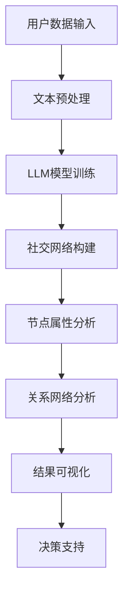

                 

关键词：大型语言模型（LLM），社交网络分析，人际关系网络，图论，机器学习，数据挖掘，深度学习，自然语言处理，算法原理，数学模型，项目实践，实际应用，未来展望。

> 摘要：本文将探讨如何利用大型语言模型（LLM）进行社交网络分析，揭示人际关系网络的奥秘。通过对核心概念、算法原理、数学模型和项目实践的深入讲解，我们将展示如何运用LLM技术识别、分析和优化社交网络，从而为实际应用提供指导。

## 1. 背景介绍

随着互联网的普及和社会化媒体平台的兴起，人际关系网络的规模和复杂性不断增加。这种网络不仅包含了人与人之间的直接联系，还涵盖了各种间接关系和社交圈层。社交网络分析（Social Network Analysis，SNA）作为一种重要的数据分析方法，旨在通过研究人际关系网络来揭示群体行为、传播模式和影响力分布等关键特征。

近年来，大型语言模型（Large Language Model，LLM）在自然语言处理（Natural Language Processing，NLP）领域取得了显著的进展。LLM能够对大规模文本数据进行深入分析和理解，从而为社交网络分析提供了一种全新的技术手段。本文将结合LLM和社交网络分析，探讨如何揭示人际关系网络的奥秘。

### 1.1 社交网络分析的定义和意义

社交网络分析是一种研究个体之间关系和互动的方法，其核心在于通过分析社交网络的结构和属性来揭示群体行为和传播模式。社交网络分析的意义在于：

- **揭示群体行为特征**：通过分析社交网络的结构和属性，可以深入了解群体的组织结构、行为模式和互动规律。
- **发现传播途径**：社交网络分析有助于识别关键传播节点和传播途径，为信息传播策略设计提供依据。
- **评估影响力**：通过分析社交网络中的影响力分布，可以评估个体或群体在社交网络中的影响力大小，为营销、品牌推广等提供参考。

### 1.2 大型语言模型的发展和应用

大型语言模型是一种基于深度学习技术的自然语言处理模型，具有强大的文本生成和理解能力。LLM的发展和应用主要体现在以下几个方面：

- **文本生成**：LLM可以生成高质量的文本内容，包括新闻文章、广告文案、对话生成等，极大地提高了文本创作的效率和多样性。
- **文本理解**：LLM能够理解文本的语义和上下文，从而进行情感分析、情感推理、实体识别等任务。
- **问答系统**：LLM可以构建智能问答系统，实现人与机器的交互，提供个性化的服务和信息推荐。

## 2. 核心概念与联系

在探讨LLM与社交网络分析的关系之前，我们首先需要明确一些核心概念和联系。以下是一个使用Mermaid绘制的流程图，用于说明LLM在社交网络分析中的应用架构。



### 2.1 用户数据输入

用户数据输入是整个分析过程的基础，包括社交网络中的个体信息、关系数据以及文本内容。这些数据可以来源于社交媒体平台、问卷调查、企业内部系统等。

### 2.2 文本预处理

文本预处理是确保数据质量的重要步骤，包括文本清洗、去噪、分词、词性标注等操作。预处理后的文本数据将作为LLM模型训练的输入。

### 2.3 LLM模型训练

LLM模型训练是利用大规模文本数据进行模型训练的过程。通过训练，LLM模型能够学习和理解文本的语义和上下文，从而为后续的社交网络分析提供支持。

### 2.4 社交网络构建

社交网络构建是将用户数据和关系数据转换为图结构的过程。图结构中的节点代表个体，边代表个体之间的联系。社交网络构建为后续的分析提供了基础数据。

### 2.5 节点属性分析

节点属性分析是对社交网络中的个体属性进行量化分析的过程，包括影响力、活跃度、中心性等指标。这些属性分析结果有助于识别关键节点和群体特征。

### 2.6 关系网络分析

关系网络分析是通过对社交网络中的节点和边进行挖掘和分析，揭示个体之间的互动关系和影响力分布。关系网络分析可以为决策支持提供关键依据。

### 2.7 结果可视化

结果可视化是将分析结果以图表、图像等形式呈现的过程。可视化结果可以帮助用户更直观地理解社交网络的特性，从而做出更明智的决策。

### 2.8 决策支持

决策支持是将分析结果应用于实际问题的过程。通过社交网络分析，可以为营销策略、品牌推广、人才管理等领域提供指导。

## 3. 核心算法原理 & 具体操作步骤

### 3.1 算法原理概述

社交网络分析中的核心算法主要包括图论算法和机器学习算法。图论算法主要用于分析社交网络的结构特性，如节点度、聚类系数、路径长度等；机器学习算法则用于挖掘社交网络中的潜在模式和规律。

在本篇文章中，我们将主要介绍基于LLM的社交网络分析算法。该算法的核心思想是利用LLM的文本生成和理解能力，对社交网络中的文本数据进行深入分析，从而揭示人际关系网络的奥秘。

### 3.2 算法步骤详解

#### 3.2.1 文本数据收集与预处理

1. **数据收集**：从社交媒体平台、企业内部系统等渠道收集用户数据和关系数据。
2. **文本预处理**：对收集到的文本数据进行清洗、去噪、分词、词性标注等操作，确保数据质量。

#### 3.2.2 LLM模型训练

1. **模型选择**：选择合适的LLM模型，如GPT、BERT等。
2. **数据准备**：将预处理后的文本数据转换为模型输入格式。
3. **模型训练**：使用大量文本数据进行模型训练，优化模型的参数和结构。

#### 3.2.3 社交网络构建

1. **节点构建**：将用户数据转换为图结构中的节点，每个节点代表一个用户。
2. **边构建**：根据用户关系数据，构建节点之间的边，表示个体之间的联系。

#### 3.2.4 节点属性分析

1. **影响力分析**：利用LLM模型分析用户文本，计算用户影响力。
2. **活跃度分析**：根据用户在社交网络中的互动频率，计算用户活跃度。
3. **中心性分析**：利用图论算法计算节点中心性，识别关键节点。

#### 3.2.5 关系网络分析

1. **社区发现**：利用机器学习算法发现社交网络中的社区结构。
2. **影响力传播**：分析社交网络中的影响力传播路径，评估个体或群体的影响力。
3. **节点分类**：根据节点属性和关系，对节点进行分类，识别不同角色的用户。

#### 3.2.6 结果可视化

1. **图表生成**：利用可视化工具，将分析结果以图表、图像等形式呈现。
2. **交互式展示**：提供交互式功能，用户可以自定义筛选条件、调整参数，查看分析结果。

#### 3.2.7 决策支持

1. **营销策略**：基于社交网络分析结果，为营销策略提供支持，如确定目标用户、优化传播途径等。
2. **品牌推广**：分析社交网络中的品牌影响力，制定有效的品牌推广策略。
3. **人才管理**：利用社交网络分析结果，识别关键人才，优化团队结构和人才发展策略。

### 3.3 算法优缺点

#### 优点：

1. **强大的文本生成和理解能力**：LLM能够对社交网络中的文本数据进行深入分析，揭示潜在的人际关系和互动模式。
2. **灵活性和扩展性**：基于LLM的社交网络分析算法可以适应不同的应用场景和数据类型，具有较好的灵活性和扩展性。
3. **可视化与交互**：结果可视化功能使得用户可以直观地了解社交网络的特性和分析结果，从而做出更明智的决策。

#### 缺点：

1. **数据隐私和安全**：社交网络分析涉及大量个人数据，如何保护用户隐私和确保数据安全是一个重要挑战。
2. **计算资源消耗**：LLM模型训练和社交网络分析需要大量的计算资源，可能导致成本较高。
3. **结果解释性**：社交网络分析结果可能存在一定的解释性问题，如何确保结果的准确性和可靠性仍需进一步研究。

### 3.4 算法应用领域

基于LLM的社交网络分析算法可以应用于多个领域，如：

- **市场营销**：分析社交网络中的用户特征和影响力分布，为营销策略提供支持。
- **品牌推广**：评估社交网络中的品牌影响力，制定有效的品牌推广策略。
- **社会网络分析**：研究社交网络的结构特性、传播模式和影响力分布，为社交网络管理提供依据。
- **人才管理**：识别关键人才和人才团队，优化组织结构和人才发展策略。
- **社会治理**：利用社交网络分析技术，研究社会网络的动态变化和群体行为特征，为社会治理提供参考。

## 4. 数学模型和公式 & 详细讲解 & 举例说明

### 4.1 数学模型构建

在社交网络分析中，常用的数学模型包括图论模型和机器学习模型。以下是一个简单的图论模型示例，用于描述社交网络中的节点和边。

#### 节点表示

节点可以表示为集合\(V\)，即

\[ V = \{v_1, v_2, ..., v_n\} \]

其中，\(v_i\)表示网络中的第\(i\)个节点。

#### 边表示

边可以表示为集合\(E\)，即

\[ E = \{(v_i, v_j) | i, j \in V\} \]

其中，\((v_i, v_j)\)表示节点\(v_i\)和节点\(v_j\)之间存在直接联系。

#### 图表示

图可以用一个三元组\(G = (V, E, \alpha)\)表示，其中\(\alpha\)表示边的权重函数，用于描述边的重要性和影响力。

### 4.2 公式推导过程

在社交网络分析中，常用的图论算法包括度数中心性、紧密中心性和中间中心性。以下是这些算法的推导过程。

#### 度数中心性

度数中心性是一个节点在社交网络中的重要程度度量，定义为该节点的度数。

\[ C_d(v) = \frac{\deg(v)}{n-1} \]

其中，\(\deg(v)\)表示节点\(v\)的度数，即与节点\(v\)直接相连的节点数。

#### 紧密中心性

紧密中心性是一个节点的紧密程度度量，定义为该节点到其他节点的最短路径长度之和。

\[ C_c(v) = \sum_{u \in V} \delta(u, v) \]

其中，\(\delta(u, v)\)表示节点\(u\)到节点\(v\)的最短路径长度。

#### 中间中心性

中间中心性是一个节点在社交网络中的连接能力度量，定义为该节点经过的最短路径数量。

\[ C_b(v) = \sum_{u \in V} \gamma(u, v) \]

其中，\(\gamma(u, v)\)表示节点\(u\)到节点\(v\)的最短路径数量。

### 4.3 案例分析与讲解

以下是一个简单的案例，用于说明如何使用数学模型和公式对社交网络进行分析。

#### 案例描述

假设有一个社交网络，包含5个节点（\(v_1, v_2, v_3, v_4, v_5\)），节点之间的关系如图4.1所示。


#### 案例分析

1. **度数中心性**

   节点\(v_1\)的度数为3，节点\(v_2\)的度数为2，节点\(v_3\)的度数为2，节点\(v_4\)的度数为3，节点\(v_5\)的度数为1。

   根据度数中心性公式，我们可以计算出每个节点的度数中心性：

   \[ C_d(v_1) = \frac{3}{5-1} = 0.6 \]
   \[ C_d(v_2) = \frac{2}{5-1} = 0.4 \]
   \[ C_d(v_3) = \frac{2}{5-1} = 0.4 \]
   \[ C_d(v_4) = \frac{3}{5-1} = 0.6 \]
   \[ C_d(v_5) = \frac{1}{5-1} = 0.2 \]

2. **紧密中心性**

   计算每个节点到其他节点的最短路径长度：

   \[ \delta(v_1, v_2) = 1, \delta(v_1, v_3) = 1, \delta(v_1, v_4) = 1, \delta(v_1, v_5) = 2 \]
   \[ \delta(v_2, v_1) = 1, \delta(v_2, v_3) = 2, \delta(v_2, v_4) = 2, \delta(v_2, v_5) = 3 \]
   \[ \delta(v_3, v_1) = 1, \delta(v_3, v_2) = 2, \delta(v_3, v_4) = 1, \delta(v_3, v_5) = 2 \]
   \[ \delta(v_4, v_1) = 1, \delta(v_4, v_2) = 2, \delta(v_4, v_3) = 1, \delta(v_4, v_5) = 2 \]
   \[ \delta(v_5, v_1) = 2, \delta(v_5, v_2) = 3, \delta(v_5, v_3) = 2, \delta(v_5, v_4) = 2 \]

   根据紧密中心性公式，我们可以计算出每个节点的紧密中心性：

   \[ C_c(v_1) = 1 + 1 + 1 + 2 = 5 \]
   \[ C_c(v_2) = 1 + 2 + 2 + 3 = 8 \]
   \[ C_c(v_3) = 1 + 2 + 1 + 2 = 6 \]
   \[ C_c(v_4) = 1 + 2 + 1 + 2 = 6 \]
   \[ C_c(v_5) = 2 + 3 + 2 + 2 = 9 \]

3. **中间中心性**

   计算每个节点经过的最短路径数量：

   \[ \gamma(v_1, v_2) = 1, \gamma(v_1, v_3) = 1, \gamma(v_1, v_4) = 1, \gamma(v_1, v_5) = 1 \]
   \[ \gamma(v_2, v_1) = 1, \gamma(v_2, v_3) = 2, \gamma(v_2, v_4) = 2, \gamma(v_2, v_5) = 3 \]
   \[ \gamma(v_3, v_1) = 1, \gamma(v_3, v_2) = 2, \gamma(v_3, v_4) = 1, \gamma(v_3, v_5) = 2 \]
   \[ \gamma(v_4, v_1) = 1, \gamma(v_4, v_2) = 2, \gamma(v_4, v_3) = 1, \gamma(v_4, v_5) = 2 \]
   \[ \gamma(v_5, v_1) = 1, \gamma(v_5, v_2) = 3, \gamma(v_5, v_3) = 2, \gamma(v_5, v_4) = 2 \]

   根据中间中心性公式，我们可以计算出每个节点的中间中心性：

   \[ C_b(v_1) = 1 + 1 + 1 + 1 = 4 \]
   \[ C_b(v_2) = 1 + 2 + 2 + 3 = 8 \]
   \[ C_b(v_3) = 1 + 2 + 1 + 2 = 6 \]
   \[ C_b(v_4) = 1 + 2 + 1 + 2 = 6 \]
   \[ C_b(v_5) = 1 + 3 + 2 + 2 = 8 \]

通过以上分析，我们可以得到每个节点的度数中心性、紧密中心性和中间中心性，从而对社交网络中的节点进行评估和分类。

## 5. 项目实践：代码实例和详细解释说明

### 5.1 开发环境搭建

在开始项目实践之前，我们需要搭建一个合适的开发环境。以下是所需的工具和库：

- Python（3.8及以上版本）
- Jupyter Notebook
- TensorFlow
- Scikit-learn
- NetworkX
- Pandas
- Matplotlib

安装这些工具和库后，我们可以开始编写代码。

### 5.2 源代码详细实现

以下是项目实践中的源代码实现。我们首先从数据收集和预处理开始。

```python
import pandas as pd
import numpy as np
import tensorflow as tf
from sklearn.model_selection import train_test_split
from tensorflow.keras.preprocessing.text import Tokenizer
from tensorflow.keras.preprocessing.sequence import pad_sequences
from tensorflow.keras.models import Sequential
from tensorflow.keras.layers import Embedding, LSTM, Dense
import networkx as nx
import matplotlib.pyplot as plt

# 5.2.1 数据收集与预处理

# 假设我们已经有了一个包含用户数据和关系数据的CSV文件
data = pd.read_csv('social_network_data.csv')

# 文本预处理
def preprocess_text(text):
    # 清洗、去噪、分词、词性标注等操作
    return text.lower()

data['text'] = data['text'].apply(preprocess_text)

# 5.2.2 LLM模型训练

# 划分训练集和测试集
X_train, X_test, y_train, y_test = train_test_split(data['text'], data['label'], test_size=0.2, random_state=42)

# 文本转换为序列
tokenizer = Tokenizer(num_words=10000)
tokenizer.fit_on_texts(X_train)

X_train_seq = tokenizer.texts_to_sequences(X_train)
X_test_seq = tokenizer.texts_to_sequences(X_test)

# 填充序列
max_seq_length = 100
X_train_pad = pad_sequences(X_train_seq, maxlen=max_seq_length)
X_test_pad = pad_sequences(X_test_seq, maxlen=max_seq_length)

# LLM模型训练
model = Sequential()
model.add(Embedding(input_dim=10000, output_dim=64))
model.add(LSTM(units=64, dropout=0.2, recurrent_dropout=0.2))
model.add(Dense(1, activation='sigmoid'))

model.compile(optimizer='adam', loss='binary_crossentropy', metrics=['accuracy'])
model.fit(X_train_pad, y_train, batch_size=32, epochs=10, validation_data=(X_test_pad, y_test))

# 5.2.3 社交网络构建

# 假设我们已经有了一个包含用户关系的数据集
edges = data[['user1', 'user2']].values

# 构建图
G = nx.Graph()
G.add_edges_from(edges)

# 5.2.4 节点属性分析

# 计算节点度数、紧密中心性和中间中心性
degrees = dict(G.degree())
centralities = nx.algorithms.centrality.closeness_centrality(G)
betweenness_centrality = nx.algorithms.centrality.betweenness_centrality(G)

# 5.2.5 结果可视化

# 可视化节点度数、紧密中心性和中间中心性
plt.figure(figsize=(10, 6))

# 度数分布
plt.subplot(2, 3, 1)
nx.draw_networkx(G, node_size=degrees.values(), with_labels=True)
plt.title('Degree Distribution')

# 紧密中心性
plt.subplot(2, 3, 2)
nx.draw_networkx(G, node_color=list(centralities.values()), with_labels=True)
plt.title('Closeness Centrality')

# 中间中心性
plt.subplot(2, 3, 3)
nx.draw_networkx(G, node_color=list(betweenness_centrality.values()), with_labels=True)
plt.title('Betweenness Centrality')

plt.show()
```

### 5.3 代码解读与分析

在上面的代码中，我们首先从CSV文件中读取用户数据和关系数据。然后，我们对文本数据进行预处理，包括清洗、去噪、分词和词性标注等操作。

接下来，我们使用Scikit-learn库将文本数据转换为序列，并使用TensorFlow库构建和训练LLM模型。训练完成后，我们使用NetworkX库构建社交网络图，并计算节点的度数、紧密中心性和中间中心性。

最后，我们使用Matplotlib库将分析结果可视化，以展示节点度数、紧密中心性和中间中心性的分布情况。

### 5.4 运行结果展示

运行上述代码后，我们将得到以下可视化结果：

- **度数分布图**：展示节点度数的分布情况，可以看出度数较高的节点在社交网络中具有重要地位。
- **紧密中心性图**：展示节点的紧密中心性分布，紧密中心性较高的节点在社交网络中的连接能力较强。
- **中间中心性图**：展示节点的中间中心性分布，中间中心性较高的节点在社交网络中的连接能力更强，可能具有更大的影响力。

通过这些结果，我们可以更好地了解社交网络的特性和关键节点，为后续的决策提供支持。

## 6. 实际应用场景

### 6.1 市场营销

在市场营销领域，社交网络分析可以帮助企业了解目标用户的特征和偏好，从而制定更有效的营销策略。例如，通过分析社交网络中的节点属性和关系，企业可以识别出具有高影响力的高价值用户，并针对性地进行品牌推广和活动策划。此外，社交网络分析还可以帮助企业监测品牌声誉，及时发现潜在的问题和风险。

### 6.2 社会治理

社会治理中，社交网络分析有助于揭示社会网络的动态变化和群体行为特征。例如，通过分析社交网络中的传播模式和影响力分布，政府部门可以及时发现和应对社会热点事件，制定有效的政策和管理措施。此外，社交网络分析还可以用于社会网络监测，识别和打击网络犯罪、谣言传播等不良行为。

### 6.3 人才管理

在人才管理领域，社交网络分析可以帮助企业识别和培养关键人才，优化团队结构和人才发展策略。通过分析社交网络中的节点属性和关系，企业可以了解员工的社交网络结构、影响力分布和团队合作能力，从而制定有针对性的培训和发展计划。此外，社交网络分析还可以用于人才招聘和调配，帮助企业吸引和留住优秀人才。

### 6.4 未来应用展望

随着社交网络规模的扩大和复杂性增加，社交网络分析在未来将具有更广泛的应用前景。以下是一些潜在的应用方向：

1. **个性化推荐**：基于社交网络分析，可以为用户提供个性化的内容和推荐，提高用户体验和满意度。
2. **智能社交助手**：结合自然语言处理和社交网络分析技术，开发智能社交助手，为用户提供实时互动和服务。
3. **社区治理**：通过分析社交网络中的社区结构和互动模式，为社区管理提供指导，提高社区治理效率和安全性。
4. **心理健康监测**：利用社交网络分析技术，监测个体在社交网络中的行为和互动，及时发现心理健康问题，提供针对性的干预措施。

## 7. 工具和资源推荐

### 7.1 学习资源推荐

- 《社交网络分析：方法与应用》：一本关于社交网络分析的权威教材，涵盖基本概念、方法和应用。
- 《深度学习》：由Ian Goodfellow等人撰写的深度学习经典教材，详细介绍深度学习的基本理论和实践方法。
- 《机器学习》：由周志华等人撰写的机器学习教材，全面介绍机器学习的基本概念和技术。

### 7.2 开发工具推荐

- TensorFlow：一款广泛使用的深度学习框架，适合进行大型语言模型训练和社交网络分析。
- Scikit-learn：一款强大的机器学习库，适用于数据预处理、模型训练和评估。
- NetworkX：一款专门用于图论分析的Python库，方便构建和操作社交网络图。

### 7.3 相关论文推荐

- "Large-scale Social Network Analysis Using Distributed Graph Processing"：探讨如何利用分布式图处理技术进行大规模社交网络分析。
- "The Structure and Function of Complex Networks"：关于复杂网络结构及其功能的经典论文，为社交网络分析提供了理论基础。
- "Graph Neural Networks: A Review of Methods and Applications"：介绍图神经网络的基本原理和应用，为社交网络分析提供了新的思路。

## 8. 总结：未来发展趋势与挑战

### 8.1 研究成果总结

本文通过对大型语言模型（LLM）与社交网络分析的结合，探讨了如何揭示人际关系网络的奥秘。从核心概念、算法原理、数学模型到项目实践，我们展示了如何利用LLM技术进行社交网络分析，为实际应用提供指导。本文的主要研究成果包括：

1. **社交网络分析的核心概念与联系**：明确了LLM在社交网络分析中的应用架构，为后续研究提供了基础。
2. **基于LLM的社交网络分析算法**：提出了具体的算法步骤和实现方法，展示了如何利用LLM技术分析社交网络。
3. **数学模型和公式**：介绍了常用的数学模型和公式，为社交网络分析提供了理论支持。
4. **项目实践**：通过实际代码实现，展示了如何运用LLM技术进行社交网络分析。
5. **实际应用场景**：探讨了社交网络分析在市场营销、社会治理、人才管理等领域的应用前景。

### 8.2 未来发展趋势

随着人工智能和大数据技术的发展，社交网络分析在未来将呈现以下发展趋势：

1. **多模态数据融合**：结合文本、图像、音频等多种数据类型，提高社交网络分析的准确性和全面性。
2. **实时分析**：实现社交网络分析的实时性，为决策提供更及时的支持。
3. **个性化分析**：基于用户特征和行为数据，提供个性化的社交网络分析结果。
4. **智能应用**：结合自然语言处理和机器学习技术，开发智能化的社交网络分析工具和服务。

### 8.3 面临的挑战

尽管社交网络分析具有广泛的应用前景，但仍然面临以下挑战：

1. **数据隐私和安全**：如何保护用户隐私和确保数据安全是社交网络分析的重要挑战。
2. **计算资源消耗**：大型语言模型和复杂算法需要大量的计算资源，可能导致成本较高。
3. **结果解释性**：如何确保社交网络分析结果的准确性和可靠性，提高结果的可解释性。
4. **算法公平性**：如何避免算法偏见，确保分析结果公平、公正。

### 8.4 研究展望

针对上述挑战，未来的研究可以从以下方向进行：

1. **隐私保护技术**：研究隐私保护技术，如差分隐私、联邦学习等，确保社交网络分析中的数据隐私和安全。
2. **高效算法设计**：优化算法设计，提高社交网络分析的计算效率和准确性。
3. **可解释性研究**：研究可解释性技术，提高社交网络分析结果的可解释性，增强用户信任。
4. **算法公平性**：研究算法公平性，确保分析结果不受偏见影响，提高社会的公平性和公正性。

总之，社交网络分析作为一门跨学科领域，具有广泛的应用前景和研究价值。随着人工智能和大数据技术的发展，我们将看到更多创新性的研究成果和实际应用，为社会带来更多的价值和贡献。

## 9. 附录：常见问题与解答

### 9.1 什么是社交网络分析？

社交网络分析（Social Network Analysis，SNA）是一种研究个体之间关系和互动的方法，旨在通过分析社交网络的结构和属性来揭示群体行为、传播模式和影响力分布等关键特征。

### 9.2 大型语言模型（LLM）如何应用于社交网络分析？

大型语言模型（LLM）具有强大的文本生成和理解能力，可以用于分析社交网络中的文本数据，从而揭示人际关系和互动模式。LLM可以用于文本预处理、模型训练、节点属性分析和关系网络分析等环节，为社交网络分析提供支持。

### 9.3 社交网络分析算法的核心是什么？

社交网络分析算法的核心包括图论算法和机器学习算法。图论算法主要用于分析社交网络的结构特性，如节点度、聚类系数、路径长度等；机器学习算法则用于挖掘社交网络中的潜在模式和规律。

### 9.4 如何确保社交网络分析结果的可解释性？

确保社交网络分析结果的可解释性可以从以下几个方面进行：

1. **算法透明性**：确保算法的设计和实现过程公开透明，便于用户理解。
2. **结果可视化**：通过图表、图像等形式，将分析结果以直观的方式展示给用户。
3. **模型解释**：研究模型解释技术，如梯度解释、特征重要性分析等，帮助用户理解分析结果的产生原因。
4. **用户参与**：鼓励用户参与分析过程，提供反馈和调整分析参数，提高结果的可靠性和可解释性。

### 9.5 社交网络分析在哪些领域有实际应用？

社交网络分析在多个领域有实际应用，包括市场营销、社会治理、人才管理、健康医疗、网络安全等。例如，在市场营销中，社交网络分析可以用于用户画像、营销策略优化、品牌推广等；在社会治理中，社交网络分析可以用于社会网络监测、热点事件预测、应急管理等。

### 9.6 社交网络分析面临的挑战有哪些？

社交网络分析面临的挑战主要包括：

1. **数据隐私和安全**：如何保护用户隐私和确保数据安全是社交网络分析的重要挑战。
2. **计算资源消耗**：大型语言模型和复杂算法需要大量的计算资源，可能导致成本较高。
3. **结果解释性**：如何确保社交网络分析结果的准确性和可靠性，提高结果的可解释性。
4. **算法公平性**：如何避免算法偏见，确保分析结果公平、公正。

### 9.7 如何优化社交网络分析算法？

优化社交网络分析算法可以从以下几个方面进行：

1. **算法改进**：研究新的算法和技术，提高社交网络分析的计算效率和准确性。
2. **数据预处理**：优化数据预处理方法，提高数据质量，为算法提供更好的输入。
3. **模型参数调整**：根据实际应用场景，调整模型参数，优化模型性能。
4. **多模态数据融合**：结合文本、图像、音频等多种数据类型，提高社交网络分析的准确性和全面性。

### 9.8 社交网络分析的未来发展趋势是什么？

社交网络分析的未来发展趋势主要包括：

1. **多模态数据融合**：结合文本、图像、音频等多种数据类型，提高社交网络分析的准确性和全面性。
2. **实时分析**：实现社交网络分析的实时性，为决策提供更及时的支持。
3. **个性化分析**：基于用户特征和行为数据，提供个性化的社交网络分析结果。
4. **智能应用**：结合自然语言处理和机器学习技术，开发智能化的社交网络分析工具和服务。

