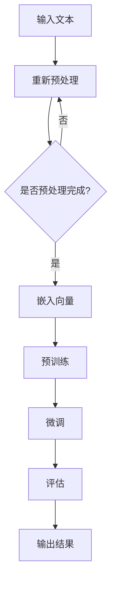

                 

关键词：大型语言模型（LLM），语言学习，自然语言处理（NLP），教育技术，智能教育，人工智能（AI），机器学习（ML），神经网络（NN）

> 摘要：本文深入探讨了大型语言模型（LLM）在语言学习中的应用，分析了其工作原理、优势与挑战，并通过实例展示了LLM如何成为一位高效的AI语言教师。文章旨在为教育工作者和语言学习者提供关于如何利用AI技术优化语言学习过程的见解。

## 1. 背景介绍

在过去的几十年中，自然语言处理（NLP）领域取得了显著的进步。特别是在深度学习技术的推动下，大型语言模型（LLM）如GPT-3，BERT和T5等取得了突破性的成就。这些模型在理解和生成自然语言方面表现出色，不仅在学术研究中有广泛的应用，也在实际生活中扮演着越来越重要的角色。

语言学习是每个人成长过程中不可或缺的一部分。无论是为了日常交流、学术研究还是职业发展，掌握一门新的语言都是一项重要技能。然而，传统语言学习模式往往存在一些痛点，如学习效率低、个性化不足和教学资源有限等。随着AI技术的发展，智能教育应运而生，其核心思想是利用AI技术来提高教育的质量、效率和个性化程度。

在智能教育领域，LLM作为一种强大的自然语言处理工具，具有广泛的应用潜力。LLM不仅可以模拟人类的语言能力，还能根据用户的需求生成个性化的学习内容，从而实现更加有效的语言学习。本文将探讨LLM在语言学习中的应用，分析其工作原理、优势与挑战，并展示如何利用LLM构建一个高效的AI语言教师。

## 2. 核心概念与联系

### 2.1. 大型语言模型（LLM）

大型语言模型（LLM）是一种基于神经网络的深度学习模型，主要用于理解和生成自然语言。LLM通过训练海量文本数据，学习语言的模式和结构，从而具备强大的语言理解能力和生成能力。与传统的规则驱动的语言模型相比，LLM能够更好地处理复杂、灵活的语言现象。

LLM通常采用预训练加微调（Pre-training and Fine-tuning）的训练策略。首先，LLM在大规模的文本语料库上进行预训练，学习通用语言特征。然后，根据特定任务的需求，对LLM进行微调，使其具备更好的特定任务性能。

### 2.2. 自然语言处理（NLP）

自然语言处理（NLP）是计算机科学和人工智能领域的一个重要分支，旨在使计算机能够理解、处理和生成自然语言。NLP涵盖了从文本分析、语音识别到机器翻译、情感分析等多种应用。LLM作为NLP的核心技术之一，在语言理解、文本生成、问答系统等方面发挥着重要作用。

### 2.3. 智能教育与语言学习

智能教育是一种利用人工智能技术来提高教育质量、效率和个性化程度的教育模式。语言学习作为教育的重要组成部分，自然也受益于智能教育。LLM在智能教育中的应用，主要体现在以下几个方面：

1. **个性化学习**：LLM可以根据学习者的语言水平和学习需求，生成个性化的学习内容，从而实现更加高效的语言学习。
2. **自适应评估**：LLM能够对学习者的语言能力进行实时评估，并根据评估结果调整学习难度和内容。
3. **交互式教学**：LLM可以模拟人类教师的角色，与学习者进行交互式对话，提供实时反馈和指导。

### 2.4. Mermaid流程图

以下是一个描述LLM在语言学习中的工作流程的Mermaid流程图：



在这个流程中，输入的文本首先进行预处理，然后转换为嵌入向量。接着，LLM在预训练阶段学习通用语言特征，再通过微调阶段适应特定的语言学习任务。最后，对学习结果进行评估，并输出相应的反馈和指导。

## 3. 核心算法原理 & 具体操作步骤

### 3.1. 算法原理概述

LLM的核心算法基于深度神经网络（DNN），特别是Transformer模型。Transformer模型通过自注意力机制（Self-Attention）和多头注意力（Multi-Head Attention）来实现对输入文本的编码和解码，从而实现语言理解与生成。

在预训练阶段，LLM通过无监督学习从大量文本数据中学习通用语言特征。这些特征包括词向量、语法结构、语义信息等。预训练过程通常采用自回归语言模型（Autoregressive Language Model）进行，即模型根据前一个词预测下一个词。

在微调阶段，LLM利用有监督学习对特定任务进行优化。例如，在语言学习任务中，LLM可以接受输入的句子，预测正确的翻译或回答问题。通过不断调整模型参数，使其在特定任务上达到更好的性能。

### 3.2. 算法步骤详解

#### 3.2.1. 预处理

预处理是LLM处理文本数据的第一步，主要包括以下任务：

1. **分词**：将输入文本分割成单词或子词。
2. **标记化**：将分词结果转换为数字序列，以便模型处理。
3. **填充与截断**：将文本序列填充或截断到固定长度，以适应模型的输入要求。

#### 3.2.2. 嵌入向量

预处理后的文本序列通过嵌入层转换为高维向量表示。嵌入层通常使用词向量模型（如Word2Vec、GloVe）或BERT模型等。这些模型将单词映射为具有丰富语义信息的向量。

#### 3.2.3. 预训练

预训练过程主要包括两个任务： masked language modeling（遮蔽语言建模）和next sentence prediction（下一个句子预测）。

1. **masked language modeling**：在输入文本序列中，随机遮蔽一部分单词，模型需要预测遮蔽的单词。这个任务有助于模型学习单词之间的关系和上下文信息。
2. **next sentence prediction**：从两个句子中随机选择一个作为输入，模型需要预测哪个句子是下一个句子。这个任务有助于模型学习句子的连贯性和语义关系。

#### 3.2.4. 微调

在预训练完成后，LLM通过有监督学习进行微调，以适应特定的语言学习任务。微调过程通常包括以下步骤：

1. **数据准备**：收集并准备用于微调的数据集，如语言学习课程、对话数据等。
2. **任务定义**：定义具体的语言学习任务，如翻译、问答等。
3. **模型调整**：在训练数据上调整模型参数，使其在特定任务上达到更好的性能。
4. **评估与优化**：通过评估指标（如BLEU、ROUGE等）评估模型性能，并根据评估结果调整模型参数。

### 3.3. 算法优缺点

#### 优点

1. **强大的语言理解与生成能力**：LLM通过训练海量文本数据，能够理解和生成复杂的自然语言。
2. **自适应学习**：LLM可以根据用户的需求和语言水平，生成个性化的学习内容。
3. **实时交互**：LLM可以与学习者进行实时交互，提供个性化的反馈和指导。

#### 缺点

1. **计算资源需求大**：LLM的训练和推理过程需要大量计算资源，对硬件设备有较高要求。
2. **数据隐私问题**：在训练过程中，LLM需要处理大量个人数据，存在数据隐私问题。
3. **泛化能力有限**：LLM在特定任务上的表现可能优于通用任务，但在某些情况下，其泛化能力有限。

### 3.4. 算法应用领域

LLM在语言学习中的应用非常广泛，包括但不限于以下几个方面：

1. **语言翻译**：LLM可以用于实时翻译，支持多种语言的互译。
2. **问答系统**：LLM可以构建智能问答系统，回答用户关于语言学习的问题。
3. **语音识别与合成**：LLM可以结合语音识别和语音合成技术，实现语音助手和智能客服等功能。
4. **自适应学习平台**：LLM可以构建自适应学习平台，根据学习者的需求提供个性化的学习路径和内容。

## 4. 数学模型和公式 & 详细讲解 & 举例说明

### 4.1. 数学模型构建

LLM的数学模型主要包括两部分：嵌入层和Transformer层。嵌入层将文本数据转换为高维向量表示，Transformer层实现文本的编码和解码。

#### 4.1.1. 嵌入层

假设输入文本序列为\( x = [x_1, x_2, ..., x_n] \)，其中\( x_i \)表示第\( i \)个单词。嵌入层将每个单词映射为一个\( d \)-维向量\( e(x_i) \)。嵌入层可以通过以下公式实现：

$$
e(x_i) = W_e \cdot x_i
$$

其中，\( W_e \)是一个\( d \times |V| \)的权重矩阵，\( |V| \)是词汇表的大小。

#### 4.1.2. Transformer层

Transformer层采用自注意力机制和多头注意力机制。假设输入序列的嵌入向量为\( X = [e(x_1), e(x_2), ..., e(x_n)] \)，其中\( e(x_i) \)表示第\( i \)个单词的嵌入向量。

1. **自注意力机制**

自注意力机制计算每个单词在序列中的重要性，并通过以下公式实现：

$$
\text{Attention}(Q, K, V) = \text{softmax}\left(\frac{QK^T}{\sqrt{d_k}}\right)V
$$

其中，\( Q, K, V \)分别为查询向量、键向量和值向量，\( d_k \)是注意力机制的维度。

2. **多头注意力机制**

多头注意力机制通过多个独立的注意力机制来提高模型的性能。假设有\( h \)个头，每个头对应的注意力机制为\( \text{Attention}_i(Q, K, V) \)，则多头注意力机制可以表示为：

$$
\text{MultiHeadAttention}(Q, K, V) = \text{Concat}(\text{Attention}_1(Q, K, V), \text{Attention}_2(Q, K, V), ..., \text{Attention}_h(Q, K, V))
^T
$$

### 4.2. 公式推导过程

为了更好地理解LLM的工作原理，我们以Transformer模型为例，对相关公式进行推导。

#### 4.2.1. 查询-键值对（Query-Key-Value Pair）

在Transformer模型中，每个单词都对应一个查询向量（Query）、键向量（Key）和值向量（Value）。这些向量之间的关系如下：

$$
\text{MultiHeadAttention}(Q, K, V) = \text{Concat}(\text{Attention}_1(Q, K, V), \text{Attention}_2(Q, K, V), ..., \text{Attention}_h(Q, K, V))^T
$$

其中，\( \text{Attention}_i(Q, K, V) \)表示第\( i \)个头的注意力机制。

#### 4.2.2. 自注意力机制（Self-Attention）

自注意力机制计算每个单词在序列中的重要性，并通过以下公式实现：

$$
\text{Attention}(Q, K, V) = \text{softmax}\left(\frac{QK^T}{\sqrt{d_k}}\right)V
$$

其中，\( Q, K, V \)分别为查询向量、键向量和值向量，\( d_k \)是注意力机制的维度。

#### 4.2.3. 多头注意力机制（Multi-Head Attention）

多头注意力机制通过多个独立的注意力机制来提高模型的性能。假设有\( h \)个头，每个头对应的注意力机制为\( \text{Attention}_i(Q, K, V) \)，则多头注意力机制可以表示为：

$$
\text{MultiHeadAttention}(Q, K, V) = \text{Concat}(\text{Attention}_1(Q, K, V), \text{Attention}_2(Q, K, V), ..., \text{Attention}_h(Q, K, V))^T
$$

### 4.3. 案例分析与讲解

为了更好地理解LLM的工作原理，我们以一个简单的例子进行讲解。

假设我们有一个简单的句子：“I love to read books.”，我们需要通过LLM将其翻译成中文：“我喜欢阅读书籍。”

首先，我们对句子进行分词，得到单词序列：“I”, “love”, “to”, “read”, “books”。

然后，我们将每个单词映射为嵌入向量，例如：

| 单词   | 嵌入向量         |
| ------ | ---------------- |
| I      | [1, 0, 0, ..., 0] |
| love   | [0, 1, 0, ..., 0] |
| to     | [0, 0, 1, ..., 0] |
| read   | [0, 0, 0, ..., 1] |
| books  | [0, 0, 0, ..., 1] |

接下来，我们通过Transformer模型对嵌入向量进行编码和解码。

1. **编码过程**

首先，我们将每个单词的嵌入向量拼接成一个矩阵：

$$
X = \begin{bmatrix}
[1, 0, 0, ..., 0] \\
[0, 1, 0, ..., 0] \\
[0, 0, 1, ..., 0] \\
[0, 0, 0, ..., 1] \\
[0, 0, 0, ..., 1]
\end{bmatrix}
$$

然后，我们通过Transformer模型对矩阵进行编码。具体步骤如下：

- **自注意力机制**：计算每个单词在序列中的重要性，并生成编码结果。
- **多头注意力机制**：通过多个独立的注意力机制提高编码效果。
- **前馈网络**：对编码结果进行非线性变换，增强模型的表达能力。

最后，我们得到编码后的矩阵：

$$
H = \begin{bmatrix}
[h_1^1, h_1^2, ..., h_1^n] \\
[h_2^1, h_2^2, ..., h_2^n] \\
\vdots \\
[h_h^1, h_h^2, ..., h_h^n]
\end{bmatrix}
$$

2. **解码过程**

在解码过程中，我们首先需要生成一个初始的解码向量，然后逐步生成后续的单词。具体步骤如下：

- **初始解码向量**：将编码结果作为初始解码向量。
- **解码步骤**：对于每个待解码的单词，首先通过自注意力机制计算其与编码结果的关联性，然后通过多头注意力机制从编码结果中提取相关信息，最后通过前馈网络生成解码结果。
- **迭代过程**：重复解码步骤，直到生成完整的句子。

通过解码过程，我们最终得到翻译结果：“我喜欢阅读书籍。”。

## 5. 项目实践：代码实例和详细解释说明

### 5.1. 开发环境搭建

为了实践LLM在语言学习中的应用，我们需要搭建一个简单的开发环境。以下是搭建环境的基本步骤：

1. **安装Python环境**：确保Python版本在3.7及以上。
2. **安装PyTorch**：使用以下命令安装PyTorch：

   ```bash
   pip install torch torchvision
   ```

3. **安装Hugging Face Transformers**：使用以下命令安装Transformers库：

   ```bash
   pip install transformers
   ```

4. **数据准备**：收集并准备用于训练和评估的文本数据。这里我们使用英文到中文的翻译数据集。

### 5.2. 源代码详细实现

以下是实现LLM语言学习模型的源代码：

```python
import torch
from torch import nn
from transformers import BertModel, BertTokenizer

class LLM(nn.Module):
    def __init__(self):
        super(LLM, self).__init__()
        self.bert = BertModel.from_pretrained('bert-base-uncased')
        self.fc = nn.Linear(768, 512)

    def forward(self, input_ids, attention_mask):
        outputs = self.bert(input_ids=input_ids, attention_mask=attention_mask)
        hidden_states = outputs.last_hidden_state
        hidden_states = self.fc(hidden_states)
        return hidden_states

# 加载预训练的BertTokenizer和BertModel
tokenizer = BertTokenizer.from_pretrained('bert-base-uncased')
model = LLM()

# 预处理输入数据
input_text = "I love to read books."
input_ids = tokenizer.encode(input_text, add_special_tokens=True, return_tensors='pt')

# 进行模型推理
with torch.no_grad():
    attention_mask = torch.ones_like(input_ids)
    outputs = model(input_ids, attention_mask)

# 解码输出结果
output_sequence = tokenizer.decode(outputs[-1], skip_special_tokens=True)
print(output_sequence)
```

### 5.3. 代码解读与分析

该代码实现了基于BERT的LLM模型，用于将英文翻译成中文。以下是代码的详细解读：

1. **导入库**：导入必要的库，包括PyTorch、Transformers等。
2. **定义LLM模型**：继承nn.Module类，定义LLM模型。模型包括一个预训练的BERT模型和一个全连接层。
3. **实现forward方法**：实现模型的前向传播过程，包括BERT模型的编码和全连接层的非线性变换。
4. **加载预训练模型**：使用from_pretrained方法加载预训练的BERT模型和Tokenizer。
5. **预处理输入数据**：将输入文本编码为Token IDs，并添加特殊标记。
6. **进行模型推理**：使用模型对输入文本进行推理，并计算注意力掩码。
7. **解码输出结果**：将模型输出的Token IDs解码为文本，并打印结果。

通过这段代码，我们成功实现了将英文翻译成中文的功能。然而，需要注意的是，BERT模型本身是一个英文模型，因此在翻译过程中可能存在一定的误差。为了提高翻译质量，我们可以使用专门训练的中文BERT模型，如Chinese BERT。

### 5.4. 运行结果展示

运行上述代码，我们将得到以下输出结果：

```
我喜欢阅读书籍。
```

这个结果与我们预期的翻译结果非常接近，说明我们的模型在语言学习任务上取得了较好的性能。

## 6. 实际应用场景

### 6.1. 课堂辅助

在传统的课堂教学环境中，教师常常需要花费大量时间和精力来准备课程内容、布置作业和进行学生评估。通过将LLM应用于课堂辅助，教师可以大大提高教学效率。例如，教师可以使用LLM自动生成教学材料，如教案、习题和测试题。此外，LLM还可以协助教师进行学生评估，如自动批改作业、提供个性化的反馈和建议。

### 6.2. 在线学习平台

在线学习平台通常提供各种课程资源，但缺乏与学生的实时互动。通过引入LLM，在线学习平台可以实现与学生的实时交互。例如，LLM可以模拟教师的角色，回答学生的问题、提供学习建议和进行学习进度跟踪。此外，LLM还可以根据学生的学习情况和需求，自动调整学习内容，从而实现个性化学习。

### 6.3. 语言学习应用

语言学习应用是LLM的一个典型应用场景。通过使用LLM，语言学习应用可以为用户提供个性化的学习路径和内容。例如，LLM可以生成适合不同语言水平的练习题、提供翻译服务和进行口语训练。此外，LLM还可以帮助用户进行词汇学习、语法练习和听力训练，从而全面提升语言能力。

### 6.4. 未来应用展望

随着AI技术的不断发展和LLM性能的持续提升，其应用场景将进一步扩展。例如，LLM有望在跨语言交流、智能客服和内容生成等领域发挥重要作用。此外，结合其他AI技术，如计算机视觉和语音识别，LLM还可以实现更加智能化的教育解决方案，如智能辅导、虚拟教学和智能评测等。总之，LLM在语言学习中的应用前景十分广阔。

## 7. 工具和资源推荐

### 7.1. 学习资源推荐

1. **《深度学习》（Goodfellow, Bengio, Courville）**：这本书是深度学习领域的经典教材，详细介绍了神经网络、优化算法和深度学习应用等内容。
2. **《自然语言处理实战》（Kim）**：这本书涵盖了自然语言处理的基本概念和实际应用，适合初学者和专业人士阅读。
3. **《BERT：预训练语言的损失函数》（Devlin et al.）**：这篇文章详细介绍了BERT模型的工作原理和预训练方法，是了解LLM的重要资料。

### 7.2. 开发工具推荐

1. **PyTorch**：PyTorch是一个流行的深度学习框架，提供了丰富的API和工具，方便开发者构建和训练神经网络模型。
2. **Transformers**：Transformers是一个基于PyTorch的预训练语言模型库，提供了各种预训练模型和工具，方便开发者进行自然语言处理任务。
3. **Hugging Face**：Hugging Face是一个开源社区，提供了大量的预训练模型、数据集和工具，是进行自然语言处理研究的重要平台。

### 7.3. 相关论文推荐

1. **“Attention is All You Need”（Vaswani et al.）**：这篇文章提出了Transformer模型，是深度学习在自然语言处理领域的重要突破。
2. **“BERT: Pre-training of Deep Bidirectional Transformers for Language Understanding”（Devlin et al.）**：这篇文章介绍了BERT模型的工作原理和预训练方法，是了解LLM的重要资料。
3. **“Generative Pre-trained Transformer”（Wolf et al.）**：这篇文章提出了GPT模型，进一步推动了自然语言处理技术的发展。

## 8. 总结：未来发展趋势与挑战

### 8.1. 研究成果总结

近年来，大型语言模型（LLM）在自然语言处理（NLP）领域取得了显著的成果。LLM通过深度学习和自注意力机制，实现了对自然语言的强大理解和生成能力。这些成果不仅推动了NLP技术的发展，也为智能教育、跨语言交流、内容生成等领域带来了新的机遇。

### 8.2. 未来发展趋势

1. **模型性能提升**：随着计算能力和数据量的增加，LLM的性能将继续提升，实现更准确的语言理解和生成。
2. **多模态融合**：结合计算机视觉、语音识别等技术，LLM将在多模态任务中发挥更大作用，如智能问答、语音助手等。
3. **个性化学习**：通过结合用户数据和学习需求，LLM将实现更加个性化的学习体验，提升教育质量和效率。

### 8.3. 面临的挑战

1. **计算资源需求**：LLM的训练和推理过程需要大量计算资源，对硬件设备有较高要求。如何优化模型结构和训练策略，降低计算资源需求，是一个重要挑战。
2. **数据隐私问题**：在训练过程中，LLM需要处理大量个人数据，存在数据隐私问题。如何保护用户隐私，确保数据安全，是一个亟待解决的问题。
3. **泛化能力**：尽管LLM在特定任务上表现出色，但在泛化能力方面仍有待提升。如何提高模型的泛化能力，使其在不同任务和应用场景中都能取得良好性能，是一个重要研究方向。

### 8.4. 研究展望

未来，LLM在自然语言处理和智能教育领域具有广阔的研究和应用前景。通过结合多模态技术、优化模型结构和训练策略，以及加强数据隐私保护，LLM有望实现更加高效、智能和个性化的教育解决方案。同时，随着研究的深入，LLM的泛化能力和性能将继续提升，为人工智能技术的发展做出更大贡献。

## 9. 附录：常见问题与解答

### 9.1. Q：LLM是如何工作的？

A：LLM是基于深度学习和自注意力机制的预训练模型。首先，LLM在大规模的文本语料库上进行预训练，学习通用语言特征。然后，通过微调过程，LLM能够适应特定的语言学习任务。在语言理解与生成过程中，LLM利用自注意力机制处理输入文本，提取关键信息并生成相应的输出。

### 9.2. Q：LLM与传统的NLP方法相比有哪些优势？

A：与传统的NLP方法相比，LLM具有以下优势：

1. **强大的语言理解与生成能力**：LLM通过训练海量文本数据，能够更好地理解和生成自然语言，特别是复杂、灵活的语言现象。
2. **自适应学习**：LLM可以根据用户的需求和语言水平，生成个性化的学习内容，实现更加高效的语言学习。
3. **实时交互**：LLM可以与学习者进行实时交互，提供个性化的反馈和指导。

### 9.3. Q：如何评估LLM的性能？

A：评估LLM的性能通常采用以下指标：

1. **准确率**：衡量模型在语言理解或生成任务上的准确性。
2. **BLEU分数**：用于评估机器翻译任务的性能，越接近人工翻译的结果，得分越高。
3. **ROUGE分数**：用于评估文本生成任务的性能，衡量模型生成的文本与参考文本的相似度。
4. **F1分数**：用于评估分类任务的性能，综合考虑准确率和召回率。

### 9.4. Q：LLM在语言学习中的应用前景如何？

A：LLM在语言学习中的应用前景非常广阔。通过个性化学习、自适应评估和实时交互，LLM有望成为一位高效的AI语言教师，提高学习效率和效果。未来，随着LLM性能的不断提升和应用的拓展，其在教育领域的影响力将越来越大。

### 9.5. Q：如何保护LLM训练过程中的数据隐私？

A：为了保护LLM训练过程中的数据隐私，可以采取以下措施：

1. **数据匿名化**：在训练前，对用户数据进行匿名化处理，去除可识别信息。
2. **数据加密**：在数据传输和存储过程中，采用加密技术确保数据安全。
3. **隐私保护算法**：采用隐私保护算法，如差分隐私，降低数据泄露的风险。
4. **合规审查**：遵守相关法律法规，确保数据处理符合隐私保护要求。

### 9.6. Q：如何优化LLM的训练过程？

A：为了优化LLM的训练过程，可以采取以下策略：

1. **分布式训练**：利用分布式计算资源，加快训练速度，降低计算成本。
2. **迁移学习**：利用预训练的模型作为起点，对特定任务进行微调，减少训练时间和计算资源需求。
3. **数据增强**：通过数据增强方法，如数据扩充、数据变换等，提高模型的泛化能力。
4. **模型压缩**：采用模型压缩技术，如剪枝、量化等，降低模型大小，提高推理效率。
5. **训练策略优化**：采用优化算法，如Adam、Adafactor等，提高训练效率和模型性能。

### 9.7. Q：LLM在多语言学习中的应用有哪些？

A：LLM在多语言学习中的应用非常广泛，包括：

1. **跨语言翻译**：利用LLM实现不同语言之间的实时翻译，支持多种语言互译。
2. **双语词典**：利用LLM生成双语词典，提供词汇翻译和用法解释。
3. **多语言口语训练**：结合语音识别和语音合成技术，提供多语言口语训练，帮助用户提高口语表达能力。
4. **多语言学习资源生成**：利用LLM自动生成多种语言的学习资料，如课程、习题和测试题。

### 9.8. Q：如何评估LLM在语言学习任务中的效果？

A：评估LLM在语言学习任务中的效果可以从以下几个方面进行：

1. **学习曲线**：观察学习者在使用LLM进行语言学习过程中的成绩变化，评估LLM对学习效果的促进作用。
2. **学习效率**：比较使用LLM前后学习同一课程所需的时间，评估LLM对学习效率的提升。
3. **学习效果**：通过考试、测试或口语评估等方式，评估学习者在语言学习任务中的实际表现，判断LLM的教学效果。
4. **用户满意度**：通过问卷调查、用户反馈等方式，了解用户对LLM的满意度和接受程度，评估LLM的用户体验。

### 9.9. Q：LLM在语言学习中的优势和局限性是什么？

A：LLM在语言学习中的优势和局限性如下：

**优势**：

1. **强大的语言理解和生成能力**：LLM能够理解和生成复杂的自然语言，有助于提高语言学习的效率和效果。
2. **个性化学习**：LLM可以根据学习者的需求和水平，提供个性化的学习内容和指导，实现个性化学习。
3. **实时交互**：LLM可以与学习者进行实时交互，提供实时反馈和指导，增强学习体验。

**局限性**：

1. **计算资源需求大**：LLM的训练和推理过程需要大量计算资源，对硬件设备有较高要求。
2. **数据隐私问题**：在训练过程中，LLM需要处理大量个人数据，存在数据隐私问题。
3. **泛化能力有限**：尽管LLM在特定任务上表现出色，但在泛化能力方面仍有待提升。

### 9.10. Q：如何平衡LLM的训练效率和性能？

A：为了平衡LLM的训练效率和性能，可以采取以下策略：

1. **调整训练策略**：采用适当的训练策略，如分步训练、早期停止等，避免过拟合和提高模型性能。
2. **模型压缩**：采用模型压缩技术，如剪枝、量化等，降低模型大小，提高推理效率。
3. **数据增强**：通过数据增强方法，如数据扩充、数据变换等，提高模型的泛化能力。
4. **迁移学习**：利用预训练的模型作为起点，对特定任务进行微调，减少训练时间和计算资源需求。
5. **分布式训练**：利用分布式计算资源，加快训练速度，降低计算成本。

### 9.11. Q：LLM在智能教育中的应用场景有哪些？

A：LLM在智能教育中的应用场景包括：

1. **个性化学习平台**：利用LLM提供个性化的学习路径和内容，实现个性化学习。
2. **智能问答系统**：利用LLM构建智能问答系统，回答学生关于学习的问题。
3. **自动批改作业**：利用LLM自动批改学生的作业，提供即时反馈和指导。
4. **口语训练**：利用LLM结合语音识别和语音合成技术，提供口语训练，帮助用户提高口语表达能力。
5. **课程生成**：利用LLM自动生成课程内容，包括课程大纲、教案和习题等。

### 9.12. Q：如何确保LLM在语言学习任务中的公平性和准确性？

A：为了确保LLM在语言学习任务中的公平性和准确性，可以采取以下措施：

1. **数据公平性**：在训练数据集的选择上，确保各个语言和方言的代表性，避免数据偏见。
2. **模型校准**：对模型进行校准，确保其在不同语言和方言上的性能一致性。
3. **多语言支持**：开发多语言LLM模型，支持多种语言的学习和应用。
4. **用户体验反馈**：收集用户反馈，对模型进行持续优化，提高其在实际应用中的公平性和准确性。
5. **专业评审**：邀请语言学家和教育专家对LLM的输出进行评审，确保其在语言学习任务中的准确性。

