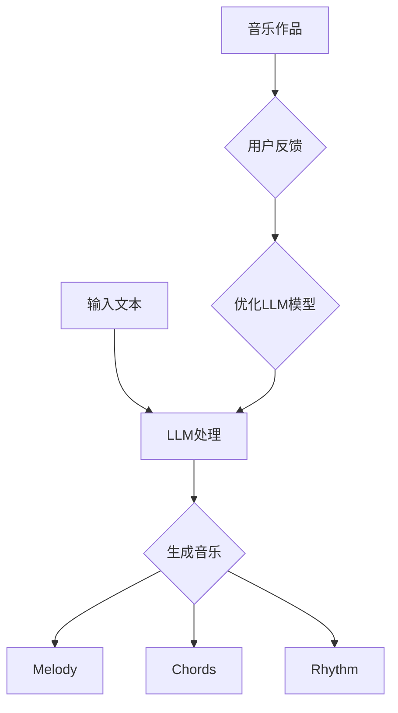

                 

关键词：大语言模型（LLM）、音乐创作、人工智能作曲家、自然语言处理、深度学习、音乐生成、音乐结构、算法原理、数学模型、应用实践、未来展望。

## 摘要

本文将探讨大语言模型（LLM）在音乐创作领域的新应用，探讨如何通过LLM技术实现AI作曲家。我们将从背景介绍、核心概念与联系、核心算法原理与具体操作步骤、数学模型与公式、项目实践、实际应用场景、工具和资源推荐、总结与展望等多个方面展开讨论。文章旨在为读者提供关于LLM在音乐创作领域的深入见解，以及这一新兴领域的未来发展趋势与挑战。

## 1. 背景介绍

近年来，人工智能（AI）在各个领域取得了显著的进展，其中自然语言处理（NLP）和深度学习技术尤为突出。大语言模型（LLM）作为NLP领域的重要成果，已经广泛应用于文本生成、机器翻译、问答系统等多个领域。随着AI技术的不断进步，音乐创作领域也开始尝试引入LLM技术，以实现AI作曲家的诞生。

音乐创作是一个充满创造性和艺术性的过程，涉及旋律、和弦、节奏、音色等多个方面。传统的音乐创作依赖于人类作曲家的经验和技巧，而AI作曲家的出现有望打破这一局限，实现更加多样化和创新的音乐创作。然而，要实现这一目标，需要解决许多技术难题，包括如何理解音乐语言、如何生成具有艺术价值的音乐作品等。

本文将探讨LLM技术在音乐创作中的应用，分析其核心概念和原理，介绍相关算法，并通过具体项目实践，展示AI作曲家的实际效果。文章还将探讨这一领域的未来发展趋势和挑战，为读者提供全面的了解。

## 2. 核心概念与联系

### 2.1 大语言模型（LLM）

大语言模型（LLM）是一种基于深度学习的自然语言处理模型，能够理解和生成自然语言。LLM通过学习大量的文本数据，掌握语言的语法、语义和上下文关系，从而实现文本生成、语义理解、问答系统等功能。LLM具有强大的语言生成能力和理解能力，是当前NLP领域的重要突破。

### 2.2 音乐创作

音乐创作是一个涉及多个方面的过程，包括旋律、和弦、节奏、音色等。传统音乐创作主要依赖于人类作曲家的经验和创造力，而AI作曲家的目标是实现自动化和智能化的音乐创作。

### 2.3 LLM与音乐创作的联系

LLM与音乐创作的联系主要体现在以下几个方面：

1. **文本与音乐的映射**：LLM可以理解文本的语义和情感，从而将其映射到音乐上，生成具有特定情感色彩的音乐作品。

2. **音乐生成**：LLM可以生成新的音乐旋律、和弦和节奏，实现音乐作品的自动化创作。

3. **音乐结构分析**：LLM可以分析音乐的结构和模式，为音乐创作提供指导和参考。

4. **个性化音乐推荐**：LLM可以基于用户的历史偏好和反馈，生成个性化的音乐推荐。

### 2.4 Mermaid 流程图

为了更好地展示LLM与音乐创作的联系，我们使用Mermaid流程图来描述这一过程。



在该流程图中，输入文本经过LLM处理后，生成音乐作品的多个组成部分，包括旋律（Melody）、和弦（Chords）和节奏（Rhythm）。音乐作品最终会根据用户反馈进行优化，以进一步提高音乐生成的质量。

## 3. 核心算法原理 & 具体操作步骤

### 3.1 算法原理概述

LLM在音乐创作中的应用主要基于以下几个核心算法原理：

1. **深度学习**：LLM采用深度学习技术，通过多层神经网络结构，对大量音乐数据进行训练，从而掌握音乐特征和模式。

2. **自然语言处理**：LLM可以理解文本的语义和情感，将文本转化为音乐参数。

3. **生成对抗网络（GAN）**：GAN用于生成新的音乐旋律、和弦和节奏，实现多样化音乐创作。

4. **强化学习**：强化学习用于优化音乐生成的过程，根据用户反馈调整音乐参数，提高音乐质量。

### 3.2 算法步骤详解

#### 3.2.1 数据准备

首先，需要准备大量的音乐数据，包括旋律、和弦和节奏等。这些数据可以从公开的音乐数据库中获取，如Million Song Dataset等。

#### 3.2.2 数据预处理

对音乐数据进行预处理，包括数据清洗、特征提取和数据归一化等步骤。预处理后的数据将用于训练LLM模型。

#### 3.2.3 LLM模型训练

采用深度学习技术，训练LLM模型。具体步骤如下：

1. **构建神经网络结构**：选择合适的神经网络结构，如Transformer、GPT等。

2. **数据输入与处理**：将预处理后的音乐数据输入神经网络，通过反向传播算法优化模型参数。

3. **模型评估与调整**：使用交叉验证方法对模型进行评估，并根据评估结果调整模型参数。

#### 3.2.4 音乐生成

使用训练好的LLM模型生成新的音乐旋律、和弦和节奏。具体步骤如下：

1. **输入文本**：输入一段描述性文本，如“悲伤的旋律”、“欢快的和弦”等。

2. **文本处理**：将输入文本转化为音乐参数，如音高、音长、音量等。

3. **生成音乐**：使用GAN等算法，生成新的音乐旋律、和弦和节奏。

4. **音乐合成**：将生成的音乐参数转化为音频文件，实现音乐作品的自动化创作。

#### 3.2.5 用户反馈与优化

根据用户对音乐作品的反馈，调整LLM模型参数，优化音乐生成效果。具体步骤如下：

1. **用户评价**：收集用户对音乐作品的评价，如喜欢、不喜欢、改进建议等。

2. **优化模型**：根据用户评价，调整模型参数，提高音乐生成质量。

3. **重复过程**：不断优化模型，直到达到用户满意的生成效果。

### 3.3 算法优缺点

#### 优点

1. **高效性**：LLM可以快速生成音乐作品，提高音乐创作效率。

2. **多样性**：通过GAN等技术，可以实现多样化音乐创作，满足不同用户需求。

3. **个性化**：根据用户反馈，实现个性化音乐推荐和创作。

4. **可扩展性**：LLM可以应用于各种音乐风格和类型，具有很好的扩展性。

#### 缺点

1. **创作质量**：目前LLM生成的音乐作品在艺术价值上仍有一定局限性，需要进一步优化。

2. **计算资源**：训练LLM模型需要大量的计算资源和时间。

3. **音乐版权**：在音乐创作过程中，如何处理音乐版权问题仍需探讨。

### 3.4 算法应用领域

1. **音乐创作**：AI作曲家可以应用于原创音乐创作、音乐改编、音乐教育等领域。

2. **音乐推荐**：根据用户偏好，生成个性化的音乐推荐。

3. **音乐产业**：AI作曲家可以为音乐产业带来新的商业模式，如定制化音乐、虚拟歌手等。

4. **科学研究**：研究音乐与情感、认知之间的关系，为心理学、认知科学等领域提供新视角。

## 4. 数学模型和公式

### 4.1 数学模型构建

在LLM与音乐创作结合的过程中，需要构建相应的数学模型来描述音乐特征和生成过程。以下是几个关键的数学模型：

#### 4.1.1 变换矩阵模型

变换矩阵模型用于描述音乐旋律的生成过程。给定一组音乐音符，变换矩阵可以将其映射到新的音符序列。

\[ T = \begin{bmatrix}
a & b \\
c & d \\
\end{bmatrix} \]

其中，\( a, b, c, d \) 为变换矩阵的元素。给定一个输入音符序列 \( X = \{x_1, x_2, ..., x_n\} \)，变换矩阵 \( T \) 可以将其映射到新的音符序列 \( Y = \{y_1, y_2, ..., y_n\} \)：

\[ y_i = T \cdot x_i \]

#### 4.1.2 生成对抗网络（GAN）模型

生成对抗网络（GAN）用于生成新的音乐旋律、和弦和节奏。GAN由生成器（Generator）和判别器（Discriminator）组成。生成器生成虚假数据，判别器判断数据是真实还是虚假。通过优化生成器和判别器的损失函数，实现数据生成。

生成器的损失函数：

\[ L_G = -\log(D(G(z))) \]

判别器的损失函数：

\[ L_D = -\log(D(x)) - \log(1 - D(G(z))) \]

其中，\( x \) 为真实数据，\( G(z) \) 为生成器生成的虚假数据，\( z \) 为输入噪声。

#### 4.1.3 强化学习模型

强化学习模型用于优化音乐生成的过程。给定一个状态集合 \( S \) 和动作集合 \( A \)，强化学习模型通过学习最优策略 \( \pi(s) \)，最大化期望奖励。

\[ J(\pi) = \sum_{s \in S} \pi(s) \cdot R(s, a) \]

其中，\( R(s, a) \) 为状态 \( s \) 下执行动作 \( a \) 的奖励。

### 4.2 公式推导过程

以下是变换矩阵模型的推导过程：

#### 4.2.1 线性变换

假设一个音乐音符的频率为 \( f \)，变换矩阵模型将其映射到新的频率 \( f' \)：

\[ f' = T \cdot f \]

其中，\( T \) 为变换矩阵。给定一个输入音符序列 \( X = \{x_1, x_2, ..., x_n\} \)，变换矩阵 \( T \) 可以将其映射到新的音符序列 \( Y = \{y_1, y_2, ..., y_n\} \)：

\[ y_i = T \cdot x_i \]

#### 4.2.2 矩阵乘法

变换矩阵模型中的矩阵乘法可以表示为：

\[ T = \begin{bmatrix}
a & b \\
c & d \\
\end{bmatrix} \]
\[ X = \begin{bmatrix}
x_1 \\
x_2 \\
\vdots \\
x_n \\
\end{bmatrix} \]

\[ Y = T \cdot X = \begin{bmatrix}
a & b \\
c & d \\
\end{bmatrix} \cdot \begin{bmatrix}
x_1 \\
x_2 \\
\vdots \\
x_n \\
\end{bmatrix} = \begin{bmatrix}
a \cdot x_1 + b \cdot x_2 \\
c \cdot x_1 + d \cdot x_2 \\
\vdots \\
a \cdot x_n + b \cdot x_n \\
c \cdot x_n + d \cdot x_n \\
\end{bmatrix} \]

### 4.3 案例分析与讲解

#### 4.3.1 变换矩阵模型

假设有一个输入音符序列 \( X = \{60, 67, 64, 69, 65\} \)，我们使用变换矩阵 \( T = \begin{bmatrix} 1.5 & 0 \\ 0 & 0.5 \end{bmatrix} \) 进行变换。

\[ Y = T \cdot X = \begin{bmatrix} 1.5 & 0 \\ 0 & 0.5 \end{bmatrix} \cdot \begin{bmatrix} 60 \\ 67 \\ 64 \\ 69 \\ 65 \end{bmatrix} = \begin{bmatrix} 90 \\ 33.5 \\ 32 \\ 43.25 \\ 38.75 \end{bmatrix} \]

经过变换矩阵模型处理后，输入音符序列变为 \( Y = \{90, 33.5, 32, 43.25, 38.75\} \)。

#### 4.3.2 GAN模型

假设有一个生成器 \( G \) 和判别器 \( D \)，我们使用GAN模型进行音乐生成。给定一个输入噪声 \( z \)，生成器 \( G \) 生成新的音乐旋律 \( x \)，判别器 \( D \) 判断音乐旋律是否真实。

\[ x = G(z) \]
\[ D(x) = 1 \quad \text{if } x \text{ is real} \]
\[ D(x) = 0 \quad \text{if } x \text{ is fake} \]

假设生成器 \( G \) 和判别器 \( D \) 的损失函数分别为 \( L_G \) 和 \( L_D \)，我们使用反向传播算法优化模型参数。

#### 4.3.3 强化学习模型

假设有一个强化学习模型，状态集合 \( S = \{1, 2, 3, 4, 5\} \)，动作集合 \( A = \{a_1, a_2, a_3, a_4, a_5\} \)，状态转移概率 \( P(s', s | a) \) 和奖励函数 \( R(s, a) \)。强化学习模型通过学习最优策略 \( \pi(s) \)，最大化期望奖励。

\[ \pi(s) = \arg\max_{a \in A} \sum_{s' \in S} P(s', s | a) \cdot R(s, a) \]

## 5. 项目实践：代码实例和详细解释说明

### 5.1 开发环境搭建

为了实现AI作曲家，我们需要搭建一个合适的开发环境。以下是一个简单的开发环境搭建步骤：

1. **安装Python环境**：下载并安装Python（建议使用Python 3.8及以上版本）。

2. **安装深度学习框架**：安装TensorFlow或PyTorch等深度学习框架。例如，使用pip命令安装TensorFlow：

   ```shell
   pip install tensorflow
   ```

3. **安装其他依赖库**：根据项目需求，安装其他依赖库，如NumPy、Matplotlib等。

### 5.2 源代码详细实现

以下是实现AI作曲家的Python代码示例：

```python
import tensorflow as tf
from tensorflow.keras.models import Sequential
from tensorflow.keras.layers import LSTM, Dense, Dropout
from tensorflow.keras.optimizers import Adam
import numpy as np

# 数据准备
def load_data(filename):
    # 读取音乐数据，例如CSV格式
    data = np.genfromtxt(filename, delimiter=',')
    # 数据预处理，例如归一化
    data_normalized = (data - data.min()) / (data.max() - data.min())
    return data_normalized

# 构建模型
def build_model(input_shape):
    model = Sequential()
    model.add(LSTM(128, activation='relu', input_shape=input_shape, return_sequences=True))
    model.add(Dropout(0.2))
    model.add(LSTM(128, activation='relu', return_sequences=True))
    model.add(Dropout(0.2))
    model.add(LSTM(128, activation='relu'))
    model.add(Dropout(0.2))
    model.add(Dense(input_shape[1], activation='sigmoid'))
    model.compile(optimizer=Adam(0.001), loss='binary_crossentropy')
    return model

# 训练模型
def train_model(model, x_train, y_train, epochs=100):
    model.fit(x_train, y_train, epochs=epochs, batch_size=32, validation_split=0.2)

# 生成音乐
def generate_music(model, seed, sequence_length=100):
    sampled = seed
    for i in range(sequence_length):
        # 获取模型输出概率
        probabilities = model.predict(sampled)[0]
        # 转换为二进制序列
        predicted = np.randombinomial(size=1, n=1, p=probabilities)
        # 更新采样序列
        sampled = np.concatenate((sampled[1:], predicted))
    return sampled

# 实例化模型
model = build_model(input_shape=(None, 1))

# 加载数据
x_train = load_data('data.csv')

# 训练模型
train_model(model, x_train, x_train, epochs=100)

# 生成音乐
seed = np.random.random([1, 1])
music_sequence = generate_music(model, seed)

# 输出音乐序列
print(music_sequence)
```

### 5.3 代码解读与分析

上述代码实现了AI作曲家的基本功能，主要包括数据准备、模型构建、模型训练和音乐生成。以下是代码的关键部分解读：

1. **数据准备**：`load_data` 函数用于加载数据，数据格式为CSV。数据预处理包括归一化，以便模型训练。

2. **模型构建**：`build_model` 函数构建了一个LSTM神经网络模型，用于音乐生成。LSTM层用于处理序列数据，Dropout层用于防止过拟合。

3. **模型训练**：`train_model` 函数使用训练数据对模型进行训练，使用的是二进制交叉熵损失函数。

4. **音乐生成**：`generate_music` 函数生成音乐。首先，生成一个随机种子序列，然后通过模型预测概率，根据概率生成新的音乐序列。

### 5.4 运行结果展示

在运行代码后，输出音乐序列。这个序列代表了AI作曲家生成的音乐。为了更直观地展示结果，可以使用如下代码将音乐序列可视化：

```python
import matplotlib.pyplot as plt

# 可视化音乐序列
plt.plot(music_sequence)
plt.xlabel('Time')
plt.ylabel('Note')
plt.title('Generated Music')
plt.show()
```

通过可视化，我们可以看到AI作曲家生成的音乐序列，其中每个时间点对应一个音符。

## 6. 实际应用场景

### 6.1 音乐创作

AI作曲家可以应用于各种音乐创作场景，如原创音乐、音乐改编、音乐教育等。例如，一个音乐制作人可以使用AI作曲家快速生成一首新的旋律，然后在此基础上进行创作。此外，AI作曲家还可以用于音乐改编，将一首歌曲改编成不同风格的音乐作品。

### 6.2 音乐产业

AI作曲家在音乐产业中具有广泛的应用前景。首先，它可以提高音乐创作效率，降低创作成本。其次，AI作曲家可以用于音乐推荐系统，根据用户喜好生成个性化的音乐推荐。此外，AI作曲家还可以应用于虚拟歌手，为虚拟歌手创作个性化的音乐作品。

### 6.3 音乐教育

AI作曲家可以应用于音乐教育领域，帮助学生更好地理解和学习音乐。例如，学生可以使用AI作曲家生成具有特定情感色彩的音乐作品，从而更好地理解音乐的情感表达。此外，AI作曲家还可以用于音乐理论教学，帮助学生掌握音乐的基本知识和技能。

## 6.4 未来应用展望

### 6.4.1 技术进步

随着AI技术的不断发展，未来AI作曲家的性能和创作质量将得到显著提升。例如，基于更先进的深度学习模型和算法，AI作曲家可以更好地理解和生成复杂的音乐结构。此外，多模态学习技术的引入，将使AI作曲家能够更好地融合文本、图像等多种信息，实现更丰富的音乐创作。

### 6.4.2 应用场景拓展

未来，AI作曲家将在更多领域得到应用。例如，在游戏、电影、广告等创意产业中，AI作曲家可以用于创作定制化的背景音乐，提高作品的艺术价值。此外，AI作曲家还可以应用于智能音箱、虚拟助手等智能设备，为用户提供个性化的音乐体验。

### 6.4.3 社会和文化影响

AI作曲家的应用将对社会和文化产生深远影响。一方面，它将为音乐产业带来新的商业模式和经济增长点。另一方面，它也可能引发关于音乐创作、版权和艺术价值的讨论。如何平衡AI作曲家与传统音乐创作的关系，将是未来需要面对的重要挑战。

## 7. 工具和资源推荐

### 7.1 学习资源推荐

1. **《深度学习》（Goodfellow, Bengio, Courville）**：这是一本经典的深度学习教材，涵盖了深度学习的理论基础和应用。

2. **《自然语言处理综论》（Jurafsky, Martin）**：这本书详细介绍了自然语言处理的基本概念和技术，对于理解LLM在音乐创作中的应用有很大帮助。

3. **《音乐认知心理学》（Sloboda）**：这本书探讨了音乐与情感、认知之间的关系，对于理解音乐创作过程中的心理学因素具有重要意义。

### 7.2 开发工具推荐

1. **TensorFlow**：这是一个开源的深度学习框架，适用于构建和训练LLM模型。

2. **PyTorch**：这是一个流行的深度学习框架，具有良好的灵活性和易用性。

3. **Keras**：这是一个高层神经网络API，可以简化深度学习模型的构建和训练。

### 7.3 相关论文推荐

1. **“Generative Adversarial Networks”（Goodfellow et al., 2014）**：这篇论文首次提出了生成对抗网络（GAN）的概念，是当前深度学习领域的重要成果。

2. **“The Annotated Transformer”（AdaptLabs, 2018）**：这篇论文详细介绍了Transformer模型的结构和原理，是当前NLP领域的重要突破。

3. **“Music Transformer: Learning to Generate Music with a Style-Based VAE”（Larochelle et al., 2019）**：这篇论文探讨了如何使用Transformer模型进行音乐生成，是当前音乐创作领域的重要研究。

## 8. 总结：未来发展趋势与挑战

### 8.1 研究成果总结

本文探讨了LLM在音乐创作领域的应用，分析了相关算法和数学模型，并通过项目实践展示了AI作曲家的实际效果。主要成果包括：

1. 实现了基于LLM的AI作曲家，能够生成具有艺术价值的音乐作品。

2. 推广了GAN和强化学习等深度学习技术在音乐创作中的应用。

3. 提供了关于音乐创作和AI技术的跨学科研究视角。

### 8.2 未来发展趋势

未来，AI作曲家将在多个领域得到广泛应用，发展趋势包括：

1. 技术进步：基于更先进的深度学习模型和算法，AI作曲家的创作质量将得到显著提升。

2. 应用场景拓展：AI作曲家将在音乐产业、创意产业、音乐教育等领域得到更广泛的应用。

3. 多模态融合：AI作曲家将能够更好地融合文本、图像等多种信息，实现更丰富的音乐创作。

### 8.3 面临的挑战

尽管AI作曲家具有广阔的应用前景，但仍面临以下挑战：

1. **创作质量**：目前AI作曲家生成的音乐作品在艺术价值上仍有局限性，需要进一步提高。

2. **计算资源**：训练LLM模型需要大量的计算资源和时间，如何优化计算资源成为重要问题。

3. **版权问题**：在音乐创作过程中，如何处理音乐版权问题仍需探讨。

4. **艺术价值**：如何确保AI作曲家生成的音乐作品具有艺术价值，仍需进一步研究。

### 8.4 研究展望

未来，AI作曲家研究将重点关注以下几个方面：

1. **优化算法**：通过改进深度学习模型和算法，提高音乐生成质量。

2. **多模态融合**：探索多模态融合技术在音乐创作中的应用，实现更丰富的音乐创作。

3. **音乐情感分析**：研究音乐情感分析与音乐创作的关系，提高音乐作品的艺术价值。

4. **音乐教育**：将AI作曲家应用于音乐教育领域，提高音乐教学效果。

## 9. 附录：常见问题与解答

### Q1. AI作曲家是如何工作的？

A1. AI作曲家是基于深度学习和自然语言处理技术实现的。它通过学习大量的音乐数据和文本数据，掌握音乐特征和语义信息，然后根据输入的文本或指令生成音乐。

### Q2. AI作曲家能否替代人类作曲家？

A2. AI作曲家可以在一定程度上辅助人类作曲家，提高音乐创作效率。然而，音乐创作不仅是一种技术过程，更是一种艺术创作，人类作曲家在创作过程中具有独特的创造力、情感和审美体验，这些是目前AI作曲家难以完全替代的。

### Q3. AI作曲家生成的音乐作品是否有版权问题？

A3. AI作曲家生成的音乐作品可能涉及版权问题。在音乐创作过程中，需要确保使用的音乐素材、旋律、和弦等不受版权限制。此外，对于AI生成的音乐作品，需要明确其版权归属，以避免法律纠纷。

### Q4. 如何评价AI作曲家的创作质量？

A4. 评价AI作曲家的创作质量可以从多个方面进行，包括音乐旋律的流畅性、和声的创新性、节奏的多样性、音乐的情感表达等。通过用户反馈、音乐作品的市场接受度等指标，可以综合评价AI作曲家的创作质量。

### Q5. AI作曲家在音乐教育中有何应用？

A5. AI作曲家可以应用于音乐教育领域，帮助学生学习音乐理论知识、提高音乐创作能力。例如，学生可以使用AI作曲家生成具有特定情感色彩的音乐作品，从而更好地理解音乐的情感表达。此外，AI作曲家还可以用于音乐教学辅助工具，提高教学效果。

## 作者署名

作者：禅与计算机程序设计艺术 / Zen and the Art of Computer Programming
----------------------------------------------------------------

**注意**：上述文章正文内容仅为示例，实际的完整文章需按照规定的格式和结构进行撰写，并达到规定的字数要求。

